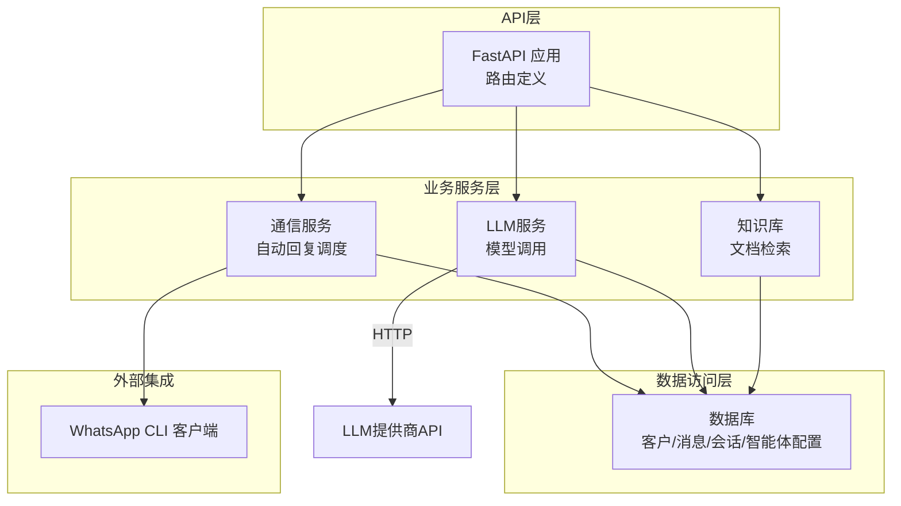
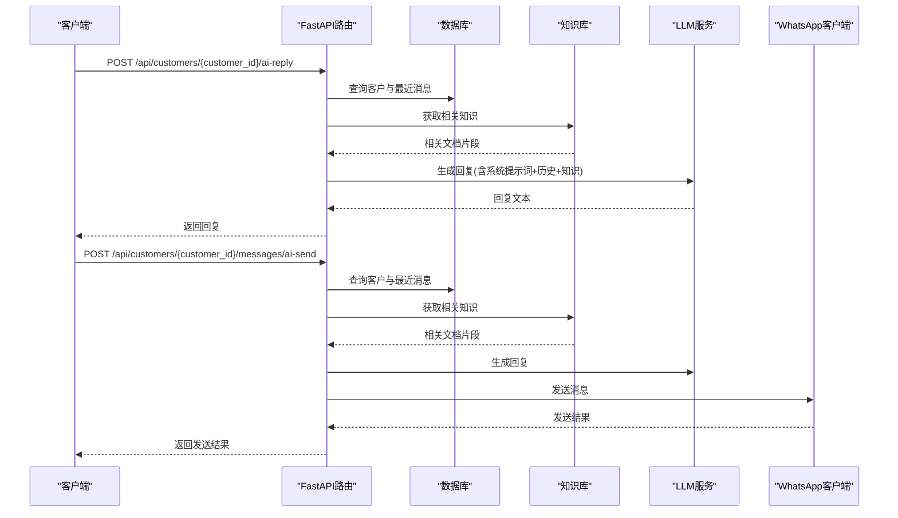
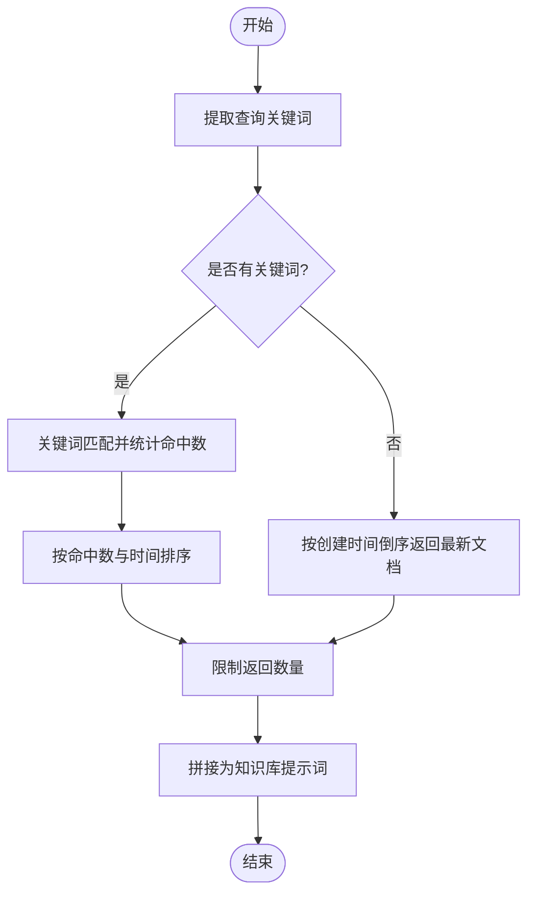
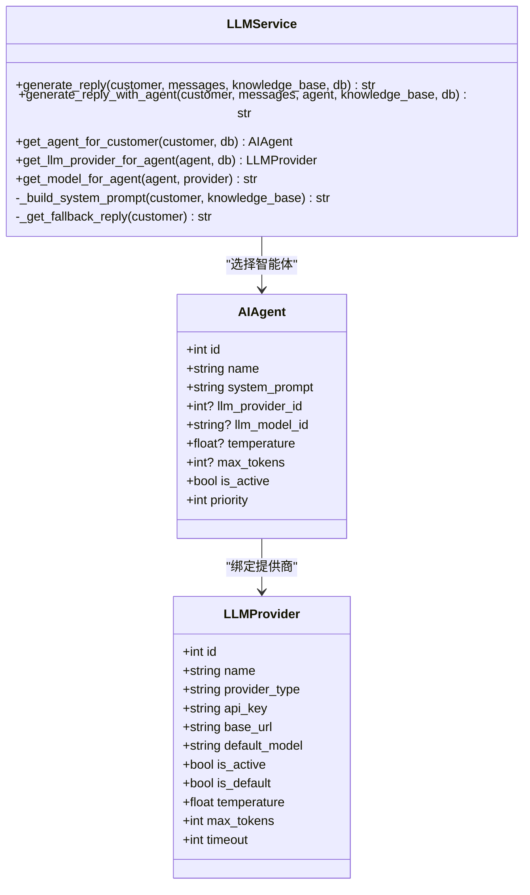
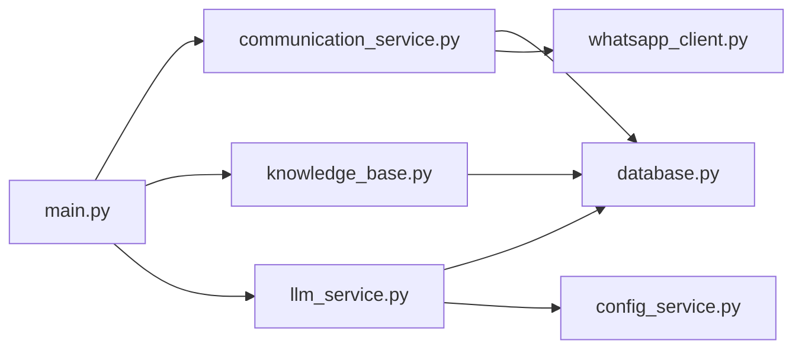

# AI回复API

<cite>
**本文档引用的文件**
- [main.py](file://backend/main.py)
- [llm_service.py](file://backend/llm_service.py)
- [knowledge_base.py](file://backend/knowledge_base.py)
- [communication_service.py](file://backend/communication_service.py)
- [database.py](file://backend/database.py)
- [config_service.py](file://backend/config_service.py)
- [whatsapp_client.py](file://backend/whatsapp_client.py)
</cite>

## 目录
1. [简介](#简介)
2. [项目结构](#项目结构)
3. [核心组件](#核心组件)
4. [架构总览](#架构总览)
5. [详细组件分析](#详细组件分析)
6. [依赖关系分析](#依赖关系分析)
7. [性能考虑](#性能考虑)
8. [故障排除指南](#故障排除指南)
9. [结论](#结论)
10. [附录](#附录)

## 简介
本文件面向WhatsApp智能客户的AI回复API，重点覆盖以下端点：
- 生成AI回复：POST /api/customers/{customer_id}/ai-reply
- 生成并发送AI回复：POST /api/customers/{customer_id}/messages/ai-send

文档将详细说明AI回复的生成流程（历史消息获取、知识库检索、大语言模型调用、回复生成）、知识库相关性检索机制、回复质量控制策略，并提供使用场景、最佳实践、请求响应示例、技术细节与性能优化建议。

## 项目结构
后端采用FastAPI框架，核心模块围绕“消息处理—知识库—大模型—WhatsApp客户端”展开，形成闭环的自动回复体系。

图表来源
- [main.py:725-796](file://backend/main.py#L725-L796)
- [communication_service.py:17-512](file://backend/communication_service.py#L17-L512)
- [llm_service.py:11-286](file://backend/llm_service.py#L11-L286)
- [knowledge_base.py:11-212](file://backend/knowledge_base.py#L11-L212)
- [database.py:23-297](file://backend/database.py#L23-L297)
- [whatsapp_client.py:13-437](file://backend/whatsapp_client.py#L13-L437)

章节来源
- [main.py:128-158](file://backend/main.py#L128-L158)
- [database.py:23-297](file://backend/database.py#L23-L297)

## 核心组件
- FastAPI应用与路由：提供REST接口，包含认证、客户管理、消息、会话、知识库、AI回复等端点。
- 通信服务：负责自动回复的触发、智能体选择、转人工处理、通知机制。
- LLM服务：封装大模型调用，支持多提供商、多模型、温度与token上限配置、智能体系统提示词注入。
- 知识库：基于SQLite的文档与关键词索引，提供相关性检索。
- 数据库：定义客户、消息、会话、智能体、提供商、标签等模型。
- WhatsApp客户端：封装whatsapp-cli命令，负责消息发送与JID解析。

章节来源
- [main.py:725-796](file://backend/main.py#L725-L796)
- [communication_service.py:17-512](file://backend/communication_service.py#L17-L512)
- [llm_service.py:11-286](file://backend/llm_service.py#L11-L286)
- [knowledge_base.py:11-212](file://backend/knowledge_base.py#L11-L212)
- [database.py:23-297](file://backend/database.py#L23-L297)
- [whatsapp_client.py:13-437](file://backend/whatsapp_client.py#L13-L437)

## 架构总览
AI回复API的端到端流程如下：

图表来源
- [main.py:725-796](file://backend/main.py#L725-L796)
- [llm_service.py:86-198](file://backend/llm_service.py#L86-L198)
- [knowledge_base.py:130-141](file://backend/knowledge_base.py#L130-L141)
- [whatsapp_client.py:133-154](file://backend/whatsapp_client.py#L133-L154)

## 详细组件分析

### AI回复生成端点（/api/customers/{customer_id}/ai-reply）
- 功能：仅生成AI回复，不自动发送。
- 流程：
  1) 校验客户是否存在。
  2) 查询该客户最近N条消息（默认10条）。
  3) 通过知识库检索与消息主题相关的文档片段。
  4) 调用LLM服务生成回复。
  5) 返回回复文本。
- 关键实现位置：
  - 路由定义与调用链：[main.py:725-750](file://backend/main.py#L725-L750)
  - 历史消息查询与知识库检索：[main.py:734-744](file://backend/main.py#L734-L744)
  - LLM生成调用：[main.py:746-747](file://backend/main.py#L746-L747)

章节来源
- [main.py:725-750](file://backend/main.py#L725-L750)

### AI回复发送端点（/api/customers/{customer_id}/messages/ai-send）
- 功能：生成并发送AI回复。
- 流程：
  1) 校验客户是否存在。
  2) 查询最近消息与知识库相关文档。
  3) 生成回复。
  4) 通过WhatsApp客户端发送消息至客户JID。
  5) 记录出站消息到数据库。
  6) 返回发送结果与内容。
- 关键实现位置：
  - 路由定义与调用链：[main.py:752-796](file://backend/main.py#L752-L796)
  - 历史消息与知识库检索：[main.py:759-768](file://backend/main.py#L759-L768)
  - LLM生成与发送：[main.py:771-772](file://backend/main.py#L771-L772)、[main.py:778-779](file://backend/main.py#L778-L779)
  - 数据库记录：[main.py:783-791](file://backend/main.py#L783-L791)

章节来源
- [main.py:752-796](file://backend/main.py#L752-L796)

### 历史消息获取与上下文构建
- 最近N条消息（默认10条）按时间倒序取出，再反转以保证时间顺序。
- 将消息方向映射为对话角色（incoming→user，outgoing→assistant），构建对话历史。
- 限制最近10条消息，平衡上下文长度与性能。

章节来源
- [main.py:734-737](file://backend/main.py#L734-L737)
- [llm_service.py:101-108](file://backend/llm_service.py#L101-L108)

### 知识库相关性检索机制
- 文档入库时计算内容MD5，避免重复；同时抽取关键词建立索引。
- 检索时对查询进行关键词提取，若无关键词则按时间倒序返回最新文档；否则按关键词匹配计分排序。
- 返回前K篇文档的标题与摘要片段，供LLM参考。

图表来源
- [knowledge_base.py:87-128](file://backend/knowledge_base.py#L87-L128)
- [knowledge_base.py:130-141](file://backend/knowledge_base.py#L130-L141)

章节来源
- [knowledge_base.py:11-212](file://backend/knowledge_base.py#L11-L212)

### 大语言模型调用与智能体选择
- 智能体选择：
  - 根据客户标签匹配绑定的智能体，按优先级取最高者。
  - 若无匹配标签，退回默认智能体；若仍无，默认启用首个启用的智能体。
- 系统提示词：
  - 若指定智能体，使用其系统提示词。
  - 否则构建通用系统提示词，包含客户类型与回复要求。
- LLM调用：
  - 支持多提供商与多模型，优先使用智能体/提供商配置，其次使用全局配置。
  - 超时、温度、最大token数可按智能体/提供商/默认顺序覆盖。
  - 异常时返回默认回复模板。

图表来源
- [llm_service.py:11-286](file://backend/llm_service.py#L11-L286)
- [database.py:155-244](file://backend/database.py#L155-L244)

章节来源
- [llm_service.py:25-84](file://backend/llm_service.py#L25-L84)
- [llm_service.py:177-198](file://backend/llm_service.py#L177-L198)
- [llm_service.py:200-237](file://backend/llm_service.py#L200-L237)

### 回复质量控制
- 默认回复：针对不同客户类型提供默认模板，保障基本可用性。
- 超时与异常：LLM调用失败或超时回退到默认回复。
- 上下文长度：限制最近消息条数，避免上下文过长导致性能与成本问题。
- 系统提示词：统一回复风格、字数限制与客户类型策略。

章节来源
- [llm_service.py:230-237](file://backend/llm_service.py#L230-L237)
- [llm_service.py:149-175](file://backend/llm_service.py#L149-L175)

### 与WhatsApp客户端的集成
- 发送消息：根据客户电话构造JID，优先使用CLI返回的正确JID，失败时尝试备用后缀。
- 出站消息记录：发送成功后在数据库记录一条出站消息，便于审计与后续分析。

章节来源
- [whatsapp_client.py:133-154](file://backend/whatsapp_client.py#L133-L154)
- [main.py:783-791](file://backend/main.py#L783-L791)

## 依赖关系分析
- API层依赖通信服务、知识库、LLM服务与数据库。
- 通信服务依赖数据库与WhatsApp客户端，内部协调自动回复与人工通知。
- LLM服务依赖数据库（智能体/提供商配置）、配置服务（密钥与模型参数）。
- 知识库依赖SQLite存储文档与关键词索引。
- 数据库模型支撑客户、消息、会话、智能体、提供商、标签等实体。

图表来源
- [main.py:17-26](file://backend/main.py#L17-L26)
- [communication_service.py:8-14](file://backend/communication_service.py#L8-L14)
- [llm_service.py:7-8](file://backend/llm_service.py#L7-L8)
- [knowledge_base.py:14-17](file://backend/knowledge_base.py#L14-L17)
- [config_service.py:14-22](file://backend/config_service.py#L14-L22)
- [whatsapp_client.py:16-19](file://backend/whatsapp_client.py#L16-L19)

章节来源
- [main.py:17-26](file://backend/main.py#L17-L26)
- [communication_service.py:8-14](file://backend/communication_service.py#L8-L14)
- [llm_service.py:7-8](file://backend/llm_service.py#L7-L8)
- [knowledge_base.py:14-17](file://backend/knowledge_base.py#L14-L17)
- [config_service.py:14-22](file://backend/config_service.py#L14-L22)
- [whatsapp_client.py:16-19](file://backend/whatsapp_client.py#L16-L19)

## 性能考虑
- 消息历史窗口：限制最近10条消息，兼顾上下文完整性与性能。
- 知识库检索：关键词匹配+命中计数排序，避免全表扫描；返回固定数量文档片段。
- LLM调用：统一超时控制与异常回退，避免阻塞；可按提供商/智能体配置优化模型与参数。
- 数据库：使用SQLite，适合中小规模部署；注意I/O瓶颈，必要时引入连接池与索引优化。
- 实时同步：消息轮询间隔可调，避免过于频繁导致资源占用。

章节来源
- [llm_service.py:132-135](file://backend/llm_service.py#L132-L135)
- [llm_service.py:149-175](file://backend/llm_service.py#L149-L175)
- [knowledge_base.py:87-128](file://backend/knowledge_base.py#L87-L128)
- [whatsapp_client.py:366-398](file://backend/whatsapp_client.py#L366-L398)

## 故障排除指南
- LLM调用失败：
  - 检查API密钥、提供商基础URL与模型ID配置。
  - 查看超时设置与网络连通性。
  - 观察回退机制是否生效（默认回复模板）。
- WhatsApp发送失败：
  - 检查JID格式与CLI登录状态。
  - 尝试备用JID后缀重试。
- 知识库检索无结果：
  - 确认文档已添加且关键词提取正常。
  - 调整查询关键词或增加文档数量。
- 自动回复未触发：
  - 检查会话状态与转人工条件。
  - 确认事件循环与异步调用路径。

章节来源
- [llm_service.py:166-175](file://backend/llm_service.py#L166-L175)
- [whatsapp_client.py:133-154](file://backend/whatsapp_client.py#L133-L154)
- [knowledge_base.py:130-141](file://backend/knowledge_base.py#L130-L141)
- [communication_service.py:47-71](file://backend/communication_service.py#L47-L71)

## 结论
AI回复API通过“历史消息+知识库+智能体系统提示词”的组合，结合多提供商/模型配置与异常回退机制，实现了稳定高效的自动回复能力。配合WhatsApp客户端与数据库，形成从消息接收、智能回复到消息发送与记录的完整闭环。建议在生产环境中持续优化知识库内容、调优LLM参数，并建立人工审核与反馈机制以提升回复质量。

## 附录

### 使用场景与最佳实践
- 场景
  - 新客户欢迎与引导
  - 意向客户快速答疑
  - 老客户日常维护与关怀
- 最佳实践
  - 为不同客户类型配置专用智能体与系统提示词
  - 定期更新知识库文档，确保相关性
  - 控制回复长度与语气，保持一致性
  - 对高风险/复杂问题设置人工审核通道
  - 监控LLM调用耗时与成功率，及时告警

### 请求与响应示例（路径引用）
- 生成AI回复
  - 请求：POST /api/customers/{customer_id}/ai-reply
  - 成功响应字段：success、reply
  - 参考实现：[main.py:725-750](file://backend/main.py#L725-L750)
- 生成并发送AI回复
  - 请求：POST /api/customers/{customer_id}/messages/ai-send
  - 成功响应字段：success、message、content
  - 参考实现：[main.py:752-796](file://backend/main.py#L752-L796)

### 技术细节
- 历史消息窗口：最近10条
- 知识库返回：最多3篇文档片段
- LLM超时：可配置（提供商/智能体/默认）
- 默认回复：按客户类型选择模板

章节来源
- [main.py:725-796](file://backend/main.py#L725-L796)
- [llm_service.py:132-135](file://backend/llm_service.py#L132-L135)
- [llm_service.py:230-237](file://backend/llm_service.py#L230-L237)
- [knowledge_base.py:130-141](file://backend/knowledge_base.py#L130-L141)