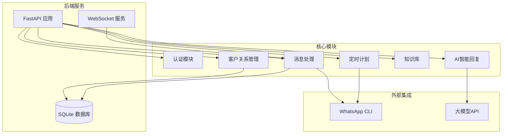
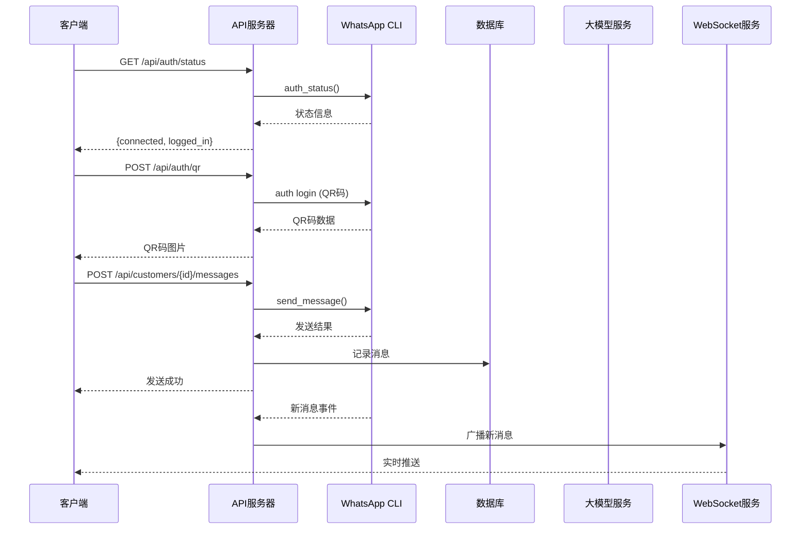
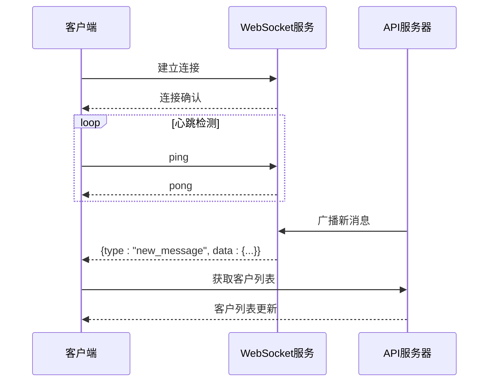
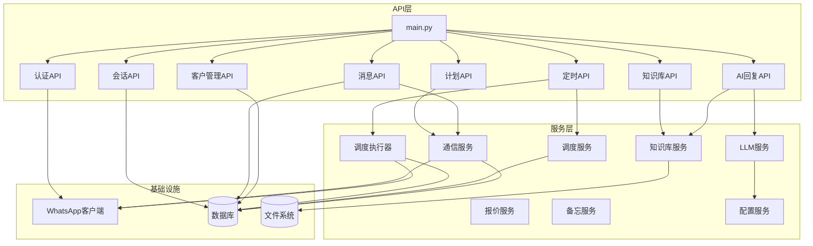

# API接口文档

<cite>
**本文档引用的文件**
- [backend/main.py](file://backend/main.py)
- [backend/whatsapp_client.py](file://backend/whatsapp_client.py)
- [backend/communication_service.py](file://backend/communication_service.py)
- [backend/knowledge_base.py](file://backend/knowledge_base.py)
- [backend/llm_service.py](file://backend/llm_service.py)
- [backend/database.py](file://backend/database.py)
- [backend/qr_terminal.py](file://backend/qr_terminal.py)
- [backend/quotation_service.py](file://backend/quotation_service.py)
- [backend/memo_service.py](file://backend/memo_service.py)
- [backend/config_service.py](file://backend/config_service.py)
- [backend/scheduler_service.py](file://backend/scheduler_service.py)
- [backend/schedule_runner.py](file://backend/schedule_runner.py)
- [backend/static/index.html](file://backend/static/index.html)
- [backend/static/admin.html](file://backend/static/admin.html)
</cite>

## 目录
1. [简介](#简介)
2. [项目结构](#项目结构)
3. [核心组件](#核心组件)
4. [架构总览](#架构总览)
5. [详细组件分析](#详细组件分析)
6. [依赖关系分析](#依赖关系分析)
7. [性能考虑](#性能考虑)
8. [故障排除指南](#故障排除指南)
9. [结论](#结论)
10. [附录](#附录)

## 简介
本项目是一个基于 WhatsApp CLI 的智能客户关系管理系统，提供 RESTful API 和 WebSocket 实时通信能力。系统支持客户管理、消息收发、会话管理、AI智能回复、知识库管理、定时发送计划等功能，并提供完整的认证流程（QR码登录、退出登录、联系人同步）。

## 项目结构
系统采用 FastAPI 构建后端服务，前端使用静态页面，核心模块包括：



**图表来源**
- [backend/main.py:128-157](file://backend/main.py#L128-L157)
- [backend/whatsapp_client.py:13-26](file://backend/whatsapp_client.py#L13-L26)

**章节来源**
- [backend/main.py:128-157](file://backend/main.py#L128-L157)
- [backend/database.py:10-20](file://backend/database.py#L10-L20)

## 核心组件
系统包含以下核心组件：

### 认证组件
- QR码登录管理
- WhatsApp账户状态检查
- 登出处理
- 联系人同步

### 客户关系管理
- 客户信息CRUD
- 客户分类管理
- 客户标签系统
- 会话状态管理

### 消息处理
- 消息收发
- 历史消息查询
- 实时消息推送
- 自动回复机制

### AI智能回复
- 多智能体支持
- 知识库集成
- 个性化回复
- 转人工处理

### 知识库管理
- 文档增删改查
- 关键词检索
- 相关性匹配

### 定时发送计划
- 发送计划创建
- 任务队列管理
- 执行状态跟踪

**章节来源**
- [backend/main.py:196-381](file://backend/main.py#L196-L381)
- [backend/communication_service.py:17-512](file://backend/communication_service.py#L17-L512)
- [backend/knowledge_base.py:11-212](file://backend/knowledge_base.py#L11-L212)

## 架构总览



**图表来源**
- [backend/main.py:196-381](file://backend/main.py#L196-L381)
- [backend/whatsapp_client.py:82-154](file://backend/whatsapp_client.py#L82-L154)
- [backend/communication_service.py:47-71](file://backend/communication_service.py#L47-L71)

## 详细组件分析

### 认证API

#### 获取登录状态
- **方法**: GET
- **路径**: `/api/auth/status`
- **功能**: 检查WhatsApp连接状态
- **响应**: 
  - `connected`: 是否连接
  - `logged_in`: 是否已登录
  - `database`: 数据库状态信息

#### 获取QR码登录
- **方法**: POST
- **路径**: `/api/auth/qr`
- **功能**: 启动QR码登录流程
- **响应**:
  - `success`: 操作是否成功
  - `qr_image`: QR码图片(base64)
  - `message`: 状态描述

#### 获取QR码状态
- **方法**: GET
- **路径**: `/api/auth/qr/status`
- **功能**: 查询QR码捕获状态
- **响应**:
  - `is_running`: 是否在登录中
  - `has_qr`: 是否已捕获QR码
  - `qr_image`: QR码图片

#### 取消登录
- **方法**: POST
- **路径**: `/api/auth/qr/cancel`
- **功能**: 取消当前登录进程
- **响应**:
  - `success`: 操作是否成功
  - `message`: 结果描述

#### 退出登录
- **方法**: POST
- **路径**: `/api/auth/logout`
- **功能**: 退出当前WhatsApp账户
- **响应**:
  - `success`: 操作是否成功
  - `message`: 结果描述

#### 同步联系人
- **方法**: POST
- **路径**: `/api/auth/sync-contacts`
- **功能**: 同步WhatsApp联系人到系统
- **响应**:
  - `success`: 操作是否成功
  - `new_customers`: 新增客户列表
  - `updated_customers`: 更新客户列表
  - `total_contacts`: 联系人总数

**章节来源**
- [backend/main.py:196-381](file://backend/main.py#L196-L381)
- [backend/qr_terminal.py:14-297](file://backend/qr_terminal.py#L14-L297)

### 客户管理API

#### 获取客户列表
- **方法**: GET
- **路径**: `/api/customers`
- **查询参数**:
  - `category`: 客户分类(new/lead/returning)
  - `status`: 客户状态(active/pending/closed)
- **响应**: 客户信息数组，包含标签信息

#### 获取客户详情
- **方法**: GET
- **路径**: `/api/customers/{customer_id}`
- **路径参数**:
  - `customer_id`: 客户ID
- **响应**: 客户完整信息

#### 更新客户分类
- **方法**: PUT
- **路径**: `/api/customers/{customer_id}/category`
- **路径参数**:
  - `customer_id`: 客户ID
- **请求体**:
  - `category`: 新分类
- **响应**:
  - `success`: 操作是否成功
  - `message`: 结果描述

**章节来源**
- [backend/main.py:501-581](file://backend/main.py#L501-L581)
- [backend/database.py:23-38](file://backend/database.py#L23-L38)

### 消息API

#### 获取消息历史
- **方法**: GET
- **路径**: `/api/customers/{customer_id}/messages`
- **路径参数**:
  - `customer_id`: 客户ID
- **查询参数**:
  - `limit`: 返回消息数量上限(默认50)
- **响应**: 消息历史数组

#### 发送消息
- **方法**: POST
- **路径**: `/api/customers/{customer_id}/messages`
- **路径参数**:
  - `customer_id`: 客户ID
- **请求体**:
  - `content`: 消息内容
- **响应**:
  - `success`: 发送是否成功
  - `message`: 结果描述

**章节来源**
- [backend/main.py:583-634](file://backend/main.py#L583-L634)
- [backend/database.py:41-56](file://backend/database.py#L41-L56)

### 会话管理API

#### 获取会话列表
- **方法**: GET
- **路径**: `/api/conversations`
- **查询参数**:
  - `status`: 会话状态(bot/handover/closed)
- **响应**: 会话信息数组

#### 会话接手
- **方法**: POST
- **路径**: `/api/conversations/{conversation_id}/handover`
- **路径参数**:
  - `conversation_id`: 会话ID
- **请求体**:
  - `agent_id`: 客服ID
- **响应**:
  - `success`: 操作是否成功
  - `message`: 结果描述

#### 关闭会话
- **方法**: POST
- **路径**: `/api/conversations/{conversation_id}/close`
- **路径参数**:
  - `conversation_id`: 会话ID
- **响应**:
  - `success`: 操作是否成功
  - `message`: 结果描述

**章节来源**
- [backend/main.py:636-701](file://backend/main.py#L636-L701)
- [backend/database.py:59-72](file://backend/database.py#L59-L72)

### 沟通计划API

#### 获取计划列表
- **方法**: GET
- **路径**: `/api/plans`
- **响应**: 沟通计划数组

#### 手动执行计划
- **方法**: POST
- **路径**: `/api/plans/{plan_id}/execute/{customer_id}`
- **路径参数**:
  - `plan_id`: 计划ID
  - `customer_id`: 客户ID
- **响应**:
  - `success`: 执行是否成功
  - `message`: 结果描述

**章节来源**
- [backend/main.py:703-723](file://backend/main.py#L703-L723)
- [backend/communication_service.py:363-392](file://backend/communication_service.py#L363-L392)

### AI回复API

#### 生成AI回复
- **方法**: POST
- **路径**: `/api/customers/{customer_id}/ai-reply`
- **路径参数**:
  - `customer_id`: 客户ID
- **响应**:
  - `success`: 操作是否成功
  - `reply`: 生成的回复内容

#### 发送AI回复
- **方法**: POST
- **路径**: `/api/customers/{customer_id}/messages/ai-send`
- **路径参数**:
  - `customer_id`: 客户ID
- **响应**:
  - `success`: 发送是否成功
  - `message`: 结果描述
  - `content`: 回复内容

**章节来源**
- [backend/main.py:725-796](file://backend/main.py#L725-L796)
- [backend/llm_service.py:177-198](file://backend/llm_service.py#L177-L198)

### 知识库API

#### 添加文档
- **方法**: POST
- **路径**: `/api/knowledge/documents`
- **请求体**:
  - `title`: 文档标题
  - `content`: 文档内容
  - `category`: 文档分类
- **响应**:
  - `success`: 操作是否成功
  - `message`: 结果描述
  - `doc_id`: 文档ID

#### 搜索文档
- **方法**: GET
- **路径**: `/api/knowledge/search`
- **查询参数**:
  - `q`: 搜索关键词
  - `limit`: 返回数量上限(默认5)
- **响应**: 匹配文档列表

#### 获取文档详情
- **方法**: GET
- **路径**: `/api/knowledge/documents/{doc_id}`
- **路径参数**:
  - `doc_id`: 文档ID
- **响应**: 文档详细信息

#### 删除文档
- **方法**: DELETE
- **路径**: `/api/knowledge/documents/{doc_id}`
- **路径参数**:
  - `doc_id`: 文档ID
- **响应**:
  - `success`: 操作是否成功
  - `message`: 结果描述

**章节来源**
- [backend/knowledge_base.py:51-177](file://backend/knowledge_base.py#L51-L177)

### 定时发送API

#### 创建发送计划
- **方法**: POST
- **路径**: `/api/scheduler/schedules`
- **请求体**:
  - `name`: 计划名称
  - `message_template`: 消息模板
  - `target_tags`: 目标标签列表
  - `target_category`: 客户分类筛选
  - `schedule_time`: 执行时间
  - `interval_seconds`: 发送间隔
- **响应**:
  - `success`: 操作是否成功
  - `schedule_id`: 计划ID

#### 获取计划列表
- **方法**: GET
- **路径**: `/api/scheduler/schedules`
- **查询参数**:
  - `status`: 计划状态
- **响应**: 发送计划列表

#### 获取计划详情
- **方法**: GET
- **路径**: `/api/scheduler/schedules/{schedule_id}`
- **路径参数**:
  - `schedule_id`: 计划ID
- **响应**: 计划详细信息

#### 执行计划
- **方法**: POST
- **路径**: `/api/scheduler/schedules/{schedule_id}/execute`
- **路径参数**:
  - `schedule_id`: 计划ID
- **响应**:
  - `success`: 执行是否成功
  - `message`: 结果描述

**章节来源**
- [backend/scheduler_service.py:108-212](file://backend/scheduler_service.py#L108-L212)
- [backend/schedule_runner.py:60-124](file://backend/schedule_runner.py#L60-L124)

### WebSocket API

#### 连接处理
- **路径**: `ws://localhost:8000/ws`
- **功能**: 实时推送新消息
- **客户端心跳**: 发送"ping"，接收"pong"

#### 消息格式
- **事件类型**: `new_message`
- **数据结构**:
  ```json
  {
    "type": "new_message",
    "data": {
      "customer_id": 1,
      "content": "消息内容",
      "sender_name": "发送者",
      "direction": "incoming/outgoing",
      "created_at": "2024-01-01T00:00:00Z"
    }
  }
  ```

#### 实时交互模式


**图表来源**
- [backend/main.py:160-194](file://backend/main.py#L160-L194)

**章节来源**
- [backend/main.py:160-194](file://backend/main.py#L160-L194)
- [backend/static/index.html:782-800](file://backend/static/index.html#L782-L800)

## 依赖关系分析



**图表来源**
- [backend/main.py:17-26](file://backend/main.py#L17-L26)
- [backend/communication_service.py:17-46](file://backend/communication_service.py#L17-L46)
- [backend/llm_service.py:11-24](file://backend/llm_service.py#L11-L24)

**章节来源**
- [backend/main.py:17-26](file://backend/main.py#L17-L26)
- [backend/communication_service.py:17-46](file://backend/communication_service.py#L17-L46)

## 性能考虑
1. **消息同步优化**
   - 默认1秒轮询间隔，避免过度请求
   - 消息去重机制，防止重复处理
   - 异步处理新消息，提高响应速度

2. **数据库性能**
   - 使用SQLite轻量级数据库
   - 合理的索引设计（phone、created_at等）
   - 连接池管理，避免资源泄漏

3. **WebSocket优化**
   - 心跳检测机制，及时清理断开连接
   - 批量消息推送，减少网络开销
   - 连接池管理，控制并发连接数

4. **AI回复性能**
   - 智能体缓存机制
   - 知识库预加载
   - 异步调用，避免阻塞主线程

## 故障排除指南

### 常见问题及解决方案

#### WhatsApp连接问题
- **症状**: `/api/auth/status` 返回未连接
- **解决**:
  - 检查WhatsApp CLI是否正确安装
  - 确认网络连接正常
  - 重新执行QR码登录流程

#### 消息发送失败
- **症状**: 发送消息返回500错误
- **解决**:
  - 检查WhatsApp账户状态
  - 验证客户JID格式
  - 查看系统日志获取详细错误信息

#### AI回复异常
- **症状**: AI回复生成失败
- **解决**:
  - 检查大模型API配置
  - 验证API Key有效性
  - 确认网络连接正常

#### 数据库连接问题
- **症状**: 数据库操作失败
- **解决**:
  - 检查数据库文件权限
  - 确认磁盘空间充足
  - 重启数据库服务

**章节来源**
- [backend/whatsapp_client.py:27-81](file://backend/whatsapp_client.py#L27-L81)
- [backend/llm_service.py:149-176](file://backend/llm_service.py#L149-L176)

## 结论
本系统提供了完整的WhatsApp智能客户管理解决方案，具备以下特点：

1. **功能完整性**: 覆盖客户管理、消息处理、AI回复、知识库、定时计划等核心功能
2. **实时性**: 通过WebSocket实现实时消息推送
3. **扩展性**: 模块化设计，支持插件式扩展
4. **安全性**: QR码登录、配置加密存储等安全措施
5. **易用性**: 提供直观的Web界面和RESTful API

系统适用于中小型企业客户关系管理，能够有效提升客户服务效率和满意度。

## 附录

### API使用最佳实践

#### 认证最佳实践
- 始终检查登录状态后再执行敏感操作
- 定期刷新QR码登录状态
- 合理设置登录超时时间

#### 消息处理最佳实践
- 批量获取消息时设置合理的limit值
- 实现消息去重机制
- 异步处理大量消息

#### AI回复最佳实践
- 为不同客户分类配置专门的智能体
- 定期更新知识库内容
- 监控AI回复质量指标

#### 性能优化建议
- 合理设置数据库索引
- 使用连接池管理数据库连接
- 实现缓存机制减少重复计算
- 优化WebSocket连接管理

### 错误处理规范
- 统一的错误响应格式
- 详细的错误码定义
- 日志记录和监控告警
- 用户友好的错误提示