# WebSocket实时通信API

<cite>
**本文档引用的文件**
- [main.py](file://backend/main.py)
- [whatsapp_client.py](file://backend/whatsapp_client.py)
- [communication_service.py](file://backend/communication_service.py)
- [qr_terminal.py](file://backend/qr_terminal.py)
- [start_server.py](file://start_server.py)
- [index.html](file://backend/static/index.html)
- [requirements.txt](file://backend/requirements.txt)
</cite>

## 目录
1. [简介](#简介)
2. [项目结构](#项目结构)
3. [核心组件](#核心组件)
4. [架构概览](#架构概览)
5. [详细组件分析](#详细组件分析)
6. [依赖关系分析](#依赖关系分析)
7. [性能考虑](#性能考虑)
8. [故障排除指南](#故障排除指南)
9. [结论](#结论)
10. [附录](#附录)

## 简介

WhatsApp智能客户系统的WebSocket实时通信API为前端提供了实时消息推送功能。该系统实现了基于FastAPI的WebSocket连接，支持心跳检测、消息广播和断线重连机制。通过WebSocket连接，前端可以实时接收新消息通知，实现类似即时通讯应用的用户体验。

系统的核心功能包括：
- WebSocket连接建立和管理
- 心跳检测机制（ping/pong）
- 实时消息广播（new_message事件）
- 客户端连接生命周期管理
- 断线自动重连策略
- 实时消息推送格式标准化

## 项目结构

该项目采用分层架构设计，主要包含以下核心模块：

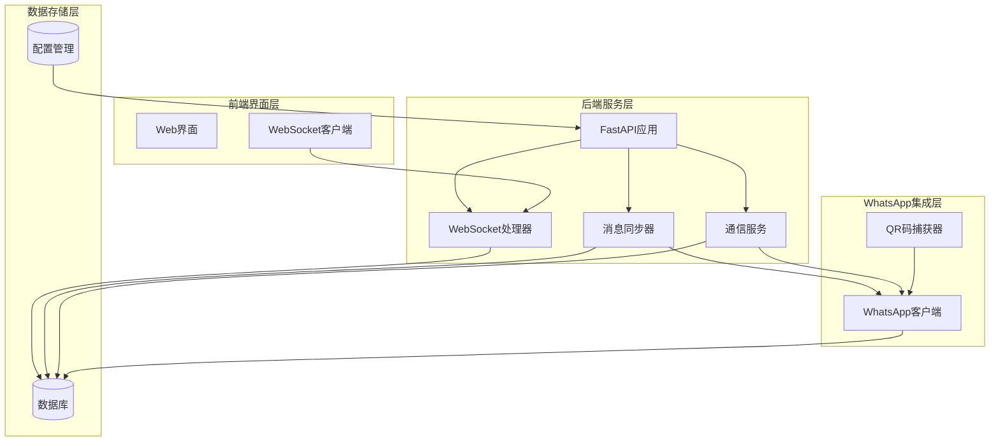

**图表来源**
- [main.py:160-194](file://backend/main.py#L160-L194)
- [whatsapp_client.py:13-437](file://backend/whatsapp_client.py#L13-L437)
- [communication_service.py:17-512](file://backend/communication_service.py#L17-L512)

**章节来源**
- [main.py:128-157](file://backend/main.py#L128-L157)
- [start_server.py:92-127](file://start_server.py#L92-L127)

## 核心组件

### WebSocket连接管理

系统实现了完整的WebSocket连接管理机制，包括连接接受、心跳检测和断线处理：

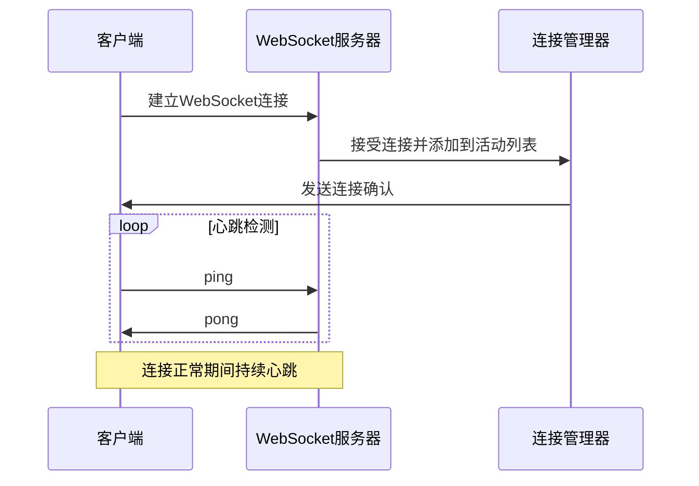

**图表来源**
- [main.py:162-176](file://backend/main.py#L162-L176)

### 消息广播机制

系统实现了高效的消息广播机制，支持向所有连接的客户端推送实时消息：

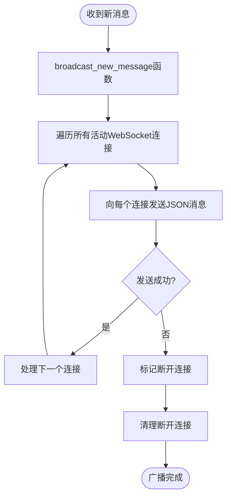

**图表来源**
- [main.py:178-194](file://backend/main.py#L178-L194)

**章节来源**
- [main.py:32-32](file://backend/main.py#L32-L32)
- [main.py:162-194](file://backend/main.py#L162-L194)

## 架构概览

系统采用事件驱动的实时通信架构，结合WhatsApp CLI的实时同步能力：

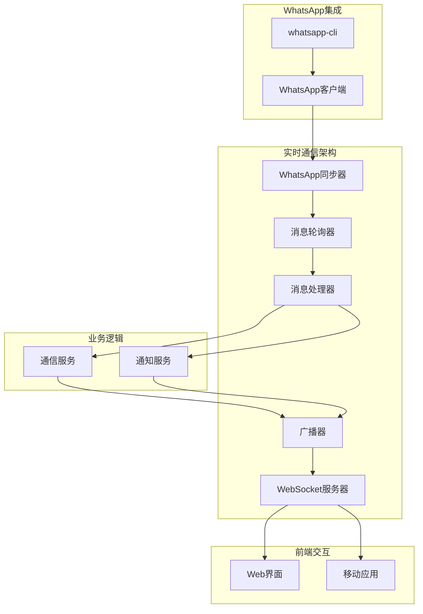

**图表来源**
- [whatsapp_client.py:366-436](file://backend/whatsapp_client.py#L366-L436)
- [communication_service.py:47-71](file://backend/communication_service.py#L47-L71)

## 详细组件分析

### WebSocket服务器实现

WebSocket服务器位于主应用中，提供了基础的连接管理和消息广播功能：

#### 连接建立流程

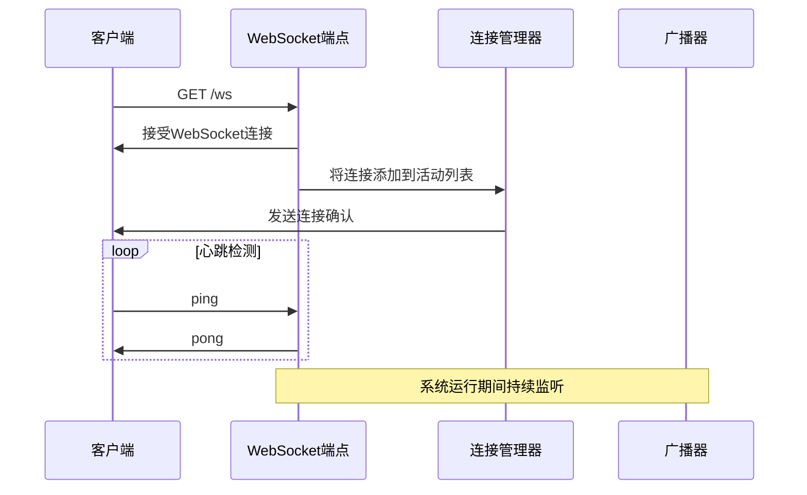

**图表来源**
- [main.py:162-176](file://backend/main.py#L162-L176)

#### 心跳检测机制

系统实现了简单的ping/pong心跳检测机制：

- **心跳频率**: 每30秒发送一次ping
- **响应机制**: 收到ping立即返回pong
- **连接维护**: 心跳失败自动断开连接

**章节来源**
- [main.py:162-176](file://backend/main.py#L162-L176)
- [index.html:890-896](file://backend/static/index.html#L890-L896)

### 消息广播系统

#### 广播器实现

广播器负责将新消息推送给所有连接的客户端：

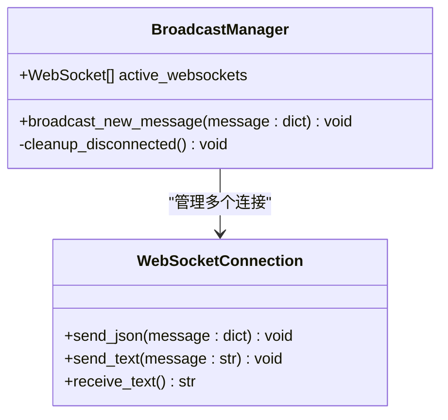

**图表来源**
- [main.py:178-194](file://backend/main.py#L178-L194)

#### 消息格式规范

WebSocket消息采用统一的JSON格式：

```json
{
  "type": "new_message",
  "data": {
    "customer_id": 123,
    "customer_name": "张三",
    "customer_phone": "13800001111",
    "message": "你好，我想咨询产品信息",
    "timestamp": "2024-01-01T12:00:00Z"
  }
}
```

**章节来源**
- [main.py:183-186](file://backend/main.py#L183-L186)

### WhatsApp消息同步

#### 消息轮询机制

WhatsApp客户端实现了高效的轮询机制来同步消息：

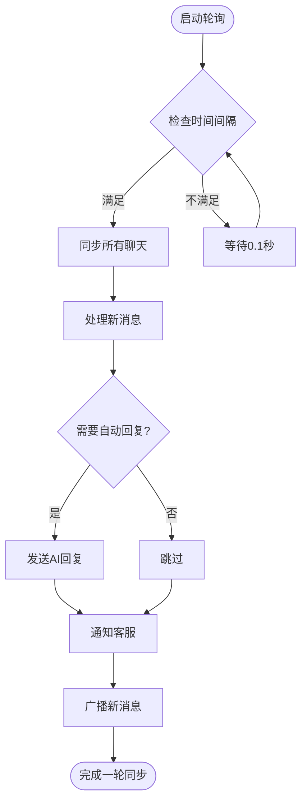

**图表来源**
- [whatsapp_client.py:366-436](file://backend/whatsapp_client.py#L366-L436)

#### 消息处理流程

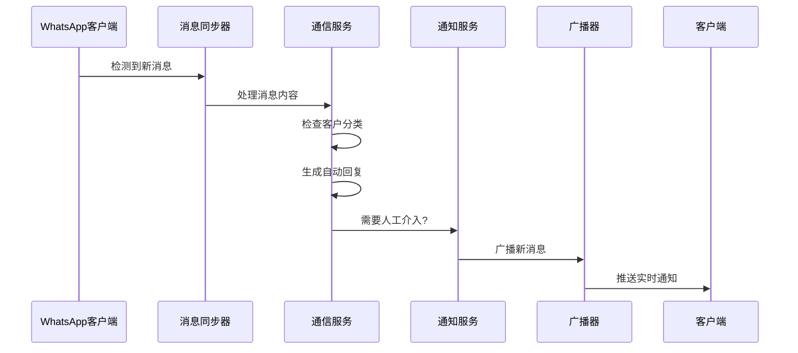

**图表来源**
- [whatsapp_client.py:399-432](file://backend/whatsapp_client.py#L399-L432)

**章节来源**
- [whatsapp_client.py:366-436](file://backend/whatsapp_client.py#L366-L436)
- [communication_service.py:47-71](file://backend/communication_service.py#L47-L71)

### 客户端连接管理

#### 连接生命周期

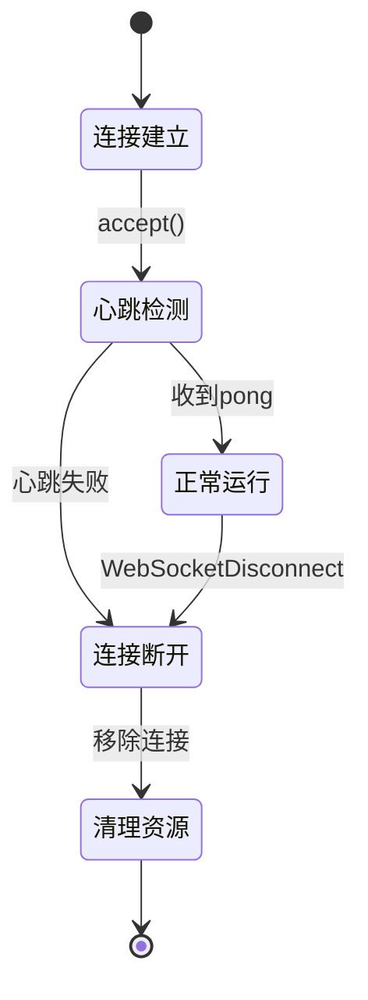

**图表来源**
- [main.py:168-176](file://backend/main.py#L168-L176)

#### 断线重连策略

前端实现了智能的断线重连机制：

- **重连间隔**: 5秒
- **重连次数**: 无限次
- **状态检查**: 连接前检查WebSocket状态
- **资源清理**: 断开时自动清理连接

**章节来源**
- [index.html:885-896](file://backend/static/index.html#L885-L896)

## 依赖关系分析

### 核心依赖关系

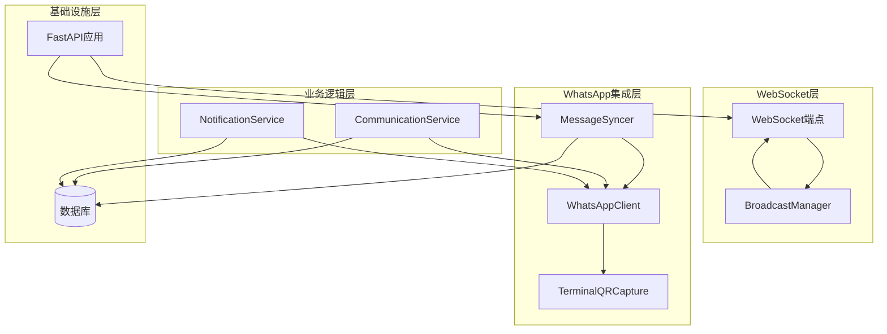

**图表来源**
- [main.py:10-26](file://backend/main.py#L10-L26)
- [whatsapp_client.py:13-437](file://backend/whatsapp_client.py#L13-L437)

### 外部依赖

系统依赖的关键外部组件：

| 组件 | 版本 | 用途 |
|------|------|------|
| FastAPI | 0.109.0 | Web框架和WebSocket支持 |
| uvicorn | 0.27.0 | ASGI服务器 |
| websockets | 12.0 | WebSocket协议支持 |
| whatsapp-cli | 系统级 | WhatsApp消息操作 |

**章节来源**
- [requirements.txt:1-20](file://backend/requirements.txt#L1-L20)

## 性能考虑

### 连接池管理

系统实现了高效的连接池管理策略：

- **内存管理**: 自动清理断开的连接
- **并发处理**: 支持多客户端同时连接
- **资源控制**: 限制同时连接数量

### 消息处理优化

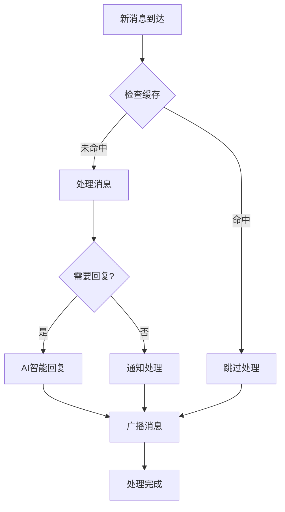

**图表来源**
- [whatsapp_client.py:399-432](file://backend/whatsapp_client.py#L399-L432)

### 性能优化建议

1. **连接管理优化**
   - 实现连接池大小限制
   - 添加连接超时检测
   - 优化内存使用

2. **消息处理优化**
   - 实现消息队列缓冲
   - 添加批量处理机制
   - 优化数据库查询

3. **网络优化**
   - 实现连接复用
   - 添加压缩支持
   - 优化心跳频率

## 故障排除指南

### 常见问题诊断

#### WebSocket连接问题

**症状**: 客户端无法连接WebSocket
**排查步骤**:
1. 检查服务器端口是否开放
2. 验证CORS配置
3. 检查防火墙设置
4. 查看服务器日志

**解决方案**:
- 确保端口8000可访问
- 配置正确的CORS头
- 检查网络连接

#### 心跳检测失败

**症状**: 连接频繁断开
**排查步骤**:
1. 检查网络稳定性
2. 验证心跳频率设置
3. 检查服务器负载

**解决方案**:
- 调整心跳间隔
- 优化服务器性能
- 检查网络质量

#### 消息广播异常

**症状**: 客户端收不到消息推送
**排查步骤**:
1. 检查广播器状态
2. 验证连接列表
3. 检查消息格式

**解决方案**:
- 重启广播器
- 清理断开连接
- 验证消息格式

**章节来源**
- [main.py:178-194](file://backend/main.py#L178-L194)
- [index.html:885-896](file://backend/static/index.html#L885-L896)

## 结论

WhatsApp智能客户系统的WebSocket实时通信API提供了一个完整、可靠的实时消息推送解决方案。系统通过高效的连接管理、智能的心跳检测和可靠的消息广播机制，实现了类似即时通讯应用的用户体验。

主要优势包括：
- **实时性**: 基于轮询的近实时消息同步
- **可靠性**: 完善的连接管理和断线重连机制
- **扩展性**: 模块化设计支持功能扩展
- **易用性**: 简洁的API接口和客户端集成

未来可以进一步优化的方向包括：实现更高效的WebSocket集群支持、添加消息持久化机制、增强安全性和性能监控。

## 附录

### WebSocket客户端集成指南

#### 基础连接

```javascript
// 建立WebSocket连接
const ws = new WebSocket('ws://localhost:8000/ws');

ws.onopen = function(event) {
    console.log('连接已建立');
};

ws.onclose = function(event) {
    console.log('连接已断开，5秒后重连');
    setTimeout(connect, 5000);
};
```

#### 心跳检测

```javascript
// 发送心跳包
setInterval(() => {
    if (ws.readyState === WebSocket.OPEN) {
        ws.send('ping');
    }
}, 30000);

ws.onmessage = function(event) {
    const data = JSON.parse(event.data);
    if (data === 'pong') {
        console.log('心跳响应正常');
    }
};
```

#### 消息监听

```javascript
ws.onmessage = function(event) {
    const message = JSON.parse(event.data);
    
    if (message.type === 'new_message') {
        // 处理新消息
        handleNewMessage(message.data);
    }
};

function handleNewMessage(data) {
    // 更新UI
    updateMessageList(data);
    
    // 播放提示音
    playNotificationSound();
    
    // 显示浏览器通知
    showBrowserNotification(data);
}
```

#### 错误处理

```javascript
ws.onerror = function(error) {
    console.error('WebSocket错误:', error);
};

ws.onclose = function(event) {
    if (event.code === 1006) {
        // 非正常关闭，触发重连
        reconnect();
    }
};

function reconnect() {
    console.log('尝试重连...');
    setTimeout(() => {
        connect();
    }, 5000);
}
```

### 实时通信应用场景

1. **新消息通知**
   - 实时推送客户消息
   - 支持多种消息类型
   - 提供声音和视觉反馈

2. **会话状态更新**
   - 转人工状态变更
   - 客服在线状态
   - 会话关闭通知

3. **系统状态推送**
   - WhatsApp连接状态
   - 系统维护通知
   - 性能监控告警

### 最佳实践建议

1. **连接管理**
   - 实现优雅的断线重连
   - 添加连接状态监控
   - 优化连接池大小

2. **消息处理**
   - 实现消息去重机制
   - 添加消息确认机制
   - 优化消息批处理

3. **性能优化**
   - 实现连接复用
   - 添加消息压缩
   - 优化心跳频率

4. **安全性**
   - 实现身份验证
   - 添加消息签名
   - 保护敏感信息