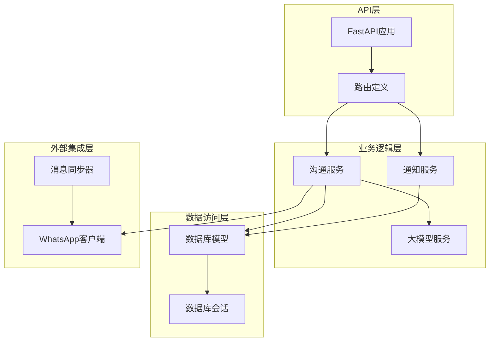
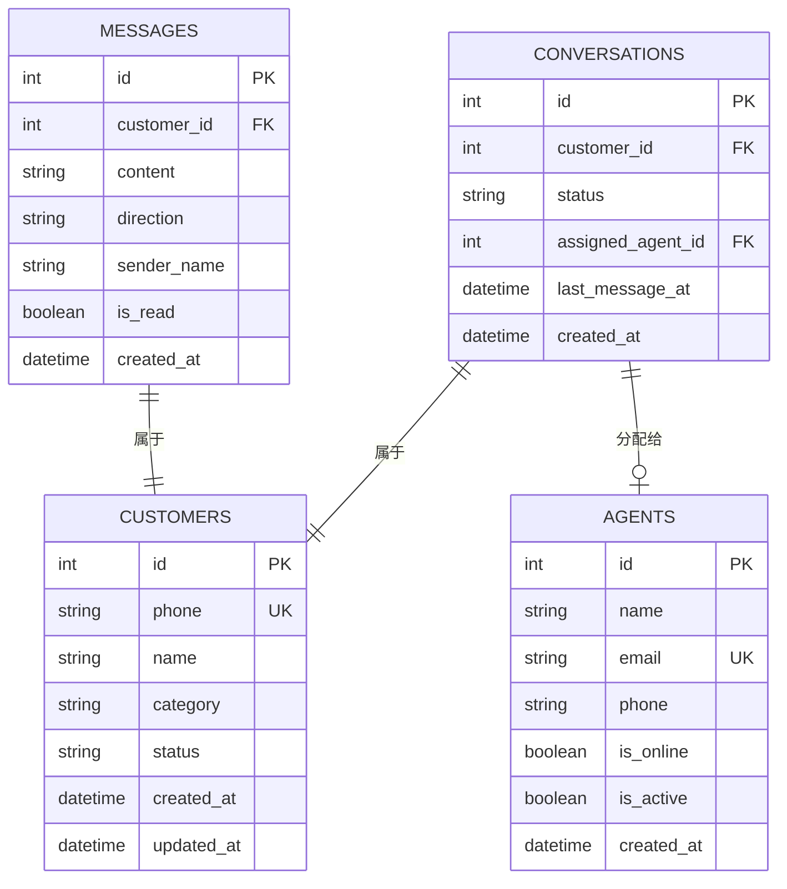
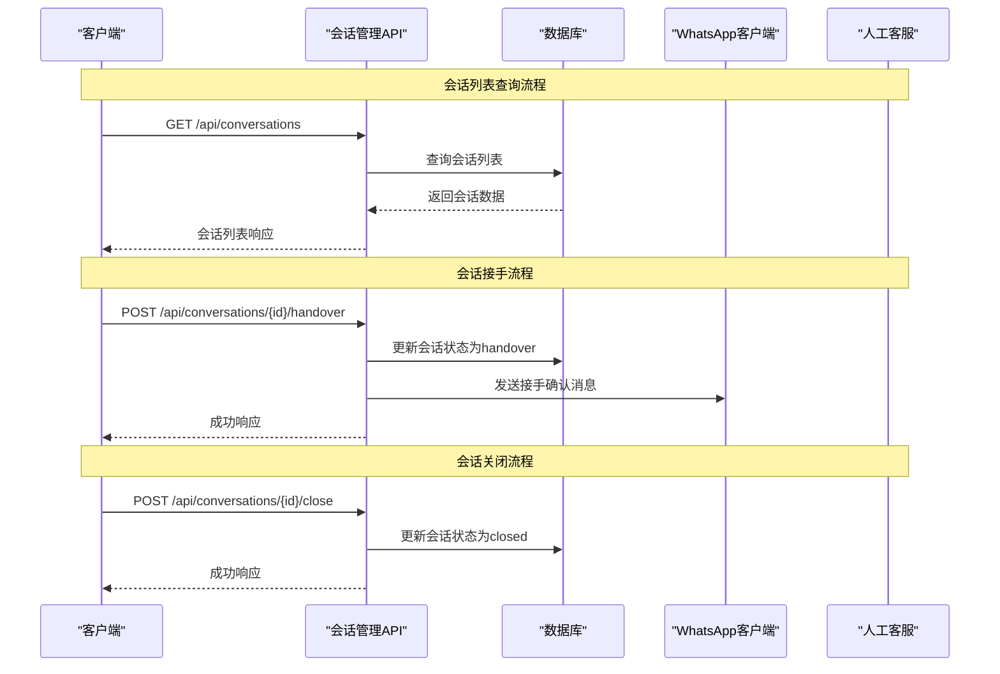
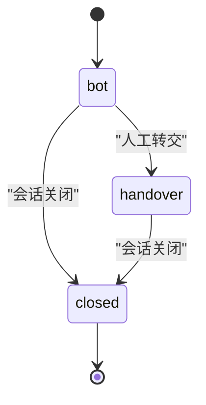
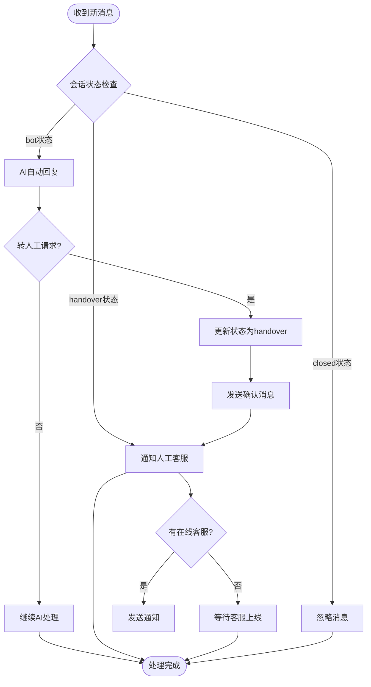
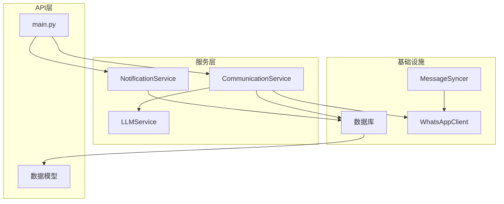

# 会话管理API

<cite>
**本文档引用的文件**
- [main.py](file://backend/main.py)
- [database.py](file://backend/database.py)
- [communication_service.py](file://backend/communication_service.py)
- [whatsapp_client.py](file://backend/whatsapp_client.py)
- [llm_service.py](file://backend/llm_service.py)
</cite>

## 目录
1. [简介](#简介)
2. [项目结构](#项目结构)
3. [核心组件](#核心组件)
4. [架构概览](#架构概览)
5. [详细组件分析](#详细组件分析)
6. [依赖关系分析](#依赖关系分析)
7. [性能考虑](#性能考虑)
8. [故障排除指南](#故障排除指南)
9. [结论](#结论)

## 简介

WhatsApp智能客户系统是一个基于FastAPI构建的客户关系管理系统，集成了WhatsApp消息平台和AI智能回复功能。该系统提供了完整的会话管理API，支持会话列表查询、人工客服转交和会话关闭等核心功能。

系统采用现代化的架构设计，包括：
- 基于WhatsApp CLI的消息收发能力
- AI智能回复引擎集成
- 实时消息同步机制
- 客服人工协作工作流
- 完整的会话状态管理

## 项目结构

系统采用分层架构设计，主要包含以下核心模块：



**图表来源**
- [main.py:129-134](file://backend/main.py#L129-L134)
- [communication_service.py:17-46](file://backend/communication_service.py#L17-L46)
- [database.py:23-91](file://backend/database.py#L23-L91)

**章节来源**
- [main.py:129-134](file://backend/main.py#L129-L134)
- [database.py:14-20](file://backend/database.py#L14-L20)

## 核心组件

### 会话管理API端点

系统提供三个核心的会话管理API端点：

1. **会话列表查询** (`GET /api/conversations`)
2. **会话接手** (`POST /api/conversations/{conversation_id}/handover`)
3. **会话关闭** (`POST /api/conversations/{conversation_id}/close`)

### 数据模型

会话管理涉及以下核心数据模型：



**图表来源**
- [database.py:59-91](file://backend/database.py#L59-L91)

**章节来源**
- [database.py:59-91](file://backend/database.py#L59-L91)

## 架构概览

系统采用事件驱动的架构模式，实现了从消息接收、AI处理到人工客服协作的完整工作流：



**图表来源**
- [main.py:638-700](file://backend/main.py#L638-L700)
- [communication_service.py:482-511](file://backend/communication_service.py#L482-L511)

## 详细组件分析

### 会话状态管理

会话状态管理是系统的核心功能之一，支持三种状态：

| 状态 | 描述 | 用途 |
|------|------|------|
| `bot` | AI自动回复状态 | 新客户或AI处理中的会话 |
| `handover` | 人工客服接手状态 | 需要人工客服介入的会话 |
| `closed` | 会话已关闭状态 | 已完成或终止的会话 |

状态流转图：



**图表来源**
- [database.py:65](file://backend/database.py#L65)
- [communication_service.py:97-112](file://backend/communication_service.py#L97-L112)

### 会话列表查询API

会话列表查询API支持按状态过滤和完整信息返回：

**请求格式**
- 方法: `GET /api/conversations`
- 参数: `status` (可选) - 过滤特定状态的会话

**响应格式**
```json
[
  {
    "id": 1,
    "customer_id": 101,
    "customer_name": "张三",
    "customer_phone": "13800001111",
    "status": "bot",
    "assigned_agent_id": null,
    "last_message_at": "2024-01-15T10:30:00Z",
    "created_at": "2024-01-15T09:00:00Z"
  }
]
```

**实现细节**
- 支持按状态过滤查询
- 自动关联客户信息
- 按最后消息时间倒序排列

**章节来源**
- [main.py:638-664](file://backend/main.py#L638-L664)

### 会话接手API

会话接手API允许人工客服接手AI处理中的会话：

**请求格式**
- 方法: `POST /api/conversations/{conversation_id}/handover`
- 路径参数: `conversation_id` - 会话ID
- 请求体: `{ "agent_id": 1 }` - 接手的客服ID

**响应格式**
```json
{
  "success": true,
  "message": "会话已接手"
}
```

**处理流程**
1. 验证会话存在性
2. 更新会话状态为`handover`
3. 绑定指定的客服
4. 向客户发送接手确认消息
5. 通知所有在线客服

**章节来源**
- [main.py:667-684](file://backend/main.py#L667-L684)
- [communication_service.py:482-511](file://backend/communication_service.py#L482-L511)

### 会话关闭API

会话关闭API用于结束会话：

**请求格式**
- 方法: `POST /api/conversations/{conversation_id}/close`
- 路径参数: `conversation_id` - 会话ID

**响应格式**
```json
{
  "success": true,
  "message": "会话已关闭"
}
```

**处理流程**
1. 验证会话存在性
2. 更新会话状态为`closed`
3. 持久化状态变更

**章节来源**
- [main.py:687-700](file://backend/main.py#L687-L700)

### 人工客服协作工作流

系统实现了完整的客服协作机制：



**图表来源**
- [communication_service.py:47-71](file://backend/communication_service.py#L47-L71)
- [communication_service.py:435-449](file://backend/communication_service.py#L435-L449)

**章节来源**
- [communication_service.py:47-71](file://backend/communication_service.py#L47-L71)
- [communication_service.py:435-449](file://backend/communication_service.py#L435-L449)

## 依赖关系分析

系统各组件之间的依赖关系如下：



**图表来源**
- [main.py:17-26](file://backend/main.py#L17-L26)
- [communication_service.py:8-14](file://backend/communication_service.py#L8-L14)

**章节来源**
- [main.py:17-26](file://backend/main.py#L17-L26)
- [communication_service.py:8-14](file://backend/communication_service.py#L8-L14)

## 性能考虑

### 消息同步优化

系统采用轮询机制进行消息同步，具有以下优化特性：

- **最小同步间隔**: 1秒轮询间隔，平衡实时性和性能
- **增量同步**: 使用消息ID集合避免重复处理
- **异步处理**: AI回复生成采用异步方式
- **事件循环管理**: 智能处理不同环境下的事件循环

### 数据库性能

- **索引优化**: 关键字段建立索引提高查询性能
- **批量操作**: 合并数据库操作减少往返次数
- **连接池**: 使用SQLAlchemy连接池管理数据库连接

### 缓存策略

- **消息去重**: 使用已知消息ID集合避免重复处理
- **智能回复缓存**: 基于客户分类的回复模板缓存

## 故障排除指南

### 常见问题及解决方案

**会话状态异常**
- 检查会话状态是否正确更新
- 验证数据库事务提交
- 确认状态转换逻辑

**人工转交失败**
- 验证会话是否存在
- 检查客服ID有效性
- 确认WhatsApp消息发送成功

**消息同步问题**
- 检查WhatsApp CLI安装和配置
- 验证消息ID唯一性
- 确认数据库连接状态

**AI回复异常**
- 检查大模型API配置
- 验证网络连接
- 确认API密钥有效性

**章节来源**
- [communication_service.py:482-511](file://backend/communication_service.py#L482-L511)
- [whatsapp_client.py:133-154](file://backend/whatsapp_client.py#L133-L154)

## 结论

WhatsApp智能客户系统的会话管理API提供了完整的会话生命周期管理功能。系统通过清晰的状态管理和人工协作机制，实现了从AI自动回复到人工客服接手的无缝过渡。

关键优势包括：
- **完整的状态管理**: 支持bot、handover、closed三种状态
- **灵活的人工协作**: 支持会话转交和状态跟踪
- **实时消息处理**: 基于WhatsApp CLI的实时消息同步
- **AI智能回复**: 集成大模型提供智能回复能力
- **可扩展架构**: 模块化设计便于功能扩展

建议的最佳实践：
- 合理设置会话状态转换条件
- 建立完善的客服转交流程
- 监控AI回复质量和人工客服响应时间
- 定期清理已关闭会话数据
- 优化消息同步频率以平衡性能和实时性