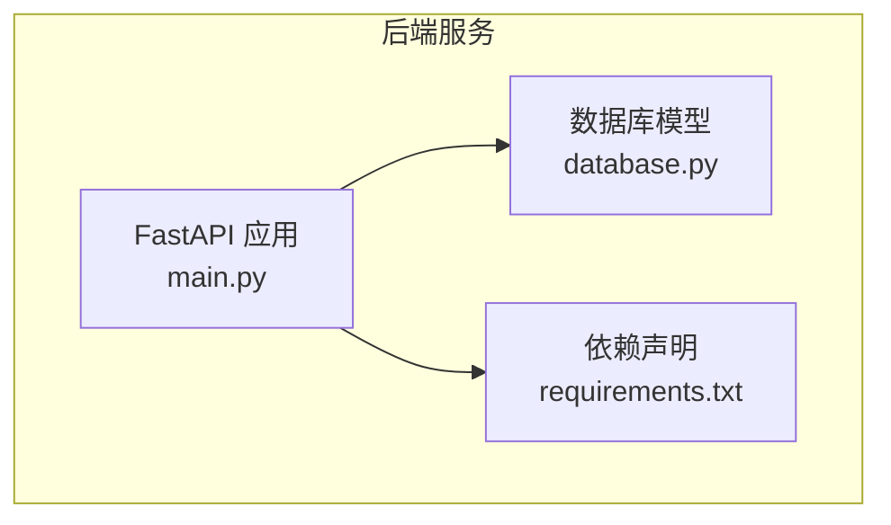
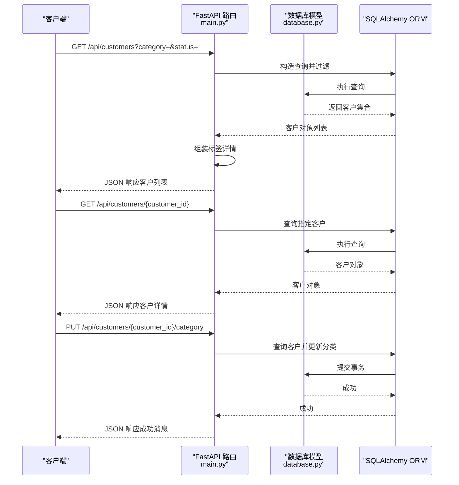
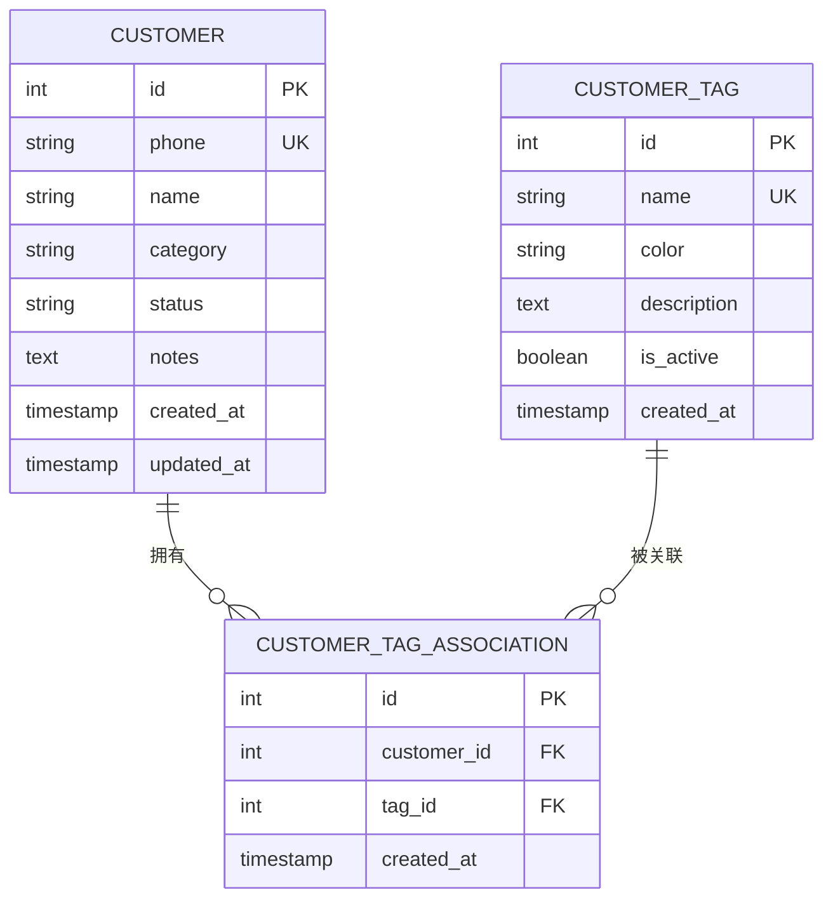
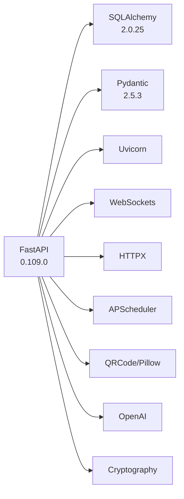

# 客户管理API

<cite>
**本文档引用的文件**
- [main.py](file://backend/main.py)
- [database.py](file://backend/database.py)
- [requirements.txt](file://backend/requirements.txt)
</cite>

## 目录
1. [简介](#简介)
2. [项目结构](#项目结构)
3. [核心组件](#核心组件)
4. [架构总览](#架构总览)
5. [详细组件分析](#详细组件分析)
6. [依赖关系分析](#依赖关系分析)
7. [性能考虑](#性能考虑)
8. [故障排除指南](#故障排除指南)
9. [结论](#结论)
10. [附录](#附录)

## 简介
本文件为 WhatsApp 智能客户系统的“客户管理API”完整技术文档，聚焦以下端点：
- 客户列表查询：GET /api/customers
- 客户详情获取：GET /api/customers/{customer_id}
- 客户分类更新：PUT /api/customers/{customer_id}/category

文档详细说明查询参数（category、status）的使用方法，响应数据结构中包含的客户信息、标签详情和状态字段，并提供客户分类管理的最佳实践与状态流转建议。同时给出实际请求示例、响应示例与错误处理说明，帮助开发者快速集成与维护。

## 项目结构
后端采用 FastAPI + SQLAlchemy 架构，数据库模型在 database.py 中定义，业务路由集中在 main.py。客户管理API位于 main.py 的“客户管理 API”区域，数据库模型位于 database.py 的 Customer 表及相关标签关联表。

图表来源
- [main.py:479-581](file://backend/main.py#L479-L581)
- [database.py:23-39](file://backend/database.py#L23-L39)
- [requirements.txt:1-20](file://backend/requirements.txt#L1-L20)

章节来源
- [main.py:479-581](file://backend/main.py#L479-L581)
- [database.py:23-39](file://backend/database.py#L23-L39)
- [requirements.txt:1-20](file://backend/requirements.txt#L1-L20)

## 核心组件
- 客户模型（Customer）：包含电话、姓名、分类、状态、创建/更新时间等字段；支持与消息、会话、标签的关联。
- 客户标签模型（CustomerTag、CustomerTagAssociation）：支持客户与标签的多对多关联，标签包含名称、颜色、激活状态等。
- 客户响应模型（CustomerResponse）：用于序列化客户详情，包含标签信息数组。
- 客户标签信息模型（CustomerTagInfo）：用于序列化标签详情（id、name、color）。

章节来源
- [database.py:23-39](file://backend/database.py#L23-L39)
- [database.py:126-153](file://backend/database.py#L126-L153)
- [main.py:35-51](file://backend/main.py#L35-L51)

## 架构总览
客户管理API通过 FastAPI 路由暴露，使用 SQLAlchemy 进行数据库访问。查询参数用于过滤客户列表，响应中包含客户基本信息与标签详情。分类更新端点直接修改数据库中的分类字段。

图表来源
- [main.py:501-581](file://backend/main.py#L501-L581)
- [database.py:23-39](file://backend/database.py#L23-L39)

## 详细组件分析

### 客户列表查询（GET /api/customers）
- 功能概述：按可选参数过滤客户列表，按最近更新时间倒序返回。
- 查询参数
  - category：字符串，按客户分类过滤
  - status：字符串，按客户状态过滤
- 响应结构
  - 数组元素为对象，包含：
    - id：整数，客户唯一标识
    - phone：字符串，客户电话号码
    - name：字符串或空，客户姓名
    - category：字符串，客户分类（如 new/lead/returning）
    - status：字符串，客户状态（如 active/pending/closed）
    - created_at：ISO 时间字符串或空，创建时间
    - tags：数组，每个元素为标签信息对象，包含 id、name、color
- 错误处理
  - 服务器内部错误时抛出 500 异常，包含错误详情
- 性能与复杂度
  - 查询复杂度近似 O(n)，n 为匹配记录数；建议在高并发场景下配合分页与索引优化

章节来源
- [main.py:501-555](file://backend/main.py#L501-L555)

### 客户详情获取（GET /api/customers/{customer_id}）
- 功能概述：返回指定客户的所有详情信息。
- 路径参数
  - customer_id：整数，客户唯一标识
- 响应结构
  - 对象，包含：
    - id、phone、name、category、status、created_at
    - tags：数组，每个元素为标签信息对象（id、name、color）
- 错误处理
  - 客户不存在时返回 404

章节来源
- [main.py:557-564](file://backend/main.py#L557-L564)
- [main.py:35-51](file://backend/main.py#L35-L51)

### 客户分类更新（PUT /api/customers/{customer_id}/category）
- 功能概述：将指定客户的分类更新为新的值。
- 路径参数
  - customer_id：整数，客户唯一标识
- 请求体
  - category：字符串，新的分类值
- 响应结构
  - 对象，包含 success 与 message 字段
- 错误处理
  - 客户不存在时返回 404

章节来源
- [main.py:566-581](file://backend/main.py#L566-L581)

### 数据模型与关系
- 客户表（Customer）
  - 字段：id、phone、name、category、status、notes、created_at、updated_at
  - 关系：与 Message、Conversation、CustomerTagAssociation 的一对多/多对多
- 标签表（CustomerTag）
  - 字段：id、name、color、description、is_active、created_at
- 关联表（CustomerTagAssociation）
  - 字段：id、customer_id、tag_id、created_at
  - 关系：与 Customer、CustomerTag 的多对多

图表来源
- [database.py:23-39](file://backend/database.py#L23-L39)
- [database.py:126-153](file://backend/database.py#L126-L153)

## 依赖关系分析
- FastAPI 版本：0.109.0
- SQLAlchemy 版本：2.0.25
- Pydantic 版本：2.5.3
- 其他关键依赖：uvicorn、websockets、httpx、apscheduler、qrcode、pillow、openai、cryptography 等

图表来源
- [requirements.txt:1-20](file://backend/requirements.txt#L1-L20)

章节来源
- [requirements.txt:1-20](file://backend/requirements.txt#L1-L20)

## 性能考虑
- 查询优化
  - 在高并发场景下，建议对 phone、category、status、updated_at 等常用查询字段建立索引。
  - 对于大量客户数据，结合分页参数（limit/offset）或游标分页以减少单次响应体积。
- 响应组装
  - 客户列表接口会遍历客户并安全地收集标签信息，建议在标签数量较多时考虑缓存或延迟加载策略。
- 数据库事务
  - 分类更新为简单写操作，建议保持短事务，避免长时间锁表。

## 故障排除指南
- 404 客户不存在
  - 触发场景：查询/更新的客户 ID 不存在
  - 处理建议：确认 customer_id 是否正确，检查数据库中是否存在对应记录
- 500 服务器内部错误
  - 触发场景：查询客户列表时发生异常
  - 处理建议：查看后端日志定位异常堆栈，检查数据库连接与权限
- 503 WhatsApp 客户端未就绪
  - 触发场景：消息发送相关端点在客户端未就绪时调用
  - 处理建议：先调用认证相关端点确保客户端已登录并就绪

章节来源
- [main.py:553-554](file://backend/main.py#L553-L554)
- [main.py:612-613](file://backend/main.py#L612-L613)
- [main.py:609-610](file://backend/main.py#L609-L610)

## 结论
本客户管理API提供了简洁高效的客户查询、详情获取与分类更新能力，配合标签系统可满足多维度客户画像与自动化运营需求。建议在生产环境中结合索引、分页与缓存策略提升性能，并完善错误监控与日志记录以便快速定位问题。

## 附录

### API 定义与示例

- 客户列表查询
  - 方法与路径：GET /api/customers
  - 查询参数
    - category：字符串，如 new/lead/returning
    - status：字符串，如 active/pending/closed
  - 响应示例（示意）
    - [
        {
          "id": 1,
          "phone": "8613800000000",
          "name": "张三",
          "category": "new",
          "status": "active",
          "created_at": "2024-01-01T00:00:00Z",
          "tags": [
            {"id": 101, "name": "潜在客户", "color": "#007bff"}
          ]
        }
      ]

- 客户详情获取
  - 方法与路径：GET /api/customers/{customer_id}
  - 路径参数：customer_id（整数）
  - 响应示例（示意）
    - {
        "id": 1,
        "phone": "8613800000000",
        "name": "张三",
        "category": "new",
        "status": "active",
        "created_at": "2024-01-01T00:00:00Z",
        "tags": []
      }

- 客户分类更新
  - 方法与路径：PUT /api/customers/{customer_id}/category
  - 路径参数：customer_id（整数）
  - 请求体
    - category：字符串，如 new/lead/returning
  - 响应示例（示意）
    - {"success": true, "message": "客户分类已更新为: lead"}

- 错误响应示例（404）
  - {"detail": "客户不存在"}

- 错误响应示例（500）
  - {"detail": "获取客户列表失败: 数据库异常详情"}

章节来源
- [main.py:501-581](file://backend/main.py#L501-L581)

### 客户分类管理最佳实践
- 分类策略
  - new：初次接触或未明确意向的客户
  - lead：表达过购买意向或参与过活动的客户
  - returning：曾购买或互动过的老客户
- 状态流转
  - active：正常跟进中
  - pending：等待进一步动作（如等待回复）
  - closed：结束跟进或转化完成
- 标签配合
  - 使用标签对客户进行细分（如“高价值”、“流失预警”），结合分类与状态形成多维画像
- 自动化
  - 建议通过沟通计划或自动标签规则，依据行为触发分类与状态变更，降低人工干预成本