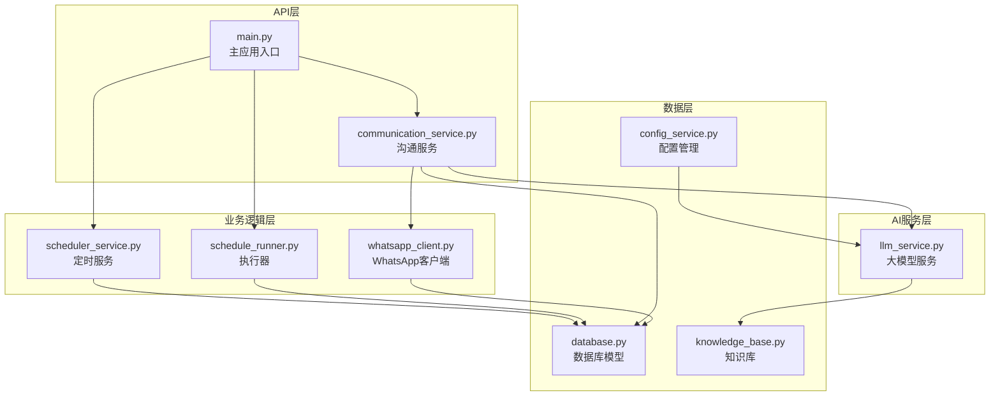
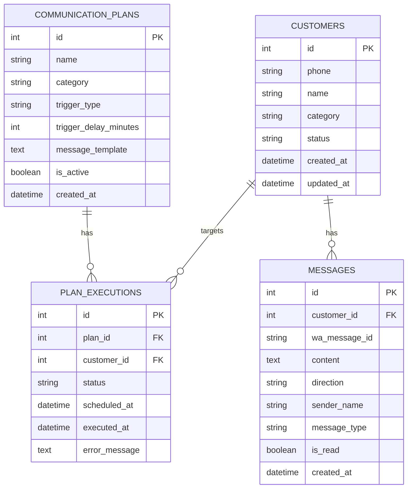
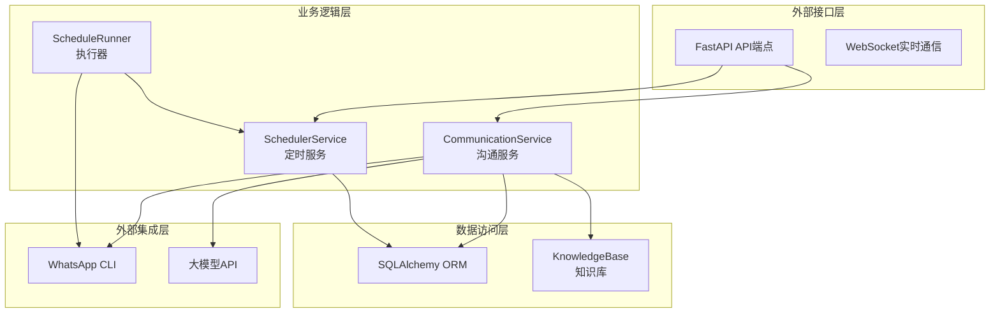
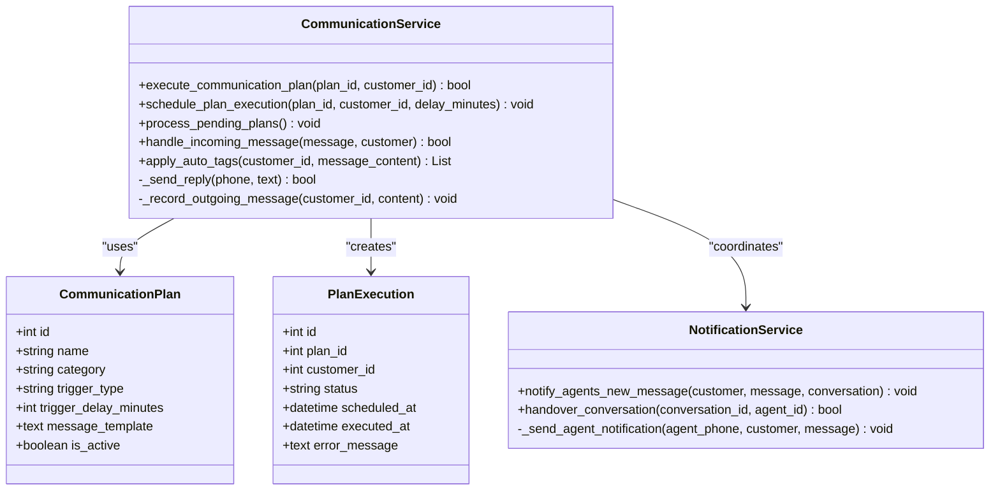
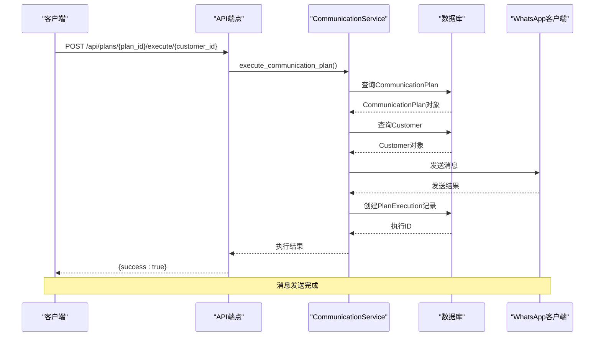
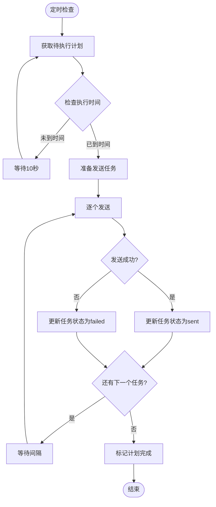
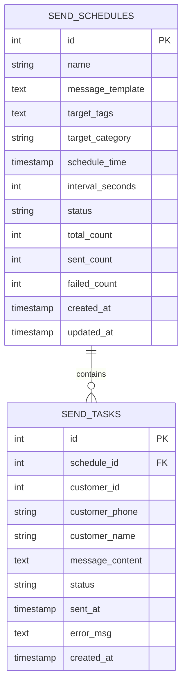
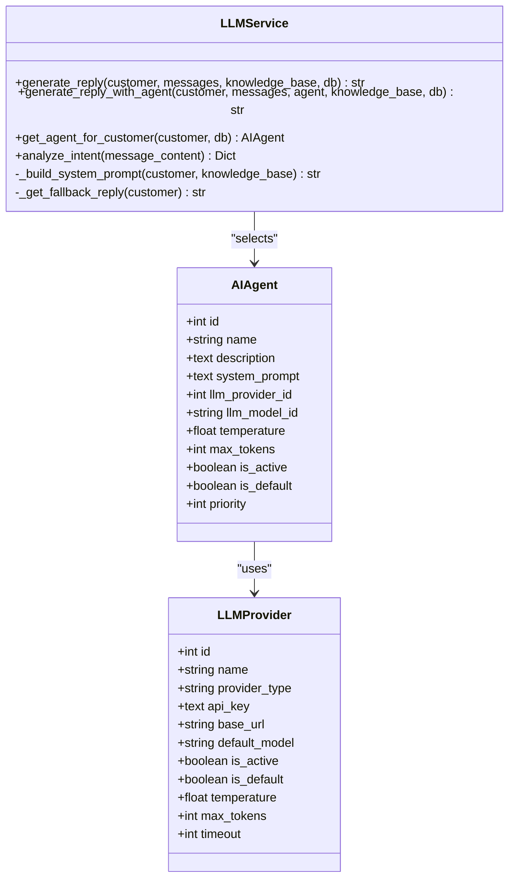
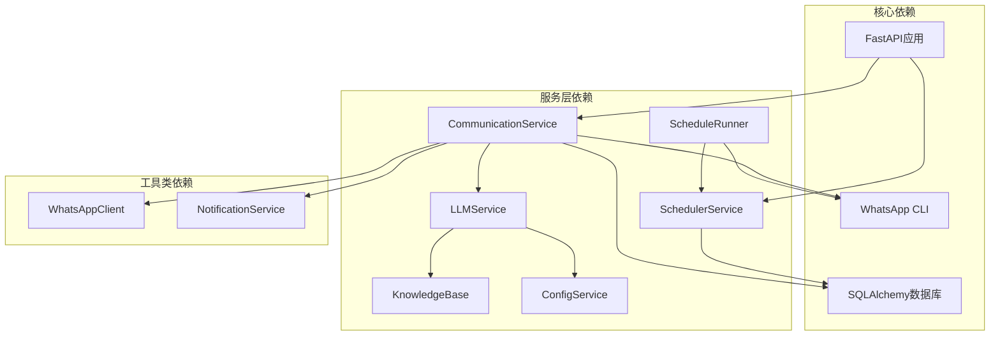
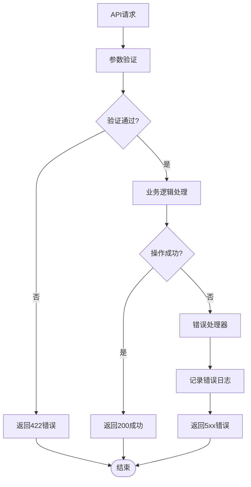

# 沟通计划API

<cite>
**本文档引用的文件**
- [main.py](file://backend/main.py)
- [database.py](file://backend/database.py)
- [communication_service.py](file://backend/communication_service.py)
- [scheduler_service.py](file://backend/scheduler_service.py)
- [schedule_runner.py](file://backend/schedule_runner.py)
- [whatsapp_client.py](file://backend/whatsapp_client.py)
- [llm_service.py](file://backend/llm_service.py)
- [knowledge_base.py](file://backend/knowledge_base.py)
- [config_service.py](file://backend/config_service.py)
</cite>

## 目录
1. [简介](#简介)
2. [项目结构](#项目结构)
3. [核心组件](#核心组件)
4. [架构概览](#架构概览)
5. [详细组件分析](#详细组件分析)
6. [依赖关系分析](#依赖关系分析)
7. [性能考虑](#性能考虑)
8. [故障排除指南](#故障排除指南)
9. [结论](#结论)
10. [附录](#附录)

## 简介

WhatsApp智能客户系统的沟通计划API是一个完整的自动化营销和客户服务解决方案。该系统基于WhatsApp CLI构建，提供了强大的沟通计划管理功能，支持定时发送、批量营销和个性化内容推送。

系统的核心功能包括：
- **沟通计划查询**：获取所有可用的沟通计划列表
- **计划执行**：手动或自动执行沟通计划
- **定时发送**：基于标签筛选客户，定时批量发送消息
- **个性化内容**：支持变量替换和模板化消息
- **状态跟踪**：完整的执行状态监控和结果反馈
- **错误处理**：完善的异常处理和重试机制

## 项目结构

系统采用模块化的FastAPI架构设计，主要文件组织如下：



**图表来源**
- [main.py:703-723](file://backend/main.py#L703-L723)
- [scheduler_service.py:54-393](file://backend/scheduler_service.py#L54-L393)
- [schedule_runner.py:12-142](file://backend/schedule_runner.py#L12-L142)

**章节来源**
- [main.py:128-157](file://backend/main.py#L128-L157)
- [database.py:93-124](file://backend/database.py#L93-L124)

## 核心组件

### 沟通计划API端点

系统提供了两个核心的沟通计划API端点：

#### 1. 沟通计划查询端点
- **端点**：`GET /api/plans`
- **功能**：获取所有沟通计划的列表
- **响应**：返回CommunicationPlan模型的数组

#### 2. 计划执行端点
- **端点**：`POST /api/plans/{plan_id}/execute/{customer_id}`
- **功能**：手动执行指定的沟通计划
- **参数**：
  - `plan_id`：沟通计划ID
  - `customer_id`：目标客户ID
- **响应**：执行结果状态

### 数据模型

系统使用SQLAlchemy ORM定义了完整的数据模型：



**图表来源**
- [database.py:93-124](file://backend/database.py#L93-L124)
- [database.py:23-57](file://backend/database.py#L23-L57)

**章节来源**
- [main.py:705-723](file://backend/main.py#L705-L723)
- [database.py:93-124](file://backend/database.py#L93-L124)

## 架构概览

系统采用分层架构设计，实现了清晰的关注点分离：



**图表来源**
- [communication_service.py:17-512](file://backend/communication_service.py#L17-L512)
- [scheduler_service.py:54-393](file://backend/scheduler_service.py#L54-L393)
- [schedule_runner.py:12-142](file://backend/schedule_runner.py#L12-L142)

## 详细组件分析

### 沟通服务组件

CommunicationService是系统的核心业务逻辑组件，负责处理所有沟通相关的操作：



**图表来源**
- [communication_service.py:17-512](file://backend/communication_service.py#L17-L512)
- [database.py:93-124](file://backend/database.py#L93-L124)

#### 沟通计划执行流程



**图表来源**
- [main.py:712-722](file://backend/main.py#L712-L722)
- [communication_service.py:363-392](file://backend/communication_service.py#L363-L392)

**章节来源**
- [communication_service.py:363-392](file://backend/communication_service.py#L363-L392)
- [main.py:712-722](file://backend/main.py#L712-L722)

### 定时发送服务

SchedulerService提供了完整的定时发送功能，支持复杂的客户筛选和批量执行：



**图表来源**
- [schedule_runner.py:35-110](file://backend/schedule_runner.py#L35-L110)
- [scheduler_service.py:243-288](file://backend/scheduler_service.py#L243-L288)

#### 定时服务数据模型



**图表来源**
- [scheduler_service.py:37-52](file://backend/scheduler_service.py#L37-L52)

**章节来源**
- [scheduler_service.py:54-393](file://backend/scheduler_service.py#L54-L393)
- [schedule_runner.py:12-142](file://backend/schedule_runner.py#L12-L142)

### AI智能回复集成

系统集成了强大的AI回复功能，支持多智能体和个性化回复：



**图表来源**
- [llm_service.py:11-286](file://backend/llm_service.py#L11-L286)
- [database.py:155-182](file://backend/database.py#L155-L182)
- [database.py:211-244](file://backend/database.py#L211-L244)

**章节来源**
- [llm_service.py:86-198](file://backend/llm_service.py#L86-L198)
- [knowledge_base.py:130-141](file://backend/knowledge_base.py#L130-L141)

## 依赖关系分析

系统采用了清晰的依赖注入模式，实现了松耦合的设计：



**图表来源**
- [main.py:17-26](file://backend/main.py#L17-L26)
- [communication_service.py:8-15](file://backend/communication_service.py#L8-L15)

### 错误处理机制

系统实现了多层次的错误处理机制：



**图表来源**
- [main.py:712-722](file://backend/main.py#L712-L722)
- [communication_service.py:363-392](file://backend/communication_service.py#L363-L392)

**章节来源**
- [main.py:712-722](file://backend/main.py#L712-L722)
- [communication_service.py:363-392](file://backend/communication_service.py#L363-L392)

## 性能考虑

### 并发处理
- **异步I/O**：使用asyncio处理WhatsApp CLI调用，避免阻塞
- **并发执行**：定时执行器支持多个计划并行处理
- **连接池**：数据库连接使用SQLAlchemy连接池管理

### 缓存策略
- **消息缓存**：MessageSyncer维护已知消息ID集合，避免重复处理
- **配置缓存**：ConfigService使用内存缓存敏感配置
- **AI响应缓存**：LLMService支持智能体选择和配置缓存

### 优化建议
- **批量处理**：对于大量客户的计划，考虑分批处理以避免WhatsApp限制
- **队列系统**：生产环境中建议引入消息队列处理高并发场景
- **监控指标**：添加详细的性能监控和告警机制

## 故障排除指南

### 常见问题及解决方案

#### 1. WhatsApp连接问题
- **症状**：API返回"WhatsApp客户端未就绪"
- **原因**：WhatsApp CLI未正确安装或认证失败
- **解决**：检查WhatsApp CLI安装，重新执行认证流程

#### 2. 计划执行失败
- **症状**：计划状态显示failed
- **原因**：客户电话号码格式错误或WhatsApp发送失败
- **解决**：检查客户电话格式，验证WhatsApp连接状态

#### 3. AI回复异常
- **症状**：AI回复生成失败，使用默认模板
- **原因**：大模型API配置错误或网络问题
- **解决**：检查API密钥和网络连接，验证大模型配置

#### 4. 定时任务不执行
- **症状**：计划到达时间但未执行
- **原因**：执行器未启动或数据库连接问题
- **解决**：重启执行器，检查数据库连接状态

**章节来源**
- [whatsapp_client.py:133-154](file://backend/whatsapp_client.py#L133-L154)
- [llm_service.py:149-175](file://backend/llm_service.py#L149-L175)

## 结论

WhatsApp智能客户系统的沟通计划API提供了一个完整、可扩展的自动化营销和客户服务解决方案。系统具有以下优势：

1. **模块化设计**：清晰的分层架构便于维护和扩展
2. **强类型支持**：使用Pydantic模型确保数据完整性
3. **异步处理**：高效的并发处理能力
4. **AI集成**：强大的智能回复和意图分析功能
5. **监控完善**：全面的状态跟踪和错误处理机制

该系统适合中小型企业快速部署WhatsApp自动化营销，支持从简单的一对一回复到复杂的批量营销活动。

## 附录

### API使用示例

#### 获取沟通计划列表
```bash
curl -X GET "http://localhost:8000/api/plans"
```

#### 手动执行沟通计划
```bash
curl -X POST "http://localhost:8000/api/plans/{plan_id}/execute/{customer_id}"
```

### 配置最佳实践

1. **客户分组策略**：
   - 新客户：使用欢迎模板，设置较短的回复间隔
   - 意向客户：使用产品介绍模板，设置适中的回复频率
   - 老客户：使用维护模板，设置较长的回复间隔

2. **内容模板设计**：
   - 包含个性化变量：{{name}}, {{phone}}, {{category}}
   - 控制消息长度，避免被WhatsApp限制
   - 添加明确的行动号召

3. **发送时机优化**：
   - 避免在深夜或节假日发送
   - 根据客户分类设置不同的发送频率
   - 考虑时区差异进行本地化发送