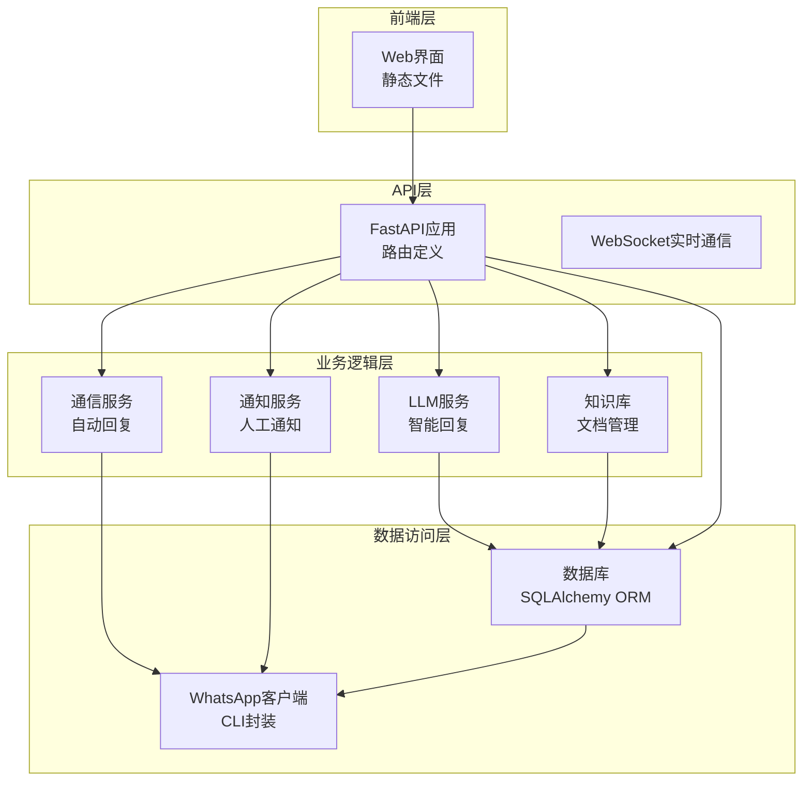
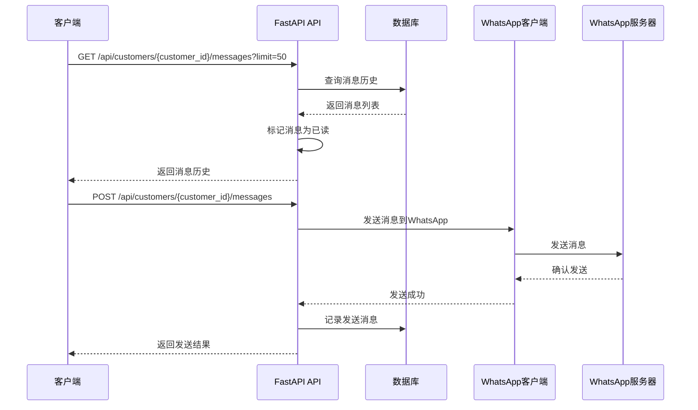
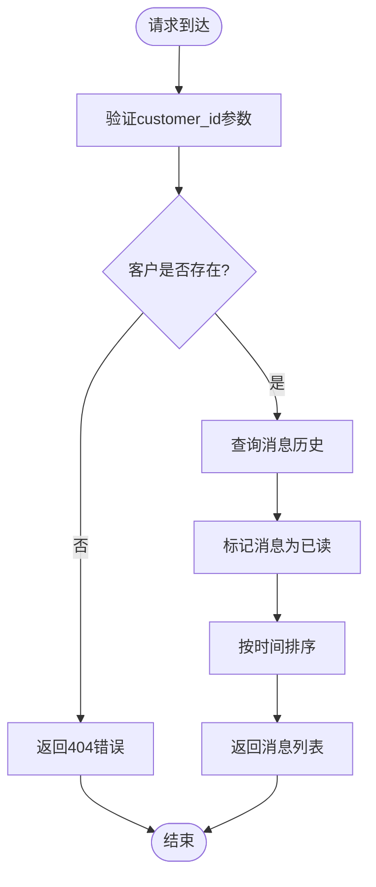
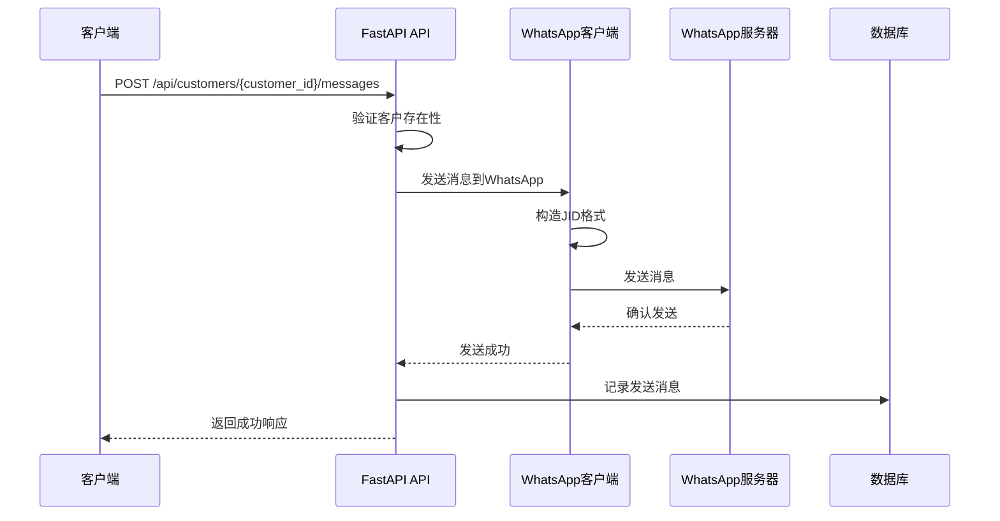
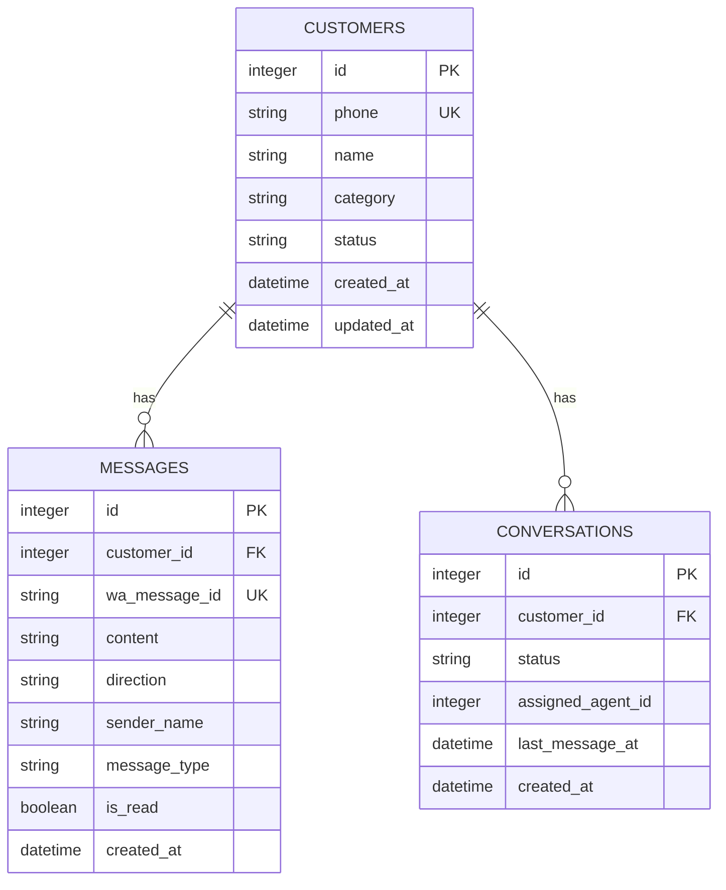
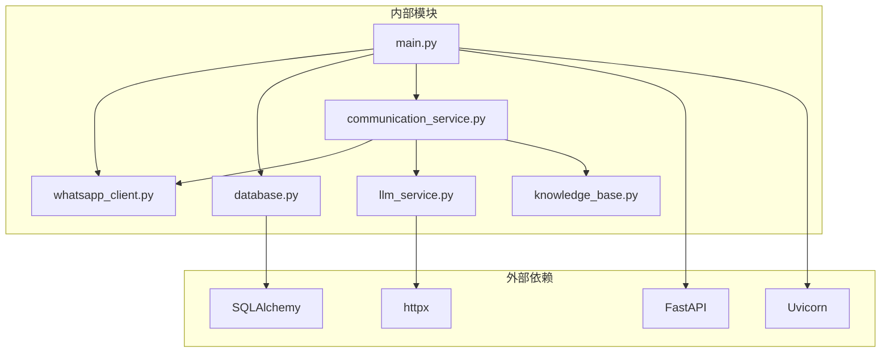

# 消息API

<cite>
**本文档引用的文件**
- [main.py](file://backend/main.py)
- [whatsapp_client.py](file://backend/whatsapp_client.py)
- [database.py](file://backend/database.py)
- [communication_service.py](file://backend/communication_service.py)
- [llm_service.py](file://backend/llm_service.py)
- [knowledge_base.py](file://backend/knowledge_base.py)
- [start_server.py](file://start_server.py)
- [requirements.txt](file://backend/requirements.txt)
</cite>

## 目录
1. [简介](#简介)
2. [项目结构](#项目结构)
3. [核心组件](#核心组件)
4. [架构概览](#架构概览)
5. [详细组件分析](#详细组件分析)
6. [依赖分析](#依赖分析)
7. [性能考虑](#性能考虑)
8. [故障排除指南](#故障排除指南)
9. [结论](#结论)
10. [附录](#附录)

## 简介
WhatsApp智能客户系统提供了一套完整的消息API，支持消息历史查询和消息发送功能。该系统基于FastAPI构建，集成了WhatsApp CLI客户端，实现了自动消息同步、智能回复和客户管理功能。

## 项目结构
系统采用分层架构设计，主要包含以下模块：



**图表来源**
- [main.py:128-157](file://backend/main.py#L128-L157)
- [whatsapp_client.py:13-26](file://backend/whatsapp_client.py#L13-L26)
- [database.py:14-21](file://backend/database.py#L14-L21)

**章节来源**
- [main.py:128-157](file://backend/main.py#L128-L157)
- [start_server.py:92-127](file://start_server.py#L92-L127)

## 核心组件
系统的核心组件包括：

### 消息API端点
- **消息历史查询**: `/api/customers/{customer_id}/messages`
- **消息发送**: `/api/customers/{customer_id}/messages`

### 数据模型
- **Message模型**: 存储消息历史和状态
- **Customer模型**: 客户信息管理
- **Conversation模型**: 会话状态跟踪

### 服务组件
- **WhatsAppClient**: WhatsApp CLI客户端封装
- **CommunicationService**: 自动回复和沟通计划服务
- **NotificationService**: 人工通知服务

**章节来源**
- [main.py:585-634](file://backend/main.py#L585-L634)
- [database.py:41-57](file://backend/database.py#L41-L57)
- [whatsapp_client.py:13-26](file://backend/whatsapp_client.py#L13-L26)

## 架构概览



**图表来源**
- [main.py:585-634](file://backend/main.py#L585-L634)
- [whatsapp_client.py:133-154](file://backend/whatsapp_client.py#L133-L154)
- [database.py:41-57](file://backend/database.py#L41-L57)

## 详细组件分析

### 消息历史查询API

#### 端点定义
- **方法**: GET
- **路径**: `/api/customers/{customer_id}/messages`
- **参数**: 
  - `customer_id`: 客户ID（路径参数）
  - `limit`: 返回消息数量限制，默认50（查询参数）

#### 请求处理流程



**图表来源**
- [main.py:585-598](file://backend/main.py#L585-L598)

#### 响应格式
消息历史查询返回的消息对象包含以下字段：

| 字段名 | 类型 | 描述 | 示例 |
|--------|------|------|------|
| id | integer | 消息ID | 123 |
| customer_id | integer | 客户ID | 456 |
| content | string | 消息内容 | "你好，我想咨询产品信息" |
| direction | string | 消息方向 | "incoming" 或 "outgoing" |
| sender_name | string | 发送者名称 | "张三" |
| is_read | boolean | 是否已读 | true |
| created_at | datetime | 创建时间 | "2024-01-15T10:30:00Z" |

#### 自动已读标记机制
当查询消息历史时，系统会自动将所有来自客户的未读消息标记为已读状态。这是通过以下逻辑实现的：

1. 查询客户的所有消息
2. 遍历消息列表
3. 对于每个`incoming`方向且`is_read`为`false`的消息，将其标记为`true`
4. 提交数据库事务

**章节来源**
- [main.py:585-598](file://backend/main.py#L585-L598)
- [database.py:41-57](file://backend/database.py#L41-L57)

### 消息发送API

#### 端点定义
- **方法**: POST
- **路径**: `/api/customers/{customer_id}/messages`
- **请求体**: SendMessageRequest

#### 请求格式
SendMessageRequest对象包含以下字段：

| 字段名 | 类型 | 必填 | 描述 |
|--------|------|------|------|
| content | string | 是 | 消息内容，最大长度限制为1000字符 |

#### 发送流程



**图表来源**
- [main.py:601-634](file://backend/main.py#L601-L634)
- [whatsapp_client.py:133-154](file://backend/whatsapp_client.py#L133-L154)

#### WhatsApp JID格式
系统支持两种WhatsApp JID格式：
- `phone@s.whatsapp.net` - 标准格式
- `phone@lid` - 替代格式

发送逻辑会自动尝试两种格式，以提高兼容性。

#### 发送状态处理
消息发送成功后，系统会：
1. 在数据库中记录一条`outgoing`方向的消息
2. 标记为已读状态
3. 返回成功响应给客户端

**章节来源**
- [main.py:601-634](file://backend/main.py#L601-L634)
- [whatsapp_client.py:133-154](file://backend/whatsapp_client.py#L133-L154)

### 数据模型设计



**图表来源**
- [database.py:23-73](file://backend/database.py#L23-L73)

#### 消息方向定义
- `incoming`: 来自客户的消息
- `outgoing`: 发送给客户的消息

#### 已读状态管理
- 系统自动将收到的消息标记为已读
- 发送的消息默认标记为已读
- 查询消息历史时，系统会自动更新未读状态

**章节来源**
- [database.py:41-57](file://backend/database.py#L41-L57)
- [main.py:592-596](file://backend/main.py#L592-L596)

## 依赖分析



**图表来源**
- [requirements.txt:2-20](file://backend/requirements.txt#L2-L20)
- [main.py:17-26](file://backend/main.py#L17-L26)

### 核心依赖说明

| 依赖包 | 版本 | 用途 |
|--------|------|------|
| fastapi | 0.109.0 | Web框架 |
| uvicorn | 0.27.0 | ASGI服务器 |
| sqlalchemy | 2.0.25 | ORM框架 |
| httpx | 0.26.0 | HTTP客户端 |
| openai | 1.12.0 | OpenAI API集成 |

**章节来源**
- [requirements.txt:2-20](file://backend/requirements.txt#L2-L20)

## 性能考虑
系统在设计时考虑了以下性能优化：

### 消息同步机制
- 使用轮询机制定期同步消息，默认1秒间隔
- 实现消息去重机制，避免重复处理相同消息
- 支持异步处理新消息，提高响应速度

### 数据库优化
- 使用SQLite作为默认数据库，减少部署复杂度
- 实现连接池管理，避免频繁创建数据库连接
- 优化查询语句，使用适当的索引

### 内存管理
- 及时清理WebSocket连接
- 合理管理LLM服务实例
- 控制消息历史查询的limit参数

## 故障排除指南

### 常见错误及解决方案

#### 1. WhatsApp客户端未就绪
**错误**: 503 Service Unavailable
**原因**: WhatsApp客户端未正确初始化
**解决方案**: 
- 检查WhatsApp CLI是否正确安装
- 验证登录状态：`/api/auth/status`
- 重新启动应用服务器

#### 2. 客户不存在
**错误**: 404 Not Found
**原因**: 指定的customer_id不存在
**解决方案**:
- 验证customer_id的有效性
- 检查客户是否已同步到系统
- 使用`/api/customers`获取有效客户列表

#### 3. 消息发送失败
**错误**: 500 Internal Server Error
**原因**: WhatsApp发送失败
**解决方案**:
- 检查网络连接
- 验证WhatsApp账户状态
- 查看系统日志获取详细错误信息

#### 4. 消息历史查询异常
**错误**: 500 Internal Server Error
**原因**: 数据库查询异常
**解决方案**:
- 检查数据库连接
- 验证消息表结构
- 重启数据库服务

### 日志和监控
系统提供了详细的日志记录：
- 启动和停止日志
- 消息发送和接收日志
- 错误和异常日志
- WebSocket连接状态日志

**章节来源**
- [main.py:612-633](file://backend/main.py#L612-L633)
- [whatsapp_client.py:42-48](file://backend/whatsapp_client.py#L42-L48)

## 结论
WhatsApp智能客户系统提供了一个完整的消息API解决方案，具有以下特点：

### 优势
- **完整的消息生命周期管理**: 支持消息发送、接收、存储和查询
- **智能回复功能**: 集成LLM服务，提供AI智能回复
- **自动标签系统**: 基于规则的客户标签管理
- **实时通知**: WebSocket实现实时消息推送
- **易于部署**: 单文件部署，依赖简单

### 功能特性
- 支持标准和替代的WhatsApp JID格式
- 自动消息同步和去重
- 智能回复和人工通知
- 客户分类和标签管理
- 会话状态跟踪

### 扩展建议
- 添加消息转发和群组支持
- 实现消息模板和预设回复
- 增加消息统计和分析功能
- 支持多媒体消息（图片、视频等）
- 实现消息加密和安全传输

## 附录

### API端点完整列表

#### 消息相关端点
| 方法 | 路径 | 描述 |
|------|------|------|
| GET | `/api/customers/{customer_id}/messages` | 获取客户消息历史 |
| POST | `/api/customers/{customer_id}/messages` | 发送消息给客户 |
| POST | `/api/customers/{customer_id}/messages/ai-send` | 生成并发送AI回复 |

#### 客户相关端点
| 方法 | 路径 | 描述 |
|------|------|------|
| GET | `/api/customers` | 获取客户列表 |
| GET | `/api/customers/{customer_id}` | 获取客户详情 |
| PUT | `/api/customers/{customer_id}/category` | 更新客户分类 |

#### 认证相关端点
| 方法 | 路径 | 描述 |
|------|------|------|
| GET | `/api/auth/status` | 获取登录状态 |
| POST | `/api/auth/qr` | 获取登录二维码 |
| POST | `/api/auth/logout` | 退出登录 |

### 请求响应示例

#### 消息历史查询响应示例
```json
[
  {
    "id": 1,
    "customer_id": 123,
    "content": "你好，我想咨询产品信息",
    "direction": "incoming",
    "sender_name": "张三",
    "is_read": true,
    "created_at": "2024-01-15T10:30:00Z"
  },
  {
    "id": 2,
    "customer_id": 123,
    "content": "您好，很高兴为您服务",
    "direction": "outgoing",
    "sender_name": "Agent",
    "is_read": true,
    "created_at": "2024-01-15T10:31:00Z"
  }
]
```

#### 消息发送响应示例
```json
{
  "success": true,
  "message": "消息已发送"
}
```

### 配置选项
系统支持以下环境变量配置：

| 环境变量 | 默认值 | 描述 |
|----------|--------|------|
| DATABASE_URL | sqlite:///./backend/data/whatsapp_crm.db | 数据库连接字符串 |
| OPENAI_API_KEY | 无 | OpenAI API密钥 |
| OPENAI_BASE_URL | https://api.openai.com/v1 | OpenAI API基础URL |
| LLM_MODEL | gpt-3.5-turbo | 默认大模型名称 |