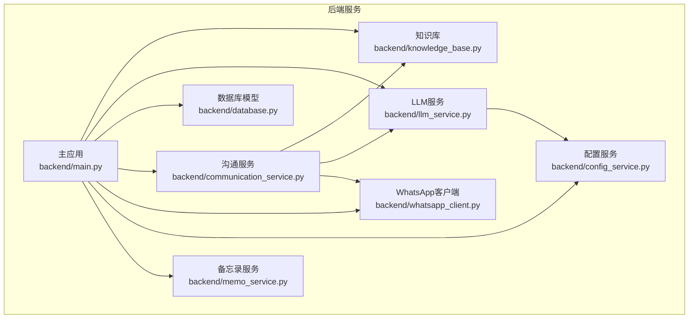
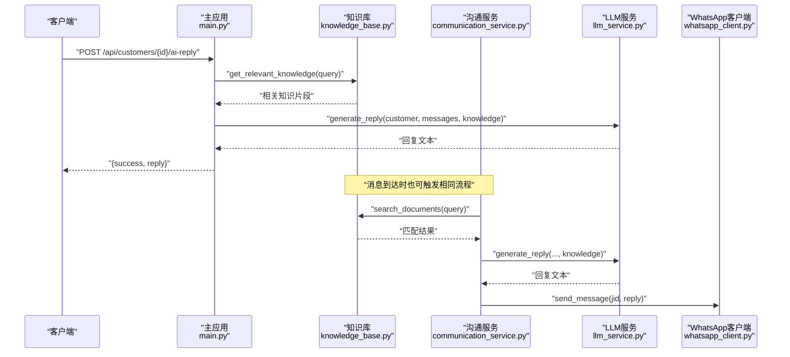
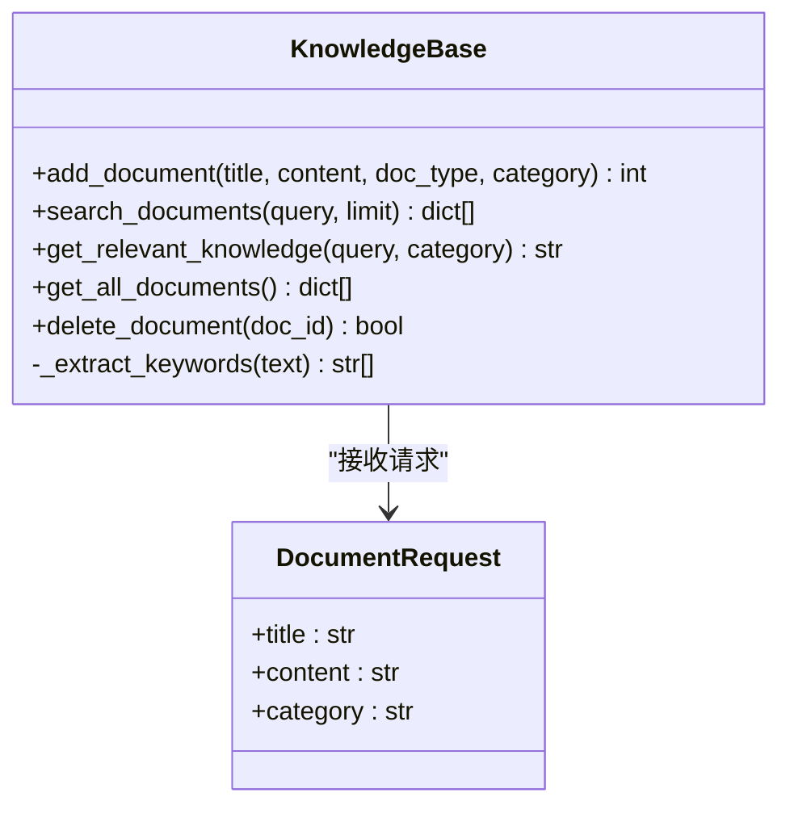
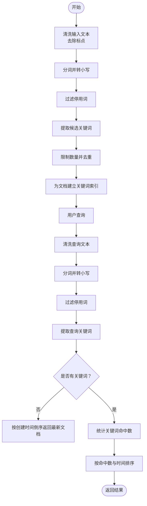
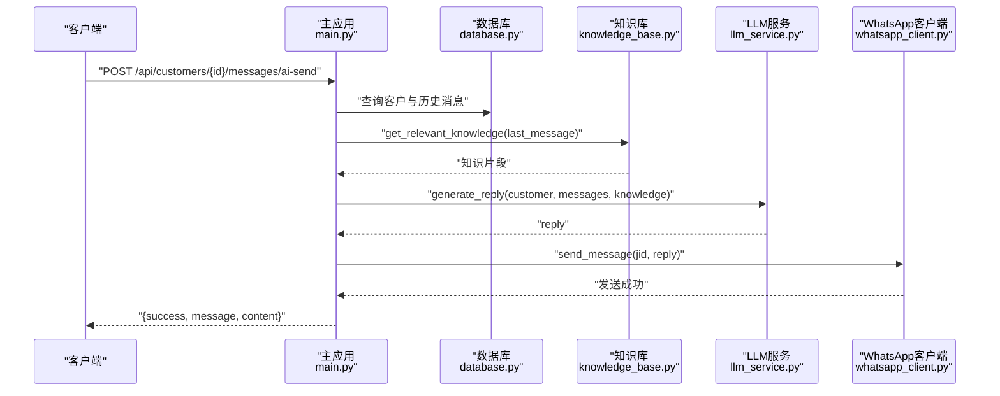
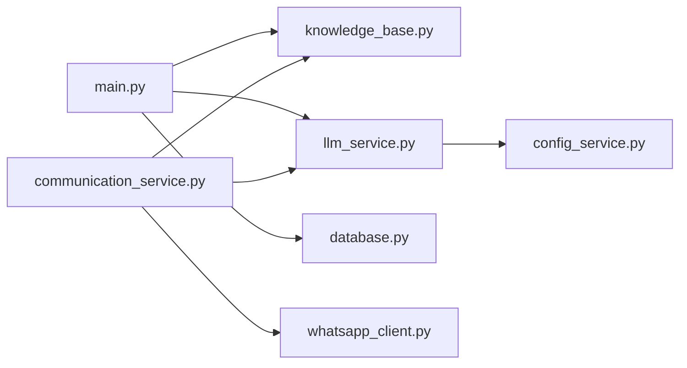

# 知识库API

<cite>
**本文档引用的文件**
- [knowledge_base.py](file://backend/knowledge_base.py)
- [main.py](file://backend/main.py)
- [llm_service.py](file://backend/llm_service.py)
- [database.py](file://backend/database.py)
- [communication_service.py](file://backend/communication_service.py)
- [whatsapp_client.py](file://backend/whatsapp_client.py)
- [config_service.py](file://backend/config_service.py)
- [memo_service.py](file://backend/memo_service.py)
</cite>

## 目录
1. [简介](#简介)
2. [项目结构](#项目结构)
3. [核心组件](#核心组件)
4. [架构总览](#架构总览)
5. [详细组件分析](#详细组件分析)
6. [依赖分析](#依赖分析)
7. [性能考虑](#性能考虑)
8. [故障排除指南](#故障排除指南)
9. [结论](#结论)
10. [附录](#附录)

## 简介
本文件面向WhatsApp智能客户系统中的“知识库API”，系统性梳理知识库相关的接口、数据结构、文档管理流程、检索与推荐机制、与AI回复系统的集成方式，以及最佳实践与性能优化建议。知识库采用SQLite存储文档与关键词索引，提供文档增删改查、关键词检索与相关知识抽取能力；并与LLM服务结合，为智能回复提供上下文增强。

## 项目结构
知识库API位于后端主应用中，围绕FastAPI路由组织，知识库核心逻辑集中在独立模块中，便于复用与扩展。主要涉及以下文件：
- 知识库核心：backend/knowledge_base.py
- 主应用与路由：backend/main.py
- LLM服务与AI回复：backend/llm_service.py
- 数据库模型与配置：backend/database.py
- 消息与自动回复：backend/communication_service.py
- WhatsApp客户端封装：backend/whatsapp_client.py
- 配置管理（含加密存储）：backend/config_service.py
- 备忘录服务（对比参考）：backend/memo_service.py

图表来源
- [main.py:128-134](file://backend/main.py#L128-L134)
- [knowledge_base.py:11-212](file://backend/knowledge_base.py#L11-L212)
- [llm_service.py:11-286](file://backend/llm_service.py#L11-L286)
- [database.py:23-297](file://backend/database.py#L23-L297)
- [communication_service.py:17-512](file://backend/communication_service.py#L17-L512)
- [whatsapp_client.py:13-437](file://backend/whatsapp_client.py#L13-L437)
- [config_service.py:11-153](file://backend/config_service.py#L11-L153)
- [memo_service.py:9-156](file://backend/memo_service.py#L9-L156)

章节来源
- [main.py:128-134](file://backend/main.py#L128-L134)
- [knowledge_base.py:11-212](file://backend/knowledge_base.py#L11-L212)

## 核心组件
- 知识库管理（KnowledgeBase）
  - 负责文档的增删改查、关键词提取与索引、简单关键词匹配检索、相关知识抽取。
  - 数据库存储：documents（文档表）、keywords（关键词索引表）。
- 主应用路由（FastAPI）
  - 提供知识库API：文档列表、新增、删除、搜索。
  - 与AI回复集成：在生成AI回复前，先从知识库抽取相关知识。
- LLM服务（LLMService）
  - 负责调用外部大模型（如OpenAI），支持多提供商、多模型、智能体级别参数覆盖。
  - 与知识库结合：将知识库内容注入系统提示词，参与对话生成。
- 数据库模型（SQLAlchemy）
  - 定义客户、消息、会话、标签、智能体、提供商等模型，支撑知识库与AI回复的上下文数据。
- 沟通服务（CommunicationService）
  - 自动回复与转人工流程，负责在消息到达时调用知识库与LLM服务。
- WhatsApp客户端（WhatsAppClient）
  - 封装与whatsapp-cli交互，负责消息发送、联系人/聊天列表获取、JID处理等。
- 配置服务（ConfigService）
  - 加密存储LLM配置（API Key等），保障安全。
- 备忘录服务（MemoService）
  - 对比参考：独立SQLite存储，提供增删改查与搜索，体现文档管理的通用模式。

章节来源
- [knowledge_base.py:11-212](file://backend/knowledge_base.py#L11-L212)
- [main.py:800-844](file://backend/main.py#L800-L844)
- [llm_service.py:11-286](file://backend/llm_service.py#L11-L286)
- [database.py:23-297](file://backend/database.py#L23-L297)
- [communication_service.py:17-512](file://backend/communication_service.py#L17-L512)
- [whatsapp_client.py:13-437](file://backend/whatsapp_client.py#L13-L437)
- [config_service.py:11-153](file://backend/config_service.py#L11-L153)
- [memo_service.py:9-156](file://backend/memo_service.py#L9-L156)

## 架构总览
知识库API与AI回复系统的关键交互如下：
- 客户消息到达后，沟通服务触发知识库检索，抽取相关知识。
- 将知识库内容注入LLM提示词，生成回复。
- 通过WhatsApp客户端发送回复至客户。

图表来源
- [main.py:727-750](file://backend/main.py#L727-L750)
- [knowledge_base.py:130-141](file://backend/knowledge_base.py#L130-L141)
- [llm_service.py:177-198](file://backend/llm_service.py#L177-L198)
- [communication_service.py:47-265](file://backend/communication_service.py#L47-L265)
- [whatsapp_client.py:133-154](file://backend/whatsapp_client.py#L133-L154)

## 详细组件分析

### 知识库数据结构与API
- 数据表设计
  - documents：存储文档标题、内容、类型、分类、唯一哈希、创建/更新时间。
  - keywords：为每篇文档建立关键词索引，用于快速匹配。
- 关键API
  - GET /api/knowledge/documents：获取知识库文档列表。
  - POST /api/knowledge/documents：新增文档（标题、内容、分类）。
  - DELETE /api/knowledge/documents/{doc_id}：删除文档。
  - GET /api/knowledge/search?q=：关键词搜索。
- 检索与相关性
  - 关键词提取：基于中文分词与停用词过滤，提取高频词作为关键词。
  - 匹配策略：若查询无关键词，返回最新文档；否则按关键词命中数量与创建时间排序。
  - 相关知识抽取：返回若干条最相关的知识片段，供LLM使用。

图表来源
- [knowledge_base.py:51-200](file://backend/knowledge_base.py#L51-L200)
- [main.py:800-844](file://backend/main.py#L800-L844)

章节来源
- [knowledge_base.py:11-212](file://backend/knowledge_base.py#L11-L212)
- [main.py:800-844](file://backend/main.py#L800-L844)

### 智能检索与关键词匹配流程

图表来源
- [knowledge_base.py:87-128](file://backend/knowledge_base.py#L87-L128)
- [knowledge_base.py:179-199](file://backend/knowledge_base.py#L179-L199)

章节来源
- [knowledge_base.py:87-128](file://backend/knowledge_base.py#L87-L128)
- [knowledge_base.py:179-199](file://backend/knowledge_base.py#L179-L199)

### 与AI回复系统的集成
- 路由集成
  - 生成AI回复：POST /api/customers/{id}/ai-reply
  - 生成并发送AI回复：POST /api/customers/{id}/messages/ai-send
- 流程
  - 获取客户历史消息（最近N条）。
  - 从知识库抽取相关知识（按最新消息内容）。
  - 调用LLM生成回复，必要时发送至客户。
- 智能体选择
  - LLM服务支持按客户标签匹配智能体，不同智能体可配置不同的系统提示词与模型参数。

图表来源
- [main.py:752-796](file://backend/main.py#L752-L796)
- [llm_service.py:177-198](file://backend/llm_service.py#L177-L198)
- [knowledge_base.py:130-141](file://backend/knowledge_base.py#L130-L141)
- [whatsapp_client.py:133-154](file://backend/whatsapp_client.py#L133-L154)

章节来源
- [main.py:727-796](file://backend/main.py#L727-L796)
- [llm_service.py:11-286](file://backend/llm_service.py#L11-L286)
- [knowledge_base.py:130-141](file://backend/knowledge_base.py#L130-L141)
- [whatsapp_client.py:133-154](file://backend/whatsapp_client.py#L133-L154)

### 文档管理与维护最佳实践
- 文档分类与标签
  - 使用category字段区分文档类型（如general、faq、policy等），便于后续检索与定向匹配。
  - 可结合客户标签体系，实现“智能体-知识库”绑定，提升回复精准度。
- 内容更新策略
  - 采用内容哈希去重，避免重复入库。
  - 更新文档时，重建关键词索引，保持检索准确性。
- 关键词提取优化
  - 可引入更细粒度的中文分词（如jieba）与领域词典，提高关键词代表性。
  - 定期评估关键词命中率，动态调整停用词与阈值。
- 性能与扩展
  - SQLite适合中小规模知识库；大规模场景建议迁移到向量数据库（如FAISS、Pinecone）实现语义相似度检索。
  - 结合缓存层（Redis）缓存热点知识片段，降低重复检索成本。

章节来源
- [knowledge_base.py:51-86](file://backend/knowledge_base.py#L51-L86)
- [knowledge_base.py:179-199](file://backend/knowledge_base.py#L179-L199)
- [database.py:155-209](file://backend/database.py#L155-L209)

## 依赖分析
- 组件耦合
  - 主应用依赖知识库与LLM服务；沟通服务同时依赖知识库与LLM服务；LLM服务依赖配置服务。
- 外部依赖
  - 大模型API调用（HTTPX异步客户端）。
  - WhatsApp CLI交互（子进程调用）。
- 数据流
  - 客户消息经WhatsApp客户端进入系统，由沟通服务触发知识库检索与LLM生成，最终通过WhatsApp客户端发送。

图表来源
- [main.py:17-26](file://backend/main.py#L17-L26)
- [communication_service.py:12-14](file://backend/communication_service.py#L12-L14)
- [llm_service.py:14-16](file://backend/llm_service.py#L14-L16)
- [config_service.py:14-22](file://backend/config_service.py#L14-L22)

章节来源
- [main.py:17-26](file://backend/main.py#L17-L26)
- [communication_service.py:12-14](file://backend/communication_service.py#L12-L14)
- [llm_service.py:14-16](file://backend/llm_service.py#L14-L16)
- [config_service.py:14-22](file://backend/config_service.py#L14-L22)

## 性能考虑
- 检索性能
  - 当前关键词匹配为SQL内连接与计数，适合中小规模；建议在关键词表增加复合索引（doc_id, keyword）。
- LLM调用
  - 使用异步HTTPX客户端，减少阻塞；合理设置超时与重试策略。
- 缓存策略
  - 对热点知识片段与常用查询结果进行缓存，降低重复计算。
- 扩展方案
  - 引入向量化检索（如Sentence-BERT嵌入+FAISS），实现语义相似度匹配，提升召回质量。

## 故障排除指南
- 知识库API错误
  - 新增/删除文档失败：检查数据库连接与唯一约束（file_hash）。
  - 搜索无结果：确认关键词提取是否生效，必要时放宽停用词策略。
- AI回复失败
  - LLM API异常：检查配置服务中的API Key与Base URL，确认网络连通性。
  - 回复为空：检查知识库抽取是否返回内容，必要时提供兜底回复模板。
- WhatsApp发送失败
  - JID格式问题：使用客户端封装的JID转换逻辑，或尝试备用后缀。
  - 超时：增大命令超时时间或优化CLI调用策略。

章节来源
- [knowledge_base.py:79-85](file://backend/knowledge_base.py#L79-L85)
- [llm_service.py:149-176](file://backend/llm_service.py#L149-L176)
- [whatsapp_client.py:133-154](file://backend/whatsapp_client.py#L133-L154)

## 结论
知识库API提供了轻量级但实用的文档管理与检索能力，配合LLM服务实现了“知识增强”的智能回复。当前实现以关键词匹配为主，具备良好的可维护性与扩展性。建议在业务增长后引入向量化检索与缓存机制，进一步提升检索效率与用户体验。

## 附录

### API定义与使用示例
- 获取知识库文档列表
  - 方法：GET
  - 路径：/api/knowledge/documents
  - 响应：包含文档数组（id、title、type、category、created_at）
- 新增知识库文档
  - 方法：POST
  - 路径：/api/knowledge/documents
  - 请求体：DocumentRequest（title、content、category）
  - 响应：包含成功标识与新增文档ID
- 删除知识库文档
  - 方法：DELETE
  - 路径：/api/knowledge/documents/{doc_id}
  - 响应：包含成功标识
- 搜索知识库
  - 方法：GET
  - 路径：/api/knowledge/search?q=查询关键词
  - 响应：包含匹配结果数组
- 生成AI回复（仅生成）
  - 方法：POST
  - 路径：/api/customers/{id}/ai-reply
  - 响应：包含回复文本
- 生成并发送AI回复
  - 方法：POST
  - 路径：/api/customers/{id}/messages/ai-send
  - 响应：包含发送状态与回复内容

章节来源
- [main.py:806-844](file://backend/main.py#L806-L844)
- [main.py:727-796](file://backend/main.py#L727-L796)