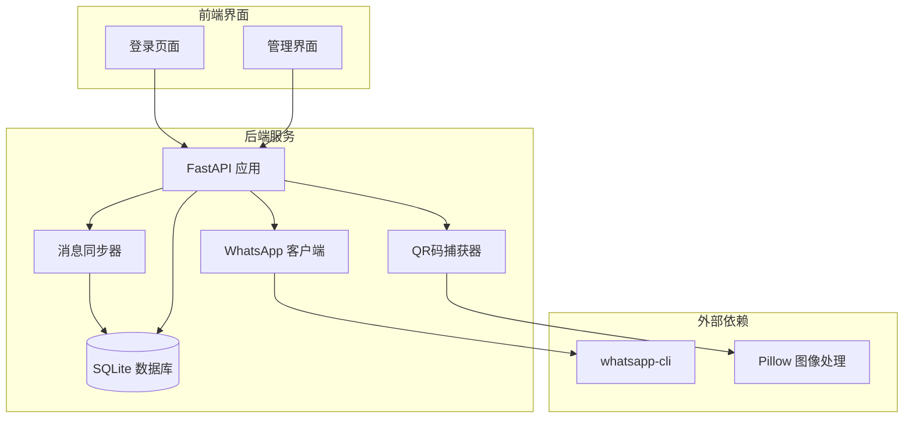
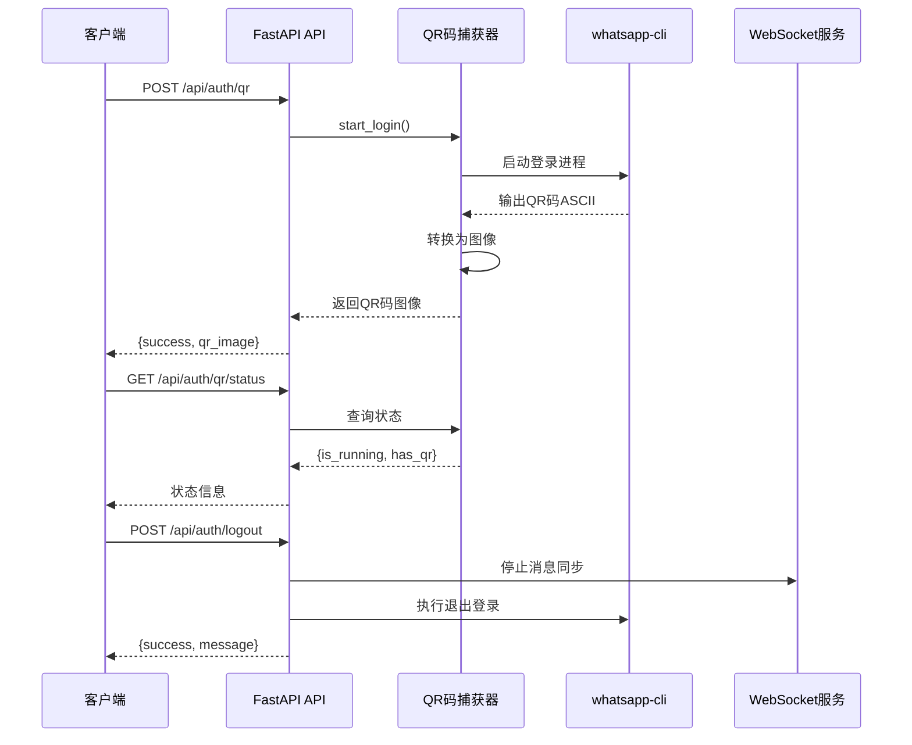
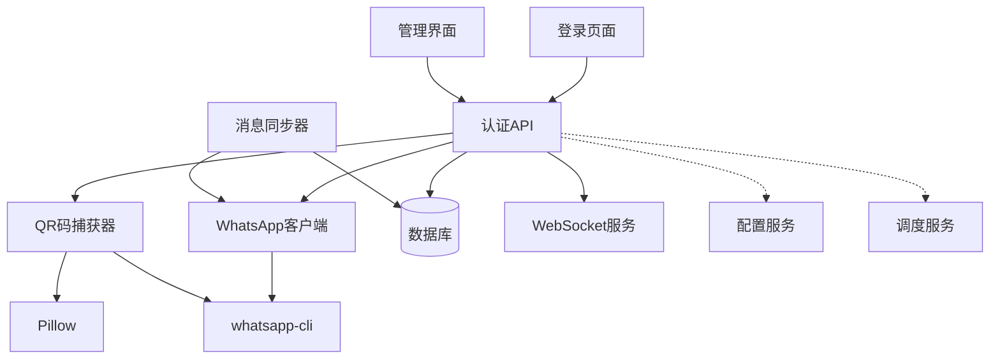

# 认证API

<cite>
**本文档引用的文件**
- [main.py](file://backend/main.py)
- [whatsapp_client.py](file://backend/whatsapp_client.py)
- [qr_terminal.py](file://backend/qr_terminal.py)
- [login.html](file://backend/static/login.html)
- [login_whatsapp.py](file://login_whatsapp.py)
- [start_server.py](file://start_server.py)
- [database.py](file://backend/database.py)
</cite>

## 目录
1. [简介](#简介)
2. [项目结构](#项目结构)
3. [核心组件](#核心组件)
4. [架构概览](#架构概览)
5. [详细组件分析](#详细组件分析)
6. [依赖关系分析](#依赖关系分析)
7. [性能考虑](#性能考虑)
8. [故障排除指南](#故障排除指南)
9. [结论](#结论)

## 简介

WhatsApp智能客户系统的认证API提供了完整的WhatsApp账户认证和管理功能。该系统通过FastAPI框架实现了RESTful API接口，支持QR码登录、登录状态检查、联系人同步等核心功能。系统采用whatsapp-cli作为底层通信工具，通过终端捕获QR码并转换为可扫描的图像格式。

## 项目结构

该项目采用分层架构设计，主要包含以下核心模块：



**图表来源**
- [main.py:129-157](file://backend/main.py#L129-L157)
- [whatsapp_client.py:13-26](file://backend/whatsapp_client.py#L13-L26)
- [qr_terminal.py:14-23](file://backend/qr_terminal.py#L14-L23)

**章节来源**
- [main.py:129-157](file://backend/main.py#L129-L157)
- [whatsapp_client.py:13-26](file://backend/whatsapp_client.py#L13-L26)
- [qr_terminal.py:14-23](file://backend/qr_terminal.py#L14-L23)

## 核心组件

### 认证API端点

系统提供以下认证相关API端点：

| 端点 | 方法 | 描述 |
|------|------|------|
| `/api/auth/status` | GET | 获取WhatsApp登录状态 |
| `/api/auth/qr` | POST | 获取QR码进行登录 |
| `/api/auth/qr/status` | GET | 获取QR码状态 |
| `/api/auth/qr/cancel` | POST | 取消登录进程 |
| `/api/auth/logout` | POST | 退出登录 |
| `/api/auth/sync-contacts` | POST | 同步联系人列表 |

### WhatsApp客户端

WhatsAppClient类封装了与whatsapp-cli的交互，提供以下核心功能：
- 登录状态检查
- 联系人和聊天列表获取
- 消息发送和接收
- 用户信息获取

### QR码捕获器

TerminalQRCapture类负责捕获终端中的ASCII QR码并转换为可显示的图像：
- 启动登录进程
- 捕获QR码输出
- 转换为base64图像
- 监控登录状态

**章节来源**
- [main.py:198-381](file://backend/main.py#L198-L381)
- [whatsapp_client.py:82-127](file://backend/whatsapp_client.py#L82-L127)
- [qr_terminal.py:24-80](file://backend/qr_terminal.py#L24-L80)

## 架构概览

系统采用事件驱动的架构模式，通过异步处理实现高效的并发操作：



**图表来源**
- [main.py:221-381](file://backend/main.py#L221-L381)
- [qr_terminal.py:24-80](file://backend/qr_terminal.py#L24-L80)
- [whatsapp_client.py:110-117](file://backend/whatsapp_client.py#L110-L117)

## 详细组件分析

### 登录状态检查 API

#### 端点定义
- **路径**: `/api/auth/status`
- **方法**: GET
- **功能**: 检查WhatsApp客户端的认证状态

#### 请求参数
无参数

#### 响应格式
```json
{
  "connected": boolean,
  "logged_in": boolean,
  "database": object
}
```

#### 状态码
- 200: 成功获取状态
- 500: 服务器内部错误

#### 错误处理
- 客户端未初始化时返回错误信息
- 异常情况返回包含错误详情的对象

**章节来源**
- [main.py:198-213](file://backend/main.py#L198-L213)
- [whatsapp_client.py:82-92](file://backend/whatsapp_client.py#L82-L92)

### QR码登录 API

#### 端点定义
- **路径**: `/api/auth/qr`
- **方法**: POST
- **功能**: 启动QR码登录流程

#### 请求参数
无参数

#### 响应格式
```json
{
  "success": boolean,
  "message": string,
  "qr_image"?: string,
  "status"?: string,
  "has_qr"?: boolean
}
```

#### 状态码
- 200: 成功启动登录
- 500: 登录启动失败

#### 错误处理
- 已登录状态下拒绝重复登录
- 登录进程已在运行时返回等待状态
- QR码捕获超时处理

**章节来源**
- [main.py:221-340](file://backend/main.py#L221-L340)
- [qr_terminal.py:24-80](file://backend/qr_terminal.py#L24-L80)

### QR码状态查询 API

#### 端点定义
- **路径**: `/api/auth/qr/status`
- **方法**: GET
- **功能**: 获取QR码登录状态

#### 请求参数
无参数

#### 响应格式
```json
{
  "is_running": boolean,
  "has_qr": boolean,
  "qr_image": string
}
```

#### 状态码
- 200: 成功获取状态
- 500: 查询失败

**章节来源**
- [main.py:342-352](file://backend/main.py#L342-L352)
- [qr_terminal.py:282-284](file://backend/qr_terminal.py#L282-L284)

### 取消登录 API

#### 端点定义
- **路径**: `/api/auth/qr/cancel`
- **方法**: POST
- **功能**: 取消正在进行的登录进程

#### 请求参数
无参数

#### 响应格式
```json
{
  "success": boolean,
  "message": string
}
```

#### 状态码
- 200: 成功取消
- 500: 取消失败

**章节来源**
- [main.py:355-359](file://backend/main.py#L355-L359)
- [qr_terminal.py:265-280](file://backend/qr_terminal.py#L265-L280)

### 退出登录 API

#### 端点定义
- **路径**: `/api/auth/logout`
- **方法**: POST
- **功能**: 完全退出WhatsApp登录

#### 请求参数
无参数

#### 响应格式
```json
{
  "success": boolean,
  "message": string
}
```

#### 状态码
- 200: 成功退出
- 500: 退出失败

#### 错误处理
- 停止消息同步器
- 清理WebSocket连接
- 处理异常情况

**章节来源**
- [main.py:362-381](file://backend/main.py#L362-L381)
- [whatsapp_client.py:110-117](file://backend/whatsapp_client.py#L110-L117)

### 联系人同步 API

#### 端点定义
- **路径**: `/api/auth/sync-contacts`
- **方法**: POST
- **功能**: 同步WhatsApp联系人到本地数据库

#### 请求参数
无参数

#### 响应格式
```json
{
  "success": boolean,
  "message": string,
  "new_customers": array,
  "updated_customers": array,
  "total_contacts": number,
  "total_chats": number,
  "current_user": string
}
```

#### 状态码
- 200: 同步完成
- 400: 未登录状态
- 500: 同步失败

#### 错误处理
- 检查登录状态
- 处理数据库事务
- 异常回滚

**章节来源**
- [main.py:383-474](file://backend/main.py#L383-L474)
- [database.py:23-38](file://backend/database.py#L23-L38)

## 依赖关系分析

系统各组件之间的依赖关系如下：



**图表来源**
- [main.py:17-26](file://backend/main.py#L17-L26)
- [whatsapp_client.py:13-26](file://backend/whatsapp_client.py#L13-L26)
- [qr_terminal.py:14-23](file://backend/qr_terminal.py#L14-L23)

### 组件耦合度分析

- **低耦合**: API层与业务逻辑分离
- **中等耦合**: 客户端与QR码捕获器
- **高耦合**: 消息同步器与数据库

### 外部依赖

- **whatsapp-cli**: WhatsApp命令行工具
- **Pillow**: 图像处理库
- **FastAPI**: Web框架
- **SQLAlchemy**: ORM框架

**章节来源**
- [main.py:17-26](file://backend/main.py#L17-L26)
- [whatsapp_client.py:4-10](file://backend/whatsapp_client.py#L4-L10)
- [qr_terminal.py:5-11](file://backend/qr_terminal.py#L5-L11)

## 性能考虑

### 异步处理优化

系统采用异步编程模式提高性能：
- WebSocket实时通信
- 异步消息同步
- 非阻塞QR码捕获

### 内存管理

- 及时清理QR码缓存
- 控制消息同步频率
- 优化数据库连接池

### 并发控制

- 限制同时运行的登录进程
- 控制消息轮询间隔
- 管理WebSocket连接数量

## 故障排除指南

### 常见问题及解决方案

#### 登录失败
**症状**: QR码无法生成或登录超时
**原因**: 
- whatsapp-cli未正确安装
- 网络连接问题
- 权限不足

**解决方法**:
1. 检查whatsapp-cli安装状态
2. 验证PATH环境变量
3. 确认网络连接稳定

#### QR码显示异常
**症状**: QR码图像模糊或无法显示
**原因**:
- 终端宽度不足
- 图像转换失败
- 浏览器兼容性问题

**解决方法**:
1. 调整终端窗口大小
2. 检查Pillow库安装
3. 刷新浏览器缓存

#### 数据库连接问题
**症状**: 联系人同步失败
**原因**:
- 数据库文件损坏
- 权限不足
- 连接池耗尽

**解决方法**:
1. 检查数据库文件完整性
2. 验证文件权限
3. 重启数据库服务

**章节来源**
- [login_whatsapp.py:16-32](file://login_whatsapp.py#L16-L32)
- [start_server.py:16-33](file://start_server.py#L16-L33)
- [qr_terminal.py:167-240](file://backend/qr_terminal.py#L167-L240)

## 结论

WhatsApp智能客户系统的认证API提供了完整的WhatsApp账户管理功能。通过精心设计的架构和完善的错误处理机制，系统能够稳定可靠地处理各种认证场景。

### 主要优势

1. **完整的认证流程**: 支持从QR码生成到登录验证的全流程
2. **实时状态监控**: 通过WebSocket实现实时状态更新
3. **灵活的错误处理**: 提供详细的错误信息和恢复机制
4. **高性能设计**: 采用异步处理和连接池优化

### 使用建议

1. **生产环境部署**: 确保whatsapp-cli正确安装和配置
2. **安全考虑**: 限制API访问权限和CORS策略
3. **监控告警**: 建立系统健康检查和异常告警机制
4. **备份策略**: 定期备份数据库和配置文件

该认证API为WhatsApp智能客户系统提供了坚实的基础，支持企业级的客户关系管理和自动化营销需求。