# 管理界面

<cite>
**本文档引用的文件**
- [backend/main.py](file://backend/main.py)
- [backend/static/admin.html](file://backend/static/admin.html)
- [backend/static/index.html](file://backend/static/index.html)
- [backend/static/login.html](file://backend/static/login.html)
- [backend/config_service.py](file://backend/config_service.py)
- [backend/admin_notify.py](file://backend/admin_notify.py)
- [backend/knowledge_base.py](file://backend/knowledge_base.py)
- [backend/scheduler_service.py](file://backend/scheduler_service.py)
- [backend/notify_service.py](file://backend/notify_service.py)
- [backend/database.py](file://backend/database.py)
- [backend/whatsapp_client.py](file://backend/whatsapp_client.py)
- [backend/whatsapp_adapter.py](file://backend/whatsapp_adapter.py)
</cite>

## 目录
1. [简介](#简介)
2. [项目结构](#项目结构)
3. [核心组件](#核心组件)
4. [架构概览](#架构概览)
5. [详细组件分析](#详细组件分析)
6. [依赖关系分析](#依赖关系分析)
7. [性能考虑](#性能考虑)
8. [故障排除指南](#故障排除指南)
9. [结论](#结论)

## 简介

WhatsApp 智能客户管理系统是一个基于 FastAPI 的现代化客户关系管理平台，专为 WhatsApp 机器人设计。该系统提供了完整的管理界面，包括客户管理、知识库管理、AI智能体配置、通知设置等功能。

系统采用前后端分离架构，后端使用 Python FastAPI 框架，前端提供三个独立的管理界面：
- **系统管理界面**：管理员配置和系统设置
- **聊天界面**：客户服务和对话管理  
- **登录界面**：WhatsApp 账户认证

## 项目结构

项目采用模块化设计，主要分为以下层次：

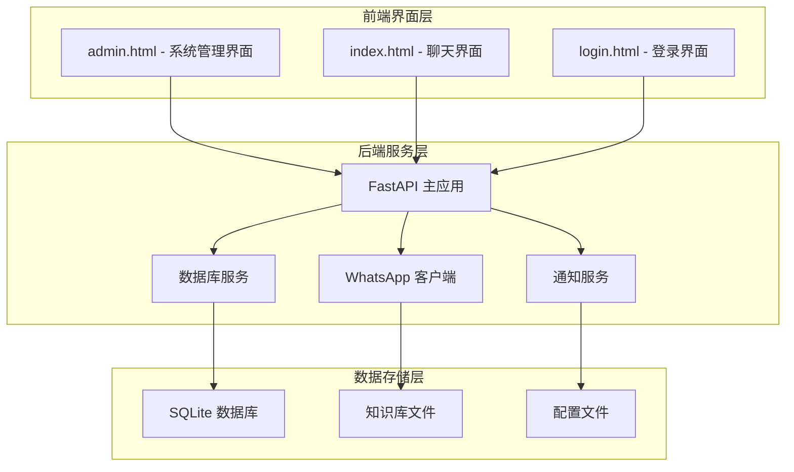

**图表来源**
- [backend/main.py:1-800](file://backend/main.py#L1-L800)
- [backend/static/admin.html:1-800](file://backend/static/admin.html#L1-L800)

**章节来源**
- [backend/main.py:1-800](file://backend/main.py#L1-L800)
- [backend/static/admin.html:1-800](file://backend/static/admin.html#L1-L800)
- [backend/static/index.html:1-800](file://backend/static/index.html#L1-L800)
- [backend/static/login.html:1-643](file://backend/static/login.html#L1-L643)

## 核心组件

### 管理界面架构

系统提供三个独立的管理界面，每个都有特定的功能和用途：

#### 系统管理界面 (admin.html)
- **功能**：大模型配置、AI智能体管理、客户标签、联系人导入、知识库管理、发送计划、通知设置
- **特点**：集中式管理所有系统配置和业务设置
- **技术**：纯前端 JavaScript，通过 API 与后端交互

#### 聊天界面 (index.html)
- **功能**：客户聊天、消息管理、AI回复、知识库集成
- **特点**：实时聊天体验，支持多媒体消息
- **技术**：响应式设计，WebSocket 实时通信

#### 登录界面 (login.html)
- **功能**：WhatsApp 账户认证，支持 Neonize 和 CLI 两种后端
- **特点**：直观的二维码登录流程
- **技术**：异步状态检查，自动轮询

**章节来源**
- [backend/static/admin.html:1-800](file://backend/static/admin.html#L1-L800)
- [backend/static/index.html:1-800](file://backend/static/index.html#L1-L800)
- [backend/static/login.html:1-643](file://backend/static/login.html#L1-L643)

### 数据模型

系统使用 SQLAlchemy ORM 定义了完整的数据模型：

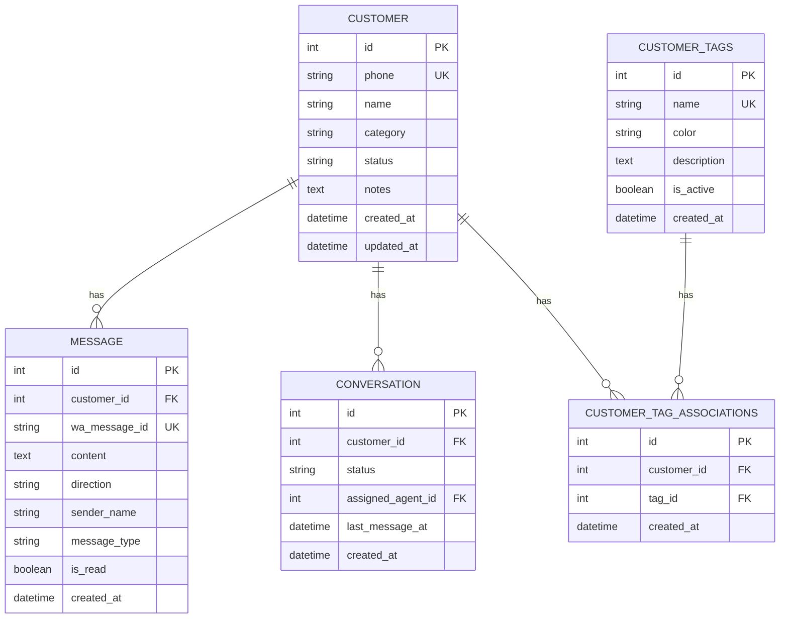

**图表来源**
- [backend/database.py:28-298](file://backend/database.py#L28-L298)

**章节来源**
- [backend/database.py:28-298](file://backend/database.py#L28-L298)

## 架构概览

系统采用分层架构设计，确保各组件之间的松耦合和高内聚：

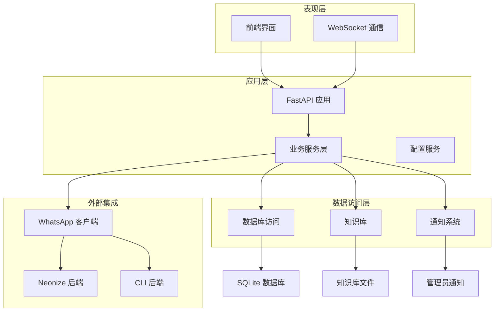

**图表来源**
- [backend/main.py:199-242](file://backend/main.py#L199-L242)
- [backend/whatsapp_adapter.py:17-180](file://backend/whatsapp_adapter.py#L17-L180)

**章节来源**
- [backend/main.py:199-242](file://backend/main.py#L199-L242)
- [backend/whatsapp_adapter.py:17-180](file://backend/whatsapp_adapter.py#L17-L180)

## 详细组件分析

### 管理界面组件

#### 系统管理界面 (admin.html)

系统管理界面提供了全面的配置管理功能：

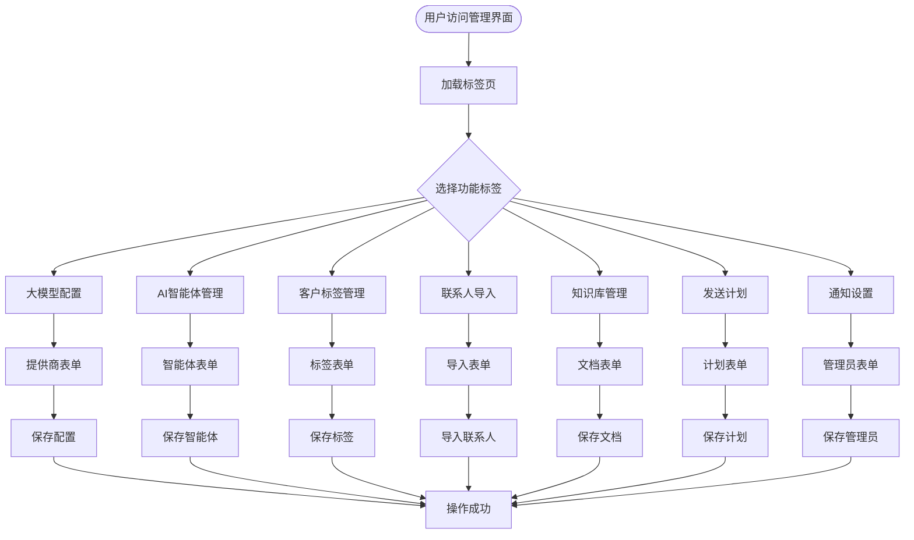

**图表来源**
- [backend/static/admin.html:392-726](file://backend/static/admin.html#L392-L726)

##### 大模型配置管理

系统支持多种大模型提供商的配置管理：

| 配置项 | 类型 | 描述 | 默认值 |
|--------|------|------|--------|
| API Key | 字符串 | 大模型访问密钥 | 无 |
| Base URL | 字符串 | API 基础地址 | https://api.openai.com/v1 |
| Model | 字符串 | 使用的模型名称 | gpt-3.5-turbo |
| Temperature | 浮点数 | 生成温度参数 | 0.7 |
| Max Tokens | 整数 | 最大生成令牌数 | 500 |

##### AI智能体管理

智能体管理支持多智能体配置和标签绑定：

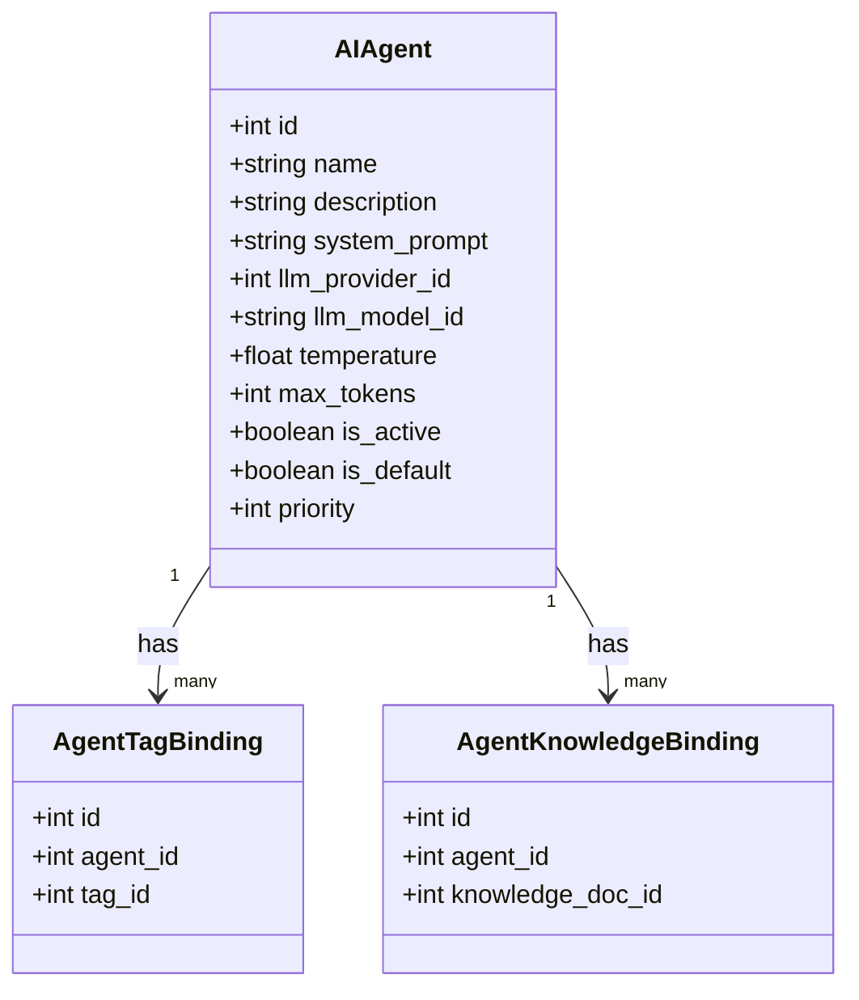

**图表来源**
- [backend/database.py:161-215](file://backend/database.py#L161-L215)

**章节来源**
- [backend/static/admin.html:403-418](file://backend/static/admin.html#L403-L418)
- [backend/config_service.py:135-147](file://backend/config_service.py#L135-L147)

#### 聊天界面 (index.html)

聊天界面提供了完整的客户服务功能：

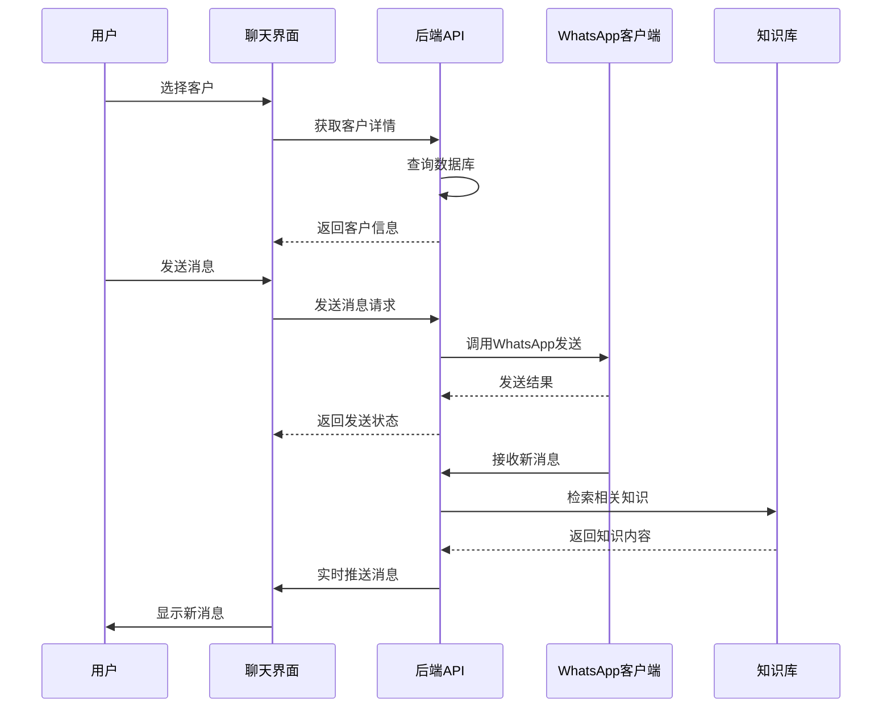

**图表来源**
- [backend/static/index.html:651-769](file://backend/static/index.html#L651-L769)

**章节来源**
- [backend/static/index.html:651-769](file://backend/static/index.html#L651-L769)

#### 登录界面 (login.html)

登录界面支持两种 WhatsApp 后端的认证：

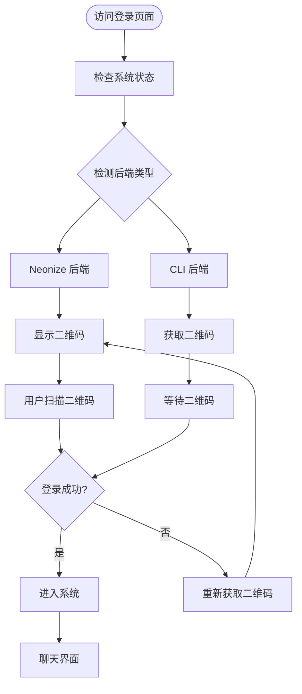

**图表来源**
- [backend/static/login.html:352-640](file://backend/static/login.html#L352-L640)

**章节来源**
- [backend/static/login.html:352-640](file://backend/static/login.html#L352-L640)

### 业务服务组件

#### 配置管理服务 (config_service.py)

配置服务提供了安全的配置存储机制：

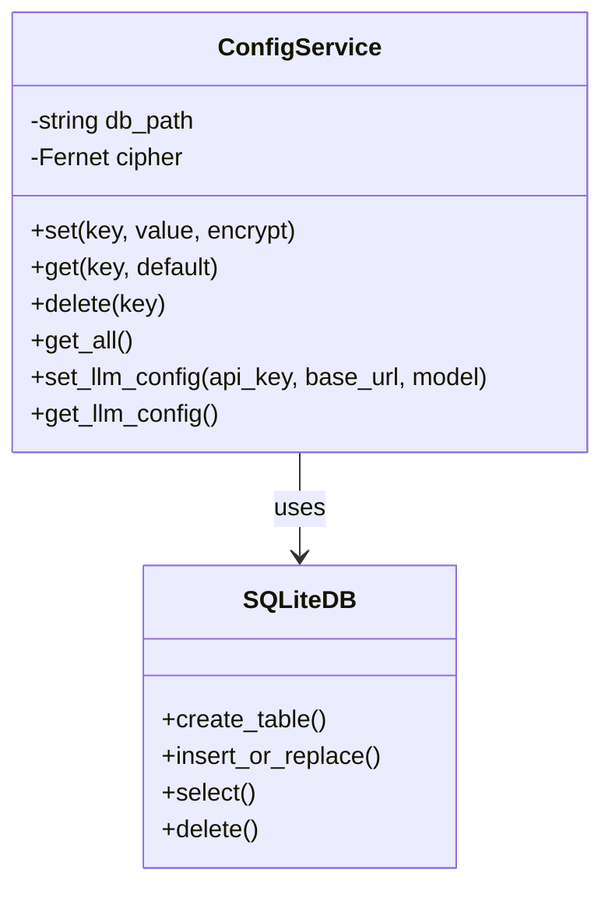

**图表来源**
- [backend/config_service.py:14-160](file://backend/config_service.py#L14-L160)

配置服务的主要特性：
- **加密存储**：使用 Fernet 对称加密保护敏感配置
- **键值存储**：简单的键值对存储结构
- **自动初始化**：首次使用时自动创建数据库和密钥
- **安全访问**：提供受保护的配置访问接口

**章节来源**
- [backend/config_service.py:14-160](file://backend/config_service.py#L14-L160)

#### 知识库管理 (knowledge_base.py)

知识库系统支持文档管理和向量检索：

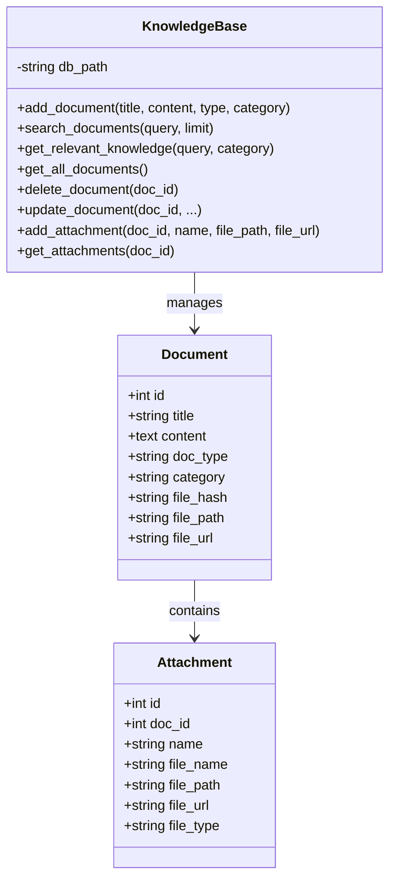

**图表来源**
- [backend/knowledge_base.py:11-614](file://backend/knowledge_base.py#L11-L614)

知识库的核心功能：
- **文档管理**：支持文本和文件型文档
- **关键词索引**：自动提取和索引关键词
- **附件管理**：支持图片、PDF等文件附件
- **智能检索**：基于关键词的相关性搜索

**章节来源**
- [backend/knowledge_base.py:11-614](file://backend/knowledge_base.py#L11-L614)

#### 定时发送服务 (scheduler_service.py)

定时发送服务支持按标签筛选客户和定时消息发送：

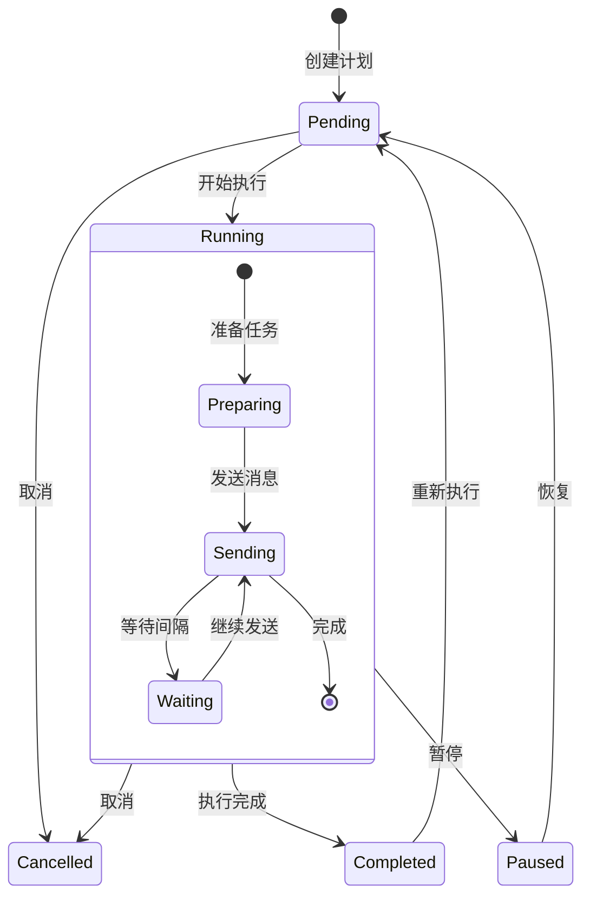

**图表来源**
- [backend/scheduler_service.py:59-96](file://backend/scheduler_service.py#L59-L96)

定时发送的核心特性：
- **标签筛选**：按客户标签精确筛选目标客户
- **个性化消息**：支持变量替换和个性化内容
- **进度跟踪**：实时跟踪发送进度和状态
- **错误处理**：完善的错误处理和重试机制

**章节来源**
- [backend/scheduler_service.py:59-96](file://backend/scheduler_service.py#L59-L96)

#### 通知服务 (notify_service.py)

通知服务负责商机事件检测和管理员通知：

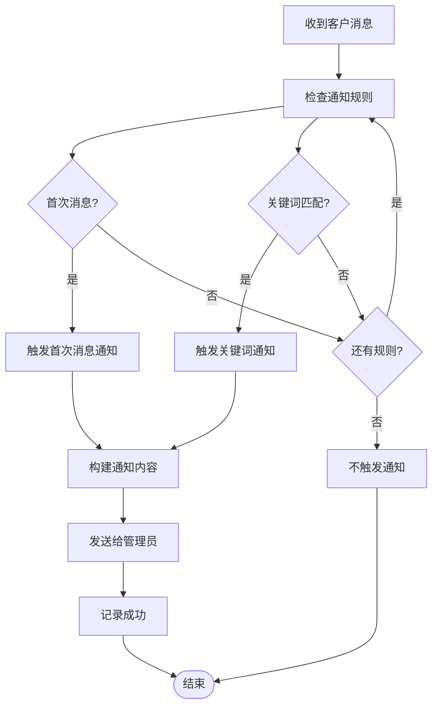

**图表来源**
- [backend/notify_service.py:29-98](file://backend/notify_service.py#L29-L98)

通知服务的关键功能：
- **规则引擎**：支持多种通知规则类型
- **关键词匹配**：智能关键词检测和匹配
- **管理员管理**：灵活的管理员配置和管理
- **每日报告**：自动生成和发送每日统计报告

**章节来源**
- [backend/notify_service.py:29-98](file://backend/notify_service.py#L29-L98)

## 依赖关系分析

系统采用模块化设计，各组件之间通过清晰的接口进行交互：

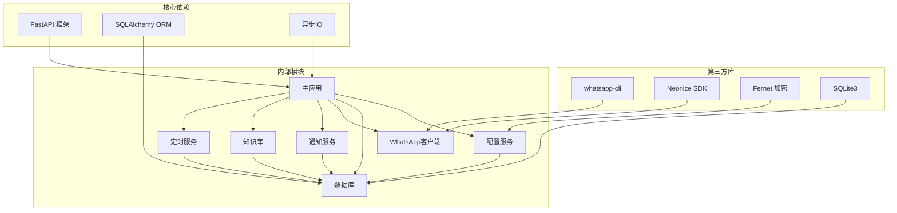

**图表来源**
- [backend/main.py:23-46](file://backend/main.py#L23-L46)
- [backend/whatsapp_adapter.py:12-14](file://backend/whatsapp_adapter.py#L12-L14)

**章节来源**
- [backend/main.py:23-46](file://backend/main.py#L23-L46)
- [backend/whatsapp_adapter.py:12-14](file://backend/whatsapp_adapter.py#L12-L14)

## 性能考虑

### 数据库优化

系统采用了多项数据库优化策略：

1. **连接池配置**：SQLite 连接池大小为 5，最大溢出 5，连接回收时间为 3600 秒
2. **索引优化**：为常用查询字段建立了适当的索引
3. **预加载策略**：使用 `joinedload` 预加载关联数据，避免 N+1 查询问题
4. **事务管理**：合理使用数据库事务确保数据一致性

### 异步处理

系统广泛使用异步编程模式：

1. **WebSocket 通信**：实时推送新消息给所有连接的客户端
2. **消息同步**：使用异步轮询实现近实时的消息同步
3. **并发控制**：使用线程锁确保并发安全
4. **任务调度**：支持异步任务调度和执行

### 缓存策略

系统实现了多层次的缓存机制：

1. **内存缓存**：缓存已知消息ID，避免重复处理
2. **配置缓存**：缓存敏感配置，减少磁盘访问
3. **会话缓存**：缓存活跃的 WebSocket 连接
4. **数据库缓存**：使用连接池减少数据库连接开销

## 故障排除指南

### 常见问题及解决方案

#### 登录问题

**问题**：无法登录 WhatsApp 账户
**可能原因**：
- WhatsApp CLI 未正确安装
- 网络连接不稳定
- 二维码过期

**解决步骤**：
1. 检查 WhatsApp CLI 是否在 PATH 中
2. 确认网络连接正常
3. 刷新二维码重新登录
4. 查看后端日志获取详细错误信息

#### 消息同步问题

**问题**：消息无法同步或延迟
**可能原因**：
- 同步进程未启动
- 数据库连接问题
- 网络中断

**解决步骤**：
1. 检查同步进程状态
2. 重启消息同步服务
3. 验证数据库连接
4. 检查网络连接稳定性

#### 知识库访问问题

**问题**：知识库文档无法访问
**可能原因**：
- 文件路径配置错误
- 权限不足
- 文件损坏

**解决步骤**：
1. 检查文件存储路径配置
2. 验证文件权限设置
3. 重新上传或修复文件
4. 清理缓存后重试

**章节来源**
- [backend/whatsapp_client.py:29-56](file://backend/whatsapp_client.py#L29-L56)
- [backend/whatsapp_client.py:428-460](file://backend/whatsapp_client.py#L428-L460)

### 调试工具

系统提供了多种调试和监控工具：

1. **日志系统**：详细的日志记录和错误追踪
2. **状态检查**：实时系统状态监控
3. **性能指标**：数据库连接池和消息处理性能
4. **错误报告**：自动化的错误收集和报告

## 结论

WhatsApp 智能客户管理系统是一个功能完整、架构清晰的现代化企业级应用。系统的主要优势包括：

### 技术优势
- **模块化设计**：清晰的组件分离和职责划分
- **异步架构**：高效的并发处理能力
- **安全设计**：完整的数据加密和访问控制
- **可扩展性**：支持多种后端和插件扩展

### 功能特色
- **多界面支持**：满足不同用户角色的需求
- **智能配置**：灵活的大模型和智能体配置
- **自动化能力**：完善的定时任务和通知系统
- **知识管理**：强大的文档和知识库管理

### 应用价值
该系统为企业提供了完整的 WhatsApp 客户关系管理解决方案，通过智能化的配置和自动化的工作流程，显著提升了客户服务质量效率。系统的模块化设计也为未来的功能扩展和技术升级奠定了良好的基础。