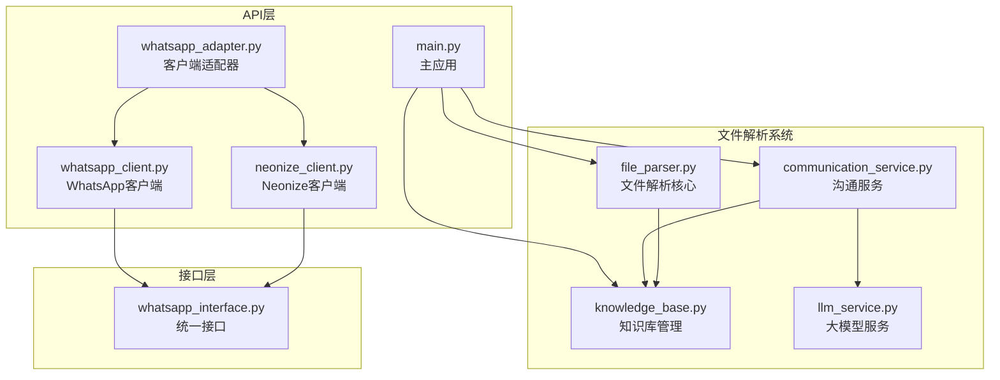
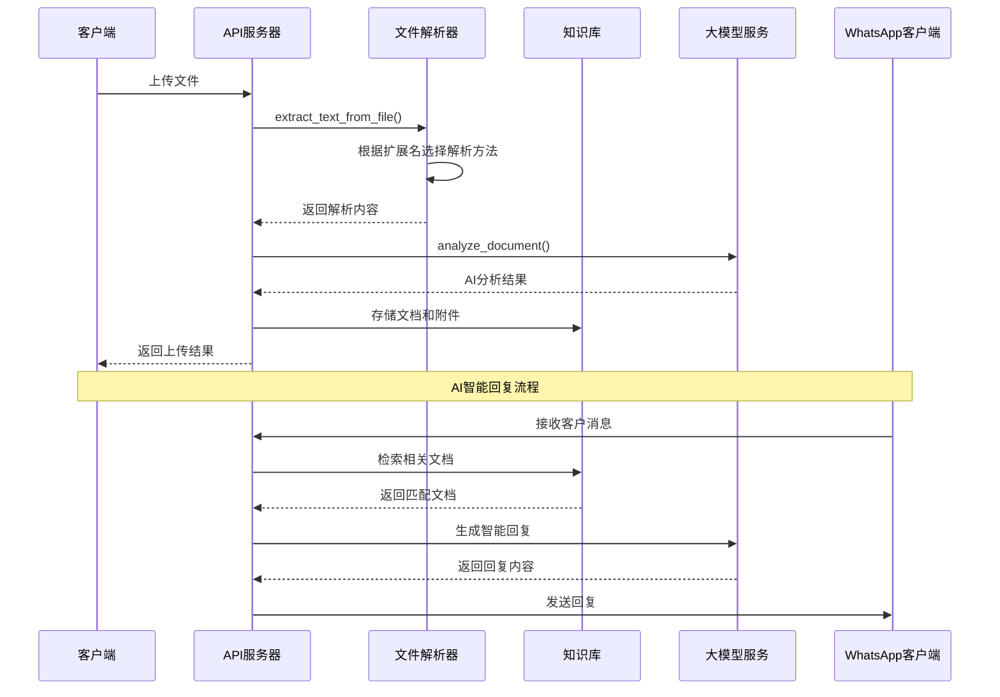
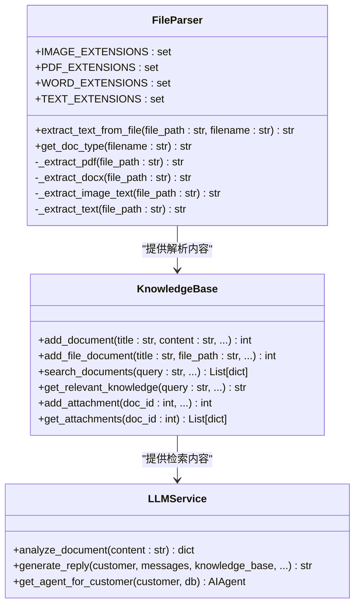
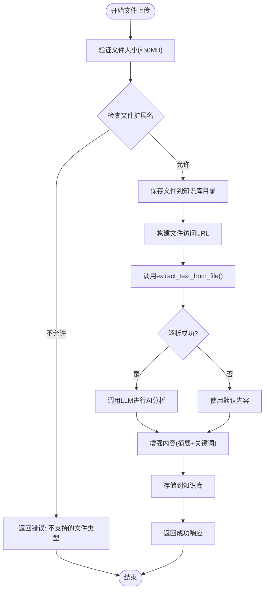
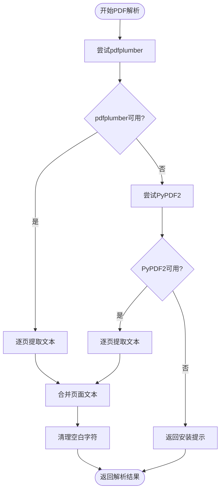
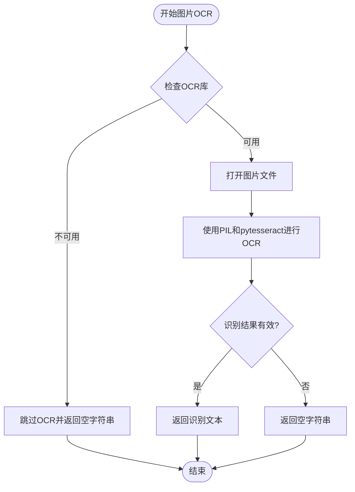
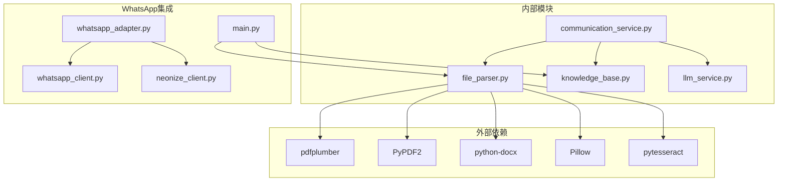

# 文件解析器

<cite>
**本文档引用的文件**
- [file_parser.py](file://backend/file_parser.py)
- [main.py](file://backend/main.py)
- [knowledge_base.py](file://backend/knowledge_base.py)
- [llm_service.py](file://backend/llm_service.py)
- [communication_service.py](file://backend/communication_service.py)
- [whatsapp_client.py](file://backend/whatsapp_client.py)
- [neonize_client.py](file://backend/neonize_client.py)
- [whatsapp_adapter.py](file://backend/whatsapp_adapter.py)
- [whatsapp_interface.py](file://backend/whatsapp_interface.py)
</cite>

## 目录
1. [简介](#简介)
2. [项目结构](#项目结构)
3. [核心组件](#核心组件)
4. [架构概览](#架构概览)
5. [详细组件分析](#详细组件分析)
6. [依赖关系分析](#依赖关系分析)
7. [性能考虑](#性能考虑)
8. [故障排除指南](#故障排除指南)
9. [结论](#结论)

## 简介

文件解析器是WhatsApp智能客户系统中的关键组件，负责从上传的各类文件中提取文字内容，为知识库管理和AI智能回复提供基础数据支持。该系统支持多种文件格式，包括PDF文档、Word文档、纯文本文件和图片文件，并通过OCR技术处理图片中的文字内容。

系统采用模块化设计，将文件解析功能独立封装，便于维护和扩展。解析后的文本内容不仅用于知识库存储，还参与AI回复生成过程，为客户提供智能化的客户服务体验。

## 项目结构

**图表来源**
- [file_parser.py:1-144](file://backend/file_parser.py#L1-L144)
- [main.py:1480-1679](file://backend/main.py#L1480-L1679)
- [knowledge_base.py:1-614](file://backend/knowledge_base.py#L1-L614)

**章节来源**
- [file_parser.py:1-144](file://backend/file_parser.py#L1-L144)
- [main.py:1480-1679](file://backend/main.py#L1480-L1679)

## 核心组件

文件解析器系统包含以下核心组件：

### 文件解析器核心模块
- **extract_text_from_file**: 主要的文件解析函数，根据文件扩展名调用相应的解析方法
- **get_doc_type**: 文件类型识别函数，返回标准化的文档类型标识
- **_extract_pdf**: PDF文件解析，支持pdfplumber和PyPDF2两种方案
- **_extract_docx**: Word文档解析，提取段落和表格内容
- **_extract_image_text**: 图片OCR解析，支持中英文识别
- **_extract_text**: 纯文本文件解析，支持多种编码格式

### 知识库集成模块
- **文件上传API**: 处理知识库文件上传，自动提取内容并进行AI分析
- **附件管理**: 支持为文档添加附件，增强AI回复能力
- **内容检索**: 基于关键词的文档搜索和匹配

### AI智能回复集成
- **文档分析**: 使用大模型对上传的文档进行分类、摘要和关键词提取
- **内容增强**: 将AI分析结果与原始内容结合，提升可检索性
- **附件发送**: 支持AI主动控制附件发送功能

**章节来源**
- [file_parser.py:18-64](file://backend/file_parser.py#L18-L64)
- [main.py:1481-1626](file://backend/main.py#L1481-L1626)
- [knowledge_base.py:96-144](file://backend/knowledge_base.py#L96-L144)

## 架构概览

**图表来源**
- [main.py:1481-1626](file://backend/main.py#L1481-L1626)
- [file_parser.py:18-49](file://backend/file_parser.py#L18-L49)
- [llm_service.py:482-549](file://backend/llm_service.py#L482-L549)

## 详细组件分析

### 文件解析器类结构

**图表来源**
- [file_parser.py:10-15](file://backend/file_parser.py#L10-L15)
- [file_parser.py:18-143](file://backend/file_parser.py#L18-L143)
- [knowledge_base.py:11-18](file://backend/knowledge_base.py#L11-L18)
- [llm_service.py:33-561](file://backend/llm_service.py#L33-L561)

### 文件上传处理流程

**图表来源**
- [main.py:1481-1626](file://backend/main.py#L1481-L1626)
- [file_parser.py:18-49](file://backend/file_parser.py#L18-L49)

### PDF文件解析算法

**图表来源**
- [file_parser.py:66-90](file://backend/file_parser.py#L66-L90)

### OCR图片解析流程

**图表来源**
- [file_parser.py:110-132](file://backend/file_parser.py#L110-L132)

**章节来源**
- [file_parser.py:18-143](file://backend/file_parser.py#L18-L143)
- [main.py:1481-1626](file://backend/main.py#L1481-L1626)

## 依赖关系分析

**图表来源**
- [file_parser.py:69,80,96,113,114](file://backend/file_parser.py#L69,L80,L96,L113,L114)
- [main.py:1492](file://backend/main.py#L1492)

**章节来源**
- [file_parser.py:66-107](file://backend/file_parser.py#L66-L107)
- [main.py:1481-1626](file://backend/main.py#L1481-L1626)

## 性能考虑

文件解析器在设计时充分考虑了性能优化：

### 编码处理优化
- **多编码支持**: 自动尝试UTF-8、GBK、UTF-16三种编码格式，提高文本文件解析成功率
- **早期失败检测**: 在Unicode解码错误时快速切换到下一个编码，避免不必要的处理

### OCR性能优化
- **库可用性检查**: 在使用OCR前检查所需库的可用性，避免运行时导入错误
- **异常处理**: 对OCR过程中的异常进行捕获和处理，确保系统稳定性

### 文件大小限制
- **50MB限制**: 对上传文件大小进行严格限制，防止内存溢出和处理时间过长
- **路径安全检查**: 验证文件保存路径，防止路径遍历攻击

### 缓存和重用
- **知识库缓存**: 知识库内容在内存中缓存，减少重复解析和数据库查询
- **AI分析结果**: 对文档分析结果进行缓存，避免重复的AI调用

## 故障排除指南

### 常见问题及解决方案

**PDF文件解析失败**
- 检查pdfplumber和PyPDF2库是否正确安装
- 确认PDF文件格式兼容性
- 验证文件完整性

**OCR识别效果差**
- 确保图片清晰度足够
- 检查pytesseract训练数据是否完整
- 验证Pillow库版本兼容性

**文件上传失败**
- 检查文件大小是否超过50MB限制
- 确认文件扩展名在允许列表中
- 验证知识库文件目录权限

**内存使用过高**
- 检查是否有大量并发文件解析请求
- 考虑增加服务器内存或优化解析算法
- 实施文件解析队列管理

**章节来源**
- [file_parser.py:47-49](file://backend/file_parser.py#L47-L49)
- [main.py:1496-1505](file://backend/main.py#L1496-L1505)

## 结论

文件解析器作为WhatsApp智能客户系统的核心组件，实现了对多种文件格式的高效解析和处理。通过模块化设计和良好的错误处理机制，系统能够稳定地处理各种文件类型的上传和解析需求。

系统的主要优势包括：
- **多格式支持**: 全面支持PDF、Word、文本和图片文件解析
- **智能OCR**: 集成OCR技术，支持图片中文字的中英文识别
- **AI集成**: 与知识库和AI服务深度集成，提供智能化的客户服务
- **性能优化**: 通过多种优化策略确保系统的高效运行
- **安全可靠**: 实施严格的文件大小限制和路径安全检查

未来可以考虑的功能扩展包括：
- 支持更多文件格式（如PowerPoint、Excel等）
- 实现增量解析和缓存机制
- 增强OCR识别准确性和速度
- 优化大文件处理性能