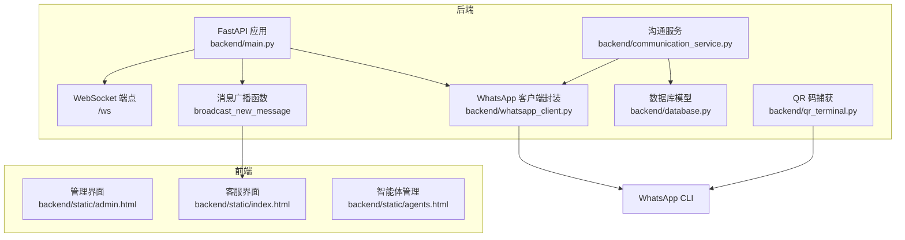
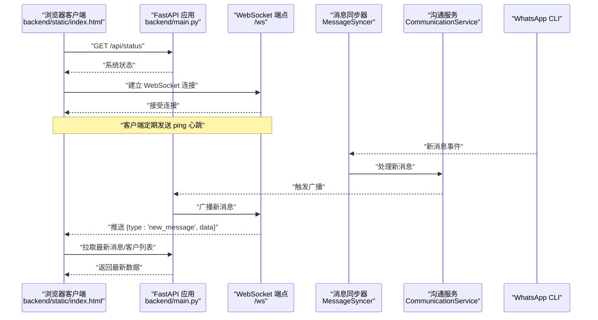
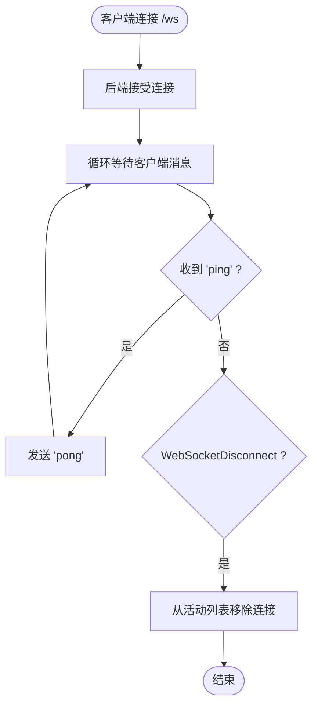
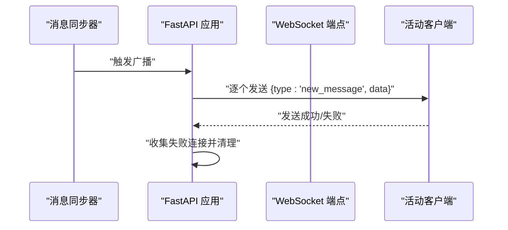
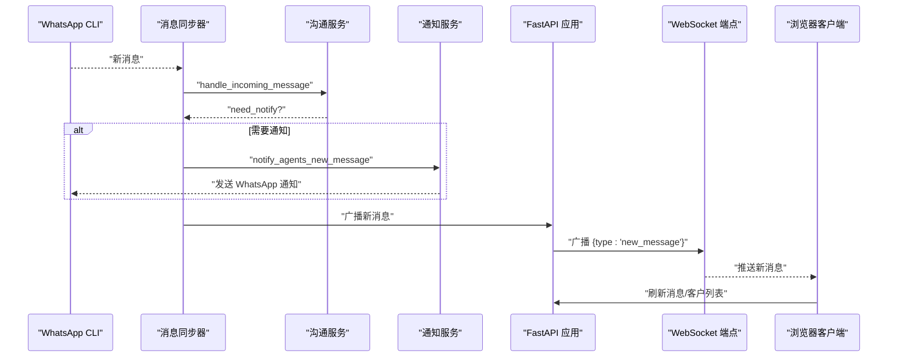
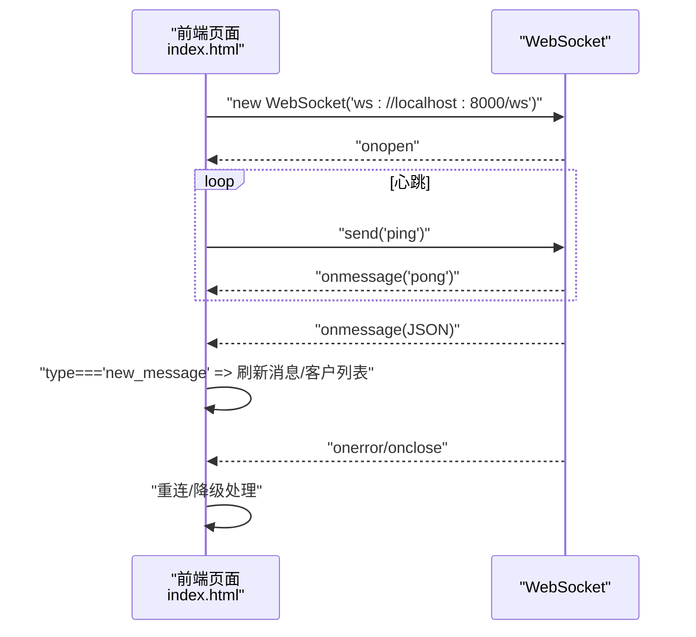
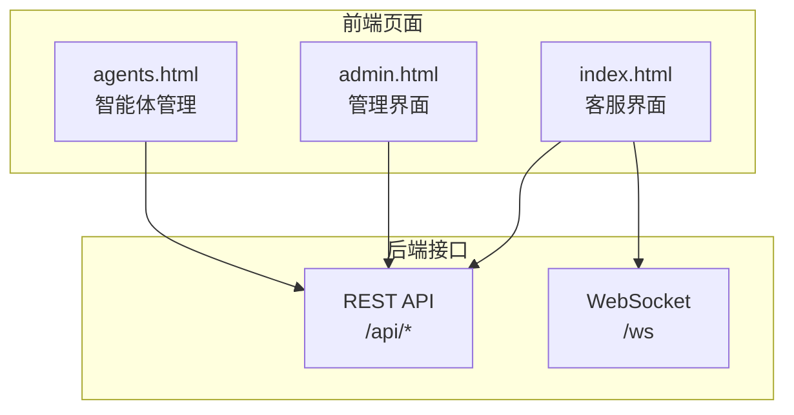
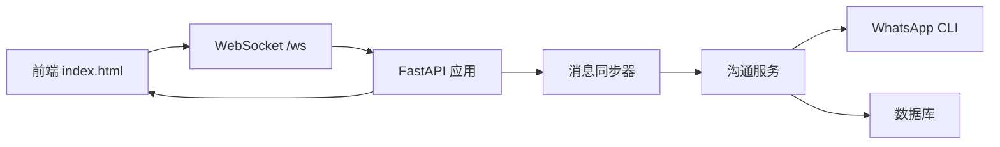

# 实时通信

<cite>
**本文引用的文件**
- [backend/main.py](file://backend/main.py)
- [backend/communication_service.py](file://backend/communication_service.py)
- [backend/whatsapp_client.py](file://backend/whatsapp_client.py)
- [backend/qr_terminal.py](file://backend/qr_terminal.py)
- [backend/database.py](file://backend/database.py)
- [backend/static/index.html](file://backend/static/index.html)
- [backend/static/admin.html](file://backend/static/admin.html)
- [backend/static/agents.html](file://backend/static/agents.html)
- [backend/requirements.txt](file://backend/requirements.txt)
- [start_server.py](file://start_server.py)
</cite>

## 目录
1. [简介](#简介)
2. [项目结构](#项目结构)
3. [核心组件](#核心组件)
4. [架构总览](#架构总览)
5. [详细组件分析](#详细组件分析)
6. [依赖关系分析](#依赖关系分析)
7. [性能考虑](#性能考虑)
8. [故障排查指南](#故障排查指南)
9. [结论](#结论)
10. [附录](#附录)

## 简介
本技术文档围绕 WhatsApp 智能客户系统中的“实时通信”能力展开，重点说明 WebSocket 集成的实现原理与使用方法，涵盖连接管理、消息广播、心跳检测机制；解释实时消息推送的实现方式（新消息广播、会话状态更新、人工客服通知）；提供 WebSocket 客户端集成指南（连接建立、消息处理、错误恢复）；总结性能优化策略（连接池管理、消息队列处理、并发控制）；并给出监控与调试方法及与前端界面的集成模式与数据同步机制。

## 项目结构
系统采用后端 FastAPI + 前端静态页面的架构，实时通信主要通过 WebSocket 实现，消息来源为 WhatsApp CLI 的消息同步与处理流程。

图表来源
- [backend/main.py:160-194](file://backend/main.py#L160-L194)
- [backend/whatsapp_client.py:13-437](file://backend/whatsapp_client.py#L13-L437)
- [backend/communication_service.py:17-512](file://backend/communication_service.py#L17-L512)
- [backend/database.py:1-297](file://backend/database.py#L1-L297)
- [backend/qr_terminal.py:14-297](file://backend/qr_terminal.py#L14-L297)
- [backend/static/index.html:582-800](file://backend/static/index.html#L582-L800)

章节来源
- [backend/main.py:128-194](file://backend/main.py#L128-L194)
- [backend/whatsapp_client.py:212-437](file://backend/whatsapp_client.py#L212-L437)
- [backend/communication_service.py:17-512](file://backend/communication_service.py#L17-L512)
- [backend/database.py:1-297](file://backend/database.py#L1-L297)
- [backend/qr_terminal.py:14-297](file://backend/qr_terminal.py#L14-L297)
- [backend/static/index.html:582-800](file://backend/static/index.html#L582-L800)

## 核心组件
- WebSocket 端点与广播：后端在 /ws 提供 WebSocket 服务，维护活动连接列表，接收客户端心跳并广播新消息。
- WhatsApp 客户端与消息同步：封装 whatsapp-cli，提供持续同步与轮询同步两种方式，将 WhatsApp 消息写入数据库并触发业务处理。
- 沟通服务与通知：处理新消息、自动回复、转人工、AI 智能体选择、自动打标签、人工通知等。
- 前端界面：管理端与客服端通过 WebSocket 实时接收新消息、刷新客户列表与消息面板。

章节来源
- [backend/main.py:160-194](file://backend/main.py#L160-L194)
- [backend/whatsapp_client.py:13-437](file://backend/whatsapp_client.py#L13-L437)
- [backend/communication_service.py:17-512](file://backend/communication_service.py#L17-L512)
- [backend/static/index.html:582-800](file://backend/static/index.html#L582-L800)

## 架构总览
WebSocket 实时通信在系统中的位置如下：

图表来源
- [backend/main.py:160-194](file://backend/main.py#L160-L194)
- [backend/whatsapp_client.py:174-210](file://backend/whatsapp_client.py#L174-L210)
- [backend/communication_service.py:47-72](file://backend/communication_service.py#L47-L72)
- [backend/static/index.html:781-800](file://backend/static/index.html#L781-L800)

## 详细组件分析

### WebSocket 连接与心跳管理
- 连接建立：客户端发起 ws://localhost:8000/ws，后端接受连接并加入全局活动连接列表。
- 心跳检测：客户端发送文本 "ping"，后端返回 "pong"，用于维持连接有效性。
- 断线清理：客户端断开时从活动列表移除，避免广播到无效连接。

图表来源
- [backend/main.py:160-194](file://backend/main.py#L160-L194)

章节来源
- [backend/main.py:160-194](file://backend/main.py#L160-L194)

### 消息广播机制
- 广播函数：遍历活动连接，向每个连接发送 JSON 消息，包含类型与数据。
- 异常处理：对发送异常的连接进行收集并在结束后清理，避免阻塞后续广播。
- 触发时机：由消息同步器在检测到新消息后触发广播。

图表来源
- [backend/main.py:178-194](file://backend/main.py#L178-L194)

章节来源
- [backend/main.py:178-194](file://backend/main.py#L178-L194)

### 实时消息推送：新消息广播、会话状态更新、人工通知
- 新消息广播：消息同步器检测到新消息后，调用沟通服务处理并触发广播。
- 会话状态更新：沟通服务根据客户分类与会话状态决定是否转人工或自动回复。
- 人工通知：当需要人工介入时，通知服务向在线客服发送 WhatsApp 通知。

图表来源
- [backend/whatsapp_client.py:399-433](file://backend/whatsapp_client.py#L399-L433)
- [backend/communication_service.py:47-72](file://backend/communication_service.py#L47-L72)
- [backend/communication_service.py:435-449](file://backend/communication_service.py#L435-L449)
- [backend/main.py:178-194](file://backend/main.py#L178-L194)

章节来源
- [backend/whatsapp_client.py:399-433](file://backend/whatsapp_client.py#L399-L433)
- [backend/communication_service.py:47-72](file://backend/communication_service.py#L47-L72)
- [backend/communication_service.py:435-449](file://backend/communication_service.py#L435-L449)
- [backend/main.py:178-194](file://backend/main.py#L178-L194)

### WebSocket 客户端集成指南（前端）
- 连接建立：在前端页面中创建 WebSocket 对象，指向 ws://localhost:8000/ws。
- 心跳维持：周期性发送 "ping" 文本消息，等待 "pong" 响应。
- 消息处理：监听 onmessage，解析 JSON，当 type 为 "new_message" 时刷新当前客户的消息与客户列表。
- 错误恢复：监听 onerror/onclose，进行重连与降级处理（例如切换到轮询或本地缓存）。

图表来源
- [backend/static/index.html:781-800](file://backend/static/index.html#L781-L800)

章节来源
- [backend/static/index.html:582-800](file://backend/static/index.html#L582-L800)

### 与前端界面的集成模式与数据同步
- 管理界面（admin.html）：展示系统配置、知识库、发送计划等，通过 REST API 获取数据。
- 客服界面（index.html）：展示客户列表、消息面板、发送按钮；通过 REST API 发送消息；通过 WebSocket 实时接收新消息。
- 智能体管理（agents.html）：管理 AI 智能体与标签，通过 REST API 交互。

图表来源
- [backend/static/index.html:582-800](file://backend/static/index.html#L582-L800)
- [backend/static/admin.html:1-800](file://backend/static/admin.html#L1-L800)
- [backend/static/agents.html:1-800](file://backend/static/agents.html#L1-L800)

章节来源
- [backend/static/index.html:582-800](file://backend/static/index.html#L582-L800)
- [backend/static/admin.html:1-800](file://backend/static/admin.html#L1-L800)
- [backend/static/agents.html:1-800](file://backend/static/agents.html#L1-L800)

## 依赖关系分析
- WebSocket 依赖：FastAPI 内置 WebSocket 支持，无需额外依赖。
- 消息同步：WhatsApp CLI 通过子进程调用，消息写入数据库后由沟通服务处理。
- 通知服务：通过 WhatsApp CLI 向客服手机号发送通知。
- 前端依赖：使用原生 WebSocket API，无需第三方库。

图表来源
- [backend/main.py:160-194](file://backend/main.py#L160-L194)
- [backend/whatsapp_client.py:13-437](file://backend/whatsapp_client.py#L13-L437)
- [backend/communication_service.py:17-512](file://backend/communication_service.py#L17-L512)
- [backend/database.py:1-297](file://backend/database.py#L1-L297)
- [backend/static/index.html:582-800](file://backend/static/index.html#L582-L800)

章节来源
- [backend/requirements.txt:1-20](file://backend/requirements.txt#L1-L20)
- [backend/main.py:160-194](file://backend/main.py#L160-L194)
- [backend/whatsapp_client.py:13-437](file://backend/whatsapp_client.py#L13-L437)
- [backend/communication_service.py:17-512](file://backend/communication_service.py#L17-L512)
- [backend/database.py:1-297](file://backend/database.py#L1-L297)
- [backend/static/index.html:582-800](file://backend/static/index.html#L582-L800)

## 性能考虑
- 连接管理
  - 单实例维护活动连接列表，避免重复广播与资源浪费。
  - 对发送异常的连接及时清理，减少广播开销。
- 消息处理
  - 消息同步采用轮询（默认 1 秒间隔），平衡实时性与系统负载。
  - 沟通服务在处理新消息时尽量使用同步/异步结合的方式，避免阻塞。
- 并发控制
  - 使用异步事件循环与子进程调用 WhatsApp CLI，避免阻塞主事件循环。
  - 广播采用逐连接发送，避免一次性大量 IO。
- 资源优化
  - 数据库查询与写入尽量批量化，减少事务开销。
  - 前端仅在必要时刷新消息与客户列表，降低网络压力。

章节来源
- [backend/whatsapp_client.py:366-398](file://backend/whatsapp_client.py#L366-L398)
- [backend/communication_service.py:172-230](file://backend/communication_service.py#L172-L230)
- [backend/main.py:178-194](file://backend/main.py#L178-L194)

## 故障排查指南
- WebSocket 连接失败
  - 检查后端是否启动，端口是否开放。
  - 前端控制台是否有跨域错误，确认 CORS 配置。
- 心跳失效
  - 确认前端定时发送 "ping"，后端返回 "pong"。
  - 若出现断线，检查网络波动与防火墙设置。
- 新消息未推送
  - 检查消息同步器是否运行，轮询间隔是否合理。
  - 确认沟通服务处理逻辑是否触发广播。
- WhatsApp 登录问题
  - 使用 QR 码捕获模块启动登录，确认终端宽度设置与权限。
  - 检查 whatsapp-cli 是否安装并可执行。

章节来源
- [backend/main.py:160-194](file://backend/main.py#L160-L194)
- [backend/whatsapp_client.py:174-210](file://backend/whatsapp_client.py#L174-L210)
- [backend/qr_terminal.py:14-297](file://backend/qr_terminal.py#L14-L297)

## 结论
本系统通过 WebSocket 实现了从 WhatsApp CLI 到前端界面的实时消息通道，配合消息同步器与沟通服务，实现了新消息广播、会话状态更新与人工通知等核心功能。前端通过心跳维持连接，后端在异常情况下自动清理无效连接，整体具备良好的实时性与稳定性。建议在生产环境中进一步引入连接池、消息队列与限流策略，以提升吞吐与可靠性。

## 附录
- 启动与登录
  - 使用启动脚本检查并启动服务，确保 whatsapp-cli 可用。
  - 通过 QR 码捕获模块完成登录，登录成功后自动同步联系人与聊天。

章节来源
- [start_server.py:1-131](file://start_server.py#L1-L131)
- [backend/qr_terminal.py:14-297](file://backend/qr_terminal.py#L14-L297)