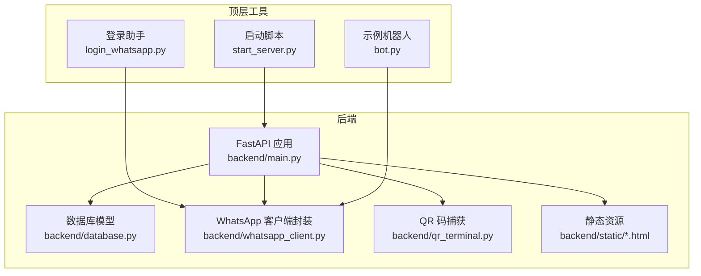
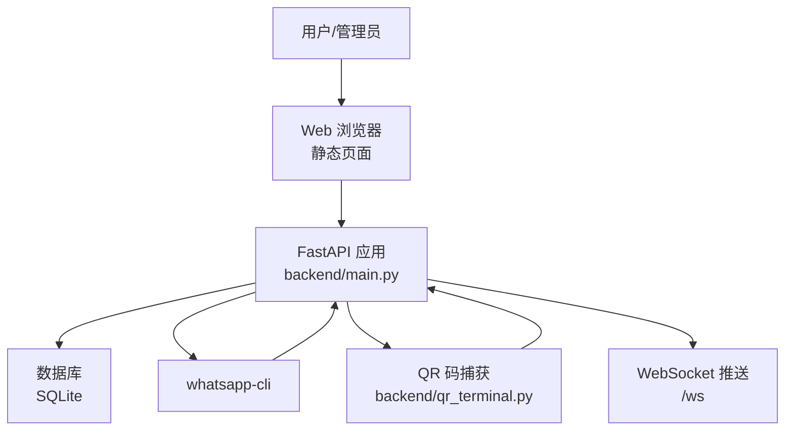
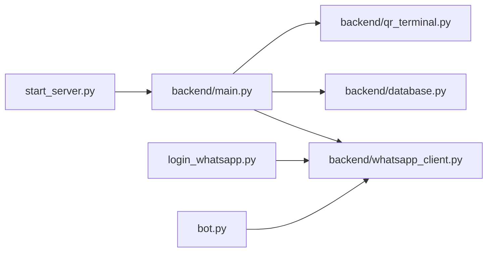

# 快速开始

<cite>
**本文引用的文件**
- [requirements.txt](file://requirements.txt)
- [backend/requirements.txt](file://backend/requirements.txt)
- [backend/main.py](file://backend/main.py)
- [backend/database.py](file://backend/database.py)
- [backend/whatsapp_client.py](file://backend/whatsapp_client.py)
- [backend/qr_terminal.py](file://backend/qr_terminal.py)
- [login_whatsapp.py](file://login_whatsapp.py)
- [start_server.py](file://start_server.py)
- [bot.py](file://bot.py)
</cite>

## 目录
1. [简介](#简介)
2. [项目结构](#项目结构)
3. [核心组件](#核心组件)
4. [架构总览](#架构总览)
5. [详细组件解析](#详细组件解析)
6. [依赖关系分析](#依赖关系分析)
7. [性能与并发特性](#性能与并发特性)
8. [故障排查指南](#故障排查指南)
9. [结论](#结论)
10. [附录](#附录)

## 简介
本指南面向首次部署与使用“WhatsApp智能客户系统”的用户，目标是在本地快速完成环境准备、WhatsApp CLI安装与登录、后端与前端资源准备、服务器启动与基本功能验证。系统基于FastAPI提供REST与WebSocket接口，通过whatsapp-cli与WhatsApp Web进行交互，并内置SQLite数据库存储客户、消息与会话等数据。

## 项目结构
项目采用前后端分离与API服务结合的方式组织：
- backend：FastAPI应用、数据库模型与服务层
- 前端静态资源：位于backend/static（index.html、admin.html、agents.html、login.html）
- 顶层脚本：login_whatsapp.py（终端登录助手）、start_server.py（一键启动）、bot.py（示例机器人）

图表来源
- [backend/main.py:128-157](file://backend/main.py#L128-L157)
- [backend/database.py:14-20](file://backend/database.py#L14-L20)
- [backend/whatsapp_client.py:13-26](file://backend/whatsapp_client.py#L13-L26)
- [backend/qr_terminal.py:14-23](file://backend/qr_terminal.py#L14-L23)
- [login_whatsapp.py:16-32](file://login_whatsapp.py#L16-L32)
- [start_server.py:92-127](file://start_server.py#L92-L127)
- [bot.py:42-47](file://bot.py#L42-L47)

章节来源
- [backend/main.py:128-157](file://backend/main.py#L128-L157)
- [backend/database.py:14-20](file://backend/database.py#L14-L20)
- [backend/whatsapp_client.py:13-26](file://backend/whatsapp_client.py#L13-L26)
- [backend/qr_terminal.py:14-23](file://backend/qr_terminal.py#L14-L23)
- [login_whatsapp.py:16-32](file://login_whatsapp.py#L16-L32)
- [start_server.py:92-127](file://start_server.py#L92-L127)
- [bot.py:42-47](file://bot.py#L42-L47)

## 核心组件
- FastAPI应用与路由：提供认证、客户、消息、会话、计划、AI回复等API，并挂载静态资源目录。
- 数据库与模型：基于SQLAlchemy，支持客户、消息、会话、标签、AI智能体、LLM提供商等模型。
- WhatsApp客户端封装：封装whatsapp-cli命令，提供登录状态查询、联系人/聊天/消息获取、发送消息、JID处理、持续同步等功能。
- QR码捕获：在终端中捕获ASCII QR码并转为图片，便于通过浏览器或移动端扫码登录。
- 登录助手与启动脚本：检查CLI安装与登录状态，安装后端依赖，启动Uvicorn服务。

章节来源
- [backend/main.py:196-381](file://backend/main.py#L196-L381)
- [backend/database.py:23-296](file://backend/database.py#L23-L296)
- [backend/whatsapp_client.py:13-173](file://backend/whatsapp_client.py#L13-L173)
- [backend/qr_terminal.py:14-284](file://backend/qr_terminal.py#L14-L284)
- [login_whatsapp.py:16-108](file://login_whatsapp.py#L16-L108)
- [start_server.py:61-90](file://start_server.py#L61-L90)

## 架构总览
系统通过FastAPI提供统一入口，内部依赖数据库持久化与whatsapp-cli进行消息同步与发送。WebSocket用于向管理端推送新消息；QR码捕获模块辅助登录；启动脚本负责环境检查与服务启动。

图表来源
- [backend/main.py:160-194](file://backend/main.py#L160-L194)
- [backend/main.py:136-148](file://backend/main.py#L136-L148)
- [backend/whatsapp_client.py:82-126](file://backend/whatsapp_client.py#L82-L126)
- [backend/qr_terminal.py:24-79](file://backend/qr_terminal.py#L24-L79)

## 详细组件解析

### 环境与依赖准备
- Python版本要求
  - 顶层依赖注释明确要求Python 3.8+。
- 系统依赖
  - 需要安装 whatsapp-cli，登录助手与启动脚本均会检测其是否存在。
- 后端依赖
  - 后端独立的requirements.txt列出了FastAPI、Uvicorn、SQLAlchemy、Pydantic、WebSocket、调度器、QR码生成、OpenAI SDK、加密库等。
- 前端依赖
  - 前端静态资源位于backend/static，无需额外构建，直接由FastAPI挂载提供。

章节来源
- [requirements.txt:2](file://requirements.txt#L2)
- [backend/requirements.txt:2-19](file://backend/requirements.txt#L2-L19)
- [login_whatsapp.py:16-32](file://login_whatsapp.py#L16-L32)
- [start_server.py:77-90](file://start_server.py#L77-L90)

### WhatsApp CLI 安装与配置
- 安装方式
  - 登录助手脚本提供了安装命令，建议按提示执行安装脚本。
- 登录流程
  - 使用登录助手或API接口触发登录，系统会在终端输出QR码，使用手机WhatsApp“设置 → 关联设备 → 关联新设备”扫描登录。
- 登录状态检查
  - 登录助手与启动脚本均会调用CLI的auth status进行检查。

章节来源
- [login_whatsapp.py:58-61](file://login_whatsapp.py#L58-L61)
- [login_whatsapp.py:78-108](file://login_whatsapp.py#L78-L108)
- [login_whatsapp.py:35-48](file://login_whatsapp.py#L35-L48)
- [start_server.py:16-33](file://start_server.py#L16-L33)
- [start_server.py:36-58](file://start_server.py#L36-L58)

### 依赖安装指南（后端与前端）
- 后端依赖
  - 启动脚本会自动在backend目录下安装requirements.txt中的依赖。
- 前端资源
  - 前端静态文件位于backend/static，无需编译，直接由FastAPI挂载。

章节来源
- [start_server.py:77-90](file://start_server.py#L77-L90)
- [backend/main.py:136-140](file://backend/main.py#L136-L140)

### 环境变量与配置
- 数据库URL
  - 默认使用SQLite，路径位于backend/data/whatsapp_crm.db，可通过DATABASE_URL环境变量覆盖。
- .env文件
  - 启动脚本会在backend目录下创建.env文件（若存在.env.example则复制示例内容）。
- 大语言模型提供商
  - 数据库模型中包含LLMProvider与LLMModel，可在系统中配置不同提供商的API密钥与默认模型。

章节来源
- [backend/database.py:10-12](file://backend/database.py#L10-L12)
- [start_server.py:69-75](file://start_server.py#L69-L75)
- [backend/database.py:211-243](file://backend/database.py#L211-L243)

### 服务器启动步骤
- 启动方式一：使用启动脚本
  - 自动检查CLI与登录状态、安装后端依赖、启动Uvicorn服务，默认监听0.0.0.0:8000。
- 启动方式二：手动启动
  - 在backend目录下运行Uvicorn指向main:app，或参考启动脚本的命令行参数。

章节来源
- [start_server.py:92-127](file://start_server.py#L92-L127)
- [backend/main.py:88-126](file://backend/main.py#L88-L126)

### 首次使用与基本功能测试
- 完成WhatsApp登录
  - 使用登录助手或API接口触发登录，扫描QR码完成登录。
- 访问系统
  - 启动后访问 http://localhost:8000，管理界面位于 http://localhost:8000/static/index.html。
- 基本功能测试
  - 调用认证状态接口确认连接状态。
  - 手动同步联系人与聊天，验证客户列表与消息拉取。
  - 通过WebSocket连接接收新消息推送。
  - 使用AI回复接口生成并发送自动回复消息。

章节来源
- [backend/main.py:196-212](file://backend/main.py#L196-L212)
- [backend/main.py:383-474](file://backend/main.py#L383-L474)
- [backend/main.py:160-194](file://backend/main.py#L160-L194)
- [backend/main.py:725-795](file://backend/main.py#L725-L795)

## 依赖关系分析

图表来源
- [backend/main.py:17-26](file://backend/main.py#L17-L26)
- [backend/whatsapp_client.py:10](file://backend/whatsapp_client.py#L10)
- [backend/qr_terminal.py:14](file://backend/qr_terminal.py#L14)
- [login_whatsapp.py:16-32](file://login_whatsapp.py#L16-L32)
- [start_server.py:118-124](file://start_server.py#L118-L124)
- [bot.py:42-47](file://bot.py#L42-L47)

章节来源
- [backend/main.py:17-26](file://backend/main.py#L17-L26)
- [backend/whatsapp_client.py:10](file://backend/whatsapp_client.py#L10)
- [backend/qr_terminal.py:14](file://backend/qr_terminal.py#L14)
- [login_whatsapp.py:16-32](file://login_whatsapp.py#L16-L32)
- [start_server.py:118-124](file://start_server.py#L118-L124)
- [bot.py:42-47](file://bot.py#L42-L47)

## 性能与并发特性
- WebSocket长连接：用于实时推送新消息，客户端可建立/ws连接保持心跳。
- 异步消息同步：消息轮询默认1秒一次，避免过于频繁的请求；同时提供持续同步模式（通过CLI follow）。
- 数据库并发：使用SQLAlchemy会话管理，注意在高并发场景下合理控制事务与连接池。

章节来源
- [backend/main.py:160-194](file://backend/main.py#L160-L194)
- [backend/whatsapp_client.py:366-397](file://backend/whatsapp_client.py#L366-L397)

## 故障排查指南
- whatsapp-cli未找到
  - 确认已安装并加入PATH；登录助手与启动脚本会检测CLI并给出安装指引。
- 登录失败或状态异常
  - 检查手机端是否成功扫描；必要时取消登录后重试。
- 依赖安装失败
  - 启动脚本会打印stderr输出，按提示修复网络或权限问题。
- 数据库连接问题
  - 确认DATABASE_URL环境变量或默认SQLite路径可写；首次运行会自动创建表。
- 消息同步不生效
  - 确认已登录且消息同步器已启动；检查CLI版本与权限。

章节来源
- [login_whatsapp.py:16-32](file://login_whatsapp.py#L16-L32)
- [login_whatsapp.py:111-134](file://login_whatsapp.py#L111-L134)
- [start_server.py:77-90](file://start_server.py#L77-L90)
- [backend/database.py:10-12](file://backend/database.py#L10-L12)
- [backend/whatsapp_client.py:366-397](file://backend/whatsapp_client.py#L366-L397)

## 结论
通过本指南，您可以在本地完成WhatsApp CLI安装与登录、后端依赖安装、服务器启动与基本功能验证。系统提供REST与WebSocket接口、QR码登录、消息同步与AI回复能力，适合快速搭建WhatsApp智能客户管理平台。后续可根据业务需求扩展LLM提供商配置、标签体系与沟通计划。

## 附录

### API与静态资源概览
- API根路径：/api
- 认证相关：/api/auth/status、/api/auth/qr、/api/auth/qr/status、/api/auth/qr/cancel、/api/auth/logout、/api/auth/sync-contacts
- 客户与消息：/api/customers、/api/customers/{id}、/api/customers/{id}/messages
- 会话与计划：/api/conversations、/api/plans、/api/plans/{plan_id}/execute/{customer_id}
- AI回复：/api/customers/{id}/ai-reply、/api/customers/{id}/messages/ai-send
- WebSocket：/ws
- 静态资源：/static/index.html、admin.html、agents.html、login.html

章节来源
- [backend/main.py:479-496](file://backend/main.py#L479-L496)
- [backend/main.py:196-381](file://backend/main.py#L196-L381)
- [backend/main.py:501-580](file://backend/main.py#L501-L580)
- [backend/main.py:583-634](file://backend/main.py#L583-L634)
- [backend/main.py:636-701](file://backend/main.py#L636-L701)
- [backend/main.py:703-723](file://backend/main.py#L703-L723)
- [backend/main.py:725-795](file://backend/main.py#L725-L795)
- [backend/main.py:160-194](file://backend/main.py#L160-L194)
- [backend/main.py:136-148](file://backend/main.py#L136-L148)