# API调用错误

<cite>
**本文档引用的文件**
- [backend/main.py](file://backend/main.py)
- [backend/communication_service.py](file://backend/communication_service.py)
- [backend/whatsapp_client.py](file://backend/whatsapp_client.py)
- [backend/database.py](file://backend/database.py)
- [backend/llm_service.py](file://backend/llm_service.py)
- [backend/knowledge_base.py](file://backend/knowledge_base.py)
- [backend/scheduler_service.py](file://backend/scheduler_service.py)
- [backend/schedule_runner.py](file://backend/schedule_runner.py)
- [backend/qr_terminal.py](file://backend/qr_terminal.py)
- [backend/config_service.py](file://backend/config_service.py)
- [backend/quotation_service.py](file://backend/quotation_service.py)
- [backend/memo_service.py](file://backend/memo_service.py)
</cite>

## 目录
1. [简介](#简介)
2. [项目结构](#项目结构)
3. [核心组件](#核心组件)
4. [架构概览](#架构概览)
5. [详细组件分析](#详细组件分析)
6. [依赖关系分析](#依赖关系分析)
7. [性能考虑](#性能考虑)
8. [故障排除指南](#故障排除指南)
9. [结论](#结论)

## 简介

本指南专注于WhatsApp智能客户系统的API调用错误处理和故障排除。该系统基于FastAPI构建，提供了完整的WhatsApp消息自动化管理功能，包括客户管理、消息发送、AI智能回复、定时发送等功能。

系统采用模块化设计，包含以下主要功能模块：
- WebSocket实时通信
- WhatsApp客户端集成
- 数据库持久化
- AI智能回复
- 知识库管理
- 定时发送计划
- 配置管理

## 项目结构

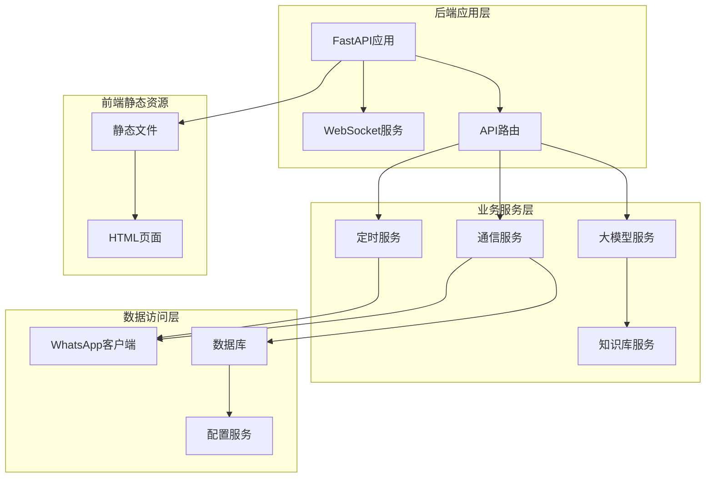

**图表来源**
- [backend/main.py:129-157](file://backend/main.py#L129-L157)
- [backend/communication_service.py:17-46](file://backend/communication_service.py#L17-L46)
- [backend/whatsapp_client.py:13-26](file://backend/whatsapp_client.py#L13-L26)

**章节来源**
- [backend/main.py:129-157](file://backend/main.py#L129-L157)
- [backend/communication_service.py:17-46](file://backend/communication_service.py#L17-L46)
- [backend/whatsapp_client.py:13-26](file://backend/whatsapp_client.py#L13-L26)

## 核心组件

### API路由系统

系统提供RESTful API接口，主要包含以下功能模块：

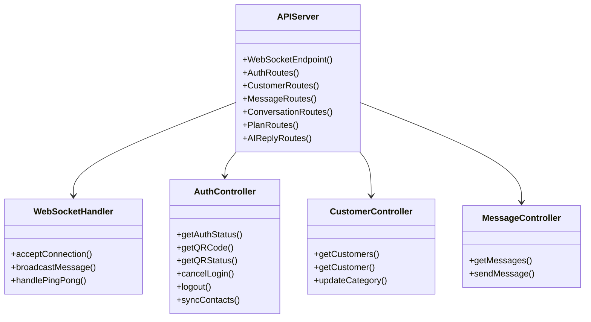

**图表来源**
- [backend/main.py:162-194](file://backend/main.py#L162-L194)
- [backend/main.py:198-381](file://backend/main.py#L198-L381)
- [backend/main.py:501-581](file://backend/main.py#L501-L581)
- [backend/main.py:601-634](file://backend/main.py#L601-L634)

### 数据库架构

系统使用SQLite作为主要数据库，支持多表关联和复杂查询：

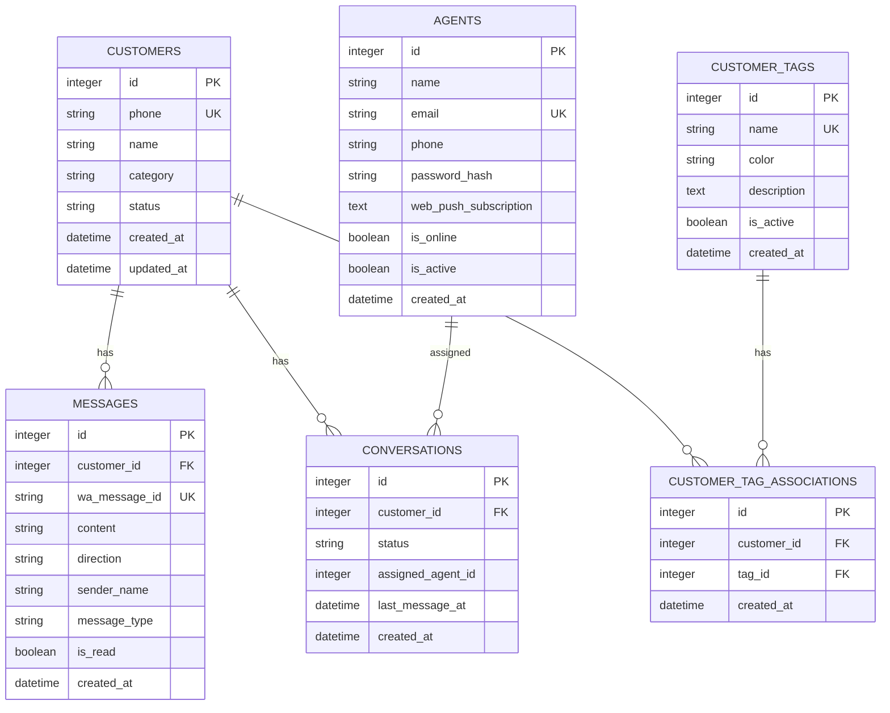

**图表来源**
- [backend/database.py:23-251](file://backend/database.py#L23-L251)

**章节来源**
- [backend/database.py:23-251](file://backend/database.py#L23-L251)
- [backend/main.py:17-78](file://backend/main.py#L17-L78)

## 架构概览

系统采用分层架构设计，各层职责明确：

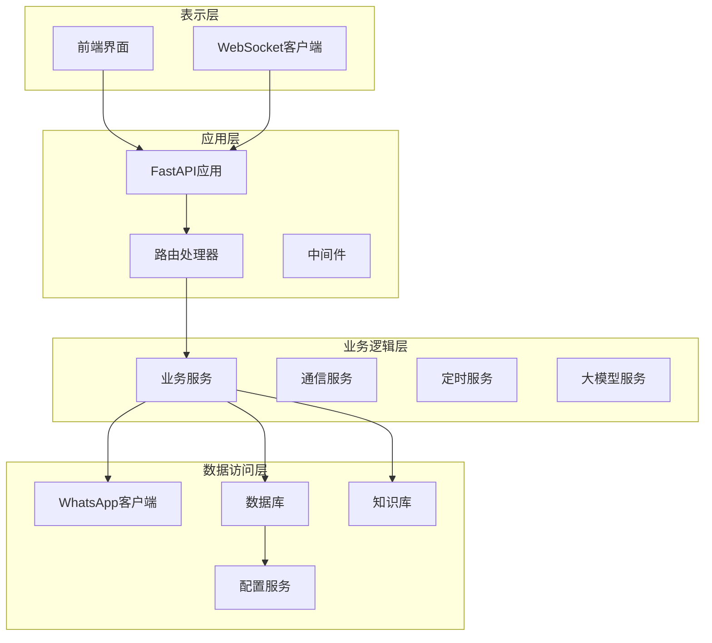

**图表来源**
- [backend/main.py:88-126](file://backend/main.py#L88-L126)
- [backend/communication_service.py:17-46](file://backend/communication_service.py#L17-L46)
- [backend/whatsapp_client.py:13-26](file://backend/whatsapp_client.py#L13-L26)

## 详细组件分析

### WebSocket实时通信

系统实现了WebSocket实时通信功能，用于推送新消息通知：

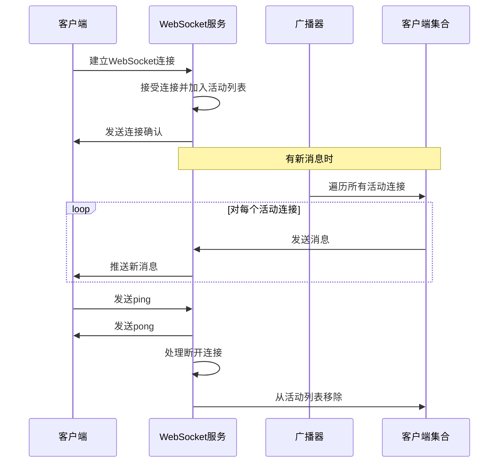

**图表来源**
- [backend/main.py:162-194](file://backend/main.py#L162-L194)

### WhatsApp客户端集成

WhatsApp客户端封装了对whatsapp-cli工具的调用：

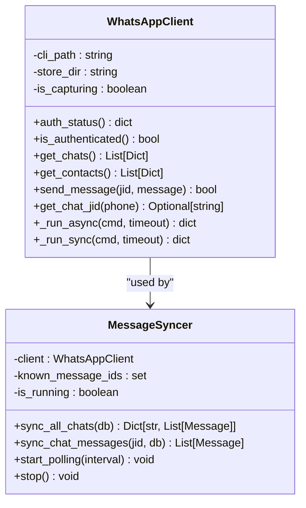

**图表来源**
- [backend/whatsapp_client.py:13-26](file://backend/whatsapp_client.py#L13-L26)
- [backend/whatsapp_client.py:212-267](file://backend/whatsapp_client.py#L212-L267)

**章节来源**
- [backend/whatsapp_client.py:13-26](file://backend/whatsapp_client.py#L13-L26)
- [backend/whatsapp_client.py:212-267](file://backend/whatsapp_client.py#L212-L267)

### AI智能回复系统

系统集成了大模型服务，提供智能回复功能：

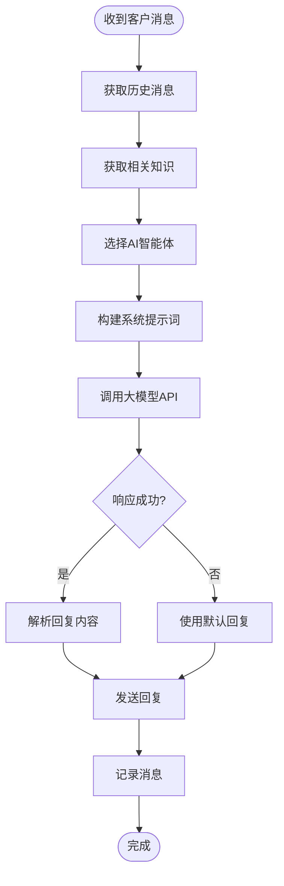

**图表来源**
- [backend/llm_service.py:86-198](file://backend/llm_service.py#L86-L198)

**章节来源**
- [backend/llm_service.py:86-198](file://backend/llm_service.py#L86-L198)

### 定时发送计划

系统支持定时发送消息的功能：

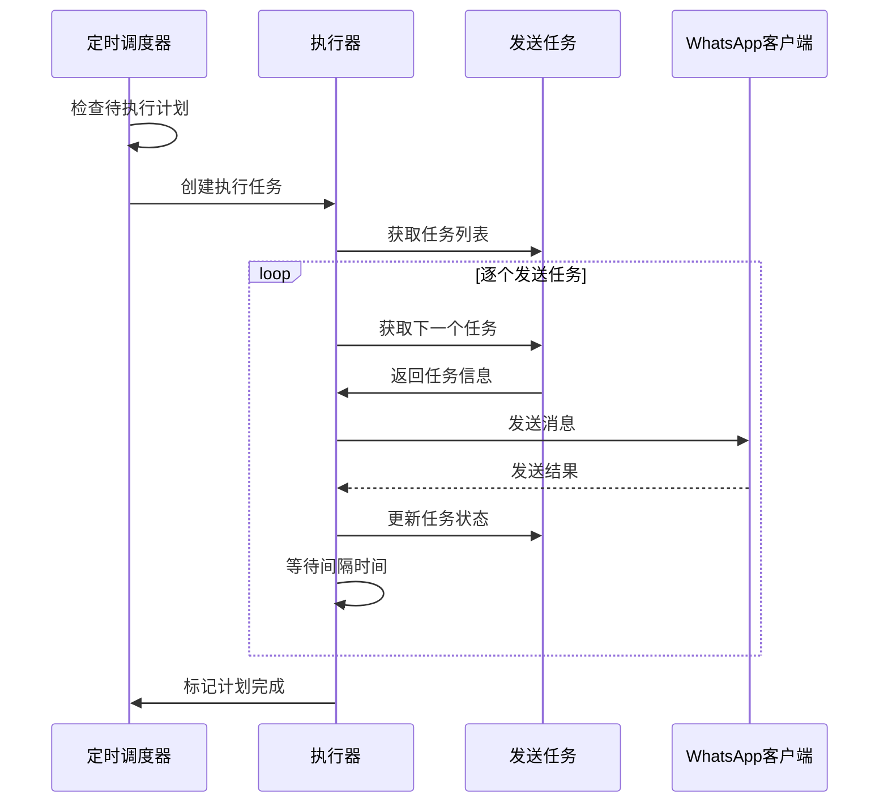

**图表来源**
- [backend/schedule_runner.py:35-124](file://backend/schedule_runner.py#L35-L124)

**章节来源**
- [backend/schedule_runner.py:35-124](file://backend/schedule_runner.py#L35-L124)

## 依赖关系分析

系统的主要依赖关系如下：

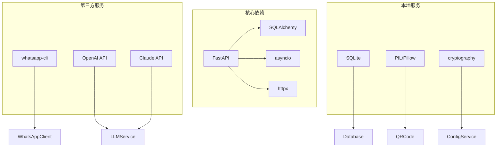

**图表来源**
- [backend/whatsapp_client.py:4-10](file://backend/whatsapp_client.py#L4-L10)
- [backend/llm_service.py:4-8](file://backend/llm_service.py#L4-L8)
- [backend/config_service.py:8](file://backend/config_service.py#L8)

**章节来源**
- [backend/whatsapp_client.py:4-10](file://backend/whatsapp_client.py#L4-L10)
- [backend/llm_service.py:4-8](file://backend/llm_service.py#L4-L8)
- [backend/config_service.py:8](file://backend/config_service.py#L8)

## 性能考虑

系统在设计时考虑了以下性能优化：

1. **异步处理**: 使用asyncio处理I/O密集型操作
2. **连接池**: 数据库连接使用连接池管理
3. **缓存机制**: 消息ID缓存避免重复处理
4. **批量操作**: 批量同步消息减少API调用次数
5. **超时控制**: 所有外部调用都有超时限制

## 故障排除指南

### HTTP状态码处理

#### 404 客户不存在
当API请求的客户不存在时，系统返回404状态码：

**错误场景**:
- 查询不存在的客户ID
- 发送消息给不存在的客户
- 更新不存在的客户分类

**处理方法**:
1. 验证客户ID的有效性
2. 检查数据库中是否存在该客户
3. 提供友好的错误提示

**相关代码位置**:
- [backend/main.py:557-563](file://backend/main.py#L557-L563)
- [backend/main.py:608-610](file://backend/main.py#L608-L610)

#### 500 服务器内部错误
当系统内部发生错误时，返回500状态码：

**错误场景**:
- 数据库查询失败
- 外部API调用异常
- 文件系统操作失败

**处理方法**:
1. 检查服务器日志
2. 验证数据库连接
3. 确认外部服务可用性

**相关代码位置**:
- [backend/main.py:550-554](file://backend/main.py#L550-L554)
- [backend/main.py:633](file://backend/main.py#L633)

#### 503 服务不可用
当WhatsApp客户端未就绪时，返回503状态码：

**错误场景**:
- WhatsApp客户端未初始化
- WhatsApp未登录
- WhatsApp连接中断

**处理方法**:
1. 检查WhatsApp登录状态
2. 重新启动WhatsApp客户端
3. 验证WhatsApp CLI安装

**相关代码位置**:
- [backend/main.py:613](file://backend/main.py#L613)
- [backend/main.py:776](file://backend/main.py#L776)

### 请求参数验证

#### 客户端参数验证最佳实践

**输入验证流程**:
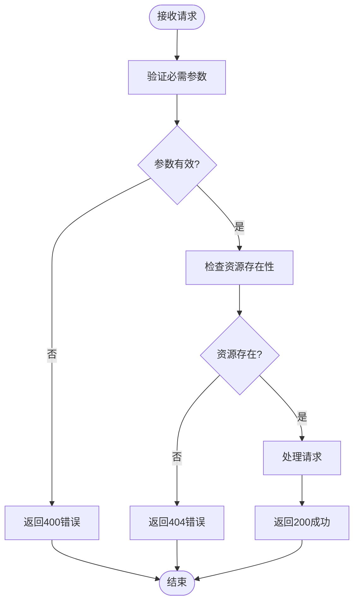

**验证规则**:
1. 必需字段检查
2. 数据类型验证
3. 范围和格式验证
4. 业务逻辑验证

**相关代码位置**:
- [backend/main.py:557-563](file://backend/main.py#L557-L563)
- [backend/main.py:608-610](file://backend/main.py#L608-L610)

### 数据库连接故障诊断

#### 连接池耗尽问题

**症状表现**:
- 数据库操作超时
- 连接获取失败
- 事务提交异常

**诊断步骤**:
1. 检查数据库连接数
2. 分析长时间运行的查询
3. 监控连接池状态

**解决方案**:
1. 优化查询性能
2. 减少事务持续时间
3. 调整连接池配置

**相关代码位置**:
- [backend/database.py:14-20](file://backend/database.py#L14-L20)
- [backend/database.py:290-296](file://backend/database.py#L290-L296)

#### 事务冲突问题

**症状表现**:
- 事务回滚
- 数据不一致
- 死锁警告

**诊断步骤**:
1. 检查并发访问模式
2. 分析锁等待情况
3. 识别长事务

**解决方案**:
1. 优化事务范围
2. 实现重试机制
3. 使用乐观锁

**相关代码位置**:
- [backend/database.py:254-256](file://backend/database.py#L254-L256)

### WebSocket连接错误排查

#### 连接断开问题

**症状表现**:
- 客户端无法接收实时消息
- WebSocket连接状态异常
- 广播消息失败

**诊断步骤**:
1. 检查WebSocket连接状态
2. 验证客户端心跳机制
3. 分析连接池状态

**解决方案**:
1. 实现自动重连机制
2. 优化连接管理
3. 增强错误处理

**相关代码位置**:
- [backend/main.py:162-194](file://backend/main.py#L162-L194)

#### 消息发送失败

**症状表现**:
- 消息无法发送到客户端
- 广播异常
- 连接状态不一致

**诊断步骤**:
1. 检查活动连接列表
2. 验证消息序列化
3. 分析异常连接

**解决方案**:
1. 实施连接清理机制
2. 增加消息重试
3. 优化连接池管理

**相关代码位置**:
- [backend/main.py:178-193](file://backend/main.py#L178-L193)

### API调用超时处理

#### 超时策略配置

**超时配置**:
- WhatsApp命令超时: 30秒
- LLM API超时: 动态配置
- 数据库操作超时: 30秒
- WebSocket超时: 60秒

**重试机制**:
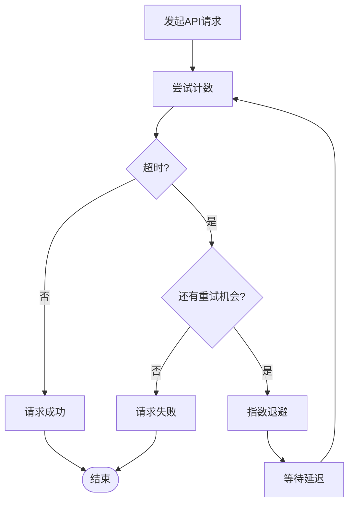

**重试策略**:
1. 指数退避算法
2. 最大重试次数限制
3. 不同类型的错误区分处理

**相关代码位置**:
- [backend/whatsapp_client.py:27-58](file://backend/whatsapp_client.py#L27-L58)
- [backend/llm_service.py:150-164](file://backend/llm_service.py#L150-L164)

### 大模型API错误处理

#### LLM API错误诊断

**常见错误类型**:
1. API密钥无效
2. 配额不足
3. 模型不可用
4. 请求格式错误

**诊断步骤**:
1. 验证API密钥配置
2. 检查配额使用情况
3. 确认模型可用性
4. 分析请求格式

**解决方案**:
1. 实施API密钥轮换
2. 添加配额监控
3. 实现降级策略
4. 优化请求格式

**相关代码位置**:
- [backend/llm_service.py:149-175](file://backend/llm_service.py#L149-L175)

### 配置管理错误

#### 配置服务故障排查

**配置错误类型**:
1. 加密密钥损坏
2. 配置项缺失
3. 敏感信息泄露
4. 配置加载失败

**诊断步骤**:
1. 检查加密密钥文件
2. 验证配置数据库完整性
3. 分析配置加载日志
4. 测试配置读写操作

**解决方案**:
1. 实施配置备份
2. 添加配置校验
3. 实现配置热更新
4. 增强安全措施

**相关代码位置**:
- [backend/config_service.py:24-36](file://backend/config_service.py#L24-L36)
- [backend/config_service.py:72-95](file://backend/config_service.py#L72-L95)

## 结论

本指南提供了WhatsApp智能客户系统API调用错误的全面故障排除方案。系统通过模块化设计和完善的错误处理机制，能够有效应对各种API调用错误场景。

关键要点包括：
1. **分层架构设计**：清晰的职责分离便于问题定位
2. **异步处理机制**：提高系统响应性和稳定性
3. **完善的错误处理**：HTTP状态码标准化和错误信息友好化
4. **监控和诊断工具**：日志记录和状态监控
5. **重试和降级策略**：提高系统可靠性

建议在生产环境中实施以下最佳实践：
- 建立完善的监控告警系统
- 实施配置管理最佳实践
- 定期进行性能和容量规划
- 建立灾难恢复和备份策略
- 持续优化错误处理和用户体验