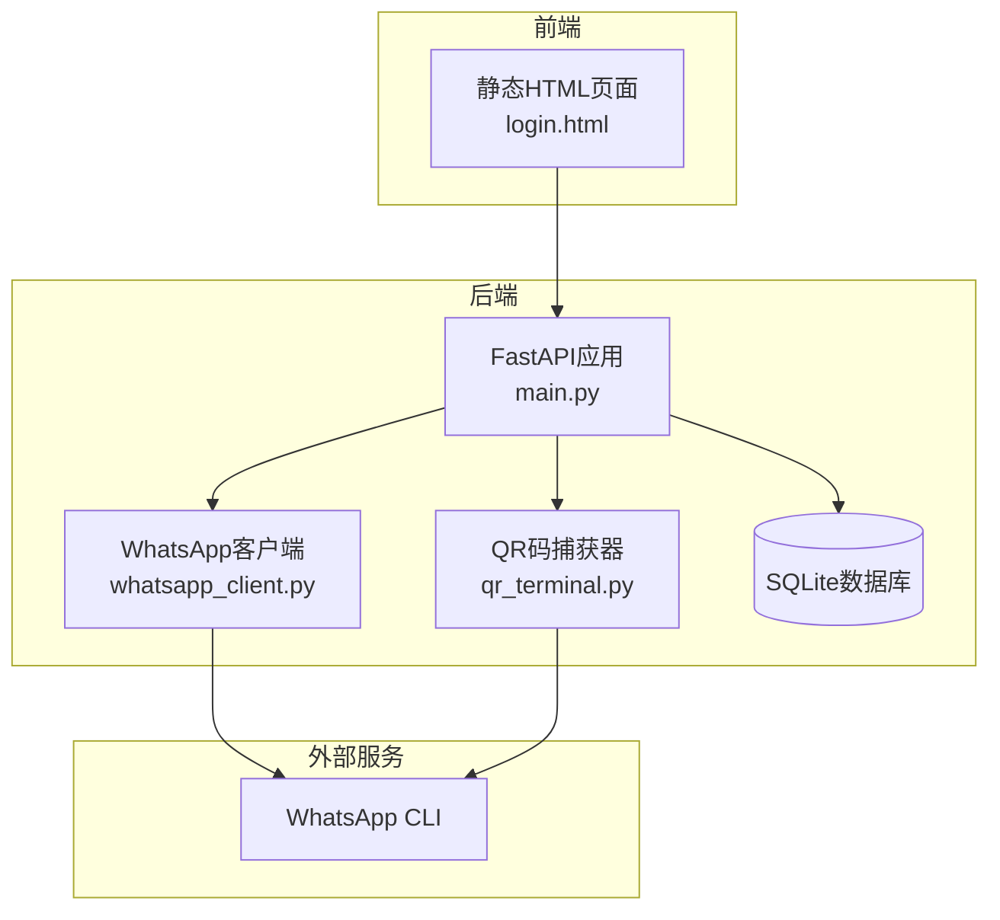
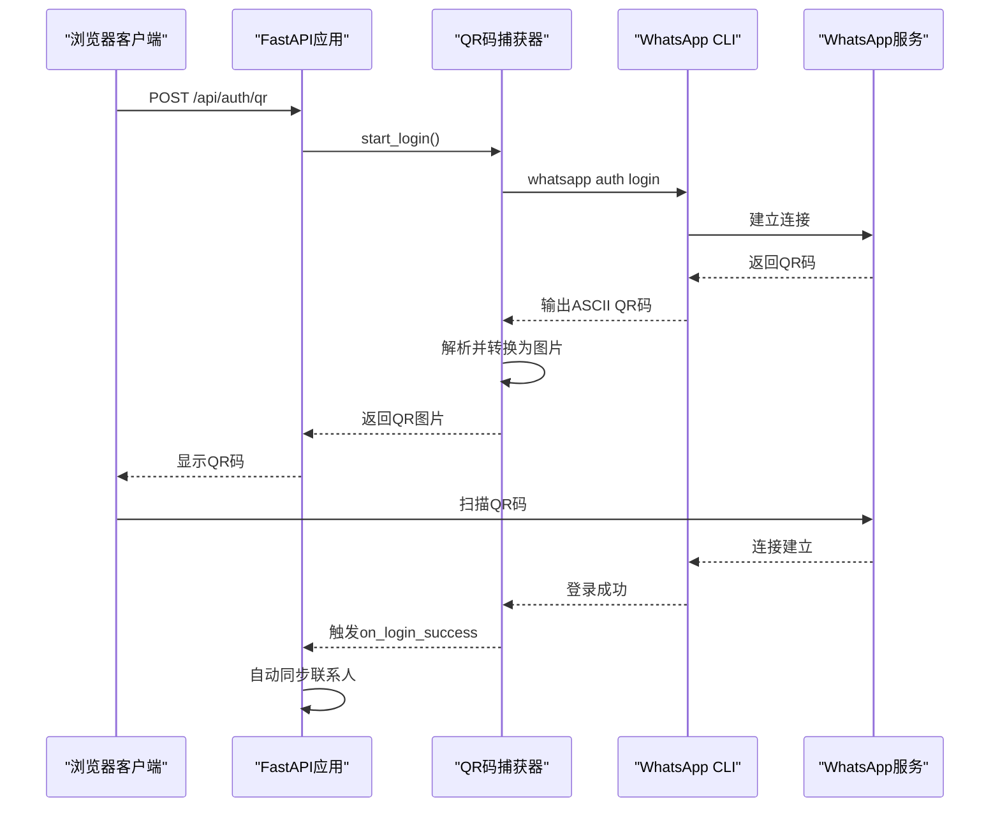
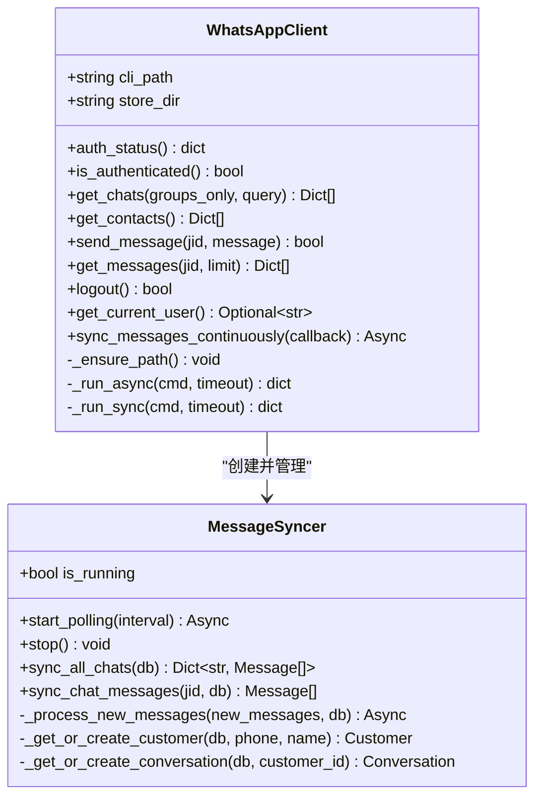
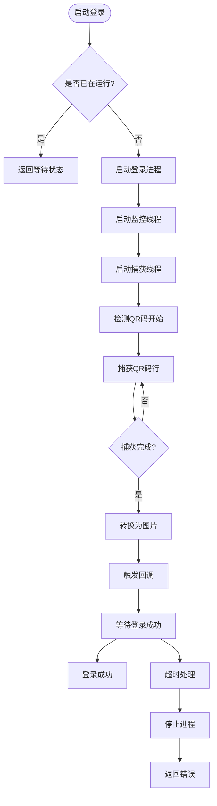
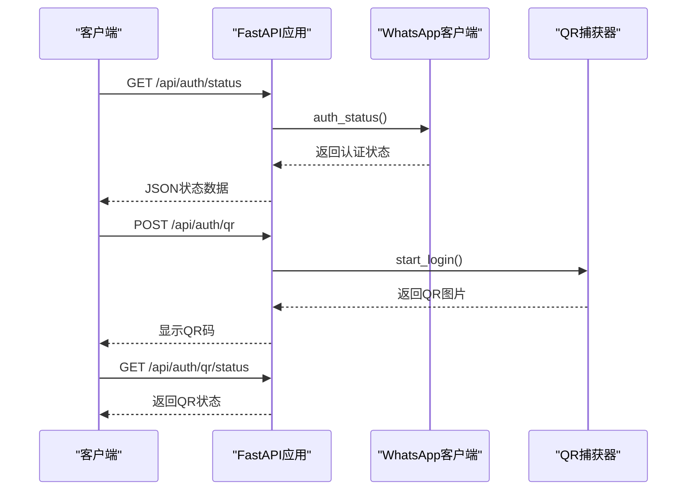
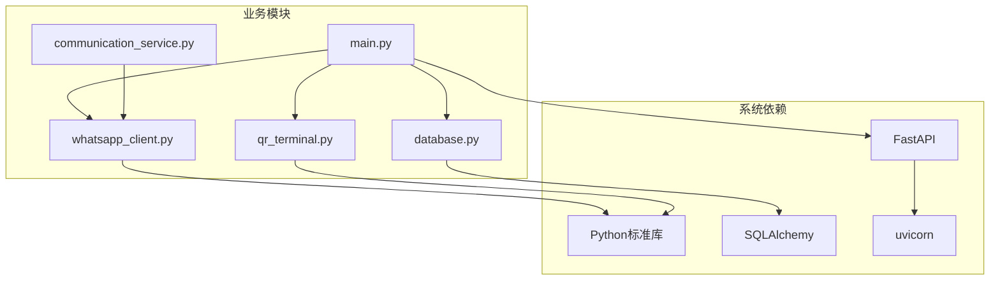
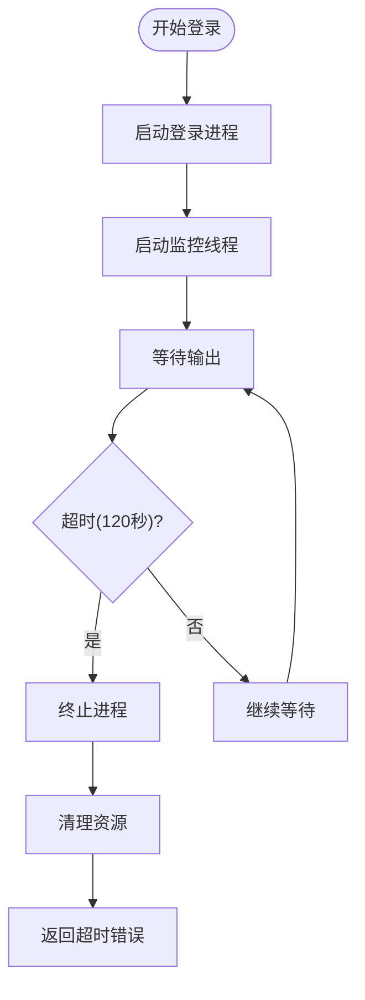

# WhatsApp连接问题

<cite>
**本文档引用的文件**
- [backend/whatsapp_client.py](file://backend/whatsapp_client.py)
- [backend/qr_terminal.py](file://backend/qr_terminal.py)
- [backend/main.py](file://backend/main.py)
- [login_whatsapp.py](file://login_whatsapp.py)
- [start_server.py](file://start_server.py)
- [backend/database.py](file://backend/database.py)
- [backend/communication_service.py](file://backend/communication_service.py)
</cite>

## 目录
1. [简介](#简介)
2. [项目结构](#项目结构)
3. [核心组件](#核心组件)
4. [架构概览](#架构概览)
5. [详细组件分析](#详细组件分析)
6. [依赖关系分析](#依赖关系分析)
7. [性能考虑](#性能考虑)
8. [故障排除指南](#故障排除指南)
9. [结论](#结论)
10. [附录](#附录)

## 简介
本指南专注于WhatsApp连接问题的故障排除，涵盖QR码登录失败、网络连接问题、CLI版本兼容性、登录超时处理等场景。文档提供了连接状态检查方法（auth_status()函数使用和错误诊断）、连接中断后的自动重连机制与手动重连步骤、常见错误代码含义及解决措施，以及CLI配置验证和调试技巧。

## 项目结构
该项目采用前后端分离架构，后端基于FastAPI提供REST API，前端通过静态HTML页面与后端交互。核心连接逻辑集中在WhatsApp客户端封装类中，并通过QR码捕获模块实现扫码登录。



**图表来源**
- [backend/main.py:128-134](file://backend/main.py#L128-L134)
- [backend/whatsapp_client.py:13-26](file://backend/whatsapp_client.py#L13-L26)
- [backend/qr_terminal.py:14-23](file://backend/qr_terminal.py#L14-L23)

**章节来源**
- [backend/main.py:128-134](file://backend/main.py#L128-L134)
- [backend/whatsapp_client.py:13-26](file://backend/whatsapp_client.py#L13-L26)
- [backend/qr_terminal.py:14-23](file://backend/qr_terminal.py#L14-L23)

## 核心组件
- **WhatsApp客户端封装类**：提供auth_status()、is_authenticated()、send_message()等核心方法，封装与WhatsApp CLI的交互。
- **QR码捕获器**：负责启动登录进程、捕获终端输出中的ASCII QR码并转换为图片。
- **FastAPI应用**：提供认证状态查询、QR码获取、联系人同步等API接口。
- **数据库层**：使用SQLAlchemy管理客户、消息、会话等数据模型。

**章节来源**
- [backend/whatsapp_client.py:82-94](file://backend/whatsapp_client.py#L82-L94)
- [backend/qr_terminal.py:14-80](file://backend/qr_terminal.py#L14-L80)
- [backend/main.py:198-213](file://backend/main.py#L198-L213)
- [backend/database.py:23-73](file://backend/database.py#L23-L73)

## 架构概览
系统通过FastAPI提供Web界面和API，后端通过WhatsApp客户端与CLI交互实现消息收发和状态查询。QR码捕获器独立处理登录流程，支持自动重连和状态监控。



**图表来源**
- [backend/main.py:221-339](file://backend/main.py#L221-L339)
- [backend/qr_terminal.py:24-80](file://backend/qr_terminal.py#L24-L80)

## 详细组件分析

### WhatsApp客户端类分析
该类封装了与WhatsApp CLI的所有交互，包括认证状态检查、消息发送、联系人获取等功能。



**图表来源**
- [backend/whatsapp_client.py:13-21](file://backend/whatsapp_client.py#L13-L21)
- [backend/whatsapp_client.py:212-219](file://backend/whatsapp_client.py#L212-L219)

**章节来源**
- [backend/whatsapp_client.py:13-21](file://backend/whatsapp_client.py#L13-L21)
- [backend/whatsapp_client.py:212-219](file://backend/whatsapp_client.py#L212-L219)

### QR码捕获器组件分析
QR码捕获器负责处理登录流程中的QR码捕获和转换，支持多线程监控和超时控制。



**图表来源**
- [backend/qr_terminal.py:24-80](file://backend/qr_terminal.py#L24-L80)
- [backend/qr_terminal.py:81-144](file://backend/qr_terminal.py#L81-L144)

**章节来源**
- [backend/qr_terminal.py:24-80](file://backend/qr_terminal.py#L24-L80)
- [backend/qr_terminal.py:81-144](file://backend/qr_terminal.py#L81-L144)

### API路由与连接状态检查
FastAPI应用提供了完整的认证和连接状态检查接口，支持QR码获取、状态查询和手动登出。



**图表来源**
- [backend/main.py:198-213](file://backend/main.py#L198-L213)
- [backend/main.py:221-339](file://backend/main.py#L221-L339)
- [backend/main.py:342-353](file://backend/main.py#L342-L353)

**章节来源**
- [backend/main.py:198-213](file://backend/main.py#L198-L213)
- [backend/main.py:221-339](file://backend/main.py#L221-L339)
- [backend/main.py:342-353](file://backend/main.py#L342-L353)

## 依赖关系分析
系统依赖关系清晰，主要依赖包括Python标准库、FastAPI框架、SQLAlchemy ORM和WhatsApp CLI。



**图表来源**
- [backend/main.py:10-27](file://backend/main.py#L10-L27)
- [backend/whatsapp_client.py:4-10](file://backend/whatsapp_client.py#L4-L10)
- [backend/qr_terminal.py:5-12](file://backend/qr_terminal.py#L5-L12)

**章节来源**
- [backend/main.py:10-27](file://backend/main.py#L10-L27)
- [backend/whatsapp_client.py:4-10](file://backend/whatsapp_client.py#L4-L10)
- [backend/qr_terminal.py:5-12](file://backend/qr_terminal.py#L5-L12)

## 性能考虑
- **消息轮询间隔**：默认1秒间隔，避免过于频繁的API调用
- **异步处理**：使用asyncio处理长时间运行的任务
- **数据库连接池**：SQLAlchemy提供连接池管理
- **内存优化**：MessageSyncer维护已知消息ID集合，避免重复处理

## 故障排除指南

### QR码登录失败排查

#### 1. 网络连接问题
**症状表现**：
- QR码无法生成或显示空白
- 登录超时但设备未显示QR码
- 网络不稳定导致连接中断

**诊断步骤**：
1. 检查网络连接稳定性
2. 验证WhatsApp CLI版本兼容性
3. 确认防火墙设置允许CLI通信

**解决方案**：
```bash
# 检查CLI版本
whatsapp --version

# 重新安装CLI
curl -fsSL https://raw.githubusercontent.com/eddmann/whatsapp-cli/main/install.sh | sh

# 检查网络连通性
ping whatsapp.com
```

#### 2. CLI版本兼容性问题
**症状表现**：
- auth_status()返回异常
- send_message()抛出版本不兼容错误
- 同步功能不可用

**诊断方法**：
1. 检查CLI版本与系统要求的兼容性
2. 验证PATH环境变量配置
3. 确认CLI二进制文件权限

**修复步骤**：
```python
# 在客户端初始化时检查CLI
def _check_cli(self):
    try:
        result = subprocess.run(
            ["whatsapp", "--version"],
            capture_output=True,
            text=True,
            timeout=5
        )
        if result.returncode != 0:
            raise RuntimeError("whatsapp-cli 未正确安装")
    except FileNotFoundError:
        raise RuntimeError("whatsapp-cli 未找到，请先运行安装脚本")
```

#### 3. 登录超时处理
**症状表现**：
- QR码捕获超时（超过120秒）
- 登录进程卡死
- 进程无法正常结束

**超时处理机制**：


**图表来源**
- [backend/qr_terminal.py:242-264](file://backend/qr_terminal.py#L242-L264)

**章节来源**
- [backend/qr_terminal.py:242-264](file://backend/qr_terminal.py#L242-L264)

### 连接状态检查方法

#### auth_status()函数使用
**功能说明**：
- 检查WhatsApp CLI的认证状态
- 返回JSON格式的状态信息
- 包含connected、logged_in等关键字段

**使用示例**：
```python
# 后端API调用
@app.get("/api/auth/status")
async def get_auth_status():
    if not whatsapp_client:
        return {"connected": False, "error": "客户端未初始化"}
    
    try:
        status = whatsapp_client.auth_status()
        return {
            "connected": status.get("connected", False),
            "logged_in": status.get("logged_in", False),
            "database": status.get("database", {})
        }
    except Exception as e:
        return {"connected": False, "error": str(e)}
```

**错误诊断**：
1. 检查CLI是否在PATH中
2. 验证认证凭据有效性
3. 确认数据库连接状态

#### 连接中断后的自动重连机制
**实现原理**：
- MessageSyncer类提供轮询同步机制
- 默认1秒间隔，避免过度请求
- 异常处理确保系统稳定性

**重连策略**：
```python
async def start_polling(self, interval: int = 1):
    """开始轮询同步 - 默认1秒间隔以实现近实时同步"""
    self.is_running = True
    print(f"开始消息轮询，间隔 {interval} 秒...")
    
    last_sync_time = 0
    
    while self.is_running:
        try:
            current_time = asyncio.get_event_loop().time()
            
            # 限制最小同步间隔，避免过于频繁
            if current_time - last_sync_time >= interval:
                db = SessionLocal()
                new_messages = self.sync_all_chats(db)
                
                if new_messages:
                    total = sum(len(msgs) for msgs in new_messages.values())
                    print(f"[实时同步] 同步了 {total} 条新消息")
                    
                    # 处理新消息（自动回复等）
                    await self._process_new_messages(new_messages, db)
                
                db.close()
                last_sync_time = current_time
            else:
                # 等待一小段时间再检查
                await asyncio.sleep(0.1)
                
        except Exception as e:
            print(f"轮询错误: {e}")
            await asyncio.sleep(interval)
```

**章节来源**
- [backend/whatsapp_client.py:366-398](file://backend/whatsapp_client.py#L366-L398)

### 手动重连步骤
**步骤1：检查当前状态**
```bash
# 检查认证状态
whatsapp auth status --format json

# 验证CLI可用性
whatsapp --version
```

**步骤2：执行手动重连**
```python
# 在Python中重连
def manual_reconnect():
    try:
        # 重新初始化客户端
        global whatsapp_client
        whatsapp_client = WhatsAppClient()
        
        # 检查连接状态
        if whatsapp_client.is_authenticated():
            print("连接成功")
            return True
        else:
            print("连接失败")
            return False
    except Exception as e:
        print(f"重连失败: {e}")
        return False
```

**步骤3：验证重连结果**
```python
# 验证消息同步
if message_syncer:
    message_syncer.stop()
    message_syncer = MessageSyncer(whatsapp_client)
    asyncio.create_task(message_syncer.start_polling(interval=1))
```

### 常见错误代码及解决措施

#### 'not authenticated' 错误
**含义**：客户端未通过WhatsApp认证
**解决措施**：
1. 重新执行QR码登录
2. 检查认证凭据
3. 验证CLI版本兼容性

#### 'connection timeout' 错误
**含义**：与WhatsApp服务器连接超时
**解决措施**：
1. 检查网络连接稳定性
2. 增加超时时间配置
3. 验证防火墙设置

#### 'command failed' 错误
**含义**：CLI命令执行失败
**解决措施**：
1. 检查CLI安装完整性
2. 验证命令参数格式
3. 查看详细错误信息

#### 'unknown error' 错误
**含义**：未识别的系统错误
**解决措施**：
1. 检查系统日志
2. 验证Python环境
3. 重新安装依赖包

### WhatsApp CLI配置验证和调试技巧

#### 配置验证步骤
1. **环境检查**
```bash
# 检查PATH配置
echo $PATH | grep "~/.local/bin"

# 验证CLI可用性
which whatsapp
whatsapp --version
```

2. **认证状态检查**
```python
# 在Python中检查认证状态
def check_auth_status():
    try:
        result = subprocess.run(
            ["whatsapp", "auth", "status", "--format", "json"],
            capture_output=True,
            text=True,
            timeout=5
        )
        import json
        data = json.loads(result.stdout)
        return data.get("connected", False)
    except:
        return False
```

3. **调试模式启用**
```python
# 启用详细日志
import logging
logging.basicConfig(level=logging.DEBUG)

# 检查CLI输出
whatsapp auth login
```

#### 调试技巧
1. **网络层面调试**
   - 使用`ping`测试WhatsApp服务器连通性
   - 检查DNS解析是否正常
   - 验证代理设置

2. **系统层面调试**
   - 检查系统时间和时区设置
   - 验证SSL证书有效性
   - 检查磁盘空间和权限

3. **应用层面调试**
   - 启用详细日志记录
   - 监控内存使用情况
   - 检查并发连接数

**章节来源**
- [login_whatsapp.py:16-32](file://login_whatsapp.py#L16-L32)
- [start_server.py:16-58](file://start_server.py#L16-L58)

## 结论
本指南提供了WhatsApp连接问题的完整故障排除方案，涵盖了从QR码登录到连接状态检查、从自动重连到手动重连的全流程。通过理解系统的架构设计和各组件的职责分工，可以快速定位和解决连接问题。建议在生产环境中实施监控告警机制，定期验证连接状态，确保系统的稳定运行。

## 附录

### 快速故障排除清单
- [ ] 检查网络连接稳定性
- [ ] 验证CLI版本兼容性
- [ ] 确认PATH环境变量配置
- [ ] 检查防火墙设置
- [ ] 验证认证凭据有效性
- [ ] 监控系统资源使用情况
- [ ] 启用详细日志记录

### 常用命令参考
```bash
# 检查认证状态
whatsapp auth status --format json

# 重新登录
whatsapp auth login

# 退出登录
whatsapp auth logout

# 获取联系人列表
whatsapp contacts

# 获取聊天列表
whatsapp chats --format json
```