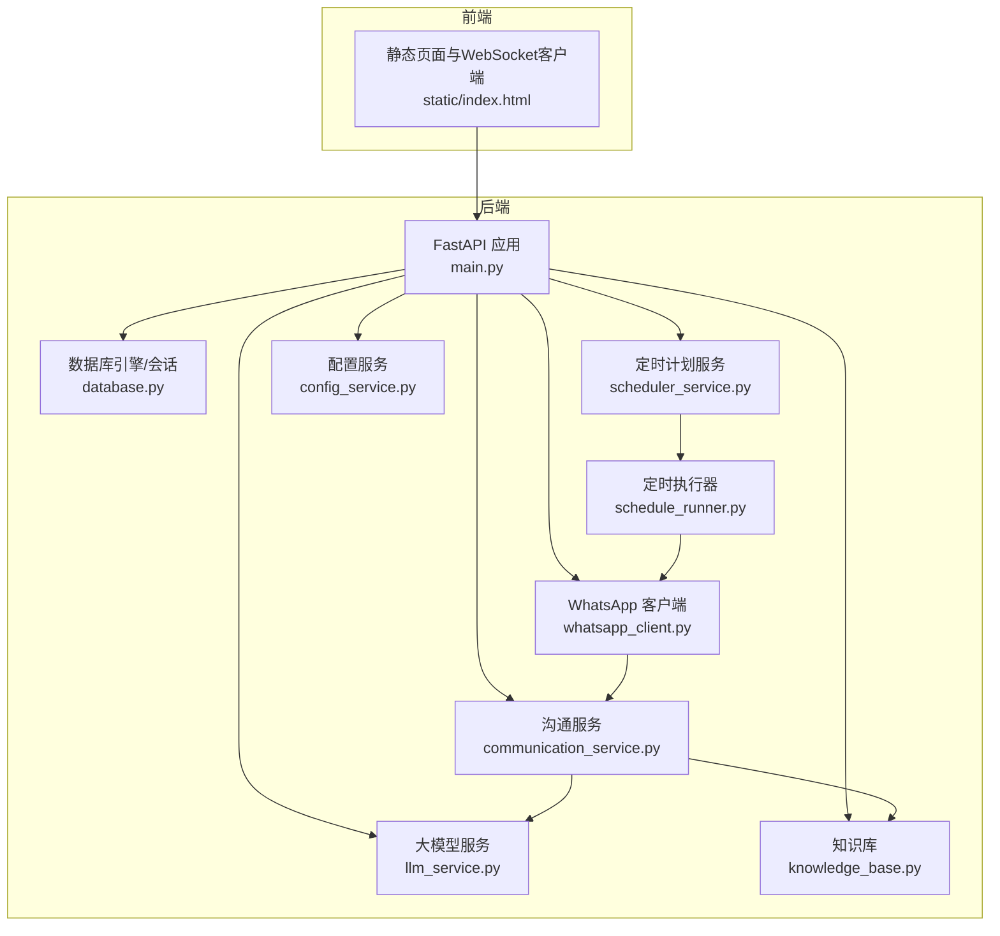
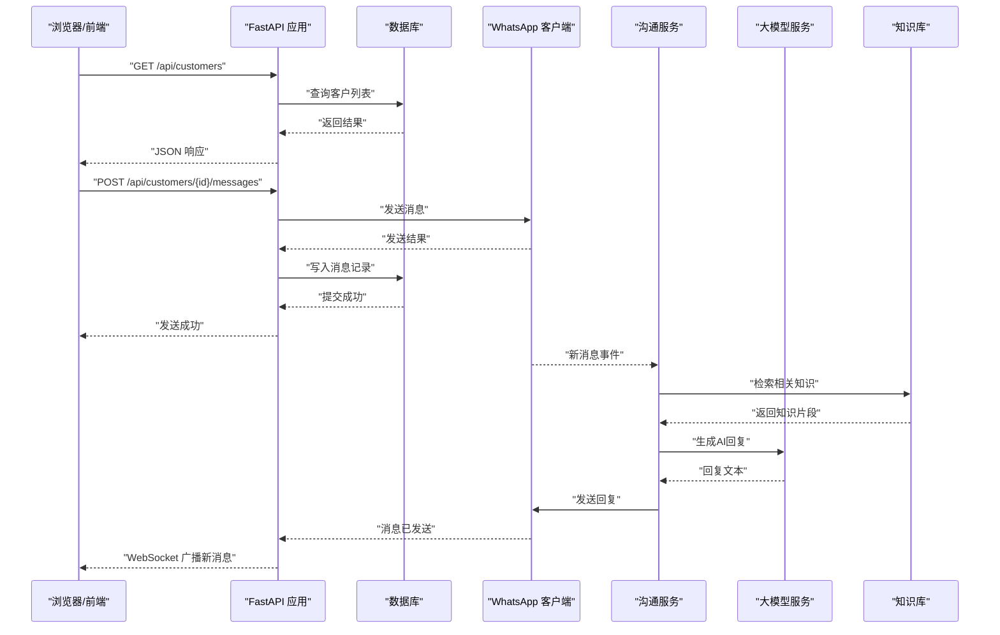
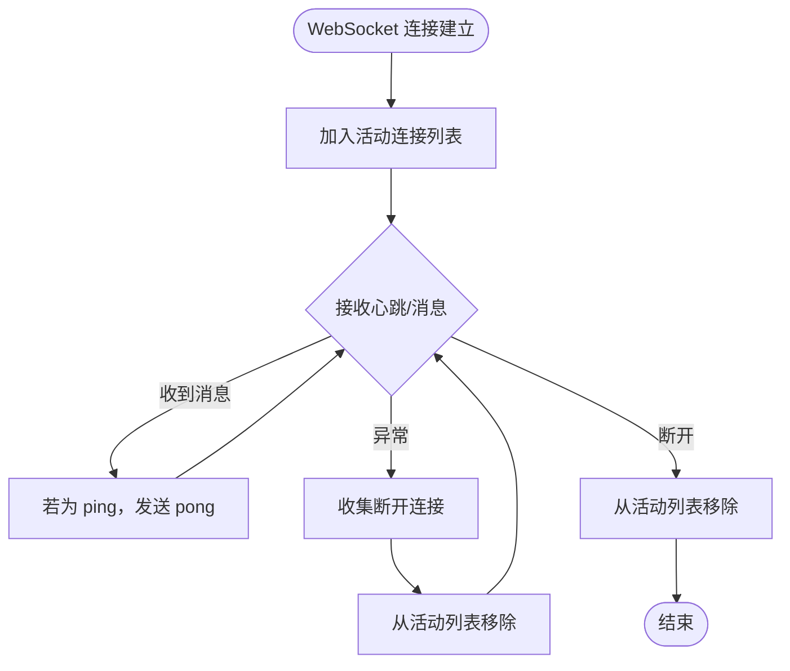
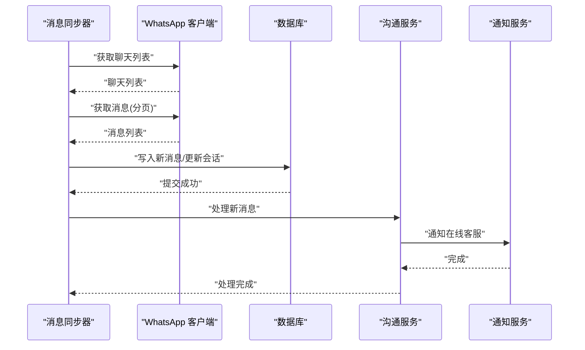
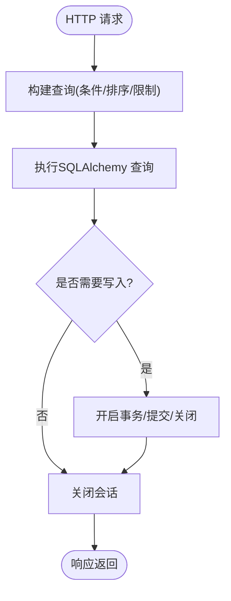
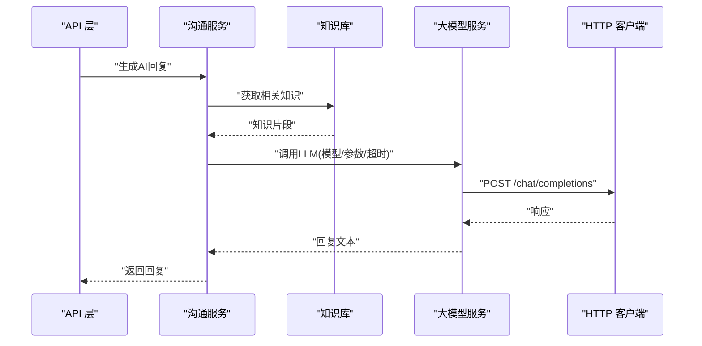
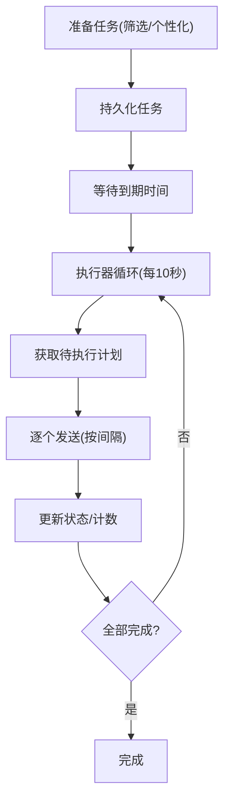
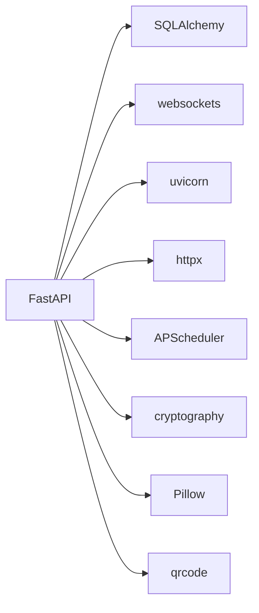

# 性能问题

<cite>
**本文引用的文件**
- [backend/main.py](file://backend/main.py)
- [backend/database.py](file://backend/database.py)
- [backend/whatsapp_client.py](file://backend/whatsapp_client.py)
- [backend/communication_service.py](file://backend/communication_service.py)
- [backend/scheduler_service.py](file://backend/scheduler_service.py)
- [backend/schedule_runner.py](file://backend/schedule_runner.py)
- [backend/llm_service.py](file://backend/llm_service.py)
- [backend/knowledge_base.py](file://backend/knowledge_base.py)
- [backend/config_service.py](file://backend/config_service.py)
- [backend/requirements.txt](file://backend/requirements.txt)
- [start_server.py](file://start_server.py)
- [backend/static/index.html](file://backend/static/index.html)
</cite>

## 目录
1. [简介](#简介)
2. [项目结构](#项目结构)
3. [核心组件](#核心组件)
4. [架构总览](#架构总览)
5. [详细组件分析](#详细组件分析)
6. [依赖分析](#依赖分析)
7. [性能考量](#性能考量)
8. [故障排除指南](#故障排除指南)
9. [结论](#结论)
10. [附录](#附录)

## 简介
本指南聚焦于该WhatsApp机器人系统的性能问题排查与优化，围绕响应缓慢、内存泄漏、并发限制、CPU与I/O瓶颈等问题，结合系统实际代码实现，给出可操作的诊断方法、修复建议与监控指标。重点覆盖：
- 数据库查询优化与连接管理
- WebSocket连接数与消息广播效率
- 消息同步频率与轮询策略
- 大模型调用与知识库检索的性能影响
- 定时发送计划的并发与节流
- CPU与I/O瓶颈识别与定位
- 性能监控指标与基准测试方法

## 项目结构
系统采用FastAPI作为Web框架，后端包含数据库、WhatsApp客户端、消息同步、AI回复、知识库、定时计划等模块；前端通过WebSocket实现实时消息推送。

图示来源
- [backend/main.py](file://backend/main.py)
- [backend/database.py](file://backend/database.py)
- [backend/whatsapp_client.py](file://backend/whatsapp_client.py)
- [backend/communication_service.py](file://backend/communication_service.py)
- [backend/scheduler_service.py](file://backend/scheduler_service.py)
- [backend/schedule_runner.py](file://backend/schedule_runner.py)
- [backend/llm_service.py](file://backend/llm_service.py)
- [backend/knowledge_base.py](file://backend/knowledge_base.py)
- [backend/config_service.py](file://backend/config_service.py)
- [backend/static/index.html](file://backend/static/index.html)

章节来源
- [backend/main.py](file://backend/main.py)
- [backend/requirements.txt](file://backend/requirements.txt)
- [start_server.py](file://start_server.py)

## 核心组件
- FastAPI应用与路由：负责HTTP接口、WebSocket实时推送、系统状态查询。
- 数据库层：SQLite/SQLAlchemy，提供客户、消息、会话、计划等模型与会话管理。
- WhatsApp客户端：封装CLI命令，提供认证、联系人/聊天/消息获取、发送、持续同步等功能。
- 沟通服务：处理新消息、自动回复、转人工、标签规则、通知等。
- 定时计划：基于SQLite的任务调度与执行器。
- 大模型服务：统一LLM调用入口，支持多提供商与智能体选择。
- 知识库：文档检索与关键词索引。
- 配置服务：敏感配置加密存储。

章节来源
- [backend/main.py](file://backend/main.py)
- [backend/database.py](file://backend/database.py)
- [backend/whatsapp_client.py](file://backend/whatsapp_client.py)
- [backend/communication_service.py](file://backend/communication_service.py)
- [backend/scheduler_service.py](file://backend/scheduler_service.py)
- [backend/schedule_runner.py](file://backend/schedule_runner.py)
- [backend/llm_service.py](file://backend/llm_service.py)
- [backend/knowledge_base.py](file://backend/knowledge_base.py)
- [backend/config_service.py](file://backend/config_service.py)

## 架构总览
系统采用“API网关 + 业务服务 + 外部CLI集成”的模式。WebSocket用于实时消息广播；数据库承担持久化；WhatsApp CLI负责真实消息的拉取与发送；AI服务与知识库提升回复质量与效率；定时计划模块实现批量消息发送。

图示来源
- [backend/main.py](file://backend/main.py)
- [backend/whatsapp_client.py](file://backend/whatsapp_client.py)
- [backend/communication_service.py](file://backend/communication_service.py)
- [backend/llm_service.py](file://backend/llm_service.py)
- [backend/knowledge_base.py](file://backend/knowledge_base.py)

## 详细组件分析

### WebSocket 实时通信与广播
- 连接管理：全局列表维护活动连接，断开时清理；心跳机制通过ping/pong维持。
- 广播策略：遍历活动连接逐一发送，异常连接被收集并在后续清理。
- 性能风险点：大量连接时广播成本线性增长；异常发送未及时移除会导致内存累积。

图示来源
- [backend/main.py](file://backend/main.py)

章节来源
- [backend/main.py](file://backend/main.py)

### 消息同步与轮询
- 轮询策略：每秒轮询一次，限制最小同步间隔，避免过于频繁；每次同步遍历所有聊天，过滤重复消息ID。
- 新消息处理：触发沟通服务处理自动回复与转人工通知；通知在线客服。
- 性能风险点：轮询间隔过小导致CPU与I/O压力；消息去重集合增长；数据库频繁写入。

图示来源
- [backend/whatsapp_client.py](file://backend/whatsapp_client.py)
- [backend/communication_service.py](file://backend/communication_service.py)

章节来源
- [backend/whatsapp_client.py](file://backend/whatsapp_client.py)

### 数据库查询与事务
- 查询路径：客户列表、消息历史、会话统计等均通过SQLAlchemy ORM执行；部分查询使用order_by/limit限制结果集。
- 事务管理：每个请求使用独立Session，结束后关闭；同步流程中显式commit/finally close。
- 性能风险点：未使用索引字段查询、N+1查询、长事务持有锁。

图示来源
- [backend/main.py](file://backend/main.py)
- [backend/database.py](file://backend/database.py)

章节来源
- [backend/main.py](file://backend/main.py)
- [backend/database.py](file://backend/database.py)

### 大模型调用与知识库检索
- LLM调用：统一通过异步HTTP客户端发起请求，支持多提供商与模型参数；失败时回退默认回复。
- 知识库检索：关键词提取与简单匹配，返回相关文档片段供LLM参考。
- 性能风险点：网络延迟、超时配置不当、大令牌数导致成本与耗时上升。

图示来源
- [backend/communication_service.py](file://backend/communication_service.py)
- [backend/knowledge_base.py](file://backend/knowledge_base.py)
- [backend/llm_service.py](file://backend/llm_service.py)

章节来源
- [backend/llm_service.py](file://backend/llm_service.py)
- [backend/knowledge_base.py](file://backend/knowledge_base.py)
- [backend/communication_service.py](file://backend/communication_service.py)

### 定时发送计划与执行器
- 计划准备：按标签/分类筛选客户，生成任务列表，持久化到SQLite。
- 执行策略：每10秒检查一次到期计划，逐个发送，按间隔暂停。
- 并发与节流：单任务串行发送，避免对WhatsApp CLI造成过大压力。

图示来源
- [backend/scheduler_service.py](file://backend/scheduler_service.py)
- [backend/schedule_runner.py](file://backend/schedule_runner.py)

章节来源
- [backend/scheduler_service.py](file://backend/scheduler_service.py)
- [backend/schedule_runner.py](file://backend/schedule_runner.py)

## 依赖分析
- Web框架与异步：FastAPI、uvicorn、websockets。
- 数据持久化：SQLAlchemy、sqlite/aiofiles。
- HTTP与LLM：httpx、openai。
- 定时任务：APScheduler。
- 加解密：cryptography。
- QR与图像：qrcode、Pillow。

图示来源
- [backend/requirements.txt](file://backend/requirements.txt)

章节来源
- [backend/requirements.txt](file://backend/requirements.txt)

## 性能考量
- 响应时间
  - API层面：路由处理、数据库查询、外部CLI调用、LLM网络请求。
  - WebSocket：广播成本随连接数线性增长。
- 吞吐量
  - 消息同步轮询频率、定时发送间隔、LLM并发调用。
- 资源使用
  - CPU：轮询、LLM推理、JSON解析、字符串处理。
  - I/O：数据库写入、CLI子进程、网络请求、文件系统。
- 并发与限流
  - WebSocket连接数、数据库连接池、LLM并发与超时、CLI并发。

[本节为通用指导，无需特定文件引用]

## 故障排除指南

### 响应缓慢的诊断与优化
- 数据库查询优化
  - 症状：列表查询慢、消息历史加载慢。
  - 方法：确认索引字段（如客户phone、消息created_at）；使用limit/offset分页；避免N+1查询；减少不必要的JOIN。
  - 参考实现位置
    - [backend/main.py](file://backend/main.py)
    - [backend/database.py](file://backend/database.py)
- WebSocket连接数限制与广播优化
  - 症状：连接数增多时广播卡顿。
  - 方法：限制最大连接数、定期清理无效连接、使用更高效的消息推送策略（如分组广播、背压）。
  - 参考实现位置
    - [backend/main.py](file://backend/main.py)
- 消息同步频率调整
  - 症状：CPU占用高、I/O压力大。
  - 方法：增大轮询间隔（当前默认1秒），引入指数退避；仅在有新消息时触发处理；优化消息去重集合大小。
  - 参考实现位置
    - [backend/whatsapp_client.py](file://backend/whatsapp_client.py)
- LLM调用与知识库检索
  - 症状：回复延迟高、超时。
  - 方法：调整超时与最大tokens；缓存常用知识片段；降低并发；选择更合适的模型。
  - 参考实现位置
    - [backend/llm_service.py](file://backend/llm_service.py)
    - [backend/knowledge_base.py](file://backend/knowledge_base.py)

章节来源
- [backend/main.py](file://backend/main.py)
- [backend/database.py](file://backend/database.py)
- [backend/whatsapp_client.py](file://backend/whatsapp_client.py)
- [backend/llm_service.py](file://backend/llm_service.py)
- [backend/knowledge_base.py](file://backend/knowledge_base.py)

### 内存泄漏检测与修复
- 未释放的WebSocket连接
  - 症状：活动连接列表持续增长。
  - 修复：确保异常分支移除连接；在断开事件中清理；定期巡检与告警。
  - 参考实现位置
    - [backend/main.py](file://backend/main.py)
- 数据库会话管理
  - 症状：会话未关闭导致连接池耗尽。
  - 修复：每个请求使用独立Session并在finally中关闭；批量写入后及时commit/close。
  - 参考实现位置
    - [backend/main.py](file://backend/main.py)
    - [backend/database.py](file://backend/database.py)
- 大模型与知识库对象
  - 症状：LLM调用堆积、知识库缓存增长。
  - 修复：限制并发；增加超时；清理临时数据结构。
  - 参考实现位置
    - [backend/llm_service.py](file://backend/llm_service.py)
    - [backend/knowledge_base.py](file://backend/knowledge_base.py)

章节来源
- [backend/main.py](file://backend/main.py)
- [backend/database.py](file://backend/database.py)
- [backend/llm_service.py](file://backend/llm_service.py)
- [backend/knowledge_base.py](file://backend/knowledge_base.py)

### 并发限制问题排查
- API请求限流
  - 方法：在FastAPI中引入速率限制中间件；对高频端点（如消息同步、LLM）设置阈值。
  - 参考实现位置
    - [backend/main.py](file://backend/main.py)
- 数据库连接池配置
  - 方法：根据并发场景调整连接池大小；监控活跃连接数；避免长事务。
  - 参考实现位置
    - [backend/database.py](file://backend/database.py)
- 异步任务队列管理
  - 方法：定时发送采用串行执行，避免CLI并发压力；必要时引入外部队列（如Redis/RabbitMQ）。
  - 参考实现位置
    - [backend/scheduler_service.py](file://backend/scheduler_service.py)
    - [backend/schedule_runner.py](file://backend/schedule_runner.py)

章节来源
- [backend/main.py](file://backend/main.py)
- [backend/database.py](file://backend/database.py)
- [backend/scheduler_service.py](file://backend/scheduler_service.py)
- [backend/schedule_runner.py](file://backend/schedule_runner.py)

### CPU使用率过高与I/O瓶颈识别
- CPU热点
  - 检查：轮询循环、LLM调用、JSON解析、字符串处理。
  - 优化：减少轮询频率、缓存结果、简化处理逻辑。
- I/O瓶颈
  - 检查：数据库写入、CLI子进程、网络请求。
  - 优化：批量写入、合理超时、连接复用、异步非阻塞。

章节来源
- [backend/whatsapp_client.py](file://backend/whatsapp_client.py)
- [backend/llm_service.py](file://backend/llm_service.py)
- [backend/database.py](file://backend/database.py)

### 性能监控指标与基准测试
- 关键指标
  - 响应时间：各API端点P50/P95/P99；WebSocket消息延迟。
  - 吞吐量：每秒请求数、消息同步速率、定时发送速率。
  - 资源使用：CPU利用率、内存占用、数据库连接数、网络带宽。
- 基准测试方法
  - 使用工具：wrk、ab、locust对API端点进行压力测试；模拟多WebSocket客户端进行广播测试。
  - 场景设计：不同连接数、消息频率、并发LLM请求、数据库负载。
- 监控建议
  - 集成指标：Prometheus/Grafana；记录关键链路耗时与错误率。
  - 日志采样：关键路径打点、异常堆栈采集。

[本节为通用指导，无需特定文件引用]

## 结论
本系统性能问题主要集中在消息同步轮询、WebSocket广播、LLM调用与知识库检索、数据库事务与连接管理等方面。通过优化轮询策略、限制并发、改进广播与缓存、合理配置数据库与外部CLI，可显著改善响应时间与资源使用。建议建立完善的监控与基准测试体系，持续跟踪关键指标并迭代优化。

[本节为总结性内容，无需特定文件引用]

## 附录

### 快速定位步骤清单
- 检查系统状态端点，确认WhatsApp连接与同步状态
  - [backend/main.py](file://backend/main.py)
- 评估WebSocket连接数与广播耗时
  - [backend/main.py](file://backend/main.py)
- 调整消息同步轮询间隔
  - [backend/whatsapp_client.py](file://backend/whatsapp_client.py)
- 优化数据库查询与事务
  - [backend/main.py](file://backend/main.py)
  - [backend/database.py](file://backend/database.py)
- 控制LLM调用并发与超时
  - [backend/llm_service.py](file://backend/llm_service.py)
- 审核定时发送计划的执行策略
  - [backend/scheduler_service.py](file://backend/scheduler_service.py)
  - [backend/schedule_runner.py](file://backend/schedule_runner.py)