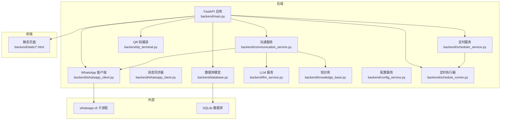
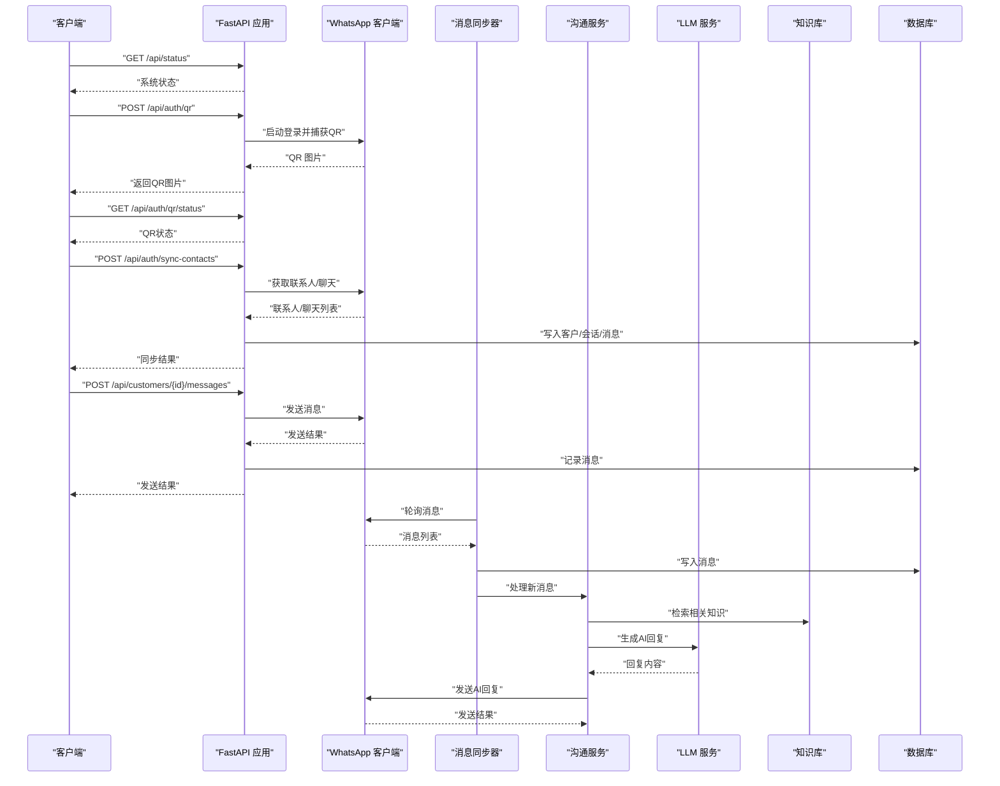
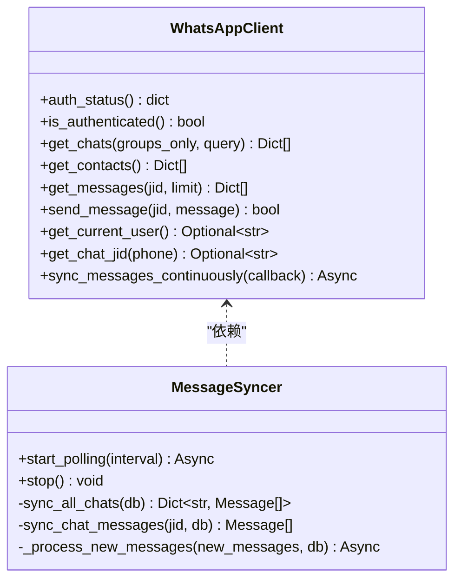
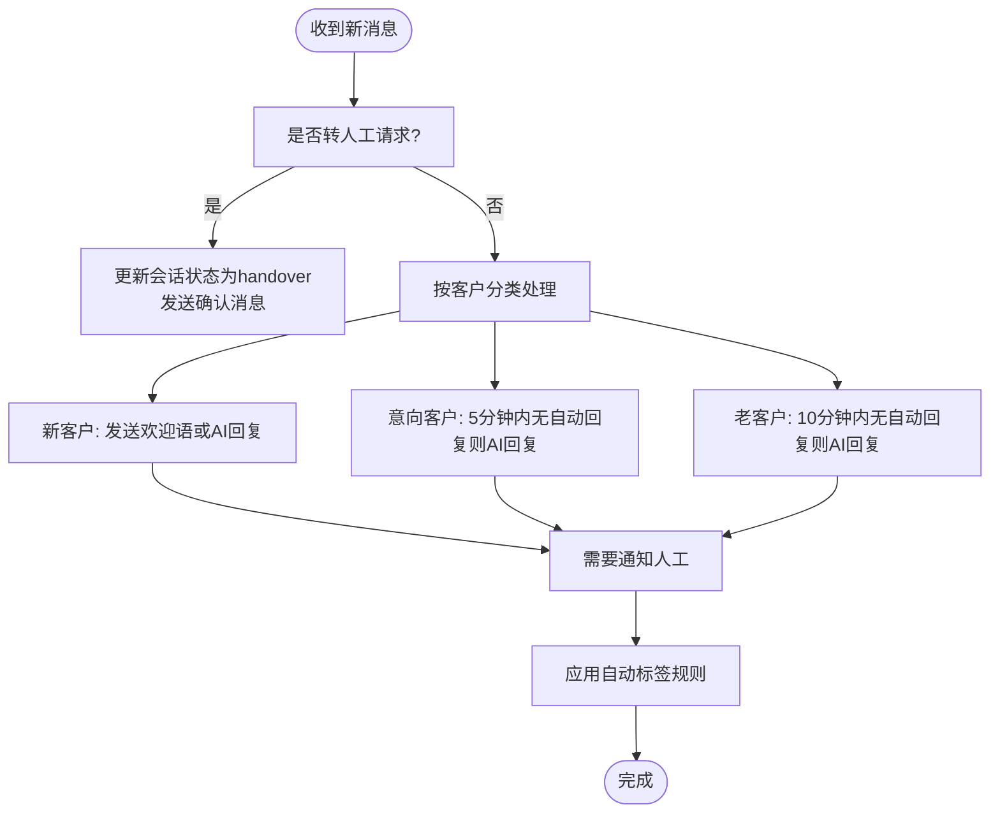
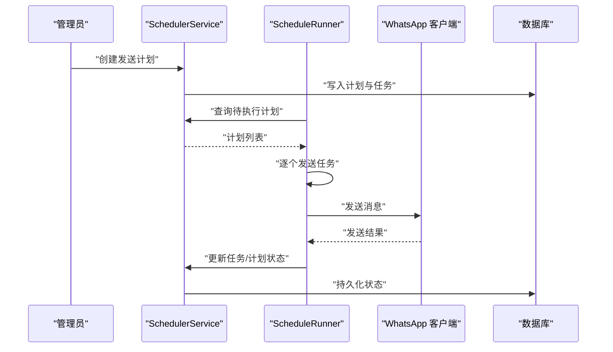
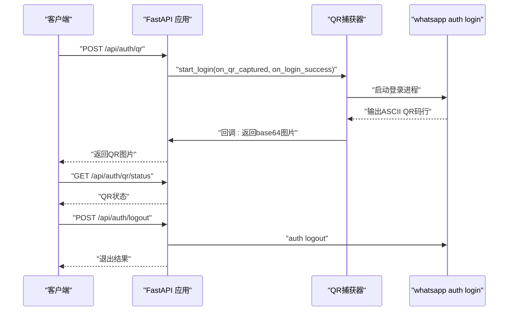
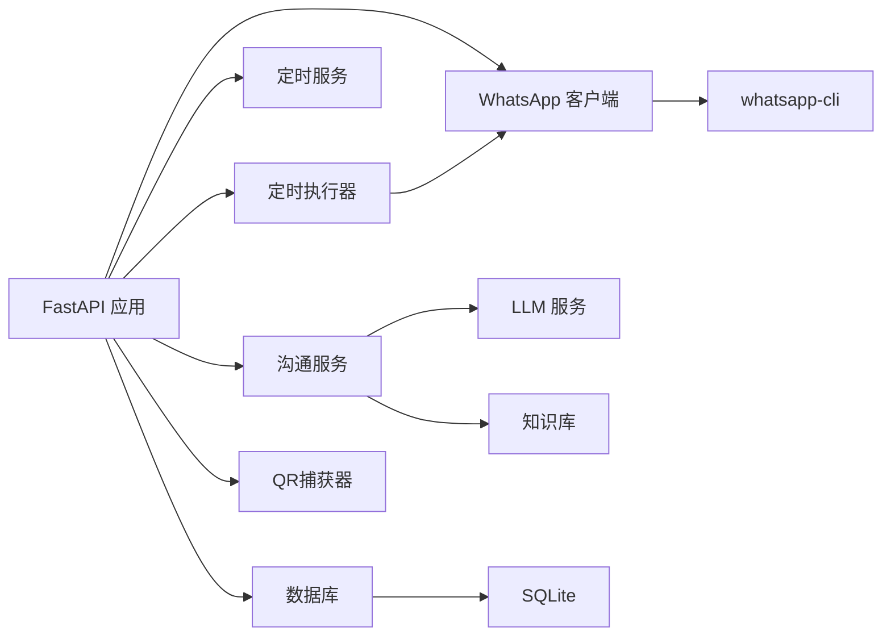

# 故障排除

<cite>
**本文引用的文件**
- [backend/main.py](file://backend/main.py)
- [backend/whatsapp_client.py](file://backend/whatsapp_client.py)
- [backend/communication_service.py](file://backend/communication_service.py)
- [backend/database.py](file://backend/database.py)
- [backend/qr_terminal.py](file://backend/qr_terminal.py)
- [backend/llm_service.py](file://backend/llm_service.py)
- [backend/knowledge_base.py](file://backend/knowledge_base.py)
- [backend/config_service.py](file://backend/config_service.py)
- [backend/scheduler_service.py](file://backend/scheduler_service.py)
- [backend/schedule_runner.py](file://backend/schedule_runner.py)
- [login_whatsapp.py](file://login_whatsapp.py)
- [start_server.py](file://start_server.py)
- [requirements.txt](file://requirements.txt)
</cite>

## 目录
1. [简介](#简介)
2. [项目结构](#项目结构)
3. [核心组件](#核心组件)
4. [架构总览](#架构总览)
5. [详细组件分析](#详细组件分析)
6. [依赖关系分析](#依赖关系分析)
7. [性能考虑](#性能考虑)
8. [故障排除指南](#故障排除指南)
9. [结论](#结论)
10. [附录](#附录)

## 简介
本指南面向WhatsApp智能客户系统的运维与开发者，聚焦于常见问题的诊断与解决，涵盖：
- WhatsApp连接问题（QR码登录失败、连接超时、认证错误）
- API调用错误（网络问题、权限不足、参数错误）
- 性能问题（响应缓慢、内存泄漏、并发限制）
- 调试技巧与工具（日志分析、网络排查、数据库性能诊断）
- 系统健康检查（服务状态监控、依赖服务检查、资源使用）
- 紧急处理与回滚策略
- 社区支持与问题反馈渠道

## 项目结构
系统采用前后端分离与服务化架构：
- 后端：FastAPI应用，负责业务逻辑、消息同步、AI回复、定时发送、数据库交互
- 前端：静态页面（index.html、admin.html、agents.html、login.html）
- 外部依赖：whatsapp-cli（通过子进程调用）、SQLite（本地数据存储）

图表来源
- [backend/main.py:128-134](file://backend/main.py#L128-L134)
- [backend/whatsapp_client.py:13-26](file://backend/whatsapp_client.py#L13-L26)
- [backend/communication_service.py:17-46](file://backend/communication_service.py#L17-L46)
- [backend/database.py:14-20](file://backend/database.py#L14-L20)
- [backend/qr_terminal.py:14-23](file://backend/qr_terminal.py#L14-L23)
- [backend/llm_service.py:11-16](file://backend/llm_service.py#L11-L16)
- [backend/knowledge_base.py:11-17](file://backend/knowledge_base.py#L11-L17)
- [backend/config_service.py:11-22](file://backend/config_service.py#L11-L22)
- [backend/scheduler_service.py:54-62](file://backend/scheduler_service.py#L54-L62)
- [backend/schedule_runner.py:12-20](file://backend/schedule_runner.py#L12-L20)

章节来源
- [backend/main.py:128-134](file://backend/main.py#L128-L134)
- [backend/whatsapp_client.py:13-26](file://backend/whatsapp_client.py#L13-L26)
- [backend/communication_service.py:17-46](file://backend/communication_service.py#L17-L46)
- [backend/database.py:14-20](file://backend/database.py#L14-L20)
- [backend/qr_terminal.py:14-23](file://backend/qr_terminal.py#L14-L23)
- [backend/llm_service.py:11-16](file://backend/llm_service.py#L11-L16)
- [backend/knowledge_base.py:11-17](file://backend/knowledge_base.py#L11-L17)
- [backend/config_service.py:11-22](file://backend/config_service.py#L11-L22)
- [backend/scheduler_service.py:54-62](file://backend/scheduler_service.py#L54-L62)
- [backend/schedule_runner.py:12-20](file://backend/schedule_runner.py#L12-L20)

## 核心组件
- FastAPI应用与路由：提供系统状态、认证、客户、消息、会话、沟通计划、AI回复、知识库等接口
- WhatsApp客户端：封装whatsapp-cli命令调用，提供登录状态检查、联系人/聊天/消息获取、消息发送、JID处理、持续同步
- 消息同步器：轮询拉取聊天消息，去重入库，触发自动回复与人工通知
- 沟通服务：自动回复、转人工、自动打标签、计划执行
- 数据库：SQLAlchemy模型与SQLite存储
- QR码捕获：在终端中捕获ASCII QR码并渲染为图片
- LLM服务：集成OpenAI/Claude，按智能体与提供商配置生成回复
- 知识库：SQLite文档与关键词索引，提供相关知识检索
- 配置服务：加密存储敏感配置（API Key等）
- 定时服务与执行器：按标签筛选客户，定时逐个发送消息

章节来源
- [backend/main.py:489-496](file://backend/main.py#L489-L496)
- [backend/whatsapp_client.py:82-127](file://backend/whatsapp_client.py#L82-L127)
- [backend/whatsapp_client.py:212-437](file://backend/whatsapp_client.py#L212-L437)
- [backend/communication_service.py:17-46](file://backend/communication_service.py#L17-L46)
- [backend/database.py:23-296](file://backend/database.py#L23-L296)
- [backend/qr_terminal.py:14-297](file://backend/qr_terminal.py#L14-L297)
- [backend/llm_service.py:11-286](file://backend/llm_service.py#L11-L286)
- [backend/knowledge_base.py:11-212](file://backend/knowledge_base.py#L11-L212)
- [backend/config_service.py:11-153](file://backend/config_service.py#L11-L153)
- [backend/scheduler_service.py:54-393](file://backend/scheduler_service.py#L54-L393)
- [backend/schedule_runner.py:12-142](file://backend/schedule_runner.py#L12-L142)

## 架构总览
系统通过FastAPI对外提供REST接口，内部通过WhatsApp客户端与whatsapp-cli交互，消息同步器周期性轮询消息并触发自动回复；沟通服务协调AI回复、人工通知与标签；定时执行器按计划批量发送消息；数据库持久化所有实体；QR码捕获辅助登录；LLM服务与知识库提供智能回复能力。

图表来源
- [backend/main.py:221-360](file://backend/main.py#L221-L360)
- [backend/whatsapp_client.py:82-127](file://backend/whatsapp_client.py#L82-L127)
- [backend/whatsapp_client.py:366-398](file://backend/whatsapp_client.py#L366-L398)
- [backend/communication_service.py:47-72](file://backend/communication_service.py#L47-L72)
- [backend/llm_service.py:177-198](file://backend/llm_service.py#L177-L198)
- [backend/knowledge_base.py:130-141](file://backend/knowledge_base.py#L130-L141)
- [backend/database.py:23-124](file://backend/database.py#L23-L124)

## 详细组件分析

### 组件A：WhatsApp客户端与消息同步
- 功能要点
  - 异步/同步执行whatsapp-cli命令，解析JSON输出
  - 登录状态检查、联系人/聊天/消息获取、消息发送（自动切换JID后缀）
  - 持续同步模式（follow）实时接收新消息
  - 消息同步器轮询拉取消息，去重入库，触发自动回复与人工通知
- 关键异常与边界
  - 命令超时、子进程返回码非零、JSON解析失败
  - JID格式不正确导致发送失败
  - 同步轮询间隔过短引发性能压力

图表来源
- [backend/whatsapp_client.py:13-211](file://backend/whatsapp_client.py#L13-L211)
- [backend/whatsapp_client.py:212-437](file://backend/whatsapp_client.py#L212-L437)

章节来源
- [backend/whatsapp_client.py:27-81](file://backend/whatsapp_client.py#L27-L81)
- [backend/whatsapp_client.py:133-173](file://backend/whatsapp_client.py#L133-L173)
- [backend/whatsapp_client.py:174-210](file://backend/whatsapp_client.py#L174-L210)
- [backend/whatsapp_client.py:366-437](file://backend/whatsapp_client.py#L366-L437)

### 组件B：沟通服务与通知
- 功能要点
  - 自动回复：新客户/意向客户/老客户不同策略
  - 转人工请求识别与处理
  - 自动打标签规则（关键词、报价请求、消息到达等）
  - 通知服务：向在线客服发送新消息提醒
- 关键异常与边界
  - LLM调用失败回退至默认模板
  - 标签规则冲突与重复应用
  - 通知发送失败不影响主流程

图表来源
- [backend/communication_service.py:47-171](file://backend/communication_service.py#L47-L171)
- [backend/communication_service.py:292-361](file://backend/communication_service.py#L292-L361)
- [backend/communication_service.py:428-512](file://backend/communication_service.py#L428-L512)

章节来源
- [backend/communication_service.py:17-46](file://backend/communication_service.py#L17-L46)
- [backend/communication_service.py:172-265](file://backend/communication_service.py#L172-L265)
- [backend/communication_service.py:292-361](file://backend/communication_service.py#L292-L361)
- [backend/communication_service.py:428-512](file://backend/communication_service.py#L428-L512)

### 组件C：定时发送计划
- 功能要点
  - 创建发送计划（目标标签、分类、时间、间隔）
  - 准备任务（消息模板个性化）
  - 执行器按计划逐个发送，更新状态与统计
- 关键异常与边界
  - 计划暂停/取消后的任务跳过
  - 发送失败记录错误并继续下一个
  - 执行器每10秒检查一次到期计划

图表来源
- [backend/scheduler_service.py:108-288](file://backend/scheduler_service.py#L108-L288)
- [backend/scheduler_service.py:319-381](file://backend/scheduler_service.py#L319-L381)
- [backend/schedule_runner.py:35-124](file://backend/schedule_runner.py#L35-L124)

章节来源
- [backend/scheduler_service.py:54-393](file://backend/scheduler_service.py#L54-L393)
- [backend/schedule_runner.py:12-142](file://backend/schedule_runner.py#L12-L142)

### 组件D：认证与QR码登录
- 功能要点
  - FastAPI提供获取QR、状态查询、取消登录、退出登录接口
  - 终端QR码捕获器：启动登录进程，捕获ASCII QR码，渲染为base64图片
  - 登录助手脚本：检查CLI、状态，执行登录/退出
- 关键异常与边界
  - QR码行数不足或被截断导致渲染失败
  - 登录进程超时或意外退出
  - 多次重复启动登录进程

图表来源
- [backend/main.py:221-360](file://backend/main.py#L221-L360)
- [backend/qr_terminal.py:24-80](file://backend/qr_terminal.py#L24-L80)
- [backend/qr_terminal.py:81-144](file://backend/qr_terminal.py#L81-L144)
- [login_whatsapp.py:51-108](file://login_whatsapp.py#L51-L108)

章节来源
- [backend/main.py:221-360](file://backend/main.py#L221-L360)
- [backend/qr_terminal.py:14-297](file://backend/qr_terminal.py#L14-L297)
- [login_whatsapp.py:16-108](file://login_whatsapp.py#L16-L108)

## 依赖关系分析
- 外部依赖
  - whatsapp-cli：通过子进程调用，必须在PATH中
  - SQLite：本地数据库，支持多线程读写（SQLite特性）
- 内部依赖
  - FastAPI应用依赖WhatsApp客户端、沟通服务、定时服务、数据库、QR捕获器
  - 沟通服务依赖LLM服务与知识库
  - 定时执行器依赖WhatsApp客户端与定时服务

图表来源
- [backend/main.py:17-26](file://backend/main.py#L17-L26)
- [backend/whatsapp_client.py:13-26](file://backend/whatsapp_client.py#L13-L26)
- [backend/communication_service.py:17-14](file://backend/communication_service.py#L17-L14)
- [backend/scheduler_service.py:54-62](file://backend/scheduler_service.py#L54-L62)
- [backend/schedule_runner.py:12-20](file://backend/schedule_runner.py#L12-L20)
- [backend/database.py:14-20](file://backend/database.py#L14-L20)
- [backend/qr_terminal.py:14-23](file://backend/qr_terminal.py#L14-L23)

章节来源
- [backend/main.py:17-26](file://backend/main.py#L17-L26)
- [backend/whatsapp_client.py:13-26](file://backend/whatsapp_client.py#L13-L26)
- [backend/communication_service.py:17-14](file://backend/communication_service.py#L17-L14)
- [backend/scheduler_service.py:54-62](file://backend/scheduler_service.py#L54-L62)
- [backend/schedule_runner.py:12-20](file://backend/schedule_runner.py#L12-L20)
- [backend/database.py:14-20](file://backend/database.py#L14-L20)
- [backend/qr_terminal.py:14-23](file://backend/qr_terminal.py#L14-L23)

## 性能考虑
- 消息同步轮询
  - 默认1秒轮询，建议根据并发与网络状况调整
  - 同步过程中进行去重与数据库事务，注意I/O瓶颈
- LLM调用
  - 异步HTTP客户端，超时可配置
  - 失败回退至默认模板，避免阻塞
- 定时发送
  - 执行器每10秒检查一次，任务间按间隔秒数等待
  - 大批量任务可能导致瞬时峰值，建议合理设置间隔
- 数据库
  - SQLite默认连接参数，生产环境建议使用更高并发的数据库
  - 频繁写入时注意事务提交与索引优化

[本节为通用指导，无需特定文件来源]

## 故障排除指南

### 一、WhatsApp连接问题
- 症状
  - 获取QR码失败或QR码为空
  - 登录超时或失败
  - 已登录但API返回未连接
- 诊断步骤
  - 检查whatsapp-cli是否安装并位于PATH中
  - 通过登录助手脚本验证auth状态
  - 在API中调用获取QR码接口，观察QR状态
  - 查看QR捕获器日志，确认ASCII行数与渲染
- 解决方案
  - 安装并配置whatsapp-cli，确保PATH包含其二进制目录
  - 适当增大QR捕获等待时间，避免终端宽度不足导致行被截断
  - 若QR码渲染失败，尝试降低终端字体大小或增大列宽
  - 退出登录后重新登录，必要时重启消息同步器

章节来源
- [login_whatsapp.py:16-32](file://login_whatsapp.py#L16-L32)
- [login_whatsapp.py:35-48](file://login_whatsapp.py#L35-L48)
- [backend/main.py:221-360](file://backend/main.py#L221-L360)
- [backend/qr_terminal.py:81-144](file://backend/qr_terminal.py#L81-L144)
- [backend/qr_terminal.py:167-240](file://backend/qr_terminal.py#L167-L240)

### 二、API调用错误
- 症状
  - 404：客户不存在、会话不存在
  - 500：消息发送失败、计划执行失败
  - 503：WhatsApp客户端未就绪
- 诊断步骤
  - 检查请求参数与路径变量
  - 确认WhatsApp已登录且消息同步器已启动
  - 查看数据库中是否存在目标客户/会话
- 解决方案
  - 确保客户ID/会话ID有效
  - 检查WhatsApp客户端状态与连接
  - 对于发送失败，检查JID格式与whatsapp-cli返回码

章节来源
- [backend/main.py:557-563](file://backend/main.py#L557-L563)
- [backend/main.py:601-633](file://backend/main.py#L601-L633)
- [backend/main.py:712-722](file://backend/main.py#L712-L722)
- [backend/whatsapp_client.py:133-154](file://backend/whatsapp_client.py#L133-L154)

### 三、性能问题
- 症状
  - 响应缓慢、消息延迟
  - CPU/内存占用高
  - 并发发送导致限流
- 诊断步骤
  - 监控消息同步轮询间隔与任务队列
  - 检查LLM调用耗时与回退次数
  - 观察数据库写入频率与事务开销
- 解决方案
  - 调整消息同步轮询间隔
  - 优化LLM调用超时与回退策略
  - 批量发送时增加任务间隔，避免瞬时峰值

章节来源
- [backend/whatsapp_client.py:366-398](file://backend/whatsapp_client.py#L366-L398)
- [backend/llm_service.py:149-175](file://backend/llm_service.py#L149-L175)
- [backend/schedule_runner.py:35-124](file://backend/schedule_runner.py#L35-L124)

### 四、调试技巧与工具
- 日志分析
  - FastAPI应用打印启动/关闭、QR捕获、消息同步、AI回复等关键信息
  - WhatsApp客户端捕获子进程输出，定位命令失败原因
- 网络问题排查
  - LLM服务使用异步HTTP客户端，检查超时与返回码
  - 代理/防火墙影响whatsapp-cli网络访问
- 数据库性能诊断
  - SQLite默认连接参数，注意事务与索引
  - 定期清理无用数据，避免表膨胀

章节来源
- [backend/main.py:88-126](file://backend/main.py#L88-L126)
- [backend/whatsapp_client.py:27-58](file://backend/whatsapp_client.py#L27-L58)
- [backend/llm_service.py:150-164](file://backend/llm_service.py#L150-L164)
- [backend/database.py:14-20](file://backend/database.py#L14-L20)

### 五、系统健康检查
- 服务状态
  - GET /api/status：检查WhatsApp连接、同步器运行、WebSocket客户端数量
  - GET /api/auth/status：检查登录状态与数据库信息
- 依赖服务
  - 检查whatsapp-cli可用性与版本
  - 检查数据库连接与表结构
- 资源使用
  - 监控CPU/内存/磁盘IO
  - 观察消息同步与定时任务队列长度

章节来源
- [backend/main.py:489-496](file://backend/main.py#L489-L496)
- [backend/main.py:198-212](file://backend/main.py#L198-L212)
- [login_whatsapp.py:16-32](file://login_whatsapp.py#L16-L32)
- [backend/database.py:254-256](file://backend/database.py#L254-L256)

### 六、紧急处理与回滚策略
- 紧急处理
  - 立即停止消息同步器与定时执行器
  - 退出登录并清理会话
  - 切换至备用LLM提供商或禁用AI回复
- 回滚策略
  - 回退到上一个稳定版本的whatsapp-cli
  - 恢复数据库备份
  - 恢复配置服务中的敏感配置

章节来源
- [backend/main.py:362-380](file://backend/main.py#L362-L380)
- [backend/whatsapp_client.py:110-117](file://backend/whatsapp_client.py#L110-L117)
- [backend/config_service.py:56-106](file://backend/config_service.py#L56-L106)

### 七、社区支持与问题反馈
- 问题反馈渠道
  - 通过GitHub Issues提交问题与建议
  - 提供系统版本、依赖版本、日志片段与复现步骤
- 社区资源
  - whatsapp-cli官方文档与安装脚本
  - FastAPI与Python生态相关文档

章节来源
- [requirements.txt:1-8](file://requirements.txt#L1-L8)
- [start_server.py:100-105](file://start_server.py#L100-L105)

## 结论
本指南提供了WhatsApp智能客户系统的完整故障排除方法，涵盖连接、API、性能、调试、健康检查、紧急处理与社区支持。建议在生产环境中：
- 严格监控系统状态与依赖服务
- 合理配置消息同步与定时发送间隔
- 建立完善的日志与告警机制
- 定期备份数据库与配置
- 制定标准化的回滚与应急流程

[本节为总结，无需特定文件来源]

## 附录
- 快速检查清单
  - whatsapp-cli是否安装并可用
  - QR码捕获是否成功渲染
  - WhatsApp是否已登录
  - 消息同步器是否运行
  - LLM服务是否可达且返回正常
  - 数据库连接与表结构是否正常
  - 定时计划状态与任务队列

[本节为通用附录，无需特定文件来源]