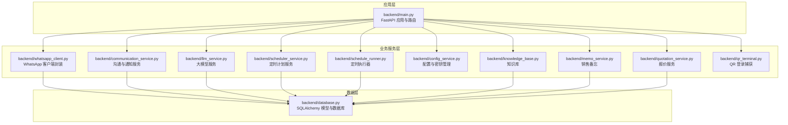
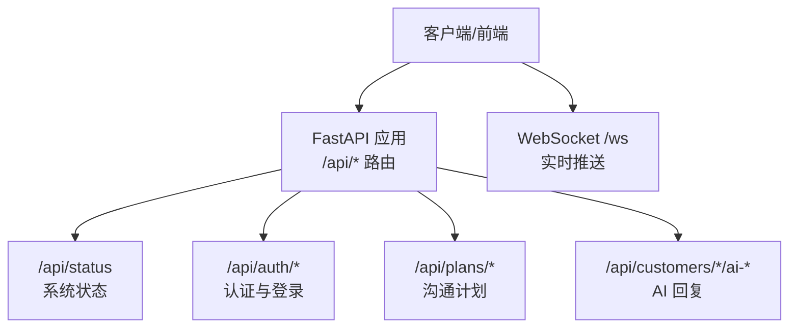
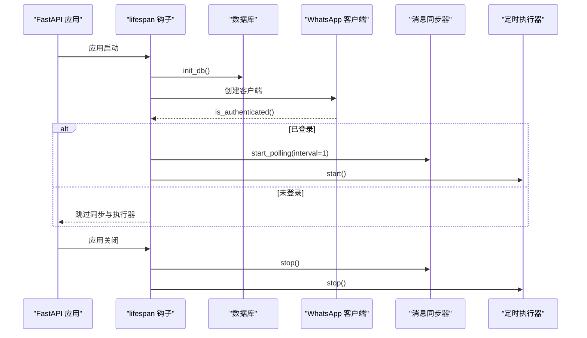
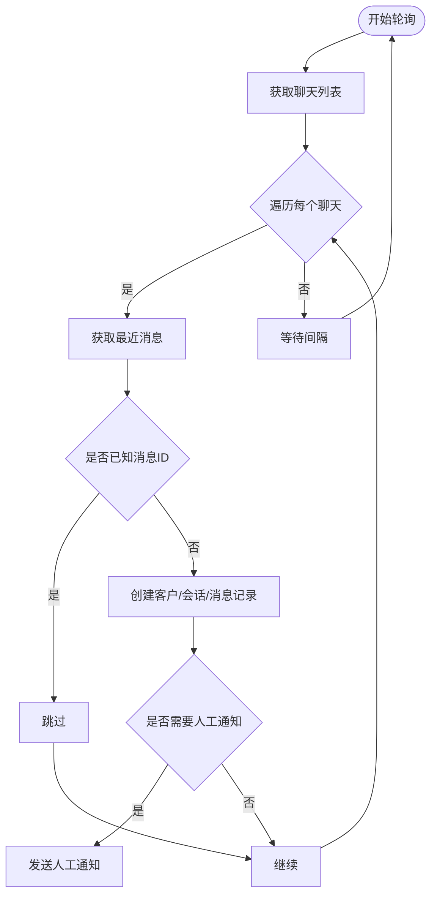
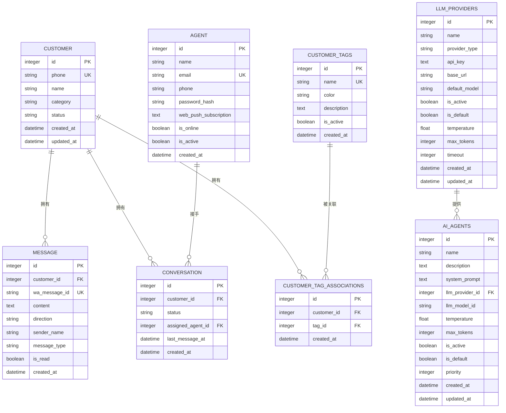
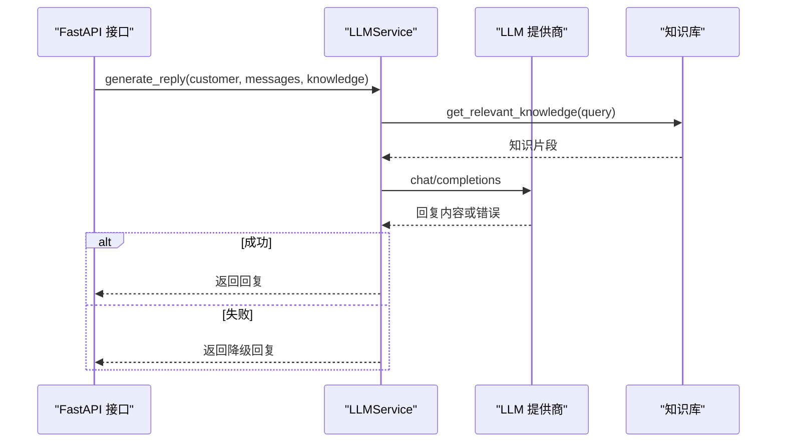
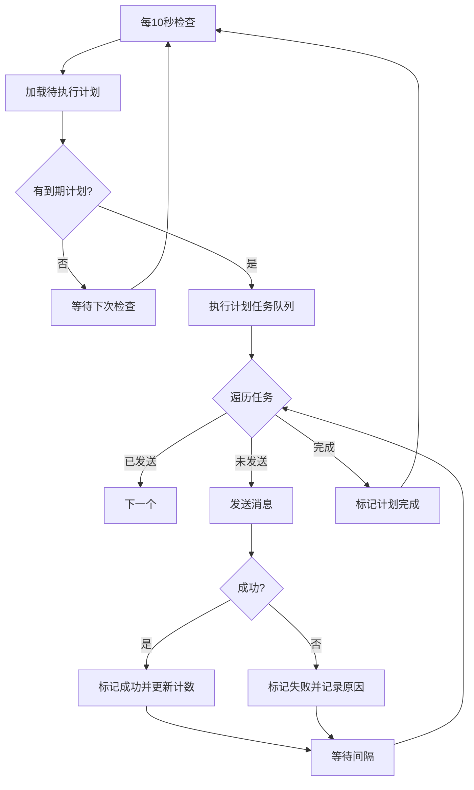
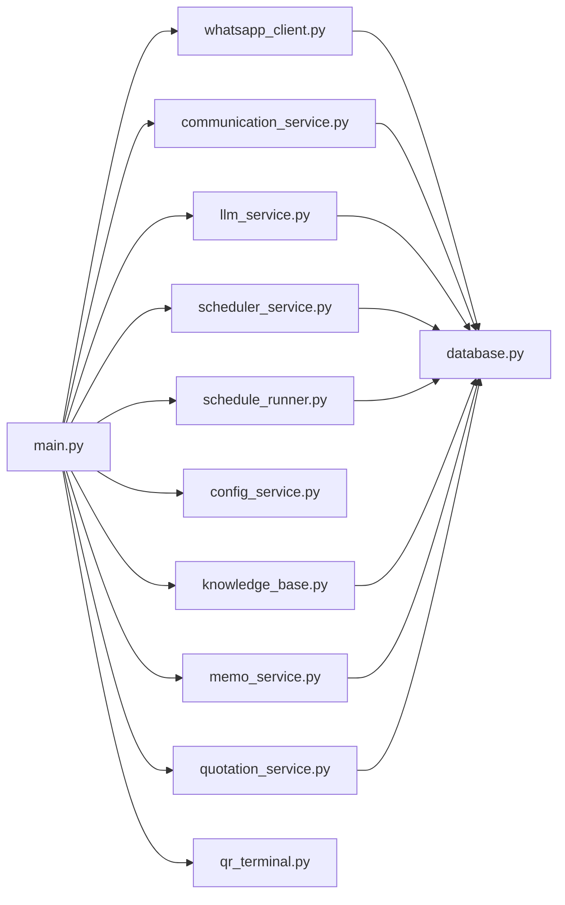

# 系统监控

<cite>
**本文引用的文件**
- [backend/main.py](file://backend/main.py)
- [backend/whatsapp_client.py](file://backend/whatsapp_client.py)
- [backend/database.py](file://backend/database.py)
- [backend/llm_service.py](file://backend/llm_service.py)
- [backend/scheduler_service.py](file://backend/scheduler_service.py)
- [backend/schedule_runner.py](file://backend/schedule_runner.py)
- [backend/communication_service.py](file://backend/communication_service.py)
- [backend/config_service.py](file://backend/config_service.py)
- [backend/qr_terminal.py](file://backend/qr_terminal.py)
- [backend/knowledge_base.py](file://backend/knowledge_base.py)
- [backend/memo_service.py](file://backend/memo_service.py)
- [backend/quotation_service.py](file://backend/quotation_service.py)
</cite>

## 目录
1. [简介](#简介)
2. [项目结构](#项目结构)
3. [核心组件](#核心组件)
4. [架构总览](#架构总览)
5. [详细组件分析](#详细组件分析)
6. [依赖关系分析](#依赖关系分析)
7. [性能考量](#性能考量)
8. [故障排除指南](#故障排除指南)
9. [结论](#结论)
10. [附录](#附录)

## 简介
本指南面向系统运维与开发人员，围绕 WhatsApp 智能客户系统提供一套可落地的系统监控与故障排除方案。重点覆盖以下方面：
- 系统健康检查与关键指标监控：WhatsApp 连接状态、数据库连接状态、WebSocket 客户端数量等
- 服务状态监控：lifespan 生命周期钩子、应用生命周期管理、异常处理
- 依赖服务检查：大语言模型 API 可用性、数据库连接、文件系统权限
- 资源使用分析：内存、磁盘、网络带宽等
- 告警与通知：配置与处理流程

## 项目结构
系统采用 FastAPI 应用 + 多个业务服务模块的分层设计，核心入口位于主应用文件，业务能力通过服务模块解耦，便于独立监控与排障。

图表来源
- [backend/main.py](file://backend/main.py)
- [backend/whatsapp_client.py](file://backend/whatsapp_client.py)
- [backend/communication_service.py](file://backend/communication_service.py)
- [backend/llm_service.py](file://backend/llm_service.py)
- [backend/scheduler_service.py](file://backend/scheduler_service.py)
- [backend/schedule_runner.py](file://backend/schedule_runner.py)
- [backend/config_service.py](file://backend/config_service.py)
- [backend/knowledge_base.py](file://backend/knowledge_base.py)
- [backend/memo_service.py](file://backend/memo_service.py)
- [backend/quotation_service.py](file://backend/quotation_service.py)
- [backend/qr_terminal.py](file://backend/qr_terminal.py)
- [backend/database.py](file://backend/database.py)

章节来源
- [backend/main.py](file://backend/main.py)
- [backend/database.py](file://backend/database.py)

## 核心组件
- 应用生命周期与健康检查
  - FastAPI lifespan 钩子负责应用启动/关闭阶段的初始化与清理，包括数据库初始化、WhatsApp 客户端初始化、消息同步器启动、定时执行器启动等。
  - 系统状态接口提供 WhatsApp 连接状态、消息同步器运行状态、WebSocket 客户端数量等关键指标。
- WhatsApp 客户端与消息同步
  - 封装 whatsapp-cli 命令调用，提供认证状态查询、联系人/聊天/消息获取、消息发送、持续同步等功能；消息同步器负责轮询拉取并入库。
- 数据库与模型
  - SQLAlchemy 模型定义客户、消息、会话、智能体、标签、LLM 提供商等实体，统一初始化与会话管理。
- 大语言模型服务
  - 统一封装 LLM 调用，支持多提供商、多模型、温度与 token 控制，并具备降级回复能力。
- 定时计划与执行
  - 定时计划服务与执行器分离，分别负责计划与任务的持久化与后台执行，支持暂停/恢复/取消。
- 配置与密钥管理
  - SQLite 存储配置项，敏感信息使用对称加密，提供 LLM 配置读写。
- 其他业务服务
  - 知识库、销售备忘、报价服务等，均以 SQLite 本地存储为主，便于监控与备份。

章节来源
- [backend/main.py](file://backend/main.py)
- [backend/whatsapp_client.py](file://backend/whatsapp_client.py)
- [backend/database.py](file://backend/database.py)
- [backend/llm_service.py](file://backend/llm_service.py)
- [backend/scheduler_service.py](file://backend/scheduler_service.py)
- [backend/schedule_runner.py](file://backend/schedule_runner.py)
- [backend/config_service.py](file://backend/config_service.py)
- [backend/knowledge_base.py](file://backend/knowledge_base.py)
- [backend/memo_service.py](file://backend/memo_service.py)
- [backend/quotation_service.py](file://backend/quotation_service.py)

## 架构总览
系统采用“应用层 + 业务服务层 + 数据层”的三层架构。应用层负责路由与状态暴露；业务服务层封装各领域能力；数据层统一通过 SQLAlchemy 访问 SQLite。

图表来源
- [backend/main.py](file://backend/main.py)

## 详细组件分析

### 应用生命周期与健康检查
- 生命周期钩子
  - 启动阶段：初始化数据库、创建 WhatsApp 客户端、若已登录则启动消息同步器与定时执行器。
  - 关闭阶段：停止消息同步器与定时执行器，释放资源。
- 健康检查接口
  - /api/status：返回 WhatsApp 连接状态、消息同步器运行状态、WebSocket 客户端数量。
  - /api/auth/status：返回 WhatsApp 登录状态与数据库状态信息。
- 异常处理
  - 各 API 对内部异常进行捕获并返回结构化错误信息，避免服务崩溃。

图表来源
- [backend/main.py](file://backend/main.py)
- [backend/whatsapp_client.py](file://backend/whatsapp_client.py)
- [backend/schedule_runner.py](file://backend/schedule_runner.py)

章节来源
- [backend/main.py](file://backend/main.py)

### WhatsApp 客户端与消息同步
- 功能点
  - 认证状态查询、联系人/聊天/消息获取、消息发送（支持备用 JID 切换）、持续同步（实时模式）。
  - 消息同步器：轮询所有聊天，去重、入库、触发自动回复与人工通知。
- 监控要点
  - 认证状态与命令超时/失败处理
  - 消息同步轮询间隔与异常重试
  - 发送消息的 JID 格式与备用策略

图表来源
- [backend/whatsapp_client.py](file://backend/whatsapp_client.py)
- [backend/communication_service.py](file://backend/communication_service.py)

章节来源
- [backend/whatsapp_client.py](file://backend/whatsapp_client.py)
- [backend/communication_service.py](file://backend/communication_service.py)

### 数据库与模型
- 数据库配置
  - SQLite 路径通过环境变量或默认路径确定，支持跨平台部署。
  - 初始化时创建所有表，确保首次运行可用。
- 监控要点
  - 连接池与会话生命周期管理
  - 文件系统权限与数据库文件可写性
  - 大事务与锁竞争风险

图表来源
- [backend/database.py](file://backend/database.py)

章节来源
- [backend/database.py](file://backend/database.py)

### 大语言模型服务
- 功能点
  - 支持多提供商/多模型，动态选择智能体与参数，具备降级回复能力。
  - 支持意图分析与知识库增强。
- 监控要点
  - API Key 与 Base URL 配置有效性
  - 超时与错误码处理
  - 降级回复触发统计

图表来源
- [backend/llm_service.py](file://backend/llm_service.py)
- [backend/knowledge_base.py](file://backend/knowledge_base.py)

章节来源
- [backend/llm_service.py](file://backend/llm_service.py)
- [backend/knowledge_base.py](file://backend/knowledge_base.py)

### 定时计划与执行器
- 功能点
  - 计划服务：创建/查询/更新计划与任务，支持暂停/恢复/取消。
  - 执行器：后台循环检查到期计划，逐个发送消息，支持间隔与状态统计。
- 监控要点
  - 计划状态流转（pending/running/completed/paused/cancelled）
  - 任务发送成功率与失败原因
  - 执行器运行状态与异常重试

图表来源
- [backend/scheduler_service.py](file://backend/scheduler_service.py)
- [backend/schedule_runner.py](file://backend/schedule_runner.py)

章节来源
- [backend/scheduler_service.py](file://backend/scheduler_service.py)
- [backend/schedule_runner.py](file://backend/schedule_runner.py)

### 配置与密钥管理
- 功能点
  - SQLite 存储配置项，敏感信息使用对称加密；提供 LLM 配置读写接口。
- 监控要点
  - 配置文件与密钥文件权限
  - 加密密钥生成与迁移
  - 配置项变更审计

章节来源
- [backend/config_service.py](file://backend/config_service.py)

### 其他业务服务
- 知识库：文档增删改查、关键词索引、相关文档检索。
- 销售备忘：客户沟通要点记录与检索。
- 报价服务：材料清单、报价单生成与格式化。

章节来源
- [backend/knowledge_base.py](file://backend/knowledge_base.py)
- [backend/memo_service.py](file://backend/memo_service.py)
- [backend/quotation_service.py](file://backend/quotation_service.py)

## 依赖关系分析
- 组件耦合
  - 主应用与业务服务通过依赖注入与全局服务函数解耦，便于测试与监控。
  - WhatsApp 客户端与数据库交互紧密，消息同步器承担高频 IO。
  - LLM 服务与知识库耦合，影响回复质量与延迟。
- 外部依赖
  - whatsapp-cli 命令行工具
  - httpx 异步 HTTP 客户端
  - SQLite 本地存储

图表来源
- [backend/main.py](file://backend/main.py)
- [backend/whatsapp_client.py](file://backend/whatsapp_client.py)
- [backend/communication_service.py](file://backend/communication_service.py)
- [backend/llm_service.py](file://backend/llm_service.py)
- [backend/scheduler_service.py](file://backend/scheduler_service.py)
- [backend/schedule_runner.py](file://backend/schedule_runner.py)
- [backend/config_service.py](file://backend/config_service.py)
- [backend/knowledge_base.py](file://backend/knowledge_base.py)
- [backend/memo_service.py](file://backend/memo_service.py)
- [backend/quotation_service.py](file://backend/quotation_service.py)
- [backend/qr_terminal.py](file://backend/qr_terminal.py)
- [backend/database.py](file://backend/database.py)

## 性能考量
- I/O 密集
  - WhatsApp CLI 调用与 SQLite 读写是主要瓶颈，建议：
    - 合理设置消息同步轮询间隔（当前为 1 秒，可根据负载调整）
    - 批量写入与事务合并，减少磁盘写放大
- 网络延迟
  - LLM API 调用存在网络抖动，建议：
    - 设置合理超时与重试
    - 降级回复兜底
- 内存与并发
  - WebSocket 客户端数量增长时注意内存占用，建议：
    - 心跳检测与断连清理
    - 限流与背压策略

[本节为通用指导，无需章节来源]

## 故障排除指南

### 1. 系统健康检查与关键指标
- WhatsApp 连接状态
  - 接口：/api/auth/status
  - 指标：connected/logged_in/database
  - 常见问题：未登录、认证失败、CLI 不可用
  - 排查步骤：
    - 确认 whatsapp-cli 已安装且在 PATH 中
    - 使用 /api/auth/qr 触发登录流程，观察 QR 码捕获与登录成功回调
    - 若已登录但状态异常，尝试 /api/auth/logout 清理后重新登录
- 数据库连接状态
  - 接口：/api/status
  - 指标：whatsapp_connected/sync_running/websocket_clients
  - 常见问题：SQLite 文件不可写、路径权限不足
  - 排查步骤：
    - 检查 DATABASE_URL 环境变量与数据目录权限
    - 确认 init_db() 能够创建表
- WebSocket 客户端数量
  - 接口：/api/status
  - 常见问题：客户端过多导致内存压力
  - 排查步骤：
    - 检查 /ws 心跳逻辑与断连清理
    - 限制最大连接数与心跳超时

章节来源
- [backend/main.py](file://backend/main.py)
- [backend/whatsapp_client.py](file://backend/whatsapp_client.py)
- [backend/database.py](file://backend/database.py)

### 2. 服务状态监控与生命周期
- 生命周期钩子
  - 启动：init_db()、WhatsApp 客户端初始化、消息同步器与定时执行器启动
  - 关闭：停止消息同步器与定时执行器
  - 常见问题：启动失败、关闭阻塞
  - 排查步骤：
    - 查看 lifespan 输出日志
    - 检查异常捕获与资源释放
- 异常处理
  - API 层捕获异常并返回结构化错误
  - 业务层对 WhatsApp CLI 调用设置超时与重试
  - LLM 调用失败时触发降级回复

章节来源
- [backend/main.py](file://backend/main.py)
- [backend/whatsapp_client.py](file://backend/whatsapp_client.py)
- [backend/llm_service.py](file://backend/llm_service.py)

### 3. 依赖服务检查
- 大语言模型 API 可用性
  - 检查点：API Key、Base URL、模型 ID、超时
  - 常见问题：鉴权失败、网络超时、模型不可用
  - 排查步骤：
    - 使用 /api/customers/{id}/ai-reply 与 /api/customers/{id}/messages/ai-send 验证
    - 查看 LLMService 的错误日志与降级回复触发
- 数据库连接检查
  - 检查点：SQLite 文件路径、权限、连接字符串
  - 常见问题：路径不存在、权限不足、并发写冲突
  - 排查步骤：
    - 确认 DATABASE_URL 有效
    - 检查数据目录是否存在且可写
- 文件系统权限检查
  - 检查点：数据目录、密钥文件、QR 码图片缓存
  - 常见问题：密钥文件权限不正确、磁盘空间不足
  - 排查步骤：
    - 确认 ./data 目录存在且可写
    - 确认 .config_key 文件权限为 0600

章节来源
- [backend/llm_service.py](file://backend/llm_service.py)
- [backend/config_service.py](file://backend/config_service.py)
- [backend/database.py](file://backend/database.py)

### 4. 资源使用情况分析
- 内存使用
  - 关注点：消息同步器的 known_message_ids 集合大小、WebSocket 客户端列表
  - 优化建议：定期清理断连客户端、限制消息缓存大小
- 磁盘空间
  - 关注点：SQLite 数据库文件大小、知识库与备忘数据库文件
  - 优化建议：定期归档旧数据、清理无用文档
- 网络带宽
  - 关注点：LLM API 调用频率与响应大小、WhatsApp CLI 命令输出
  - 优化建议：批量请求、压缩传输、合理设置超时

[本节为通用指导，无需章节来源]

### 5. 告警机制与故障通知
- 告警维度
  - 连接失败：WhatsApp 未登录、认证失败
  - 服务异常：消息同步器停止、定时执行器异常
  - 资源告警：内存/磁盘/网络阈值
- 通知渠道
  - 人工通知：当需要人工介入时，通过 WhatsApp 通知在线客服
  - 日志告警：结合应用日志与系统日志进行集中化收集与告警
- 处理流程
  - 发现异常 -> 记录日志 -> 触发告警 -> 执行修复 -> 验证恢复 -> 归档总结

章节来源
- [backend/communication_service.py](file://backend/communication_service.py)
- [backend/whatsapp_client.py](file://backend/whatsapp_client.py)
- [backend/schedule_runner.py](file://backend/schedule_runner.py)

## 结论
本系统通过 FastAPI 生命周期钩子、明确的健康检查接口与多模块解耦设计，提供了可监控、可排障的基础框架。建议在生产环境中：
- 增加统一的日志与指标采集
- 配置资源阈值告警
- 完善自动化巡检与自愈机制
- 对关键路径增加熔断与降级策略

[本节为总结，无需章节来源]

## 附录

### A. 常用接口与指标速查
- /api/auth/status：认证状态
- /api/status：系统状态（WhatsApp 连接、同步器运行、WebSocket 客户端数）
- /api/auth/qr：触发登录并捕获 QR 码
- /api/auth/logout：退出登录
- /api/customers/{id}/ai-reply：生成 AI 回复
- /api/customers/{id}/messages/ai-send：生成并发送 AI 回复
- /api/plans：获取沟通计划
- /api/plans/{plan_id}/execute/{customer_id}：手动执行计划

章节来源
- [backend/main.py](file://backend/main.py)