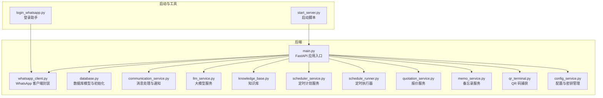
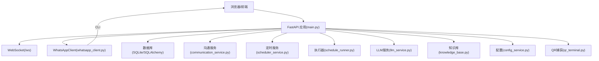
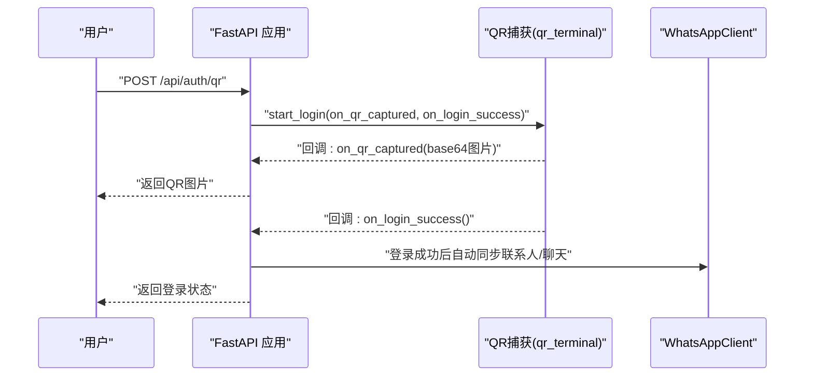
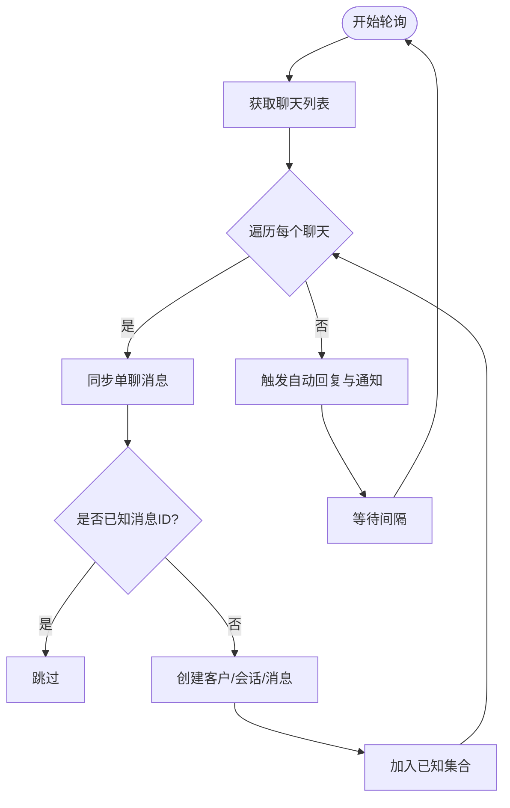
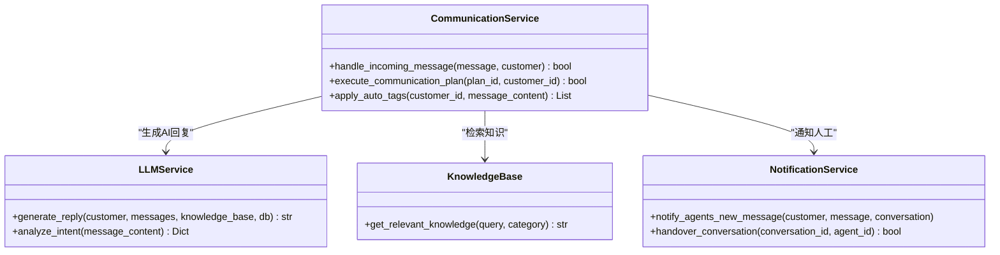
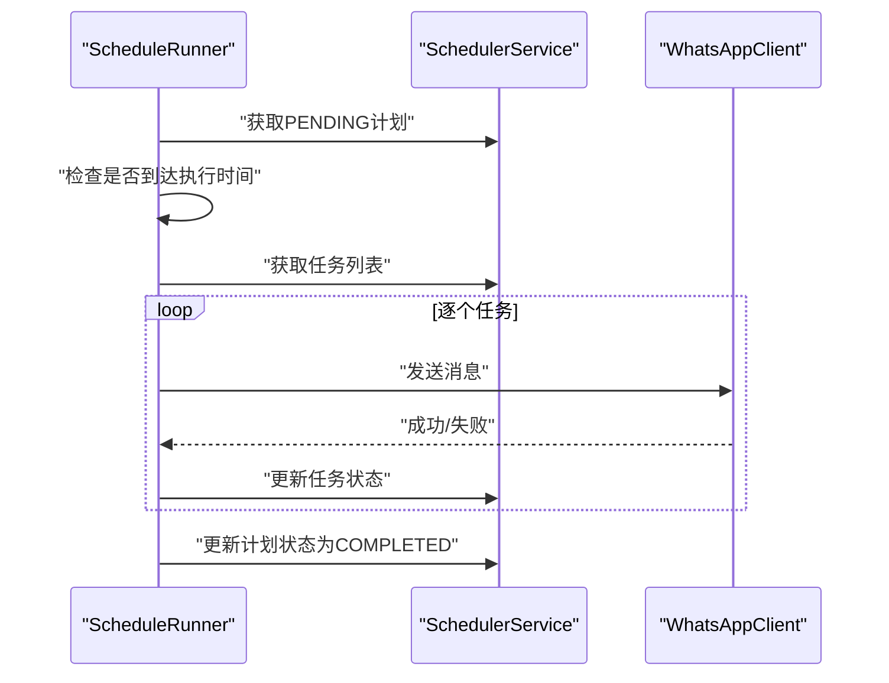
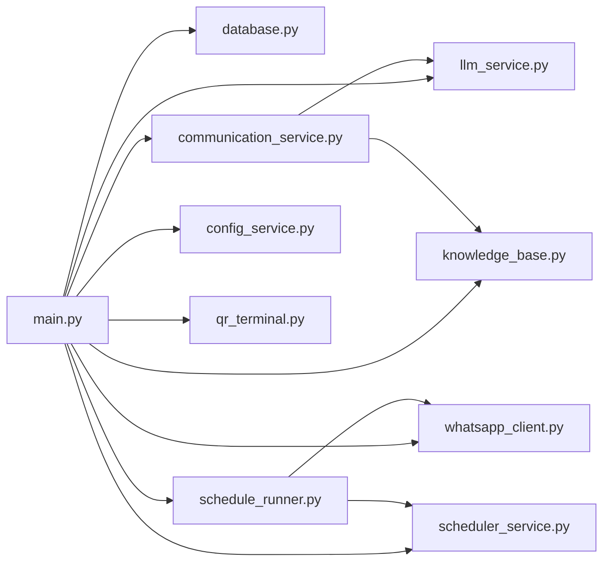

# 调试工具和技巧

<cite>
**本文引用的文件**
- [backend/main.py](file://backend/main.py)
- [backend/whatsapp_client.py](file://backend/whatsapp_client.py)
- [backend/database.py](file://backend/database.py)
- [backend/scheduler_service.py](file://backend/scheduler_service.py)
- [backend/schedule_runner.py](file://backend/schedule_runner.py)
- [backend/communication_service.py](file://backend/communication_service.py)
- [backend/llm_service.py](file://backend/llm_service.py)
- [backend/knowledge_base.py](file://backend/knowledge_base.py)
- [backend/quotation_service.py](file://backend/quotation_service.py)
- [backend/memo_service.py](file://backend/memo_service.py)
- [backend/qr_terminal.py](file://backend/qr_terminal.py)
- [backend/config_service.py](file://backend/config_service.py)
- [start_server.py](file://start_server.py)
- [login_whatsapp.py](file://login_whatsapp.py)
</cite>

## 目录
1. [简介](#简介)
2. [项目结构](#项目结构)
3. [核心组件](#核心组件)
4. [架构总览](#架构总览)
5. [详细组件分析](#详细组件分析)
6. [依赖分析](#依赖分析)
7. [性能考虑](#性能考虑)
8. [故障排除指南](#故障排除指南)
9. [结论](#结论)
10. [附录](#附录)

## 简介
本指南聚焦于该WhatsApp机器人项目的调试与排障实践，围绕日志分析、网络与代理问题排查、数据库性能诊断、异步任务调试以及IDE调试配置五个维度，结合代码实现给出可操作的方法与最佳实践。目标是帮助开发者快速定位问题、验证修复并提升系统稳定性。

## 项目结构
该项目采用后端Python/FastAPI + 前端静态页面的分层组织，核心业务集中在backend目录，包含API入口、WhatsApp客户端封装、数据库模型、消息同步、定时任务、LLM集成、知识库、配置管理等模块；顶层提供启动脚本与登录助手脚本。

图表来源
- [backend/main.py:128-157](file://backend/main.py#L128-L157)
- [backend/whatsapp_client.py:13-21](file://backend/whatsapp_client.py#L13-L21)
- [backend/database.py:254-256](file://backend/database.py#L254-L256)
- [backend/communication_service.py:17-46](file://backend/communication_service.py#L17-L46)
- [backend/llm_service.py:11-16](file://backend/llm_service.py#L11-L16)
- [backend/knowledge_base.py:11-17](file://backend/knowledge_base.py#L11-L17)
- [backend/scheduler_service.py:54-62](file://backend/scheduler_service.py#L54-L62)
- [backend/schedule_runner.py:12-26](file://backend/schedule_runner.py#L12-L26)
- [backend/quotation_service.py:10-17](file://backend/quotation_service.py#L10-L17)
- [backend/memo_service.py:9-16](file://backend/memo_service.py#L9-L16)
- [backend/qr_terminal.py:14-23](file://backend/qr_terminal.py#L14-L23)
- [backend/config_service.py:11-22](file://backend/config_service.py#L11-L22)
- [start_server.py:92-127](file://start_server.py#L92-L127)
- [login_whatsapp.py:51-108](file://login_whatsapp.py#L51-L108)

章节来源
- [backend/main.py:128-157](file://backend/main.py#L128-L157)
- [start_server.py:92-127](file://start_server.py#L92-L127)

## 核心组件
- FastAPI应用与生命周期：负责应用启动、数据库初始化、WhatsApp客户端与消息同步器的启动、定时执行器启动、WebSocket实时通信、认证与登录接口等。
- WhatsApp客户端封装：封装对whatsapp-cli的调用，提供认证状态检查、联系人/聊天/消息获取、发送消息、持续同步等功能。
- 数据库与模型：SQLite/SQLAlchemy模型定义、初始化、会话管理。
- 沟通服务：自动回复、转人工、会话状态管理、通知服务。
- 定时服务与执行器：计划创建、任务准备、执行与状态更新。
- LLM服务：统一接入不同提供商的模型，支持智能体选择、系统提示词、意图分析等。
- 知识库：文档入库、关键词索引、相关性检索。
- 配置服务：敏感配置加密存储与读取。
- QR码捕获：终端ASCII QR码渲染与转换为图片。
- 启动与登录：自动化检查CLI、登录状态、依赖安装与服务器启动。

章节来源
- [backend/main.py:88-126](file://backend/main.py#L88-L126)
- [backend/whatsapp_client.py:13-21](file://backend/whatsapp_client.py#L13-L21)
- [backend/database.py:254-256](file://backend/database.py#L254-L256)
- [backend/communication_service.py:17-46](file://backend/communication_service.py#L17-L46)
- [backend/scheduler_service.py:54-62](file://backend/scheduler_service.py#L54-L62)
- [backend/schedule_runner.py:12-26](file://backend/schedule_runner.py#L12-L26)
- [backend/llm_service.py:11-16](file://backend/llm_service.py#L11-L16)
- [backend/knowledge_base.py:11-17](file://backend/knowledge_base.py#L11-L17)
- [backend/config_service.py:11-22](file://backend/config_service.py#L11-L22)
- [backend/qr_terminal.py:14-23](file://backend/qr_terminal.py#L14-L23)

## 架构总览
系统采用“API网关(FastAPI)”作为统一入口，内部协调多个子服务：WhatsApp客户端、数据库、LLM、知识库、定时任务、通知与配置。WebSocket用于实时消息推送，QR码捕获用于登录流程。

图表来源
- [backend/main.py:160-194](file://backend/main.py#L160-L194)
- [backend/whatsapp_client.py:13-21](file://backend/whatsapp_client.py#L13-L21)
- [backend/communication_service.py:17-46](file://backend/communication_service.py#L17-L46)
- [backend/scheduler_service.py:54-62](file://backend/scheduler_service.py#L54-L62)
- [backend/schedule_runner.py:12-26](file://backend/schedule_runner.py#L12-L26)
- [backend/llm_service.py:11-16](file://backend/llm_service.py#L11-L16)
- [backend/knowledge_base.py:11-17](file://backend/knowledge_base.py#L11-L17)
- [backend/config_service.py:11-22](file://backend/config_service.py#L11-L22)
- [backend/qr_terminal.py:14-23](file://backend/qr_terminal.py#L14-L23)

## 详细组件分析

### FastAPI 应用与生命周期
- 生命周期钩子负责数据库初始化、WhatsApp客户端与消息同步器启动、定时执行器启动；关闭时清理资源。
- WebSocket用于实时推送新消息，维护活动连接列表并广播消息。
- 认证相关接口：获取登录状态、启动QR登录、取消登录、登录后同步联系人与聊天。

图表来源
- [backend/main.py:221-360](file://backend/main.py#L221-L360)
- [backend/qr_terminal.py:24-79](file://backend/qr_terminal.py#L24-L79)
- [backend/whatsapp_client.py:105-127](file://backend/whatsapp_client.py#L105-L127)

章节来源
- [backend/main.py:88-126](file://backend/main.py#L88-L126)
- [backend/main.py:160-194](file://backend/main.py#L160-L194)
- [backend/main.py:221-360](file://backend/main.py#L221-L360)
- [backend/qr_terminal.py:81-144](file://backend/qr_terminal.py#L81-L144)

### WhatsApp 客户端与消息同步
- 封装CLI命令执行，提供认证状态、联系人、聊天、消息、发送、JID解析、持续同步等能力。
- MessageSyncer负责轮询同步所有聊天消息，去重、创建客户/会话、记录消息、触发自动回复与通知。

图表来源
- [backend/whatsapp_client.py:366-398](file://backend/whatsapp_client.py#L366-L398)
- [backend/whatsapp_client.py:286-364](file://backend/whatsapp_client.py#L286-L364)

章节来源
- [backend/whatsapp_client.py:27-81](file://backend/whatsapp_client.py#L27-L81)
- [backend/whatsapp_client.py:174-210](file://backend/whatsapp_client.py#L174-L210)
- [backend/whatsapp_client.py:366-437](file://backend/whatsapp_client.py#L366-L437)

### 沟通服务与通知
- 根据客户分类与会话状态决定是否转人工、是否自动回复。
- 自动回复通过LLM生成，支持知识库增强与意图分析。
- 通知服务向在线客服发送新消息提醒。

图表来源
- [backend/communication_service.py:17-46](file://backend/communication_service.py#L17-L46)
- [backend/communication_service.py:428-512](file://backend/communication_service.py#L428-L512)
- [backend/llm_service.py:177-198](file://backend/llm_service.py#L177-L198)
- [backend/knowledge_base.py:130-141](file://backend/knowledge_base.py#L130-L141)

章节来源
- [backend/communication_service.py:47-71](file://backend/communication_service.py#L47-L71)
- [backend/communication_service.py:172-230](file://backend/communication_service.py#L172-L230)
- [backend/communication_service.py:292-361](file://backend/communication_service.py#L292-L361)
- [backend/communication_service.py:428-512](file://backend/communication_service.py#L428-L512)

### 定时服务与执行器
- 定时服务：计划创建、任务准备、状态与计数更新、暂停/恢复/删除。
- 执行器：周期检查到期计划、并发执行、按间隔发送、更新任务与计划状态。

图表来源
- [backend/schedule_runner.py:35-124](file://backend/schedule_runner.py#L35-L124)
- [backend/scheduler_service.py:108-138](file://backend/scheduler_service.py#L108-L138)
- [backend/scheduler_service.py:243-287](file://backend/scheduler_service.py#L243-L287)

章节来源
- [backend/scheduler_service.py:54-62](file://backend/scheduler_service.py#L54-L62)
- [backend/scheduler_service.py:140-180](file://backend/scheduler_service.py#L140-L180)
- [backend/schedule_runner.py:12-26](file://backend/schedule_runner.py#L12-L26)
- [backend/schedule_runner.py:60-110](file://backend/schedule_runner.py#L60-L110)

### LLM服务与知识库
- LLM服务：统一配置加载、智能体选择、系统提示词构建、模型调用、意图分析。
- 知识库：文档入库、关键词索引、相关文档检索。

章节来源
- [backend/llm_service.py:11-16](file://backend/llm_service.py#L11-L16)
- [backend/llm_service.py:52-84](file://backend/llm_service.py#L52-L84)
- [backend/llm_service.py:177-198](file://backend/llm_service.py#L177-L198)
- [backend/knowledge_base.py:51-86](file://backend/knowledge_base.py#L51-L86)
- [backend/knowledge_base.py:87-128](file://backend/knowledge_base.py#L87-L128)

### 配置与QR码捕获
- 配置服务：加密存储敏感配置，提供LLM配置读取与设置。
- QR码捕获：启动登录进程、捕获终端ASCII QR码、转换为图片并回调。

章节来源
- [backend/config_service.py:11-22](file://backend/config_service.py#L11-L22)
- [backend/config_service.py:128-140](file://backend/config_service.py#L128-L140)
- [backend/qr_terminal.py:24-79](file://backend/qr_terminal.py#L24-L79)
- [backend/qr_terminal.py:145-240](file://backend/qr_terminal.py#L145-L240)

## 依赖分析
- 模块内聚与耦合：FastAPI应用集中协调各子服务；WhatsApp客户端与消息同步器耦合紧密；沟通服务依赖LLM与知识库；定时执行器依赖定时服务与WhatsApp客户端。
- 外部依赖：whatsapp-cli、SQLite、HTTPX（LLM调用）、Pillow（QR码渲染）。
- 潜在循环依赖：当前结构未见循环导入；注意在新增模块时避免双向依赖。

图表来源
- [backend/main.py:17-26](file://backend/main.py#L17-L26)
- [backend/communication_service.py:8-14](file://backend/communication_service.py#L8-L14)
- [backend/schedule_runner.py:7-9](file://backend/schedule_runner.py#L7-L9)

章节来源
- [backend/main.py:17-26](file://backend/main.py#L17-L26)
- [backend/communication_service.py:8-14](file://backend/communication_service.py#L8-L14)
- [backend/schedule_runner.py:7-9](file://backend/schedule_runner.py#L7-L9)

## 性能考虑
- 日志与调试输出：大量print用于调试，建议在生产环境降低日志频率或引入结构化日志框架。
- I/O密集与并发：WhatsApp CLI调用、HTTP API调用、SQLite写入均属I/O密集；使用异步与事件循环可提升吞吐。
- 数据库写入：消息同步与定时发送涉及批量写入，建议在高峰期减少高频打印，必要时合并提交。
- LLM调用：网络延迟为主要瓶颈，建议增加超时与重试、缓存热点知识、合理设置温度与最大token。

[本节为通用指导，无需列出章节来源]

## 故障排除指南

### 一、日志分析方法
- 日志级别与输出位置
  - 应用启动/关闭：生命周期钩子打印启动与关闭信息，便于确认服务启停。
  - 认证与登录：QR码捕获过程输出CLI行、QR码行数与图片生成结果。
  - 消息同步：轮询同步过程中输出新消息数量、错误与异常处理。
  - 定时执行：计划状态变更、任务发送结果、失败原因。
  - LLM与知识库：模型调用、意图分析、知识检索命中情况。
- 关键日志信息识别
  - 登录状态：认证成功/失败、连接状态、用户信息。
  - 消息同步：聊天数量、消息数量、重复消息过滤、JID解析与发送重试。
  - 定时任务：计划创建/准备/执行/完成、任务状态与错误信息。
  - LLM调用：提供商名称、模型ID、HTTP状态码、异常堆栈。
- 错误堆栈跟踪
  - Python异常：使用异常捕获与traceback打印，定位具体函数与行号。
  - CLI错误：whatsapp-cli返回码与stderr输出，结合超时与格式化参数。
  - HTTP调用：LLM服务的HTTPX客户端异常与状态码。

章节来源
- [backend/main.py:94-125](file://backend/main.py#L94-L125)
- [backend/qr_terminal.py:96-143](file://backend/qr_terminal.py#L96-L143)
- [backend/whatsapp_client.py:42-57](file://backend/whatsapp_client.py#L42-L57)
- [backend/whatsapp_client.py:395-397](file://backend/whatsapp_client.py#L395-L397)
- [backend/schedule_runner.py:41-43](file://backend/schedule_runner.py#L41-L43)
- [backend/llm_service.py:169-175](file://backend/llm_service.py#L169-L175)

### 二、网络与代理问题排查
- 网络连接测试
  - CLI可用性：启动脚本与登录助手检查whatsapp-cli是否存在与版本。
  - LLM连通性：LLM服务发起HTTP请求，关注超时、状态码与错误信息。
- 代理配置检查
  - 环境变量：确保HTTP/HTTPS代理设置正确（如系统级或容器内）。
  - 网络策略：防火墙/安全组放行whatsapp-cli与LLM服务端口。
- 防火墙规则验证
  - 本地端口：确认监听地址与端口（默认8000）未被占用。
  - 外部访问：若部署在云服务器，开放相应入站规则。

章节来源
- [start_server.py:16-33](file://start_server.py#L16-L33)
- [login_whatsapp.py:16-32](file://login_whatsapp.py#L16-L32)
- [backend/llm_service.py:150-164](file://backend/llm_service.py#L150-L164)

### 三、数据库性能诊断
- 慢查询分析
  - 消息同步：轮询间隔与批量处理，避免过于频繁的数据库访问。
  - 定时任务：任务准备与执行阶段的SQL查询，关注索引与事务。
- 索引优化建议
  - SQLite：为常用查询字段建立索引（如customers.phone、messages.customer_id、conversations.status等）。
  - 查询执行计划：使用EXPLAIN QUERY PLAN（SQLite）分析执行路径，减少全表扫描。
- 数据库健康检查
  - 连接池与会话：确保SessionLocal正确创建与关闭，避免连接泄漏。
  - 数据库初始化：首次启动时创建表结构，确认无重复创建。

章节来源
- [backend/database.py:254-256](file://backend/database.py#L254-L256)
- [backend/whatsapp_client.py:366-398](file://backend/whatsapp_client.py#L366-L398)
- [backend/scheduler_service.py:243-287](file://backend/scheduler_service.py#L243-L287)

### 四、异步任务调试
- 任务队列监控
  - 定时执行器：周期检查计划状态、任务状态与计数更新。
  - 任务重试：失败任务记录错误信息，后续可重试或人工干预。
- 协程状态检查
  - 事件循环：在同步上下文中调用异步LLM时，注意事件循环状态与创建任务。
  - 超时与取消：CLI命令与HTTP请求设置超时，异常时及时终止进程。
- 死锁检测
  - 数据库事务：避免长事务与跨模块共享会话；使用独立会话处理I/O密集任务。
  - 并发控制：消息同步与定时发送避免同时写入同一客户数据。

章节来源
- [backend/schedule_runner.py:35-124](file://backend/schedule_runner.py#L35-L124)
- [backend/communication_service.py:186-204](file://backend/communication_service.py#L186-L204)
- [backend/whatsapp_client.py:27-58](file://backend/whatsapp_client.py#L27-L58)

### 五、IDE调试配置与断点设置
- FastAPI应用调试
  - 启动方式：使用uvicorn运行main:app，开启reload便于热更新。
  - 断点设置：在API路由、生命周期钩子、WebSocket处理、QR登录流程等关键路径设置断点。
  - 调试输出：利用现有print输出定位问题，必要时替换为logging。
- WhatsApp客户端调试
  - CLI调用：在命令执行处设置断点，检查返回码、stdout/stderr与JSON解析。
  - JID解析与发送重试：在JID格式切换与发送异常分支设置断点。
- 登录助手与启动脚本
  - 登录助手：在登录流程、状态检查、退出登录等路径设置断点。
  - 启动脚本：在依赖检查、环境设置、服务器启动等步骤设置断点。

章节来源
- [start_server.py:118-124](file://start_server.py#L118-L124)
- [backend/whatsapp_client.py:133-154](file://backend/whatsapp_client.py#L133-L154)
- [backend/qr_terminal.py:50-79](file://backend/qr_terminal.py#L50-L79)
- [login_whatsapp.py:78-108](file://login_whatsapp.py#L78-L108)

## 结论
本指南提供了从日志分析、网络与代理排查、数据库性能诊断到异步任务调试与IDE配置的完整实践路径。结合代码中的生命周期钩子、QR码捕获、消息同步、定时执行与LLM调用等关键路径，开发者可快速定位问题并实施修复。建议在生产环境中引入结构化日志、连接池优化与超时重试机制，持续提升系统稳定性与可观测性。

[本节为总结性内容，无需列出章节来源]

## 附录
- 快速检查清单
  - CLI安装与版本：whatsapp-cli存在且可执行。
  - 登录状态：认证连接正常，用户信息可获取。
  - 数据库：表结构已创建，连接正常。
  - WebSocket：连接建立、心跳与消息广播正常。
  - LLM服务：提供商配置有效，HTTP调用成功。
  - 定时任务：计划创建、任务准备、执行与状态更新正常。
  - QR登录：进程启动、QR码捕获、图片生成与登录成功回调正常。

[本节为通用指导，无需列出章节来源]