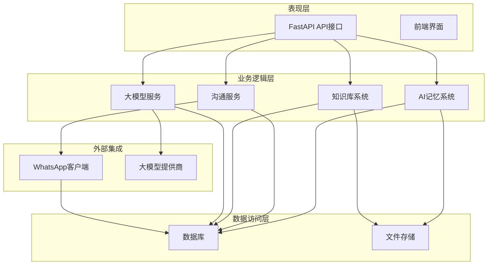
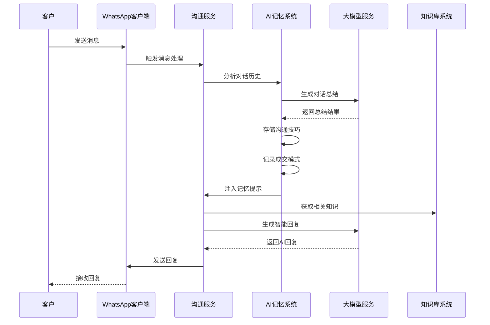
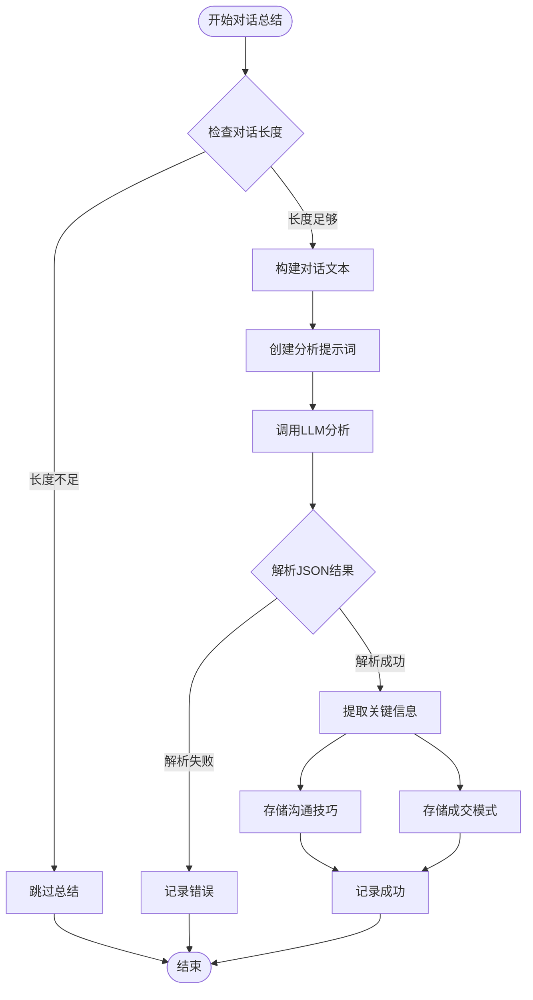
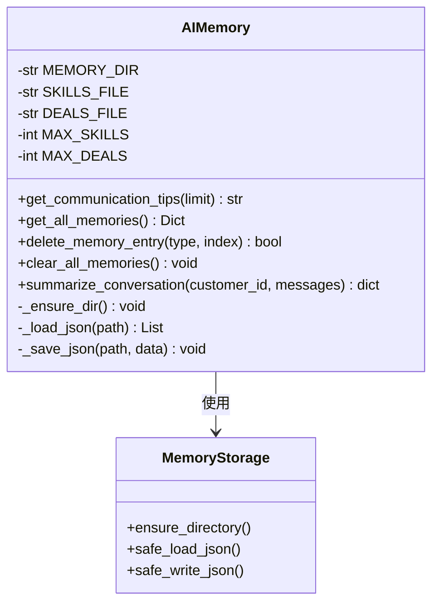
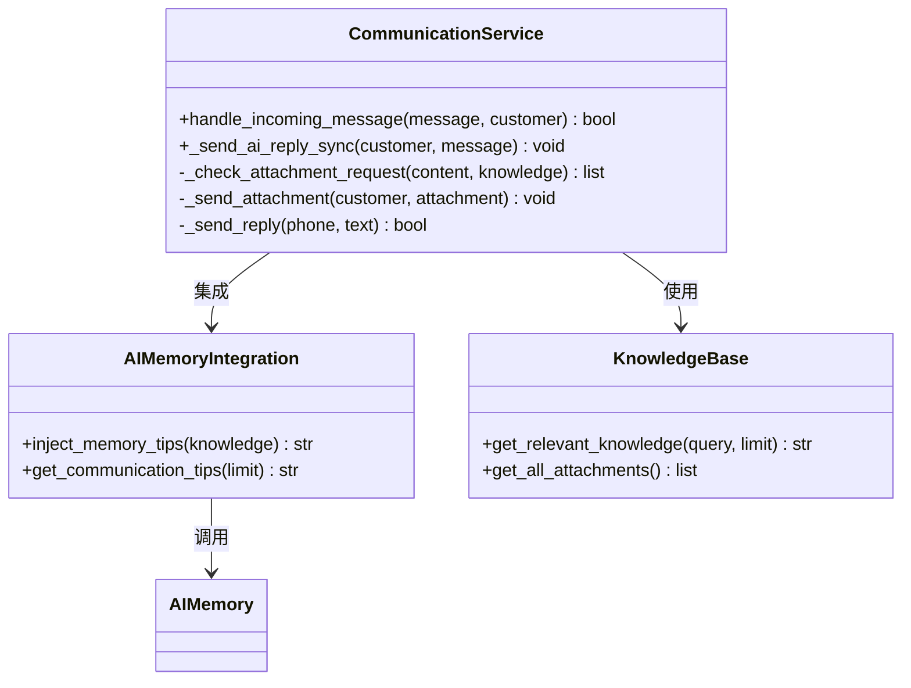
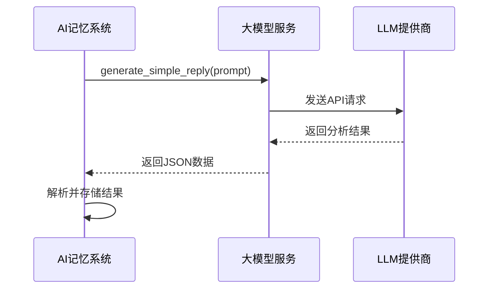
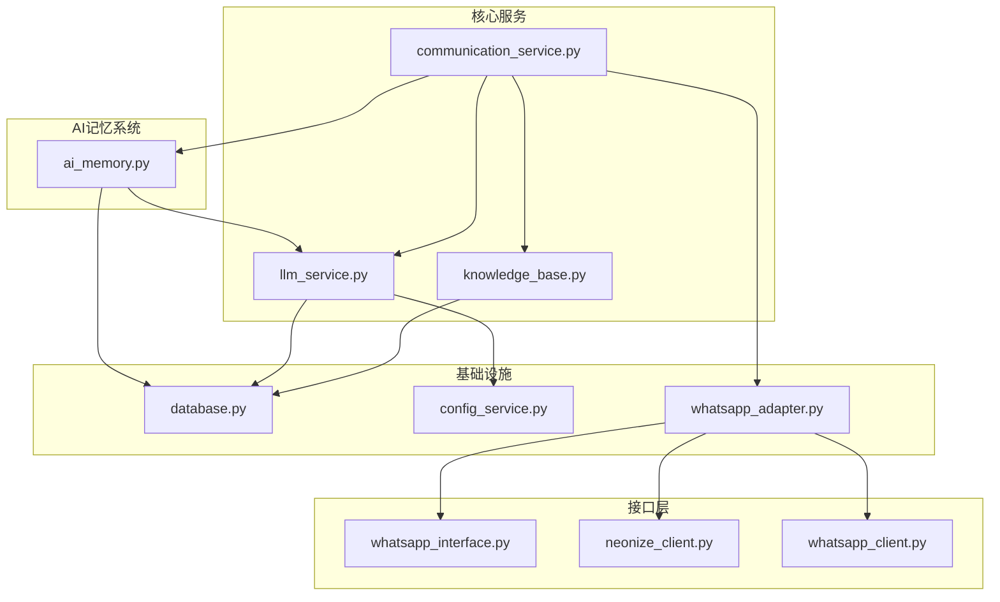
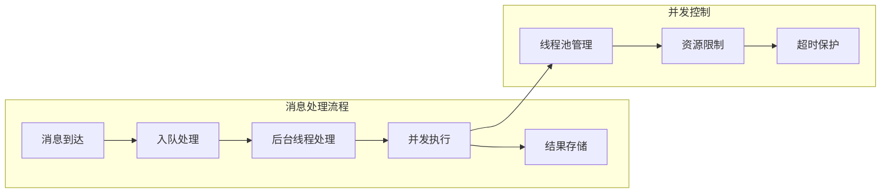
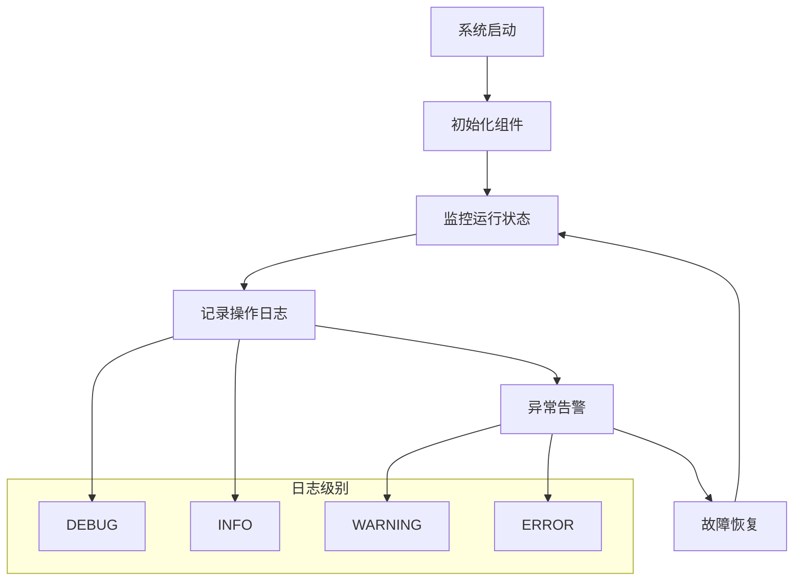

# AI记忆系统

<cite>
**本文档引用的文件**
- [ai_memory.py](file://backend/ai_memory.py)
- [llm_service.py](file://backend/llm_service.py)
- [communication_service.py](file://backend/communication_service.py)
- [knowledge_base.py](file://backend/knowledge_base.py)
- [database.py](file://backend/database.py)
- [config_service.py](file://backend/config_service.py)
- [whatsapp_adapter.py](file://backend/whatsapp_adapter.py)
- [whatsapp_interface.py](file://backend/whatsapp_interface.py)
- [neonize_client.py](file://backend/neonize_client.py)
- [whatsapp_client.py](file://backend/whatsapp_client.py)
- [MESSAGING_RULES.md](file://backend/MESSAGING_RULES.md)
- [CHANGES.md](file://CHANGES.md)
</cite>

## 目录
1. [简介](#简介)
2. [项目结构](#项目结构)
3. [核心组件](#核心组件)
4. [架构概览](#架构概览)
5. [详细组件分析](#详细组件分析)
6. [依赖关系分析](#依赖关系分析)
7. [性能考量](#性能考量)
8. [故障排除指南](#故障排除指南)
9. [结论](#结论)

## 简介

AI记忆系统是WhatsApp智能客户关系管理系统的核心组成部分，负责收集、存储和应用对话经验，以提升AI回复的质量和销售转化率。该系统通过分析客户对话，提取有效的沟通技巧和成交模式，形成可复用的记忆知识库。

系统采用模块化设计，集成了对话总结、记忆存储、知识检索和智能回复等多个功能模块，为整个WhatsApp CRM提供了智能化的对话管理能力。

## 项目结构

该项目采用分层架构设计，主要分为以下几个层次：



**图表来源**
- [main.py:198-241](file://backend/main.py#L198-L241)
- [ai_memory.py:1-25](file://backend/ai_memory.py#L1-L25)
- [communication_service.py:36-86](file://backend/communication_service.py#L36-L86)

**章节来源**
- [main.py:198-241](file://backend/main.py#L198-L241)
- [ai_memory.py:1-25](file://backend/ai_memory.py#L1-L25)

## 核心组件

### AI记忆系统核心功能

AI记忆系统包含以下核心功能模块：

1. **对话总结分析** - 使用LLM分析对话内容，提取沟通技巧和成交模式
2. **记忆存储管理** - 持久化存储沟通经验和成交模式
3. **智能提示注入** - 在AI回复时动态注入历史经验
4. **模式学习** - 从成功和失败的对话中学习最佳实践

### 数据存储结构

系统使用JSON文件存储记忆数据，采用以下目录结构：

```
backend/data/ai_memory/
├── communication_skills.json    # 沟通技巧沉淀
└── deal_patterns.json          # 成交模式记录
```

**章节来源**
- [ai_memory.py:5-25](file://backend/ai_memory.py#L5-L25)

## 架构概览

AI记忆系统采用事件驱动的架构模式，通过监听WhatsApp消息事件来触发记忆分析和存储过程：



**图表来源**
- [communication_service.py:272-467](file://backend/communication_service.py#L272-L467)
- [ai_memory.py:103-182](file://backend/ai_memory.py#L103-L182)
- [llm_service.py:165-323](file://backend/llm_service.py#L165-L323)

## 详细组件分析

### AI记忆系统组件

#### 对话总结模块

对话总结模块负责分析客户对话，提取有价值的信息：



**图表来源**
- [ai_memory.py:103-182](file://backend/ai_memory.py#L103-L182)

#### 记忆存储管理

记忆存储模块负责管理JSON文件的读写操作：



**图表来源**
- [ai_memory.py:27-51](file://backend/ai_memory.py#L27-L51)

**章节来源**
- [ai_memory.py:27-182](file://backend/ai_memory.py#L27-L182)

### 沟通服务集成

沟通服务与AI记忆系统的集成点：



**图表来源**
- [communication_service.py:36-86](file://backend/communication_service.py#L36-L86)
- [ai_memory.py:55-83](file://backend/ai_memory.py#L55-L83)

**章节来源**
- [communication_service.py:36-86](file://backend/communication_service.py#L36-L86)

### 大模型服务集成

AI记忆系统与大模型服务的交互：



**图表来源**
- [llm_service.py:325-353](file://backend/llm_service.py#L325-L353)
- [ai_memory.py:134-149](file://backend/ai_memory.py#L134-L149)

**章节来源**
- [llm_service.py:325-353](file://backend/llm_service.py#L325-L353)

## 依赖关系分析

### 组件耦合度分析



**图表来源**
- [ai_memory.py:134-149](file://backend/ai_memory.py#L134-L149)
- [communication_service.py:26-27](file://backend/communication_service.py#L26-L27)
- [llm_service.py:10-11](file://backend/llm_service.py#L10-L11)

### 外部依赖分析

系统的主要外部依赖包括：

1. **大模型提供商** - OpenAI、Claude等API服务
2. **WhatsApp客户端** - Neonize或CLI后端
3. **数据库系统** - SQLite数据库
4. **文件系统** - JSON文件存储

**章节来源**
- [CHANGES.md:13-147](file://CHANGES.md#L13-L147)

## 性能考量

### 内存管理优化

AI记忆系统采用了多项内存管理优化措施：

1. **消息ID去重缓存** - 使用OrderedDict实现LRU缓存，支持TTL过期
2. **队列容量控制** - 限制消息队列大小为5000，防止内存泄漏
3. **文件I/O优化** - 使用缓冲写入，减少磁盘I/O操作

### 并发处理机制

系统采用异步并发处理模式：



**图表来源**
- [neonize_client.py:198-200](file://backend/neonize_client.py#L198-L200)

### 存储性能优化

1. **文件大小限制** - 沟通技巧最多保存50条，成交模式最多保存30条
2. **增量更新** - 只保存最新的记忆条目，自动清理旧数据
3. **批量写入** - 使用缓冲机制减少文件写入频率

## 故障排除指南

### 常见问题及解决方案

#### 1. 记忆数据读取失败

**问题现象**：系统无法读取JSON文件，返回空数据

**可能原因**：
- 文件权限问题
- JSON格式损坏
- 文件路径错误

**解决方案**：
- 检查文件权限设置
- 验证JSON格式有效性
- 确认文件路径正确性

#### 2. LLM调用失败

**问题现象**：AI记忆总结功能无法正常工作

**可能原因**：
- API密钥配置错误
- 网络连接问题
- 模型参数配置不当

**解决方案**：
- 验证API密钥配置
- 检查网络连接状态
- 调整模型参数设置

#### 3. 消息处理阻塞

**问题现象**：系统响应缓慢，消息处理延迟

**可能原因**：
- 消息队列满载
- 线程池资源不足
- 数据库连接问题

**解决方案**：
- 清理消息队列
- 增加线程池大小
- 优化数据库连接

**章节来源**
- [ai_memory.py:38-50](file://backend/ai_memory.py#L38-L50)
- [neonize_client.py:198-200](file://backend/neonize_client.py#L198-L200)

### 日志监控

系统提供了完整的日志记录机制：



**图表来源**
- [CHANGES.md:63-65](file://CHANGES.md#L63-L65)

## 结论

AI记忆系统通过智能化的记忆管理机制，显著提升了WhatsApp CRM系统的对话质量和客户体验。系统采用模块化设计，具有良好的可扩展性和维护性。

### 主要优势

1. **智能化学习** - 通过分析对话自动学习最佳实践
2. **实时应用** - 在AI回复时动态注入记忆经验
3. **持久化存储** - 采用JSON文件存储，简单可靠
4. **性能优化** - 多项性能优化措施确保系统稳定运行

### 未来发展方向

1. **机器学习集成** - 引入更高级的机器学习算法
2. **多模态支持** - 支持图片、语音等多种消息类型
3. **个性化定制** - 提供更灵活的配置选项
4. **云端同步** - 支持多设备间的数据同步

该系统为WhatsApp智能客户关系管理提供了坚实的技术基础，通过持续优化和功能扩展，将进一步提升系统的智能化水平和用户体验。