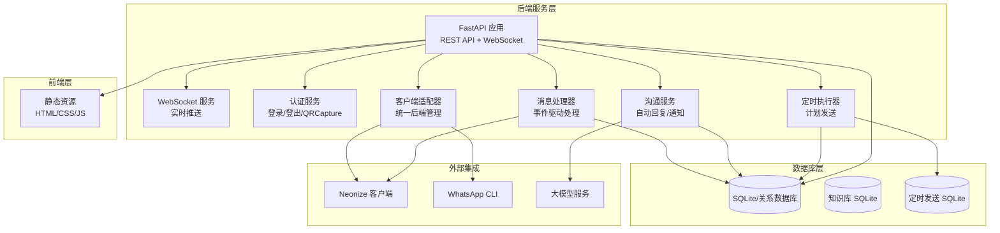
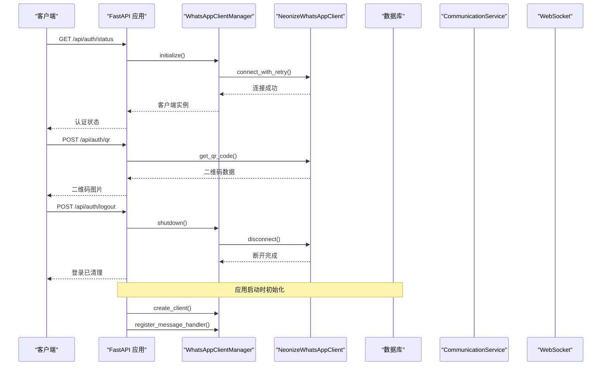
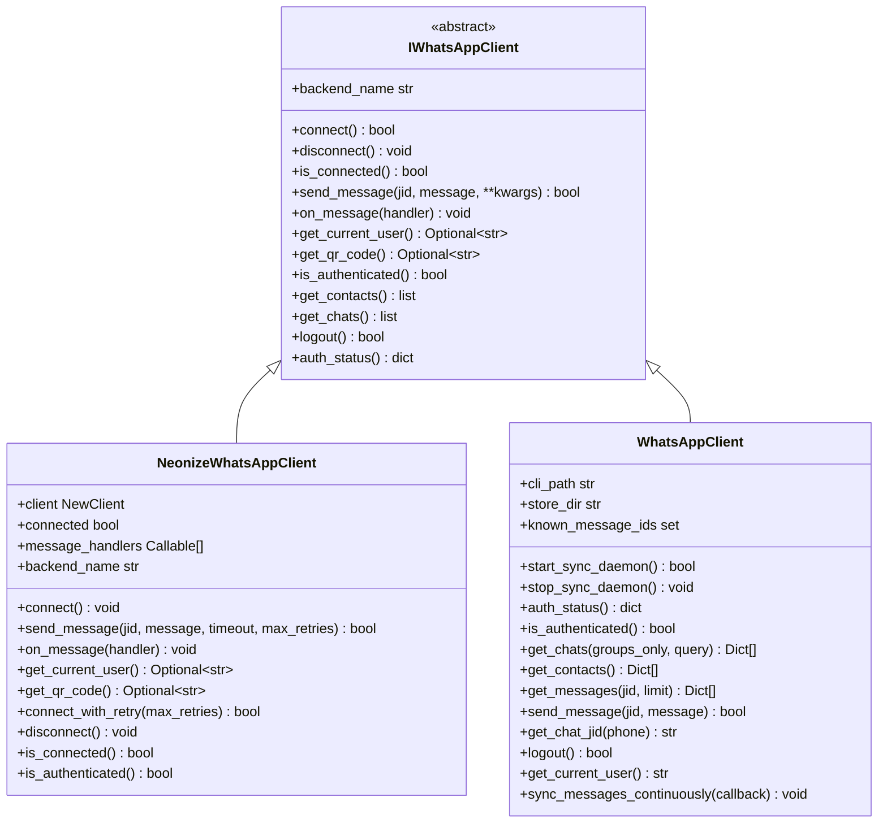
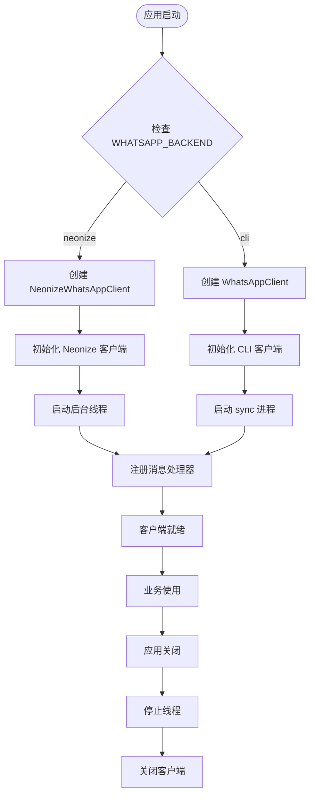
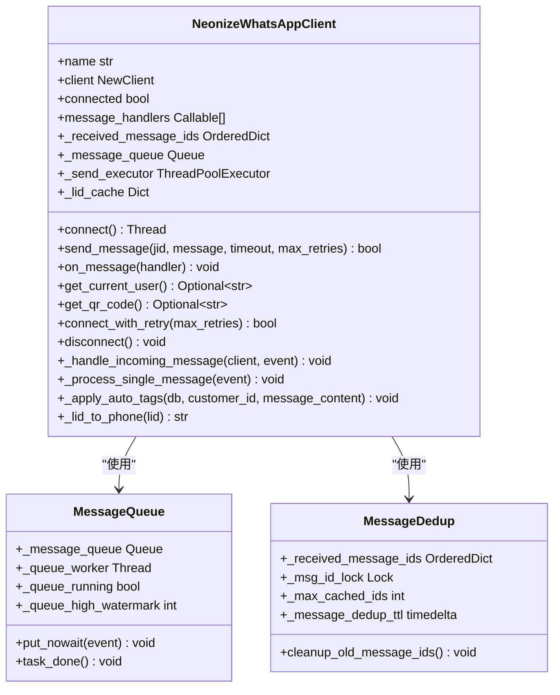
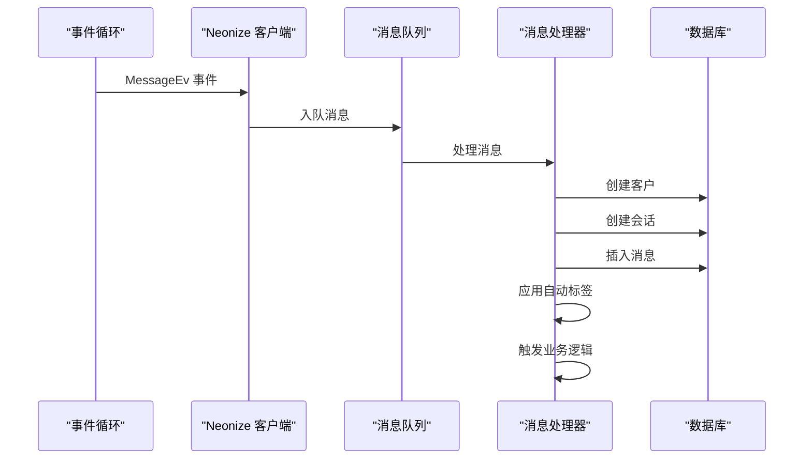
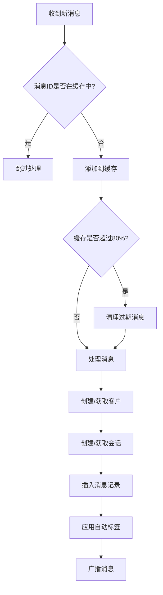
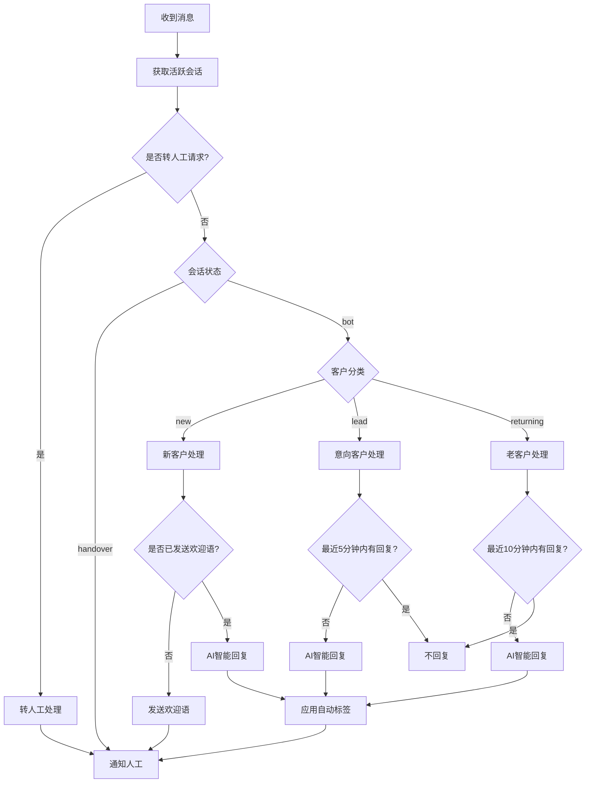
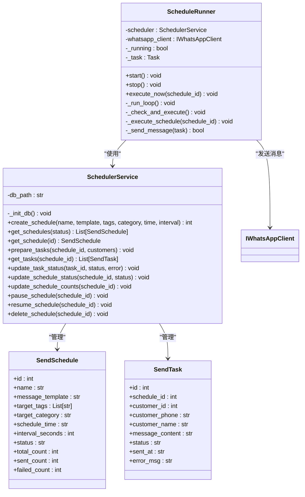
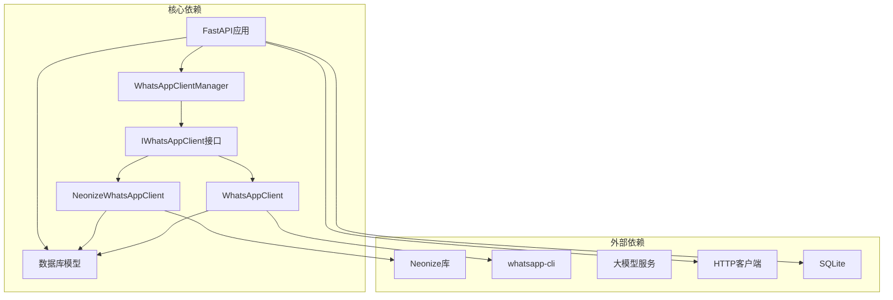

# WhatsApp集成模块

<cite>
**本文档引用的文件**
- [backend/whatsapp_client.py](file://backend/whatsapp_client.py)
- [backend/whatsapp_interface.py](file://backend/whatsapp_interface.py)
- [backend/neonize_client.py](file://backend/neonize_client.py)
- [backend/whatsapp_adapter.py](file://backend/whatsapp_adapter.py)
- [backend/whatsapp_sync_manager.py](file://backend/whatsapp_sync_manager.py)
- [backend/main.py](file://backend/main.py)
- [backend/database.py](file://backend/database.py)
- [backend/communication_service.py](file://backend/communication_service.py)
- [backend/qr_terminal.py](file://backend/qr_terminal.py)
- [backend/schedule_runner.py](file://backend/schedule_runner.py)
- [backend/scheduler_service.py](file://backend/scheduler_service.py)
- [backend/llm_service.py](file://backend/llm_service.py)
- [backend/knowledge_base.py](file://backend/knowledge_base.py)
- [login_whatsapp.py](file://login_whatsapp.py)
- [start_server.py](file://start_server.py)
- [bot.py](file://bot.py)
- [test_neonize.py](file://test_neonize.py)
- [switch_whatsapp_backend.py](file://switch_whatsapp_backend.py)
</cite>

## 更新摘要
**变更内容**
- 完全从CLI架构迁移到Neonize架构
- 新增IWhatsAppClient接口抽象层
- 新增WhatsAppClientManager适配器统一管理不同后端
- 移除了原有的MessageSyncer类（Neonize使用事件驱动）
- 新增NeonizeWhatsAppClient类的完整实现
- 新增WhatsAppSyncManager进程管理器
- 更新了所有API接口说明以反映新的架构

## 目录
1. [简介](#简介)
2. [项目结构](#项目结构)
3. [核心组件](#核心组件)
4. [架构总览](#架构总览)
5. [详细组件分析](#详细组件分析)
6. [依赖关系分析](#依赖关系分析)
7. [性能考虑](#性能考虑)
8. [故障排除指南](#故障排除指南)
9. [结论](#结论)
10. [附录](#附录)

## 简介
本项目是一个基于 WhatsApp 的智能客户关系管理系统，现已完全迁移到基于 Neonize 的现代化架构。系统提供完整的 WhatsApp 集成能力，包括：
- Neonize 客户端封装与事件驱动架构
- IWhatsAppClient 接口抽象与多后端支持
- WhatsAppClientManager 适配器统一管理
- 实时消息处理与去重机制
- 客户自动创建与标签管理
- 实时消息推送与人工通知
- 定时发送计划与批量营销
- AI 智能回复与知识库集成

系统采用 FastAPI 提供 REST API，结合 WebSocket 实现实时消息推送，并通过数据库持久化存储客户、消息、会话等数据。

## 项目结构
项目采用分层架构，主要分为后端服务层、数据库层、消息处理层和前端静态资源层。

**图表来源**
- [backend/main.py:128-194](file://backend/main.py#L128-L194)
- [backend/whatsapp_adapter.py:17-150](file://backend/whatsapp_adapter.py#L17-L150)
- [backend/whatsapp_interface.py:10-90](file://backend/whatsapp_interface.py#L10-L90)

**章节来源**
- [backend/main.py:1-1997](file://backend/main.py#L1-L1997)
- [backend/whatsapp_client.py:1-535](file://backend/whatsapp_client.py#L1-L535)
- [backend/whatsapp_adapter.py:1-180](file://backend/whatsapp_adapter.py#L1-L180)

## 核心组件
本节详细介绍系统的核心组件及其职责。

### IWhatsAppClient 接口抽象
IWhatsAppClient 是所有 WhatsApp 后端实现的统一接口抽象，确保不同后端（Neonize、CLI、Baileys 等）具有相同的 API 接口。

主要功能：
- 统一的连接管理接口
- 标准化的消息发送接口
- 一致的认证状态检查
- 兼容的消息处理器注册
- 后端名称标识

关键方法：
- `connect()` / `disconnect()`: 连接管理
- `send_message()`: 消息发送
- `on_message()`: 消息处理器注册
- `get_current_user()`: 当前用户信息
- `get_qr_code()`: 二维码获取
- `is_connected()` / `is_authenticated()`: 状态检查

**章节来源**
- [backend/whatsapp_interface.py:10-90](file://backend/whatsapp_interface.py#L10-L90)

### WhatsAppClientManager 适配器
WhatsAppClientManager 是统一的客户端管理器，负责管理不同后端的生命周期，通过环境变量选择后端。

主要功能：
- 后端选择与实例创建
- 生命周期管理（初始化/关闭）
- 消息处理器注册
- 统一的关闭流程
- 后端类型判断

关键方法：
- `create_client()`: 创建客户端实例
- `initialize()`: 初始化客户端
- `register_message_handler()`: 注册消息处理器
- `shutdown()`: 统一关闭
- `get_backend_name()`: 获取后端名称

**章节来源**
- [backend/whatsapp_adapter.py:17-150](file://backend/whatsapp_adapter.py#L17-L150)

### NeonizeWhatsAppClient 类
NeonizeWhatsAppClient 是基于 Neonize 的 WhatsApp 客户端实现，提供事件驱动的消息处理能力。

主要功能：
- 基于 Neonize 的稳定连接
- 事件驱动的消息处理
- 消息去重与队列管理
- LID 转换与缓存机制
- 多媒体消息支持
- 心跳检测与重连机制

关键方法：
- `connect()`: 启动客户端连接
- `send_message()`: 发送文本消息
- `send_image()`: 发送图片
- `send_video()`: 发送视频
- `send_document()`: 发送文档
- `get_user_info()`: 查询用户信息
- `connect_with_retry()`: 带重试的连接

**章节来源**
- [backend/neonize_client.py:87-903](file://backend/neonize_client.py#L87-L903)

### WhatsAppSyncManager 进程管理器
WhatsAppSyncManager 负责监控和管理 whatsapp sync --follow 进程，确保 CLI 后端的稳定性。

主要功能：
- 进程健康检查
- 自动重启机制
- 消息计数监控
- 日志管理

**章节来源**
- [backend/whatsapp_sync_manager.py:12-134](file://backend/whatsapp_sync_manager.py#L12-L134)

### CommunicationService 类
CommunicationService 处理自动回复、人工转接、标签管理等沟通相关功能。

核心功能：
- 客户分类自动回复策略
- AI 智能回复（支持多智能体）
- 人工转接处理
- 自动标签应用
- 通知服务集成

**章节来源**
- [backend/communication_service.py:17-512](file://backend/communication_service.py#L17-L512)

### 数据库模型
系统使用 SQLAlchemy 定义了完整的数据模型，包括客户、消息、会话、标签、智能体、提供商等。

核心实体：
- Customer: 客户信息（电话、姓名、分类、状态）
- Message: 消息记录（内容、方向、类型、已读状态）
- Conversation: 会话状态（bot/handover/closed）
- CustomerTag: 客户标签系统
- AIAgent: AI 智能体配置
- LLMProvider: 大模型提供商配置

**章节来源**
- [backend/database.py:23-297](file://backend/database.py#L23-L297)

## 架构总览
系统采用模块化设计，通过 IWhatsAppClient 接口抽象和 WhatsAppClientManager 适配器实现了多后端支持，各组件职责清晰，通过依赖注入和全局状态管理实现松耦合。

**图表来源**
- [backend/main.py:114-163](file://backend/main.py#L114-L163)
- [backend/whatsapp_adapter.py:46-110](file://backend/whatsapp_adapter.py#L46-L110)
- [backend/neonize_client.py:866-903](file://backend/neonize_client.py#L866-L903)

## 详细组件分析

### IWhatsAppClient 接口详细分析
IWhatsAppClient 定义了所有 WhatsApp 后端实现必须遵循的标准接口。

**图表来源**
- [backend/whatsapp_interface.py:10-90](file://backend/whatsapp_interface.py#L10-L90)
- [backend/neonize_client.py:87-903](file://backend/neonize_client.py#L87-L903)
- [backend/whatsapp_client.py:14-535](file://backend/whatsapp_client.py#L14-L535)

#### 接口抽象的优势
- **后端无关性**: 业务逻辑不依赖特定后端实现
- **易于扩展**: 支持新增后端（如 Baileys）
- **测试友好**: 可以轻松模拟接口进行单元测试
- **部署灵活**: 通过环境变量动态切换后端

**章节来源**
- [backend/whatsapp_interface.py:10-90](file://backend/whatsapp_interface.py#L10-L90)

### WhatsAppClientManager 适配器详细分析
WhatsAppClientManager 提供了统一的客户端管理接口，隐藏了不同后端的实现细节。

**图表来源**
- [backend/whatsapp_adapter.py:46-110](file://backend/whatsapp_adapter.py#L46-L110)

**章节来源**
- [backend/whatsapp_adapter.py:46-110](file://backend/whatsapp_adapter.py#L46-L110)

### NeonizeWhatsAppClient 类详细分析
NeonizeWhatsAppClient 提供了基于 Neonize 的高性能 WhatsApp 客户端实现。

**图表来源**
- [backend/neonize_client.py:87-903](file://backend/neonize_client.py#L87-L903)

#### 事件驱动架构优势
- **实时响应**: 基于事件驱动，消息到达即处理
- **高并发**: 使用线程池和队列处理大量消息
- **内存优化**: 消息ID去重和缓存机制
- **稳定性**: 心跳检测和自动重连机制

**章节来源**
- [backend/neonize_client.py:87-903](file://backend/neonize_client.py#L87-L903)

### 消息处理机制
Neonize 架构采用事件驱动的消息处理机制，相比 CLI 的轮询模式更加高效。

**图表来源**
- [backend/neonize_client.py:146-321](file://backend/neonize_client.py#L146-L321)

#### 消息去重算法
Neonize 使用基于 OrderedDict 的消息去重机制：

**图表来源**
- [backend/neonize_client.py:131-169](file://backend/neonize_client.py#L131-L169)

**章节来源**
- [backend/neonize_client.py:131-169](file://backend/neonize_client.py#L131-L169)

### 通信服务与自动回复
CommunicationService 与新的 Neonize 架构无缝集成，提供智能的自动回复策略。

**图表来源**
- [backend/communication_service.py:47-171](file://backend/communication_service.py#L47-L171)

**章节来源**
- [backend/communication_service.py:47-171](file://backend/communication_service.py#L47-L171)

### 定时发送系统
系统支持定时发送计划，可以按标签筛选客户并批量发送消息。

**图表来源**
- [backend/scheduler_service.py:54-393](file://backend/scheduler_service.py#L54-L393)
- [backend/schedule_runner.py:12-142](file://backend/schedule_runner.py#L12-L142)

**章节来源**
- [backend/scheduler_service.py:54-393](file://backend/scheduler_service.py#L54-L393)
- [backend/schedule_runner.py:12-142](file://backend/schedule_runner.py#L12-L142)

## 依赖关系分析
系统采用模块化设计，通过接口抽象和适配器模式实现了清晰的依赖关系。

**图表来源**
- [backend/main.py:34-46](file://backend/main.py#L34-L46)
- [backend/whatsapp_adapter.py:32-44](file://backend/whatsapp_adapter.py#L32-L44)
- [backend/whatsapp_interface.py:10-14](file://backend/whatsapp_interface.py#L10-L14)

**章节来源**
- [backend/main.py:34-46](file://backend/main.py#L34-L46)

## 性能考虑
系统在设计时充分考虑了性能优化，基于 Neonize 的事件驱动架构提供了更好的性能表现。

### 事件驱动处理
- **实时响应**: 基于事件驱动，消息到达即处理
- **高并发支持**: 使用线程池和队列处理大量消息
- **内存优化**: 消息ID去重和缓存机制
- **CPU效率**: 避免轮询带来的CPU浪费

### 缓存与去重
- **消息ID缓存**: 使用 OrderedDict 实现高效的去重
- **LID 缓存**: 电话号码转换结果缓存
- **心跳检测**: 连接状态监控和自动重连
- **队列管理**: 消息队列的水位监控和告警

### 连接管理
- **指数退避重试**: 连接失败时的智能重试策略
- **后台线程**: 非阻塞的客户端连接
- **资源清理**: 完善的连接关闭和资源释放
- **状态监控**: 连接状态的实时监控

### 数据库优化
- **批量操作**: 减少数据库往返次数
- **连接池**: 复用数据库连接
- **事务管理**: 原子性操作保证
- **索引优化**: 合理的索引设计

## 故障排除指南

### 连接问题
**症状**: Neonize 客户端无法连接 WhatsApp
**排查步骤**：
1. 检查 Neonize 库是否正确安装
2. 验证网络连接和代理设置
3. 确认二维码扫描是否完成
4. 检查客户端就绪事件

**解决方案**：
- 重新安装 Neonize 库
- 检查网络连接
- 重新扫描二维码
- 查看连接日志

### 权限错误
**症状**: 发送消息失败，返回权限错误
**排查步骤**：
1. 检查客户端连接状态
2. 验证消息发送超时设置
3. 确认重试机制是否正常工作

**解决方案**：
- 检查网络连接
- 调整超时参数
- 重试发送操作

### 消息处理失败
**症状**: 消息无法正确处理或丢失
**排查步骤**：
1. 检查消息队列状态
2. 验证消息去重机制
3. 确认数据库连接

**解决方案**：
- 重启消息处理线程
- 清理消息缓存
- 检查数据库权限

### 适配器切换问题
**症状**: 切换后端时出现导入错误
**排查步骤**：
1. 检查 WHATSAPP_BACKEND 环境变量
2. 验证后端依赖是否安装
3. 确认文件路径正确

**解决方案**：
- 设置正确的后端环境变量
- 安装缺失的依赖包
- 使用后端切换工具

### WebSocket 连接问题
**症状**: 实时消息推送失败
**排查步骤**：
1. 检查服务器端口占用
2. 验证 CORS 配置
3. 确认客户端连接状态

**解决方案**：
- 重启 API 服务器
- 检查防火墙设置
- 更新客户端代码

### AI 回复失败
**症状**: AI 智能回复生成失败
**排查步骤**：
1. 检查大模型 API 配置
2. 验证 API 密钥有效性
3. 确认网络连接

**解决方案**：
- 更新 API 配置
- 检查网络连接
- 使用备用模型

## 结论
WhatsApp集成模块已成功从传统的 CLI 架构完全迁移到基于 Neonize 的现代化架构。通过 IWhatsAppClient 接口抽象和 WhatsAppClientManager 适配器，系统实现了高度的模块化和可扩展性。

主要优势：
- **事件驱动架构**: 基于 Neonize 的高性能事件驱动处理
- **接口抽象**: IWhatsAppClient 提供统一的后端接口
- **适配器模式**: WhatsAppClientManager 统一管理不同后端
- **自动重连**: 智能的心跳检测和重连机制
- **消息去重**: 高效的消息ID缓存和去重
- **资源管理**: 完善的连接管理和资源清理

未来改进方向：
- 增加更多的后端支持（如 Baileys）
- 扩展多媒体消息支持
- 优化大数据量场景的性能
- 增强监控和日志功能
- 提供更丰富的 API 接口

## 附录

### API 接口说明

#### 认证相关接口
- `GET /api/auth/status` - 获取认证状态
- `POST /api/auth/qr` - 获取登录二维码
- `GET /api/auth/qr/status` - 获取二维码状态
- `POST /api/auth/qr/cancel` - 取消登录
- `POST /api/auth/logout` - 退出登录

#### 客户管理接口
- `GET /api/customers` - 获取客户列表
- `GET /api/customers/{id}` - 获取客户详情
- `PUT /api/customers/{id}/category` - 更新客户分类

#### 消息相关接口
- `GET /api/customers/{id}/messages` - 获取消息历史
- `POST /api/customers/{id}/messages` - 发送消息

#### 会话管理接口
- `GET /api/conversations` - 获取会话列表
- `POST /api/conversations/{id}/handover` - 人工接手
- `POST /api/conversations/{id}/close` - 关闭会话

#### AI 功能接口
- `POST /api/customers/{id}/ai-reply` - 生成AI回复
- `POST /api/customers/{id}/messages/ai-send` - 发送AI回复

### 配置要求
- Python 3.8+
- Neonize 库（推荐使用）
- 可选：whatsapp-cli（用于 CLI 后端）
- SQLite 数据库支持
- 必要的第三方库（如需要）

### 后端切换
系统支持通过环境变量切换后端：
- `WHATSAPP_BACKEND=neonize` - 使用 Neonize 后端
- `WHATSAPP_BACKEND=cli` - 使用 CLI 后端

### JID 格式处理
系统支持多种 JID 格式：
- `1234567890@s.whatsapp.net` - 标准格式
- `1234567890@lid` - 设备ID格式
- 纯号码格式 - 自动转换为标准格式

### 消息格式转换
系统自动处理消息格式转换：
- 文本消息
- 图片/视频等媒体消息
- 位置信息
- 联系人名片

### 架构迁移说明
从 CLI 到 Neonize 的迁移带来了以下改进：
- **稳定性**: Neonize 提供更稳定的连接
- **性能**: 事件驱动架构比轮询更高效
- **功能**: 更好的多媒体消息支持
- **可维护性**: 统一的接口抽象和适配器模式
- **扩展性**: 易于添加新的后端实现