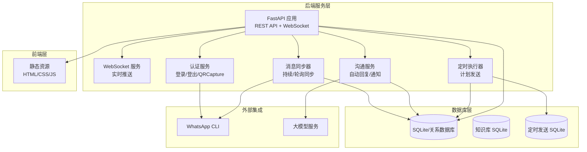
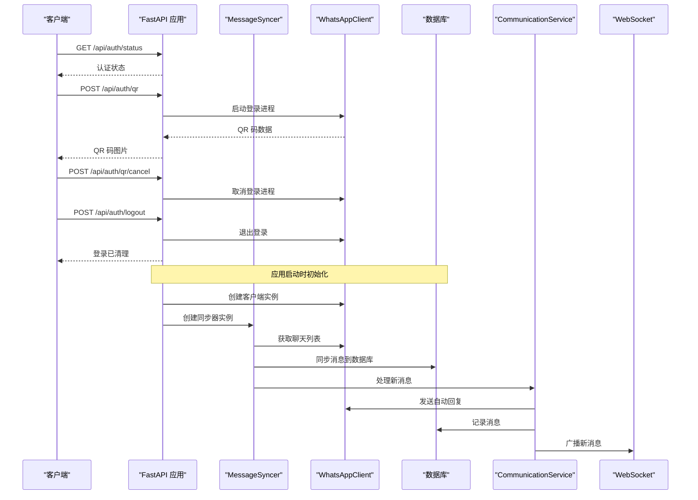
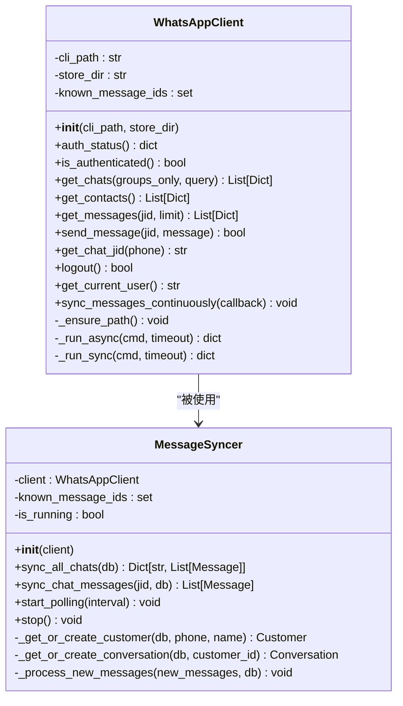
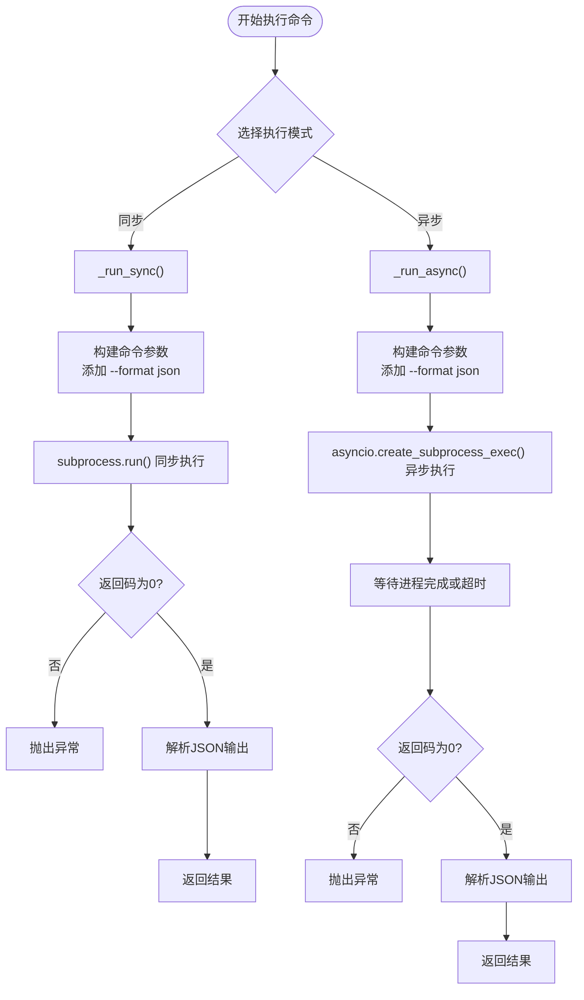
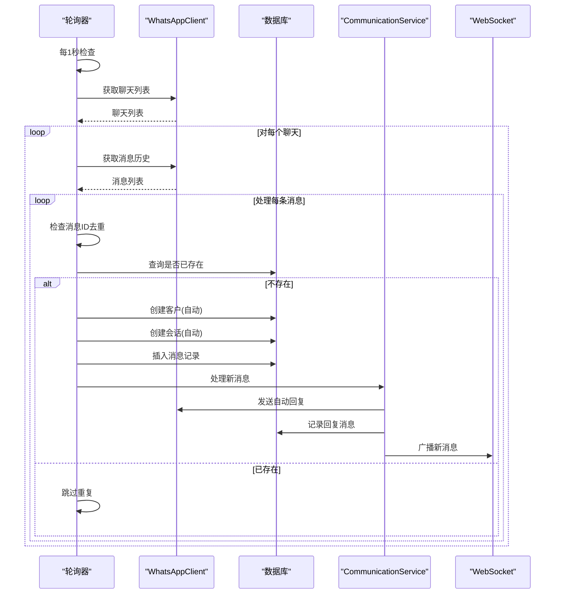
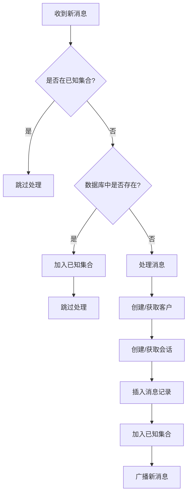
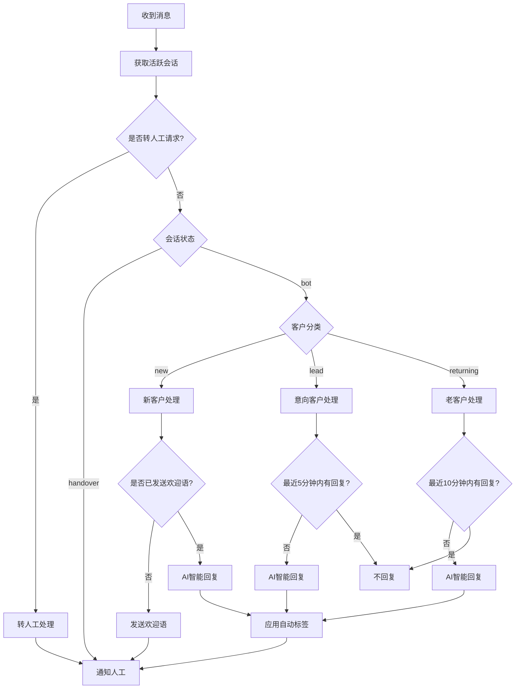
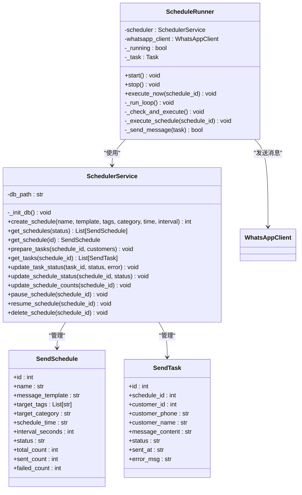
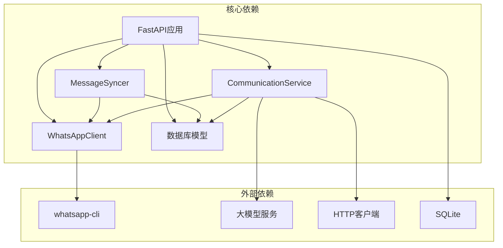

# WhatsApp集成模块

<cite>
**本文档引用的文件**
- [backend/whatsapp_client.py](file://backend/whatsapp_client.py)
- [backend/main.py](file://backend/main.py)
- [backend/database.py](file://backend/database.py)
- [backend/communication_service.py](file://backend/communication_service.py)
- [backend/qr_terminal.py](file://backend/qr_terminal.py)
- [backend/schedule_runner.py](file://backend/schedule_runner.py)
- [backend/scheduler_service.py](file://backend/scheduler_service.py)
- [backend/llm_service.py](file://backend/llm_service.py)
- [backend/knowledge_base.py](file://backend/knowledge_base.py)
- [login_whatsapp.py](file://login_whatsapp.py)
- [start_server.py](file://start_server.py)
- [bot.py](file://bot.py)
</cite>

## 目录
1. [简介](#简介)
2. [项目结构](#项目结构)
3. [核心组件](#核心组件)
4. [架构总览](#架构总览)
5. [详细组件分析](#详细组件分析)
6. [依赖关系分析](#依赖关系分析)
7. [性能考虑](#性能考虑)
8. [故障排除指南](#故障排除指南)
9. [结论](#结论)
10. [附录](#附录)

## 简介
本项目是一个基于 WhatsApp CLI 的智能客户关系管理系统，提供完整的 WhatsApp 集成能力，包括：
- CLI 封装与异步命令执行
- 认证状态检查与登录流程
- 聊天列表与联系人管理
- 消息同步与去重机制
- 客户自动创建与标签管理
- 实时消息推送与人工通知
- 定时发送计划与批量营销
- AI 智能回复与知识库集成

系统采用 FastAPI 提供 REST API，结合 WebSocket 实现实时消息推送，并通过数据库持久化存储客户、消息、会话等数据。

## 项目结构
项目采用分层架构，主要分为后端服务层、数据库层、消息同步层和前端静态资源层。

**图表来源**
- [backend/main.py:128-194](file://backend/main.py#L128-L194)
- [backend/whatsapp_client.py:13-437](file://backend/whatsapp_client.py#L13-L437)
- [backend/communication_service.py:17-512](file://backend/communication_service.py#L17-L512)
- [backend/schedule_runner.py:12-142](file://backend/schedule_runner.py#L12-L142)

**章节来源**
- [backend/main.py:1-1997](file://backend/main.py#L1-L1997)
- [backend/whatsapp_client.py:1-437](file://backend/whatsapp_client.py#L1-L437)

## 核心组件
本节详细介绍系统的核心组件及其职责。

### WhatsAppClient 类
WhatsAppClient 是对 WhatsApp CLI 的封装，提供统一的接口来执行各种 WhatsApp 操作。

主要功能：
- CLI 路径管理与环境配置
- 同步/异步命令执行
- 认证状态检查
- 聊天列表与联系人管理
- 消息获取与发送
- JID 格式处理与自动重试

关键方法：
- `auth_status()`: 检查登录状态
- `is_authenticated()`: 验证认证状态
- `get_chats()`: 获取聊天列表
- `get_contacts()`: 获取联系人列表
- `get_messages()`: 获取消息历史
- `send_message()`: 发送消息（支持 JID 自动切换）
- `get_chat_jid()`: 根据手机号获取正确 JID
- `sync_messages_continuously()`: 持续同步模式
- `_run_async()`: 异步命令执行
- `_run_sync()`: 同步命令执行

**章节来源**
- [backend/whatsapp_client.py:13-437](file://backend/whatsapp_client.py#L13-L437)

### MessageSyncer 类
MessageSyncer 负责将 WhatsApp 消息同步到本地数据库，实现消息去重、客户自动创建、会话管理等功能。

核心机制：
- 消息去重：使用 known_message_ids 集合跟踪已处理消息
- 客户自动创建：根据手机号自动创建客户记录并应用标签
- 会话管理：为每个客户维护活跃会话状态
- 轮询同步：定期检查新消息（默认 1 秒间隔）
- 实时同步：支持持续同步模式

关键方法：
- `sync_all_chats()`: 同步所有聊天的消息
- `sync_chat_messages()`: 同步单个聊天的消息
- `start_polling()`: 启动轮询同步
- `stop()`: 停止同步
- `_process_new_messages()`: 处理新消息并触发自动回复

**章节来源**
- [backend/whatsapp_client.py:212-437](file://backend/whatsapp_client.py#L212-L437)

### CommunicationService 类
CommunicationService 处理自动回复、人工转接、标签管理等沟通相关功能。

核心功能：
- 客户分类自动回复策略
- AI 智能回复（支持多智能体）
- 人工转接处理
- 自动标签应用
- 通知服务集成

**章节来源**
- [backend/communication_service.py:17-512](file://backend/communication_service.py#L17-L512)

### 数据库模型
系统使用 SQLAlchemy 定义了完整的数据模型，包括客户、消息、会话、标签、智能体、提供商等。

核心实体：
- Customer: 客户信息（电话、姓名、分类、状态）
- Message: 消息记录（内容、方向、类型、已读状态）
- Conversation: 会话状态（bot/handover/closed）
- CustomerTag: 客户标签系统
- AIAgent: AI 智能体配置
- LLMProvider: 大模型提供商配置

**章节来源**
- [backend/database.py:23-297](file://backend/database.py#L23-L297)

## 架构总览
系统采用模块化设计，各组件职责清晰，通过依赖注入和全局状态管理实现松耦合。

**图表来源**
- [backend/main.py:88-126](file://backend/main.py#L88-L126)
- [backend/whatsapp_client.py:174-210](file://backend/whatsapp_client.py#L174-L210)
- [backend/communication_service.py:47-72](file://backend/communication_service.py#L47-L72)

## 详细组件分析

### WhatsAppClient 类详细分析
WhatsAppClient 通过子进程调用 whatsapp-cli，提供统一的接口封装。

**图表来源**
- [backend/whatsapp_client.py:13-437](file://backend/whatsapp_client.py#L13-L437)

#### 异步命令执行机制
WhatsAppClient 支持同步和异步两种命令执行模式：

**图表来源**
- [backend/whatsapp_client.py:27-81](file://backend/whatsapp_client.py#L27-L81)

**章节来源**
- [backend/whatsapp_client.py:27-81](file://backend/whatsapp_client.py#L27-L81)

### 消息同步机制
MessageSyncer 实现了完整的消息同步流程，包括去重、客户管理、会话维护等。

**图表来源**
- [backend/whatsapp_client.py:366-437](file://backend/whatsapp_client.py#L366-L437)
- [backend/communication_service.py:47-72](file://backend/communication_service.py#L47-L72)

#### 消息去重算法
MessageSyncer 使用双重去重机制确保消息不会重复处理：

**图表来源**
- [backend/whatsapp_client.py:286-345](file://backend/whatsapp_client.py#L286-L345)

**章节来源**
- [backend/whatsapp_client.py:286-345](file://backend/whatsapp_client.py#L286-L345)

### 通信服务与自动回复
CommunicationService 实现了智能的自动回复策略，根据不同客户分类提供差异化服务。

**图表来源**
- [backend/communication_service.py:47-171](file://backend/communication_service.py#L47-L171)

**章节来源**
- [backend/communication_service.py:47-171](file://backend/communication_service.py#L47-L171)

### 定时发送系统
系统支持定时发送计划，可以按标签筛选客户并批量发送消息。

**图表来源**
- [backend/scheduler_service.py:54-393](file://backend/scheduler_service.py#L54-L393)
- [backend/schedule_runner.py:12-142](file://backend/schedule_runner.py#L12-L142)

**章节来源**
- [backend/scheduler_service.py:54-393](file://backend/scheduler_service.py#L54-L393)
- [backend/schedule_runner.py:12-142](file://backend/schedule_runner.py#L12-L142)

## 依赖关系分析
系统采用模块化设计，各组件之间的依赖关系清晰明确。

**图表来源**
- [backend/main.py:17-26](file://backend/main.py#L17-L26)
- [backend/whatsapp_client.py:10-10](file://backend/whatsapp_client.py#L10-L10)
- [backend/communication_service.py:8-14](file://backend/communication_service.py#L8-L14)

**章节来源**
- [backend/main.py:17-26](file://backend/main.py#L17-L26)

## 性能考虑
系统在设计时充分考虑了性能优化，主要体现在以下几个方面：

### 异步处理
- 使用 asyncio 实现非阻塞的命令执行
- WebSocket 实现实时消息推送
- 异步 AI 回复生成

### 缓存与去重
- known_message_ids 集合实现消息去重
- 客户和会话的缓存机制
- 数据库查询优化

### 轮询策略
- 默认 1 秒轮询间隔，平衡实时性和性能
- 智能检查机制避免过度查询
- 事件驱动的实时同步模式

### 数据库优化
- 使用 SQLite 作为轻量级数据库
- 合理的索引设计
- 批量操作减少数据库往返

## 故障排除指南

### 连接问题
**症状**：认证状态检查失败，无法获取聊天列表
**排查步骤**：
1. 检查 whatsapp-cli 是否正确安装
2. 验证 PATH 环境变量包含 ~/.local/bin
3. 确认网络连接正常
4. 检查防火墙设置

**解决方案**：
- 重新安装 whatsapp-cli
- 手动添加 PATH 环境变量
- 使用登录助手工具重新登录

### 权限错误
**症状**：发送消息失败，返回权限错误
**排查步骤**：
1. 检查认证状态
2. 验证账户权限
3. 确认设备已正确关联

**解决方案**：
- 重新执行登录流程
- 检查账户状态
- 重新关联设备

### 消息同步失败
**症状**：消息无法同步到数据库
**排查步骤**：
1. 检查数据库连接
2. 验证消息格式
3. 确认去重机制正常工作

**解决方案**：
- 重启消息同步器
- 清理已知消息集合
- 检查数据库权限

### WebSocket 连接问题
**症状**：实时消息推送失败
**排查步骤**：
1. 检查服务器端口占用
2. 验证 CORS 配置
3. 确认客户端连接状态

**解决方案**：
- 重启 API 服务器
- 检查防火墙设置
- 更新客户端代码

### AI 回复失败
**症状**：AI 智能回复生成失败
**排查步骤**：
1. 检查大模型 API 配置
2. 验证 API 密钥有效性
3. 确认网络连接

**解决方案**：
- 更新 API 配置
- 检查网络连接
- 使用备用模型

## 结论
WhatsApp集成模块提供了一个完整、可靠的 WhatsApp 自动化解决方案。通过模块化的架构设计、完善的错误处理机制和丰富的功能特性，系统能够满足企业级的客户关系管理需求。

主要优势：
- 完整的 WhatsApp CLI 封装
- 智能的消息同步与去重机制
- 灵活的自动回复策略
- 强大的定时发送功能
- 实时消息推送支持
- 可扩展的 AI 集成

未来改进方向：
- 增加更多的认证方式
- 扩展多媒体消息支持
- 优化大数据量场景的性能
- 增强监控和日志功能

## 附录

### API 接口说明

#### 认证相关接口
- `GET /api/auth/status` - 获取认证状态
- `POST /api/auth/qr` - 获取登录二维码
- `GET /api/auth/qr/status` - 获取二维码状态
- `POST /api/auth/qr/cancel` - 取消登录
- `POST /api/auth/logout` - 退出登录

#### 客户管理接口
- `GET /api/customers` - 获取客户列表
- `GET /api/customers/{id}` - 获取客户详情
- `PUT /api/customers/{id}/category` - 更新客户分类

#### 消息相关接口
- `GET /api/customers/{id}/messages` - 获取消息历史
- `POST /api/customers/{id}/messages` - 发送消息

#### 会话管理接口
- `GET /api/conversations` - 获取会话列表
- `POST /api/conversations/{id}/handover` - 人工接手
- `POST /api/conversations/{id}/close` - 关闭会话

#### AI 功能接口
- `POST /api/customers/{id}/ai-reply` - 生成AI回复
- `POST /api/customers/{id}/messages/ai-send` - 发送AI回复

### 配置要求
- Python 3.8+
- whatsapp-cli 已安装并配置
- SQLite 数据库支持
- 必要的第三方库（如需要）

### JID 格式处理
系统支持多种 JID 格式：
- `1234567890@s.whatsapp.net` - 标准格式
- `1234567890@lid` - 设备ID格式
- 纯号码格式 - 自动转换为标准格式

### 消息格式转换
系统自动处理消息格式转换：
- 文本消息
- 图片/视频等媒体消息
- 位置信息
- 联系人名片