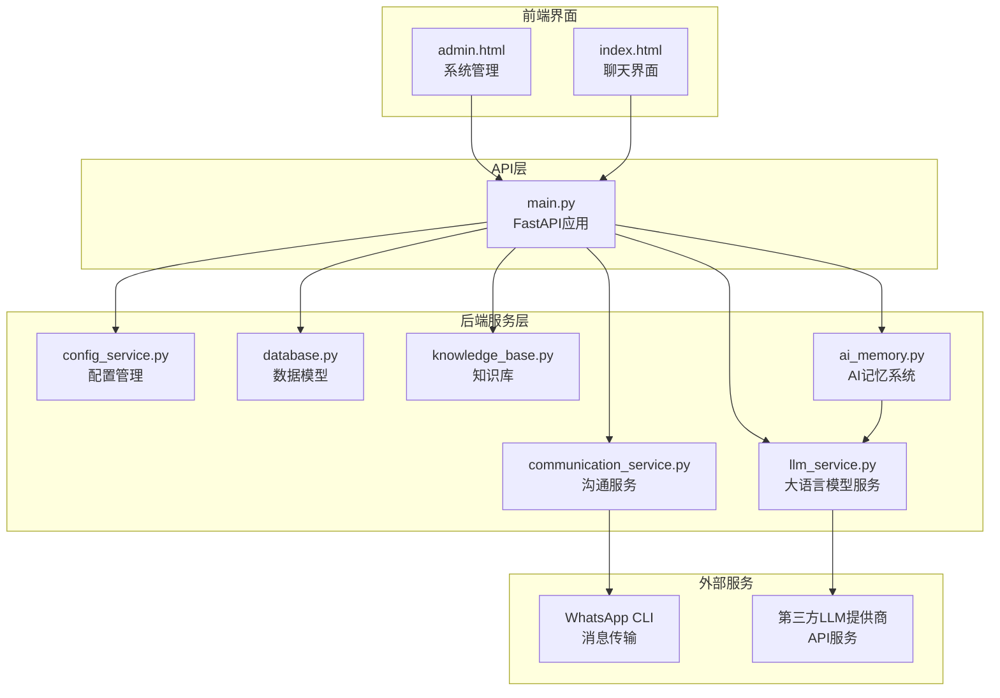
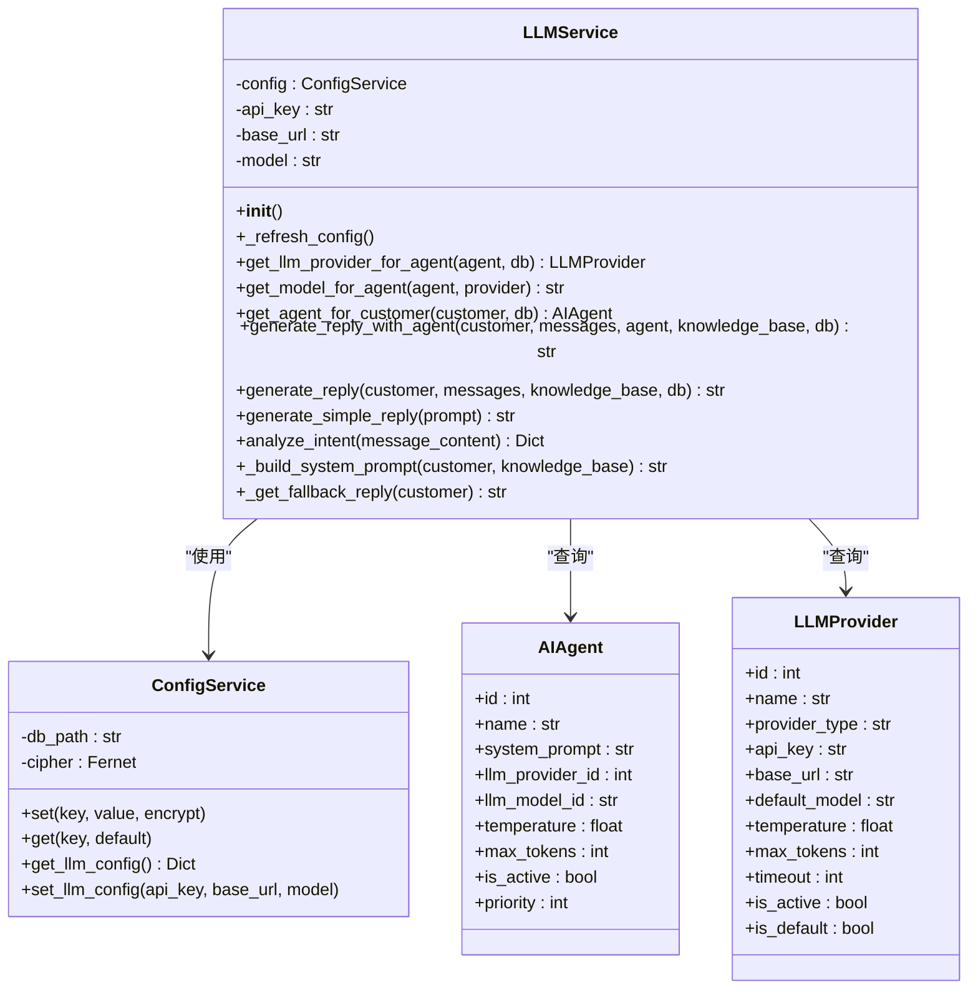
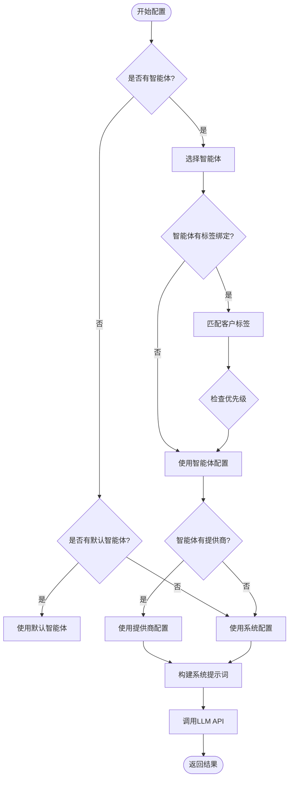
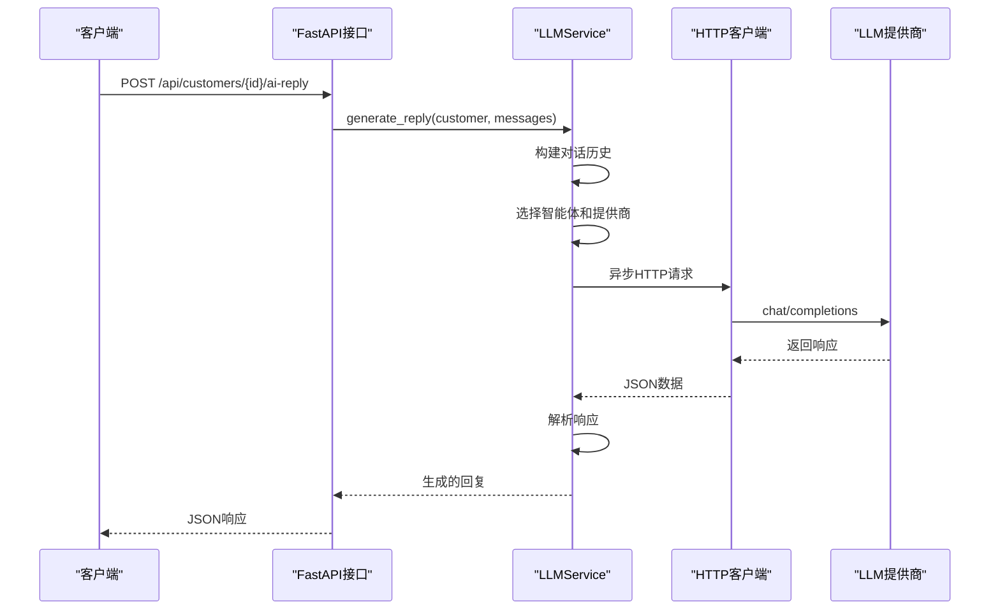
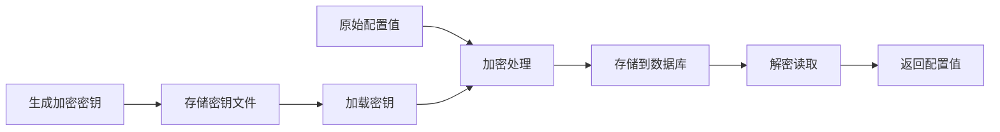
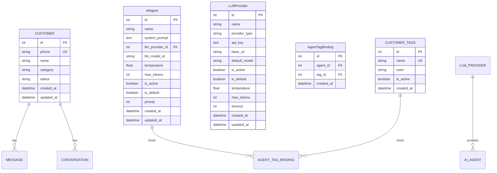
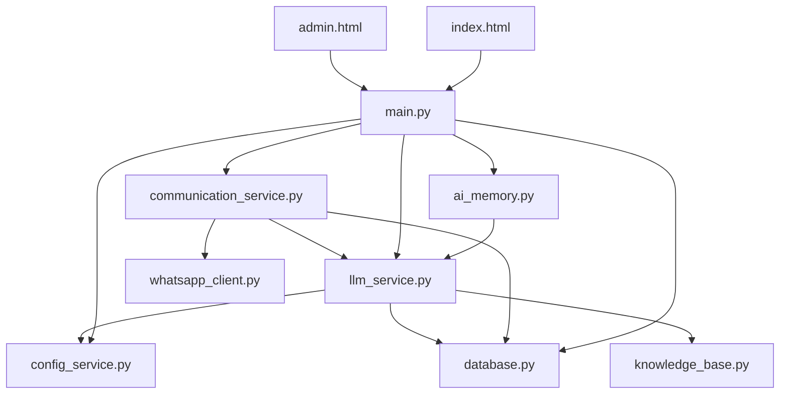

# 大语言模型服务模块

<cite>
**本文档引用的文件**
- [llm_service.py](file://backend/llm_service.py)
- [ai_memory.py](file://backend/ai_memory.py)
- [main.py](file://backend/main.py)
- [config_service.py](file://backend/config_service.py)
- [database.py](file://backend/database.py)
- [communication_service.py](file://backend/communication_service.py)
- [knowledge_base.py](file://backend/knowledge_base.py)
- [admin.html](file://backend/static/admin.html)
- [index.html](file://backend/static/index.html)
</cite>

## 目录
1. [简介](#简介)
2. [项目结构](#项目结构)
3. [核心组件](#核心组件)
4. [架构概览](#架构概览)
5. [详细组件分析](#详细组件分析)
6. [AI记忆系统](#ai记忆系统)
7. [依赖关系分析](#依赖关系分析)
8. [性能考虑](#性能考虑)
9. [故障排除指南](#故障排除指南)
10. [结论](#结论)

## 简介

大语言模型服务模块是WhatsApp智能客户系统的核心AI组件，负责集成多种大语言模型提供商（如OpenAI、Claude、DeepSeek等），为智能客服提供自然语言处理能力。该模块实现了智能体配置管理、多提供商支持、异步调用机制、错误处理策略、AI记忆系统等功能，为整个WhatsApp机器人系统提供了强大的AI智能回复能力。

**更新** 新增AI记忆系统，支持对话总结、沟通技巧沉淀和成交模式学习，显著增强了系统的智能化水平。

## 项目结构

该项目采用模块化的Python架构设计，主要包含以下核心模块：



**图表来源**
- [main.py:1-150](file://backend/main.py#L1-L150)
- [llm_service.py:1-50](file://backend/llm_service.py#L1-L50)
- [ai_memory.py:1-50](file://backend/ai_memory.py#L1-L50)
- [database.py:1-50](file://backend/database.py#L1-L50)

**章节来源**
- [main.py:1-200](file://backend/main.py#L1-L200)
- [llm_service.py:1-100](file://backend/llm_service.py#L1-L100)
- [ai_memory.py:1-50](file://backend/ai_memory.py#L1-L50)

## 核心组件

### LLMService类

LLMService是整个大语言模型服务的核心类，负责管理所有AI相关的功能。它支持多提供商集成，包括OpenAI、Claude、DeepSeek等主流AI服务提供商。

**主要特性：**
- 多提供商支持机制
- 智能体配置管理
- 异步API调用（支持httpx和aiohttp）
- 错误处理和回退机制
- 系统提示词构建
- 意图分析功能
- **新增** 单轮简单调用（generate_simple_reply）

### AI记忆系统

**新增功能** AI记忆系统是本次更新的核心亮点，实现了对话经验的自动总结和沉淀：

- **对话总结**：自动分析销售对话，提取关键信息
- **沟通技巧沉淀**：记录有效的沟通话术和技巧
- **成交模式学习**：识别成单和未成单的关键因素
- **经验检索**：在生成回复时注入历史经验
- **异步处理**：支持异步对话总结，不影响主流程

### 配置管理系统

系统采用安全的配置管理机制，使用加密存储敏感信息：

- **加密存储**：使用Fernet对称加密算法保护API密钥
- **多配置源**：支持环境变量、配置文件、数据库等多种配置方式
- **回退机制**：提供旧版配置作为新配置不可用时的回退方案

### 数据库模型

系统使用SQLAlchemy ORM定义了完整的数据模型，支持复杂的AI功能：

- **AIAgent**：智能体配置模型
- **LLMProvider**：大模型提供商配置
- **LLMModel**：具体模型配置
- **客户标签系统**：支持智能体与客户标签的绑定

**章节来源**
- [llm_service.py:11-493](file://backend/llm_service.py#L11-L493)
- [ai_memory.py:1-182](file://backend/ai_memory.py#L1-L182)
- [config_service.py:11-160](file://backend/config_service.py#L11-L160)
- [database.py:155-244](file://backend/database.py#L155-L244)

## 架构概览

系统采用分层架构设计，各层职责明确：

```mermaid
graph TB
subgraph "表现层"
UI[前端界面<br/>admin.html, index.html]
end
subgraph "应用层"
API[FastAPI应用<br/>main.py]
COMM[沟通服务<br/>communication_service.py]
LLM[LLM服务<br/>llm_service.py]
MEM[AI记忆系统<br/>ai_memory.py]
end
subgraph "数据层"
DB[(SQLite数据库)]
KB[知识库<br/>knowledge_base.py]
MEM_DATA[(AI记忆数据<br/>JSON文件)]
END
subgraph "外部服务"
WA[WhatsApp CLI]
LLM_API[LLM提供商API]
END
UI --> API
API --> COMM
API --> LLM
API --> MEM
COMM --> WA
LLM --> LLM_API
MEM --> LLM
API --> DB
LLM --> DB
COMM --> DB
KB --> DB
MEM_DATA --> MEM
```

**图表来源**
- [main.py:128-153](file://backend/main.py#L128-L153)
- [communication_service.py:17-512](file://backend/communication_service.py#L17-L512)
- [llm_service.py:11-493](file://backend/llm_service.py#L11-L493)
- [ai_memory.py:1-182](file://backend/ai_memory.py#L1-182)

## 详细组件分析

### LLMService类深度分析

#### 类结构设计



**图表来源**
- [llm_service.py:11-493](file://backend/llm_service.py#L11-L493)
- [config_service.py:11-160](file://backend/config_service.py#L11-L160)
- [database.py:155-244](file://backend/database.py#L155-L244)

#### 多提供商支持机制

系统实现了灵活的多提供商支持机制，支持以下提供商类型：

| 提供商类型 | API类型 | 特点 |
|-----------|---------|------|
| openai | OpenAI官方API | 标准OpenAI接口，支持GPT系列模型 |
| claude | Anthropic Claude | Claude系列模型，适合长文本生成 |
| deepseek | DeepSeek官方API | 中文优化，性价比高 |
| azure | Azure OpenAI | 企业级部署，合规性强 |
| custom | 自定义 | 支持任意兼容OpenAI格式的API |

#### 智能体配置管理

智能体系统提供了强大的配置管理功能：



**图表来源**
- [llm_service.py:52-84](file://backend/llm_service.py#L52-L84)
- [llm_service.py:122-146](file://backend/llm_service.py#L122-L146)

#### 异步调用机制

系统采用异步编程模式，提高了并发处理能力和响应速度：



**图表来源**
- [llm_service.py:86-198](file://backend/llm_service.py#L86-L198)
- [main.py:727-750](file://backend/main.py#L727-L750)

#### 错误处理策略

系统实现了多层次的错误处理机制：

1. **网络异常处理**：超时、连接失败等情况
2. **API错误处理**：401、403、429等HTTP状态码
3. **回退机制**：失败时使用默认回复
4. **日志记录**：详细的错误信息记录

**章节来源**
- [llm_service.py:149-176](file://backend/llm_service.py#L149-L176)
- [llm_service.py:230-238](file://backend/llm_service.py#L230-L238)

### 配置管理服务

#### 加密存储机制

配置管理服务使用Fernet对称加密算法保护敏感信息：



**图表来源**
- [config_service.py:24-36](file://backend/config_service.py#L24-L36)
- [config_service.py:56-95](file://backend/config_service.py#L56-L95)

#### 配置优先级

系统采用多级配置优先级机制：

1. **智能体级别**：智能体特定配置
2. **提供商级别**：大模型提供商配置
3. **系统级别**：全局系统配置
4. **环境变量**：系统环境变量
5. **旧版配置**：向后兼容的配置

**章节来源**
- [config_service.py:128-140](file://backend/config_service.py#L128-L140)
- [llm_service.py:122-146](file://backend/llm_service.py#L122-L146)

### 数据库模型分析

#### 智能体与提供商关系



**图表来源**
- [database.py:23-289](file://backend/database.py#L23-L289)

#### 客户标签系统

系统实现了灵活的客户标签系统，支持智能体与标签的绑定：

- **标签管理**：支持自定义标签创建和管理
- **自动打标签**：基于规则的自动化标签分配
- **标签优先级**：支持多个标签的优先级排序
- **标签日志**：记录标签操作历史

**章节来源**
- [database.py:126-153](file://backend/database.py#L126-L153)
- [database.py:184-196](file://backend/database.py#L184-L196)

## AI记忆系统

**新增功能** AI记忆系统是本次更新的核心创新，实现了对话经验的自动学习和应用。

### 系统架构

```mermaid
graph TB
subgraph "AI记忆系统"
SUM[对话总结<br/>summarize_conversation]
TIPS[沟通技巧<br/>get_communication_tips]
PATTERNS[成交模式<br/>deal_patterns]
STORE[记忆存储<br/>JSON文件]
END
subgraph "数据流"
INPUT[原始对话数据] --> SUM
SUM --> PARSE[JSON解析]
PARSE --> STORE
STORE --> TIPS
STORE --> PATTERNS
TIPS --> PROMPT[系统提示词]
PATTERNS --> PROMPT
PROMPT --> LLM[LLM回复生成]
END
```

**图表来源**
- [ai_memory.py:103-182](file://backend/ai_memory.py#L103-L182)
- [llm_service.py:325-353](file://backend/llm_service.py#L325-L353)

### 核心功能

#### 对话总结功能

AI记忆系统能够自动分析销售对话，提取关键信息并生成结构化总结：

- **沟通技巧提取**：识别有效的对话话术和引导技巧
- **成交结果分类**：区分成单、未成单、跟进中三种状态
- **关键转折点识别**：找出对话中的决定性时刻
- **客户关注点分析**：总结客户的核心顾虑和需求
- **改进建议生成**：提供下次对话的优化建议

#### 记忆存储机制

系统采用JSON文件存储记忆数据，支持两种类型的记忆：

- **communication_skills.json**：沟通技巧记忆，最多保存50条
- **deal_patterns.json**：成交模式记忆，最多保存30条

#### 异步处理能力

AI记忆系统完全支持异步处理，不会阻塞主业务流程：

- **异步总结**：对话结束后异步进行总结分析
- **异步存储**：总结结果异步写入文件
- **异步检索**：在生成回复时异步获取历史经验

### API接口

#### 对话总结API

```python
@app.post("/api/ai-memory/trigger/{customer_id}")
async def trigger_memory_summarize(customer_id: int, db: Session = Depends(get_db)):
    """手动触发指定客户的对话总结"""
```

#### 记忆管理API

```python
@app.get("/api/ai-memory/summary")
async def get_ai_memory_summary():
    """获取 AI 记忆摘要（后台展示）"""

@app.delete("/api/ai-memory/clear")
async def clear_ai_memory():
    """清空所有 AI 记忆（重置训练）"""
```

### 集成方式

AI记忆系统通过以下方式集成到现有架构中：

1. **系统提示词注入**：将历史沟通经验注入到系统提示词中
2. **异步调用**：在对话生成过程中异步调用记忆系统
3. **错误处理**：记忆系统失败不影响主流程的正常运行

**章节来源**
- [ai_memory.py:1-182](file://backend/ai_memory.py#L1-L182)
- [main.py:1742-1792](file://backend/main.py#L1742-L1792)
- [llm_service.py:325-353](file://backend/llm_service.py#L325-L353)

## 依赖关系分析

### 外部依赖

系统的主要外部依赖包括：

| 依赖包 | 版本 | 用途 |
|--------|------|------|
| FastAPI | 最新版本 | Web框架和API路由 |
| httpx | 最新版本 | 异步HTTP客户端 |
| aiohttp | 可选 | 替代异步HTTP客户端 |
| SQLAlchemy | 最新版本 | 数据库ORM |
| cryptography | 最新版本 | 加密算法支持 |
| python-dotenv | 可选 | 环境变量管理 |

### 内部模块依赖



**图表来源**
- [main.py:17-26](file://backend/main.py#L17-L26)
- [llm_service.py:7-8](file://backend/llm_service.py#L7-L8)
- [ai_memory.py:135-136](file://backend/ai_memory.py#L135-L136)

**章节来源**
- [main.py:17-27](file://backend/main.py#L17-L27)
- [llm_service.py:4-8](file://backend/llm_service.py#L4-L8)
- [ai_memory.py:135-136](file://backend/ai_memory.py#L135-L136)

## 性能考虑

### 异步处理优化

系统采用异步编程模式，显著提升了并发处理能力：

- **异步HTTP请求**：使用httpx异步客户端减少阻塞
- **事件循环管理**：智能处理现有事件循环或创建新循环
- **连接池复用**：避免重复创建HTTP连接
- **新增** 异步AI记忆处理，不影响主业务流程

### 缓存策略

虽然当前版本未实现专门的缓存机制，但系统具备良好的缓存扩展性：

- **响应缓存**：可实现对话历史和API响应的缓存机制
- **模型参数缓存**：缓存常用的模型配置
- **API响应缓存**：缓存频繁查询的结果
- **新增** AI记忆数据的内存缓存（可选）

### 资源管理

- **数据库连接池**：使用SQLAlchemy连接池管理数据库连接
- **内存管理**：及时释放不再使用的对象
- **文件句柄管理**：正确关闭文件和数据库连接
- **新增** JSON文件的异步写入，避免阻塞主线程

## 故障排除指南

### 常见问题及解决方案

#### API密钥配置问题

**问题症状：**
- LLM API调用失败
- 返回401未授权错误
- 系统提示API密钥无效

**解决步骤：**
1. 检查配置管理界面中的API密钥
2. 验证API密钥的有效性和权限
3. 确认提供商类型与API密钥匹配
4. 测试API密钥的连通性

#### 模型选择问题

**问题症状：**
- 使用了错误的模型
- 模型参数不生效
- 智能体配置未被识别

**解决步骤：**
1. 检查智能体的模型配置
2. 验证提供商的默认模型设置
3. 确认模型ID的正确性
4. 查看系统日志中的模型选择过程

#### 网络连接问题

**问题症状：**
- API调用超时
- 连接被拒绝
- 网络不稳定

**解决步骤：**
1. 检查网络连接状态
2. 验证API基础URL的正确性
3. 测试API服务的可用性
4. 检查防火墙和代理设置

#### AI记忆系统问题

**问题症状：**
- 对话总结失败
- 记忆数据丢失
- 系统提示JSON解析错误

**解决步骤：**
1. 检查AI记忆数据文件的完整性
2. 验证JSON格式的正确性
3. 查看系统日志中的错误信息
4. 确认磁盘空间和文件权限

### 调试工具

系统提供了多种调试工具：

- **系统状态监控**：实时显示系统运行状态
- **API调用日志**：记录所有API调用的详细信息
- **错误报告**：收集和分析系统错误
- **性能指标**：监控系统性能和资源使用情况
- **新增** AI记忆系统监控：显示记忆数据的状态和统计信息

**章节来源**
- [llm_service.py:149-176](file://backend/llm_service.py#L149-L176)
- [communication_service.py:206-210](file://backend/communication_service.py#L206-L210)
- [ai_memory.py:179-181](file://backend/ai_memory.py#L179-L181)

## 结论

大语言模型服务模块是一个功能完整、架构清晰的AI集成系统。它成功实现了多提供商支持、智能体配置管理、异步调用机制、AI记忆系统等核心功能，为WhatsApp智能客户系统提供了强大的AI能力。

**更新** 本次更新显著增强了系统的智能化水平，AI记忆系统的引入使得系统能够自动学习和应用对话经验，大大提升了回复质量和效率。

### 主要优势

1. **灵活的多提供商支持**：支持多种主流AI服务提供商
2. **强大的配置管理**：提供层次化的配置管理和安全存储
3. **高效的异步处理**：采用异步编程模式提升性能
4. **完善的错误处理**：多层次的错误处理和回退机制
5. **可扩展的架构**：模块化设计便于功能扩展
6. **新增** **智能记忆系统**：支持对话经验的自动学习和应用
7. **新增** **异步AI处理**：AI记忆系统完全异步，不影响主流程

### 改进建议

1. **添加响应缓存**：实现对话历史和API响应的缓存机制
2. **增强监控功能**：添加更详细的性能监控和告警机制
3. **优化错误恢复**：实现更智能的错误恢复和重试机制
4. **扩展日志功能**：添加结构化日志和审计跟踪
5. **增加测试覆盖**：完善单元测试和集成测试
6. **新增** **AI记忆统计**：添加记忆效果的量化评估指标
7. **新增** **记忆质量控制**：实现记忆数据的质量验证和过滤机制

该模块为整个WhatsApp智能客户系统奠定了坚实的AI基础，AI记忆系统的引入更是为未来的智能化升级提供了强大动力。