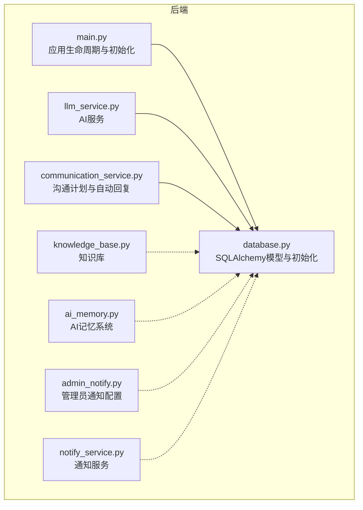
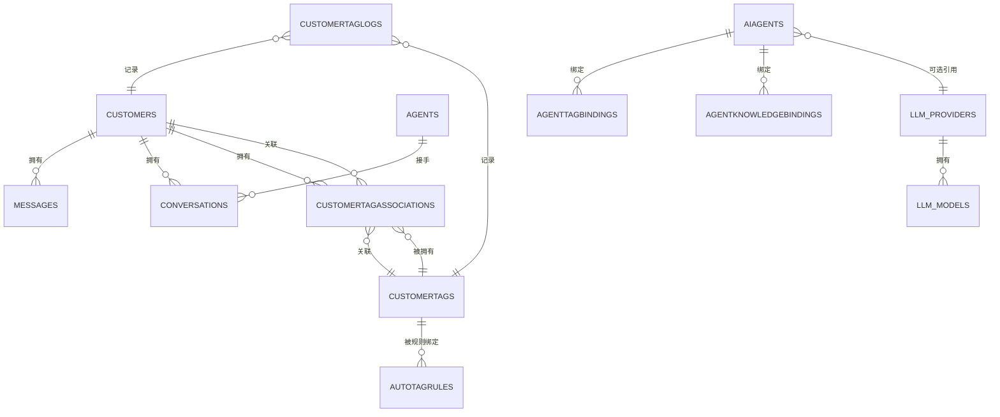
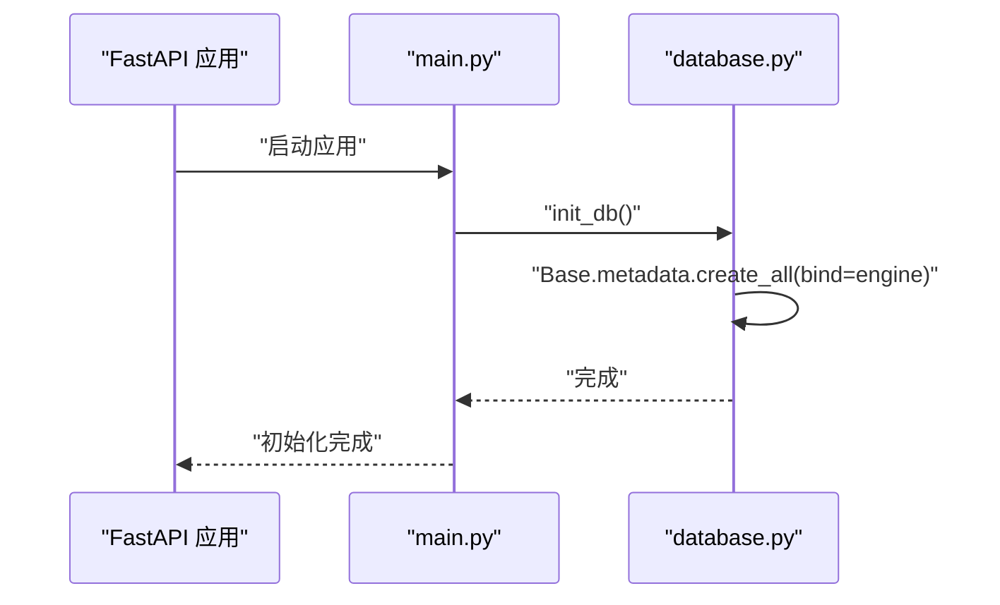
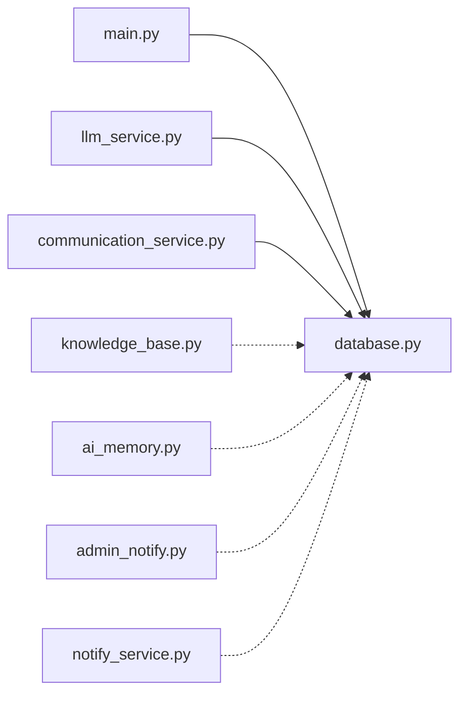

# 数据库模型

<cite>
**本文引用的文件**
- [database.py](file://backend/database.py)
- [main.py](file://backend/main.py)
- [llm_service.py](file://backend/llm_service.py)
- [communication_service.py](file://backend/communication_service.py)
- [knowledge_base.py](file://backend/knowledge_base.py)
- [ai_memory.py](file://backend/ai_memory.py)
- [admin_notify.py](file://backend/admin_notify.py)
- [notify_service.py](file://backend/notify_service.py)
</cite>

## 更新摘要
**变更内容**
- 新增AI记忆系统支持，包括沟通技巧和成交模式的记忆存储
- 新增管理员通知配置系统，支持SQLite持久化和Web Push通知
- 新增通知服务，支持关键词匹配、首次回复检测和每日报告
- 更新数据库初始化流程以支持新的数据存储结构

## 目录
1. [简介](#简介)
2. [项目结构](#项目结构)
3. [核心组件](#核心组件)
4. [架构总览](#架构总览)
5. [详细组件分析](#详细组件分析)
6. [AI记忆系统](#ai记忆系统)
7. [通知系统](#通知系统)
8. [依赖分析](#依赖分析)
9. [性能考虑](#性能考虑)
10. [故障排查指南](#故障排查指南)
11. [结论](#结论)
12. [附录](#附录)

## 简介
本文件面向数据库模型与ORM设计，聚焦于SQLAlchemy ORM模型的字段定义、数据类型、约束条件、实体关系映射（一对一、一对多、多对多），以及CustomerTagAssociation等关联表的设计原理与使用场景。同时提供数据库初始化流程、表结构变更与迁移建议、查询优化策略、索引设计原则、事务处理机制、CRUD操作示例与最佳实践，帮助开发者快速理解并高效维护该系统的数据层。

**更新** 新增AI记忆系统和通知功能的数据存储结构，包括JSON文件存储和SQLite配置表。

## 项目结构
数据库模型集中在 backend/database.py 中，通过SQLAlchemy声明式基类定义各实体，并在 backend/main.py 中通过生命周期钩子完成数据库初始化；业务侧（如AI回复、知识库、沟通计划、通知系统）在其他模块中通过SQLAlchemy会话访问数据库。

**图表来源**
- [database.py:1-298](file://backend/database.py#L1-L298)
- [main.py:88-126](file://backend/main.py#L88-L126)

**章节来源**
- [database.py:1-298](file://backend/database.py#L1-L298)
- [main.py:88-126](file://backend/main.py#L88-L126)

## 核心组件
本节概述核心实体及其职责：
- 客户(Customer)：存储客户基本信息、状态与标签关联
- 消息(Message)：存储与客户的来往消息、方向、类型与已读标记
- 会话(Conversation)：记录与客户的会话状态、分配的客服、最后消息时间
- 销售员/客服(Agent)：客服人员信息与在线状态
- 沟通计划(CommunicationPlan)：自动沟通策略模板
- 计划执行记录(PlanExecution)：每次计划执行的状态与时间
- 客户标签(CustomerTag)：标签定义与颜色
- 客户-标签关联(CustomerTagAssociation)：多对多关联表
- 自动打标签规则(AutoTagRule)：基于条件自动打标签
- 客户标签日志(CustomerTagLog)：标签变更审计
- AI智能体(AIAgent)：智能体配置、系统提示词、模型参数、默认/优先级
- 智能体-标签绑定(AgentTagBinding)：智能体与标签的匹配关系
- 智能体-知识库绑定(AgentKnowledgeBinding)：智能体与知识库文档的绑定
- 大模型提供商(LLMProvider)：提供商配置、默认模型、超时等
- 大模型(LLMModel)：提供商下的具体模型

**新增组件**
- AI记忆系统：沟通技巧和成交模式的记忆存储
- 管理员通知配置：管理员手机号和通知规则的SQLite配置
- 通知服务：商机事件检测和通知发送

**章节来源**
- [database.py:23-288](file://backend/database.py#L23-L288)

## 架构总览
下图展示核心实体之间的关系映射，涵盖一对一、一对多与多对多关系。

**图表来源**
- [database.py:23-288](file://backend/database.py#L23-L288)

## 详细组件分析

### 实体与字段定义、约束与索引
以下为关键实体的字段、数据类型与约束概览（字段名、类型、是否主键、唯一性、索引、外键、默认值、触发更新等）。为避免冗长，仅列出关键字段与约束。

- 客户(Customer)
  - 字段：id(主键, 索引), phone(唯一, 索引), name, category, status, notes, created_at, updated_at(onupdate)
  - 关系：messages(一对多), conversations(一对多), tags(多对多)
  - 约束：phone唯一；category/status枚举化字符串；created_at默认当前时间；updated_at自动更新

- 消息(Message)
  - 字段：id(主键, 索引), customer_id(FK), wa_message_id(唯一, 索引), content, direction, sender_name, message_type, is_read, created_at
  - 关系：customer(多对一)
  - 约束：wa_message_id唯一；direction枚举化字符串；is_read布尔；created_at默认当前时间

- 会话(Conversation)
  - 字段：id(主键, 索引), customer_id(FK), status, assigned_agent_id(FK), last_message_at, created_at
  - 关系：customer(多对一), agent(多对一)
  - 约束：status枚举化字符串；last_message_at可空；created_at默认当前时间

- 销售员/客服(Agent)
  - 字段：id(主键, 索引), name, email(唯一, 索引), phone, password_hash, web_push_subscription, is_online, is_active, created_at
  - 关系：conversations(一对多)
  - 约束：email唯一；is_online/is_active布尔；created_at默认当前时间

- 沟通计划(CommunicationPlan)
  - 字段：id(主键, 索引), name, category, trigger_type, trigger_delay_minutes, message_template, is_active, created_at
  - 关系：executions(一对多)
  - 约束：trigger_type枚举化字符串；is_active布尔；trigger_delay_minutes非负整数

- 计划执行记录(PlanExecution)
  - 字段：id(主键, 索引), plan_id(FK), customer_id(FK), status, scheduled_at, executed_at, error_message
  - 关系：plan(多对一)
  - 约束：status枚举化字符串；scheduled_at/executed_at可空

- 客户标签(CustomerTag)
  - 字段：id(主键, 索引), name(唯一), color, description, is_active, created_at
  - 关系：customers(多对多)
  - 约束：name唯一；is_active布尔；color为十六进制颜色码

- 客户-标签关联(CustomerTagAssociation)
  - 字段：id(主键, 索引), customer_id(FK), tag_id(FK), created_at
  - 关系：customer(多对一), tag(多对一)
  - 约束：created_at默认当前时间

- 自动打标签规则(AutoTagRule)
  - 字段：id(主键, 索引), name, tag_id(FK), condition_type, condition_config(JSON), is_active, priority, created_at, updated_at
  - 关系：tag(多对一)
  - 约束：condition_type枚举化字符串；condition_config为JSON；priority整数

- 客户标签日志(CustomerTagLog)
  - 字段：id(主键, 索引), customer_id(FK), tag_id(FK), action, source, source_id, created_at
  - 关系：无显式关系（仅外键）
  - 约束：action枚举化字符串；source/source_id可空

- AI智能体(AIAgent)
  - 字段：id(主键, 索引), name, description, system_prompt, llm_provider_id(FK), llm_model_id, temperature, max_tokens, is_active, is_default, priority, created_at, updated_at
  - 关系：tag_bindings(一对多), knowledge_bindings(一对多), llm_provider(多对一)
  - 约束：is_active/is_default布尔；priority整数；temperature/max_tokens可空

- 智能体-标签绑定(AgentTagBinding)
  - 字段：id(主键, 索引), agent_id(FK), tag_id(FK), created_at
  - 关系：agent(多对一), tag(多对一)

- 智能体-知识库绑定(AgentKnowledgeBinding)
  - 字段：id(主键, 索引), agent_id(FK), knowledge_doc_id, created_at
  - 关系：agent(多对一)

- 大模型提供商(LLMProvider)
  - 字段：id(主键, 索引), name, provider_type, api_key, base_url, default_model, is_active, is_default, temperature, max_tokens, timeout, created_at, updated_at
  - 约束：provider_type枚举化字符串；is_active/is_default布尔；timeout秒数

- 大模型(LLMModel)
  - 字段：id(主键, 索引), provider_id(FK), name, model_id, is_active, description, created_at
  - 关系：provider(多对一)

**章节来源**
- [database.py:23-288](file://backend/database.py#L23-L288)

### 关系映射与设计要点
- 一对一
  - Conversation.assigned_agent_id → Agent.id
  - AIAgent.llm_provider_id → LLMProvider.id
- 一对多
  - Customer.messages ← Message.customer_id
  - Customer.conversations ← Conversation.customer_id
  - Agent.conversations ← Conversation.assigned_agent_id
  - CommunicationPlan.executions ← PlanExecution.plan_id
  - CustomerTag.customers ← CustomerTagAssociation.tag_id
  - LLMProvider.llm_models ← LLMModel.provider_id
- 多对多
  - Customer ↔ CustomerTag 通过 CustomerTagAssociation 关联
  - AIAgent 与 CustomerTag 通过 AgentTagBinding 关联
  - AIAgent 与知识库文档通过 AgentKnowledgeBinding 关联（以knowledge_doc_id标识）

CustomerTagAssociation 的设计原理：
- 采用独立的关联表，支持客户与标签的灵活多对多关系
- 通过 created_at 记录绑定时间，便于审计与统计
- 在 Customer 上动态挂载 relationship，实现"tags"属性访问

**章节来源**
- [database.py:141-153](file://backend/database.py#L141-L153)
- [database.py:250-251](file://backend/database.py#L250-L251)

### 查询优化策略与索引设计原则
- 索引设计
  - 主键列默认具备索引，无需额外标注
  - 常用于过滤/连接的列已设置 index=True 或 unique=True：
    - customers.phone、messages.wa_message_id、agents.email、customer_tags.name、auto_tag_rules.tag_id、customer_tag_logs.customer_id/tag_id
  - 建议对高频查询列补充复合索引（如：customers.status+updated_at、messages.customer_id+created_at）
- 查询模式
  - 使用 join 与 select_from 减少 N+1 查询
  - 对分页查询使用 limit+offset 或基于游标的方式（结合 created_at/updated_at）
  - 对聚合统计使用 group_by 与 count
- 缓存与去重
  - 对重复查询结果进行短期缓存（如最近消息、标签列表）
  - 对重复关键词/标签进行去重处理
- 事务与并发
  - 使用 SQLAlchemy 会话进行事务控制，批量写入时合并提交
  - 对高并发写入场景使用锁或幂等插入（如基于唯一键的 upsert）

**章节来源**
- [database.py:27-28](file://backend/database.py#L27-L28)
- [database.py:46-47](file://backend/database.py#L46-L47)
- [database.py:79-81](file://backend/database.py#L79-L81)
- [database.py:130-131](file://backend/database.py#L130-L131)
- [database.py:281-283](file://backend/database.py#L281-L283)

### 事务处理机制
- 会话管理
  - 通过 get_db() 提供的依赖注入获取 Session，确保每个请求一个会话
  - 会话在 try/finally 中关闭，避免资源泄漏
- 事务边界
  - 写操作（新增/更新/删除）需在 commit() 前确保数据正确
  - 对批量写入使用一次性 commit()，减少事务开销
- 异常处理
  - 将异常包装为 HTTPException，避免泄露内部错误
  - 对并发冲突（唯一键冲突）进行捕获与重试或提示

**章节来源**
- [database.py:290-296](file://backend/database.py#L290-L296)
- [main.py:508-554](file://backend/main.py#L508-L554)

### 数据库初始化流程
- 初始化入口
  - 应用启动时调用 init_db() 创建所有表
- 初始化步骤
  - 读取 DATABASE_URL（默认SQLite，支持绝对路径）
  - 创建 engine 与 SessionLocal
  - 调用 Base.metadata.create_all(bind=engine) 创建表
- 生命周期
  - FastAPI lifespan 钩子在应用启动时执行 init_db()

**图表来源**
- [main.py:88-126](file://backend/main.py#L88-L126)
- [database.py:254-256](file://backend/database.py#L254-L256)

**章节来源**
- [main.py:88-126](file://backend/main.py#L88-L126)
- [database.py:254-256](file://backend/database.py#L254-L256)

### 表结构变更与迁移建议
- 变更策略
  - 优先使用 Alembic 进行结构迁移（推荐）
  - 若无 Alembic，可先备份数据库，再重建表（谨慎操作）
- 常见变更
  - 新增字段：添加 Column，必要时设置默认值与可空性
  - 修改字段：注意数据类型兼容与默认值
  - 删除字段：先迁移数据，再删除列
  - 唯一键变更：评估现有数据，必要时重建索引
- 回滚与验证
  - 变更前后对比索引与约束
  - 验证关键查询路径（如客户列表、消息历史、会话状态）

**章节来源**
- [database.py:14-18](file://backend/database.py#L14-L18)

### CRUD 操作示例与最佳实践
以下示例以路径形式给出，避免直接粘贴代码内容。请在实际业务中遵循依赖注入与事务边界。

- 新增客户
  - 路径：[main.py:419-426](file://backend/main.py#L419-L426)
  - 最佳实践：校验电话号码唯一性，设置默认分类与状态
- 更新客户分类
  - 路径：[main.py:573-578](file://backend/main.py#L573-L578)
  - 最佳实践：先查询再更新，最后 commit
- 获取客户消息历史
  - 路径：[main.py:585-598](file://backend/main.py#L585-L598)
  - 最佳实践：按时间倒序分页，标记已读
- 发送消息给客户
  - 路径：[main.py:601-633](file://backend/main.py#L601-L633)
  - 最佳实践：先调用 WhatsApp 客户端，成功后再入库
- 获取会话列表并关联客户信息
  - 路径：[main.py:638-664](file://backend/main.py#L638-L664)
  - 最佳实践：使用 join 查询，避免 N+1
- AI智能回复生成与发送
  - 路径：[main.py:727-795](file://backend/main.py#L727-L795)
  - 最佳实践：先获取历史消息与知识库，再调用 LLM 服务，最后入库

**章节来源**
- [main.py:419-426](file://backend/main.py#L419-L426)
- [main.py:573-578](file://backend/main.py#L573-L578)
- [main.py:585-598](file://backend/main.py#L585-L598)
- [main.py:601-633](file://backend/main.py#L601-L633)
- [main.py:638-664](file://backend/main.py#L638-L664)
- [main.py:727-795](file://backend/main.py#L727-L795)

### 智能体与知识库集成
- 智能体选择
  - 根据客户标签匹配 AgentTagBinding，按优先级选择 AIAgent
  - 路径：[llm_service.py:52-84](file://backend/llm_service.py#L52-L84)
- 模型选择
  - 优先使用 AIAgent 指定模型，其次 LLMProvider 默认模型，最后系统默认
  - 路径：[llm_service.py:41-50](file://backend/llm_service.py#L41-L50)
- 知识库检索
  - 从知识库获取相关文档，拼接到系统提示词
  - 路径：[llm_service.py:101-116](file://backend/llm_service.py#L101-L116)
- 沟通计划执行
  - 通过 CommunicationService 执行计划，支持自动回复与转人工
  - 路径：[communication_service.py:47-71](file://backend/communication_service.py#L47-L71)

**章节来源**
- [llm_service.py:41-84](file://backend/llm_service.py#L41-L84)
- [llm_service.py:101-116](file://backend/llm_service.py#L101-L116)
- [communication_service.py:47-71](file://backend/communication_service.py#L47-L71)

## AI记忆系统

### 系统概述
AI记忆系统通过JSON文件存储沟通经验和成交模式，支持对话总结、经验提取和模式识别，持续优化AI回复质量。

### 数据存储结构
- 存储位置：`backend/data/ai_memory/`
- 文件类型：
  - `communication_skills.json`：沟通技巧沉淀
  - `deal_patterns.json`：成交/失单模式记录

### 核心功能
- **沟通技巧提取**：从对话中提取有效话术和引导技巧
- **成交模式识别**：识别成单、未成单和跟进中的模式
- **经验注入**：将历史经验注入AI系统提示词
- **容量限制**：沟通技巧最多50条，成交模式最多30条

### API接口
- `get_communication_tips(limit: int = 3)`：获取最近的沟通经验
- `get_all_memories()`：获取全部记忆内容
- `delete_memory_entry(memory_type: str, index: int)`：删除指定记忆
- `clear_all_memories()`：清空所有记忆
- `summarize_conversation(customer_id: int, messages: List[dict])`：总结对话

### 集成方式
AI记忆系统通过`get_communication_tips()`函数集成到AI回复流程中，自动将最近的经验注入到系统提示词中。

**章节来源**
- [ai_memory.py:1-182](file://backend/ai_memory.py#L1-L182)
- [communication_service.py:349-356](file://backend/communication_service.py#L349-L356)

## 通知系统

### 系统概述
通知系统提供管理员通知配置和实时通知功能，支持关键词匹配、首次回复检测和每日报告发送。

### 数据存储结构
- 存储位置：`backend/data/admin_notify.db`（SQLite数据库）
- 表结构：
  - `admins`：管理员表（id, name, phone, enabled, created_at）
  - `notify_rules`：通知规则表（id, name, description, event_type, keywords, enabled, extra）

### 通知规则类型
- **首次回复**：客户第一次向机器人发送消息时通知
- **关键词匹配**：消息中包含特定关键词时通知
- **每日报告**：每天固定时间发送统计报告

### 核心功能
- **管理员管理**：添加、编辑、删除管理员
- **规则配置**：自定义通知规则和关键词
- **实时通知**：通过WhatsApp向管理员发送通知
- **每日报告**：统计今日联系客户、回复客户和新增客户数量

### API接口
- `check_and_notify()`：检查消息并发送通知
- `send_daily_report()`：生成并发送每日报告
- 管理员CRUD：添加、获取、更新、删除管理员
- 规则CRUD：获取规则、更新规则、添加自定义规则、删除自定义规则

### 集成方式
通知服务通过`get_notify_service()`获取实例，在消息处理流程中调用`check_and_notify()`进行商机检测和通知发送。

**章节来源**
- [admin_notify.py:1-235](file://backend/admin_notify.py#L1-L235)
- [notify_service.py:1-195](file://backend/notify_service.py#L1-L195)
- [communication_service.py:30-63](file://backend/communication_service.py#L30-L63)

## 依赖分析
- 模块耦合
  - database.py 为核心数据层，被 main.py、llm_service.py、communication_service.py 等广泛依赖
  - main.py 通过依赖注入提供数据库会话，贯穿所有API路由
  - llm_service.py 与 communication_service.py 通过数据库查询选择智能体与执行计划
  - **新增**：ai_memory.py 和 notify_service.py 作为独立模块被其他组件调用
- 外部依赖
  - SQLAlchemy ORM 与引擎配置
  - FastAPI 依赖注入与生命周期管理
  - 外部 LLM API（通过 httpx 调用）
  - **新增**：SQLite数据库用于通知配置存储

**图表来源**
- [main.py:17](file://backend/main.py#L17)
- [llm_service.py:7](file://backend/llm_service.py#L7)
- [communication_service.py:8-11](file://backend/communication_service.py#L8-L11)

**章节来源**
- [main.py:17](file://backend/main.py#L17)
- [llm_service.py:7](file://backend/llm_service.py#L7)
- [communication_service.py:8-11](file://backend/communication_service.py#L8-L11)

## 性能考虑
- 查询性能
  - 对高频过滤列（如 customers.status、messages.customer_id、conversations.status）建立索引
  - 使用 select_from 与 join 减少 N+1 查询
  - 分页查询使用基于时间戳的游标分页
- 写入性能
  - 批量写入合并提交，减少事务次数
  - 对唯一键冲突进行幂等处理
- 缓存策略
  - 对标签列表、智能体配置、知识库检索结果进行短期缓存
  - **新增**：AI记忆系统使用文件缓存，限制最大条目数量
- 并发控制
  - 使用会话与事务边界控制并发写入
  - 对高并发场景使用锁或重试机制
  - **新增**：通知系统使用SQLite连接池，支持并发访问

## 故障排查指南
- 数据库初始化失败
  - 检查 DATABASE_URL 环境变量与文件权限
  - 确认 SQLite 文件路径存在且可写
  - 路径：[database.py:12](file://backend/database.py#L12)
- 查询异常
  - 检查外键约束与唯一键冲突
  - 使用 SQLAlchemy 日志（echo=True）定位SQL问题
  - 路径：[database.py:17](file://backend/database.py#L17)
- 事务未提交
  - 确保在 try/finally 中关闭会话
  - 路径：[database.py:290-296](file://backend/database.py#L290-L296)
- AI回复失败
  - 检查 LLMProvider 配置与网络连通性
  - 路径：[llm_service.py:149-175](file://backend/llm_service.py#L149-L175)
- **新增**：AI记忆系统故障
  - 检查 `backend/data/ai_memory/` 目录权限
  - 确认JSON文件格式正确
  - 路径：[ai_memory.py:17-51](file://backend/ai_memory.py#L17-L51)
- **新增**：通知系统故障
  - 检查 `backend/data/admin_notify.db` 文件权限
  - 确认SQLite数据库连接正常
  - 路径：[admin_notify.py:13](file://backend/admin_notify.py#L13)

**章节来源**
- [database.py:12](file://backend/database.py#L12)
- [database.py:17](file://backend/database.py#L17)
- [database.py:290-296](file://backend/database.py#L290-L296)
- [llm_service.py:149-175](file://backend/llm_service.py#L149-L175)
- [ai_memory.py:17-51](file://backend/ai_memory.py#L17-L51)
- [admin_notify.py:13](file://backend/admin_notify.py#L13)

## 结论
该数据库模型围绕客户、消息、会话、标签与智能体构建，采用清晰的一对多与多对多关系映射，配合索引与事务机制，满足WhatsApp智能客服系统的核心业务需求。通过依赖注入与生命周期管理，实现了良好的可维护性与扩展性。

**更新** 新增的AI记忆系统和通知功能进一步增强了系统的智能化水平，通过JSON文件存储和SQLite配置实现了轻量级的数据持久化。建议后续引入 Alembic 进行结构迁移，并持续优化查询与缓存策略以提升性能。

## 附录
- 关键路径速查
  - 数据库初始化：[database.py:254-256](file://backend/database.py#L254-L256)
  - 会话管理：[main.py:638-700](file://backend/main.py#L638-L700)
  - 消息发送：[main.py:601-633](file://backend/main.py#L601-L633)
  - AI回复生成：[main.py:727-795](file://backend/main.py#L727-L795)
  - 智能体选择：[llm_service.py:52-84](file://backend/llm_service.py#L52-L84)
  - **新增**：AI记忆系统API：[ai_memory.py:55-101](file://backend/ai_memory.py#L55-L101)
  - **新增**：通知系统API：[notify_service.py:29-98](file://backend/notify_service.py#L29-L98)
  - **新增**：管理员通知配置：[admin_notify.py:108-224](file://backend/admin_notify.py#L108-L224)