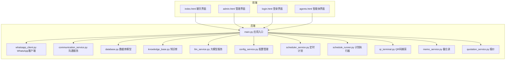
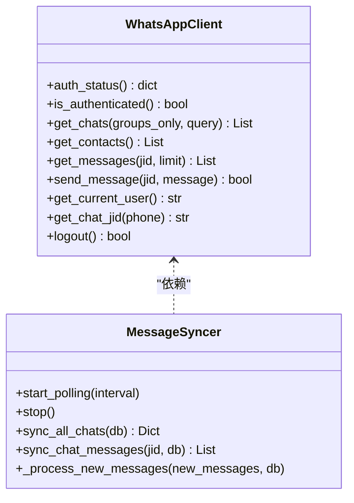
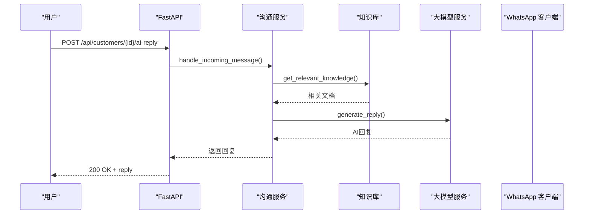
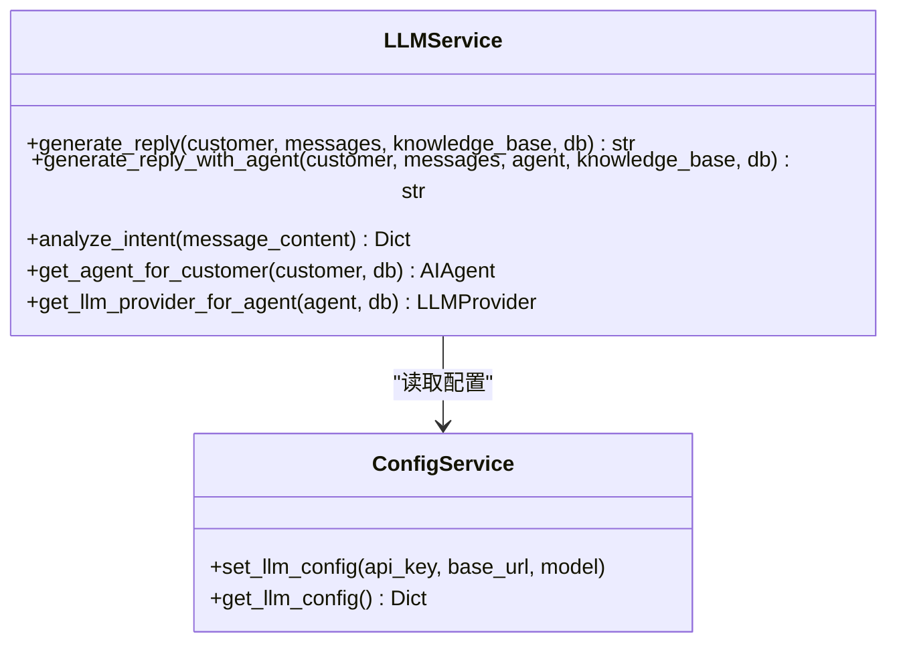
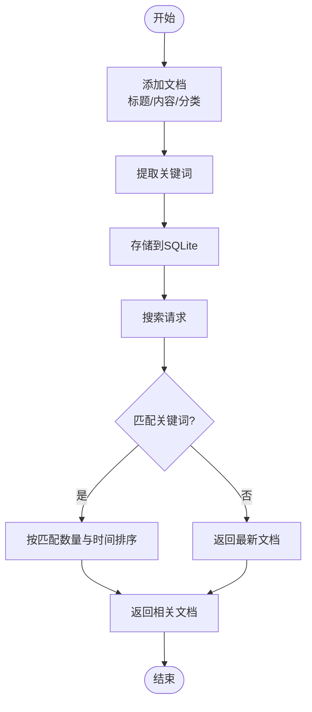
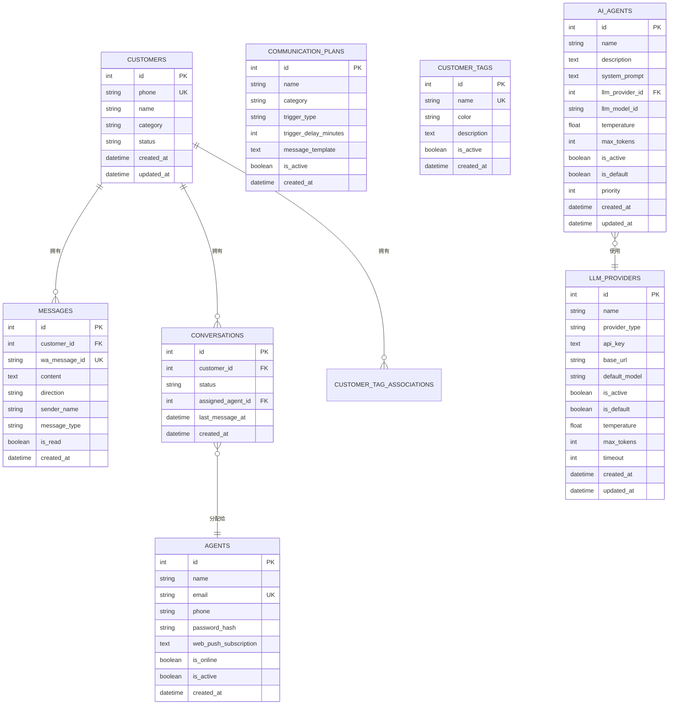
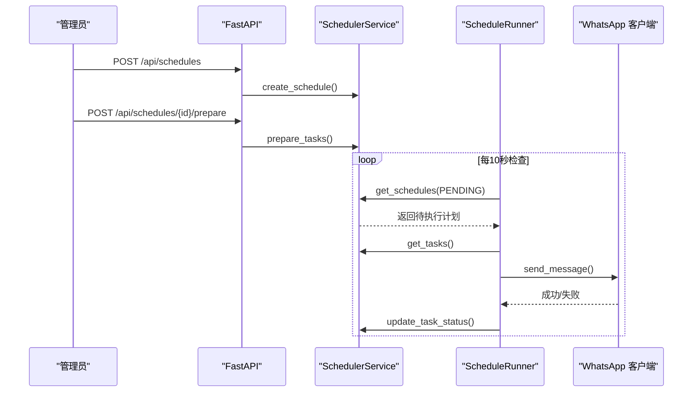
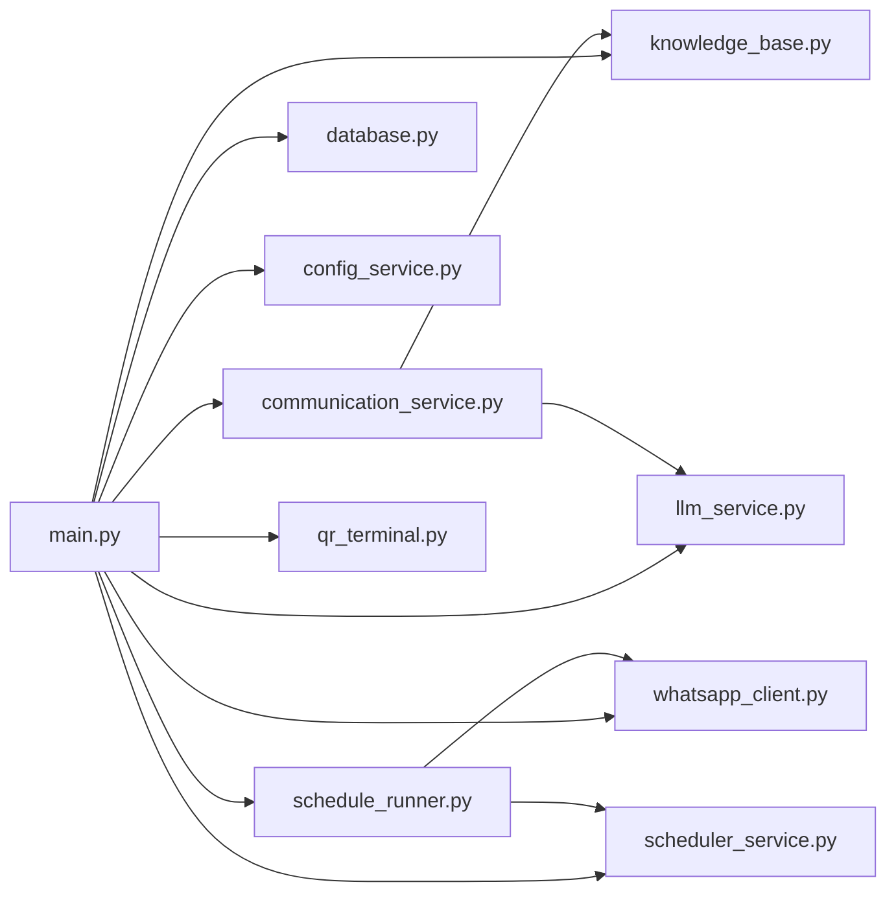

# 核心模块

<cite>
**本文引用的文件**
- [backend/main.py](file://backend/main.py)
- [backend/whatsapp_client.py](file://backend/whatsapp_client.py)
- [backend/communication_service.py](file://backend/communication_service.py)
- [backend/database.py](file://backend/database.py)
- [backend/knowledge_base.py](file://backend/knowledge_base.py)
- [backend/llm_service.py](file://backend/llm_service.py)
- [backend/config_service.py](file://backend/config_service.py)
- [backend/scheduler_service.py](file://backend/scheduler_service.py)
- [backend/schedule_runner.py](file://backend/schedule_runner.py)
- [backend/qr_terminal.py](file://backend/qr_terminal.py)
- [backend/memo_service.py](file://backend/memo_service.py)
- [backend/quotation_service.py](file://backend/quotation_service.py)
- [backend/static/index.html](file://backend/static/index.html)
- [backend/static/admin.html](file://backend/static/admin.html)
- [backend/static/login.html](file://backend/static/login.html)
- [backend/static/agents.html](file://backend/static/agents.html)
- [start_server.py](file://start_server.py)
- [login_whatsapp.py](file://login_whatsapp.py)
- [bot.py](file://bot.py)
</cite>

## 目录
1. [简介](#简介)
2. [项目结构](#项目结构)
3. [核心组件](#核心组件)
4. [架构总览](#架构总览)
5. [详细组件分析](#详细组件分析)
6. [依赖分析](#依赖分析)
7. [性能考虑](#性能考虑)
8. [故障排除指南](#故障排除指南)
9. [结论](#结论)
10. [附录](#附录)

## 简介
本项目是一个基于 WhatsApp CLI 的智能客户关系管理系统，提供客户管理、消息同步、智能回复、人工客服协作、知识库检索、定时发送计划、配置管理等功能。系统采用 FastAPI 提供 REST API 和 WebSocket 实时推送，前端使用纯 HTML/CSS/JavaScript 实现管理界面与聊天界面。

## 项目结构
后端采用模块化设计，核心模块包括：
- 应用入口与路由：backend/main.py
- WhatsApp 客户端与消息同步：backend/whatsapp_client.py
- 沟通服务与通知：backend/communication_service.py
- 数据库与模型：backend/database.py
- 知识库系统：backend/knowledge_base.py
- 大语言模型服务：backend/llm_service.py
- 配置管理：backend/config_service.py
- 定时发送计划：backend/scheduler_service.py + backend/schedule_runner.py
- QR 码登录捕获：backend/qr_terminal.py
- 备忘录与报价辅助：backend/memo_service.py + backend/quotation_service.py
- 前端静态页面：backend/static/*



**图表来源**
- [backend/main.py](file://backend/main.py)
- [backend/whatsapp_client.py](file://backend/whatsapp_client.py)
- [backend/communication_service.py](file://backend/communication_service.py)
- [backend/database.py](file://backend/database.py)
- [backend/knowledge_base.py](file://backend/knowledge_base.py)
- [backend/llm_service.py](file://backend/llm_service.py)
- [backend/config_service.py](file://backend/config_service.py)
- [backend/scheduler_service.py](file://backend/scheduler_service.py)
- [backend/schedule_runner.py](file://backend/schedule_runner.py)
- [backend/qr_terminal.py](file://backend/qr_terminal.py)
- [backend/memo_service.py](file://backend/memo_service.py)
- [backend/quotation_service.py](file://backend/quotation_service.py)
- [backend/static/index.html](file://backend/static/index.html)
- [backend/static/admin.html](file://backend/static/admin.html)
- [backend/static/login.html](file://backend/static/login.html)
- [backend/static/agents.html](file://backend/static/agents.html)

**章节来源**
- [backend/main.py](file://backend/main.py)
- [backend/whatsapp_client.py](file://backend/whatsapp_client.py)
- [backend/communication_service.py](file://backend/communication_service.py)
- [backend/database.py](file://backend/database.py)
- [backend/knowledge_base.py](file://backend/knowledge_base.py)
- [backend/llm_service.py](file://backend/llm_service.py)
- [backend/config_service.py](file://backend/config_service.py)
- [backend/scheduler_service.py](file://backend/scheduler_service.py)
- [backend/schedule_runner.py](file://backend/schedule_runner.py)
- [backend/qr_terminal.py](file://backend/qr_terminal.py)
- [backend/memo_service.py](file://backend/memo_service.py)
- [backend/quotation_service.py](file://backend/quotation_service.py)
- [backend/static/index.html](file://backend/static/index.html)
- [backend/static/admin.html](file://backend/static/admin.html)
- [backend/static/login.html](file://backend/static/login.html)
- [backend/static/agents.html](file://backend/static/agents.html)

## 核心组件
- 应用入口与路由：负责初始化数据库、WhatsApp 客户端、消息同步器与定时执行器，提供认证、客户、消息、会话、沟通计划、AI 回复等 API，以及 WebSocket 实时推送。
- WhatsApp 客户端与消息同步：封装 whatsapp-cli，提供登录状态检查、联系人/聊天/消息获取、发送消息、持续同步等能力，并实现消息轮询与新消息处理。
- 沟通服务与通知：处理自动回复、转人工、自动打标签、计划执行、通知人工客服等业务逻辑。
- 数据库与模型：定义客户、消息、会话、销售员、沟通计划、标签、智能体、提供商等模型及关系。
- 知识库系统：基于 SQLite 的文档管理与关键词检索，支持添加、搜索、删除文档。
- 大语言模型服务：统一接入多提供商（OpenAI、Claude 等），支持智能体配置、系统提示词、参数覆盖、意图分析等。
- 配置管理：安全存储 API Key 等敏感配置，支持加密存储与查询。
- 定时发送计划：支持按标签筛选客户、定时逐个发送消息，具备暂停/恢复/统计等能力。
- QR 码登录捕获：在终端中捕获并渲染 QR 码，支持登录流程监控与回调。
- 备忘录与报价：提供销售备忘录的增删改查与搜索，以及报价单的材料管理与报价生成。

**章节来源**
- [backend/main.py](file://backend/main.py)
- [backend/whatsapp_client.py](file://backend/whatsapp_client.py)
- [backend/communication_service.py](file://backend/communication_service.py)
- [backend/database.py](file://backend/database.py)
- [backend/knowledge_base.py](file://backend/knowledge_base.py)
- [backend/llm_service.py](file://backend/llm_service.py)
- [backend/config_service.py](file://backend/config_service.py)
- [backend/scheduler_service.py](file://backend/scheduler_service.py)
- [backend/schedule_runner.py](file://backend/schedule_runner.py)
- [backend/qr_terminal.py](file://backend/qr_terminal.py)
- [backend/memo_service.py](file://backend/memo_service.py)
- [backend/quotation_service.py](file://backend/quotation_service.py)

## 架构总览
系统采用“后端 API + 前端静态页面”的架构，后端通过 FastAPI 提供 REST API 与 WebSocket，前端通过 AJAX 调用 API 并通过 WebSocket 实时接收新消息。

```mermaid
graph TB
Client[浏览器客户端] --> API[FastAPI 后端]
API --> DB[(SQLite/数据库)]
API --> WA[WhatsApp CLI]
API --> LLM[大模型服务]
API --> KB[知识库]
API --> Sched[定时计划]
API --> Noti[通知服务]
Client <- --> WS[WebSocket 实时推送]
```

**图表来源**
- [backend/main.py](file://backend/main.py)
- [backend/database.py](file://backend/database.py)
- [backend/whatsapp_client.py](file://backend/whatsapp_client.py)
- [backend/llm_service.py](file://backend/llm_service.py)
- [backend/knowledge_base.py](file://backend/knowledge_base.py)
- [backend/scheduler_service.py](file://backend/scheduler_service.py)
- [backend/communication_service.py](file://backend/communication_service.py)

## 详细组件分析

### WhatsApp 客户端模块
- 功能职责
  - 登录状态检查与认证
  - 联系人与聊天列表获取
  - 历史消息拉取与发送
  - JID 格式处理与备用方案
  - 持续同步与实时消息捕获
  - 消息轮询与新消息处理
- 实现原理
  - 通过子进程调用 whatsapp-cli，统一 JSON 输出格式
  - 提供异步/同步两种执行方式，适配不同场景
  - 消息同步器定期轮询，避免频繁请求，同时支持实时 follow 模式
- 使用方法
  - 初始化客户端后调用 auth_status/is_authenticated 检查登录
  - 使用 get_contacts/get_chats/get_messages 获取数据
  - 使用 send_message 发送消息，内部自动处理 JID 格式
- API 接口
  - GET /api/auth/status：获取登录状态
  - POST /api/auth/qr：获取 QR 码并启动登录
  - GET /api/auth/qr/status：获取 QR 码状态
  - POST /api/auth/qr/cancel：取消登录
  - POST /api/auth/logout：退出登录
  - POST /api/auth/sync-contacts：同步联系人
- 配置选项
  - CLI 路径与存储目录
  - 超时与格式化参数
- 使用示例
  - 登录：POST /api/auth/qr -> GET /api/auth/qr/status -> GET /api/status
  - 发送消息：POST /api/customers/{id}/messages
- 最佳实践
  - 发送前检查 JID 格式，必要时使用备用后缀
  - 轮询间隔建议不低于 1 秒，避免过度请求
  - 处理异常与超时，确保进程安全退出



**图表来源**
- [backend/whatsapp_client.py](file://backend/whatsapp_client.py)

**章节来源**
- [backend/whatsapp_client.py](file://backend/whatsapp_client.py)
- [backend/main.py](file://backend/main.py)

### 通信服务模块
- 功能职责
  - 自动回复：根据客户分类与历史消息生成回复
  - 转人工请求识别与处理
  - 自动打标签：基于规则为客户打标签
  - 沟通计划执行：手动与定时执行
  - 通知人工：向在线客服推送新消息
- 实现原理
  - 沟通服务根据消息方向与客户状态决定是否自动回复
  - 使用知识库与 LLM 生成智能回复
  - 通知服务通过 WhatsApp 发送提醒给客服
- API 接口
  - POST /api/customers/{customer_id}/ai-reply：生成 AI 回复
  - POST /api/customers/{customer_id}/messages/ai-send：生成并发送 AI 回复
  - GET /api/plans：获取沟通计划列表
  - POST /api/plans/{plan_id}/execute/{customer_id}：手动执行沟通计划
  - POST /api/conversations/{conversation_id}/handover：客服接手会话
  - POST /api/conversations/{conversation_id}/close：关闭会话
- 使用示例
  - 生成 AI 回复：POST /api/customers/{id}/ai-reply
  - 手动执行计划：POST /api/plans/{plan_id}/execute/{customer_id}
- 最佳实践
  - 合理设置自动回复间隔，避免骚扰客户
  - 使用意图分析提升转人工判断准确性
  - 为不同客户分类配置差异化回复模板



**图表来源**
- [backend/communication_service.py](file://backend/communication_service.py)
- [backend/knowledge_base.py](file://backend/knowledge_base.py)
- [backend/llm_service.py](file://backend/llm_service.py)
- [backend/main.py](file://backend/main.py)

**章节来源**
- [backend/communication_service.py](file://backend/communication_service.py)
- [backend/main.py](file://backend/main.py)

### 大语言模型服务模块
- 功能职责
  - 多提供商支持：OpenAI、Claude、DeepSeek 等
  - 智能体配置：系统提示词、模型参数、标签绑定
  - 意图分析：识别用户意图与紧急程度
- 实现原理
  - 通过配置服务读取 API Key 与 Base URL
  - 根据客户标签与智能体优先级选择合适的模型
  - 支持参数覆盖（智能体 > 提供商 > 默认）
- API 接口
  - POST /api/customers/{customer_id}/ai-reply：生成 AI 回复
  - POST /api/customers/{customer_id}/messages/ai-send：生成并发送 AI 回复
- 使用示例
  - 配置提供商：在管理界面设置提供商与默认模型
  - 创建智能体：配置系统提示词与标签绑定
- 最佳实践
  - 为不同标签配置专用智能体
  - 控制温度与最大 Token，平衡创意与稳定性
  - 使用知识库增强上下文



**图表来源**
- [backend/llm_service.py](file://backend/llm_service.py)
- [backend/config_service.py](file://backend/config_service.py)

**章节来源**
- [backend/llm_service.py](file://backend/llm_service.py)
- [backend/config_service.py](file://backend/config_service.py)

### 知识库模块
- 功能职责
  - 文档管理：添加、搜索、删除文档
  - 智能检索：基于关键词匹配与相似度排序
- 实现原理
  - 使用 SQLite 存储文档与关键词索引
  - 关键词提取与匹配，返回相关文档片段
- API 接口
  - GET /api/knowledge/documents：获取所有文档
  - POST /api/knowledge/documents：添加文档
  - DELETE /api/knowledge/documents/{id}：删除文档
- 使用示例
  - 添加产品手册：POST /api/knowledge/documents
  - 搜索相关文档：GET /api/knowledge/documents?q=关键词
- 最佳实践
  - 为文档设置合理分类与关键词
  - 定期清理重复与过期文档



**图表来源**
- [backend/knowledge_base.py](file://backend/knowledge_base.py)

**章节来源**
- [backend/knowledge_base.py](file://backend/knowledge_base.py)

### 数据库模块
- 功能职责
  - 客户、消息、会话、销售员、沟通计划、标签、智能体、提供商等模型定义
  - 关系映射与外键约束
- 实现原理
  - SQLAlchemy ORM 定义模型与关系
  - SQLite 作为默认数据库，支持绝对路径保证一致性
- 数据模型
  - 客户：phone/name/category/status/tags
  - 消息：customer_id/wa_message_id/content/direction/sender_name/type/is_read
  - 会话：customer_id/status/assigned_agent_id/last_message_at
  - 智能体：system_prompt/llm_provider_id/llm_model_id/temperature/max_tokens/is_active/is_default/priority
  - 提供商：name/provider_type/api_key/base_url/default_model/is_active/is_default/temperature/max_tokens/timeout
  - 标签：name/color/description/is_active
  - 沟通计划：name/category/trigger_type/trigger_delay_minutes/message_template/is_active
- 使用示例
  - 查询客户消息：GET /api/customers/{id}/messages
  - 更新客户分类：PUT /api/customers/{id}/category
- 最佳实践
  - 合理使用索引字段（phone、wa_message_id、created_at）
  - 级联删除确保数据一致性



**图表来源**
- [backend/database.py](file://backend/database.py)

**章节来源**
- [backend/database.py](file://backend/database.py)

### 定时发送计划模块
- 功能职责
  - 按标签筛选客户，定时逐个发送消息
  - 支持暂停/恢复/删除计划
  - 统计发送进度与失败原因
- 实现原理
  - SchedulerService 管理计划与任务
  - ScheduleRunner 后台执行器按时间间隔发送
- API 接口
  - GET /api/schedules：获取计划列表
  - POST /api/schedules：创建计划
  - POST /api/schedules/{id}/prepare：准备任务
  - POST /api/schedules/{id}/execute：执行计划
  - POST /api/schedules/{id}/pause：暂停计划
  - POST /api/schedules/{id}/resume：恢复计划
  - DELETE /api/schedules/{id}：删除计划
- 使用示例
  - 创建新客户欢迎计划：POST /api/schedules
  - 准备任务：POST /api/schedules/{id}/prepare
  - 立即执行：POST /api/schedules/{id}/execute
- 最佳实践
  - 合理设置发送间隔，避免触发风控
  - 使用模板变量个性化消息
  - 监控失败率并及时调整



**图表来源**
- [backend/scheduler_service.py](file://backend/scheduler_service.py)
- [backend/schedule_runner.py](file://backend/schedule_runner.py)
- [backend/whatsapp_client.py](file://backend/whatsapp_client.py)

**章节来源**
- [backend/scheduler_service.py](file://backend/scheduler_service.py)
- [backend/schedule_runner.py](file://backend/schedule_runner.py)
- [backend/whatsapp_client.py](file://backend/whatsapp_client.py)

### 配置管理模块
- 功能职责
  - 加密存储敏感配置（API Key 等）
  - 提供配置项的增删改查
- 实现原理
  - 使用 Fernet 对称加密，密钥安全存储
  - SQLite 存储配置项，支持加密与非加密字段
- API 接口
  - GET /api/config：获取所有配置（敏感值掩码）
  - POST /api/config：设置配置
  - GET /api/config/{key}：获取配置
  - DELETE /api/config/{key}：删除配置
- 使用示例
  - 设置 LLM 配置：POST /api/config
  - 获取 LLM 配置：GET /api/config/llm_api_key
- 最佳实践
  - 仅存储必要的敏感信息
  - 定期轮换密钥与 API Key

**章节来源**
- [backend/config_service.py](file://backend/config_service.py)

### QR 码登录模块
- 功能职责
  - 捕获终端中的 ASCII QR 码
  - 转换为 PNG 图片并提供给前端展示
  - 监控登录进程状态
- 实现原理
  - 通过子进程启动 whatsapp auth login
  - 正则匹配 QR 码起始与行特征
  - 使用 PIL 绘制 QR 码图像并编码为 base64
- API 接口
  - POST /api/auth/qr：启动登录并捕获 QR 码
  - GET /api/auth/qr/status：获取 QR 码状态
  - POST /api/auth/qr/cancel：取消登录
- 使用示例
  - 获取 QR 码：POST /api/auth/qr
  - 轮询状态：GET /api/auth/qr/status
- 最佳实践
  - 设置合理的超时与重试机制
  - 处理进程异常退出与资源清理

**章节来源**
- [backend/qr_terminal.py](file://backend/qr_terminal.py)
- [backend/main.py](file://backend/main.py)

### 备忘录与报价模块
- 功能职责
  - 备忘录：记录客户沟通要点，支持分类与标签
  - 报价：管理材料与报价单，支持格式化输出
- 实现原理
  - SQLite 存储备忘录与报价单
  - 报价单计算总价并序列化为 JSON
- API 接口
  - 备忘录：GET/POST/PUT/DELETE /api/memos
  - 报价：GET/POST/GET /api/quotations
- 使用示例
  - 创建备忘录：POST /api/memos
  - 创建报价单：POST /api/quotations
- 最佳实践
  - 为备忘录设置分类与标签便于检索
  - 报价单模板化，支持备注与总计

**章节来源**
- [backend/memo_service.py](file://backend/memo_service.py)
- [backend/quotation_service.py](file://backend/quotation_service.py)

## 依赖分析
- 模块耦合
  - main.py 作为中枢，依赖所有核心模块
  - communication_service 依赖 llm_service、knowledge_base、database
  - schedule_runner 依赖 scheduler_service、whatsapp_client
  - qr_terminal 与 main.py 的认证流程紧密耦合
- 外部依赖
  - FastAPI、SQLAlchemy、httpx、PIL（用于 QR 码渲染）
  - whatsapp-cli（系统工具）



**图表来源**
- [backend/main.py](file://backend/main.py)
- [backend/whatsapp_client.py](file://backend/whatsapp_client.py)
- [backend/communication_service.py](file://backend/communication_service.py)
- [backend/database.py](file://backend/database.py)
- [backend/knowledge_base.py](file://backend/knowledge_base.py)
- [backend/llm_service.py](file://backend/llm_service.py)
- [backend/config_service.py](file://backend/config_service.py)
- [backend/scheduler_service.py](file://backend/scheduler_service.py)
- [backend/schedule_runner.py](file://backend/schedule_runner.py)
- [backend/qr_terminal.py](file://backend/qr_terminal.py)

**章节来源**
- [backend/main.py](file://backend/main.py)
- [backend/whatsapp_client.py](file://backend/whatsapp_client.py)
- [backend/communication_service.py](file://backend/communication_service.py)
- [backend/database.py](file://backend/database.py)
- [backend/knowledge_base.py](file://backend/knowledge_base.py)
- [backend/llm_service.py](file://backend/llm_service.py)
- [backend/config_service.py](file://backend/config_service.py)
- [backend/scheduler_service.py](file://backend/scheduler_service.py)
- [backend/schedule_runner.py](file://backend/schedule_runner.py)
- [backend/qr_terminal.py](file://backend/qr_terminal.py)

## 性能考虑
- 消息轮询
  - 默认 1 秒轮询间隔，避免过度请求
  - 使用 known_message_ids 去重，减少重复处理
- 数据库
  - 为常用查询字段建立索引（phone、wa_message_id、created_at）
  - 使用事务批量提交，减少磁盘 IO
- 网络请求
  - LLM 请求设置合理超时与重试
  - 使用异步 HTTP 客户端提高并发
- 前端
  - WebSocket 实时推送替代轮询
  - 分页加载客户与消息，避免一次性传输大量数据

## 故障排除指南
- WhatsApp CLI 未找到
  - 确认 ~/.local/bin 已加入 PATH
  - 检查 whatsapp --version 输出
- 登录失败
  - 检查 QR 码状态与网络
  - 使用 /api/auth/qr/cancel 取消并重新获取
- 消息未同步
  - 检查消息同步器状态与轮询间隔
  - 确认数据库连接与表结构
- LLM 调用失败
  - 检查 API Key 与 Base URL 配置
  - 查看超时与错误日志
- 定时计划未执行
  - 检查计划状态与执行时间
  - 确认 ScheduleRunner 正在运行

**章节来源**
- [backend/qr_terminal.py](file://backend/qr_terminal.py)
- [backend/whatsapp_client.py](file://backend/whatsapp_client.py)
- [backend/communication_service.py](file://backend/communication_service.py)
- [backend/schedule_runner.py](file://backend/schedule_runner.py)
- [backend/config_service.py](file://backend/config_service.py)

## 结论
本系统通过模块化设计实现了 WhatsApp 智能客户管理的核心能力，涵盖消息同步、智能回复、人工协作、知识检索、定时发送、配置管理等关键功能。前后端分离架构提供了良好的扩展性与用户体验。建议后续增强监控告警、日志审计与多租户支持，以满足更大规模的应用场景。

## 附录
- 启动与部署
  - 使用 start_server.py 启动后端服务
  - 使用 login_whatsapp.py 完成 WhatsApp 登录
  - 前端通过 http://localhost:8000 访问
- 常用 API
  - GET /api/status：系统状态
  - GET /api/customers：客户列表
  - GET /api/customers/{id}/messages：客户消息
  - POST /api/customers/{id}/messages：发送消息
  - POST /api/customers/{id}/ai-reply：AI 回复
  - GET /api/schedules：定时计划
  - POST /api/auth/qr：获取 QR 码

**章节来源**
- [start_server.py](file://start_server.py)
- [login_whatsapp.py](file://login_whatsapp.py)
- [backend/static/index.html](file://backend/static/index.html)
- [backend/static/admin.html](file://backend/static/admin.html)
- [backend/static/login.html](file://backend/static/login.html)
- [backend/static/agents.html](file://backend/static/agents.html)
- [backend/main.py](file://backend/main.py)