# 知识库模块

<cite>
**本文引用的文件**
- [knowledge_base.py](file://backend/knowledge_base.py)
- [main.py](file://backend/main.py)
- [llm_service.py](file://backend/llm_service.py)
- [file_parser.py](file://backend/file_parser.py)
- [database.py](file://backend/database.py)
- [config_service.py](file://backend/config_service.py)
- [admin.html](file://backend/static/admin.html)
- [requirements.txt](file://backend/requirements.txt)
</cite>

## 更新摘要
**变更内容**
- 修复了LLMService.analyze_document()方法中的变量使用错误，现在正确使用self.model而不是self.model_name
- 增强了错误处理机制，现在会抛出明确的ValueError和PermissionError异常，提供更好的用户体验
- 优化了AI分析功能的异常处理和错误信息反馈

## 目录
1. [简介](#简介)
2. [项目结构](#项目结构)
3. [核心组件](#核心组件)
4. [架构总览](#架构总览)
5. [详细组件分析](#详细组件分析)
6. [AI智能分析功能](#ai智能分析功能)
7. [智能导入界面](#智能导入界面)
8. [文件解析器增强](#文件解析器增强)
9. [附件管理功能](#附件管理功能)
10. [依赖关系分析](#依赖关系分析)
11. [性能与优化](#性能与优化)
12. [故障排查指南](#故障排查指南)
13. [结论](#结论)
14. [附录](#附录)

## 简介
本文件为知识库模块的技术文档，聚焦于文档管理与检索能力。知识库模块提供文档的上传、索引建立、内容解析、存储管理、以及基于关键词的检索能力；同时，系统通过与大模型服务集成，实现"相关知识"拼装，辅助智能回复。**更新版本**新增了AI智能分析功能，包括文档自动分类、摘要生成、关键词提取，以及智能导入界面，支持文件上传和文本粘贴两种导入方式。文件解析器新增图片OCR功能，支持中英文识别。**重要更新**：修复了LLMService.analyze_document()方法中的变量使用错误，现在正确使用self.model而不是self.model_name，并增强了错误处理机制。

## 项目结构
知识库模块位于后端目录，主要涉及以下文件：
- 知识库核心：backend/knowledge_base.py
- API路由与集成：backend/main.py
- 大模型服务：backend/llm_service.py
- 文件解析器：backend/file_parser.py
- 数据库模型与配置：backend/database.py
- 配置服务（含加密存储）：backend/config_service.py
- 管理界面：backend/static/admin.html
- 依赖声明：backend/requirements.txt

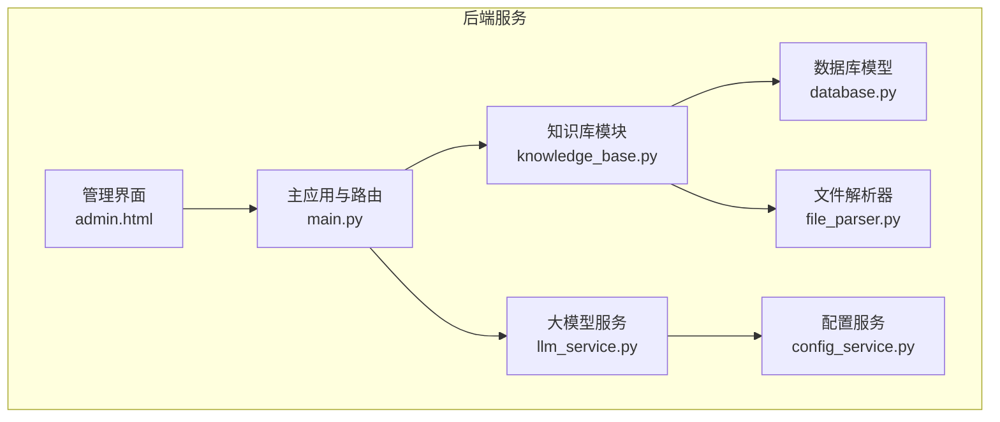

**图表来源**
- [knowledge_base.py:11-614](file://backend/knowledge_base.py#L11-L614)
- [main.py:1-200](file://backend/main.py#L1-L200)
- [llm_service.py:482-562](file://backend/llm_service.py#L482-L562)
- [file_parser.py:1-144](file://backend/file_parser.py#L1-L144)
- [database.py:14-256](file://backend/database.py#L14-L256)
- [config_service.py:11-153](file://backend/config_service.py#L11-L153)
- [admin.html:530-729](file://backend/static/admin.html#L530-L729)

**章节来源**
- [knowledge_base.py:11-614](file://backend/knowledge_base.py#L11-L614)
- [main.py:1-200](file://backend/main.py#L1-L200)

## 核心组件
- KnowledgeBase类：负责文档的增删改查、关键词提取与索引、相关知识拼装，**新增附件管理功能**。
- FastAPI路由：提供知识库的HTTP接口，供前端或外部系统调用，**新增AI智能分析和智能导入接口**。
- LLMService：负责与大模型交互，**新增文档智能分析功能**，支持自动分类、摘要生成、关键词提取，**修复了变量使用错误并增强了异常处理**。
- 文件解析器：支持PDF、Word、图片、文本等多种格式解析，**新增图片OCR功能**。
- 数据库层：SQLite存储文档与关键词索引，**新增附件表支持**。
- 配置服务：提供加密存储与读取，支撑大模型配置。
- 管理界面：**新增智能导入界面**，支持文件上传和文本粘贴两种导入方式。

**章节来源**
- [knowledge_base.py:11-614](file://backend/knowledge_base.py#L11-L614)
- [main.py:1540-1839](file://backend/main.py#L1540-L1839)
- [llm_service.py:482-562](file://backend/llm_service.py#L482-L562)
- [file_parser.py:1-144](file://backend/file_parser.py#L1-L144)
- [database.py:14-256](file://backend/database.py#L14-L256)
- [config_service.py:11-153](file://backend/config_service.py#L11-L153)
- [admin.html:530-729](file://backend/static/admin.html#L530-L729)

## 架构总览
知识库模块采用"轻量级全文关键词索引"的设计思路：文档入库时计算内容哈希以避免重复，同时抽取关键词并建立关键词索引；检索时对查询进行关键词提取，通过关键词匹配文档并按命中数量与时间排序返回结果。**新增AI智能分析功能**使得文档能够自动获得分类、摘要和关键词，进一步提升检索效果。**智能导入界面**提供了友好的用户交互体验，支持多种导入方式。**重要更新**：LLMService现在正确使用self.model变量，避免了潜在的运行时错误。

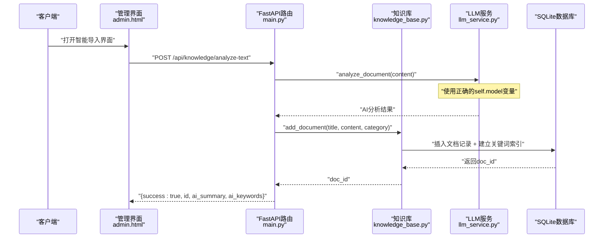

**图表来源**
- [main.py:1642-1698](file://backend/main.py#L1642-L1698)
- [llm_service.py:504-579](file://backend/llm_service.py#L504-L579)
- [knowledge_base.py:96-132](file://backend/knowledge_base.py#L96-L132)

## 详细组件分析

### KnowledgeBase类
- 职责
  - 文档管理：添加、删除、列出文档。
  - 索引与检索：基于关键词的匹配与排序。
  - 内容解析：从文本中提取关键词。
  - 相关知识拼装：根据查询返回若干相关文档摘要。
  - **附件管理**：新增附件的增删改查功能，支持文档与附件的关联。
- 关键字段与表
  - documents：存储文档标题、内容、类型、分类、唯一哈希、创建/更新时间。
  - keywords：存储文档与关键词的多对多索引。
  - **attachments**：**新增**存储文档附件信息，支持图片、PDF、Word等文件类型。
- 方法概览
  - add_document：去重入库、关键词提取与索引。
  - search_documents：关键词匹配、命中计数、时间排序。
  - get_relevant_knowledge：拼装相关知识摘要。
  - get_all_documents：列出所有文档。
  - delete_document：级联删除关键词与文档。
  - **add_attachment**：**新增**为文档添加附件。
  - **get_attachments**：**新增**获取文档的所有附件。
  - **update_document**：**增强**支持文件信息更新。
  - _extract_keywords：关键词提取（过滤标点、停用词、长度与数量限制）。

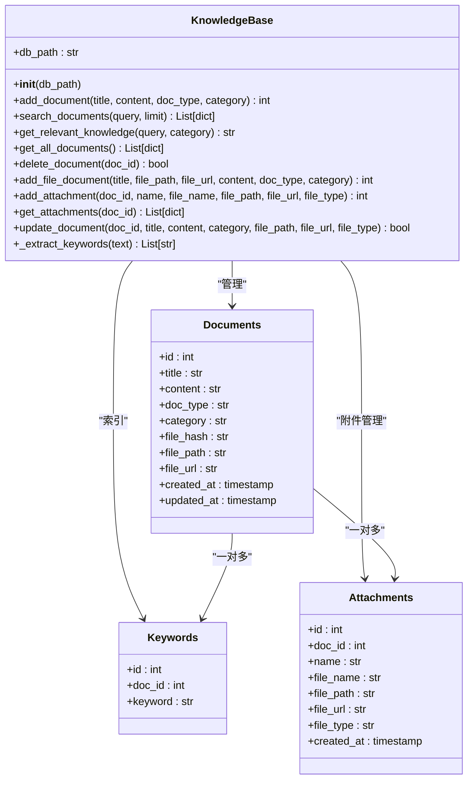

**图表来源**
- [knowledge_base.py:11-614](file://backend/knowledge_base.py#L11-L614)
- [database.py:24-91](file://backend/database.py#L24-L91)

**章节来源**
- [knowledge_base.py:11-614](file://backend/knowledge_base.py#L11-L614)
- [database.py:24-91](file://backend/database.py#L24-L91)

### API接口说明
- 获取文档列表
  - 方法：GET
  - 路径：/api/knowledge/documents
  - 功能：返回所有文档的基本信息（id、title、type、category、created_at）。
- 添加文档
  - 方法：POST
  - 路径：/api/knowledge/documents
  - 请求体：title、content、category（默认general）
  - 返回：success、message、id
- 删除文档
  - 方法：DELETE
  - 路径：/api/knowledge/documents/{doc_id}
  - 返回：success、message
- 搜索知识库
  - 方法：GET
  - 路径：/api/knowledge/search
  - 查询参数：q（查询字符串）
  - 返回：success、results（包含id、title、content片段、category、created_at）
- **新增** AI智能分析
  - 方法：POST
  - 路径：/api/knowledge/analyze-text
  - 请求体：title（可选）、content（必填）
  - 返回：success、message、id、title、category、ai_summary、ai_keywords
  - **错误处理**：现在会正确抛出ValueError（未配置API Key）和PermissionError（认证失败）
- **新增** 附件管理
  - 获取附件：GET /api/knowledge/documents/{doc_id}/attachments
  - 添加附件：POST /api/knowledge/documents/{doc_id}/attachments
  - 更新附件名称：PUT /api/knowledge/attachments/{attachment_id}/name
  - 删除附件：DELETE /api/knowledge/attachments/{attachment_id}

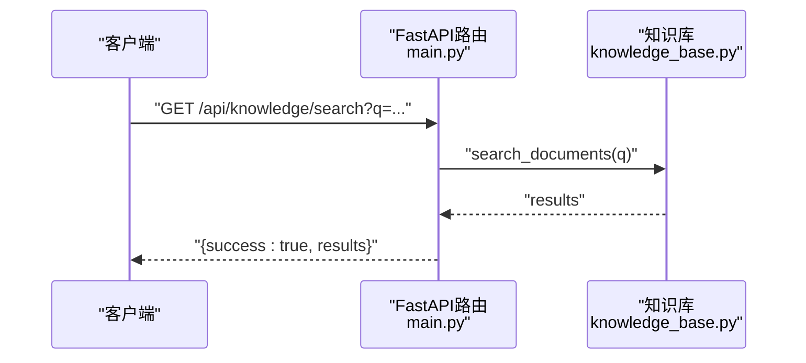

**图表来源**
- [main.py:1629-1634](file://backend/main.py#L1629-L1634)
- [knowledge_base.py:146-187](file://backend/knowledge_base.py#L146-L187)

**章节来源**
- [main.py:1629-1839](file://backend/main.py#L1629-L1839)

### 智能检索机制
- 关键词提取
  - 对输入文本进行标点清理、转小写、分词，过滤停用词与短词，保留前若干高频词作为关键词。
- 检索策略
  - 若查询无关键词，则按创建时间倒序返回最新文档。
  - 若有关键词，则通过关键词匹配文档，统计命中次数并按命中数与时间排序。
- 相关知识拼装
  - 在生成AI回复前，系统调用知识库的get_relevant_knowledge，将若干相关文档摘要注入提示词，提升回复准确性。
- **新增** AI增强检索
  - **智能导入**过程中，系统会自动为文档添加AI摘要和关键词，提升后续检索效果。

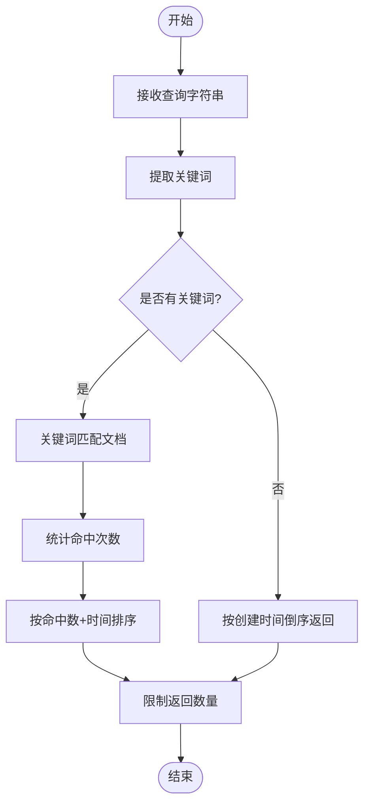

**图表来源**
- [knowledge_base.py:146-187](file://backend/knowledge_base.py#L146-L187)
- [knowledge_base.py:189-239](file://backend/knowledge_base.py#L189-L239)

**章节来源**
- [knowledge_base.py:146-187](file://backend/knowledge_base.py#L146-L187)
- [knowledge_base.py:189-239](file://backend/knowledge_base.py#L189-L239)

### 与大模型服务的集成
- 调用链路
  - 客户端请求AI回复时，系统先获取历史消息，再调用知识库拼装相关知识，随后调用LLMService生成回复。
  - **智能导入**时，系统先调用LLMService进行AI分析，然后保存到知识库。
- 参数与配置
  - LLMService从配置服务读取API Key、基础URL与模型名，支持按智能体级别覆盖参数。
- 错误处理
  - LLM调用失败时提供回退回复，保证系统可用性。
  - **重要更新**：analyze_document方法现在正确使用self.model变量，避免了AttributeError错误。
  - **新增**：analyze_document方法现在会抛出明确的ValueError（未配置API Key）和PermissionError（认证失败）异常。
- **新增** AI分析功能
  - analyze_document方法支持文档自动分类、摘要生成、关键词提取。
  - 支持JSON格式输出，包含category、summary、keywords字段。
  - **增强**：改进的异常处理，提供更好的用户体验。

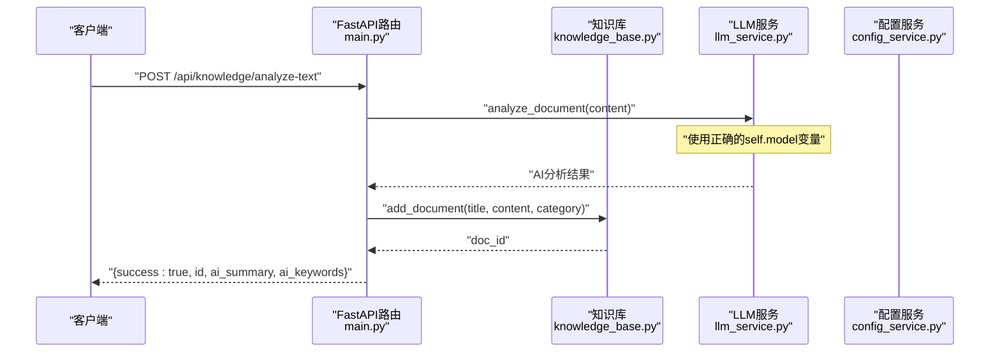

**图表来源**
- [main.py:1642-1698](file://backend/main.py#L1642-L1698)
- [llm_service.py:504-579](file://backend/llm_service.py#L504-L579)

**章节来源**
- [main.py:1642-1698](file://backend/main.py#L1642-L1698)
- [llm_service.py:504-579](file://backend/llm_service.py#L504-L579)

### 辅助功能说明
- 文档分类与标签
  - 文档具备category字段，便于按业务维度筛选。
  - 支持的分类：general（通用）、product（产品）、service（服务）、faq（常见问题）。
  - 系统提供客户标签模型与自动打标签规则，可用于将客户与知识库内容进行关联（当前知识库模块未直接使用标签，但整体架构支持）。
- 版本控制
  - 知识库模块未实现文档版本控制；可通过扩展在documents表增加版本号字段与历史表实现。
- 文件格式支持
  - 当前支持纯文本、PDF、Word、图片等多种格式；**新增图片OCR功能**，支持中英文识别。
  - 文件解析器支持：PDF、Word、图片（OCR）、文本文件。

**章节来源**
- [knowledge_base.py:96-144](file://backend/knowledge_base.py#L96-L144)
- [file_parser.py:18-144](file://backend/file_parser.py#L18-L144)
- [database.py:23-256](file://backend/database.py#L23-L256)

## AI智能分析功能

### 功能概述
新增的AI智能分析功能通过与大模型服务集成，为知识库文档提供自动化处理能力，包括文档自动分类、摘要生成、关键词提取等。**重要更新**：修复了变量使用错误，现在正确使用self.model而不是self.model_name。

### 核心功能
- **文档自动分类**：根据文档内容自动判断分类（通用、产品、服务、FAQ）
- **智能摘要生成**：生成100字以内的中文摘要
- **关键词提取**：提取5个关键词，支持中英文混合
- **内容增强**：将AI分析结果自动添加到文档内容中

### 技术实现
- **分析接口**：`analyze_document(content)`方法
- **输出格式**：严格的JSON格式，包含category、summary、keywords字段
- **错误处理**：**增强**的异常处理机制，现在会抛出明确的ValueError和PermissionError异常
- **内容截取**：最多分析3000字符，避免过长内容影响性能
- **变量修正**：**修复**了self.model_name到self.model的变量使用错误

### 异常处理增强
- **ValueError**：当未配置API Key时抛出，HTTP 400错误
- **PermissionError**：当API Key认证失败时抛出，HTTP 401错误
- **RuntimeError**：其他API调用失败时抛出，提供详细的错误信息

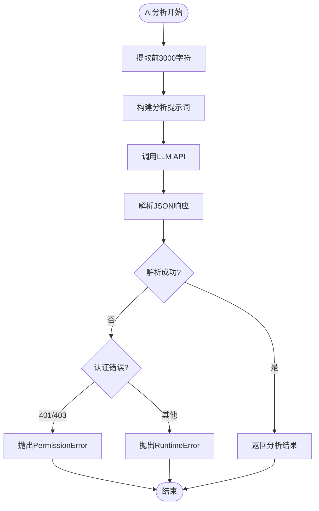

**图表来源**
- [llm_service.py:504-579](file://backend/llm_service.py#L504-L579)

**章节来源**
- [llm_service.py:504-579](file://backend/llm_service.py#L504-L579)

## 智能导入界面

### 界面设计
管理界面新增了智能导入功能，提供友好的用户交互体验：

- **双Tab切换**：文件上传和文本粘贴两种导入方式
- **拖拽上传**：支持PDF、图片、Word、文本文件拖拽上传
- **进度显示**：实时显示AI分析和保存进度
- **结果展示**：展示AI生成的摘要和关键词
- **分类标签**：直观显示文档分类状态

### 功能特性
- **文件上传**：支持PDF、JPG、PNG、GIF、DOCX、TXT等格式
- **文本粘贴**：支持碎片化知识内容的AI分析
- **自动分析**：导入即分析，无需手动分类
- **预览功能**：导入前可预览AI分析结果
- **批量处理**：支持多文件同时处理

### 用户流程
1. 打开智能导入界面
2. 选择文件上传或文本粘贴方式
3. 上传文件或粘贴文本内容
4. 等待AI分析完成
5. 查看分析结果并确认导入
6. 文档自动保存到知识库

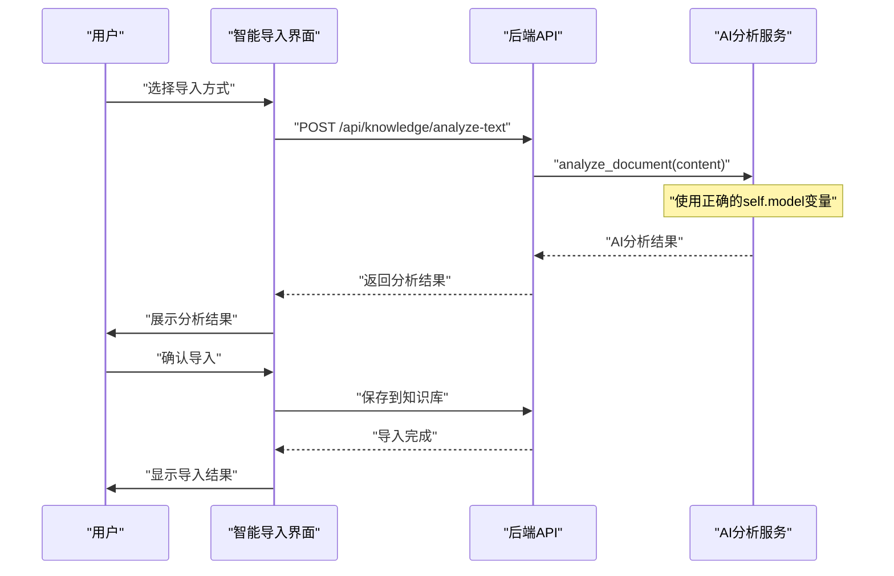

**图表来源**
- [admin.html:530-729](file://backend/static/admin.html#L530-L729)
- [main.py:1642-1698](file://backend/main.py#L1642-L1698)

**章节来源**
- [admin.html:530-729](file://backend/static/admin.html#L530-L729)
- [admin.html:1280-1479](file://backend/static/admin.html#L1280-L1479)
- [main.py:1642-1698](file://backend/main.py#L1642-L1698)

## 文件解析器增强

### 新增功能
文件解析器新增了图片OCR功能，支持中英文识别：

- **OCR识别**：使用pytesseract进行图片文字识别
- **中英支持**：支持中文简体和英文混合识别
- **格式兼容**：支持JPG、JPEG、PNG、GIF、WEBP、BMP等多种图片格式
- **错误处理**：OCR失败时优雅降级，不影响整体流程

### 技术实现
- **依赖库**：Pillow用于图片处理，pytesseract用于OCR识别
- **语言配置**：使用`chi_sim+eng`语言包进行中英文识别
- **异常处理**：捕获OCR相关异常，记录日志但不中断程序
- **性能优化**：OCR识别失败时返回空字符串，避免阻塞

### 支持的文件类型
- **图片文件**：.jpg, .jpeg, .png, .gif, .webp, .bmp
- **文档文件**：.pdf, .docx, .doc
- **文本文件**：.txt, .md, .csv
- **其他文件**：自动识别并返回空内容

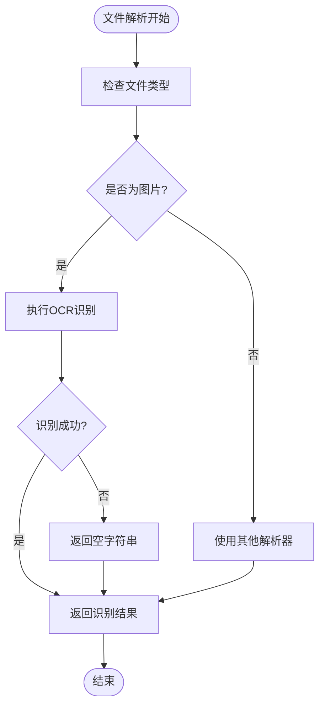

**图表来源**
- [file_parser.py:18-144](file://backend/file_parser.py#L18-L144)

**章节来源**
- [file_parser.py:18-144](file://backend/file_parser.py#L18-L144)

## 附件管理功能

### 功能概述
知识库模块新增了完整的附件管理功能，支持文档与附件的关联管理：

- **附件类型**：支持图片、PDF、Word、文本等多种文件类型
- **附件信息**：存储附件名称、原始文件名、文件路径、URL等信息
- **关联管理**：每个文档可拥有多个附件，支持增删改查
- **文件存储**：附件文件独立存储，支持在线预览

### 核心API
- **获取附件**：`GET /api/knowledge/documents/{doc_id}/attachments`
- **添加附件**：`POST /api/knowledge/documents/{doc_id}/attachments`
- **更新附件名称**：`PUT /api/knowledge/attachments/{attachment_id}/name`
- **删除附件**：`DELETE /api/knowledge/attachments/{attachment_id}`

### 技术实现
- **数据库设计**：新增attachments表，支持外键关联
- **文件管理**：附件文件存储在独立目录，支持URL访问
- **权限控制**：附件访问受文档权限控制
- **批量操作**：支持批量删除文档时自动清理附件

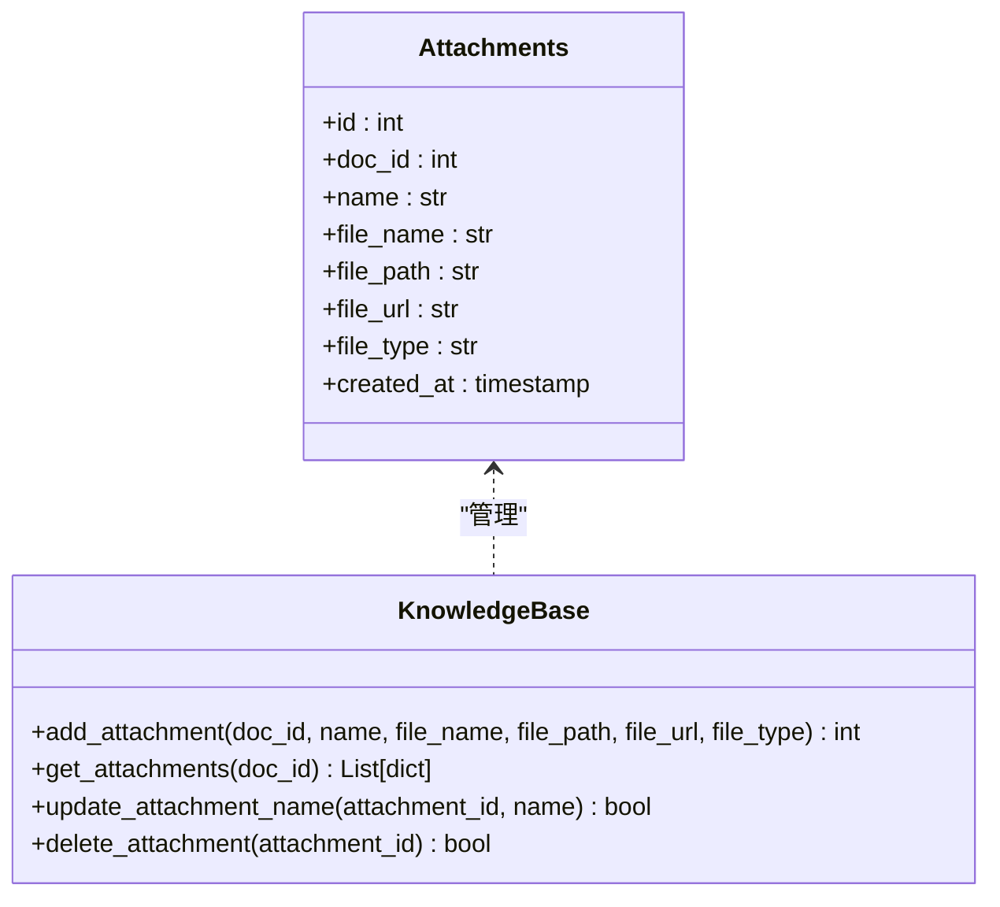

**图表来源**
- [knowledge_base.py:447-565](file://backend/knowledge_base.py#L447-L565)
- [database.py:62-91](file://backend/database.py#L62-L91)

**章节来源**
- [knowledge_base.py:447-565](file://backend/knowledge_base.py#L447-L565)
- [database.py:62-91](file://backend/database.py#L62-L91)

## 依赖关系分析
- 组件耦合
  - KnowledgeBase依赖SQLite存储，内部通过SQL操作documents、keywords、attachments表。
  - FastAPI路由依赖KnowledgeBase实例，提供HTTP接口，**新增AI分析和附件管理接口**。
  - LLMService依赖配置服务读取大模型配置，并与外部LLM API交互，**新增文档分析功能，修复了变量使用错误**。
  - 文件解析器依赖第三方库进行文件解析和OCR识别。
- 外部依赖
  - FastAPI、SQLAlchemy、httpx、cryptography等。
  - **新增**：pytesseract、Pillow、pdfplumber、python-docx等。

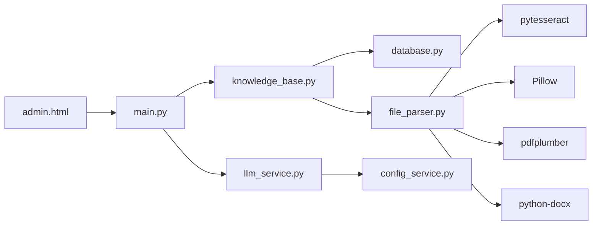

**图表来源**
- [main.py:1-200](file://backend/main.py#L1-L200)
- [knowledge_base.py:11-614](file://backend/knowledge_base.py#L11-L614)
- [llm_service.py:482-562](file://backend/llm_service.py#L482-L562)
- [file_parser.py:1-144](file://backend/file_parser.py#L1-L144)
- [config_service.py:11-153](file://backend/config_service.py#L11-L153)

**章节来源**
- [requirements.txt:1-23](file://backend/requirements.txt#L1-L23)

## 性能与优化
- 索引优化
  - 当前为关键词表建立外键索引，建议在keywords(keyword)上建立索引以加速匹配。
  - 可考虑对keywords表增加复合索引（doc_id, keyword），减少JOIN扫描。
  - **新增**：附件表已建立doc_id索引，优化附件查询性能。
- 查询优化
  - 命中计数使用GROUP BY与COUNT，建议限制关键词数量与返回结果数量，避免大表全扫描。
  - 对高频查询可引入缓存层（如Redis）存储热门关键词与结果。
  - **新增**：AI分析结果可考虑缓存，避免重复分析相同内容。
- 文本处理
  - 关键词提取可引入更成熟的NLP工具（如jieba、spaCy）提升召回质量。
  - **新增**：OCR识别可考虑异步处理，避免阻塞主线程。
- 存储与并发
  - SQLite适合小规模场景；若并发较高，建议迁移到PostgreSQL/MySQL。
  - **新增**：附件文件存储需要考虑磁盘空间和访问性能。
- 向量化检索
  - 当前为关键词检索；若需语义相似度检索，可引入嵌入模型与向量数据库（如Chroma、Pinecone），在入库时生成向量并建立索引，检索时使用余弦相似度。
  - **新增**：AI分析生成的关键词可作为向量检索的补充。

## 故障排查指南
- 文档重复入库
  - 现象：重复提交相同内容返回相同ID。
  - 原因：基于内容哈希去重。
  - 处理：确认content是否一致，必要时修改内容或使用不同category区分。
- 检索无结果
  - 现象：查询无关键词或关键词过短导致无匹配。
  - 原因：关键词提取过滤停用词与短词。
  - 处理：提高查询词质量或增加关键词数量。
- 删除异常
  - 现象：删除文档后仍可见。
  - 原因：数据库事务未提交或并发问题。
  - 处理：检查事务提交与连接关闭逻辑。
- LLM调用失败
  - 现象：AI回复生成失败。
  - 原因：网络异常、API Key无效或超时。
  - 处理：检查配置服务中的LLM配置，确认网络连通性与超时设置。
- **新增** AI分析失败
  - 现象：智能导入时AI分析失败。
  - 原因：LLM服务不可用、内容过长、格式不支持、**变量使用错误**。
  - 处理：检查LLM服务状态，缩短内容长度，确认文件格式，**验证API Key配置**。
- **新增** API Key认证错误
  - 现象：HTTP 401错误，提示认证失败。
  - 原因：API Key无效或权限不足。
  - 处理：在系统管理界面重新配置有效的API Key，确认权限设置。
- **新增** 未配置API Key
  - 现象：HTTP 400错误，提示未配置API Key。
  - 原因：系统检测到未配置API Key。
  - 处理：在系统管理界面配置LLM服务API Key。
- **新增** OCR识别失败
  - 现象：图片文件无法提取文字。
  - 原因：pytesseract未安装、图片格式不支持、图片质量差。
  - 处理：安装pytesseract和Pillow，检查图片格式和质量。
- **新增** 附件上传失败
  - 现象：附件添加失败或无法访问。
  - 原因：文件过大、格式不支持、存储空间不足。
  - 处理：检查文件大小限制，确认文件格式，清理存储空间。

**章节来源**
- [knowledge_base.py:96-132](file://backend/knowledge_base.py#L96-L132)
- [llm_service.py:567-579](file://backend/llm_service.py#L567-L579)
- [file_parser.py:110-132](file://backend/file_parser.py#L110-L132)
- [main.py:1666-1675](file://backend/main.py#L1666-L1675)

## 结论
知识库模块以"关键词索引+SQLite存储"为核心，实现了文档的快速入库、去重、索引与检索。**更新版本**通过新增AI智能分析功能，实现了文档的自动分类、摘要生成、关键词提取，显著提升了知识库的智能化水平。**智能导入界面**提供了友好的用户交互体验，支持多种导入方式。**文件解析器增强**支持图片OCR功能，扩大了文档格式支持范围。**附件管理功能**完善了知识库的文档关联能力。结合大模型服务，能够将相关知识注入到智能回复流程中，提升回复质量。

**重要更新**：LLMService.analyze_document()方法现已修复变量使用错误，正确使用self.model而不是self.model_name，并增强了异常处理机制，现在会抛出明确的ValueError和PermissionError异常，提供更好的用户体验。对于更大规模或更高性能需求的场景，建议引入向量检索、分布式数据库与缓存层，并扩展文档格式支持与版本控制能力。

## 附录

### API接口清单
- GET /api/knowledge/documents
  - 功能：获取知识库文档列表
  - 返回：success、documents
- POST /api/knowledge/documents
  - 请求体：title、content、category
  - 返回：success、message、id
- DELETE /api/knowledge/documents/{doc_id}
  - 返回：success、message
- GET /api/knowledge/search?q=...
  - 返回：success、results
- **新增** POST /api/knowledge/analyze-text
  - 请求体：title（可选）、content（必填）
  - 返回：success、message、id、title、category、ai_summary、ai_keywords
  - **错误处理**：HTTP 400（ValueError）、HTTP 401（PermissionError）
- **新增** GET /api/knowledge/documents/{doc_id}/attachments
  - 返回：success、attachments
- **新增** POST /api/knowledge/documents/{doc_id}/attachments
  - 请求体：file（必填）、name（可选）
  - 返回：success、message、attachment
- **新增** PUT /api/knowledge/attachments/{attachment_id}/name
  - 请求体：name（必填）
  - 返回：success、message
- **新增** DELETE /api/knowledge/attachments/{attachment_id}
  - 返回：success、message

**章节来源**
- [main.py:1629-1849](file://backend/main.py#L1629-L1849)

### AI智能分析功能
- **分析内容**：支持文档内容自动分析，生成分类、摘要、关键词
- **输出格式**：严格的JSON格式，包含category、summary、keywords字段
- **分类选项**：general（通用）、product（产品）、service（服务）、faq（常见问题）
- **摘要长度**：100字以内中文摘要
- **关键词数量**：最多5个关键词
- **异常处理**：**增强**的异常处理机制，提供明确的错误信息

**章节来源**
- [llm_service.py:504-579](file://backend/llm_service.py#L504-L579)

### 关键词提取算法要点
- 文本清洗：去除标点，统一小写。
- 分词与过滤：过滤停用词、长度小于阈值的词。
- 采样与去重：限制关键词数量，避免过多噪声。
- **增强**：改进版关键词提取算法，支持英文单词完整提取、中文2-gram分词。

**章节来源**
- [knowledge_base.py:567-601](file://backend/knowledge_base.py#L567-L601)

### 数据模型概览
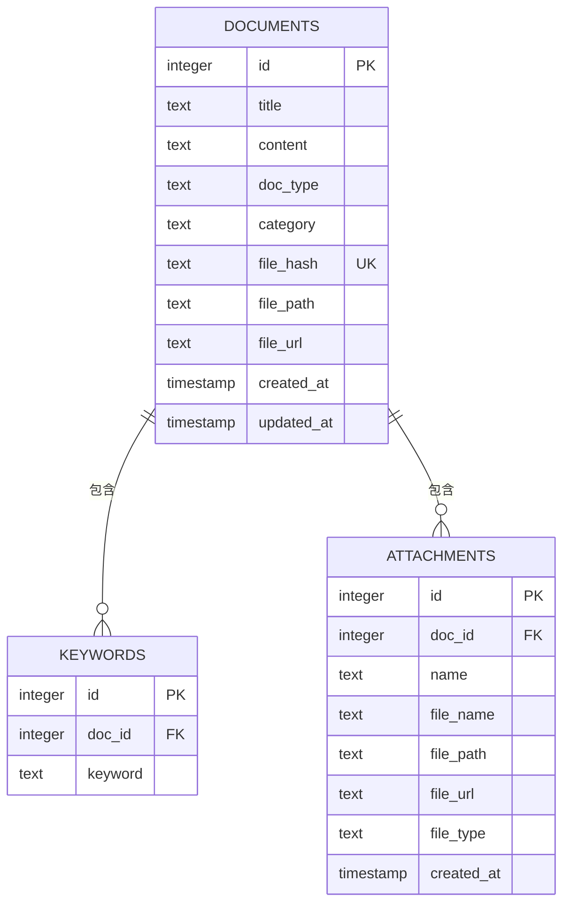

**图表来源**
- [database.py:24-91](file://backend/database.py#L24-L91)

### 支持的文件格式
- **图片文件**：.jpg, .jpeg, .png, .gif, .webp, .bmp（支持OCR识别）
- **文档文件**：.pdf, .docx, .doc（支持内容提取）
- **文本文件**：.txt, .md, .csv（支持直接读取）
- **其他文件**：自动识别并返回空内容

**章节来源**
- [file_parser.py:10-15](file://backend/file_parser.py#L10-L15)
- [file_parser.py:18-144](file://backend/file_parser.py#L18-L144)

### 错误处理异常类型
- **ValueError**：未配置API Key时抛出，HTTP 400错误
- **PermissionError**：API Key认证失败时抛出，HTTP 401错误  
- **RuntimeError**：其他API调用失败时抛出，提供详细错误信息
- **AttributeError**：**已修复**：之前由于self.model_name使用错误可能导致的AttributeError

**章节来源**
- [llm_service.py:512-579](file://backend/llm_service.py#L512-L579)
- [main.py:1666-1675](file://backend/main.py#L1666-L1675)