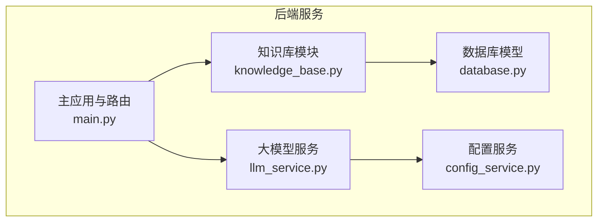
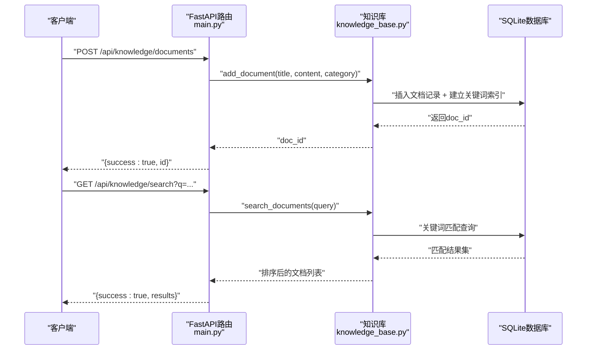
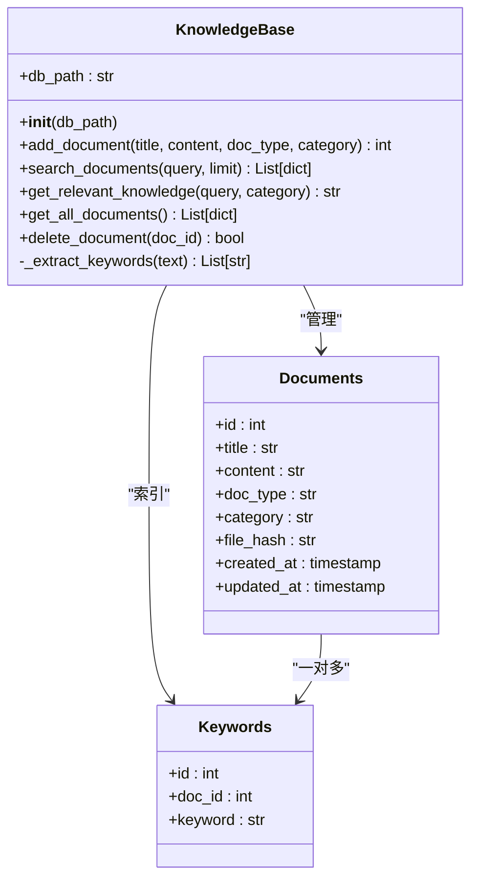
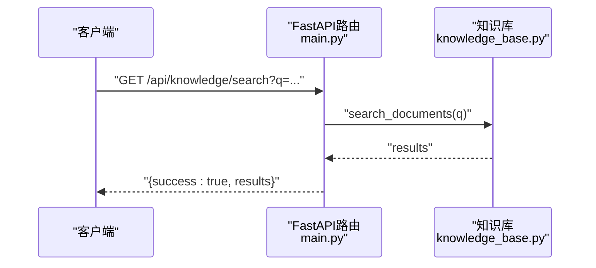
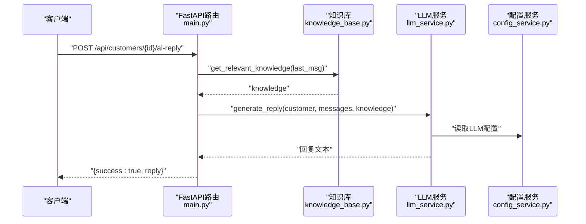
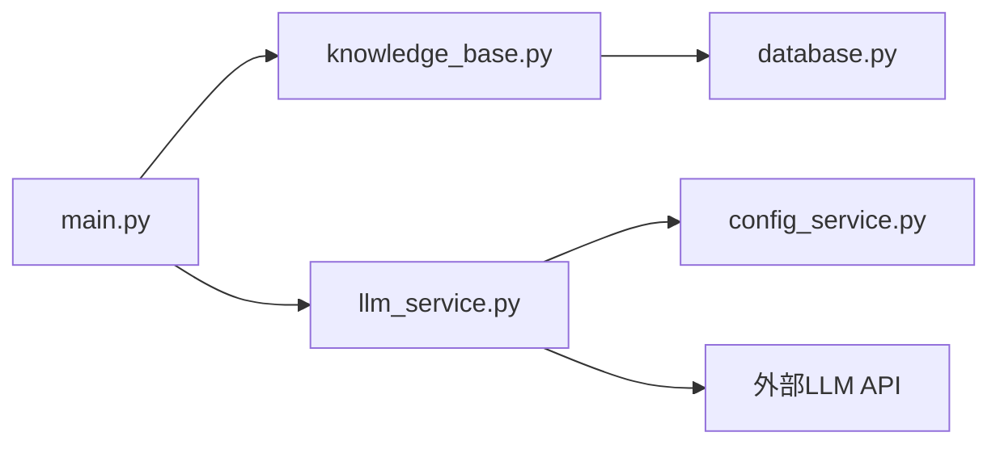
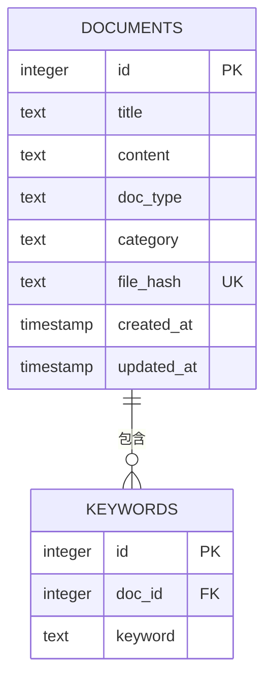

# 知识库模块

<cite>
**本文引用的文件**
- [knowledge_base.py](file://backend/knowledge_base.py)
- [main.py](file://backend/main.py)
- [llm_service.py](file://backend/llm_service.py)
- [database.py](file://backend/database.py)
- [config_service.py](file://backend/config_service.py)
- [requirements.txt](file://backend/requirements.txt)
</cite>

## 目录
1. [简介](#简介)
2. [项目结构](#项目结构)
3. [核心组件](#核心组件)
4. [架构总览](#架构总览)
5. [详细组件分析](#详细组件分析)
6. [依赖关系分析](#依赖关系分析)
7. [性能与优化](#性能与优化)
8. [故障排查指南](#故障排查指南)
9. [结论](#结论)
10. [附录](#附录)

## 简介
本文件为知识库模块的技术文档，聚焦于文档管理与检索能力。知识库模块提供文档的上传、索引建立、内容解析、存储管理、以及基于关键词的检索能力；同时，系统通过与大模型服务集成，实现“相关知识”拼装，辅助智能回复。本文将从架构、数据流、处理逻辑、API接口、性能优化与最佳实践等方面进行系统性说明。

## 项目结构
知识库模块位于后端目录，主要涉及以下文件：
- 知识库核心：backend/knowledge_base.py
- API路由与集成：backend/main.py
- 大模型服务：backend/llm_service.py
- 数据库模型与配置：backend/database.py
- 配置服务（含加密存储）：backend/config_service.py
- 依赖声明：backend/requirements.txt

图表来源
- [knowledge_base.py:11-212](file://backend/knowledge_base.py#L11-L212)
- [main.py:798-844](file://backend/main.py#L798-L844)
- [llm_service.py:11-286](file://backend/llm_service.py#L11-L286)
- [database.py:14-256](file://backend/database.py#L14-L256)
- [config_service.py:11-153](file://backend/config_service.py#L11-L153)

章节来源
- [knowledge_base.py:11-212](file://backend/knowledge_base.py#L11-L212)
- [main.py:798-844](file://backend/main.py#L798-L844)

## 核心组件
- KnowledgeBase类：负责文档的增删改查、关键词提取与索引、相关知识拼装。
- FastAPI路由：提供知识库的HTTP接口，供前端或外部系统调用。
- LLMService：负责与大模型交互，生成回复时可注入知识库内容。
- 数据库层：SQLite存储文档与关键词索引，支持唯一性约束与基本查询。
- 配置服务：提供加密存储与读取，支撑大模型配置。

章节来源
- [knowledge_base.py:11-212](file://backend/knowledge_base.py#L11-L212)
- [main.py:798-844](file://backend/main.py#L798-L844)
- [llm_service.py:11-286](file://backend/llm_service.py#L11-L286)
- [database.py:14-256](file://backend/database.py#L14-L256)
- [config_service.py:11-153](file://backend/config_service.py#L11-L153)

## 架构总览
知识库模块采用“轻量级全文关键词索引”的设计思路：文档入库时计算内容哈希以避免重复，同时抽取关键词并建立关键词索引；检索时对查询进行关键词提取，通过关键词匹配文档并按命中数量与时间排序返回结果。该方案具备实现简单、部署成本低的特点，适合中小规模文档管理与基础检索场景。

图表来源
- [main.py:814-843](file://backend/main.py#L814-L843)
- [knowledge_base.py:51-128](file://backend/knowledge_base.py#L51-L128)

## 详细组件分析

### KnowledgeBase类
- 职责
  - 文档管理：添加、删除、列出文档。
  - 索引与检索：基于关键词的匹配与排序。
  - 内容解析：从文本中提取关键词。
  - 相关知识拼装：根据查询返回若干相关文档摘要。
- 关键字段与表
  - documents：存储文档标题、内容、类型、分类、唯一哈希、创建/更新时间。
  - keywords：存储文档与关键词的多对多索引。
- 方法概览
  - add_document：去重入库、关键词提取与索引。
  - search_documents：关键词匹配、命中计数、时间排序。
  - get_relevant_knowledge：拼装相关知识摘要。
  - get_all_documents：列出所有文档。
  - delete_document：级联删除关键词与文档。
  - _extract_keywords：关键词提取（过滤标点、停用词、长度与数量限制）。

图表来源
- [knowledge_base.py:11-212](file://backend/knowledge_base.py#L11-L212)
- [database.py:24-46](file://backend/database.py#L24-L46)

章节来源
- [knowledge_base.py:11-212](file://backend/knowledge_base.py#L11-L212)
- [database.py:24-46](file://backend/database.py#L24-L46)

### API接口说明
- 获取文档列表
  - 方法：GET
  - 路径：/api/knowledge/documents
  - 功能：返回所有文档的基本信息（id、title、type、category、created_at）。
- 添加文档
  - 方法：POST
  - 路径：/api/knowledge/documents
  - 请求体：title、content、category（默认general）
  - 返回：success、message、id
- 删除文档
  - 方法：DELETE
  - 路径：/api/knowledge/documents/{doc_id}
  - 返回：success、message
- 搜索知识库
  - 方法：GET
  - 路径：/api/knowledge/search
  - 查询参数：q（查询字符串）
  - 返回：success、results（包含id、title、content片段、category、created_at）

图表来源
- [main.py:838-843](file://backend/main.py#L838-L843)
- [knowledge_base.py:87-128](file://backend/knowledge_base.py#L87-L128)

章节来源
- [main.py:806-843](file://backend/main.py#L806-L843)

### 智能检索机制
- 关键词提取
  - 对输入文本进行标点清理、转小写、分词，过滤停用词与短词，保留前若干高频词作为关键词。
- 检索策略
  - 若查询无关键词，则按创建时间倒序返回最新文档。
  - 若有关键词，则通过关键词匹配文档，统计命中次数并按命中数与时间排序。
- 相关知识拼装
  - 在生成AI回复前，系统调用知识库的get_relevant_knowledge，将若干相关文档摘要注入提示词，提升回复准确性。

图表来源
- [knowledge_base.py:87-128](file://backend/knowledge_base.py#L87-L128)
- [knowledge_base.py:179-199](file://backend/knowledge_base.py#L179-L199)

章节来源
- [knowledge_base.py:87-128](file://backend/knowledge_base.py#L87-L128)
- [knowledge_base.py:179-199](file://backend/knowledge_base.py#L179-L199)

### 与大模型服务的集成
- 调用链路
  - 客户端请求AI回复时，系统先获取历史消息，再调用知识库拼装相关知识，随后调用LLMService生成回复。
- 参数与配置
  - LLMService从配置服务读取API Key、基础URL与模型名，支持按智能体级别覆盖参数。
- 错误处理
  - LLM调用失败时提供回退回复，保证系统可用性。

图表来源
- [main.py:727-796](file://backend/main.py#L727-L796)
- [llm_service.py:14-286](file://backend/llm_service.py#L14-L286)
- [config_service.py:128-140](file://backend/config_service.py#L128-L140)

章节来源
- [main.py:727-796](file://backend/main.py#L727-L796)
- [llm_service.py:14-286](file://backend/llm_service.py#L14-L286)
- [config_service.py:128-140](file://backend/config_service.py#L128-L140)

### 辅助功能说明
- 文档分类与标签
  - 文档具备category字段，便于按业务维度筛选。
  - 系统提供客户标签模型与自动打标签规则，可用于将客户与知识库内容进行关联（当前知识库模块未直接使用标签，但整体架构支持）。
- 版本控制
  - 知识库模块未实现文档版本控制；可通过扩展在documents表增加版本号字段与历史表实现。
- 文件格式支持
  - 当前仅支持纯文本内容；若需支持PDF/Word等，可在入库前进行解析并提取文本。

章节来源
- [knowledge_base.py:51-128](file://backend/knowledge_base.py#L51-L128)
- [database.py:23-256](file://backend/database.py#L23-L256)

## 依赖关系分析
- 组件耦合
  - KnowledgeBase依赖SQLite存储，内部通过SQL操作documents与keywords表。
  - FastAPI路由依赖KnowledgeBase实例，提供HTTP接口。
  - LLMService依赖配置服务读取大模型配置，并与外部LLM API交互。
- 外部依赖
  - FastAPI、SQLAlchemy、httpx、cryptography等。

图表来源
- [main.py:798-844](file://backend/main.py#L798-L844)
- [knowledge_base.py:11-212](file://backend/knowledge_base.py#L11-L212)
- [llm_service.py:11-286](file://backend/llm_service.py#L11-L286)
- [config_service.py:11-153](file://backend/config_service.py#L11-L153)

章节来源
- [requirements.txt:1-20](file://backend/requirements.txt#L1-L20)

## 性能与优化
- 索引优化
  - 当前为关键词表建立外键索引，建议在keywords(keyword)上建立索引以加速匹配。
  - 可考虑对keywords表增加复合索引（doc_id, keyword），减少JOIN扫描。
- 查询优化
  - 命中计数使用GROUP BY与COUNT，建议限制关键词数量与返回结果数量，避免大表全扫描。
  - 对高频查询可引入缓存层（如Redis）存储热门关键词与结果。
- 文本处理
  - 关键词提取可引入更成熟的NLP工具（如jieba、spaCy）提升召回质量。
- 存储与并发
  - SQLite适合小规模场景；若并发较高，建议迁移到PostgreSQL/MySQL。
- 向量化检索
  - 当前为关键词检索；若需语义相似度检索，可引入嵌入模型与向量数据库（如Chroma、Pinecone），在入库时生成向量并建立索引，检索时使用余弦相似度。

[本节为通用性能建议，不直接分析特定文件，故无章节来源]

## 故障排查指南
- 文档重复入库
  - 现象：重复提交相同内容返回相同ID。
  - 原因：基于内容哈希去重。
  - 处理：确认content是否一致，必要时修改内容或使用不同category区分。
- 检索无结果
  - 现象：查询无关键词或关键词过短导致无匹配。
  - 原因：关键词提取过滤停用词与短词。
  - 处理：提高查询词质量或增加关键词数量。
- 删除异常
  - 现象：删除文档后仍可见。
  - 原因：数据库事务未提交或并发问题。
  - 处理：检查事务提交与连接关闭逻辑。
- LLM调用失败
  - 现象：AI回复生成失败。
  - 原因：网络异常、API Key无效或超时。
  - 处理：检查配置服务中的LLM配置，确认网络连通性与超时设置。

章节来源
- [knowledge_base.py:51-128](file://backend/knowledge_base.py#L51-L128)
- [llm_service.py:149-176](file://backend/llm_service.py#L149-L176)
- [config_service.py:128-140](file://backend/config_service.py#L128-L140)

## 结论
知识库模块以“关键词索引+SQLite存储”为核心，实现了文档的快速入库、去重、索引与检索。结合大模型服务，能够将相关知识注入到智能回复流程中，提升回复质量。对于更大规模或更高性能需求的场景，建议引入向量检索、分布式数据库与缓存层，并扩展文档格式支持与版本控制能力。

[本节为总结性内容，不直接分析特定文件，故无章节来源]

## 附录

### API接口清单
- GET /api/knowledge/documents
  - 功能：获取知识库文档列表
  - 返回：success、documents
- POST /api/knowledge/documents
  - 请求体：title、content、category
  - 返回：success、message、id
- DELETE /api/knowledge/documents/{doc_id}
  - 返回：success、message
- GET /api/knowledge/search?q=...
  - 返回：success、results

章节来源
- [main.py:806-843](file://backend/main.py#L806-L843)

### 关键词提取算法要点
- 文本清洗：去除标点，统一小写。
- 分词与过滤：过滤停用词、长度小于阈值的词。
- 采样与去重：限制关键词数量，避免过多噪声。

章节来源
- [knowledge_base.py:179-199](file://backend/knowledge_base.py#L179-L199)

### 数据模型概览

图表来源
- [database.py:24-46](file://backend/database.py#L24-L46)