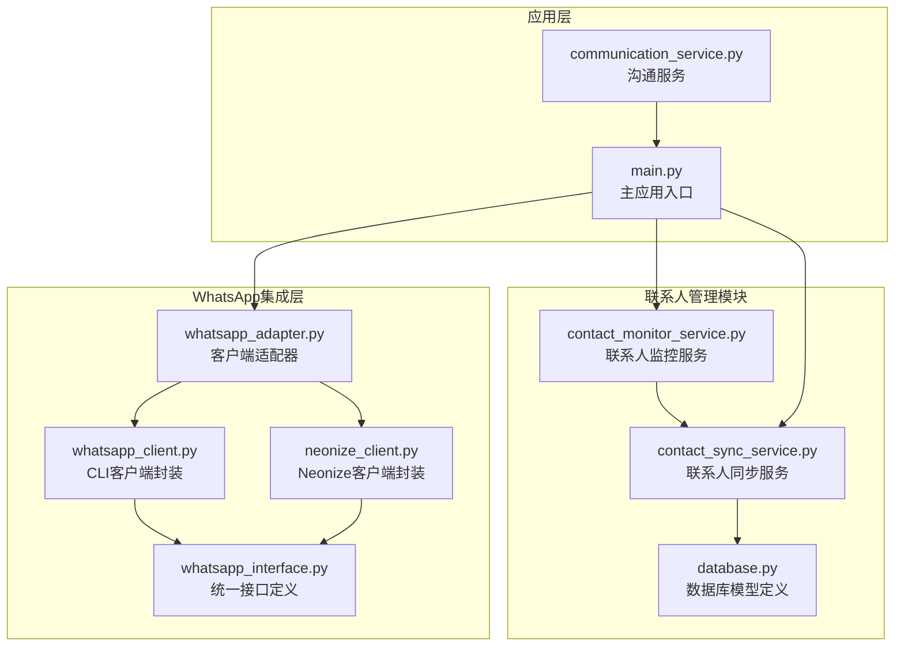
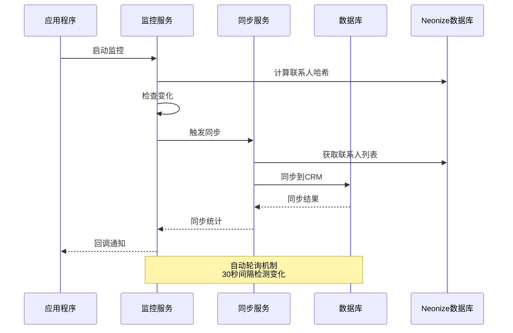
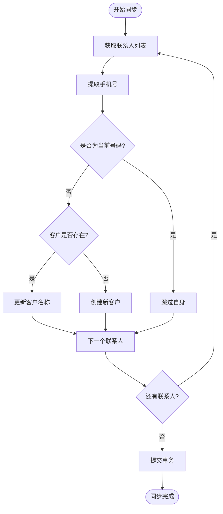
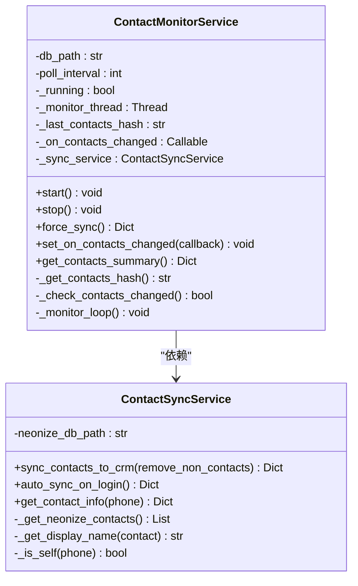
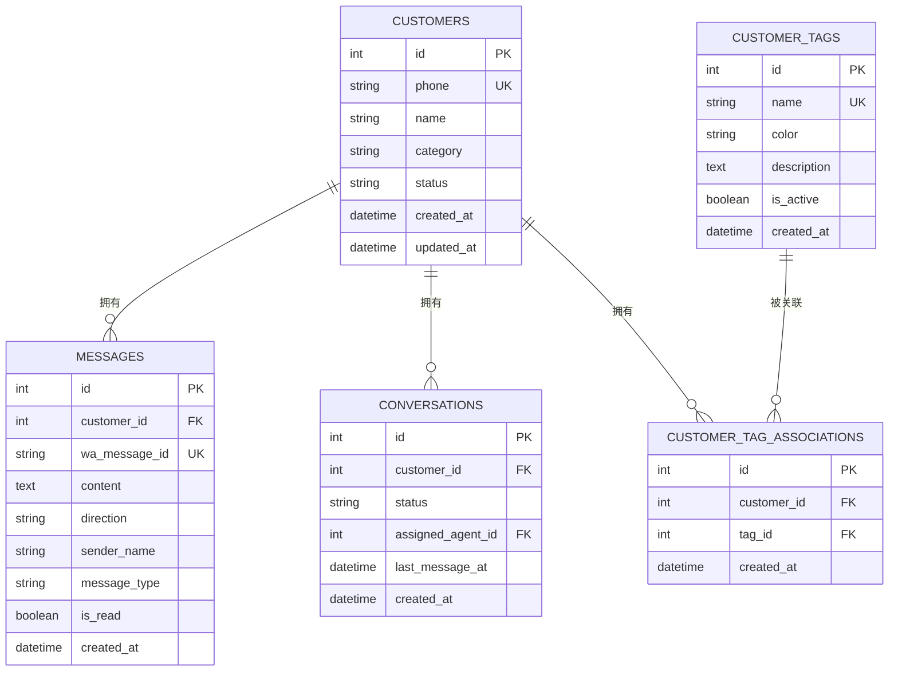
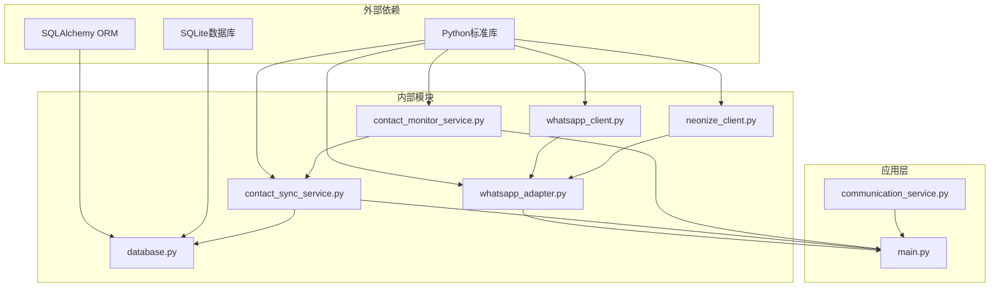

# 联系人管理模块

<cite>
**本文档引用的文件**
- [contact_sync_service.py](file://backend/contact_sync_service.py)
- [contact_monitor_service.py](file://backend/contact_monitor_service.py)
- [database.py](file://backend/database.py)
- [whatsapp_client.py](file://backend/whatsapp_client.py)
- [whatsapp_interface.py](file://backend/whatsapp_interface.py)
- [main.py](file://backend/main.py)
- [whatsapp_adapter.py](file://backend/whatsapp_adapter.py)
- [neonize_client.py](file://backend/neonize_client.py)
- [communication_service.py](file://backend/communication_service.py)
</cite>

## 目录
1. [简介](#简介)
2. [项目结构](#项目结构)
3. [核心组件](#核心组件)
4. [架构概览](#架构概览)
5. [详细组件分析](#详细组件分析)
6. [依赖关系分析](#依赖关系分析)
7. [性能考量](#性能考量)
8. [故障排除指南](#故障排除指南)
9. [结论](#结论)

## 简介

联系人管理模块是WhatsApp智能客户关系管理系统的核心组成部分，负责维护和同步客户联系信息。该模块提供了完整的联系人同步、监控和管理功能，支持多种WhatsApp后端（Neonize和CLI），并集成了自动标签系统和消息处理机制。

## 项目结构

联系人管理模块主要分布在以下文件中：

**图表来源**
- [contact_sync_service.py:1-265](file://backend/contact_sync_service.py#L1-L265)
- [contact_monitor_service.py:1-208](file://backend/contact_monitor_service.py#L1-L208)
- [database.py:1-298](file://backend/database.py#L1-L298)

**章节来源**
- [contact_sync_service.py:1-265](file://backend/contact_sync_service.py#L1-L265)
- [contact_monitor_service.py:1-208](file://backend/contact_monitor_service.py#L1-L208)
- [database.py:1-298](file://backend/database.py#L1-L298)

## 核心组件

联系人管理模块包含以下核心组件：

### 1. 联系人同步服务 (ContactSyncService)
- 从Neonize数据库读取真实联系人信息
- 同步到CRM系统
- 支持多号码隔离和自动同步
- 处理LID格式联系人映射

### 2. 联系人监控服务 (ContactMonitorService)
- 通过轮询监控通讯录变化
- 自动检测联系人增删改
- 实时同步到CRM
- 支持回调通知机制

### 3. 数据库模型 (Database Models)
- 客户表(Customer)：存储联系人基本信息
- 消息表(Message)：关联客户和消息记录
- 会话表(Conversation)：管理客户对话状态
- 标签系统：支持自定义客户标签

**章节来源**
- [contact_sync_service.py:16-265](file://backend/contact_sync_service.py#L16-L265)
- [contact_monitor_service.py:18-208](file://backend/contact_monitor_service.py#L18-L208)
- [database.py:28-298](file://backend/database.py#L28-L298)

## 架构概览

联系人管理模块采用分层架构设计，实现了清晰的职责分离：

**图表来源**
- [contact_monitor_service.py:70-98](file://backend/contact_monitor_service.py#L70-L98)
- [contact_sync_service.py:119-227](file://backend/contact_sync_service.py#L119-L227)

## 详细组件分析

### 联系人同步服务 (ContactSyncService)

ContactSyncService是联系人管理的核心服务，负责将WhatsApp联系人同步到CRM系统：

#### 主要功能特性

1. **多格式JID处理**
   - 支持@s.whatsapp.net格式
   - 处理@lid格式联系人
   - 自动LID到手机号映射

2. **智能同步策略**
   - 跳过当前登录号码
   - 优先使用通讯录名称
   - 智能更新现有客户信息

3. **统计和监控**
   - 新增客户统计
   - 更新客户统计
   - 错误处理和日志记录

**图表来源**
- [contact_sync_service.py:119-227](file://backend/contact_sync_service.py#L119-L227)

#### 关键实现细节

- **数据库连接管理**：使用SQLAlchemy ORM进行数据库操作
- **错误处理**：完善的异常捕获和日志记录
- **性能优化**：批量操作和事务管理
- **并发安全**：线程安全的数据库连接

**章节来源**
- [contact_sync_service.py:16-265](file://backend/contact_sync_service.py#L16-L265)

### 联系人监控服务 (ContactMonitorService)

ContactMonitorService提供实时监控功能，检测WhatsApp联系人的变化：

#### 监控机制

1. **哈希算法检测**
   - 计算联系人数据哈希值
   - 比较前后数据变化
   - 首次运行初始化哈希值

2. **轮询策略**
   - 默认30秒轮询间隔
   - 线程安全的监控循环
   - 支持强制同步

3. **回调通知**
   - 变化检测后的回调机制
   - 异步执行避免阻塞
   - 错误处理和日志记录

**图表来源**
- [contact_monitor_service.py:18-143](file://backend/contact_monitor_service.py#L18-L143)
- [contact_sync_service.py:16-118](file://backend/contact_sync_service.py#L16-L118)

**章节来源**
- [contact_monitor_service.py:18-208](file://backend/contact_monitor_service.py#L18-L208)

### 数据库模型设计

联系人管理模块使用SQLAlchemy ORM定义了完整的数据模型：

#### 核心数据模型

1. **Customer模型**
   - 唯一手机号标识
   - 客户分类和状态
   - 创建和更新时间戳
   - 多对多关系：标签关联

2. **Message模型**
   - 消息内容和类型
   - 发送方向和状态
   - 与客户的外键关联

3. **Conversation模型**
   - 会话状态管理
   - 与客户和代理的关系
   - 最后消息时间跟踪

**图表来源**
- [database.py:28-159](file://backend/database.py#L28-L159)

**章节来源**
- [database.py:28-298](file://backend/database.py#L28-L298)

### WhatsApp客户端集成

联系人管理模块支持两种WhatsApp后端：

#### Neonize客户端
- 基于Go语言的稳定连接
- 二维码登录支持
- 实时消息处理
- LID格式自动转换

#### CLI客户端
- 基于whatsapp-cli命令行工具
- 后台进程保持连接
- 轮询同步机制
- 简单易用的部署

**章节来源**
- [neonize_client.py:87-800](file://backend/neonize_client.py#L87-L800)
- [whatsapp_client.py:14-535](file://backend/whatsapp_client.py#L14-L535)
- [whatsapp_adapter.py:17-180](file://backend/whatsapp_adapter.py#L17-L180)

## 依赖关系分析

联系人管理模块的依赖关系如下：

**图表来源**
- [contact_sync_service.py:8-9](file://backend/contact_sync_service.py#L8-L9)
- [contact_monitor_service.py:11](file://backend/contact_monitor_service.py#L11)
- [database.py:4-6](file://backend/database.py#L4-L6)

**章节来源**
- [contact_sync_service.py:1-265](file://backend/contact_sync_service.py#L1-L265)
- [contact_monitor_service.py:1-208](file://backend/contact_monitor_service.py#L1-L208)
- [database.py:1-298](file://backend/database.py#L1-L298)

## 性能考量

联系人管理模块在设计时充分考虑了性能优化：

### 1. 数据库性能优化
- 使用SQLAlchemy连接池
- 批量操作减少数据库往返
- 适当的索引设计
- 事务管理确保数据一致性

### 2. 内存管理
- LID缓存机制
- 消息ID去重缓存
- 有序字典管理消息队列
- 定期清理过期数据

### 3. 并发处理
- 线程安全的数据库连接
- 消息队列处理机制
- 异步回调通知
- 超时保护和重试机制

### 4. 网络优化
- 轮询间隔可配置
- 哈希算法快速检测变化
- 连接复用和重连机制
- 超时控制和错误恢复

## 故障排除指南

### 常见问题及解决方案

#### 1. 联系人同步失败
**症状**：同步过程中出现错误
**解决方案**：
- 检查Neonize数据库连接
- 验证SQLite权限
- 查看日志文件获取详细错误信息
- 确认WhatsApp账户登录状态

#### 2. 监控服务不工作
**症状**：联系人变化无法检测
**解决方案**：
- 检查轮询间隔设置
- 验证数据库连接
- 确认回调函数正确注册
- 检查线程状态

#### 3. LID格式转换失败
**症状**：@lid格式联系人无法转换
**解决方案**：
- 检查whatsmeow_lid_map表
- 验证数据库连接
- 查看LID缓存状态
- 重启应用程序

#### 4. 数据库连接问题
**症状**：数据库操作失败
**解决方案**：
- 检查DATABASE_URL配置
- 验证SQLite文件权限
- 查看连接池状态
- 重启数据库连接

**章节来源**
- [contact_sync_service.py:67-69](file://backend/contact_sync_service.py#L67-L69)
- [contact_monitor_service.py:50-52](file://backend/contact_monitor_service.py#L50-L52)
- [neonize_client.py:578-605](file://backend/neonize_client.py#L578-L605)

## 结论

联系人管理模块是一个功能完整、设计合理的WhatsApp客户关系管理系统组件。它通过以下特点实现了高效的联系人管理：

1. **多后端支持**：同时支持Neonize和CLI两种WhatsApp后端
2. **自动化程度高**：自动同步、监控和标签管理
3. **性能优化**：合理的数据库设计和并发处理
4. **错误处理**：完善的异常捕获和恢复机制
5. **扩展性强**：模块化设计便于功能扩展

该模块为整个WhatsApp智能客户关系管理系统提供了坚实的基础，确保了联系人数据的准确性和实时性，为后续的消息处理和客户服务功能奠定了良好的数据基础。