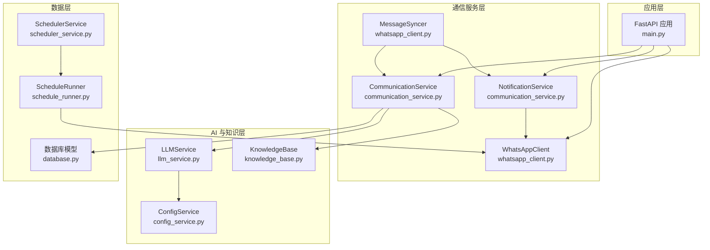
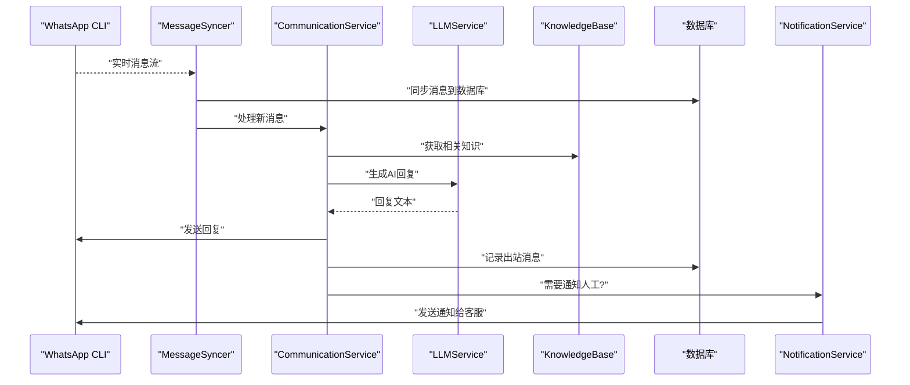
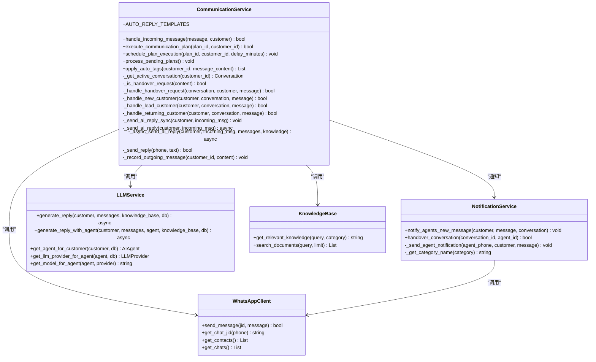
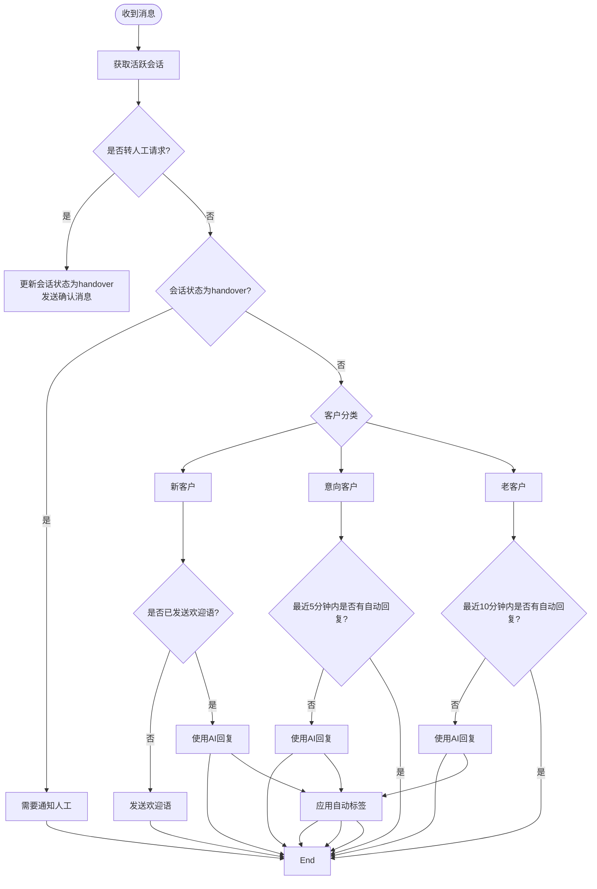
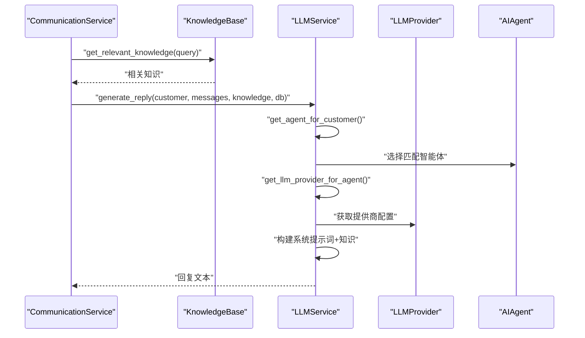
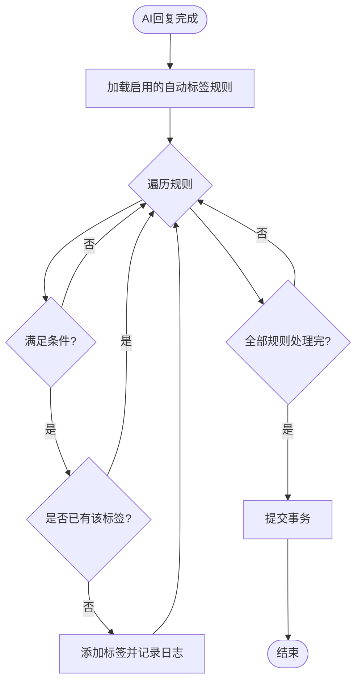
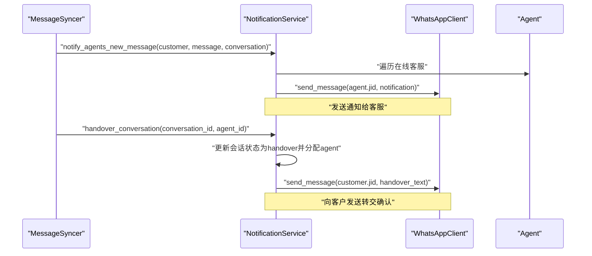
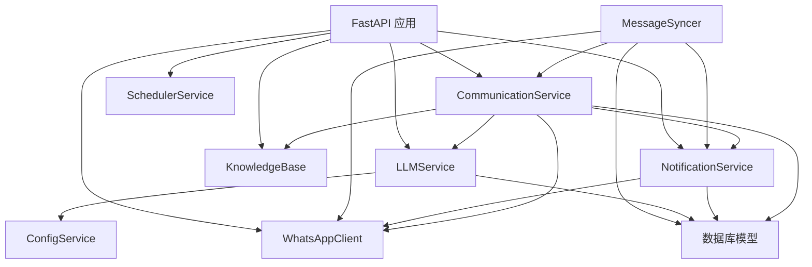

# 通信服务模块

<cite>
**本文档引用的文件**
- [communication_service.py](file://backend/communication_service.py)
- [main.py](file://backend/main.py)
- [whatsapp_client.py](file://backend/whatsapp_client.py)
- [llm_service.py](file://backend/llm_service.py)
- [knowledge_base.py](file://backend/knowledge_base.py)
- [database.py](file://backend/database.py)
- [config_service.py](file://backend/config_service.py)
- [scheduler_service.py](file://backend/scheduler_service.py)
- [schedule_runner.py](file://backend/schedule_runner.py)
- [memo_service.py](file://backend/memo_service.py)
- [quotation_service.py](file://backend/quotation_service.py)
</cite>

## 目录
1. [简介](#简介)
2. [项目结构](#项目结构)
3. [核心组件](#核心组件)
4. [架构总览](#架构总览)
5. [详细组件分析](#详细组件分析)
6. [依赖关系分析](#依赖关系分析)
7. [性能考虑](#性能考虑)
8. [故障排除指南](#故障排除指南)
9. [结论](#结论)
10. [附录](#附录)

## 简介
本文件为通信服务模块的技术文档，重点围绕以下目标展开：
- 详细说明 CommunicationService 类的智能回复流程，包括消息处理、AI 回复生成、人工客服协作、自动标签系统等核心功能
- 解释 NotificationService 类的通知机制，包括人工客服通知、会话转交提醒等功能
- 说明客户会话管理、消息路由、回复策略配置等实现细节
- 提供详细的 API 接口说明，包括 handle_incoming_message、generate_ai_reply、transfer_to_agent 等方法的使用方法
- 包含配置选项说明，如智能体选择、回复模板、转交条件等
- 提供实际使用示例和最佳实践指导

## 项目结构
通信服务模块位于 backend 目录下，主要文件如下：
- communication_service.py：核心通信服务与通知服务
- main.py：FastAPI 应用入口，提供 REST API
- whatsapp_client.py：WhatsApp CLI 客户端封装与消息同步器
- llm_service.py：大模型服务，负责智能回复生成与智能体选择
- knowledge_base.py：知识库系统，提供相关知识检索
- database.py：数据库模型与初始化
- config_service.py：配置管理服务（加密存储 LLM 配置）
- scheduler_service.py / schedule_runner.py：定时发送计划服务
- memo_service.py：销售备忘服务
- quotation_service.py：报价辅助服务

图表来源
- [communication_service.py:17-512](file://backend/communication_service.py#L17-L512)
- [main.py:17-796](file://backend/main.py#L17-L796)
- [whatsapp_client.py:13-437](file://backend/whatsapp_client.py#L13-L437)
- [llm_service.py:11-286](file://backend/llm_service.py#L11-L286)
- [knowledge_base.py:11-212](file://backend/knowledge_base.py#L11-L212)
- [database.py:23-297](file://backend/database.py#L23-L297)
- [config_service.py:11-153](file://backend/config_service.py#L11-L153)
- [scheduler_service.py:54-393](file://backend/scheduler_service.py#L54-L393)
- [schedule_runner.py:12-142](file://backend/schedule_runner.py#L12-L142)

章节来源
- [communication_service.py:17-512](file://backend/communication_service.py#L17-L512)
- [main.py:17-796](file://backend/main.py#L17-L796)
- [whatsapp_client.py:13-437](file://backend/whatsapp_client.py#L13-L437)

## 核心组件
本节概述通信服务模块的核心组件及其职责：
- CommunicationService：负责消息处理、智能回复生成、会话状态管理、自动标签应用、沟通计划执行
- NotificationService：负责人工客服通知、会话转交提醒
- WhatsAppClient：封装 WhatsApp CLI，提供消息发送、联系人/聊天获取、认证状态查询等
- MessageSyncer：持续同步 WhatsApp 消息到数据库，并触发自动回复与通知
- LLMService：集成 OpenAI/Claude 等大模型，支持智能体选择、系统提示词、温度/最大 token 参数
- KnowledgeBase：文档管理与关键词检索，为 AI 回复提供知识支撑
- ConfigService：加密存储 LLM API Key、Base URL、模型等敏感配置
- SchedulerService/ScheduleRunner：定时发送计划的创建、调度与执行

章节来源
- [communication_service.py:17-512](file://backend/communication_service.py#L17-L512)
- [whatsapp_client.py:13-437](file://backend/whatsapp_client.py#L13-L437)
- [llm_service.py:11-286](file://backend/llm_service.py#L11-L286)
- [knowledge_base.py:11-212](file://backend/knowledge_base.py#L11-L212)
- [config_service.py:11-153](file://backend/config_service.py#L11-L153)
- [scheduler_service.py:54-393](file://backend/scheduler_service.py#L54-L393)
- [schedule_runner.py:12-142](file://backend/schedule_runner.py#L12-L142)

## 架构总览
通信服务模块采用分层架构：
- 表现层：FastAPI 提供 REST API，WebSocket 实时推送
- 业务层：CommunicationService、NotificationService、SchedulerService
- 集成层：WhatsAppClient、LLMService、KnowledgeBase、ConfigService
- 数据层：SQLAlchemy ORM 模型与 SQLite 存储

图表来源
- [whatsapp_client.py:400-433](file://backend/whatsapp_client.py#L400-L433)
- [communication_service.py:47-71](file://backend/communication_service.py#L47-L71)
- [llm_service.py:177-198](file://backend/llm_service.py#L177-L198)
- [knowledge_base.py:130-141](file://backend/knowledge_base.py#L130-L141)

## 详细组件分析

### CommunicationService 类
CommunicationService 是通信服务的核心，负责：
- 消息处理：识别转人工请求、判断会话状态、按客户分类处理
- AI 回复生成：获取历史消息、检索知识、调用 LLM 生成回复
- 会话管理：获取/创建活跃会话、更新会话状态
- 自动标签：根据规则为客户打标签
- 沟通计划：执行/计划执行沟通计划

图表来源
- [communication_service.py:17-512](file://backend/communication_service.py#L17-L512)
- [llm_service.py:11-286](file://backend/llm_service.py#L11-L286)
- [knowledge_base.py:11-212](file://backend/knowledge_base.py#L11-L212)
- [whatsapp_client.py:13-437](file://backend/whatsapp_client.py#L13-L437)

#### 智能回复流程（handle_incoming_message）
- 获取活跃会话：若不存在则创建状态为 bot 的会话
- 转人工请求检测：关键词匹配（人工、客服、转人工等）
- 会话状态判断：若已被人工接手，不自动回复，但需要通知人工
- 客户分类处理：
  - 新客户：首次自动发送欢迎语；后续使用 AI 回复
  - 意向客户：超过 5 分钟未自动回复则使用 AI 回复
  - 老客户：超过 10 分钟未自动回复则使用 AI 回复
- AI 回复生成：获取历史消息与相关知识，调用 LLMService 生成回复
- 回复发送与记录：通过 WhatsAppClient 发送并记录出站消息
- 自动标签：在 AI 回复后应用自动标签规则

图表来源
- [communication_service.py:47-171](file://backend/communication_service.py#L47-L171)
- [communication_service.py:292-361](file://backend/communication_service.py#L292-L361)

章节来源
- [communication_service.py:47-171](file://backend/communication_service.py#L47-L171)
- [communication_service.py:172-265](file://backend/communication_service.py#L172-L265)
- [communication_service.py:292-361](file://backend/communication_service.py#L292-L361)

#### AI 回复生成（LLMService）
- 智能体选择：根据客户标签匹配 AIAgent，支持优先级与默认智能体
- 大模型提供商：支持多提供商配置，优先使用智能体/提供商级别参数
- 系统提示词：根据客户类型构建不同策略的系统提示词
- 知识库融合：将检索到的相关知识加入提示词
- 回退策略：当 LLM 调用失败时返回默认回复

图表来源
- [llm_service.py:52-84](file://backend/llm_service.py#L52-L84)
- [llm_service.py:123-146](file://backend/llm_service.py#L123-L146)
- [llm_service.py:177-198](file://backend/llm_service.py#L177-L198)

章节来源
- [llm_service.py:52-84](file://backend/llm_service.py#L52-L84)
- [llm_service.py:123-146](file://backend/llm_service.py#L123-L146)
- [llm_service.py:177-198](file://backend/llm_service.py#L177-L198)

#### 自动标签系统（AutoTagRule）
- 规则类型：消息收到、报价请求、关键词匹配、AI 检测
- 规则优先级：按优先级降序应用
- 标签应用：避免重复添加，记录日志
- 触发时机：AI 回复完成后应用

图表来源
- [communication_service.py:292-361](file://backend/communication_service.py#L292-L361)
- [database.py:259-288](file://backend/database.py#L259-L288)

章节来源
- [communication_service.py:292-361](file://backend/communication_service.py#L292-L361)
- [database.py:259-288](file://backend/database.py#L259-L288)

#### 沟通计划执行
- 手动执行：通过 API 触发
- 计划执行：支持立即、延迟、定时
- 计划处理：扫描待执行计划并执行

章节来源
- [communication_service.py:363-426](file://backend/communication_service.py#L363-L426)
- [main.py:712-723](file://backend/main.py#L712-L723)

### NotificationService 类
NotificationService 负责人工客服通知与会话转交：
- 通知机制：获取在线客服，发送 WhatsApp 通知
- 会话转交：更新会话状态与分配客服，向客户发送转交确认

图表来源
- [communication_service.py:428-512](file://backend/communication_service.py#L428-L512)
- [whatsapp_client.py:133-154](file://backend/whatsapp_client.py#L133-L154)

章节来源
- [communication_service.py:428-512](file://backend/communication_service.py#L428-L512)

### WhatsAppClient 与消息同步
- 消息同步：MessageSyncer 持续同步 WhatsApp 消息到数据库
- 客户/会话管理：自动创建客户与会话
- JID 处理：自动获取正确 JID 或使用默认格式
- 实时回调：触发 CommunicationService 处理消息与通知

章节来源
- [whatsapp_client.py:212-437](file://backend/whatsapp_client.py#L212-L437)

### LLMService 与智能体选择
- 智能体绑定：根据客户标签匹配 AIAgent
- 提供商优先级：智能体参数 > 提供商参数 > 默认配置
- 系统提示词：根据客户类型定制
- 回退策略：API 调用失败时返回默认回复

章节来源
- [llm_service.py:52-84](file://backend/llm_service.py#L52-L84)
- [llm_service.py:123-146](file://backend/llm_service.py#L123-L146)
- [llm_service.py:230-238](file://backend/llm_service.py#L230-L238)

### 知识库系统
- 文档管理：添加、搜索、删除文档
- 关键词索引：基于关键词匹配
- 相关知识：根据查询返回相关文档片段

章节来源
- [knowledge_base.py:51-141](file://backend/knowledge_base.py#L51-L141)

### 配置管理
- 加密存储：ConfigService 使用 Fernet 对称加密
- LLM 配置：API Key、Base URL、模型 ID
- 兼容性：支持环境变量回退

章节来源
- [config_service.py:56-140](file://backend/config_service.py#L56-L140)

### 定时发送计划
- 计划创建：支持标签筛选、分类筛选、时间与间隔
- 任务准备：批量生成发送任务
- 执行器：后台循环检查并执行到期计划

章节来源
- [scheduler_service.py:108-288](file://backend/scheduler_service.py#L108-L288)
- [schedule_runner.py:35-127](file://backend/schedule_runner.py#L35-L127)

## 依赖关系分析
通信服务模块的依赖关系如下：
- CommunicationService 依赖 LLMService、KnowledgeBase、WhatsAppClient、NotificationService、数据库模型
- NotificationService 依赖 WhatsAppClient、数据库模型
- LLMService 依赖 ConfigService、数据库模型
- MessageSyncer 依赖 WhatsAppClient、CommunicationService、NotificationService、数据库模型
- API 层依赖 CommunicationService、NotificationService、WhatsAppClient、LLMService、KnowledgeBase、SchedulerService

图表来源
- [communication_service.py:17-512](file://backend/communication_service.py#L17-L512)
- [whatsapp_client.py:400-433](file://backend/whatsapp_client.py#L400-L433)
- [llm_service.py:11-286](file://backend/llm_service.py#L11-L286)
- [main.py:17-796](file://backend/main.py#L17-L796)

章节来源
- [communication_service.py:17-512](file://backend/communication_service.py#L17-L512)
- [whatsapp_client.py:400-433](file://backend/whatsapp_client.py#L400-L433)
- [llm_service.py:11-286](file://backend/llm_service.py#L11-L286)
- [main.py:17-796](file://backend/main.py#L17-L796)

## 性能考虑
- 异步与同步混合：AI 回复在同步上下文中使用事件循环，避免阻塞
- 事件循环兼容：检测运行中事件循环或新建事件循环，保证稳定性
- 消息同步频率：MessageSyncer 默认 1 秒轮询，平衡实时性与资源消耗
- 缓存与去重：known_message_ids 避免重复处理
- 数据库事务：批量提交减少 I/O 开销
- LLM 调用超时：合理设置超时时间，防止阻塞

章节来源
- [communication_service.py:172-217](file://backend/communication_service.py#L172-L217)
- [whatsapp_client.py:366-397](file://backend/whatsapp_client.py#L366-L397)

## 故障排除指南
- WhatsApp 登录问题：检查 auth_status 与 QR 码流程
- 消息发送失败：检查 JID 格式与备用 JID 切换逻辑
- AI 回复失败：检查 LLM 配置、网络连通性、回退策略
- 通知未送达：检查客服在线状态与电话号码格式
- 数据库锁冲突：注意事务边界与并发访问

章节来源
- [main.py:198-381](file://backend/main.py#L198-L381)
- [whatsapp_client.py:133-154](file://backend/whatsapp_client.py#L133-L154)
- [llm_service.py:166-175](file://backend/llm_service.py#L166-L175)

## 结论
通信服务模块通过清晰的分层设计与完善的自动化流程，实现了从消息接收、智能回复、人工协作到标签管理的完整闭环。其核心特性包括：
- 基于客户分类的差异化回复策略
- 智能体与提供商的灵活配置
- 自动标签与沟通计划的扩展能力
- 实时消息同步与通知机制
- 加密配置与稳定的 LLM 集成

建议在生产环境中关注：
- LLM API 的稳定性与成本控制
- 客户标签与智能体绑定的精细化配置
- 消息同步频率与数据库负载的平衡
- 通知渠道的多样化与可靠性

## 附录

### API 接口说明
- 获取系统状态：GET /api/status
- 获取客户列表：GET /api/customers
- 获取客户详情：GET /api/customers/{customer_id}
- 更新客户分类：PUT /api/customers/{customer_id}/category
- 获取客户消息历史：GET /api/customers/{customer_id}/messages
- 发送消息给客户：POST /api/customers/{customer_id}/messages
- 获取会话列表：GET /api/conversations
- 客服接手会话：POST /api/conversations/{conversation_id}/handover
- 关闭会话：POST /api/conversations/{conversation_id}/close
- 手动执行沟通计划：POST /api/plans/{plan_id}/execute/{customer_id}
- 生成AI自动回复：POST /api/customers/{customer_id}/ai-reply
- 生成并发送AI回复：POST /api/customers/{customer_id}/messages/ai-send

章节来源
- [main.py:489-796](file://backend/main.py#L489-L796)

### 方法使用示例
- handle_incoming_message：由 MessageSyncer 调用，自动处理新消息并触发通知
- generate_ai_reply：通过 API 生成 AI 回复，适合调试与测试
- transfer_to_agent：通过 API 或 NotificationService 手动转交会话

章节来源
- [communication_service.py:47-71](file://backend/communication_service.py#L47-L71)
- [main.py:727-795](file://backend/main.py#L727-L795)
- [communication_service.py:482-511](file://backend/communication_service.py#L482-L511)

### 配置选项说明
- LLM 配置：API Key、Base URL、模型 ID
- 智能体选择：按客户标签绑定智能体，支持优先级与默认智能体
- 回复模板：新客户、意向客户、老客户的欢迎语模板
- 转交条件：关键词匹配触发转人工
- 自动标签规则：消息收到、报价请求、关键词匹配等

章节来源
- [config_service.py:128-140](file://backend/config_service.py#L128-L140)
- [llm_service.py:52-84](file://backend/llm_service.py#L52-L84)
- [communication_service.py:21-41](file://backend/communication_service.py#L21-L41)
- [communication_service.py:91-95](file://backend/communication_service.py#L91-L95)
- [communication_service.py:259-264](file://backend/communication_service.py#L259-L264)