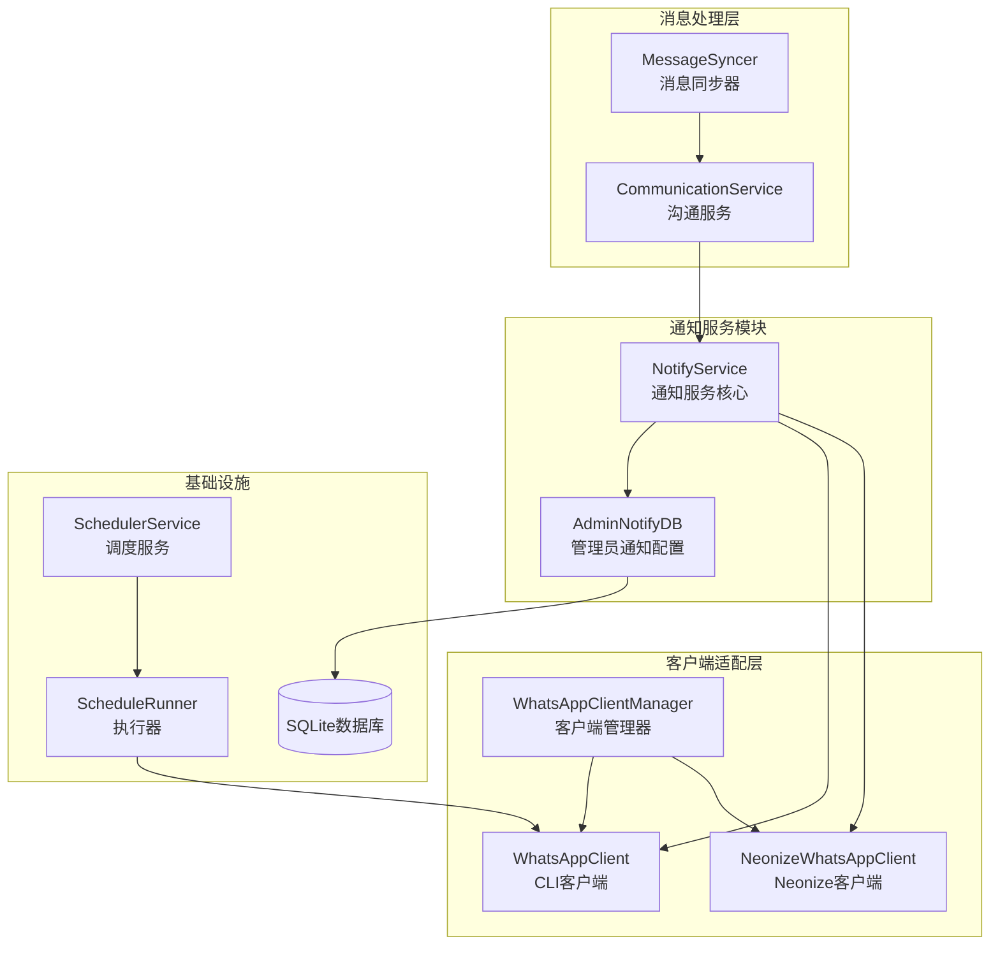
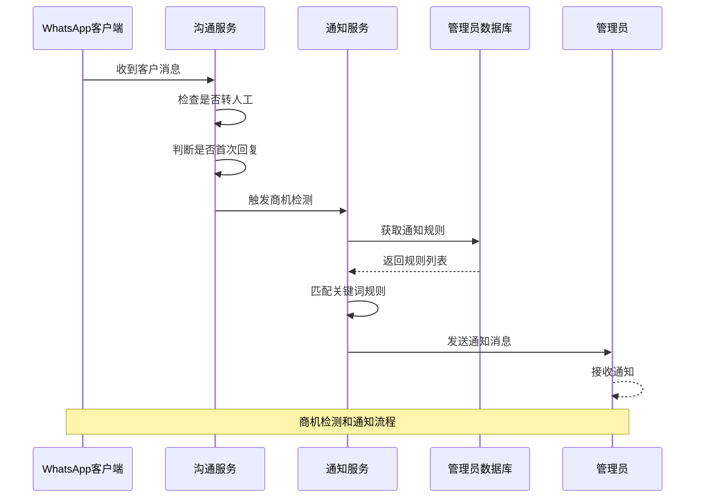
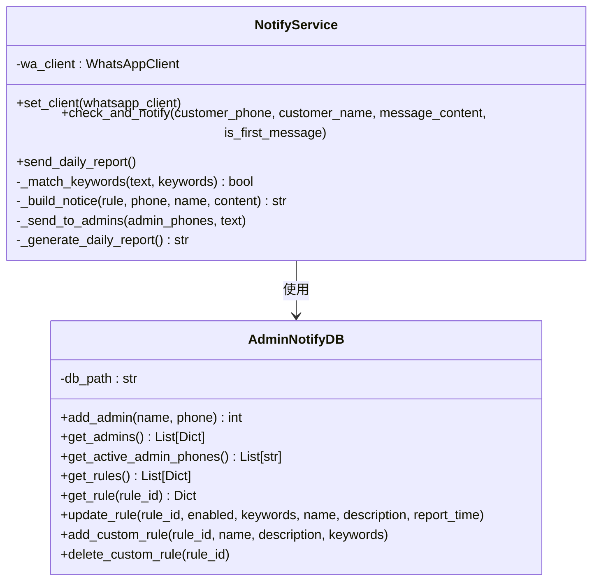
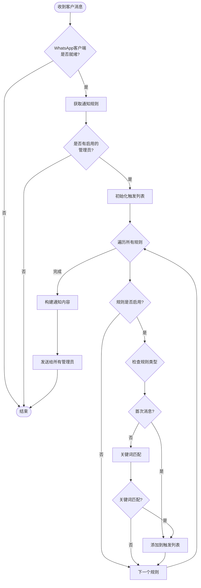
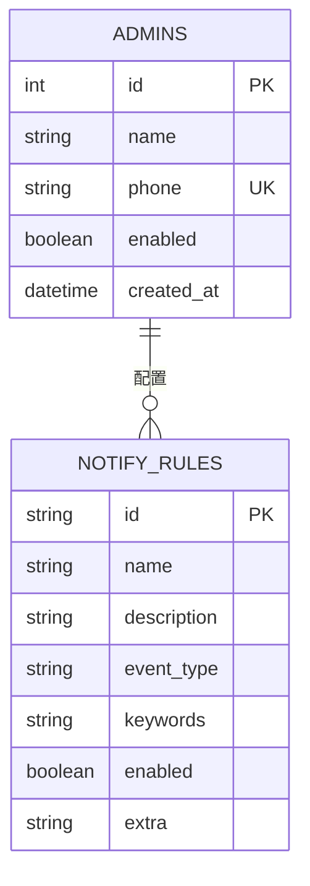
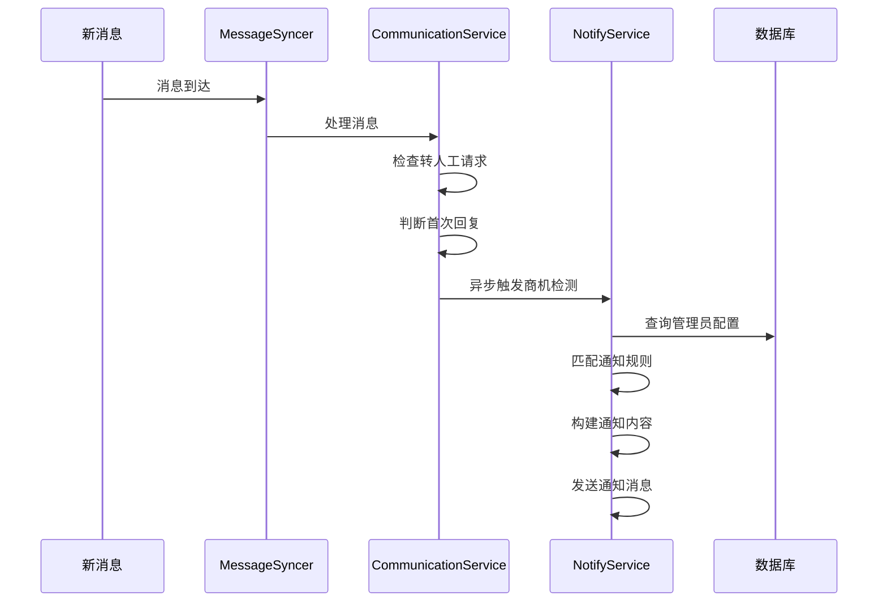
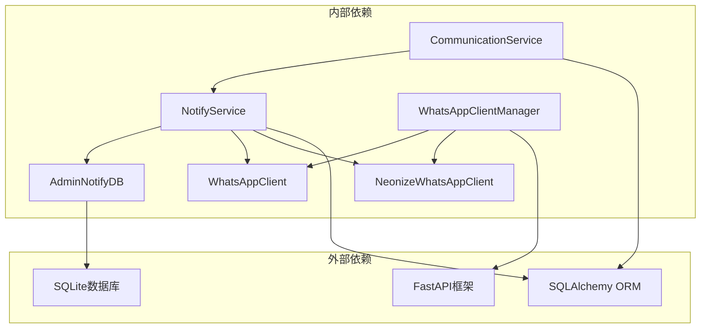

# 通知服务模块

<cite>
**本文档引用的文件**
- [notify_service.py](file://backend/notify_service.py)
- [admin_notify.py](file://backend/admin_notify.py)
- [communication_service.py](file://backend/communication_service.py)
- [whatsapp_client.py](file://backend/whatsapp_client.py)
- [whatsapp_adapter.py](file://backend/whatsapp_adapter.py)
- [neonize_client.py](file://backend/neonize_client.py)
- [main.py](file://backend/main.py)
- [whatsapp_interface.py](file://backend/whatsapp_interface.py)
- [scheduler_service.py](file://backend/scheduler_service.py)
- [schedule_runner.py](file://backend/schedule_runner.py)
</cite>

## 目录
1. [简介](#简介)
2. [项目结构](#项目结构)
3. [核心组件](#核心组件)
4. [架构概览](#架构概览)
5. [详细组件分析](#详细组件分析)
6. [依赖关系分析](#依赖关系分析)
7. [性能考量](#性能考量)
8. [故障排除指南](#故障排除指南)
9. [结论](#结论)

## 简介

通知服务模块是WhatsApp智能客户系统的核心功能之一，负责检测商机事件、向管理员发送通知以及生成每日报告。该模块实现了智能化的通知机制，能够根据预设规则自动识别潜在商机并及时通知相关人员。

系统支持两种主要通知场景：
- **即时通知**：当客户消息触发特定条件时，立即向管理员发送通知
- **定时报告**：每天固定时间生成并发送业务报告

## 项目结构

通知服务模块位于后端目录中，与其他核心组件紧密集成：

**图表来源**
- [notify_service.py:16-195](file://backend/notify_service.py#L16-L195)
- [admin_notify.py:53-235](file://backend/admin_notify.py#L53-L235)
- [communication_service.py:36-800](file://backend/communication_service.py#L36-L800)

**章节来源**
- [notify_service.py:1-195](file://backend/notify_service.py#L1-L195)
- [admin_notify.py:1-235](file://backend/admin_notify.py#L1-L235)

## 核心组件

通知服务模块包含以下关键组件：

### 1. NotifyService（通知服务核心）

NotifyService是通知系统的核心类，负责：
- 检测商机事件并触发通知
- 管理通知规则和管理员配置
- 发送通知消息给管理员
- 生成和发送每日报告

### 2. AdminNotifyDB（管理员通知配置）

AdminNotifyDB提供管理员通知配置的数据持久化：
- 管理员手机号列表管理
- 通知规则的创建、更新和删除
- 默认规则的初始化和维护
- SQLite数据库操作

### 3. 通知规则系统

系统内置多种通知规则：
- **首次消息提醒**：客户第一次联系时通知
- **询价商机**：包含价格相关关键词的消息
- **购买意向**：包含购买相关关键词的消息
- **每日报告**：每天固定时间发送业务报告

**章节来源**
- [notify_service.py:16-195](file://backend/notify_service.py#L16-L195)
- [admin_notify.py:53-235](file://backend/admin_notify.py#L53-L235)

## 架构概览

通知服务模块采用分层架构设计，确保各组件职责清晰、耦合度低：

**图表来源**
- [communication_service.py:125-156](file://backend/communication_service.py#L125-L156)
- [notify_service.py:29-63](file://backend/notify_service.py#L29-L63)

**章节来源**
- [communication_service.py:87-156](file://backend/communication_service.py#L87-L156)
- [notify_service.py:28-98](file://backend/notify_service.py#L28-L98)

## 详细组件分析

### NotifyService 类分析

NotifyService实现了完整的通知逻辑：

#### 核心功能

1. **商机检测**：分析客户消息内容，识别潜在商机
2. **规则匹配**：根据配置的规则判断是否触发通知
3. **管理员通知**：向所有启用的管理员发送通知消息
4. **每日报告**：生成业务统计数据并发送报告

#### 关键方法

**图表来源**
- [notify_service.py:16-195](file://backend/notify_service.py#L16-L195)
- [admin_notify.py:53-235](file://backend/admin_notify.py#L53-L235)

#### 通知规则匹配流程

**图表来源**
- [notify_service.py:29-63](file://backend/notify_service.py#L29-L63)
- [notify_service.py:64-88](file://backend/notify_service.py#L64-L88)

**章节来源**
- [notify_service.py:16-195](file://backend/notify_service.py#L16-L195)

### AdminNotifyDB 类分析

AdminNotifyDB提供了完整的管理员通知配置管理：

#### 数据库结构

**图表来源**
- [admin_notify.py:67-88](file://backend/admin_notify.py#L67-L88)

#### 默认通知规则

系统内置了四种默认通知规则：

1. **首次消息提醒**：客户第一次联系时自动通知
2. **询价商机**：包含价格相关关键词的消息
3. **购买意向**：包含购买相关关键词的消息
4. **每日报告**：每天固定时间发送业务报告

**章节来源**
- [admin_notify.py:15-50](file://backend/admin_notify.py#L15-L50)
- [admin_notify.py:53-235](file://backend/admin_notify.py#L53-L235)

### 消息处理集成

通知服务与消息处理系统深度集成：

**图表来源**
- [communication_service.py:461-495](file://backend/communication_service.py#L461-L495)
- [communication_service.py:125-156](file://backend/communication_service.py#L125-L156)

**章节来源**
- [communication_service.py:87-156](file://backend/communication_service.py#L87-L156)

## 依赖关系分析

通知服务模块的依赖关系如下：

**图表来源**
- [notify_service.py:11](file://backend/notify_service.py#L11)
- [communication_service.py:12-33](file://backend/communication_service.py#L12-L33)

### 关键依赖说明

1. **数据库依赖**：使用SQLite存储管理员配置和通知规则
2. **消息客户端依赖**：支持Neonize和CLI两种WhatsApp客户端
3. **异步处理依赖**：使用线程池处理异步通知发送
4. **配置管理依赖**：通过全局单例模式管理配置

**章节来源**
- [notify_service.py:1-14](file://backend/notify_service.py#L1-L14)
- [admin_notify.py:1-14](file://backend/admin_notify.py#L1-L14)

## 性能考量

通知服务模块在设计时充分考虑了性能优化：

### 异步处理机制

- **异步通知检测**：商机检测在独立线程中执行，避免阻塞消息处理
- **线程池管理**：使用线程池处理并发通知发送
- **数据库连接池**：合理管理数据库连接，避免连接泄漏

### 内存优化策略

- **消息ID去重**：使用有序字典缓存消息ID，支持自动清理过期数据
- **内存限制**：设置消息ID缓存上限，防止内存泄漏
- **连接超时**：为数据库操作设置超时时间

### 错误处理机制

- **异常捕获**：对所有外部依赖操作进行异常捕获
- **重试机制**：对网络操作实施有限重试
- **降级处理**：在网络异常时提供降级方案

**章节来源**
- [neonize_client.py:97-125](file://backend/neonize_client.py#L97-L125)
- [neonize_client.py:198-210](file://backend/neonize_client.py#L198-L210)

## 故障排除指南

### 常见问题及解决方案

#### 1. 通知未发送

**症状**：客户消息触发了商机规则但管理员未收到通知

**排查步骤**：
1. 检查管理员配置是否正确
2. 验证WhatsApp客户端连接状态
3. 查看通知规则是否启用
4. 检查日志中的错误信息

**解决方案**：
- 确认管理员手机号格式正确
- 重启WhatsApp客户端连接
- 检查网络连接稳定性
- 查看通知发送日志

#### 2. 通知规则不生效

**症状**：设置了自定义关键词但未触发通知

**排查步骤**：
1. 检查关键词是否正确配置
2. 验证规则状态是否启用
3. 测试关键词匹配逻辑
4. 查看规则优先级设置

**解决方案**：
- 确认关键词格式正确
- 检查规则启用状态
- 验证关键词大小写处理
- 调整规则优先级

#### 3. 每日报告未发送

**症状**：到了设定时间未收到每日报告

**排查步骤**：
1. 检查调度服务状态
2. 验证报告规则配置
3. 查看数据库连接状态
4. 检查定时任务执行情况

**解决方案**：
- 重启调度服务
- 检查数据库权限
- 验证报告生成逻辑
- 查看定时任务日志

**章节来源**
- [notify_service.py:90-98](file://backend/notify_service.py#L90-L98)
- [admin_notify.py:180-203](file://backend/admin_notify.py#L180-L203)

## 结论

通知服务模块是WhatsApp智能客户系统的重要组成部分，通过智能化的商机检测和及时的通知机制，有效提升了客户服务效率和业务转化率。

### 主要优势

1. **灵活的通知规则**：支持多种通知场景和自定义规则
2. **多客户端支持**：同时支持Neonize和CLI两种WhatsApp客户端
3. **高可用性设计**：完善的错误处理和重试机制
4. **性能优化**：异步处理和内存优化确保系统稳定运行

### 技术特点

- **模块化设计**：各组件职责明确，便于维护和扩展
- **配置驱动**：通过数据库配置实现灵活的功能调整
- **异步处理**：避免阻塞主消息处理流程
- **错误恢复**：具备完善的错误检测和恢复机制

通知服务模块为整个WhatsApp智能客户系统提供了强大的通知能力，是实现自动化客户服务和业务增长的关键技术支撑。