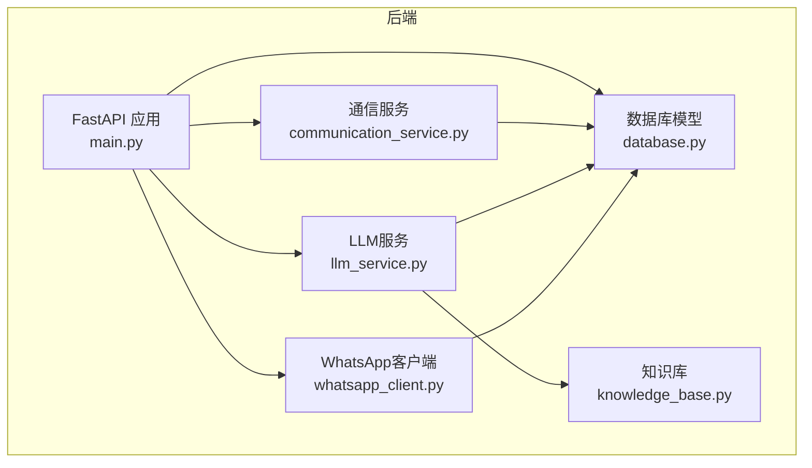
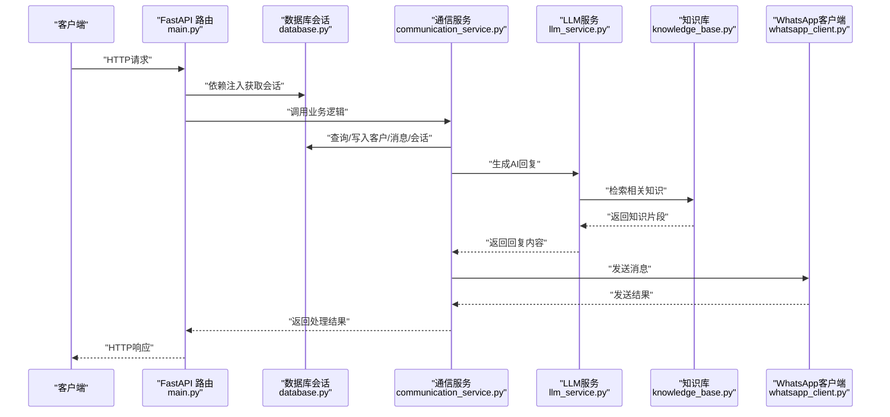
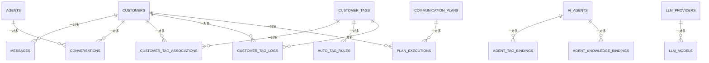
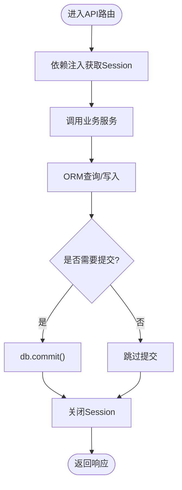
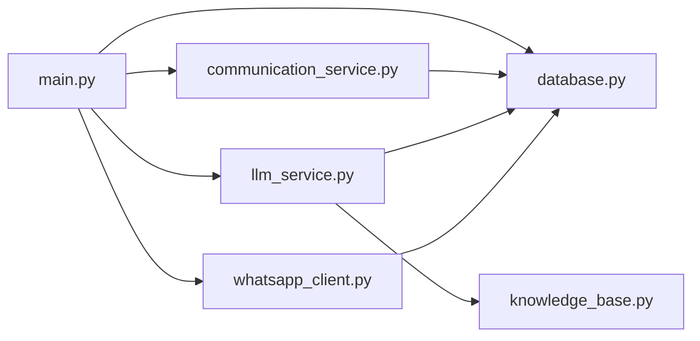

# 数据架构设计

<cite>
**本文引用的文件**
- [database.py](file://backend/database.py)
- [main.py](file://backend/main.py)
- [communication_service.py](file://backend/communication_service.py)
- [llm_service.py](file://backend/llm_service.py)
- [whatsapp_client.py](file://backend/whatsapp_client.py)
- [knowledge_base.py](file://backend/knowledge_base.py)
</cite>

## 目录
1. [简介](#简介)
2. [项目结构](#项目结构)
3. [核心组件](#核心组件)
4. [架构总览](#架构总览)
5. [详细组件分析](#详细组件分析)
6. [依赖分析](#依赖分析)
7. [性能考量](#性能考量)
8. [故障排查指南](#故障排查指南)
9. [结论](#结论)
10. [附录](#附录)

## 简介
本文件为WhatsApp智能客户系统提供数据架构设计文档，重点围绕基于SQLAlchemy ORM的数据模型设计，涵盖Customer、Message、Conversation、AIAgent等核心实体及其关系映射；阐述数据库表结构设计（主键、外键、索引）的原则与性能考虑；说明数据访问层的抽象设计（Session管理、事务处理、连接池配置）；解释一对一、一对多、多对多关系映射及中间表设计；描述数据持久化策略（缓存机制、批量操作、一致性保证）；提供ER图以展示实体关系（含客户标签关联、智能体绑定等复杂关系）；并说明数据迁移与版本管理策略（数据库升级与回滚机制）。

## 项目结构
系统采用FastAPI + SQLAlchemy ORM的后端架构，数据库模型集中于database.py，业务服务位于独立模块中，通过依赖注入的方式在API路由中使用数据库会话。

图表来源
- [main.py:17-26](file://backend/main.py#L17-L26)
- [database.py:14-20](file://backend/database.py#L14-L20)
- [communication_service.py:8-14](file://backend/communication_service.py#L8-L14)
- [llm_service.py:7-8](file://backend/llm_service.py#L7-L8)
- [whatsapp_client.py](file://backend/whatsapp_client.py#L10)
- [knowledge_base.py:14-17](file://backend/knowledge_base.py#L14-L17)

章节来源
- [main.py:17-26](file://backend/main.py#L17-L26)
- [database.py:14-20](file://backend/database.py#L14-L20)

## 核心组件
- 数据库引擎与会话工厂：通过SQLAlchemy创建引擎与会话工厂，支持SQLite数据库，默认使用绝对路径确保跨平台一致性。
- ORM模型集合：包含客户、消息、会话、智能体、标签、计划、LLM提供商与模型等实体，统一继承Base并具备主键、索引与关系映射。
- 依赖注入：通过get_db生成器提供数据库会话，确保每个请求拥有独立的Session实例，避免并发问题。
- 业务服务：通信服务负责自动回复与计划执行；LLM服务负责智能体选择与大模型调用；知识库提供文档检索与关键词索引。

章节来源
- [database.py:14-20](file://backend/database.py#L14-L20)
- [database.py:23-181](file://backend/database.py#L23-L181)
- [main.py:290-296](file://backend/main.py#L290-L296)
- [communication_service.py:17-46](file://backend/communication_service.py#L17-L46)
- [llm_service.py:11-17](file://backend/llm_service.py#L11-L17)
- [knowledge_base.py:11-17](file://backend/knowledge_base.py#L11-L17)

## 架构总览
系统通过FastAPI路由接收HTTP请求，依赖注入获取数据库会话，调用业务服务（通信、LLM、知识库），并通过WhatsApp客户端与外部WhatsApp CLI交互，最终将结果写入数据库或返回给前端。

图表来源
- [main.py:585-796](file://backend/main.py#L585-L796)
- [communication_service.py:47-71](file://backend/communication_service.py#L47-L71)
- [llm_service.py:86-198](file://backend/llm_service.py#L86-L198)
- [knowledge_base.py:130-141](file://backend/knowledge_base.py#L130-L141)
- [whatsapp_client.py:133-154](file://backend/whatsapp_client.py#L133-L154)

## 详细组件分析

### 数据模型与关系映射
- 客户（Customer）
  - 主键：id
  - 索引：phone（唯一、索引）
  - 关系：一对多 -> Message、Conversation
  - 扩展：通过CustomerTagAssociation实现与标签的多对多关系
- 消息（Message）
  - 主键：id
  - 索引：customer_id、wa_message_id（唯一、索引）、created_at
  - 关系：多对一 -> Customer
- 会话（Conversation）
  - 主键：id
  - 索引：customer_id、last_message_at
  - 关系：多对一 -> Customer、Agent（可空）
- 销售员/客服（Agent）
  - 主键：id
  - 索引：email（唯一、索引）
  - 关系：一对多 -> Conversation
- 沟通计划（CommunicationPlan）
  - 主键：id
  - 关系：一对多 -> PlanExecution
- 计划执行记录（PlanExecution）
  - 主键：id
  - 索引：plan_id、customer_id
  - 关系：多对一 -> CommunicationPlan、Customer
- 客户标签（CustomerTag）
  - 主键：id
  - 索引：name（唯一、索引）
  - 关系：一对多 -> CustomerTagAssociation
- 客户标签关联（CustomerTagAssociation）
  - 主键：id
  - 索引：customer_id、tag_id
  - 关系：多对一 -> Customer、CustomerTag
- AI智能体（AIAgent）
  - 主键：id
  - 关系：一对多 -> AgentTagBinding、AgentKnowledgeBinding
  - 可选外键：llm_provider_id -> LLMProvider
- 智能体-标签绑定（AgentTagBinding）
  - 主键：id
  - 关系：多对一 -> AIAgent、CustomerTag
- 智能体-知识库绑定（AgentKnowledgeBinding）
  - 主键：id
  - 关系：多对一 -> AIAgent
- 大模型提供商（LLMProvider）
  - 主键：id
  - 关系：一对多 -> LLMModel
- 大模型配置（LLMModel）
  - 主键：id
  - 关系：多对一 -> LLMProvider
- 自动打标签规则（AutoTagRule）
  - 主键：id
  - 关系：多对一 -> CustomerTag
- 客户标签操作日志（CustomerTagLog）
  - 主键：id
  - 关系：多对一 -> Customer、CustomerTag

图表来源
- [database.py:23-181](file://backend/database.py#L23-L181)
- [database.py:184-228](file://backend/database.py#L184-L228)
- [database.py:259-288](file://backend/database.py#L259-L288)

章节来源
- [database.py:23-181](file://backend/database.py#L23-L181)
- [database.py:184-228](file://backend/database.py#L184-L228)
- [database.py:259-288](file://backend/database.py#L259-L288)

### 数据访问层抽象设计
- Session管理
  - 通过SessionLocal创建会话，每个请求使用独立Session，避免线程安全问题。
  - 通过get_db生成器在依赖注入中提供会话，并在finally中关闭，确保资源释放。
- 事务处理
  - 业务逻辑中显式调用commit提交事务，异常时由调用方控制回滚或抛出。
  - 对于批量写入（如同步联系人），在循环结束后一次性commit，减少事务开销。
- 连接池配置
  - 使用SQLAlchemy默认连接池行为；SQLite下connect_args禁用线程检查以适配非主线程场景。
- 依赖注入
  - FastAPI路由通过Depends(get_db)注入Session，确保API层与数据层解耦。

图表来源
- [main.py:501-554](file://backend/main.py#L501-L554)
- [main.py:383-474](file://backend/main.py#L383-L474)
- [database.py:290-296](file://backend/database.py#L290-L296)

章节来源
- [database.py:14-20](file://backend/database.py#L14-L20)
- [database.py:290-296](file://backend/database.py#L290-L296)
- [main.py:383-474](file://backend/main.py#L383-L474)

### 关系映射与中间表设计
- 一对一/一对多
  - Customer -> Message/Conversation：一对多
  - Agent -> Conversation：一对多
  - CommunicationPlan -> PlanExecution：一对多
  - LLMProvider -> LLMModel：一对多
- 多对多
  - Customer <-> CustomerTag：通过CustomerTagAssociation中间表实现
  - AIAgent <-> CustomerTag：通过AgentTagBinding中间表实现
  - AIAgent <-> 知识库文档：通过AgentKnowledgeBinding中间表实现
- 复杂关系
  - AIAgent可绑定特定LLMProvider与模型，支持智能体级别参数覆盖。
  - AutoTagRule与CustomerTag关联，支持按条件自动打标签。

章节来源
- [database.py:141-153](file://backend/database.py#L141-L153)
- [database.py:184-209](file://backend/database.py#L184-L209)
- [database.py:259-288](file://backend/database.py#L259-L288)

### 数据持久化策略
- 缓存机制
  - 系统未实现应用层缓存；可通过外部Redis或本地内存缓存优化热点查询（建议在现有架构基础上扩展）。
- 批量操作
  - 同步联系人时，先收集变更，再一次性commit，降低事务开销。
- 数据一致性
  - 使用外键约束与级联删除保证引用完整性；通过Session事务边界控制一致性。
  - 对于消息标记已读等状态更新，采用单事务内完成，避免状态不一致。

章节来源
- [main.py:402-460](file://backend/main.py#L402-L460)

### ER图（含复杂关系）

图表来源
- [database.py:23-181](file://backend/database.py#L23-L181)
- [database.py:184-228](file://backend/database.py#L184-L228)
- [database.py:259-288](file://backend/database.py#L259-L288)

## 依赖分析
- 模块耦合
  - main.py依赖database.py中的模型与会话工厂，同时依赖其他服务模块（communication_service、llm_service、knowledge_base等）。
  - communication_service与llm_service均依赖database.py中的模型进行查询与写入。
  - llm_service依赖knowledge_base进行知识检索。
  - whatsapp_client与database交互，用于消息发送与状态更新。
- 外部依赖
  - SQLAlchemy ORM、FastAPI、httpx（LLM调用）、whatsapp-cli（外部命令）。

图表来源
- [main.py:17-26](file://backend/main.py#L17-L26)
- [communication_service.py:8-14](file://backend/communication_service.py#L8-L14)
- [llm_service.py:7-8](file://backend/llm_service.py#L7-L8)
- [whatsapp_client.py](file://backend/whatsapp_client.py#L10)
- [knowledge_base.py:14-17](file://backend/knowledge_base.py#L14-L17)

章节来源
- [main.py:17-26](file://backend/main.py#L17-L26)
- [communication_service.py:8-14](file://backend/communication_service.py#L8-L14)
- [llm_service.py:7-8](file://backend/llm_service.py#L7-L8)
- [whatsapp_client.py](file://backend/whatsapp_client.py#L10)
- [knowledge_base.py:14-17](file://backend/knowledge_base.py#L14-L17)

## 性能考量
- 索引设计
  - 为高频查询字段建立索引：Customer.phone（唯一、索引）、Message.customer_id/wa_message_id（唯一、索引）、Conversation.customer_id/last_message_at等。
- 查询优化
  - 使用join与过滤减少N+1查询；对分页查询使用limit与order_by。
- 事务与批量
  - 批量写入时合并commit，减少事务开销；对只读查询避免不必要的事务。
- 连接池
  - SQLite默认连接池已满足轻量场景；若并发较高，可考虑调整连接池参数或迁移到PostgreSQL/MySQL。
- 异步与并发
  - LLM调用使用异步HTTP客户端；消息同步采用异步子进程，避免阻塞主线程。

章节来源
- [database.py:27-56](file://backend/database.py#L27-L56)
- [database.py:63-72](file://backend/database.py#L63-L72)
- [database.py:159-176](file://backend/database.py#L159-L176)
- [llm_service.py:150-164](file://backend/llm_service.py#L150-L164)
- [whatsapp_client.py:174-200](file://backend/whatsapp_client.py#L174-L200)

## 故障排查指南
- 数据库初始化
  - 若首次运行报错，确认DATABASE_URL环境变量或默认SQLite路径存在且可写。
- 会话泄漏
  - 确保每个请求都通过get_db生成器获取Session并在finally中关闭。
- 外部依赖
  - WhatsApp CLI不可用或未登录会导致消息发送失败；检查auth状态与CLI安装路径。
- LLM调用失败
  - 检查LLM提供商配置（API Key、Base URL、模型ID）与网络连通性；查看错误日志定位问题。
- 知识库异常
  - 确认知识库数据库文件路径存在且可写；关键词提取逻辑仅适用于中文文本，需根据实际场景优化。

章节来源
- [database.py:12-18](file://backend/database.py#L12-L18)
- [database.py:290-296](file://backend/database.py#L290-L296)
- [main.py:221-340](file://backend/main.py#L221-L340)
- [llm_service.py:149-175](file://backend/llm_service.py#L149-L175)
- [knowledge_base.py:14-17](file://backend/knowledge_base.py#L14-L17)

## 结论
本系统以SQLAlchemy ORM为核心构建数据层，模型设计清晰、关系映射完整，结合FastAPI的依赖注入实现了良好的模块解耦。通过合理的索引与事务策略，满足中小规模业务的性能与一致性需求。建议后续引入缓存、连接池参数调优与数据库迁移工具，进一步提升可维护性与扩展性。

## 附录
- 数据库迁移与版本管理策略
  - 当前代码未集成Alembic等迁移工具。建议引入Alembic以支持数据库schema变更的版本化管理，包括：
    - 升级：通过版本脚本逐步变更表结构、索引与约束。
    - 回滚：提供逆向脚本恢复到上一个稳定版本。
    - 迁移验证：在CI中执行迁移脚本，确保生产环境一致性。
  - 迁移流程建议：
    - 开发阶段：每次schema变更先编写迁移脚本，本地测试通过后再合并。
    - 预发布：在预生产环境执行迁移，验证数据完整性与性能影响。
    - 生产发布：滚动更新，先升级Schema，再重启服务，最后清理旧数据或执行数据修复脚本。