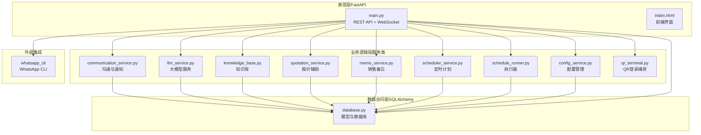
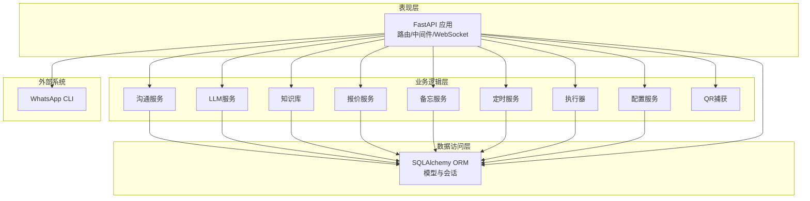
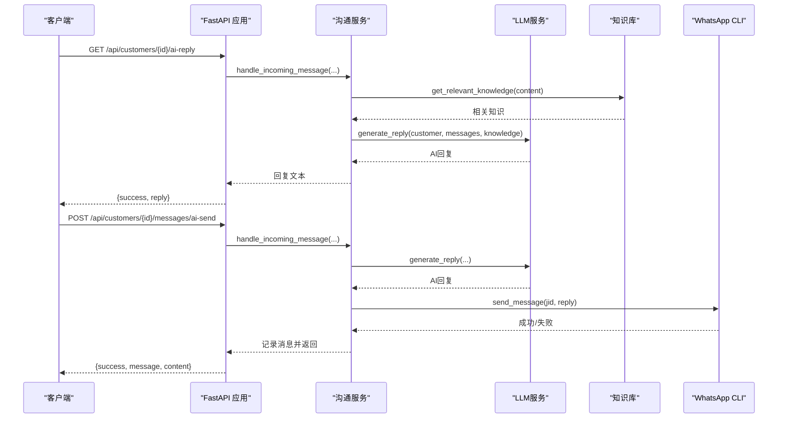
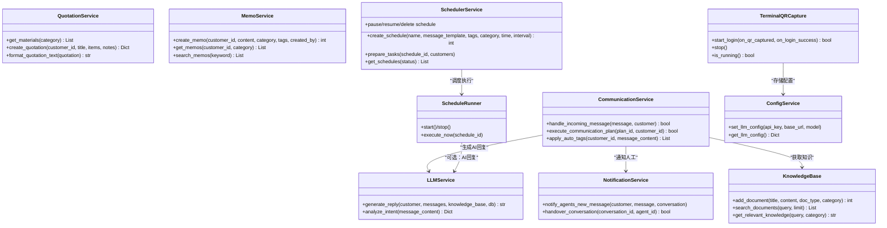
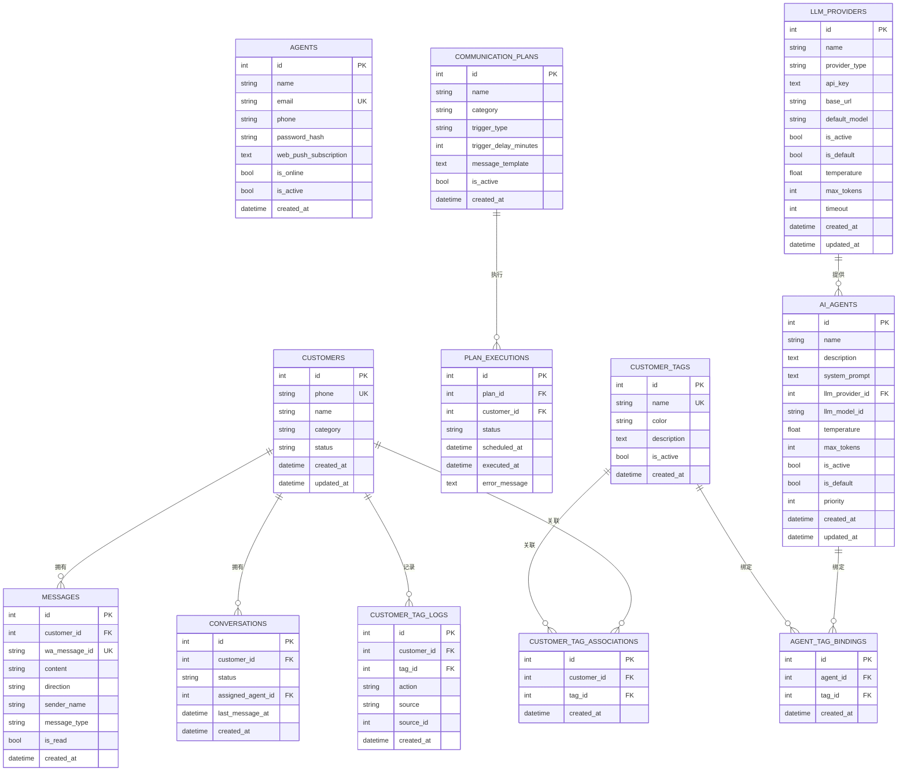
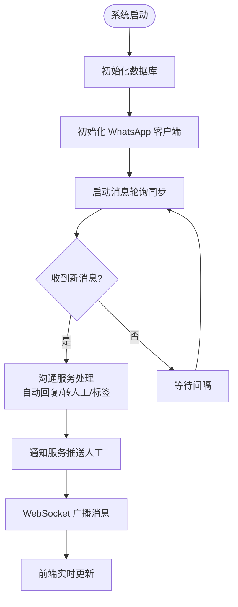
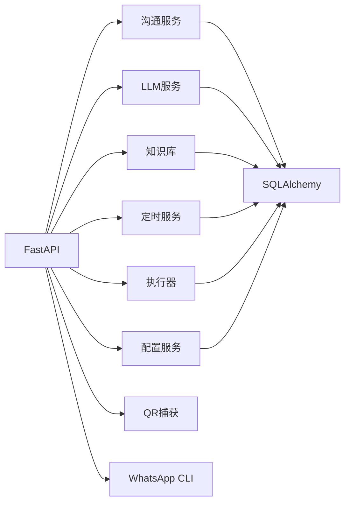

# 整体架构设计

<cite>
**本文档引用的文件**
- [backend/main.py](file://backend/main.py)
- [backend/database.py](file://backend/database.py)
- [backend/whatsapp_client.py](file://backend/whatsapp_client.py)
- [backend/communication_service.py](file://backend/communication_service.py)
- [backend/llm_service.py](file://backend/llm_service.py)
- [backend/knowledge_base.py](file://backend/knowledge_base.py)
- [backend/quotation_service.py](file://backend/quotation_service.py)
- [backend/memo_service.py](file://backend/memo_service.py)
- [backend/scheduler_service.py](file://backend/scheduler_service.py)
- [backend/schedule_runner.py](file://backend/schedule_runner.py)
- [backend/qr_terminal.py](file://backend/qr_terminal.py)
- [backend/config_service.py](file://backend/config_service.py)
- [backend/static/index.html](file://backend/static/index.html)
- [requirements.txt](file://requirements.txt)
</cite>

## 目录
1. [简介](#简介)
2. [项目结构](#项目结构)
3. [核心组件](#核心组件)
4. [架构总览](#架构总览)
5. [详细组件分析](#详细组件分析)
6. [依赖关系分析](#依赖关系分析)
7. [性能考量](#性能考量)
8. [故障排查指南](#故障排查指南)
9. [结论](#结论)
10. [附录](#附录)

## 简介
本系统是一个基于 WhatsApp CLI 的智能客户关系管理系统，采用分层架构、服务导向架构（SOA）与事件驱动架构相结合的设计理念。系统通过 FastAPI 提供 REST API 与 WebSocket 实时通信，结合 SQLAlchemy 实现数据持久化，通过 WhatsApp 客户端与外部 WhatsApp CLI 交互，配合 LLM 服务实现智能回复，并通过调度器实现定时消息发送。系统强调模块化与可扩展性，支持异步编程模式以提升并发与响应能力。

## 项目结构
系统采用“表现层-业务逻辑层-数据访问层”的分层组织方式，同时在业务逻辑层内部进一步细分为多个服务模块，形成模块化的 SOA 设计。前端静态资源通过 FastAPI 挂载，提供 Web 控制台与聊天界面。

**图表来源**
- [backend/main.py:128-157](file://backend/main.py#L128-L157)
- [backend/database.py:14-20](file://backend/database.py#L14-L20)
- [backend/whatsapp_client.py:13-26](file://backend/whatsapp_client.py#L13-L26)

**章节来源**
- [backend/main.py:128-157](file://backend/main.py#L128-L157)
- [backend/database.py:14-20](file://backend/database.py#L14-L20)

## 核心组件
- 表现层（FastAPI）
  - 提供 REST API 与 WebSocket，负责路由、中间件、静态资源挂载与生命周期管理。
  - 关键点：CORS、静态文件挂载、WebSocket 广播、认证与登录流程、客户/消息/会话管理接口。
- 业务逻辑层（服务类）
  - 沟通服务：自动回复、转人工、会话状态管理、通知服务。
  - LLM 服务：智能回复、意图识别、模型提供商与智能体选择。
  - 知识库：文档管理与关键词检索。
  - 报价辅助：材料与报价单管理。
  - 销售备忘：客户沟通要点记录。
  - 定时计划：计划创建、任务队列与执行器。
  - 配置服务：敏感配置加密存储。
  - QR 登录捕获：终端 QR 码渲染与登录流程。
- 数据访问层（SQLAlchemy）
  - 客户、消息、会话、销售员、沟通计划、标签、智能体、LLM 提供商等模型。
  - 数据库初始化与会话管理。
- 外部集成
  - WhatsApp CLI：认证状态、联系人/聊天/消息获取、发送消息、持续同步。

**章节来源**
- [backend/main.py:196-475](file://backend/main.py#L196-L475)
- [backend/communication_service.py:17-512](file://backend/communication_service.py#L17-L512)
- [backend/llm_service.py:11-286](file://backend/llm_service.py#L11-L286)
- [backend/knowledge_base.py:11-212](file://backend/knowledge_base.py#L11-L212)
- [backend/quotation_service.py:10-277](file://backend/quotation_service.py#L10-L277)
- [backend/memo_service.py:9-156](file://backend/memo_service.py#L9-L156)
- [backend/scheduler_service.py:54-393](file://backend/scheduler_service.py#L54-L393)
- [backend/schedule_runner.py:12-142](file://backend/schedule_runner.py#L12-L142)
- [backend/config_service.py:11-153](file://backend/config_service.py#L11-L153)
- [backend/qr_terminal.py:14-297](file://backend/qr_terminal.py#L14-L297)
- [backend/database.py:23-296](file://backend/database.py#L23-L296)

## 架构总览
系统采用三层架构与 SOA 的组合：
- 分层架构：表现层（FastAPI）、业务逻辑层（服务类）、数据访问层（SQLAlchemy）。
- 服务导向架构（SOA）：各服务模块职责明确，通过统一接口协作，便于扩展与替换。
- 事件驱动架构：消息同步采用轮询+回调机制，WebSocket 实现实时事件推送；定时计划通过执行器异步调度。

**图表来源**
- [backend/main.py:128-157](file://backend/main.py#L128-L157)
- [backend/whatsapp_client.py:13-26](file://backend/whatsapp_client.py#L13-L26)
- [backend/database.py:14-20](file://backend/database.py#L14-L20)

## 详细组件分析

### 表现层（FastAPI）组件分析
- 生命周期管理：应用启动时初始化数据库、WhatsApp 客户端与消息同步器，关闭时清理资源。
- 认证与登录：提供 QR 码获取、状态查询、取消登录、退出登录等接口；登录成功后自动同步联系人与聊天。
- 实时通信：WebSocket 维护活动连接，广播新消息至所有客户端。
- 客户与消息管理：提供客户列表、详情、分类更新；消息历史查询与发送。
- 会话与通知：会话列表、接手会话、关闭会话；通知服务对接人工客服。
- 沟通计划：计划列表、手动执行、AI 自动回复生成与发送。
- 状态查询：系统状态、WhatsApp 连接状态、WebSocket 客户端数量。

**图表来源**
- [backend/main.py:725-796](file://backend/main.py#L725-L796)
- [backend/communication_service.py:47-265](file://backend/communication_service.py#L47-L265)
- [backend/llm_service.py:177-198](file://backend/llm_service.py#L177-L198)
- [backend/knowledge_base.py:130-141](file://backend/knowledge_base.py#L130-L141)
- [backend/whatsapp_client.py:133-154](file://backend/whatsapp_client.py#L133-L154)

**章节来源**
- [backend/main.py:88-126](file://backend/main.py#L88-L126)
- [backend/main.py:196-475](file://backend/main.py#L196-L475)
- [backend/main.py:725-796](file://backend/main.py#L725-L796)

### 业务逻辑层（服务类）组件分析
- 沟通服务
  - 自动回复策略：根据客户分类（新客户、意向客户、老客户）与会话状态（bot/handover）决定是否回复。
  - 转人工请求检测与处理。
  - 自动打标签规则：关键词匹配、报价请求等条件触发。
  - 通知服务：向在线客服推送新消息提醒。
- LLM 服务
  - 智能体选择：按客户标签与优先级匹配智能体，支持不同提供商与模型。
  - 回复生成：构建系统提示词与对话历史，调用外部 LLM API。
  - 意图分析：识别消息意图与紧急程度。
- 知识库
  - 文档增删改查、关键词提取与索引、相似度检索。
- 报价辅助
  - 材料管理、报价单生成与格式化。
- 销售备忘
  - 客户沟通要点记录、分类与标签、搜索。
- 定时计划
  - 计划创建、任务队列、状态管理、暂停/恢复/删除。
- 执行器
  - 异步执行定时计划，按间隔逐个发送消息。
- 配置服务
  - 加密存储敏感配置（API Key 等）。
- QR 登录捕获
  - 终端输出解析、ASCII QR 码渲染为图片、登录进程监控。

**图表来源**
- [backend/communication_service.py:17-512](file://backend/communication_service.py#L17-L512)
- [backend/llm_service.py:11-286](file://backend/llm_service.py#L11-L286)
- [backend/knowledge_base.py:11-212](file://backend/knowledge_base.py#L11-L212)
- [backend/quotation_service.py:10-277](file://backend/quotation_service.py#L10-L277)
- [backend/memo_service.py:9-156](file://backend/memo_service.py#L9-L156)
- [backend/scheduler_service.py:54-393](file://backend/scheduler_service.py#L54-L393)
- [backend/schedule_runner.py:12-142](file://backend/schedule_runner.py#L12-L142)
- [backend/config_service.py:11-153](file://backend/config_service.py#L11-L153)
- [backend/qr_terminal.py:14-297](file://backend/qr_terminal.py#L14-L297)

**章节来源**
- [backend/communication_service.py:17-512](file://backend/communication_service.py#L17-L512)
- [backend/llm_service.py:11-286](file://backend/llm_service.py#L11-L286)
- [backend/knowledge_base.py:11-212](file://backend/knowledge_base.py#L11-L212)
- [backend/quotation_service.py:10-277](file://backend/quotation_service.py#L10-L277)
- [backend/memo_service.py:9-156](file://backend/memo_service.py#L9-L156)
- [backend/scheduler_service.py:54-393](file://backend/scheduler_service.py#L54-L393)
- [backend/schedule_runner.py:12-142](file://backend/schedule_runner.py#L12-L142)
- [backend/config_service.py:11-153](file://backend/config_service.py#L11-L153)
- [backend/qr_terminal.py:14-297](file://backend/qr_terminal.py#L14-L297)

### 数据访问层（SQLAlchemy）组件分析
- 模型设计：客户、消息、会话、销售员、沟通计划、标签、智能体、LLM 提供商等，定义字段与关系。
- 数据库初始化：创建所有表。
- 会话管理：提供 get_db 依赖注入，确保每个请求拥有独立会话并正确关闭。

**图表来源**
- [backend/database.py:23-296](file://backend/database.py#L23-L296)

**章节来源**
- [backend/database.py:23-296](file://backend/database.py#L23-L296)

### 异步编程模式与事件驱动
- FastAPI 异步特性：路由函数与 WebSocket 处理均声明为异步，支持高并发请求。
- asyncio 使用：消息同步器采用轮询+异步回调，执行器使用 asyncio 任务调度，QR 登录捕获使用子进程与线程配合异步输出处理。
- 事件驱动：WhatsApp 消息同步通过回调触发自动回复与通知；WebSocket 广播新消息；定时计划通过执行器周期性检查与执行。

**图表来源**
- [backend/main.py:88-126](file://backend/main.py#L88-L126)
- [backend/whatsapp_client.py:366-437](file://backend/whatsapp_client.py#L366-L437)
- [backend/communication_service.py:47-171](file://backend/communication_service.py#L47-L171)

**章节来源**
- [backend/main.py:88-126](file://backend/main.py#L88-L126)
- [backend/whatsapp_client.py:366-437](file://backend/whatsapp_client.py#L366-L437)

## 依赖关系分析
- 组件耦合与内聚
  - 表现层仅依赖服务接口，不直接操作数据库，内聚性良好。
  - 服务层之间通过接口协作，避免强耦合；个别服务存在循环依赖（如消息处理中对沟通服务的调用），可通过重构解耦。
- 外部依赖
  - WhatsApp CLI：认证、联系人、聊天、消息、发送。
  - LLM API：OpenAI/Claude 等，通过配置服务管理密钥与模型。
- 数据库依赖
  - 所有服务通过 SQLAlchemy ORM 访问数据库，统一事务与会话管理。

**图表来源**
- [backend/main.py:128-157](file://backend/main.py#L128-L157)
- [backend/whatsapp_client.py:13-26](file://backend/whatsapp_client.py#L13-L26)
- [backend/database.py:14-20](file://backend/database.py#L14-L20)

**章节来源**
- [backend/main.py:128-157](file://backend/main.py#L128-L157)
- [backend/whatsapp_client.py:13-26](file://backend/whatsapp_client.py#L13-L26)
- [backend/database.py:14-20](file://backend/database.py#L14-L20)

## 性能考量
- 异步与并发
  - FastAPI 异步路由与 WebSocket 并发处理高负载请求。
  - 消息同步采用轮询+回调，避免阻塞主线程；执行器异步调度定时任务。
- 数据库优化
  - 使用 SQLite 适合轻量场景；生产建议迁移到 PostgreSQL/MySQL 并启用连接池。
  - 对常用查询字段建立索引（如客户 phone、消息 created_at 等）。
- I/O 优化
  - LLM 调用使用异步 HTTP 客户端；QR 码渲染使用 PIL，注意内存与 CPU 占用。
  - WebSocket 广播时过滤断开连接，减少无效 I/O。
- 可扩展性
  - 服务模块化设计便于水平扩展；数据库可读写分离与缓存（如 Redis）增强性能。

## 故障排查指南
- WhatsApp 连接问题
  - 检查认证状态与登录流程，确认 CLI 可用且网络可达。
  - 登录失败时查看 QR 捕获日志与进程状态。
- 消息同步异常
  - 检查消息轮询间隔与事件循环状态；确认回调触发与会话状态。
- LLM 调用失败
  - 核对配置服务中的 API Key、Base URL 与模型；检查超时与限流。
- WebSocket 断连
  - 客户端 ping/pong 心跳；服务端清理断开连接并重连。
- 数据库锁与事务
  - 避免长事务；合理使用会话与提交/回滚。

**章节来源**
- [backend/main.py:196-475](file://backend/main.py#L196-L475)
- [backend/whatsapp_client.py:174-210](file://backend/whatsapp_client.py#L174-L210)
- [backend/llm_service.py:149-176](file://backend/llm_service.py#L149-L176)
- [backend/qr_terminal.py:242-284](file://backend/qr_terminal.py#L242-L284)

## 结论
本系统通过分层架构与 SOA 的有机结合，实现了从表现层到业务逻辑再到数据访问的清晰职责划分。异步编程模式提升了并发性能与用户体验，事件驱动机制保障了消息与计划的及时处理。模块化设计便于后续扩展与维护，技术选型在性能、可扩展性与可维护性之间取得平衡。

## 附录
- 技术栈与依赖
  - Python 标准库为主，FastAPI 提供异步 Web 框架，SQLAlchemy 提供 ORM，Pillow 用于 QR 码渲染，httpx 用于异步 HTTP 调用。
- 部署建议
  - 前端静态资源通过 Nginx 或 CDN 提供；后端使用 Gunicorn/Uvicorn 部署；数据库迁移至生产数据库；启用 HTTPS 与访问控制。

**章节来源**
- [requirements.txt:1-8](file://requirements.txt#L1-L8)
- [backend/static/index.html:1-800](file://backend/static/index.html#L1-L800)