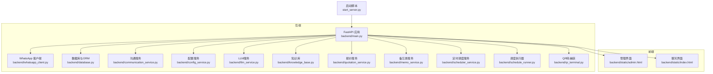
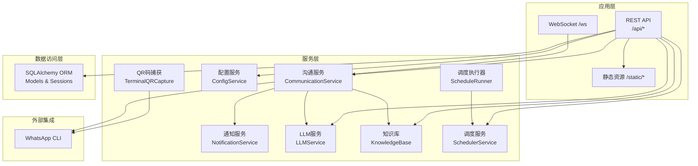
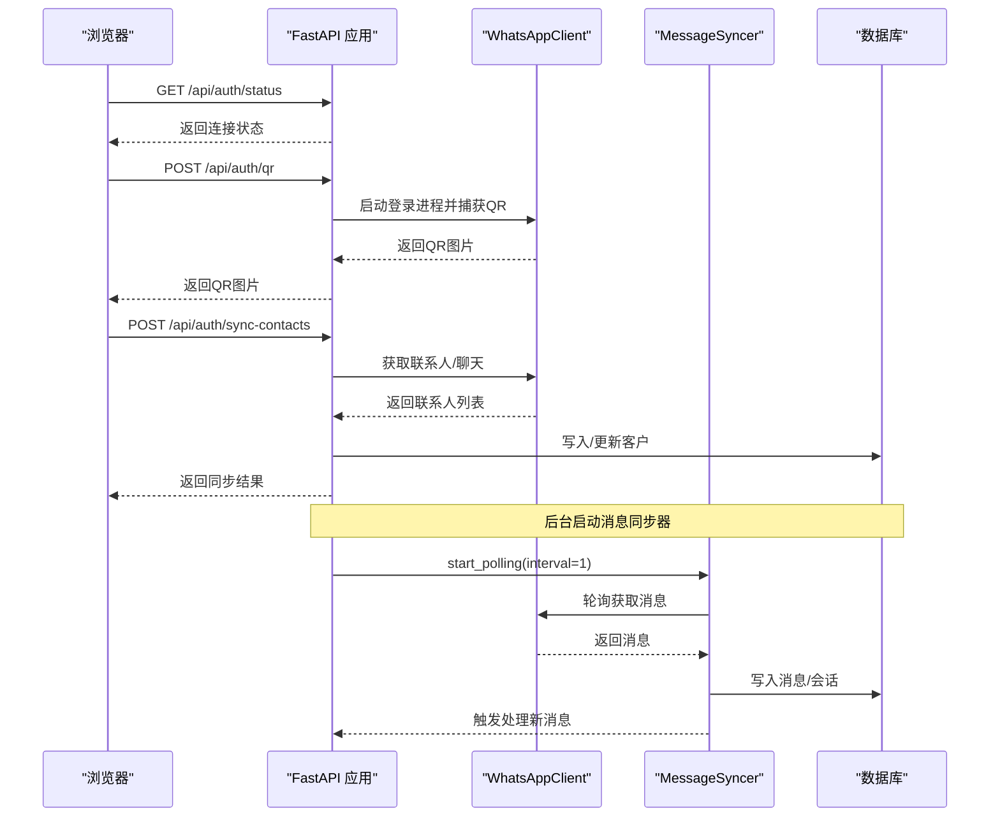
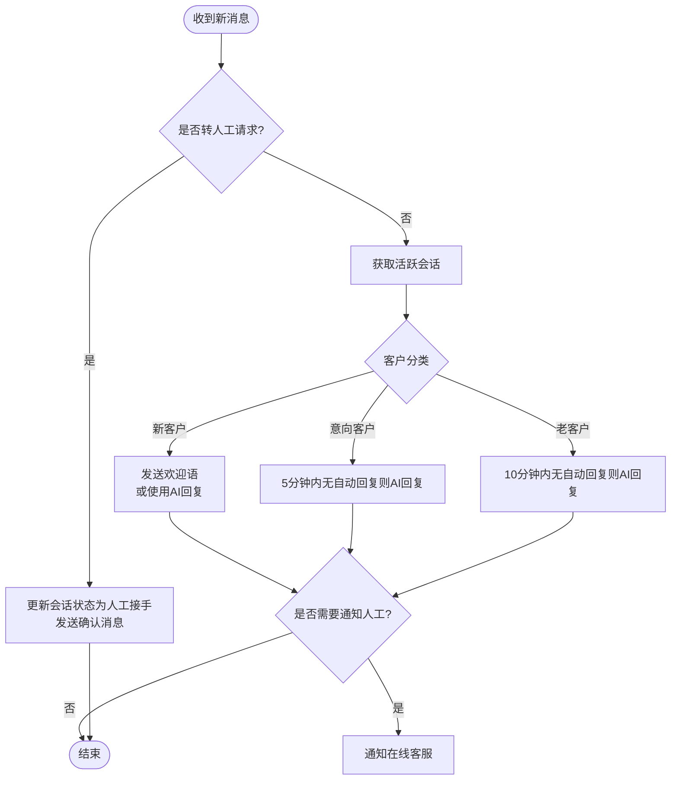
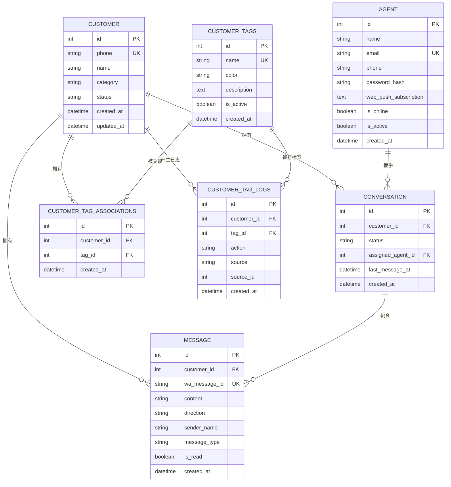
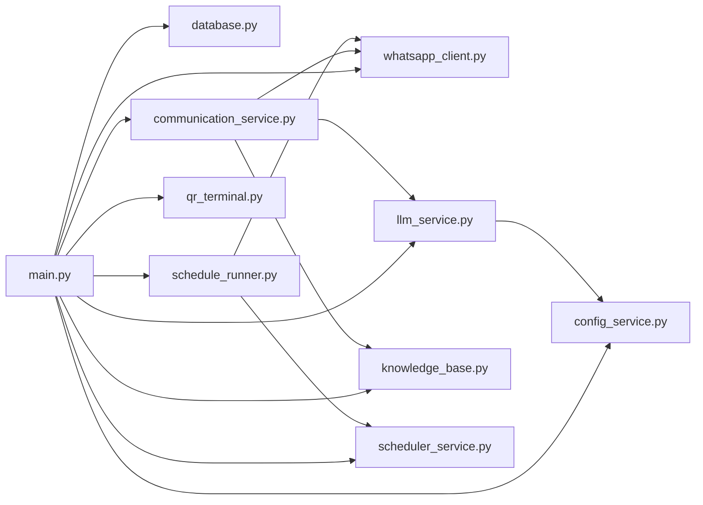

# 系统架构

<cite>
**本文引用的文件**
- [backend/main.py](file://backend/main.py)
- [backend/whatsapp_client.py](file://backend/whatsapp_client.py)
- [backend/database.py](file://backend/database.py)
- [backend/communication_service.py](file://backend/communication_service.py)
- [backend/config_service.py](file://backend/config_service.py)
- [backend/llm_service.py](file://backend/llm_service.py)
- [backend/knowledge_base.py](file://backend/knowledge_base.py)
- [backend/quotation_service.py](file://backend/quotation_service.py)
- [backend/memo_service.py](file://backend/memo_service.py)
- [backend/scheduler_service.py](file://backend/scheduler_service.py)
- [backend/schedule_runner.py](file://backend/schedule_runner.py)
- [backend/qr_terminal.py](file://backend/qr_terminal.py)
- [backend/static/index.html](file://backend/static/index.html)
- [backend/static/admin.html](file://backend/static/admin.html)
- [start_server.py](file://start_server.py)
- [requirements.txt](file://requirements.txt)
</cite>

## 目录
1. [简介](#简介)
2. [项目结构](#项目结构)
3. [核心组件](#核心组件)
4. [架构总览](#架构总览)
5. [详细组件分析](#详细组件分析)
6. [依赖分析](#依赖分析)
7. [性能考量](#性能考量)
8. [故障排查指南](#故障排查指南)
9. [结论](#结论)
10. [附录](#附录)

## 简介
本系统是一个基于 WhatsApp CLI 的智能客户关系管理系统，采用分层架构、服务导向架构与事件驱动架构相结合的设计理念。系统通过 FastAPI 提供 REST API 与 WebSocket 实时通信，集成 WhatsApp CLI 实现消息的同步与发送；通过 SQLAlchemy ORM 管理数据库；通过 LLM 服务与知识库实现智能回复；通过调度器实现定时发送计划；通过 QR 码捕获模块简化登录流程。

## 项目结构
系统采用前后端分离与模块化组织：
- 后端：FastAPI 应用、服务层、数据访问层、工具模块
- 前端：静态页面（管理后台、聊天界面）
- 启动脚本：统一入口，负责环境检查与服务启动

图表来源
- [backend/main.py](file://backend/main.py)
- [backend/whatsapp_client.py](file://backend/whatsapp_client.py)
- [backend/database.py](file://backend/database.py)
- [backend/communication_service.py](file://backend/communication_service.py)
- [backend/config_service.py](file://backend/config_service.py)
- [backend/llm_service.py](file://backend/llm_service.py)
- [backend/knowledge_base.py](file://backend/knowledge_base.py)
- [backend/quotation_service.py](file://backend/quotation_service.py)
- [backend/memo_service.py](file://backend/memo_service.py)
- [backend/scheduler_service.py](file://backend/scheduler_service.py)
- [backend/schedule_runner.py](file://backend/schedule_runner.py)
- [backend/qr_terminal.py](file://backend/qr_terminal.py)
- [backend/static/admin.html](file://backend/static/admin.html)
- [backend/static/index.html](file://backend/static/index.html)
- [start_server.py](file://start_server.py)

章节来源
- [backend/main.py](file://backend/main.py)
- [start_server.py](file://start_server.py)

## 核心组件
- 应用层（FastAPI）：提供 REST API、WebSocket、静态资源挂载、CORS、生命周期管理
- 服务层：沟通服务、配置服务、LLM 服务、知识库、报价、备忘录、调度服务、调度执行器
- 数据访问层（SQLAlchemy ORM）：定义实体模型、会话管理、数据库初始化
- 集成层：WhatsApp CLI 客户端、QR 码捕获、定时执行器
- 前端界面：管理后台与聊天界面，通过 WebSocket 实时推送消息

章节来源
- [backend/main.py](file://backend/main.py)
- [backend/database.py](file://backend/database.py)
- [backend/communication_service.py](file://backend/communication_service.py)
- [backend/config_service.py](file://backend/config_service.py)
- [backend/llm_service.py](file://backend/llm_service.py)
- [backend/knowledge_base.py](file://backend/knowledge_base.py)
- [backend/quotation_service.py](file://backend/quotation_service.py)
- [backend/memo_service.py](file://backend/memo_service.py)
- [backend/scheduler_service.py](file://backend/scheduler_service.py)
- [backend/schedule_runner.py](file://backend/schedule_runner.py)
- [backend/whatsapp_client.py](file://backend/whatsapp_client.py)
- [backend/qr_terminal.py](file://backend/qr_terminal.py)
- [backend/static/index.html](file://backend/static/index.html)
- [backend/static/admin.html](file://backend/static/admin.html)

## 架构总览
系统采用“应用层-服务层-数据访问层”的三层架构，结合服务导向（SOA）与事件驱动（Event-Driven）模式：
- 分层架构：应用层负责接口与实时通信，服务层负责业务逻辑，数据访问层负责持久化
- 服务导向：各服务独立封装（LLM、知识库、调度、配置等），通过依赖注入与全局实例提供
- 事件驱动：消息同步采用轮询+回调的事件式处理，WebSocket 实时推送新消息

图表来源
- [backend/main.py](file://backend/main.py)
- [backend/communication_service.py](file://backend/communication_service.py)
- [backend/llm_service.py](file://backend/llm_service.py)
- [backend/knowledge_base.py](file://backend/knowledge_base.py)
- [backend/scheduler_service.py](file://backend/scheduler_service.py)
- [backend/schedule_runner.py](file://backend/schedule_runner.py)
- [backend/config_service.py](file://backend/config_service.py)
- [backend/database.py](file://backend/database.py)
- [backend/whatsapp_client.py](file://backend/whatsapp_client.py)
- [backend/qr_terminal.py](file://backend/qr_terminal.py)

## 详细组件分析

### 应用层（FastAPI）
- 生命周期管理：启动时初始化数据库、WhatsApp 客户端、消息同步器与调度执行器；关闭时清理
- REST API：认证状态查询、QR 码登录、联系人同步、客户/消息/会话管理、沟通计划执行、AI 回复生成与发送
- WebSocket：心跳检测（ping/pong）、新消息广播
- 静态资源：挂载前端页面
- CORS：跨域配置

图表来源
- [backend/main.py](file://backend/main.py)
- [backend/whatsapp_client.py](file://backend/whatsapp_client.py)
- [backend/database.py](file://backend/database.py)

章节来源
- [backend/main.py](file://backend/main.py)

### 服务层

#### 沟通服务（CommunicationService）
- 自动回复：根据客户分类（新/意向/老客户）与转人工关键字触发不同策略
- AI 回复：调用 LLM 服务生成回复，支持同步/异步两种模式
- 自动打标签：基于规则为客户打标签，并记录日志
- 会话管理：获取活跃会话、转人工、关闭会话

图表来源
- [backend/communication_service.py](file://backend/communication_service.py)

章节来源
- [backend/communication_service.py](file://backend/communication_service.py)

#### 通知服务（NotificationService）
- 通知在线客服：通过 WhatsApp 发送新消息提醒
- 人工接手：更新会话状态并发送接手通知

章节来源
- [backend/communication_service.py](file://backend/communication_service.py)

#### 配置服务（ConfigService）
- 加密存储：基于对称加密的敏感配置（如 API Key）
- LLM 配置：提供统一的 LLM 配置读取与设置接口

章节来源
- [backend/config_service.py](file://backend/config_service.py)

#### LLM 服务（LLMService）
- 智能体选择：根据客户标签与优先级选择合适的 AI 智能体
- 提供商适配：支持多种大模型提供商（OpenAI、Claude、DeepSeek 等）
- 回复生成：构建系统提示词与对话历史，调用远程 API 获取回复
- 意图分析：可选的用户意图识别能力

章节来源
- [backend/llm_service.py](file://backend/llm_service.py)

#### 知识库（KnowledgeBase）
- 文档管理：添加、检索、删除文档
- 关键词索引：基于关键词的简单检索
- 相关知识提取：根据查询返回相关文档片段

章节来源
- [backend/knowledge_base.py](file://backend/knowledge_base.py)

#### 报价服务（QuotationService）
- 材料与报价：内置默认材料，支持创建报价单并格式化输出

章节来源
- [backend/quotation_service.py](file://backend/quotation_service.py)

#### 备忘录服务（MemoService）
- 客户沟通要点：记录与检索备忘录

章节来源
- [backend/memo_service.py](file://backend/memo_service.py)

#### 调度服务（SchedulerService）
- 发送计划：创建、查询、暂停/恢复计划
- 任务管理：为计划准备任务列表，支持个性化消息模板
- 状态跟踪：统计发送数量与失败数量

章节来源
- [backend/scheduler_service.py](file://backend/scheduler_service.py)

#### 调度执行器（ScheduleRunner）
- 后台执行：定时检查并执行到期计划
- 逐个发送：按间隔逐个发送消息，更新任务状态

章节来源
- [backend/schedule_runner.py](file://backend/schedule_runner.py)

#### QR 码捕获（TerminalQRCapture）
- 终端 QR 码：捕获 whatsapp auth login 输出的 ASCII QR 码
- 图片转换：将 ASCII QR 码渲染为 PNG 并以 base64 返回
- 登录监控：监控登录进程状态并在成功时回调

章节来源
- [backend/qr_terminal.py](file://backend/qr_terminal.py)

### 数据访问层（SQLAlchemy ORM）
- 实体模型：Customer、Message、Conversation、Agent、CommunicationPlan、AIAgent、LLMProvider、LLMModel、AutoTagRule、CustomerTag、CustomerTagAssociation、CustomerTagLog 等
- 关系映射：一对多/多对多关系，支持级联删除
- 会话管理：SessionLocal、get_db 依赖注入
- 初始化：创建所有表

图表来源
- [backend/database.py](file://backend/database.py)

章节来源
- [backend/database.py](file://backend/database.py)

### 前端界面
- 聊天界面：客户列表、消息展示、发送消息、AI 回复、知识库按钮
- 管理界面：系统配置、智能体管理、标签与规则、知识库、发送计划
- WebSocket：连接 /ws，接收新消息推送并刷新界面

章节来源
- [backend/static/index.html](file://backend/static/index.html)
- [backend/static/admin.html](file://backend/static/admin.html)

## 依赖分析
- 外部依赖：whatsapp-cli（通过子进程调用）、httpx（异步 HTTP 客户端）
- 内部依赖：应用层依赖服务层与数据访问层；服务层之间通过接口与全局实例耦合；服务层依赖数据库与外部 API

图表来源
- [backend/main.py](file://backend/main.py)
- [backend/whatsapp_client.py](file://backend/whatsapp_client.py)
- [backend/database.py](file://backend/database.py)
- [backend/communication_service.py](file://backend/communication_service.py)
- [backend/config_service.py](file://backend/config_service.py)
- [backend/llm_service.py](file://backend/llm_service.py)
- [backend/knowledge_base.py](file://backend/knowledge_base.py)
- [backend/scheduler_service.py](file://backend/scheduler_service.py)
- [backend/schedule_runner.py](file://backend/schedule_runner.py)
- [backend/qr_terminal.py](file://backend/qr_terminal.py)

章节来源
- [backend/main.py](file://backend/main.py)
- [backend/whatsapp_client.py](file://backend/whatsapp_client.py)
- [backend/communication_service.py](file://backend/communication_service.py)
- [backend/llm_service.py](file://backend/llm_service.py)
- [backend/knowledge_base.py](file://backend/knowledge_base.py)
- [backend/scheduler_service.py](file://backend/scheduler_service.py)
- [backend/schedule_runner.py](file://backend/schedule_runner.py)
- [backend/config_service.py](file://backend/config_service.py)
- [backend/database.py](file://backend/database.py)
- [backend/qr_terminal.py](file://backend/qr_terminal.py)

## 性能考量
- 异步与并发
  - FastAPI 异步路由与 WebSocket
  - LLM 服务异步调用远程 API
  - 调度执行器异步发送，避免阻塞
- 轮询与事件
  - 消息同步采用 1 秒轮询，兼顾实时性与资源消耗
  - WebSocket 心跳 ping/pong，降低无效连接
- 数据库
  - SQLite 本地存储，适合中小规模；注意并发写入与事务提交
  - 关系映射与外键约束保证数据一致性
- 外部集成
  - WhatsApp CLI 子进程调用，注意超时与错误处理
  - LLM API 调用设置合理超时与重试策略

## 故障排查指南
- WhatsApp 登录
  - 检查 whatsapp-cli 是否安装与 PATH 是否包含
  - 通过 QR 码捕获模块确认登录流程是否正确
- WebSocket 连接
  - 确认 /ws 路径可达，客户端是否发送 ping 保持心跳
- 数据库
  - 确认数据库文件路径与权限
  - 检查表结构是否创建成功
- LLM 配置
  - 确认 API Key、Base URL、模型名配置正确
  - 检查网络连通性与超时设置
- 调度计划
  - 检查计划状态与任务进度
  - 确认发送间隔与执行时间设置

章节来源
- [backend/main.py](file://backend/main.py)
- [backend/qr_terminal.py](file://backend/qr_terminal.py)
- [backend/database.py](file://backend/database.py)
- [backend/llm_service.py](file://backend/llm_service.py)
- [backend/scheduler_service.py](file://backend/scheduler_service.py)
- [backend/schedule_runner.py](file://backend/schedule_runner.py)

## 结论
该系统通过清晰的分层与服务化设计，实现了 WhatsApp 消息的同步、智能回复、知识库检索、定时发送与实时通知。应用层提供统一接口与实时通信，服务层封装业务逻辑，数据访问层保障数据一致性。整体架构具备良好的扩展性与可维护性，适合在中小规模场景下快速落地与迭代。

## 附录
- 启动流程：启动脚本检查环境、安装依赖、启动 uvicorn 服务
- 依赖声明：当前仓库未声明额外 Python 依赖，如需扩展可按需安装

章节来源
- [start_server.py](file://start_server.py)
- [requirements.txt](file://requirements.txt)