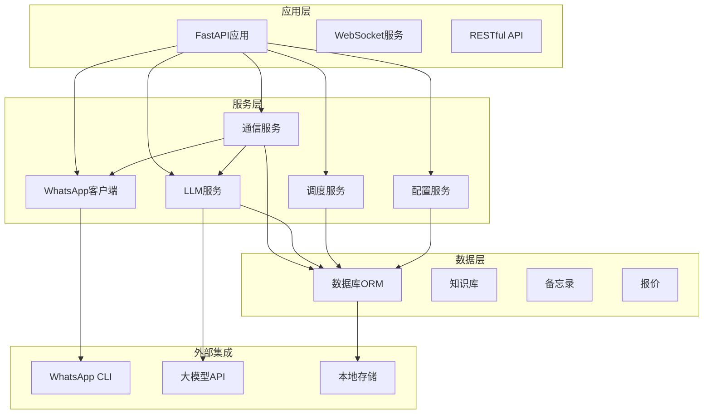
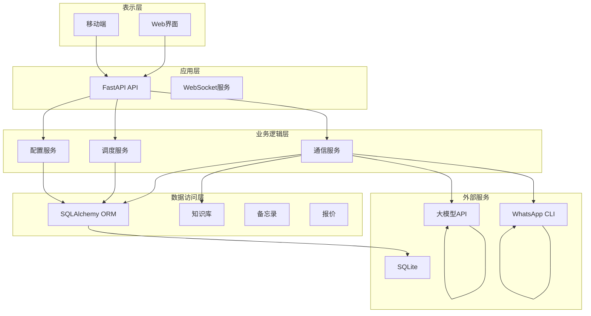
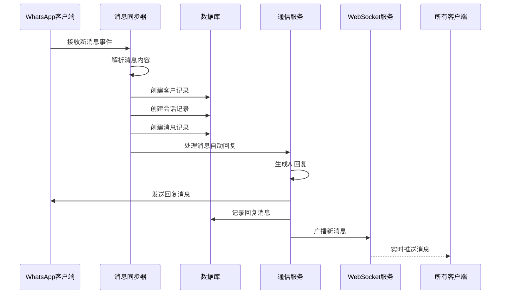
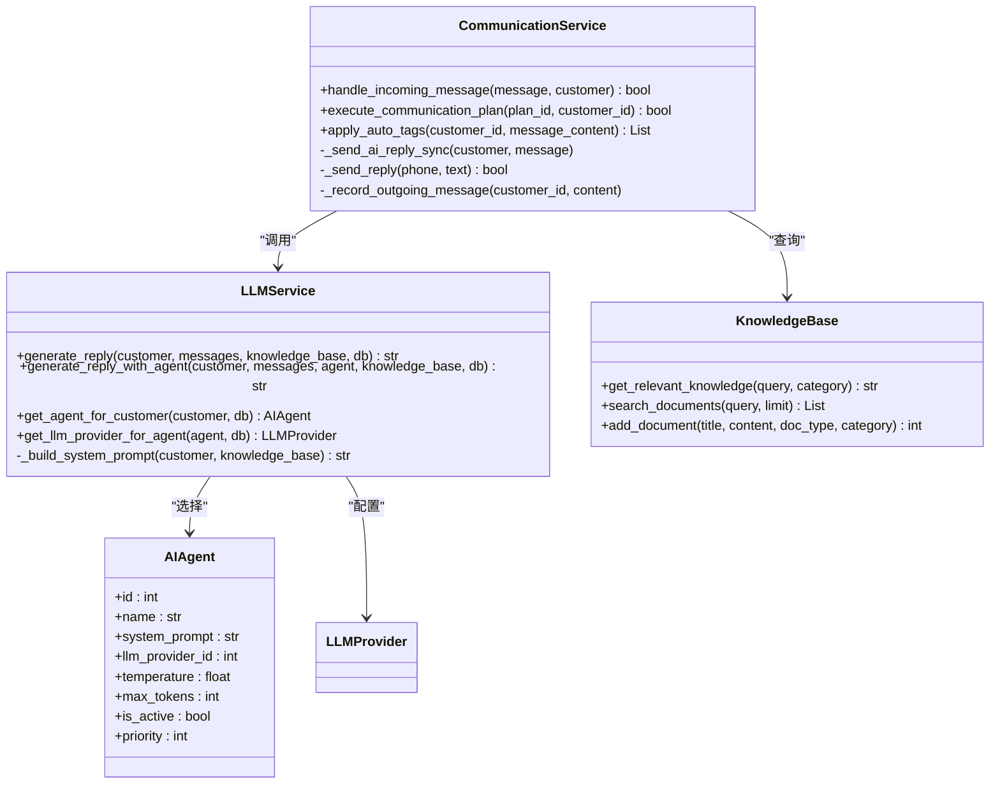
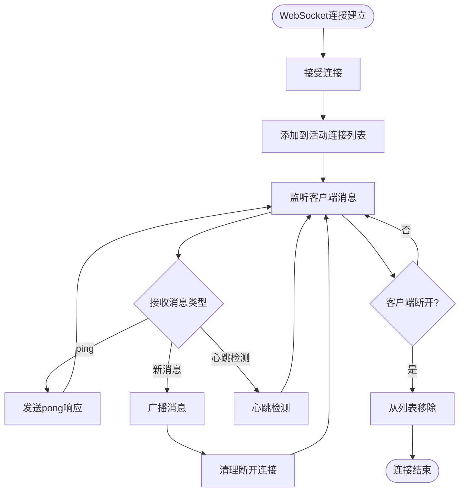
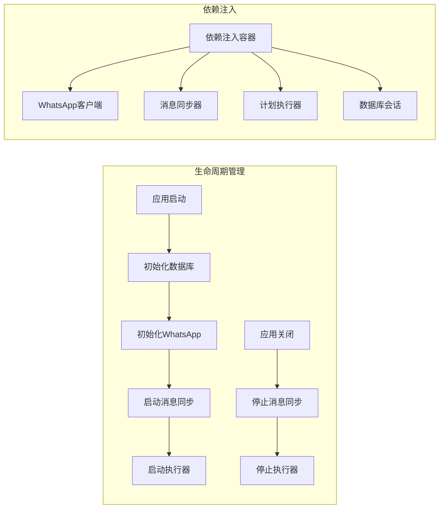
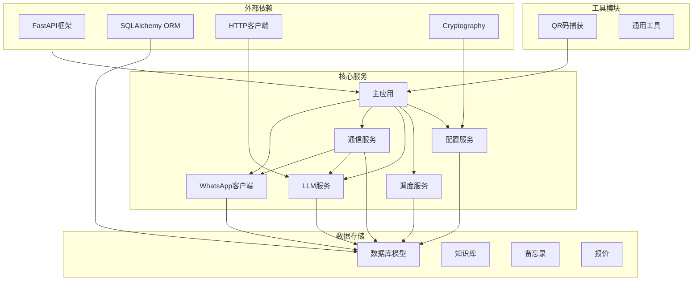
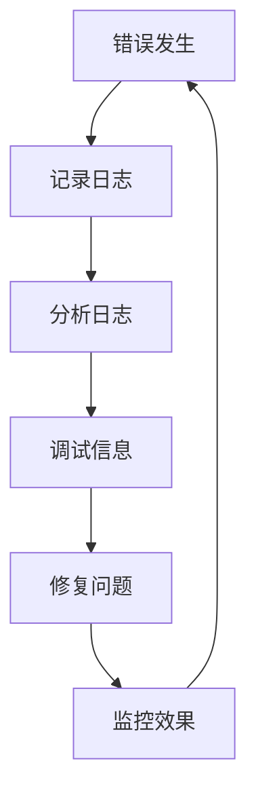

# 组件交互架构

<cite>
**本文档引用的文件**
- [backend/main.py](file://backend/main.py)
- [backend/whatsapp_client.py](file://backend/whatsapp_client.py)
- [backend/communication_service.py](file://backend/communication_service.py)
- [backend/llm_service.py](file://backend/llm_service.py)
- [backend/database.py](file://backend/database.py)
- [backend/knowledge_base.py](file://backend/knowledge_base.py)
- [backend/config_service.py](file://backend/config_service.py)
- [backend/scheduler_service.py](file://backend/scheduler_service.py)
- [backend/schedule_runner.py](file://backend/schedule_runner.py)
- [backend/qr_terminal.py](file://backend/qr_terminal.py)
- [backend/memo_service.py](file://backend/memo_service.py)
- [backend/quotation_service.py](file://backend/quotation_service.py)
- [backend/requirements.txt](file://backend/requirements.txt)
</cite>

## 目录
1. [简介](#简介)
2. [项目结构](#项目结构)
3. [核心组件](#核心组件)
4. [架构概览](#架构概览)
5. [详细组件分析](#详细组件分析)
6. [依赖关系分析](#依赖关系分析)
7. [性能考虑](#性能考虑)
8. [故障排除指南](#故障排除指南)
9. [结论](#结论)

## 简介

WhatsApp智能客户系统是一个基于FastAPI构建的现代化客户关系管理系统，集成了WhatsApp消息通信、人工智能回复、数据库存储、实时通信等多种功能。该系统通过模块化的架构设计，实现了WhatsApp客户端与消息同步器的协作模式，以及通信服务与大语言模型服务的深度集成。

系统采用分层架构设计，包括应用层、服务层、数据访问层和外部集成层，通过依赖注入和生命周期管理确保各组件的松耦合和高内聚。核心特性包括自动消息同步、智能AI回复、定时发送计划、实时WebSocket通信、客户标签管理等。

## 项目结构

系统采用功能模块化的文件组织方式，主要分为以下层次：

**图表来源**
- [backend/main.py:129-134](file://backend/main.py#L129-L134)
- [backend/whatsapp_client.py:13-26](file://backend/whatsapp_client.py#L13-L26)
- [backend/communication_service.py:17-45](file://backend/communication_service.py#L17-L45)

**章节来源**
- [backend/main.py:129-134](file://backend/main.py#L129-L134)
- [backend/requirements.txt:1-20](file://backend/requirements.txt#L1-L20)

## 核心组件

### FastAPI应用层

FastAPI应用层作为系统的入口点，负责协调各个服务模块的生命周期管理和HTTP请求处理。应用层实现了完整的依赖注入机制，通过全局变量管理WhatsApp客户端、消息同步器和WebSocket连接池。

关键特性：
- 应用生命周期管理（lifespan钩子）
- CORS跨域资源共享配置
- 静态文件服务
- WebSocket实时通信
- 认证状态管理

### WhatsApp客户端

WhatsApp客户端封装了对whatsapp-cli工具的调用，提供了异步和同步两种执行模式。客户端支持多种操作，包括认证状态检查、联系人获取、消息发送、聊天室管理等。

核心功能：
- 异步命令执行（async/await）
- 同步命令执行（subprocess）
- JID格式处理和转换
- 实时消息监听

### 通信服务

通信服务是系统的核心业务逻辑层，负责处理自动回复、转人工请求、客户分类管理等功能。该服务集成了AI回复生成功能，并支持复杂的客户标签系统。

主要功能：
- 客户分类自动回复
- 转人工请求处理
- AI智能回复生成
- 客户标签自动应用
- 通知服务集成

### 大语言模型服务

LLM服务集成了多种大语言模型提供商，支持OpenAI、Claude等主流模型。服务实现了智能体选择机制，根据客户标签动态选择最适合的AI智能体。

核心特性：
- 多提供商支持
- 智能体标签绑定
- 动态模型选择
- 系统提示词管理
- 意图分析功能

**章节来源**
- [backend/main.py:88-126](file://backend/main.py#L88-L126)
- [backend/whatsapp_client.py:13-279](file://backend/whatsapp_client.py#L13-L279)
- [backend/communication_service.py:17-512](file://backend/communication_service.py#L17-L512)
- [backend/llm_service.py:11-286](file://backend/llm_service.py#L11-L286)

## 架构概览

系统采用分层架构设计，通过清晰的职责分离实现了高度的模块化和可扩展性：

**图表来源**
- [backend/main.py:160-194](file://backend/main.py#L160-L194)
- [backend/communication_service.py:428-512](file://backend/communication_service.py#L428-L512)
- [backend/scheduler_service.py:54-393](file://backend/scheduler_service.py#L54-L393)

系统架构遵循以下设计原则：
- **单一职责原则**：每个模块专注于特定的功能领域
- **依赖倒置原则**：高层模块不依赖于低层模块
- **开闭原则**：对扩展开放，对修改封闭
- **接口隔离原则**：提供细粒度的接口

## 详细组件分析

### WhatsApp客户端与消息同步器协作模式

WhatsApp客户端与消息同步器形成了完整的消息处理流水线，实现了从消息接收、处理到存储的全流程自动化。

**图表来源**
- [backend/whatsapp_client.py:366-437](file://backend/whatsapp_client.py#L366-L437)
- [backend/communication_service.py:47-72](file://backend/communication_service.py#L47-L72)
- [backend/main.py:178-194](file://backend/main.py#L178-L194)

消息同步流程的关键步骤：
1. **消息接收**：通过WhatsApp CLI实时监听新消息
2. **消息解析**：提取发送者信息、消息内容、时间戳
3. **客户识别**：根据手机号识别或创建客户记录
4. **会话管理**：获取或创建活跃会话
5. **自动回复**：根据客户分类和上下文生成AI回复
6. **消息存储**：持久化所有消息到数据库
7. **实时推送**：通过WebSocket广播新消息

### 通信服务与大语言模型服务集成

通信服务与LLM服务的集成实现了智能化的客户回复机制，支持多智能体、多提供商的灵活配置。

**图表来源**
- [backend/communication_service.py:17-512](file://backend/communication_service.py#L17-L512)
- [backend/llm_service.py:11-286](file://backend/llm_service.py#L11-L286)
- [backend/knowledge_base.py:11-212](file://backend/knowledge_base.py#L11-L212)

集成流程的关键特性：
- **智能体选择**：根据客户标签动态选择最合适的AI智能体
- **知识库集成**：将相关文档内容融入AI回复生成
- **多提供商支持**：支持不同大模型提供商的统一接口
- **温度参数控制**：通过温度参数控制回复的创造性程度

### WebSocket实时通信机制

系统实现了完整的WebSocket实时通信机制，支持多客户端连接、心跳检测和消息广播。

**图表来源**
- [backend/main.py:162-176](file://backend/main.py#L162-L176)
- [backend/main.py:178-194](file://backend/main.py#L178-L194)

WebSocket服务的关键实现：
- **连接管理**：维护活动WebSocket连接列表
- **心跳检测**：通过ping/pong机制检测连接状态
- **消息广播**：向所有连接的客户端推送新消息
- **异常处理**：自动清理断开的连接

### 组件依赖注入和生命周期管理

系统通过FastAPI的依赖注入机制实现了组件间的松耦合集成，同时通过应用生命周期管理确保资源的正确初始化和清理。

**图表来源**
- [backend/main.py:88-126](file://backend/main.py#L88-L126)
- [backend/main.py:29-32](file://backend/main.py#L29-L32)

依赖注入的关键实现：
- **全局变量管理**：通过全局变量存储共享组件实例
- **工厂函数模式**：使用get_*函数提供组件实例
- **会话管理**：通过Depends装饰器管理数据库会话
- **生命周期钩子**：利用FastAPI lifespan管理组件生命周期

**章节来源**
- [backend/main.py:160-194](file://backend/main.py#L160-L194)
- [backend/whatsapp_client.py:212-437](file://backend/whatsapp_client.py#L212-L437)
- [backend/communication_service.py:428-512](file://backend/communication_service.py#L428-L512)
- [backend/llm_service.py:276-286](file://backend/llm_service.py#L276-L286)

## 依赖关系分析

系统依赖关系呈现清晰的分层结构，低层模块不依赖于高层模块，而是通过抽象接口进行交互。

**图表来源**
- [backend/requirements.txt:1-20](file://backend/requirements.txt#L1-L20)
- [backend/main.py:17-26](file://backend/main.py#L17-L26)

依赖关系特点：
- **向下依赖**：高层模块依赖于低层模块（应用层依赖于服务层）
- **向上独立**：低层模块不依赖于高层模块
- **横向解耦**：同层模块之间通过接口进行交互
- **集中管理**：外部依赖通过requirements.txt统一管理

**章节来源**
- [backend/requirements.txt:1-20](file://backend/requirements.txt#L1-L20)
- [backend/main.py:17-26](file://backend/main.py#L17-L26)

## 性能考虑

系统在设计时充分考虑了性能优化，采用了多种策略来提升响应速度和资源利用率：

### 异步处理优化
- **异步I/O操作**：使用async/await模式处理网络请求和文件操作
- **并发执行**：通过asyncio.create_task实现并发消息处理
- **事件循环管理**：合理管理事件循环，避免阻塞操作

### 缓存策略
- **消息ID缓存**：使用集合存储已知消息ID，避免重复处理
- **配置缓存**：LLM配置和服务实例的全局缓存
- **连接池管理**：数据库连接池和HTTP客户端连接池

### 数据库优化
- **批量操作**：使用批量插入和更新减少数据库往返
- **索引优化**：为常用查询字段建立索引
- **事务管理**：合理使用事务确保数据一致性

### 资源管理
- **连接池**：WebSocket连接池和数据库连接池
- **内存管理**：及时清理临时对象和断开的连接
- **超时控制**：为外部API调用设置合理的超时时间

## 故障排除指南

### 常见问题诊断

**WhatsApp连接问题**
- 检查whatsapp-cli是否正确安装和配置
- 验证认证状态和登录凭据
- 确认网络连接和防火墙设置

**消息同步异常**
- 检查消息同步器状态和运行日志
- 验证数据库连接和权限
- 确认消息ID缓存是否正常工作

**AI回复失败**
- 检查大模型API密钥和配额
- 验证网络连接和API可用性
- 确认系统提示词配置

**WebSocket连接问题**
- 检查浏览器兼容性和网络状况
- 验证CORS配置和代理设置
- 确认服务器端口和防火墙规则

### 日志和监控

系统提供了完善的日志记录机制，便于问题诊断和性能监控：

**章节来源**
- [backend/main.py:300-307](file://backend/main.py#L300-L307)
- [backend/whatsapp_client.py:42-48](file://backend/whatsapp_client.py#L42-L48)
- [backend/llm_service.py:173-175](file://backend/llm_service.py#L173-L175)

## 结论

WhatsApp智能客户系统通过精心设计的架构实现了高效、可扩展的客户关系管理解决方案。系统的主要优势包括：

**架构优势**
- 清晰的分层设计，职责分离明确
- 基于FastAPI的现代化Web框架
- 完善的依赖注入和生命周期管理
- 模块化的组件设计，易于维护和扩展

**功能特色**
- 智能消息同步和自动回复
- 多智能体、多提供商的大语言模型集成
- 实时WebSocket通信和消息广播
- 灵活的客户标签和自动打标签系统
- 定时发送计划和批量营销功能

**技术亮点**
- 异步编程模型提升系统性能
- 数据库ORM简化数据访问
- 配置管理服务保障安全性
- QR码捕获和渲染功能提升用户体验

该系统为企业提供了完整的WhatsApp客户管理解决方案，通过智能化的AI回复和自动化的工作流程，显著提升了客户服务效率和质量。系统的模块化设计也为未来的功能扩展和技术升级奠定了坚实的基础。