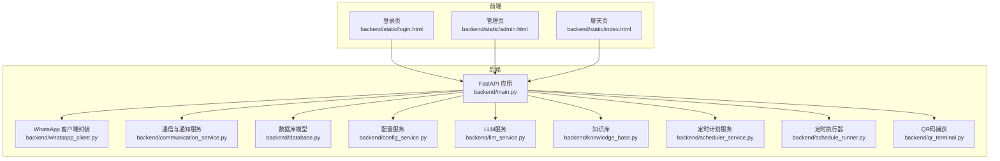
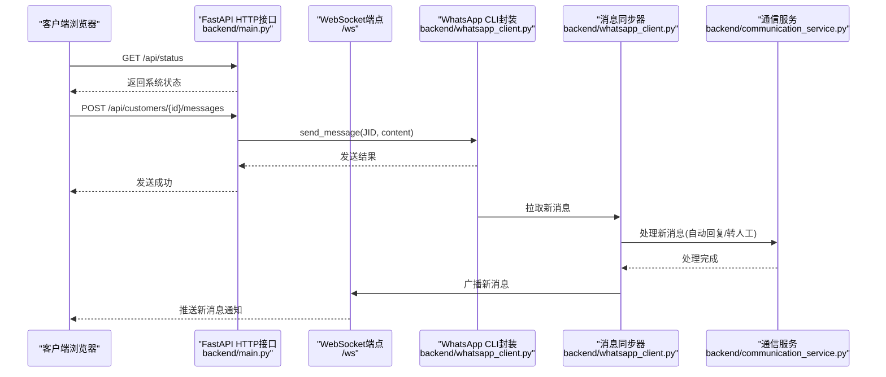
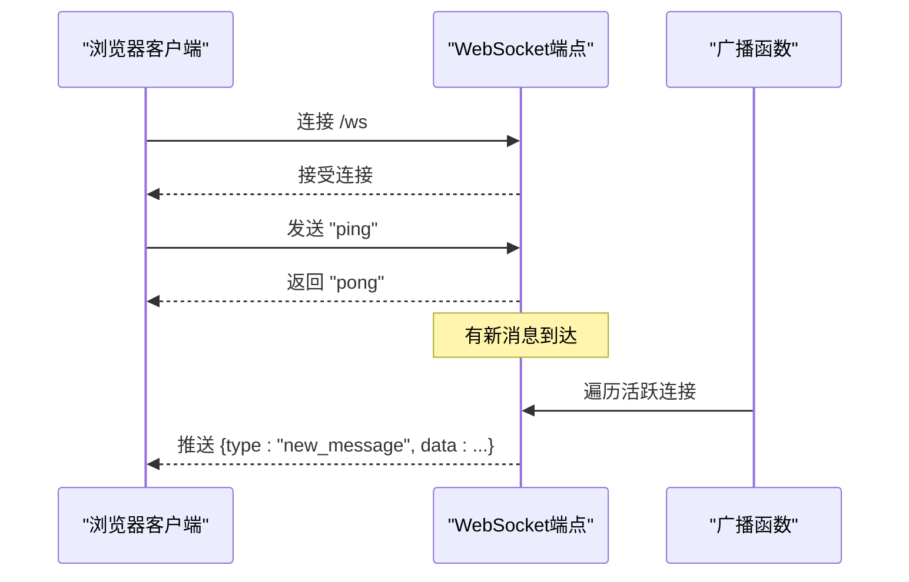
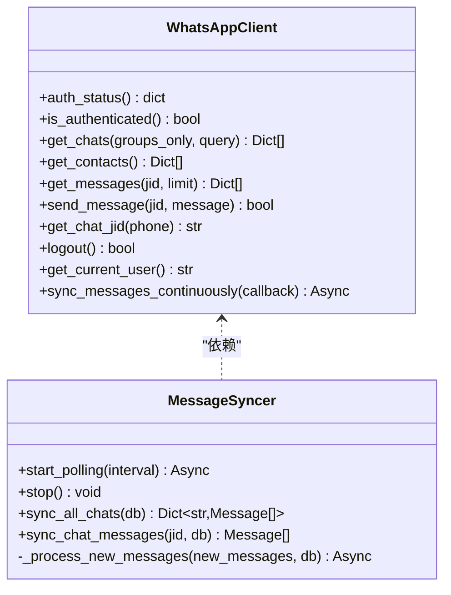
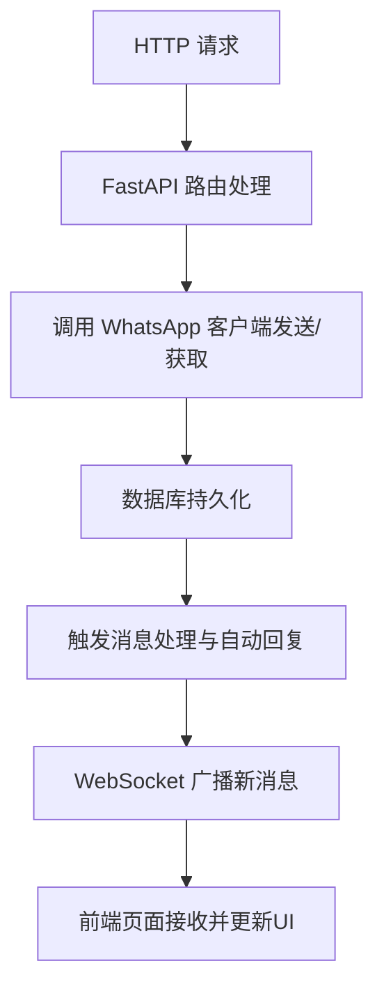
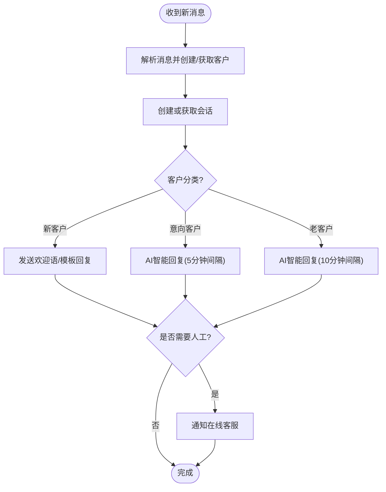
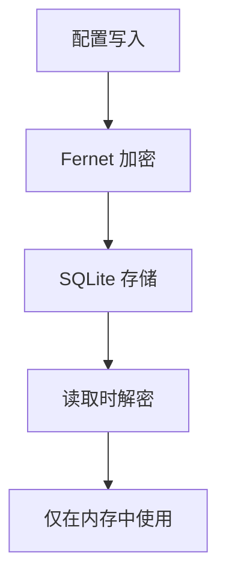
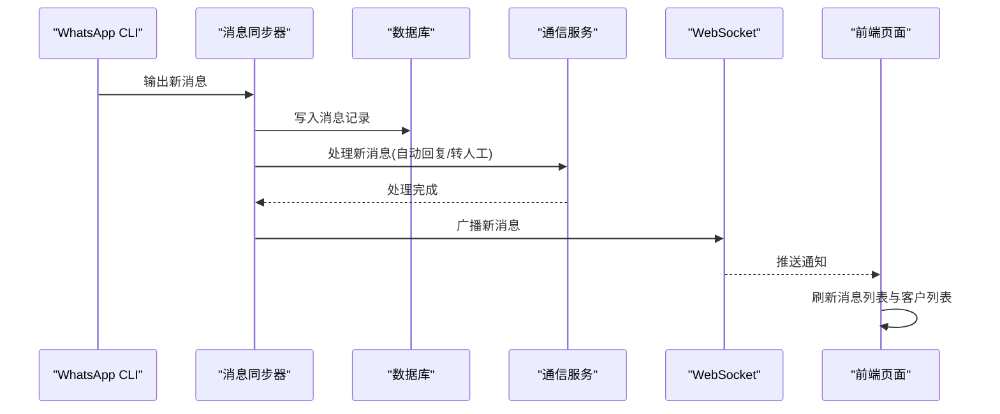
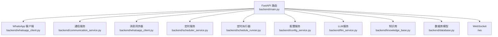

# 通信架构设计

<cite>
**本文档引用的文件**
- [main.py](file://backend/main.py)
- [whatsapp_client.py](file://backend/whatsapp_client.py)
- [communication_service.py](file://backend/communication_service.py)
- [database.py](file://backend/database.py)
- [config_service.py](file://backend/config_service.py)
- [llm_service.py](file://backend/llm_service.py)
- [knowledge_base.py](file://backend/knowledge_base.py)
- [schedule_runner.py](file://backend/schedule_runner.py)
- [scheduler_service.py](file://backend/scheduler_service.py)
- [qr_terminal.py](file://backend/qr_terminal.py)
- [start_server.py](file://start_server.py)
- [index.html](file://backend/static/index.html)
- [login.html](file://backend/static/login.html)
- [admin.html](file://backend/static/admin.html)
</cite>

## 目录
1. [简介](#简介)
2. [项目结构](#项目结构)
3. [核心组件](#核心组件)
4. [架构总览](#架构总览)
5. [详细组件分析](#详细组件分析)
6. [依赖关系分析](#依赖关系分析)
7. [性能考虑](#性能考虑)
8. [故障排除指南](#故障排除指南)
9. [结论](#结论)

## 简介
本文件为 WhatsApp 智能客户系统的通信架构设计文档，围绕基于 WebSocket 的实时通信、WhatsApp CLI 集成、HTTP API 与 WebSocket 的协同机制、消息路由与广播、安全机制以及性能优化策略展开。系统采用 FastAPI 提供 RESTful API，结合 WebSocket 实现实时消息推送；通过 WhatsApp CLI 封装实现消息的拉取、发送与状态管理；借助数据库持久化与配置服务保障系统稳定性与安全性。

## 项目结构
后端采用模块化设计，主要文件职责如下：
- 后端入口与路由：backend/main.py
- WhatsApp CLI 封装与消息同步：backend/whatsapp_client.py
- 沟通与通知服务：backend/communication_service.py
- 数据库模型与初始化：backend/database.py
- 配置与密钥管理：backend/config_service.py
- 大模型服务与知识库：backend/llm_service.py、backend/knowledge_base.py
- 定时发送计划：backend/scheduler_service.py、backend/schedule_runner.py
- QR 码登录捕获：backend/qr_terminal.py
- 启动脚本：start_server.py
- 前端静态页面：backend/static/*.html

**图表来源**
- [main.py](file://backend/main.py)
- [whatsapp_client.py](file://backend/whatsapp_client.py)
- [communication_service.py](file://backend/communication_service.py)
- [database.py](file://backend/database.py)
- [config_service.py](file://backend/config_service.py)
- [llm_service.py](file://backend/llm_service.py)
- [knowledge_base.py](file://backend/knowledge_base.py)
- [scheduler_service.py](file://backend/scheduler_service.py)
- [schedule_runner.py](file://backend/schedule_runner.py)
- [qr_terminal.py](file://backend/qr_terminal.py)
- [login.html](file://backend/static/login.html)
- [admin.html](file://backend/static/admin.html)
- [index.html](file://backend/static/index.html)

**章节来源**
- [main.py](file://backend/main.py)
- [start_server.py](file://start_server.py)

## 核心组件
- WebSocket 实时通信：提供新消息广播与心跳维持，客户端通过 /ws 接收实时通知。
- WhatsApp CLI 集成：封装 whatsapp 命令，实现登录状态检查、联系人/聊天/消息获取、消息发送与 JID 解析。
- 消息同步器：周期性轮询 WhatsApp 聊天消息，同步至数据库并触发自动回复与人工通知。
- 通信与通知服务：处理新消息自动回复、转人工请求、AI 智能回复、自动打标签与人工通知。
- HTTP API：提供认证、客户、消息、会话、计划等 RESTful 接口，配合 WebSocket 实现实时推送。
- 定时发送执行器：后台异步执行定时发送计划，按间隔逐个发送消息。
- 安全与配置：配置服务加密存储敏感信息，前端页面通过 API 与 WebSocket 交互。

**章节来源**
- [main.py](file://backend/main.py)
- [whatsapp_client.py](file://backend/whatsapp_client.py)
- [communication_service.py](file://backend/communication_service.py)
- [schedule_runner.py](file://backend/schedule_runner.py)

## 架构总览
系统采用“HTTP API + WebSocket 实时推送”的协同机制：
- HTTP API：RESTful 接口负责数据获取与业务操作（如发送消息、同步联系人、执行计划）。
- WebSocket：实时推送新消息，客户端通过心跳维持连接。
- WhatsApp CLI：作为底层通信通道，负责与 WhatsApp 服务交互。
- 数据库：持久化客户、消息、会话、标签、计划等数据。
- 定时任务：后台执行器按计划发送消息，避免阻塞主线程。

**图表来源**
- [main.py](file://backend/main.py)
- [whatsapp_client.py](file://backend/whatsapp_client.py)
- [communication_service.py](file://backend/communication_service.py)

## 详细组件分析

### WebSocket 实时通信
- 连接建立：客户端访问 /ws，服务端接受连接并加入全局连接列表。
- 心跳维护：客户端发送 "ping"，服务端返回 "pong"，用于检测连接健康。
- 广播机制：新消息到达时，遍历活跃连接并发送 JSON 消息，包含消息类型与数据。
- 断连清理：捕获断开异常，从活跃连接列表移除失效连接。

**图表来源**
- [main.py](file://backend/main.py)

**章节来源**
- [main.py](file://backend/main.py)

### WhatsApp CLI 集成架构
- 命令封装：通过子进程调用 whatsapp 命令，支持同步与异步执行，统一返回 JSON 结果。
- 登录与状态：检查登录状态、获取当前用户、退出登录。
- 聊天与联系人：获取聊天列表、联系人列表，并支持查询过滤。
- 消息获取与发送：获取指定 JID 的消息历史，发送消息并处理备用 JID。
- JID 解析：根据手机号或聊天信息解析正确 JID，兼容不同后缀。
- 实时同步：持续监听 whatsapp sync --follow 输出，检测新消息并触发回调。

**图表来源**
- [whatsapp_client.py](file://backend/whatsapp_client.py)

**章节来源**
- [whatsapp_client.py](file://backend/whatsapp_client.py)

### HTTP API 与 WebSocket 协同机制
- RESTful API：提供认证、客户、消息、会话、计划等接口，支持数据获取与业务操作。
- WebSocket 推送：新消息到达后通过广播函数推送给所有连接的客户端，客户端刷新消息列表与客户列表。
- 前端交互：前端页面通过 API 获取数据，通过 WebSocket 接收实时通知，实现“数据获取 + 实时推送”的协同。

**图表来源**
- [main.py](file://backend/main.py)
- [index.html](file://backend/static/index.html)

**章节来源**
- [main.py](file://backend/main.py)
- [index.html](file://backend/static/index.html)

### 消息路由与广播机制
- 新消息路由：消息同步器从 WhatsApp 拉取新消息，写入数据库并触发通信服务处理。
- 自动回复：根据客户分类与会话状态，自动发送模板或 AI 智能回复。
- 人工通知：若需要人工介入，向在线客服发送 WhatsApp 通知。
- 广播推送：通信完成后，通过 WebSocket 广播新消息，前端刷新当前客户的消息与全局客户列表。

**图表来源**
- [communication_service.py](file://backend/communication_service.py)
- [whatsapp_client.py](file://backend/whatsapp_client.py)

**章节来源**
- [communication_service.py](file://backend/communication_service.py)
- [whatsapp_client.py](file://backend/whatsapp_client.py)

### 通信安全机制
- 配置加密：配置服务使用对称加密存储敏感信息（如 API Key），密钥文件权限严格控制。
- 登录安全：QR 码登录通过终端捕获与渲染，避免明文暴露；登录状态检查与取消登录接口保障会话安全。
- 会话管理：退出登录时停止消息同步与清理会话，降低风险暴露。

**图表来源**
- [config_service.py](file://backend/config_service.py)

**章节来源**
- [config_service.py](file://backend/config_service.py)
- [qr_terminal.py](file://backend/qr_terminal.py)
- [main.py](file://backend/main.py)

### 通信流程图（消息从接收、处理到推送）

**图表来源**
- [whatsapp_client.py](file://backend/whatsapp_client.py)
- [communication_service.py](file://backend/communication_service.py)
- [main.py](file://backend/main.py)

## 依赖关系分析
- 组件耦合：通信服务依赖 WhatsApp 客户端与数据库；消息同步器依赖 WhatsApp 客户端与数据库；定时执行器依赖定时服务与 WhatsApp 客户端。
- 外部依赖：FastAPI、SQLAlchemy、subprocess（调用 whatsapp）、httpx（LLM API）。
- 数据流：HTTP API 与 WebSocket 通过共享数据库与服务对象实现数据一致性。

**图表来源**
- [main.py](file://backend/main.py)
- [whatsapp_client.py](file://backend/whatsapp_client.py)
- [communication_service.py](file://backend/communication_service.py)
- [scheduler_service.py](file://backend/scheduler_service.py)
- [schedule_runner.py](file://backend/schedule_runner.py)
- [config_service.py](file://backend/config_service.py)
- [llm_service.py](file://backend/llm_service.py)
- [knowledge_base.py](file://backend/knowledge_base.py)
- [database.py](file://backend/database.py)

**章节来源**
- [main.py](file://backend/main.py)
- [database.py](file://backend/database.py)

## 性能考虑
- 连接池与并发：WebSocket 连接采用列表管理，广播时进行异常捕获与断连清理，避免阻塞；HTTP 请求使用 FastAPI 异步特性。
- 消息轮询：消息同步器默认 1 秒轮询一次，限制最小同步间隔，避免过度频繁的 API 调用。
- 异步执行：LLM 与定时发送均采用异步/协程模式，避免阻塞主线程；定时执行器后台循环检查与执行。
- 数据库优化：SQLAlchemy 会话按需创建与关闭，减少连接占用；批量写入与事务提交降低 I/O 开销。
- 负载均衡：当前为单实例部署，生产环境可通过反向代理与多实例部署实现水平扩展。

[本节为通用指导，无需特定文件引用]

## 故障排除指南
- 登录问题：检查 whatsapp-cli 是否安装与 PATH 是否包含 ~/.local/bin；通过 /api/auth/qr 与 /api/auth/qr/status 获取 QR 码状态；必要时调用 /api/auth/qr/cancel 取消登录进程。
- 连接断开：WebSocket 心跳为 "ping"/"pong"，若长时间无响应，客户端需重新连接；服务端会在断开时清理连接。
- 消息发送失败：检查 WhatsApp 客户端是否已登录；JID 解析失败时可尝试备用后缀；查看日志定位具体错误。
- 数据库异常：确认 SQLite 文件路径与权限；初始化数据库后重启服务；检查 SQLAlchemy 会话生命周期。
- 定时计划异常：检查计划状态与任务状态；确认执行器是否启动；查看执行器日志。

**章节来源**
- [main.py](file://backend/main.py)
- [whatsapp_client.py](file://backend/whatsapp_client.py)
- [qr_terminal.py](file://backend/qr_terminal.py)
- [schedule_runner.py](file://backend/schedule_runner.py)

## 结论
该通信架构以 FastAPI 为核心，结合 WebSocket 实现高效实时推送，通过 WhatsApp CLI 封装实现与 WhatsApp 的可靠通信。消息同步器与通信服务共同完成消息路由与自动回复，定时执行器保障计划任务的异步执行。配置服务提供安全的密钥管理，前端页面通过 API 与 WebSocket 实现良好的用户体验。整体设计具备良好的扩展性与可维护性，适合在生产环境中进一步引入负载均衡与数据库集群等能力以提升性能与可靠性。