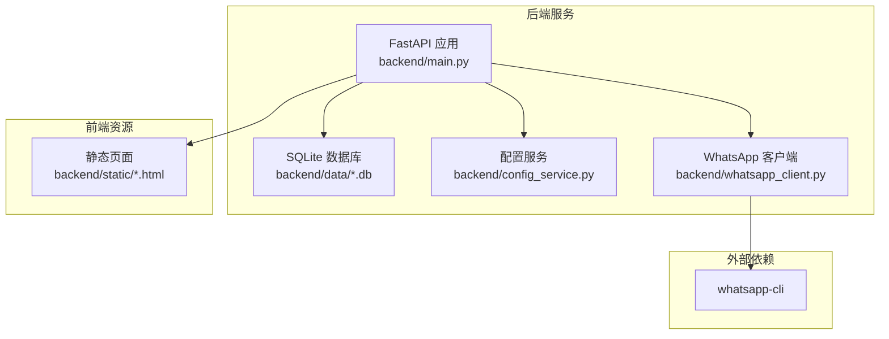
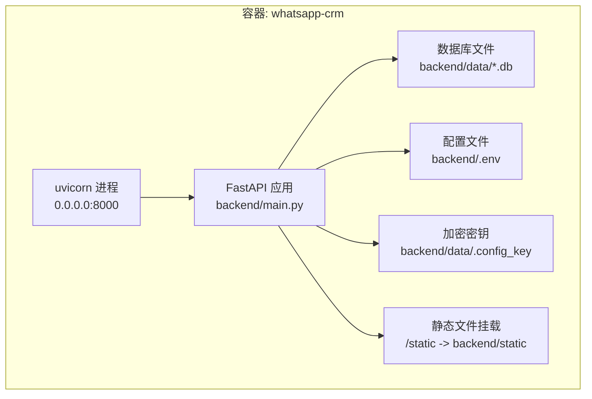
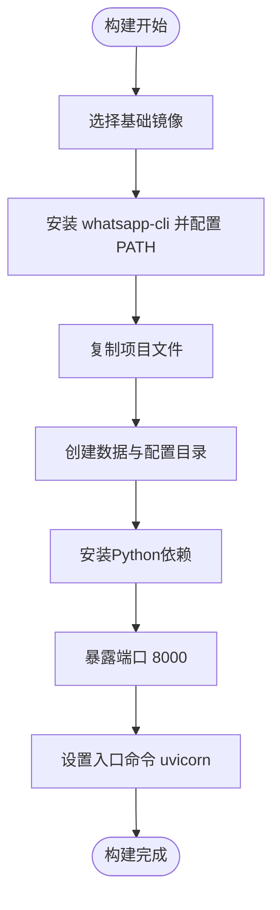
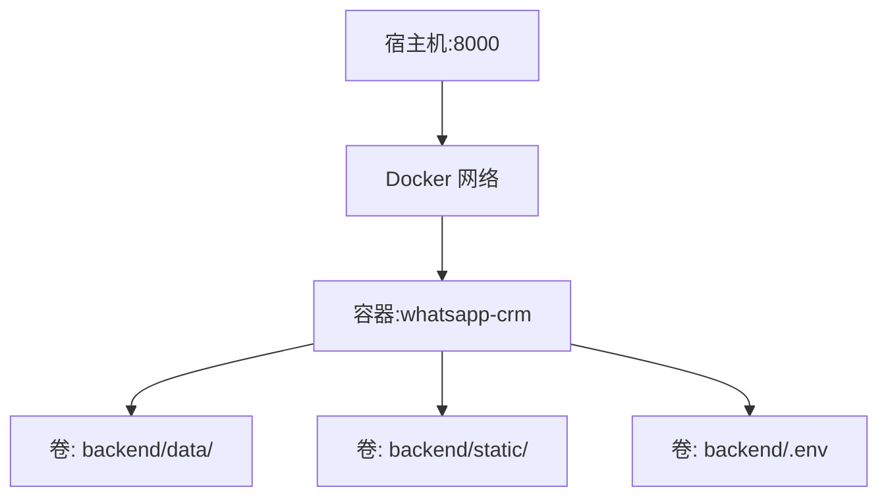
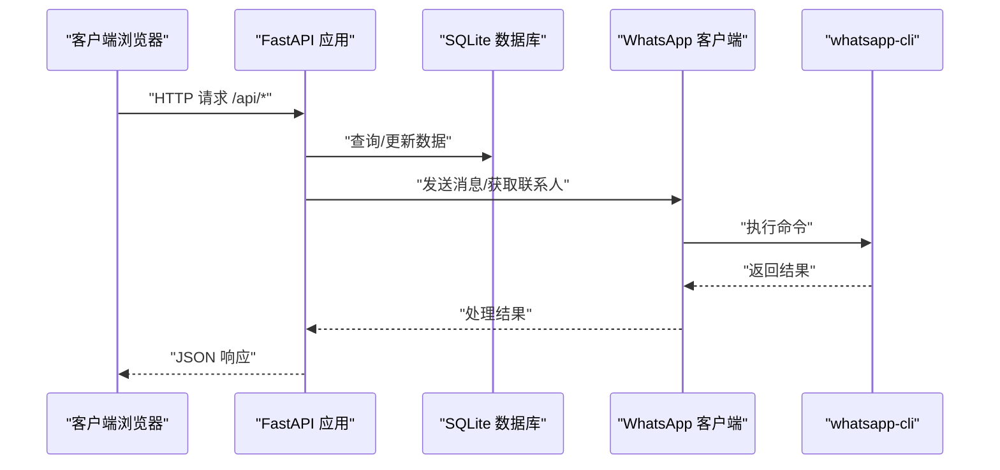
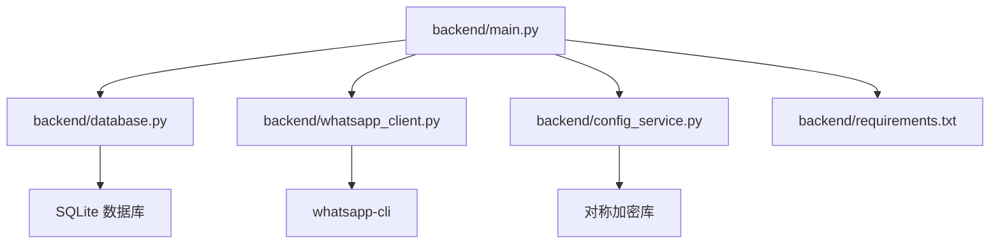

# Docker容器化部署

<cite>
**本文档引用的文件**
- [backend/main.py](file://backend/main.py)
- [backend/database.py](file://backend/database.py)
- [backend/config_service.py](file://backend/config_service.py)
- [backend/whatsapp_client.py](file://backend/whatsapp_client.py)
- [backend/requirements.txt](file://backend/requirements.txt)
- [start_server.py](file://start_server.py)
</cite>

## 目录
1. [简介](#简介)
2. [项目结构](#项目结构)
3. [核心组件](#核心组件)
4. [架构总览](#架构总览)
5. [详细组件分析](#详细组件分析)
6. [依赖关系分析](#依赖关系分析)
7. [性能考虑](#性能考虑)
8. [故障排除指南](#故障排除指南)
9. [结论](#结论)
10. [附录](#附录)

## 简介
本方案为WhatsApp智能客户系统提供完整的Docker容器化部署指南，涵盖Dockerfile编写、Docker Compose编排、数据持久化、网络配置、监控与日志、以及升级回滚策略。系统基于FastAPI提供REST API与WebSocket实时通信，通过whatsapp-cli与WhatsApp Web交互，并使用SQLite作为本地数据库。

## 项目结构
系统采用前后端分离与服务内聚相结合的组织方式：
- 后端服务：FastAPI应用、数据库、配置管理、WhatsApp客户端封装
- 前端资源：静态页面与管理界面
- 启动脚本：统一启动流程与环境准备



**图表来源**
- [backend/main.py:128-157](file://backend/main.py#L128-L157)
- [backend/database.py:10-20](file://backend/database.py#L10-L20)
- [backend/config_service.py:11-23](file://backend/config_service.py#L11-L23)
- [backend/whatsapp_client.py:13-26](file://backend/whatsapp_client.py#L13-L26)

**章节来源**
- [backend/main.py:128-157](file://backend/main.py#L128-L157)
- [backend/database.py:10-20](file://backend/database.py#L10-L20)
- [backend/config_service.py:11-23](file://backend/config_service.py#L11-L23)
- [backend/whatsapp_client.py:13-26](file://backend/whatsapp_client.py#L13-L26)

## 核心组件
- FastAPI应用：提供REST API与WebSocket接口，负责业务逻辑编排与实时消息推送
- 数据库层：基于SQLAlchemy的SQLite数据库，支持客户、消息、会话、标签等实体
- 配置服务：安全存储敏感配置（如API Key），使用对称加密保护
- WhatsApp客户端：封装whatsapp-cli命令，提供认证、联系人、消息、发送等功能
- 启动脚本：统一环境准备、依赖安装与服务启动流程

**章节来源**
- [backend/main.py:128-157](file://backend/main.py#L128-L157)
- [backend/database.py:23-289](file://backend/database.py#L23-L289)
- [backend/config_service.py:11-153](file://backend/config_service.py#L11-L153)
- [backend/whatsapp_client.py:13-437](file://backend/whatsapp_client.py#L13-L437)
- [start_server.py:92-127](file://start_server.py#L92-L127)

## 架构总览
系统采用单容器部署模式，将后端服务、静态资源与依赖打包至同一镜像；若需扩展，可拆分为独立容器并通过Docker Compose编排。



**图表来源**
- [backend/main.py:136-140](file://backend/main.py#L136-L140)
- [backend/database.py:10-20](file://backend/database.py#L10-L20)
- [backend/config_service.py:14-20](file://backend/config_service.py#L14-L20)

## 详细组件分析

### Dockerfile编写指南
- 基础镜像选择：建议使用官方Python运行时镜像，确保依赖兼容性与安全性
- 依赖安装：在容器内安装whatsapp-cli并配置PATH；安装Python依赖（FastAPI、Uvicorn、SQLAlchemy等）
- 环境配置：设置工作目录、复制项目文件、创建数据与配置目录、生成加密密钥
- 启动命令：使用uvicorn启动FastAPI应用，监听0.0.0.0:8000



[本图为概念性流程图，不直接对应具体源码文件]

### Docker Compose配置
- 服务定义：定义单容器服务，映射主机8000端口到容器8000端口
- 网络设置：使用默认桥接网络，容器间通过服务名互通
- 卷挂载：挂载后端数据目录、静态资源目录、配置文件
- 环境变量：通过环境变量传递数据库URL、LLM配置等



[本图为概念性架构图，不直接对应具体源码文件]

### 容器启动与管理命令
- 镜像构建：docker build -t whatsapp-crm .
- 容器运行：docker run -d -p 8000:8000 --name whatsapp-crm whatsapp-crm
- 服务编排：docker compose up -d
- 日志查看：docker compose logs -f

[本节为通用命令说明，不直接对应具体源码文件]

### 数据持久化策略
- 数据库文件挂载：将backend/data目录挂载为持久卷，确保SQLite文件持久化
- 配置文件管理：挂载backend/.env与backend/data/.config_key，便于外部配置与密钥管理
- 日志输出：将日志输出到stdout/stderr，配合Docker日志驱动收集

```mermaid
erDiagram
DATA_DIR {
dir backend/data/
}
CONFIG_FILE {
file backend/.env
}
KEY_FILE {
file backend/data/.config_key
}
CONTAINER {
volume backend/data/
volume backend/static/
volume backend/.env
}
CONTAINER ||--|| DATA_DIR : "挂载"
CONTAINER ||--|| CONFIG_FILE : "挂载"
CONTAINER ||--|| KEY_FILE : "挂载"
```

**图表来源**
- [backend/database.py:10-20](file://backend/database.py#L10-L20)
- [backend/config_service.py:14-20](file://backend/config_service.py#L14-L20)

**章节来源**
- [backend/database.py:10-20](file://backend/database.py#L10-L20)
- [backend/config_service.py:14-20](file://backend/config_service.py#L14-L20)

### 容器网络配置
- 端口映射：将容器8000端口映射到宿主机8000端口，提供API与WebSocket服务
- 服务发现：在同一Docker网络内的容器可通过服务名访问
- 跨容器通信：通过本地回环或共享网络实现与WhatsApp CLI的通信



**图表来源**
- [backend/main.py:489-496](file://backend/main.py#L489-L496)
- [backend/whatsapp_client.py:82-117](file://backend/whatsapp_client.py#L82-L117)

**章节来源**
- [backend/main.py:489-496](file://backend/main.py#L489-L496)
- [backend/whatsapp_client.py:82-117](file://backend/whatsapp_client.py#L82-L117)

### 容器监控与日志收集
- 容器状态：docker ps 查看运行状态
- 日志分析：docker compose logs -f 或 docker logs -f <container>
- 性能监控：结合Docker统计信息与应用内部指标（WebSocket连接数、消息同步频率）

[本节为通用运维建议，不直接对应具体源码文件]

### 容器升级与回滚策略
- 版本管理：通过镜像标签区分版本，升级时拉取新镜像并重启容器
- 配置变更：通过卷挂载的.env文件进行配置更新，无需重建镜像
- 数据迁移：SQLite文件通过卷持久化，升级时保持数据不变；如需结构变更，应在应用层面处理

[本节为通用运维建议，不直接对应具体源码文件]

## 依赖关系分析
后端服务的核心依赖关系如下：



**图表来源**
- [backend/main.py:17-26](file://backend/main.py#L17-L26)
- [backend/database.py:4-20](file://backend/database.py#L4-L20)
- [backend/whatsapp_client.py:4-10](file://backend/whatsapp_client.py#L4-L10)
- [backend/config_service.py:8](file://backend/config_service.py#L8)

**章节来源**
- [backend/main.py:17-26](file://backend/main.py#L17-L26)
- [backend/database.py:4-20](file://backend/database.py#L4-L20)
- [backend/whatsapp_client.py:4-10](file://backend/whatsapp_client.py#L4-L10)
- [backend/config_service.py:8](file://backend/config_service.py#L8)

## 性能考虑
- 数据库性能：SQLite适合小规模场景；如需高并发，建议迁移到PostgreSQL并使用连接池
- WebSocket负载：实时推送依赖WebSocket，注意连接数与消息广播的CPU占用
- 消息同步：消息轮询间隔可调，避免过于频繁导致资源消耗
- 依赖优化：精简Python包、使用多阶段构建减少镜像体积

[本节为通用性能建议，不直接对应具体源码文件]

## 故障排除指南
- WhatsApp未登录：检查whatsapp-cli安装与登录状态，确认PATH配置
- 数据库连接失败：验证DATABASE_URL环境变量与数据目录权限
- 配置解密异常：检查加密密钥文件权限与完整性
- WebSocket连接异常：确认端口映射与CORS配置

**章节来源**
- [start_server.py:16-33](file://start_server.py#L16-L33)
- [backend/database.py:10-20](file://backend/database.py#L10-L20)
- [backend/config_service.py:24-36](file://backend/config_service.py#L24-L36)
- [backend/main.py:150-157](file://backend/main.py#L150-L157)

## 结论
本方案提供了WhatsApp智能客户系统的完整Docker容器化部署路径，涵盖镜像构建、服务编排、数据持久化、网络配置与运维监控。通过合理的卷挂载与环境变量管理，系统可在生产环境中稳定运行，并具备良好的可维护性与扩展性。

## 附录
- 快速命令清单
  - 构建镜像：docker build -t whatsapp-crm .
  - 运行容器：docker run -d -p 8000:8000 --name whatsapp-crm whatsapp-crm
  - 启动编排：docker compose up -d
  - 查看日志：docker compose logs -f
  - 停止服务：docker compose down

[本节为通用附录内容，不直接对应具体源码文件]