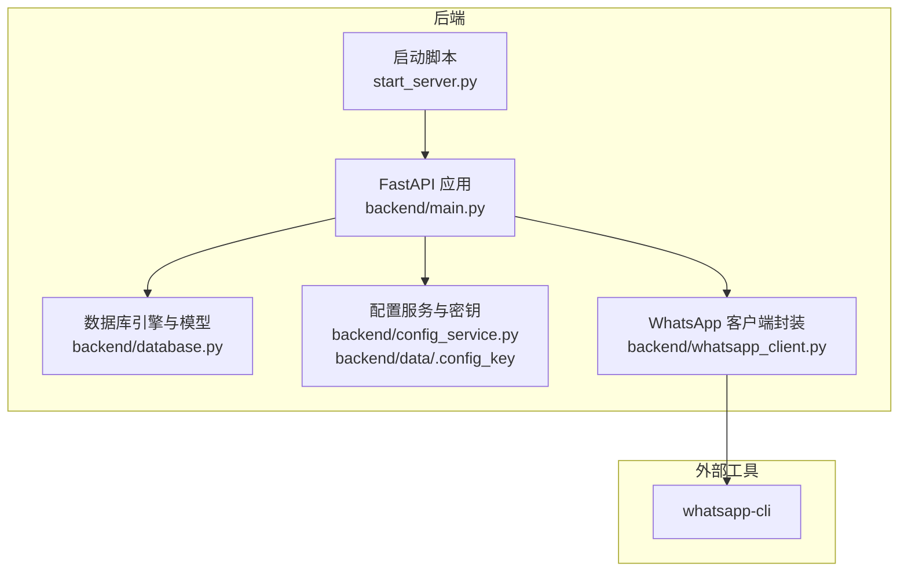
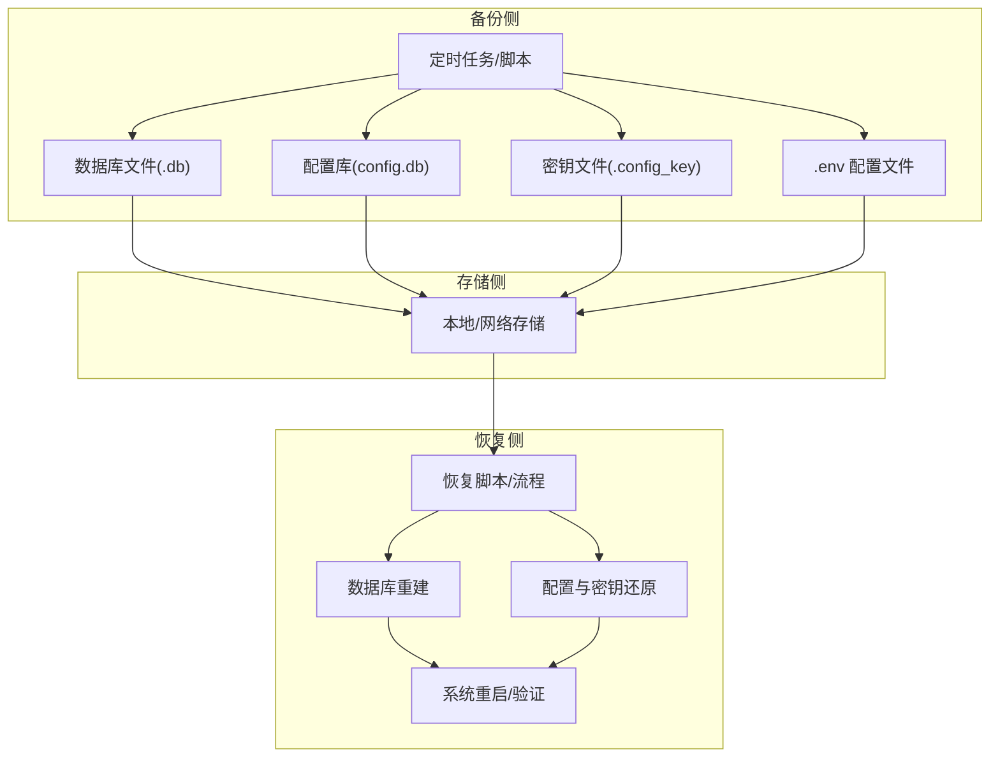
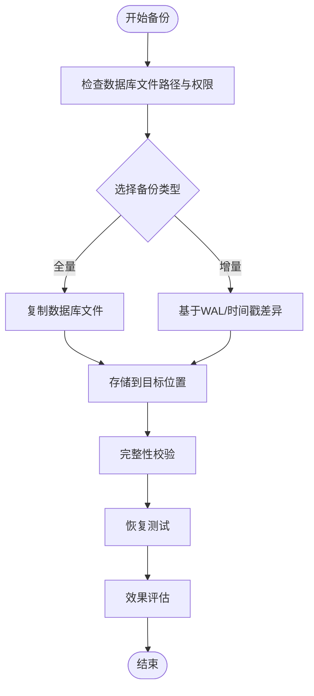
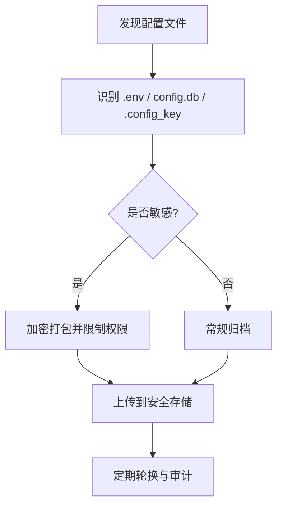
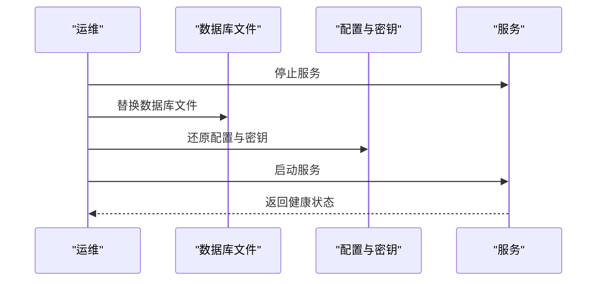
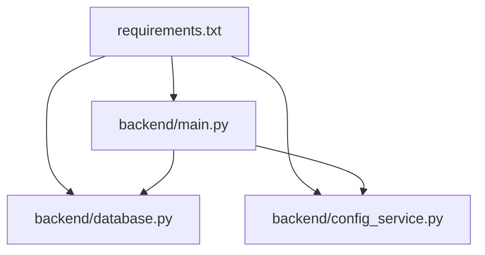

# 备份与恢复

<cite>
**本文引用的文件**   
- [backend/main.py](file://backend/main.py)
- [backend/database.py](file://backend/database.py)
- [backend/config_service.py](file://backend/config_service.py)
- [backend/data/.config_key](file://backend/data/.config_key)
- [backend/requirements.txt](file://backend/requirements.txt)
- [login_whatsapp.py](file://login_whatsapp.py)
- [start_server.py](file://start_server.py)
- [backend/whatsapp_client.py](file://backend/whatsapp_client.py)
</cite>

## 目录
1. [简介](#简介)
2. [项目结构](#项目结构)
3. [核心组件](#核心组件)
4. [架构总览](#架构总览)
5. [详细组件分析](#详细组件分析)
6. [依赖分析](#依赖分析)
7. [性能考虑](#性能考虑)
8. [故障排查指南](#故障排查指南)
9. [结论](#结论)
10. [附录](#附录)

## 简介
本文件为 WhatsApp 智能客户系统制定“数据备份与恢复”策略，覆盖以下方面：
- 数据库备份方案：SQLite 数据库文件备份、增量备份策略、备份频率建议
- 配置文件备份管理：.env、配置目录、密钥文件的备份与保护
- 数据恢复流程：完整恢复、点时间恢复、部分数据恢复的操作步骤
- 灾难恢复预案：系统故障、数据丢失、硬件损坏的应对措施
- 备份验证机制：备份完整性检查、恢复测试、备份效果评估
- 自动化备份脚本：定时任务配置、备份脚本编写、备份结果通知
- 数据迁移方案：不同环境间迁移数据、系统升级时的数据保护

## 项目结构
系统采用后端 Python/FastAPI + SQLite 的轻量架构，核心数据持久化依赖 SQLite 文件；配置与密钥通过独立的 SQLite 存储与对称加密保护。

图表来源
- [backend/main.py:129-134](file://backend/main.py#L129-L134)
- [backend/database.py:10-20](file://backend/database.py#L10-L20)
- [backend/config_service.py:14-36](file://backend/config_service.py#L14-L36)
- [backend/whatsapp_client.py:16-25](file://backend/whatsapp_client.py#L16-L25)
- [start_server.py:100-127](file://start_server.py#L100-L127)

章节来源
- [backend/main.py:129-134](file://backend/main.py#L129-L134)
- [backend/database.py:10-20](file://backend/database.py#L10-L20)
- [backend/config_service.py:14-36](file://backend/config_service.py#L14-L36)
- [backend/whatsapp_client.py:16-25](file://backend/whatsapp_client.py#L16-L25)
- [start_server.py:100-127](file://start_server.py#L100-L127)

## 核心组件
- 数据库层：基于 SQLAlchemy 的 SQLite 引擎，数据库文件位于后端 data 目录，默认文件名见数据库配置。
- 配置与密钥：独立的 SQLite 配置库与对称加密密钥文件，用于安全存储敏感配置。
- 启动与登录：启动脚本负责环境准备与服务器启动；登录脚本负责与 whatsapp-cli 的交互。
- API 生命周期：应用启动时初始化数据库，关闭时清理资源。

章节来源
- [backend/database.py:10-20](file://backend/database.py#L10-L20)
- [backend/config_service.py:14-36](file://backend/config_service.py#L14-L36)
- [backend/main.py:88-126](file://backend/main.py#L88-L126)
- [start_server.py:61-89](file://start_server.py#L61-L89)

## 架构总览
下图展示备份与恢复相关的数据流与组件交互：

图表来源
- [backend/database.py:10-20](file://backend/database.py#L10-L20)
- [backend/config_service.py:14-36](file://backend/config_service.py#L14-L36)
- [backend/data/.config_key:1-1](file://backend/data/.config_key#L1-L1)
- [start_server.py:69-75](file://start_server.py#L69-L75)

## 详细组件分析

### 数据库备份与恢复策略
- 数据库文件位置与命名
  - SQLite 数据库文件路径由环境变量或默认值决定，位于后端 data 目录。
  - 建议在生产环境固定数据库文件名与路径，便于备份与恢复。
- 备份方案
  - 全量备份：直接复制 SQLite 数据库文件，适用于小规模数据与低并发场景。
  - 增量备份：基于 WAL 模式与时间戳的差异文件备份，需结合 SQLite WAL/FSCK 特性评估可行性。
  - 备份频率：建议每日全量 + 每小时增量，或根据业务量调整。
- 恢复流程
  - 完整恢复：停止服务，替换数据库文件，启动服务并验证。
  - 点时间恢复：若具备 WAL/LSN 日志能力，可结合 SQLite 时间点恢复工具；否则退化为最近全量 + 差异重放。
  - 部分数据恢复：通过 SQL 导出导入或分表导出，配合事务回滚与校验。
- 备份验证
  - 完整性检查：使用 SQLite 工具校验文件完整性与页校验。
  - 恢复测试：在隔离环境中还原并跑通关键查询与接口。
  - 效果评估：对比记录数、索引数量、关键指标，确保业务可用性。

图表来源
- [backend/database.py:10-20](file://backend/database.py#L10-L20)

章节来源
- [backend/database.py:10-20](file://backend/database.py#L10-L20)

### 配置文件与密钥备份管理
- .env 文件
  - 启动脚本会在首次运行时从示例模板创建 .env 文件，建议将其纳入版本控制或统一配置管理。
  - 建议对 .env 进行最小权限访问控制，仅允许运维账户读取。
- 配置目录与密钥文件
  - 配置库 config.db 与密钥文件 .config_key 分别存放非敏感与敏感配置。
  - 密钥文件权限应严格限制（仅所有者可读写），防止泄露。
- 备份保护
  - 对 .env、config.db、.config_key 进行统一归档与加密存储。
  - 建议对密钥文件单独加密并异地存放，定期轮换。

图表来源
- [start_server.py:69-75](file://start_server.py#L69-L75)
- [backend/config_service.py:14-36](file://backend/config_service.py#L14-L36)
- [backend/data/.config_key:1-1](file://backend/data/.config_key#L1-L1)

章节来源
- [start_server.py:69-75](file://start_server.py#L69-L75)
- [backend/config_service.py:14-36](file://backend/config_service.py#L14-L36)
- [backend/data/.config_key:1-1](file://backend/data/.config_key#L1-L1)

### 数据恢复流程
- 完整恢复
  - 停止服务，替换数据库文件与配置文件，启动服务并验证 API 与页面可用性。
- 点时间恢复
  - 若具备 WAL/LSN 能力，可定位时间点并恢复；否则以最近全量为基础，重放增量。
- 部分数据恢复
  - 导出目标表/范围数据，验证后再导入目标环境。

图表来源
- [backend/database.py:10-20](file://backend/database.py#L10-L20)
- [backend/config_service.py:14-36](file://backend/config_service.py#L14-L36)

章节来源
- [backend/database.py:10-20](file://backend/database.py#L10-L20)
- [backend/config_service.py:14-36](file://backend/config_service.py#L14-L36)

### 灾难恢复预案
- 系统故障
  - 快速切换到备用节点或容器镜像，恢复数据库与配置后重启服务。
- 数据丢失
  - 从最近备份恢复，核对数据完整性与业务指标。
- 硬件损坏
  - 从异地备份恢复，验证密钥与配置可用性，逐步放量验证。

章节来源
- [backend/database.py:10-20](file://backend/database.py#L10-L20)
- [backend/config_service.py:14-36](file://backend/config_service.py#L14-L36)

### 备份验证机制
- 完整性检查：使用 SQLite 工具进行文件与页校验。
- 恢复测试：在隔离环境还原并执行关键查询与接口。
- 效果评估：统计记录数、索引数量、关键指标，确保业务可用。

章节来源
- [backend/database.py:10-20](file://backend/database.py#L10-L20)

### 自动化备份脚本
- 定时任务配置
  - 使用系统定时任务（如 cron）调度备份脚本，建议在业务低峰期执行。
- 备份脚本编写
  - 复制数据库文件、配置库与密钥文件，进行压缩与加密，上传到安全存储。
- 备份结果通知
  - 通过邮件、IM 或监控系统上报备份状态与异常。

章节来源
- [backend/database.py:10-20](file://backend/database.py#L10-L20)
- [backend/config_service.py:14-36](file://backend/config_service.py#L14-L36)

### 数据迁移方案
- 不同环境迁移
  - 统一数据库版本与驱动，导出目标环境数据，导入目标环境并校验。
- 升级时数据保护
  - 升级前全量备份，升级后验证数据一致性与接口可用性。

章节来源
- [backend/database.py:10-20](file://backend/database.py#L10-L20)

## 依赖分析
- 外部依赖
  - FastAPI、SQLAlchemy、Cryptography 等用于后端服务与加密。
  - whatsapp-cli 用于与 WhatsApp 设备交互。
- 内部依赖
  - 应用启动时初始化数据库，关闭时清理资源。
  - 配置服务依赖密钥文件进行敏感配置的加解密。

图表来源
- [backend/requirements.txt:1-20](file://backend/requirements.txt#L1-L20)
- [backend/main.py:17-26](file://backend/main.py#L17-L26)
- [backend/database.py:10-20](file://backend/database.py#L10-L20)
- [backend/config_service.py:14-36](file://backend/config_service.py#L14-L36)

章节来源
- [backend/requirements.txt:1-20](file://backend/requirements.txt#L1-L20)
- [backend/main.py:17-26](file://backend/main.py#L17-L26)
- [backend/database.py:10-20](file://backend/database.py#L10-L20)
- [backend/config_service.py:14-36](file://backend/config_service.py#L14-L36)

## 性能考虑
- 备份窗口：在业务低峰期执行全量备份，避免影响在线服务。
- 增量策略：结合 SQLite WAL 与时间戳差异，减少备份体积与时间。
- 存储与传输：使用压缩与加密，降低带宽与存储成本。

## 故障排查指南
- 登录与认证
  - 使用登录脚本检查 whatsapp-cli 安装与登录状态，必要时重新登录。
- 服务器启动
  - 启动脚本负责环境准备与依赖安装，若失败检查日志与权限。
- 数据库连接
  - 确认数据库文件路径与权限，检查连接参数与线程设置。

章节来源
- [login_whatsapp.py:16-33](file://login_whatsapp.py#L16-L33)
- [login_whatsapp.py:35-48](file://login_whatsapp.py#L35-L48)
- [start_server.py:16-34](file://start_server.py#L16-L34)
- [start_server.py:36-58](file://start_server.py#L36-L58)
- [backend/database.py:10-20](file://backend/database.py#L10-L20)

## 结论
本策略围绕 SQLite 数据库文件、配置库与密钥文件构建完整的备份与恢复体系，结合自动化脚本与验证机制，确保在多种灾难场景下快速恢复业务。建议在生产环境严格执行备份频率、权限控制与恢复演练，并持续优化备份与恢复流程。

## 附录
- 关键文件路径
  - 数据库文件：后端 data 目录下的 SQLite 文件
  - 配置库：后端 data 目录下的 config.db
  - 密钥文件：后端 data 目录下的 .config_key
  - .env 文件：后端根目录下的 .env
- 相关实现参考
  - 数据库初始化与连接：[backend/database.py:10-20](file://backend/database.py#L10-L20)
  - 配置服务与密钥：[backend/config_service.py:14-36](file://backend/config_service.py#L14-L36)
  - 启动与环境准备：[start_server.py:61-89](file://start_server.py#L61-L89)
  - 登录与状态检查：[login_whatsapp.py:16-33](file://login_whatsapp.py#L16-L33)