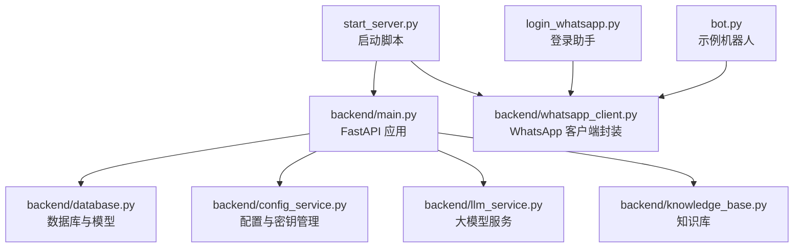
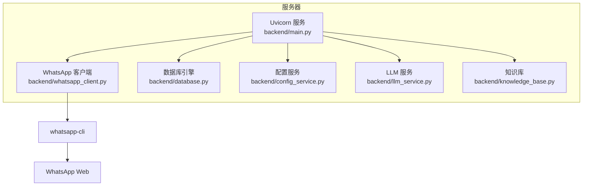
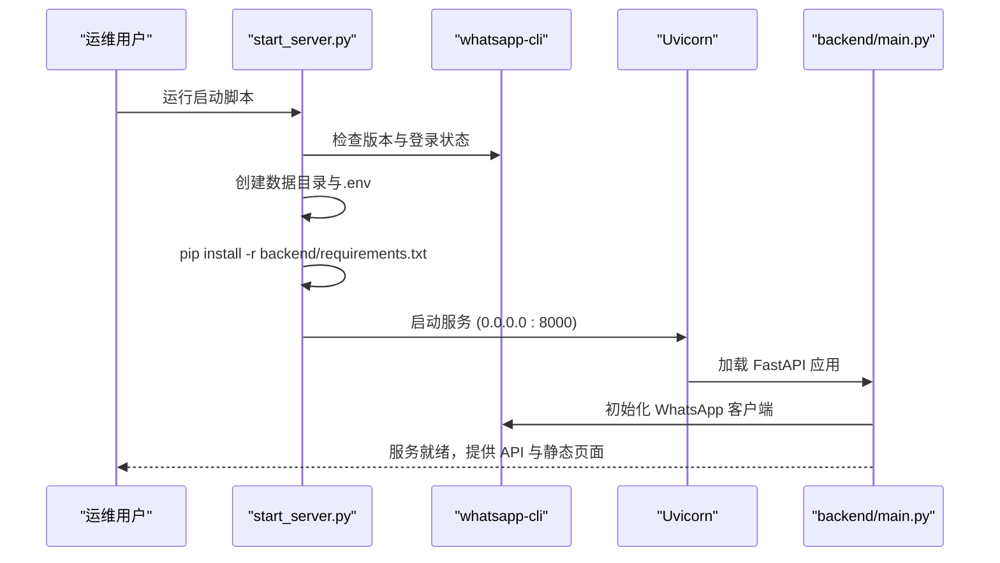
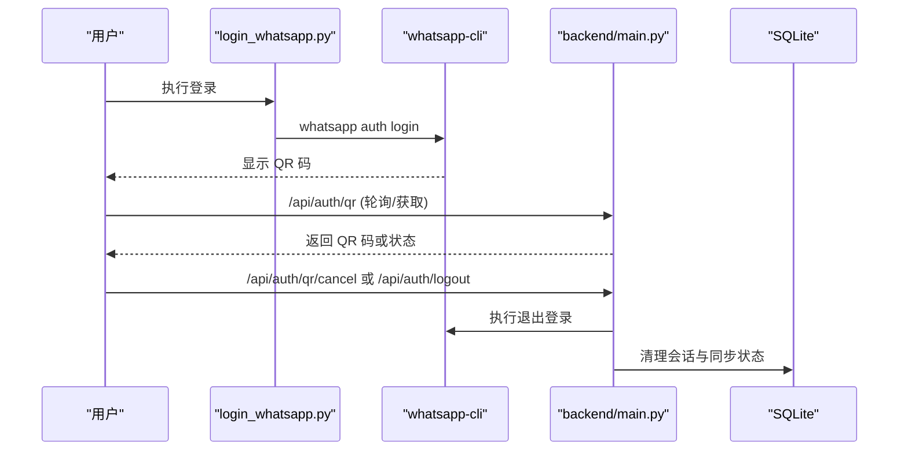
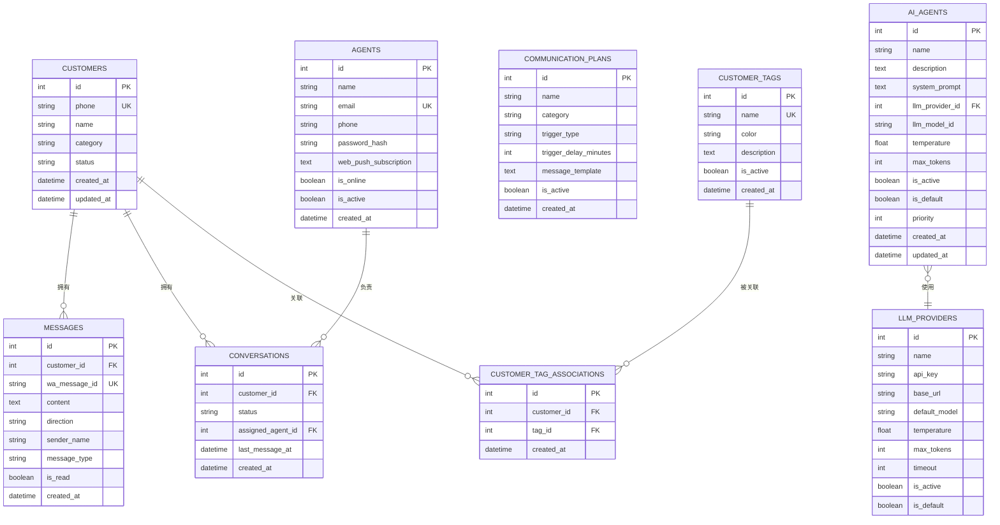
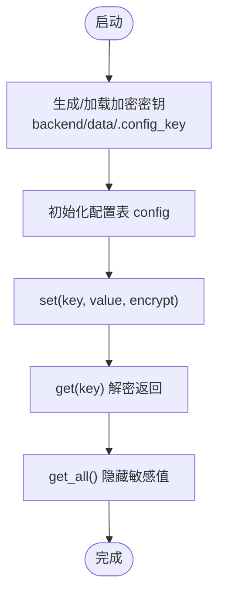
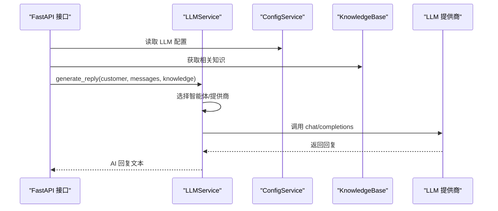
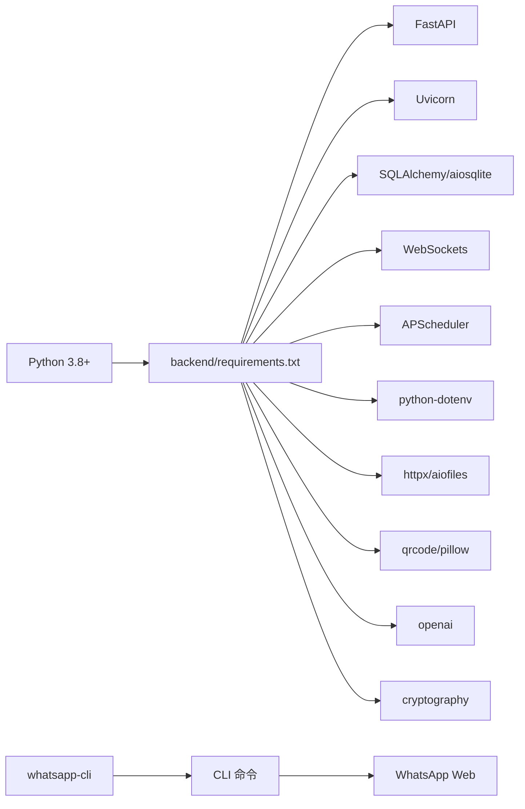

# 服务器部署

<cite>
**本文引用的文件**
- [start_server.py](file://start_server.py)
- [login_whatsapp.py](file://login_whatsapp.py)
- [requirements.txt](file://requirements.txt)
- [backend/requirements.txt](file://backend/requirements.txt)
- [backend/main.py](file://backend/main.py)
- [backend/database.py](file://backend/database.py)
- [backend/config_service.py](file://backend/config_service.py)
- [backend/whatsapp_client.py](file://backend/whatsapp_client.py)
- [backend/llm_service.py](file://backend/llm_service.py)
- [backend/knowledge_base.py](file://backend/knowledge_base.py)
- [bot.py](file://bot.py)
</cite>

## 目录
1. [简介](#简介)
2. [项目结构](#项目结构)
3. [核心组件](#核心组件)
4. [架构总览](#架构总览)
5. [详细组件分析](#详细组件分析)
6. [依赖分析](#依赖分析)
7. [性能考虑](#性能考虑)
8. [故障排查指南](#故障排查指南)
9. [结论](#结论)
10. [附录](#附录)

## 简介
本指南面向在服务器上部署“WhatsApp 智能客户系统”的运维与开发人员，目标是提供从环境准备、依赖安装、服务启动、配置管理到生产部署最佳实践的完整说明，并给出常见问题排查方案。系统基于 Python 与 FastAPI 提供 API 服务，通过 whatsapp-cli 与 WhatsApp 建立连接，使用 SQLite 存储业务数据，并支持基于 OpenAI 的大模型自动回复。

## 项目结构
仓库采用前后端分离与功能模块化组织方式：
- 顶层启动与登录脚本：start_server.py、login_whatsapp.py
- 后端服务：backend/ 目录，包含 FastAPI 应用、数据库、配置、LLM、知识库、WhatsApp 客户端等模块
- 顶层依赖清单：requirements.txt（当前注释说明，实际后端依赖在 backend/requirements.txt）
- 示例机器人：bot.py（可选）

图表来源
- [start_server.py:1-131](file://start_server.py#L1-L131)
- [backend/main.py:128-157](file://backend/main.py#L128-L157)
- [backend/whatsapp_client.py:13-26](file://backend/whatsapp_client.py#L13-L26)
- [backend/database.py:10-21](file://backend/database.py#L10-L21)
- [backend/config_service.py:11-37](file://backend/config_service.py#L11-L37)
- [backend/llm_service.py:11-24](file://backend/llm_service.py#L11-L24)
- [backend/knowledge_base.py:11-18](file://backend/knowledge_base.py#L11-L18)
- [login_whatsapp.py:51-108](file://login_whatsapp.py#L51-L108)
- [bot.py:42-83](file://bot.py#L42-L83)

章节来源
- [start_server.py:1-131](file://start_server.py#L1-L131)
- [backend/main.py:128-157](file://backend/main.py#L128-L157)
- [backend/whatsapp_client.py:13-26](file://backend/whatsapp_client.py#L13-L26)
- [backend/database.py:10-21](file://backend/database.py#L10-L21)
- [backend/config_service.py:11-37](file://backend/config_service.py#L11-L37)
- [backend/llm_service.py:11-24](file://backend/llm_service.py#L11-L24)
- [backend/knowledge_base.py:11-18](file://backend/knowledge_base.py#L11-L18)
- [login_whatsapp.py:51-108](file://login_whatsapp.py#L51-L108)
- [bot.py:42-83](file://bot.py#L42-L83)

## 核心组件
- 启动脚本：负责检查 whatsapp-cli、认证状态、安装后端依赖、创建数据目录与 .env、启动 Uvicorn 服务器。
- 登录助手：封装 whatsapp-cli 的登录/登出流程，便于在终端完成 QR 登录。
- FastAPI 应用：提供认证、客户、消息、会话、计划、AI 回复、知识库等接口；内置 WebSocket 实时推送。
- 数据库：SQLite 引擎与 SQLAlchemy 模型，统一数据持久化。
- 配置服务：基于 Fernet 对称加密的安全配置存储，支持 LLM API Key 等敏感信息。
- LLM 服务：集成 OpenAI 风格的 chat/completions，支持智能体与提供商配置。
- 知识库：SQLite 索引文档，关键词检索，辅助 AI 回复。
- WhatsApp 客户端：封装 whatsapp-cli 的 auth、chats、contacts、messages、send、sync 等命令。

章节来源
- [start_server.py:16-90](file://start_server.py#L16-L90)
- [login_whatsapp.py:51-108](file://login_whatsapp.py#L51-L108)
- [backend/main.py:160-194](file://backend/main.py#L160-L194)
- [backend/database.py:14-20](file://backend/database.py#L14-L20)
- [backend/config_service.py:24-37](file://backend/config_service.py#L24-L37)
- [backend/llm_service.py:14-24](file://backend/llm_service.py#L14-L24)
- [backend/knowledge_base.py:19-49](file://backend/knowledge_base.py#L19-L49)
- [backend/whatsapp_client.py:82-118](file://backend/whatsapp_client.py#L82-L118)

## 架构总览
系统采用“本地 CLI + 本地服务 + 本地数据库”的轻量架构：
- 服务器本地运行 Uvicorn，提供 HTTP/WebSocket API；
- 通过 whatsapp-cli 与 WhatsApp Web 建立连接；
- 使用 SQLite 作为默认数据库，数据位于 backend/data/；
- LLM 服务通过 HTTPX 调用外部大模型接口（如 OpenAI）。

图表来源
- [backend/main.py:128-157](file://backend/main.py#L128-L157)
- [backend/whatsapp_client.py:13-26](file://backend/whatsapp_client.py#L13-L26)
- [backend/database.py:14-20](file://backend/database.py#L14-L20)
- [backend/config_service.py:11-37](file://backend/config_service.py#L11-L37)
- [backend/llm_service.py:14-24](file://backend/llm_service.py#L14-L24)
- [backend/knowledge_base.py:11-18](file://backend/knowledge_base.py#L11-L18)

## 详细组件分析

### 启动脚本与服务启动流程
- 环境检查：确保 whatsapp-cli 在 PATH 中，检测版本与登录状态。
- 环境准备：创建 backend/data/ 目录，复制 .env.example 到 .env（若不存在），安装 backend/requirements.txt。
- 服务启动：以 uvicorn 启动 main:app，绑定 0.0.0.0:8000，默认开启 reload。

图表来源
- [start_server.py:16-127](file://start_server.py#L16-L127)
- [backend/main.py:88-126](file://backend/main.py#L88-L126)

章节来源
- [start_server.py:16-127](file://start_server.py#L16-L127)
- [backend/main.py:88-126](file://backend/main.py#L88-L126)

### 登录与认证流程
- 登录助手提供 QR 登录入口，检查 CLI 安装与登录状态，支持退出登录。
- FastAPI 提供 /api/auth/qr、/api/auth/status、/api/auth/logout 等接口，配合前端或移动端完成登录与登出。

图表来源
- [login_whatsapp.py:51-108](file://login_whatsapp.py#L51-L108)
- [backend/main.py:221-381](file://backend/main.py#L221-L381)

章节来源
- [login_whatsapp.py:51-108](file://login_whatsapp.py#L51-L108)
- [backend/main.py:221-381](file://backend/main.py#L221-L381)

### 数据库与模型
- 默认使用 SQLite，数据库路径为 backend/data/ 下的 whastapp_crm.db。
- 定义了客户、消息、会话、销售员、沟通计划、标签、AI 智能体、提供商等模型。
- 通过 SQLAlchemy ORM 管理数据迁移与查询。

图表来源
- [backend/database.py:23-200](file://backend/database.py#L23-L200)

章节来源
- [backend/database.py:10-21](file://backend/database.py#L10-L21)
- [backend/database.py:23-200](file://backend/database.py#L23-L200)

### 配置与密钥管理
- 使用 Fernet 对称加密保存敏感配置（如 LLM API Key），密钥文件位于 backend/data/.config_key。
- 支持设置/获取 LLM 配置（API Key、Base URL、Model），并兼容环境变量回退。

图表来源
- [backend/config_service.py:24-127](file://backend/config_service.py#L24-L127)

章节来源
- [backend/config_service.py:11-153](file://backend/config_service.py#L11-L153)

### LLM 服务与知识库
- LLM 服务根据客户标签与智能体绑定选择合适的 AI 智能体，支持提供商级别配置与超时控制。
- 知识库基于 SQLite 维护文档与关键词索引，提供相关知识检索辅助 AI 回复。

图表来源
- [backend/llm_service.py:14-24](file://backend/llm_service.py#L14-L24)
- [backend/llm_service.py:52-198](file://backend/llm_service.py#L52-L198)
- [backend/knowledge_base.py:129-141](file://backend/knowledge_base.py#L129-L141)
- [backend/config_service.py:128-140](file://backend/config_service.py#L128-L140)

章节来源
- [backend/llm_service.py:11-200](file://backend/llm_service.py#L11-L200)
- [backend/knowledge_base.py:11-200](file://backend/knowledge_base.py#L11-L200)
- [backend/config_service.py:128-140](file://backend/config_service.py#L128-L140)

## 依赖分析
- 顶层依赖：当前注释说明，实际后端依赖在 backend/requirements.txt。
- 后端依赖：FastAPI、Uvicorn、SQLAlchemy、aiosqlite、Pydantic、CORS、WebSocket、APScheduler、dotenv、httpx、aiofiles、qrcode、pillow、openai、cryptography 等。
- 系统依赖：需要安装 whatsapp-cli，并确保其在 PATH 中。

图表来源
- [backend/requirements.txt:2-20](file://backend/requirements.txt#L2-L20)
- [requirements.txt:1-8](file://requirements.txt#L1-L8)

章节来源
- [backend/requirements.txt:2-20](file://backend/requirements.txt#L2-L20)
- [requirements.txt:1-8](file://requirements.txt#L1-L8)

## 性能考虑
- 数据库：SQLite 适合小规模场景；若并发较高，建议迁移到 PostgreSQL/MySQL 并使用连接池。
- WebSocket：实时推送消息，注意客户端数量增长带来的内存与带宽压力。
- LLM 调用：合理设置超时与重试，避免阻塞请求；可引入限流与缓存策略。
- 文件与图片：QR 码生成与 Pillow 处理图片，注意磁盘空间与 I/O。
- 进程管理：生产环境建议使用 systemd/Gunicorn+Uvicorn worker 模式替代 --reload。

## 故障排查指南
- 权限问题
  - .config_key 文件权限：确保仅所有者可读写（0600）。
  - 数据目录 backend/data/ 权限：确保运行用户可读写。
- 依赖冲突
  - 使用独立虚拟环境安装 backend/requirements.txt。
  - 若 pip 安装失败，检查网络与代理设置。
- 端口占用
  - 默认 8000 端口被占用时，修改 Uvicorn 启动参数或释放端口。
- whatsapp-cli 未找到
  - 确认 ~/.local/bin 已加入 PATH；按提示安装 whatsapp-cli。
- 登录失败
  - 检查网络连通性与 QR 码生成；必要时执行 /api/auth/logout 清理会话后重试。
- 数据库异常
  - 检查 DATABASE_URL 环境变量与 backend/data/ 权限；SQLite 文件损坏时可备份后重建。

章节来源
- [backend/config_service.py:33-34](file://backend/config_service.py#L33-L34)
- [backend/database.py:10-21](file://backend/database.py#L10-L21)
- [start_server.py:16-33](file://start_server.py#L16-L33)
- [backend/main.py:118-126](file://backend/main.py#L118-L126)

## 结论
本部署指南提供了从环境准备、依赖安装、服务启动到配置管理与生产实践的全流程说明。建议在生产环境中使用进程管理器、反向代理、防火墙与证书，结合监控与日志策略，确保系统稳定与安全。

## 附录

### 系统环境要求
- Python 版本：3.8+（推荐 3.10+）
- 操作系统：Linux（Ubuntu/CentOS）、macOS（Intel/Apple Silicon）
- 硬件建议：CPU ≥ 2 核、内存 ≥ 2GB、磁盘 ≥ 10GB 可用空间（含 SQLite 与日志）

章节来源
- [requirements.txt:2](file://requirements.txt#L2)
- [backend/requirements.txt:2-20](file://backend/requirements.txt#L2-L20)

### 依赖安装流程
- 安装 whatsapp-cli：按提示脚本安装至 ~/.local/bin，并确保加入 PATH。
- 安装后端依赖：在 backend/requirements.txt 中声明的依赖。
- 创建数据目录与 .env：启动脚本会自动创建 backend/data/ 并复制 .env.example 到 .env。

章节来源
- [start_server.py:16-90](file://start_server.py#L16-L90)
- [backend/requirements.txt:2-20](file://backend/requirements.txt#L2-L20)

### 启动脚本使用说明
- 运行 start_server.py：自动检查 CLI、认证状态、安装依赖、启动服务。
- 访问地址：http://localhost:8000；API 文档：http://localhost:8000/docs；管理界面：http://localhost:8000/static/index.html。
- 登录流程：使用 /api/auth/qr 获取 QR 码，扫码登录；或使用 login_whatsapp.py 辅助登录。

章节来源
- [start_server.py:92-127](file://start_server.py#L92-L127)
- [backend/main.py:221-381](file://backend/main.py#L221-L381)
- [login_whatsapp.py:51-108](file://login_whatsapp.py#L51-L108)

### 配置文件管理
- .env 文件：由启动脚本自动创建（若不存在），用于存放敏感配置（如数据库 URL、LLM 配置等）。
- 数据库设置：默认 SQLite，路径在 backend/data/ 下；可通过 DATABASE_URL 环境变量覆盖。
- API 密钥配置：通过 ConfigService 加密存储 LLM API Key；也可通过环境变量回退。

章节来源
- [start_server.py:69-76](file://start_server.py#L69-L76)
- [backend/database.py:10-21](file://backend/database.py#L10-L21)
- [backend/config_service.py:128-140](file://backend/config_service.py#L128-L140)

### 生产环境部署最佳实践
- 进程管理：使用 systemd 或 PM2 管理进程，设置自动重启与日志轮转。
- 端口与防火墙：仅开放 8000（或自定义端口），在防火墙中放行对应端口。
- 反向代理：Nginx/Apache 代理至本地 8000 端口，启用 HTTPS 与压缩。
- 监控与日志：收集 Uvicorn/FastAPI 日志，设置告警阈值（错误率、响应时间、数据库锁等待）。
- 备份：定期备份 backend/data/ 与 .config_key；知识库与配置表单独备份。

章节来源
- [start_server.py:118-124](file://start_server.py#L118-L124)
- [backend/config_service.py:33-34](file://backend/config_service.py#L33-L34)