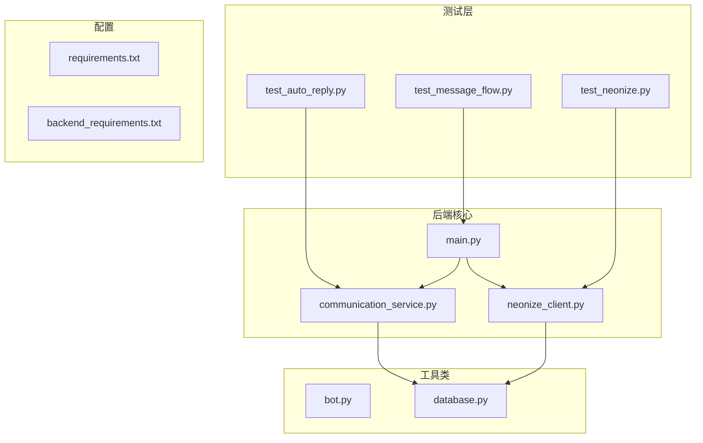
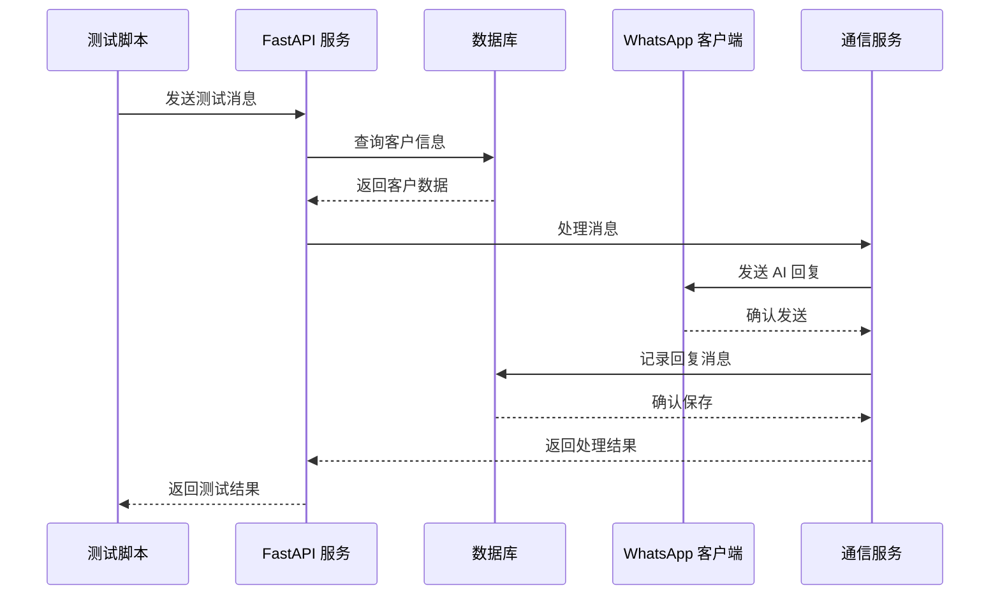
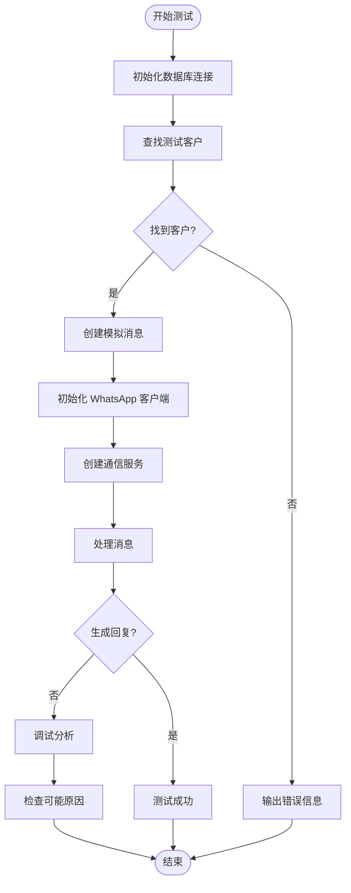
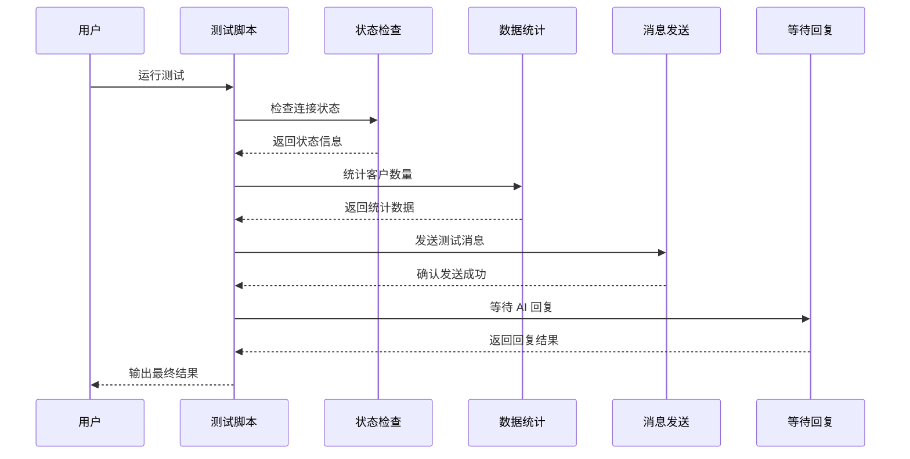
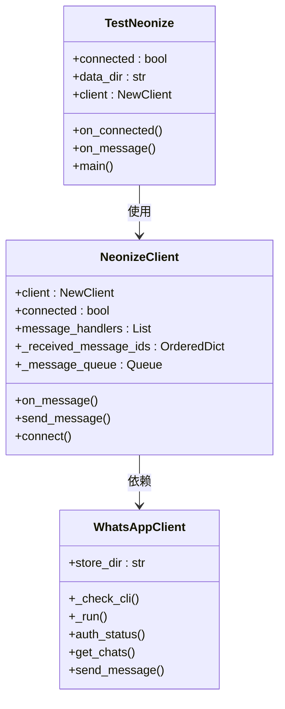
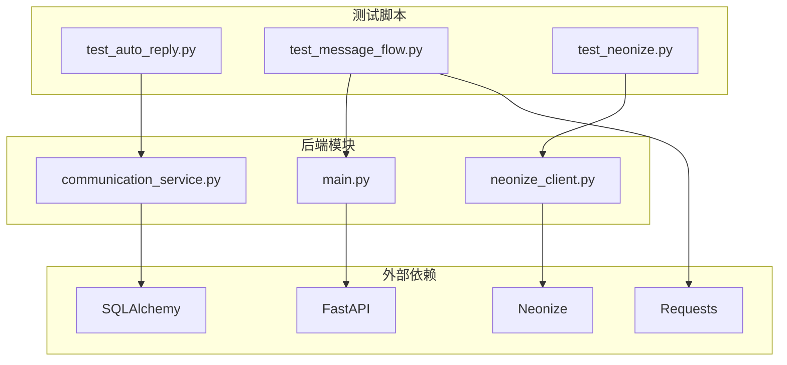

# 测试框架

<cite>
**本文档引用的文件**
- [test_auto_reply.py](file://test_auto_reply.py)
- [test_message_flow.py](file://test_message_flow.py)
- [test_neonize.py](file://test_neonize.py)
- [bot.py](file://bot.py)
- [main.py](file://backend/main.py)
- [communication_service.py](file://backend/communication_service.py)
- [neonize_client.py](file://backend/neonize_client.py)
- [requirements.txt](file://backend/requirements.txt)
- [backend_requirements.txt](file://requirements.txt)
</cite>

## 目录
1. [简介](#简介)
2. [项目结构](#项目结构)
3. [核心测试组件](#核心测试组件)
4. [架构概览](#架构概览)
5. [详细组件分析](#详细组件分析)
6. [依赖关系分析](#依赖关系分析)
7. [性能考虑](#性能考虑)
8. [故障排除指南](#故障排除指南)
9. [结论](#结论)

## 简介

这是一个基于 WhatsApp 的智能客户管理系统，包含完整的测试框架。该系统提供了三种不同类型的测试脚本，用于验证自动回复功能、消息流处理和 WhatsApp 连接状态。

系统采用模块化设计，主要由以下部分组成：
- **测试框架**：三个独立的测试脚本，分别针对不同的功能模块
- **核心业务逻辑**：基于 FastAPI 的 Web 服务
- **WhatsApp 客户端**：支持多种 WhatsApp 客户端实现
- **数据库层**：使用 SQLAlchemy 进行数据持久化

## 项目结构

**图表来源**
- [test_auto_reply.py:1-105](file://test_auto_reply.py#L1-L105)
- [test_message_flow.py:1-190](file://test_message_flow.py#L1-L190)
- [test_neonize.py:1-60](file://test_neonize.py#L1-L60)
- [main.py:1-200](file://backend/main.py#L1-L200)

**章节来源**
- [test_auto_reply.py:1-105](file://test_auto_reply.py#L1-L105)
- [test_message_flow.py:1-190](file://test_message_flow.py#L1-L190)
- [test_neonize.py:1-60](file://test_neonize.py#L1-L60)

## 核心测试组件

### 自动回复测试组件

自动回复测试脚本专注于验证系统的智能回复功能，包括：

- **客户数据验证**：检查测试客户的数据库记录
- **消息处理流程**：模拟接收消息并触发自动回复逻辑
- **回复消息生成**：验证系统是否正确生成 AI 回复
- **人工转接检测**：测试转人工请求的处理机制

### 消息流测试组件

消息流测试脚本提供端到端的消息处理验证：

- **WhatsApp 连接状态检查**：验证后端与 WhatsApp 的连接状态
- **客户数据完整性验证**：检查客户表的数据结构和内容
- **消息发送接口测试**：通过 REST API 发送测试消息
- **AI 回复等待机制**：监控系统对消息的响应时间

### Neonize 客户端测试组件

Neonize 客户端测试专门验证底层 WhatsApp 连接：

- **客户端连接测试**：验证 Neonize 客户端的初始化和连接
- **消息事件处理**：测试消息接收和自动回复功能
- **QR 码认证流程**：验证 WhatsApp 登录过程
- **实时消息监控**：监听并响应 WhatsApp 消息

**章节来源**
- [test_auto_reply.py:14-105](file://test_auto_reply.py#L14-L105)
- [test_message_flow.py:13-190](file://test_message_flow.py#L13-L190)
- [test_neonize.py:1-60](file://test_neonize.py#L1-L60)

## 架构概览

**图表来源**
- [test_message_flow.py:71-111](file://test_message_flow.py#L71-L111)
- [communication_service.py:87-124](file://backend/communication_service.py#L87-L124)
- [main.py:114-163](file://backend/main.py#L114-L163)

## 详细组件分析

### 自动回复测试流程

**图表来源**
- [test_auto_reply.py:14-105](file://test_auto_reply.py#L14-L105)
- [communication_service.py:87-124](file://backend/communication_service.py#L87-L124)

### 消息流测试序列

**图表来源**
- [test_message_flow.py:152-190](file://test_message_flow.py#L152-L190)
- [test_message_flow.py:13-31](file://test_message_flow.py#L13-L31)

### Neonize 客户端测试架构

**图表来源**
- [test_neonize.py:17-59](file://test_neonize.py#L17-L59)
- [neonize_client.py:87-200](file://backend/neonize_client.py#L87-L200)

**章节来源**
- [test_auto_reply.py:14-105](file://test_auto_reply.py#L14-L105)
- [test_message_flow.py:152-190](file://test_message_flow.py#L152-L190)
- [test_neonize.py:17-59](file://test_neonize.py#L17-L59)

## 依赖关系分析

### 测试脚本依赖图

**图表来源**
- [test_auto_reply.py:10-12](file://test_auto_reply.py#L10-L12)
- [test_message_flow.py:10-11](file://test_message_flow.py#L10-L11)
- [test_neonize.py:6-7](file://test_neonize.py#L6-L7)

### 核心依赖配置

系统使用双重依赖管理策略：

1. **后端依赖**（backend/requirements.txt）：
   - FastAPI 0.109.0：Web 框架
   - SQLAlchemy 2.0.25：数据库 ORM
   - Neonize：WhatsApp 客户端
   - OpenAI：AI 功能

2. **基础依赖**（requirements.txt）：
   - Websockets：WebSocket 支持
   - 标准库优先：减少外部依赖

**章节来源**
- [requirements.txt:1-23](file://backend/requirements.txt#L1-L23)
- [backend_requirements.txt:1-11](file://requirements.txt#L1-L11)

## 性能考虑

### 测试性能优化

1. **数据库连接管理**：每个测试脚本都实现了正确的连接关闭机制
2. **消息队列处理**：Neonize 客户端实现了高效的消息队列和去重机制
3. **并发处理**：使用线程池处理消息发送，避免阻塞
4. **资源清理**：所有测试脚本都包含适当的异常处理和资源清理

### 性能监控指标

- **消息处理延迟**：从接收消息到生成回复的时间
- **数据库查询性能**：客户和消息查询的响应时间
- **连接稳定性**：WhatsApp 连接的保持时间和重连次数
- **内存使用**：消息 ID 缓存和队列的内存占用

## 故障排除指南

### 常见问题及解决方案

#### 自动回复测试失败
- **症状**：未检测到自动回复消息
- **可能原因**：
  - 新客户只发送一次欢迎语
  - 会话状态为 handover（人工接管）
  - AI 回复生成失败
- **解决步骤**：
  1. 检查客户分类设置
  2. 验证会话状态
  3. 查看 AI 服务日志

#### 消息流测试超时
- **症状**：等待 AI 回复超时（60秒）
- **可能原因**：
  - 后端服务未启动
  - WhatsApp 连接未建立
  - 网络连接问题
- **解决步骤**：
  1. 启动后端服务：`uvicorn backend.main:app --reload`
  2. 验证 WhatsApp 连接状态
  3. 检查网络连接

#### Neonize 客户端连接失败
- **症状**：无法连接到 WhatsApp
- **可能原因**：
  - Neonize 未安装
  - 二维码认证未完成
  - 设备权限问题
- **解决步骤**：
  1. 安装 Neonize：`pip install neonize`
  2. 运行测试脚本进行 QR 码认证
  3. 检查设备权限设置

**章节来源**
- [test_auto_reply.py:95-98](file://test_auto_reply.py#L95-L98)
- [test_message_flow.py:147](file://test_message_flow.py#L147)
- [test_neonize.py:53-56](file://test_neonize.py#L53-L56)

## 结论

该测试框架提供了全面的功能验证能力，涵盖了从底层 WhatsApp 连接到底层业务逻辑的各个层面。通过三个独立的测试脚本，开发者可以：

1. **快速验证核心功能**：自动回复、消息处理、连接状态
2. **隔离问题定位**：每个测试脚本专注于特定功能模块
3. **保证系统稳定性**：持续集成中的自动化测试支持
4. **降低维护成本**：清晰的测试结构和完善的错误处理

建议在开发过程中：
- 定期运行所有测试脚本
- 添加更多的单元测试覆盖
- 实现持续集成管道
- 建立测试报告和监控机制