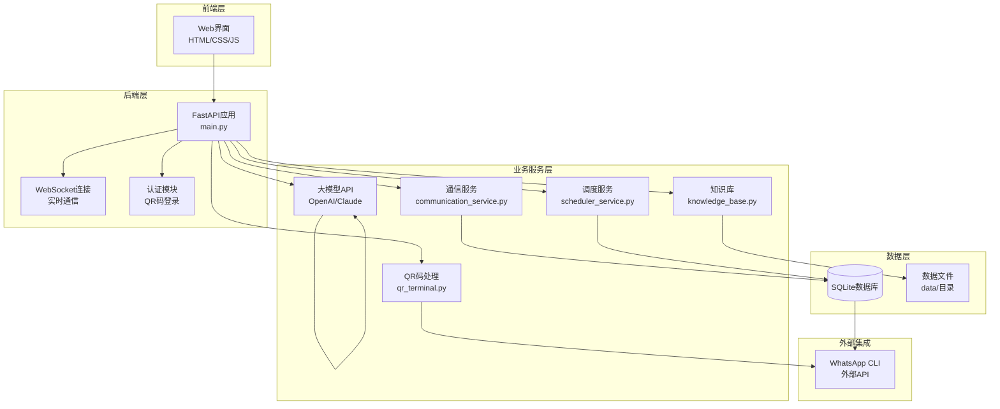
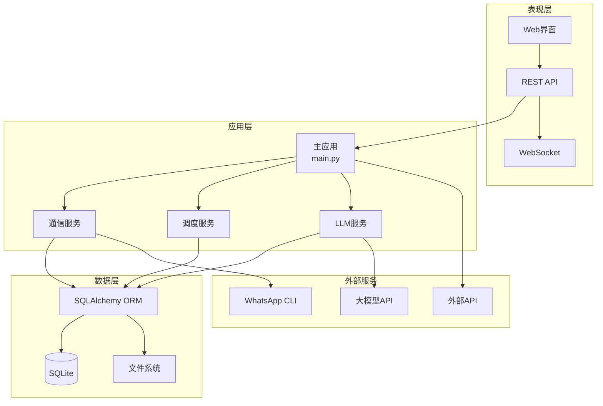
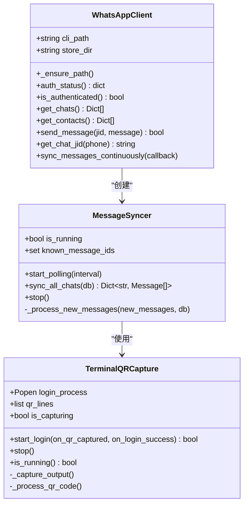
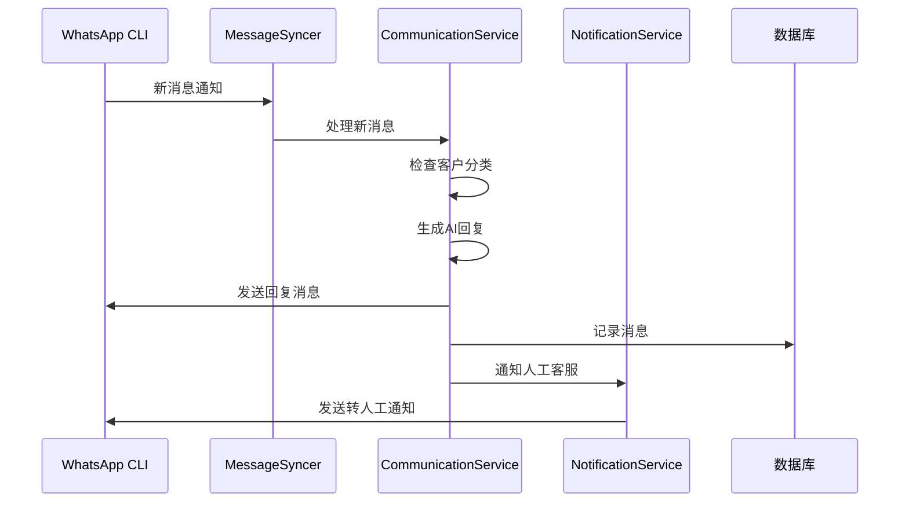
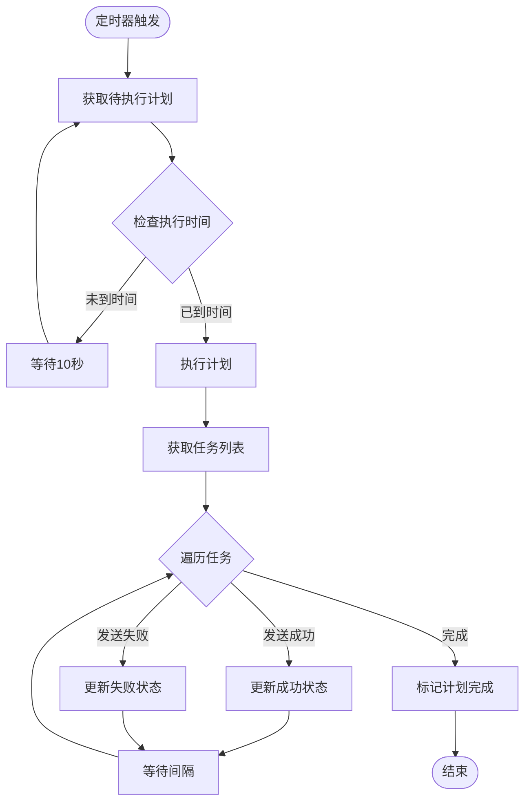
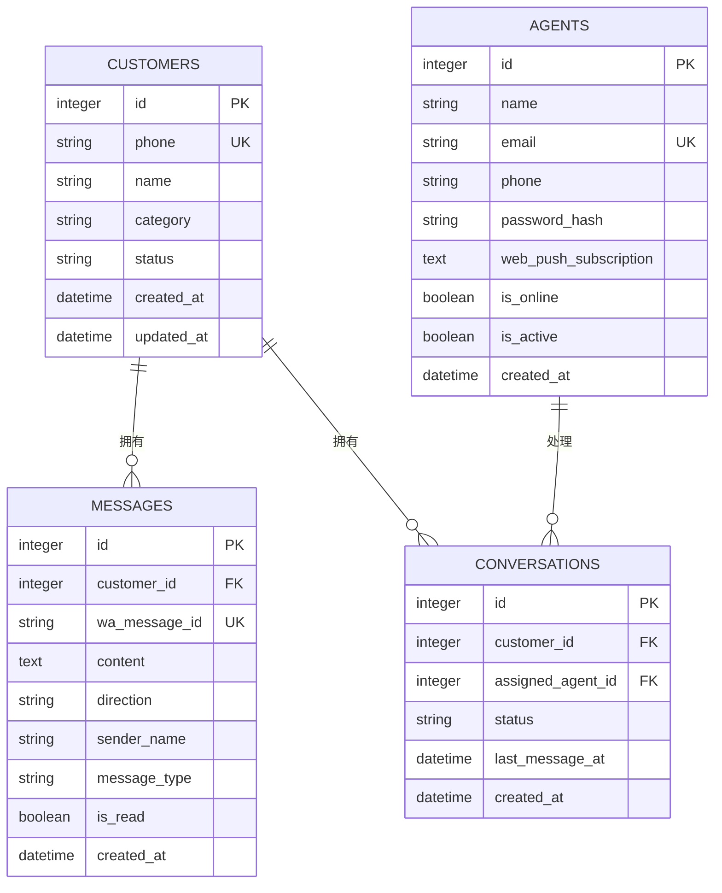
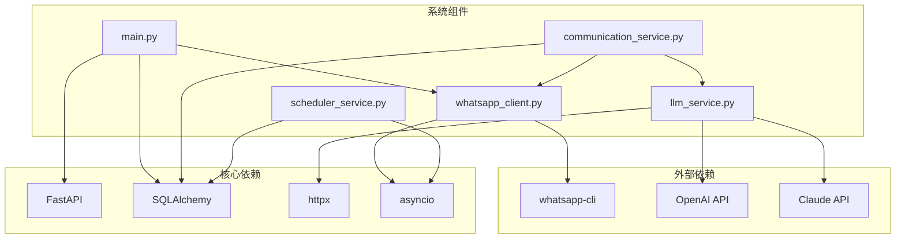

# 监控与日志管理

<cite>
**本文档引用的文件**
- [main.py](file://backend/main.py)
- [whatsapp_client.py](file://backend/whatsapp_client.py)
- [communication_service.py](file://backend/communication_service.py)
- [database.py](file://backend/database.py)
- [scheduler_service.py](file://backend/scheduler_service.py)
- [schedule_runner.py](file://backend/schedule_runner.py)
- [llm_service.py](file://backend/llm_service.py)
- [knowledge_base.py](file://backend/knowledge_base.py)
- [config_service.py](file://backend/config_service.py)
- [qr_terminal.py](file://backend/qr_terminal.py)
- [start_server.py](file://start_server.py)
- [requirements.txt](file://requirements.txt)
</cite>

## 目录
1. [简介](#简介)
2. [项目结构](#项目结构)
3. [核心组件](#核心组件)
4. [架构概览](#架构概览)
5. [详细组件分析](#详细组件分析)
6. [依赖关系分析](#依赖关系分析)
7. [性能考虑](#性能考虑)
8. [故障排除指南](#故障排除指南)
9. [结论](#结论)

## 简介

WhatsApp智能客户系统是一个基于FastAPI的现代化客户关系管理系统，集成了WhatsApp消息平台、AI智能回复、数据库管理、定时任务调度等功能。该系统需要完善的监控和日志管理策略来确保生产环境的稳定运行。

本指南将为系统提供全面的监控和日志管理解决方案，包括系统监控指标、日志管理策略、错误分析方法、性能监控方案、告警机制配置以及监控工具集成。

## 项目结构

系统采用模块化设计，主要分为以下层次：



**图表来源**
- [main.py:128-134](file://backend/main.py#L128-L134)
- [whatsapp_client.py:13-26](file://backend/whatsapp_client.py#L13-L26)
- [communication_service.py:17-46](file://backend/communication_service.py#L17-L46)

**章节来源**
- [main.py:128-134](file://backend/main.py#L128-L134)
- [start_server.py:92-127](file://start_server.py#L92-L127)

## 核心组件

系统的核心组件包括：

### 1. FastAPI应用层
- 主应用入口和路由管理
- WebSocket实时通信
- CORS跨域配置
- 生命周期管理

### 2. WhatsApp客户端层
- CLI封装和命令执行
- 实时消息同步
- 登录状态管理
- 消息发送和接收

### 3. 业务服务层
- 通信服务（自动回复、转人工）
- 调度服务（定时任务）
- LLM服务（智能回复）
- 知识库服务（文档管理）

### 4. 数据管理层
- SQLite数据库配置
- ORM模型定义
- 数据库连接管理

**章节来源**
- [main.py:17-26](file://backend/main.py#L17-L26)
- [whatsapp_client.py:13-26](file://backend/whatsapp_client.py#L13-L26)
- [database.py:23-256](file://backend/database.py#L23-L256)

## 架构概览

系统采用分层架构设计，各层职责明确：



**图表来源**
- [main.py:88-126](file://backend/main.py#L88-L126)
- [communication_service.py:43-45](file://backend/communication_service.py#L43-L45)
- [llm_service.py:14-24](file://backend/llm_service.py#L14-L24)

## 详细组件分析

### WhatsApp客户端组件

WhatsApp客户端是系统与WhatsApp CLI交互的核心组件：



**图表来源**
- [whatsapp_client.py:13-218](file://backend/whatsapp_client.py#L13-L218)
- [qr_terminal.py:14-285](file://backend/qr_terminal.py#L14-L285)

#### 关键监控点

1. **认证状态监控**
   - 登录状态检查频率
   - 认证超时处理
   - 重新认证机制

2. **消息同步监控**
   - 同步间隔优化
   - 消息去重机制
   - 错误重试策略

3. **QR码登录监控**
   - 登录进程监控
   - QR码捕获完整性
   - 登录超时处理

**章节来源**
- [whatsapp_client.py:82-173](file://backend/whatsapp_client.py#L82-L173)
- [qr_terminal.py:24-79](file://backend/qr_terminal.py#L24-L79)

### 通信服务组件

通信服务负责自动回复和人工转接：



**图表来源**
- [communication_service.py:47-71](file://backend/communication_service.py#L47-L71)
- [communication_service.py:406-426](file://backend/communication_service.py#L406-L426)

#### 监控指标

1. **消息处理指标**
   - 消息处理延迟
   - 自动回复成功率
   - 人工转接响应时间

2. **AI回复质量**
   - 回复生成时间
   - 回复准确性评估
   - 用户满意度指标

**章节来源**
- [communication_service.py:172-265](file://backend/communication_service.py#L172-L265)
- [communication_service.py:428-512](file://backend/communication_service.py#L428-L512)

### 调度服务组件

调度服务管理定时任务：



**图表来源**
- [schedule_runner.py:35-111](file://backend/schedule_runner.py#L35-L111)

#### 调度监控

1. **执行状态监控**
   - 计划执行进度
   - 任务执行成功率
   - 执行延迟统计

2. **资源使用监控**
   - 并发任务数量
   - 内存使用情况
   - 网络请求频率

**章节来源**
- [scheduler_service.py:108-138](file://backend/scheduler_service.py#L108-L138)
- [schedule_runner.py:112-123](file://backend/schedule_runner.py#L112-L123)

### 数据库组件

数据库层提供数据持久化：



**图表来源**
- [database.py:23-91](file://backend/database.py#L23-L91)

#### 数据库监控

1. **连接池监控**
   - 连接数统计
   - 查询性能指标
   - 死锁检测

2. **数据完整性监控**
   - 主键冲突检测
   - 外键约束验证
   - 数据备份状态

**章节来源**
- [database.py:14-20](file://backend/database.py#L14-L20)
- [database.py:254-256](file://backend/database.py#L254-L256)

## 依赖关系分析

系统依赖关系图：



**图表来源**
- [requirements.txt:1-8](file://requirements.txt#L1-L8)
- [main.py:10-26](file://backend/main.py#L10-L26)

**章节来源**
- [main.py:10-26](file://backend/main.py#L10-L26)
- [llm_service.py:4-8](file://backend/llm_service.py#L4-L8)

## 性能考虑

### 系统性能监控指标

#### 1. CPU使用率监控
- **指标定义**: 系统CPU使用百分比
- **监控频率**: 每15-30秒采样一次
- **阈值设置**: 
  - 警告: >80%
  - 严重: >95%
- **采集方法**: 使用psutil库监控进程CPU

#### 2. 内存占用监控
- **指标定义**: 系统内存使用量和使用率
- **监控频率**: 每30秒采样一次
- **阈值设置**:
  - 警告: >70%
  - 严重: >85%
- **采集方法**: 监控进程内存使用

#### 3. 网络IO监控
- **指标定义**: 网络发送/接收速率
- **监控频率**: 每10秒采样一次
- **阈值设置**:
  - 警告: >10MB/s
  - 严重: >50MB/s
- **采集方法**: 监控WhatsApp CLI网络流量

#### 4. 数据库连接数监控
- **指标定义**: 当前数据库连接数
- **监控频率**: 每分钟采样一次
- **阈值设置**:
  - 警告: >50连接
  - 严重: >100连接
- **采集方法**: SQLAlchemy连接池状态

#### 5. API响应时间监控
- **指标定义**: 各API端点响应时间
- **监控频率**: 每秒采样一次
- **阈值设置**:
  - 警告: >2秒
  - 严重: >10秒
- **采集方法**: FastAPI中间件统计

### 性能优化建议

#### 1. 消息同步优化
- **优化策略**: 调整同步间隔，避免过度轮询
- **当前实现**: 1秒间隔的轮询机制
- **建议改进**: 动态调整间隔，根据消息量调整

#### 2. AI回复优化
- **优化策略**: 实现回复缓存机制
- **当前实现**: 每次请求都调用LLM API
- **建议改进**: 缓存相似问题的回复

#### 3. 数据库查询优化
- **优化策略**: 添加适当的索引，优化查询语句
- **当前实现**: 基础的ORM查询
- **建议改进**: 实现查询缓存和批量操作

**章节来源**
- [whatsapp_client.py:366-397](file://backend/whatsapp_client.py#L366-L397)
- [communication_service.py:172-217](file://backend/communication_service.py#L172-L217)
- [llm_service.py:149-176](file://backend/llm_service.py#L149-L176)

## 故障排除指南

### 常见错误类型

#### 1. WhatsApp连接错误
- **错误代码**: WA001
- **症状**: 无法连接WhatsApp CLI
- **原因分析**: 
  - CLI未正确安装
  - 登录状态异常
  - 网络连接问题
- **解决方法**:
  - 检查CLI安装状态
  - 重新执行登录流程
  - 验证网络连接

#### 2. 数据库连接错误
- **错误代码**: DB001
- **症状**: 数据库操作失败
- **原因分析**:
  - 连接池耗尽
  - 数据库文件损坏
  - 权限问题
- **解决方法**:
  - 检查连接池配置
  - 修复数据库文件
  - 检查文件权限

#### 3. AI回复失败
- **错误代码**: LLM001
- **症状**: AI回复生成失败
- **原因分析**:
  - API密钥无效
  - 网络超时
  - 模型参数错误
- **解决方法**:
  - 验证API配置
  - 检查网络连接
  - 调整模型参数

#### 4. 消息重复问题
- **错误代码**: MSG001
- **症状**: 消息重复发送
- **原因分析**:
  - 消息ID去重机制失效
  - 同步间隔过短
  - 数据库事务问题
- **解决方法**:
  - 检查消息ID去重
  - 调整同步间隔
  - 修复数据库事务

### 错误日志分析

#### 1. 日志级别设置
- **DEBUG**: 详细调试信息
- **INFO**: 一般运行信息
- **WARNING**: 警告信息
- **ERROR**: 错误信息
- **CRITICAL**: 严重错误

#### 2. 日志格式标准化
```
[YYYY-MM-DD HH:MM:SS] [LEVEL] [COMPONENT] [MESSAGE]
```

#### 3. 关键监控字段
- **timestamp**: 时间戳
- **level**: 日志级别
- **component**: 组件名称
- **message**: 日志消息
- **error_code**: 错误代码
- **trace_id**: 请求追踪ID

### 根因分析技巧

#### 1. 时间序列分析
- 分析错误发生的时间模式
- 识别周期性问题
- 关联系统负载变化

#### 2. 依赖链分析
- 追踪错误传播路径
- 识别上游故障点
- 分析依赖组件影响

#### 3. 资源使用分析
- 监控CPU、内存、磁盘使用
- 识别资源瓶颈
- 分析资源竞争

**章节来源**
- [whatsapp_client.py:42-48](file://backend/whatsapp_client.py#L42-L48)
- [communication_service.py:206-217](file://backend/communication_service.py#L206-L217)
- [llm_service.py:173-176](file://backend/llm_service.py#L173-L176)

## 结论

WhatsApp智能客户系统的监控和日志管理需要从多个维度进行综合考虑。通过实施本文提出的监控指标、日志管理策略、错误分析方法和性能监控方案，可以有效提升系统的稳定性、可维护性和用户体验。

关键要点包括：

1. **全面的监控覆盖**: 涵盖系统、应用、数据库、外部API等各个层面
2. **合理的告警机制**: 基于业务场景设置合适的阈值和通知渠道
3. **持续的性能优化**: 定期分析性能指标，识别瓶颈并优化
4. **完善的故障处理**: 建立快速响应和恢复机制
5. **标准化的日志管理**: 统一的日志格式和存储策略

建议在生产环境中部署时，结合具体的业务需求和系统规模，进一步细化和优化监控策略，确保系统的长期稳定运行。