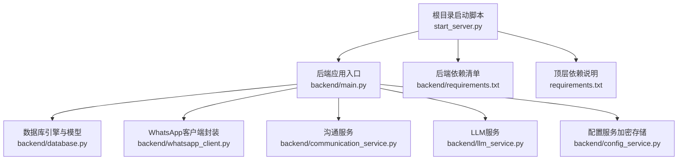
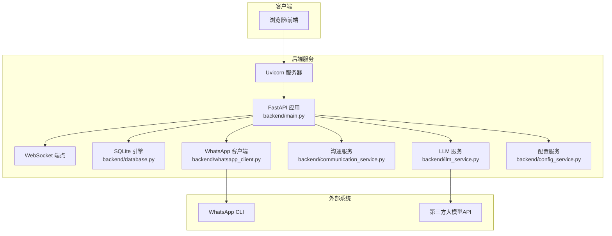
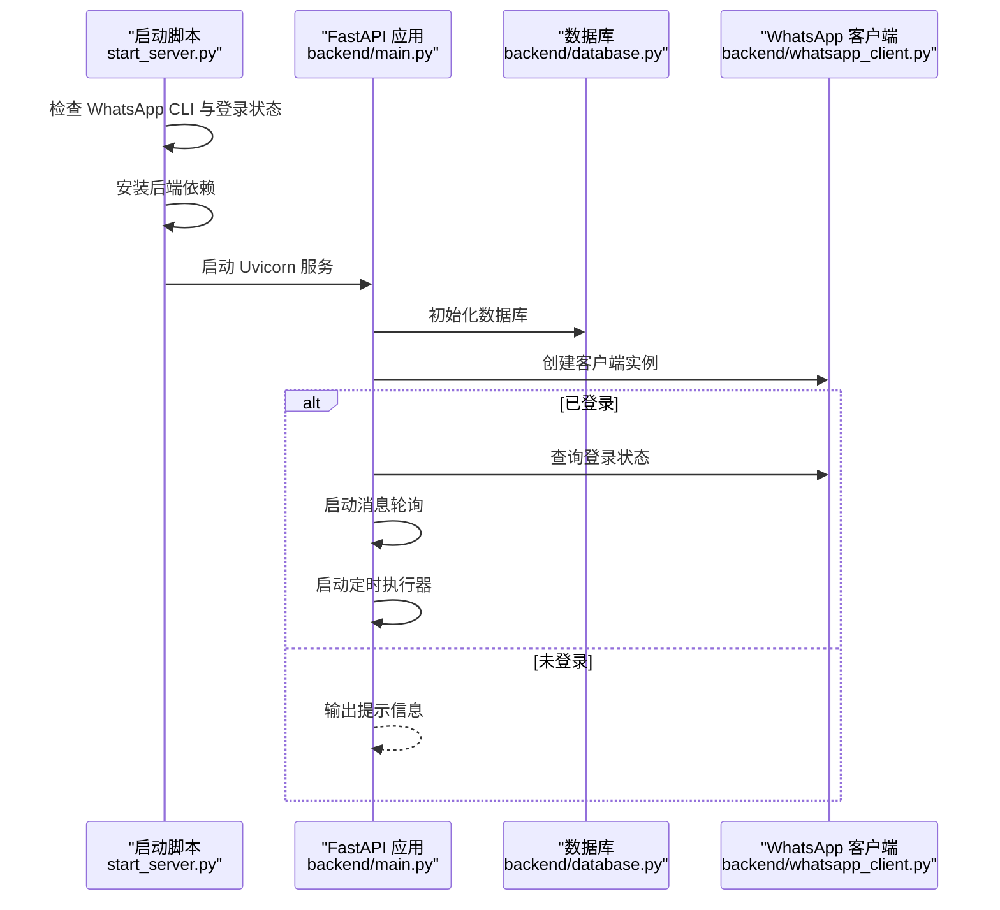
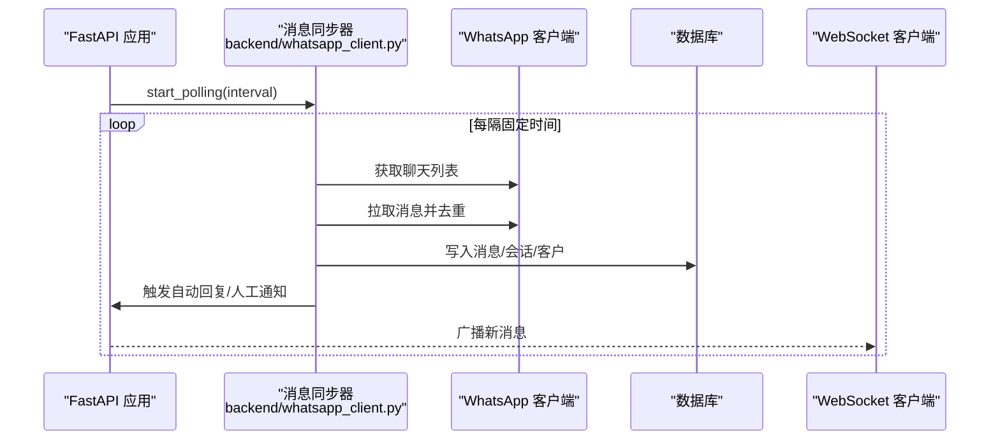
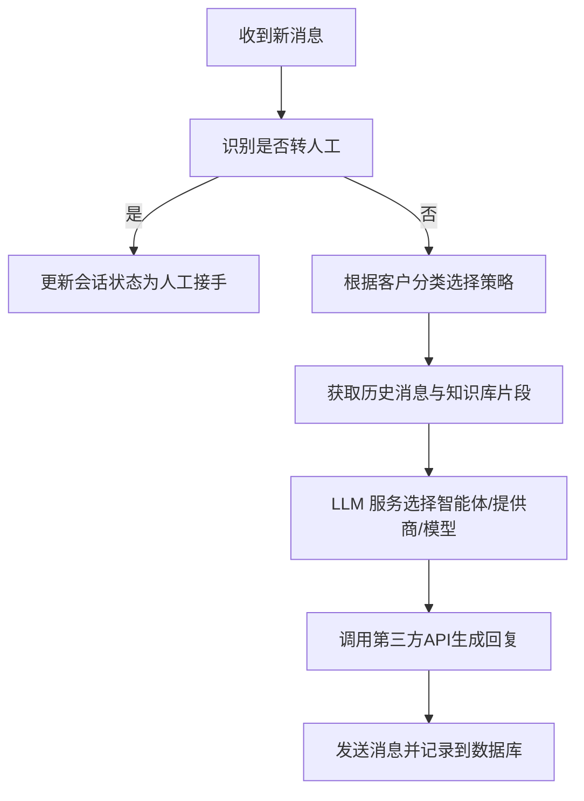
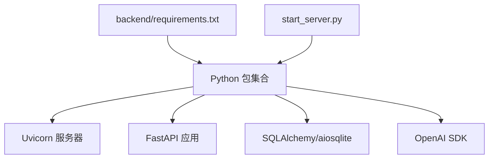

# 部署运维

<cite>
**本文引用的文件**   
- [backend/main.py](file://backend/main.py)
- [backend/database.py](file://backend/database.py)
- [backend/config_service.py](file://backend/config_service.py)
- [backend/whatsapp_client.py](file://backend/whatsapp_client.py)
- [backend/communication_service.py](file://backend/communication_service.py)
- [backend/llm_service.py](file://backend/llm_service.py)
- [backend/requirements.txt](file://backend/requirements.txt)
- [requirements.txt](file://requirements.txt)
- [start_server.py](file://start_server.py)
</cite>

## 目录
1. [简介](#简介)
2. [项目结构](#项目结构)
3. [核心组件](#核心组件)
4. [架构总览](#架构总览)
5. [详细组件分析](#详细组件分析)
6. [依赖分析](#依赖分析)
7. [性能考虑](#性能考虑)
8. [故障排查指南](#故障排查指南)
9. [结论](#结论)
10. [附录](#附录)

## 简介
本指南面向WhatsApp智能客户系统（基于FastAPI + WhatsApp CLI）的部署与运维，覆盖环境准备、依赖安装、服务启动、生产配置建议、监控与日志、备份与恢复、扩展与高可用以及常见问题排查。系统通过FastAPI提供REST/WebSocket接口，通过WhatsApp CLI进行消息收发与登录认证，并使用SQLite存储业务数据。

## 项目结构
- 后端主程序位于 backend/，包含API路由、数据库模型、WhatsApp客户端封装、消息同步器、沟通与AI回复服务等。
- 启动脚本位于根目录，负责检查WhatsApp CLI、登录状态、安装后端依赖并启动Uvicorn服务。
- 顶层requirements.txt为可选扩展依赖说明；backend/requirements.txt为后端核心依赖清单。

图表来源
- [start_server.py:1-131](file://start_server.py#L1-L131)
- [backend/main.py:128-157](file://backend/main.py#L128-L157)
- [backend/database.py:10-20](file://backend/database.py#L10-L20)
- [backend/whatsapp_client.py:13-26](file://backend/whatsapp_client.py#L13-L26)
- [backend/communication_service.py:17-46](file://backend/communication_service.py#L17-L46)
- [backend/llm_service.py:11-24](file://backend/llm_service.py#L11-L24)
- [backend/config_service.py:11-36](file://backend/config_service.py#L11-L36)
- [backend/requirements.txt:1-20](file://backend/requirements.txt#L1-L20)
- [requirements.txt:1-8](file://requirements.txt#L1-L8)

章节来源
- [start_server.py:1-131](file://start_server.py#L1-L131)
- [backend/main.py:128-157](file://backend/main.py#L128-L157)

## 核心组件
- FastAPI应用与生命周期：应用启动时初始化数据库、建立WhatsApp客户端、启动消息轮询与定时执行器；关闭时清理资源。
- 数据库与模型：使用SQLAlchemy定义客户、消息、会话、标签、沟通计划、LLM提供商/模型等实体，并提供初始化与会话工厂。
- WhatsApp客户端封装：封装CLI命令调用、登录状态查询、联系人/聊天/消息获取、消息发送、JID解析与实时同步。
- 沟通服务：根据客户分类与转人工关键字触发自动回复或转交人工；支持AI回复与知识库检索。
- LLM服务：统一管理API Key、Base URL、模型ID与温度/最大Token等参数，支持按智能体与标签绑定选择不同提供商与模型。
- 配置服务：基于Fernet对敏感配置（如API Key）进行加密存储，提供安全的读写接口。

章节来源
- [backend/main.py:88-126](file://backend/main.py#L88-L126)
- [backend/database.py:23-296](file://backend/database.py#L23-L296)
- [backend/whatsapp_client.py:13-210](file://backend/whatsapp_client.py#L13-L210)
- [backend/communication_service.py:17-200](file://backend/communication_service.py#L17-L200)
- [backend/llm_service.py:11-200](file://backend/llm_service.py#L11-L200)
- [backend/config_service.py:11-153](file://backend/config_service.py#L11-L153)

## 架构总览
系统采用“Web API + 消息同步 + AI回复”的分层架构：前端通过WebSocket接收实时消息，后端通过WhatsApp CLI与WhatsApp服务交互，数据库持久化业务数据，LLM服务提供智能回复能力。

图表来源
- [backend/main.py:128-157](file://backend/main.py#L128-L157)
- [backend/database.py:10-20](file://backend/database.py#L10-L20)
- [backend/whatsapp_client.py:13-26](file://backend/whatsapp_client.py#L13-L26)
- [backend/communication_service.py:17-46](file://backend/communication_service.py#L17-L46)
- [backend/llm_service.py:11-24](file://backend/llm_service.py#L11-L24)
- [backend/config_service.py:11-36](file://backend/config_service.py#L11-L36)

## 详细组件分析

### 组件A：应用生命周期与启动流程
- 生命周期钩子在启动时初始化数据库、创建WhatsApp客户端、启动消息轮询与定时执行器；关闭时停止轮询与执行器。
- 启动脚本负责检查WhatsApp CLI与登录状态、创建后端数据目录与.env示例、安装后端依赖并启动Uvicorn服务。

图表来源
- [start_server.py:92-127](file://start_server.py#L92-L127)
- [backend/main.py:88-126](file://backend/main.py#L88-L126)
- [backend/database.py:254-256](file://backend/database.py#L254-L256)
- [backend/whatsapp_client.py:82-92](file://backend/whatsapp_client.py#L82-L92)

章节来源
- [start_server.py:16-127](file://start_server.py#L16-L127)
- [backend/main.py:88-126](file://backend/main.py#L88-L126)

### 组件B：消息同步与实时推送
- 消息同步器周期性拉取所有聊天消息，去重并入库，同时触发自动回复与人工通知。
- WebSocket端点维护活动连接，向客户端广播新消息。

图表来源
- [backend/whatsapp_client.py:366-398](file://backend/whatsapp_client.py#L366-L398)
- [backend/whatsapp_client.py:434-437](file://backend/whatsapp_client.py#L434-L437)
- [backend/main.py:162-194](file://backend/main.py#L162-L194)

章节来源
- [backend/whatsapp_client.py:212-437](file://backend/whatsapp_client.py#L212-L437)
- [backend/main.py:162-194](file://backend/main.py#L162-L194)

### 组件C：AI回复与知识库集成
- 沟通服务根据客户分类与转人工关键字决定是否自动回复；若需要AI回复，LLM服务按智能体/标签绑定选择提供商与模型，调用第三方API生成回复。
- 回复生成后记录到数据库并发送至WhatsApp。

图表来源
- [backend/communication_service.py:47-200](file://backend/communication_service.py#L47-L200)
- [backend/llm_service.py:86-198](file://backend/llm_service.py#L86-L198)

章节来源
- [backend/communication_service.py:17-200](file://backend/communication_service.py#L17-L200)
- [backend/llm_service.py:11-200](file://backend/llm_service.py#L11-L200)

## 依赖分析
- 后端核心依赖集中在backend/requirements.txt，包含FastAPI、Uvicorn、SQLAlchemy、aiosqlite、Pydantic、APScheduler、OpenAI SDK等。
- 启动脚本负责在后端目录安装依赖并启动服务。
- 顶层requirements.txt为可选扩展依赖说明。

图表来源
- [backend/requirements.txt:1-20](file://backend/requirements.txt#L1-L20)
- [start_server.py:77-89](file://start_server.py#L77-L89)

章节来源
- [backend/requirements.txt:1-20](file://backend/requirements.txt#L1-L20)
- [requirements.txt:1-8](file://requirements.txt#L1-L8)
- [start_server.py:61-90](file://start_server.py#L61-L90)

## 性能考虑
- 消息轮询间隔：消息同步器默认1秒轮询一次，可在生产环境中根据并发量与WhatsApp速率限制调整。
- WebSocket广播：广播新消息时对断连连接进行清理，避免阻塞。
- LLM调用：异步HTTP客户端调用第三方API，建议设置合理的超时与重试策略；在高并发场景下考虑限流与缓存。
- 数据库：SQLite适合中小规模场景；若并发较高，建议迁移到PostgreSQL/MySQL并启用连接池与索引优化。
- 静态资源：静态页面挂载于/static，生产环境建议配合反向代理缓存与CDN。

章节来源
- [backend/whatsapp_client.py:366-398](file://backend/whatsapp_client.py#L366-L398)
- [backend/main.py:178-194](file://backend/main.py#L178-L194)
- [backend/llm_service.py:150-175](file://backend/llm_service.py#L150-L175)

## 故障排查指南
- WhatsApp CLI未安装或未登录
  - 症状：启动脚本提示未找到CLI或未登录。
  - 处理：安装CLI并执行登录，随后重启服务。
  - 参考
    - [start_server.py:16-58](file://start_server.py#L16-L58)
- 登录状态异常
  - 症状：API返回未登录或数据库状态异常。
  - 处理：调用认证状态接口检查；必要时执行退出登录并重新登录。
  - 参考
    - [backend/main.py:198-212](file://backend/main.py#L198-L212)
    - [backend/whatsapp_client.py:110-117](file://backend/whatsapp_client.py#L110-L117)
- 消息同步失败
  - 症状：消息未入库或重复。
  - 处理：检查WhatsApp CLI返回、JID格式与known_message_ids去重逻辑；确认聊天列表与消息拉取。
  - 参考
    - [backend/whatsapp_client.py:286-364](file://backend/whatsapp_client.py#L286-L364)
- AI回复失败
  - 症状：LLM API返回错误或超时。
  - 处理：检查API Key、Base URL、模型ID与超时设置；查看fallback回复逻辑。
  - 参考
    - [backend/llm_service.py:149-175](file://backend/llm_service.py#L149-L175)
- 配置安全
  - 症状：敏感配置泄露风险。
  - 处理：使用配置服务加密存储；确保密钥文件权限仅限所有者读写。
  - 参考
    - [backend/config_service.py:24-36](file://backend/config_service.py#L24-L36)
    - [backend/config_service.py:38-54](file://backend/config_service.py#L38-L54)

## 结论
本系统通过清晰的模块划分与生命周期管理，实现了从消息同步到智能回复的完整链路。生产部署建议结合反向代理、数据库迁移、LLM限流与缓存、严格的配置加密与日志审计，以获得更稳健的稳定性与可维护性。

## 附录

### A. 服务器部署步骤（非容器化）
- 环境准备
  - 安装Python 3.8+与pip。
  - 安装并登录WhatsApp CLI。
- 依赖安装
  - 在后端目录安装依赖。
- 服务启动
  - 使用启动脚本启动Uvicorn服务，监听0.0.0.0:8000。
- 访问与验证
  - 浏览器访问API文档与管理界面；通过认证接口检查登录状态。

章节来源
- [start_server.py:16-127](file://start_server.py#L16-L127)
- [backend/requirements.txt:1-20](file://backend/requirements.txt#L1-L20)

### B. Docker容器化部署方案（建议）
- 镜像构建
  - 基于Python 3.8+官方镜像，复制requirements.txt与后端代码，安装依赖。
- 容器配置
  - 挂载后端数据目录与.env文件；暴露端口8000。
  - 通过环境变量配置DATABASE_URL（建议使用SQLite文件路径或外部数据库URL）。
- 网络设置
  - 将容器加入与宿主机相同的网络以便访问WhatsApp CLI；或在容器内安装CLI并映射设备。
- 启动命令
  - 使用Uvicorn运行main:app，绑定0.0.0.0:8000。

说明：仓库未提供Dockerfile与docker-compose.yml，以上为通用最佳实践建议。

### C. 生产环境配置建议
- 安全加固
  - 限制CORS白名单；启用HTTPS与反向代理；对敏感配置使用配置服务加密存储。
- 性能调优
  - 调整消息轮询间隔；为高频查询建立索引；使用连接池与异步I/O。
- 监控配置
  - 集成日志采集与指标上报；对LLM调用耗时与错误率进行告警。

### D. 系统监控与日志管理
- 日志
  - 后端标准输出与错误输出；建议接入集中式日志系统（如ELK/Fluentd）。
- 监控
  - 指标：请求QPS、响应时间、错误率、消息同步延迟、WebSocket连接数。
  - 告警：LLM API失败率、数据库连接异常、WhatsApp CLI状态异常。

### E. 备份与恢复策略
- 数据库备份
  - SQLite文件定期快照；生产环境建议迁移到PostgreSQL并使用其备份工具。
- 配置文件管理
  - .env与配置服务加密存储的配置文件纳入版本控制或密文管理。
- 数据迁移
  - 使用SQLAlchemy迁移工具或导出导入策略进行结构与数据迁移。

### F. 扩展性与高可用
- 水平扩展
  - 使用反向代理与多实例部署；共享数据库与消息队列（如RabbitMQ/Kafka）解耦消息处理。
- 高可用
  - 多副本部署与健康检查；自动故障转移；外部数据库与对象存储冗余。