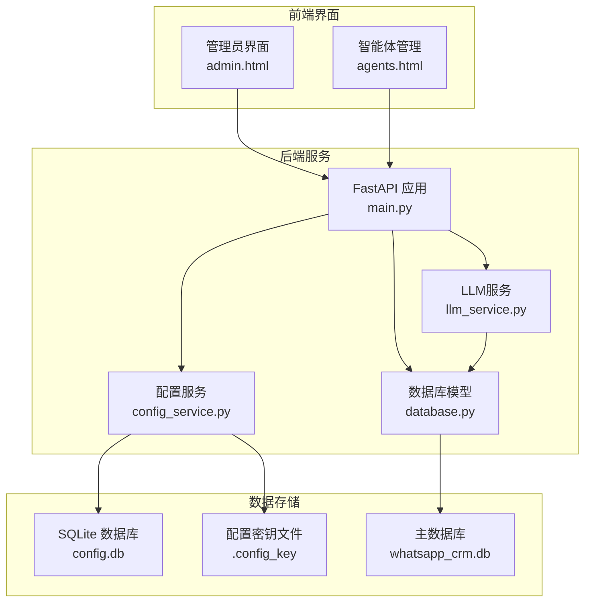
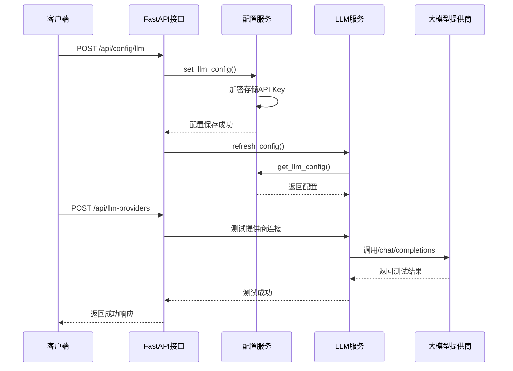
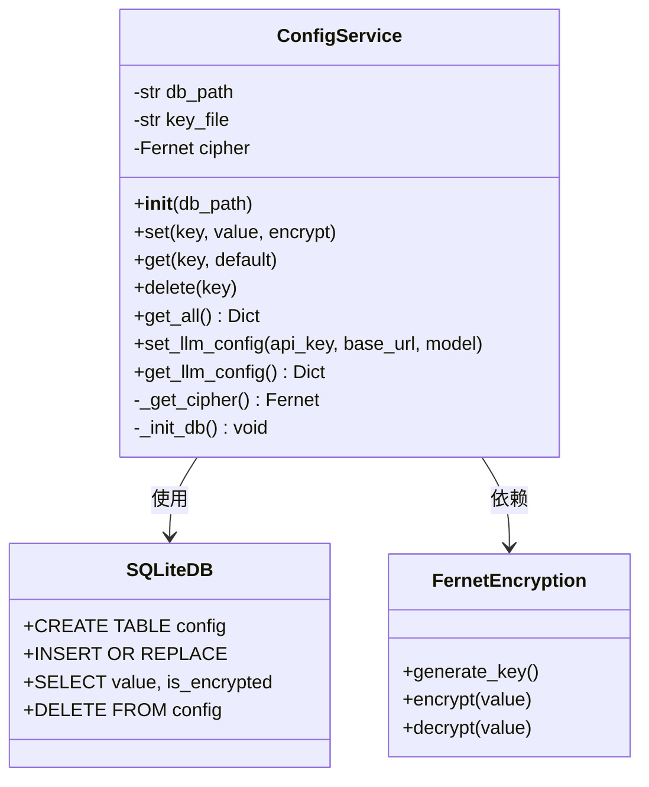
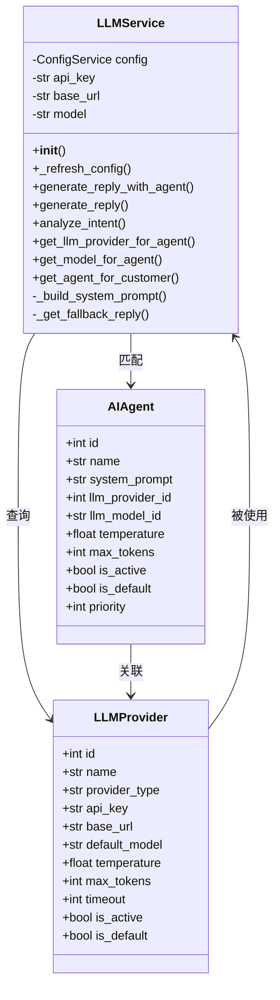
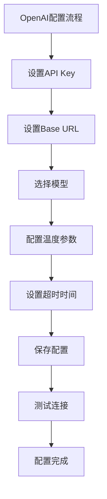
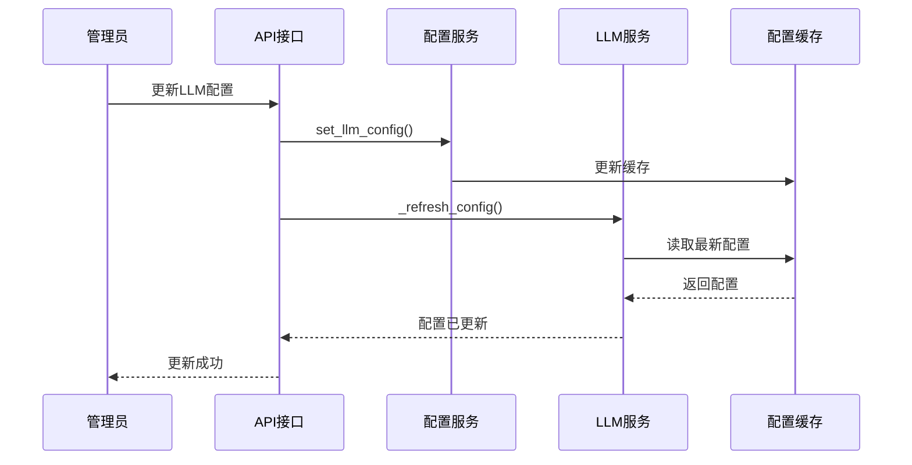

# 大语言模型提供商配置

<cite>
**本文档引用的文件**
- [config_service.py](file://backend/config_service.py)
- [llm_service.py](file://backend/llm_service.py)
- [main.py](file://backend/main.py)
- [database.py](file://backend/database.py)
- [.config_key](file://backend/data/.config_key)
- [requirements.txt](file://backend/requirements.txt)
</cite>

## 更新摘要
**变更内容**
- 更新了配置优先级系统，现在优先使用数据库存储的Provider配置
- 增强了配置管理的可靠性和用户友好性
- 完善了配置回退机制和错误处理
- 优化了配置刷新和热重载机制

## 目录
1. [简介](#简介)
2. [项目结构](#项目结构)
3. [核心组件](#核心组件)
4. [架构概览](#架构概览)
5. [详细组件分析](#详细组件分析)
6. [配置参数详解](#配置参数详解)
7. [提供商配置示例](#提供商配置示例)
8. [最佳实践](#最佳实践)
9. [动态更新与热重载](#动态更新与热重载)
10. [故障排除指南](#故障排除指南)
11. [性能考虑](#性能考虑)
12. [总结](#总结)

## 简介

本文件详细说明了WhatsApp智能客户系统中大语言模型提供商的配置和管理机制。该系统支持多种主流大语言模型提供商，包括OpenAI、Claude、DeepSeek等，提供了安全的API密钥存储、灵活的配置管理、智能体级别的模型选择以及动态更新功能。

系统采用分层架构设计，通过配置服务统一管理敏感信息，通过LLM服务处理模型调用，通过数据库持久化提供商配置，通过FastAPI提供RESTful API接口。**最新版本实现了数据库Provider配置优先级系统，现在优先使用数据库存储的Provider配置而非环境变量设置，增强了配置管理的可靠性和用户友好性。**

## 项目结构



**图表来源**
- [main.py:128-134](file://backend/main.py#L128-L134)
- [config_service.py:14-22](file://backend/config_service.py#L14-L22)
- [database.py:10-20](file://backend/database.py#L10-L20)

**章节来源**
- [main.py:128-134](file://backend/main.py#L128-L134)
- [config_service.py:14-22](file://backend/config_service.py#L14-L22)
- [database.py:10-20](file://backend/database.py#L10-L20)

## 核心组件

系统的核心组件包括：

### 1. 配置服务 (ConfigService)
负责安全存储和管理敏感配置信息，包括API密钥的加密存储和管理。

### 2. LLM服务 (LLMService)
**更新**：处理大语言模型的调用逻辑，支持多提供商配置、智能体级别配置和动态参数调整。现在实现了数据库Provider配置优先级系统，优先使用数据库存储的Provider配置而非环境变量设置。

### 3. 数据库模型
定义了LLM提供商、AI智能体等核心数据结构，支持复杂的配置层次。

### 4. FastAPI API接口
提供RESTful API用于配置管理、提供商测试和智能体管理。

**章节来源**
- [config_service.py:11-153](file://backend/config_service.py#L11-L153)
- [llm_service.py:11-286](file://backend/llm_service.py#L11-L286)
- [database.py:211-227](file://backend/database.py#L211-L227)

## 架构概览



**图表来源**
- [main.py:988-1002](file://backend/main.py#L988-L1002)
- [config_service.py:128-140](file://backend/config_service.py#L128-L140)
- [llm_service.py:149-175](file://backend/llm_service.py#L149-L175)

## 详细组件分析

### 配置服务架构



**图表来源**
- [config_service.py:11-153](file://backend/config_service.py#L11-L153)

### LLM服务架构



**图表来源**
- [llm_service.py:11-286](file://backend/llm_service.py#L11-L286)
- [database.py:211-227](file://backend/database.py#L211-L227)
- [database.py:155-181](file://backend/database.py#L155-L181)

**章节来源**
- [config_service.py:11-153](file://backend/config_service.py#L11-L153)
- [llm_service.py:11-286](file://backend/llm_service.py#L11-L286)
- [database.py:211-227](file://backend/database.py#L211-L227)

## 配置参数详解

### 基础配置参数

| 参数名 | 类型 | 默认值 | 描述 | 必填 |
|--------|------|--------|------|------|
| api_key | 字符串 | 空字符串 | 大语言模型提供商的API密钥 | 是 |
| base_url | 字符串 | https://api.openai.com/v1 | API基础URL地址 | 否 |
| model | 字符串 | gpt-3.5-turbo | 默认使用的模型名称 | 否 |

### 提供商配置参数

| 参数名 | 类型 | 默认值 | 描述 | 必填 |
|--------|------|--------|------|------|
| name | 字符串 | 无 | 提供商显示名称 | 是 |
| provider_type | 字符串 | 无 | 提供商类型(openai/deepseek/claude) | 是 |
| api_key | 字符串 | 无 | API密钥 | 是 |
| base_url | 字符串 | 无 | API基础URL | 否 |
| default_model | 字符串 | 无 | 默认模型名称 | 是 |
| temperature | 浮点数 | 0.7 | 采样温度(0-1) | 否 |
| max_tokens | 整数 | 500 | 最大生成token数 | 否 |
| timeout | 整数 | 30 | 请求超时时间(秒) | 否 |
| is_default | 布尔值 | false | 是否为默认提供商 | 否 |

### 配置优先级系统

**更新**：系统现在实现了三层配置优先级系统：

1. **数据库Provider配置**（最高优先级）
   - 从LLMProvider表查询默认激活的提供商
   - 优先使用数据库中存储的配置
   - 支持多提供商管理和智能体级别配置

2. **旧版配置**（中间优先级）
   - 使用ConfigService中的llm_*配置
   - 通过API接口设置和管理
   - 支持API Key加密存储

3. **环境变量配置**（最低优先级）
   - OPENAI_API_KEY, OPENAI_BASE_URL, LLM_MODEL
   - 仅作为回退机制使用
   - 便于容器化部署和快速配置

**章节来源**
- [config_service.py:134-140](file://backend/config_service.py#L134-L140)
- [database.py:211-227](file://backend/database.py#L211-L227)
- [llm_service.py:18-24](file://backend/llm_service.py#L18-L24)
- [llm_service.py:43-72](file://backend/llm_service.py#L43-L72)

## 提供商配置示例

### OpenAI配置示例



**图表来源**
- [main.py:988-1002](file://backend/main.py#L988-L1002)
- [main.py:1585-1614](file://backend/main.py#L1585-L1614)

### DeepSeek配置示例

| 配置项 | 示例值 | 说明 |
|--------|--------|------|
| name | DeepSeek官方 | 提供商显示名称 |
| provider_type | deepseek | 提供商类型 |
| api_key | sk-... | DeepSeek API密钥 |
| base_url | https://api.deepseek.com/v1 | DeepSeek API基础URL |
| default_model | deepseek-chat | DeepSeek默认模型 |
| temperature | 0.7 | 采样温度 |
| max_tokens | 500 | 最大token数 |
| timeout | 30 | 超时时间(秒) |

### Claude配置示例

| 配置项 | 示例值 | 说明 |
|--------|--------|------|
| name | Anthropic官方 | 提供商显示名称 |
| provider_type | claude | 提供商类型 |
| api_key | sk-ant-... | Claude API密钥 |
| base_url | https://api.anthropic.com/v1 | Claude API基础URL |
| default_model | claude-3-haiku-20240307 | Claude默认模型 |
| temperature | 0.7 | 采样温度 |
| max_tokens | 500 | 最大token数 |
| timeout | 30 | 超时时间(秒) |

**章节来源**
- [main.py:1470-1491](file://backend/main.py#L1470-L1491)
- [main.py:1516-1538](file://backend/main.py#L1516-L1538)

## 最佳实践

### 安全存储最佳实践

1. **API密钥加密存储**
   - 使用Fernet对称加密算法
   - 密钥文件权限设置为0600
   - 敏感信息在UI中隐藏显示

2. **配置管理策略**
   - **优先使用数据库配置**而非环境变量
   - 定期轮换API密钥
   - 分离不同环境的配置
   - 使用智能体级别配置实现精细化管理

3. **提供商选择策略**
   - 生产环境使用付费提供商
   - 开发环境使用免费额度
   - 建立多个提供商备份
   - 实现自动故障转移机制

### 性能优化建议

1. **连接池管理**
   - 使用异步HTTP客户端
   - 合理设置超时时间
   - 实现重试机制

2. **缓存策略**
   - 缓存常用配置
   - 实现配置热更新
   - 监控API使用情况

3. **错误处理**
   - 实现优雅降级
   - 提供默认回复机制
   - 记录详细的日志信息

**章节来源**
- [config_service.py:24-36](file://backend/config_service.py#L24-L36)
- [llm_service.py:149-175](file://backend/llm_service.py#L149-L175)

## 动态更新与热重载

### 配置更新流程



**图表来源**
- [main.py:988-1002](file://backend/main.py#L988-L1002)
- [config_service.py:56-71](file://backend/config_service.py#L56-L71)

### 热重载机制

1. **实时配置更新**
   - POST /api/config/llm 接口支持实时更新
   - 自动触发LLM服务配置刷新
   - 无需重启服务即可生效

2. **智能体级别配置**
   - 支持每个智能体独立配置
   - 优先级：智能体配置 > 提供商配置 > 系统默认
   - 动态切换不同提供商

3. **配置验证**
   - 提供商连接测试接口
   - 配置有效性检查
   - 错误信息反馈

**章节来源**
- [main.py:988-1002](file://backend/main.py#L988-L1002)
- [main.py:1585-1614](file://backend/main.py#L1585-L1614)

## 故障排除指南

### 常见问题及解决方案

#### API密钥无效

**症状表现**：
- LLM API返回401 Unauthorized
- 日志显示认证失败
- 系统返回默认回复

**解决步骤**：
1. 验证API密钥格式正确
2. 检查密钥是否过期
3. 确认密钥权限范围
4. 重新设置配置并测试

#### 网络连接问题

**症状表现**：
- 请求超时异常
- 连接被拒绝
- DNS解析失败

**解决步骤**：
1. 检查网络连通性
2. 验证Base URL格式
3. 测试防火墙设置
4. 尝试代理服务器

#### 模型不可用

**症状表现**：
- 404 Not Found错误
- 模型名称无效
- API返回模型不存在

**解决步骤**：
1. 验证模型名称正确性
2. 检查提供商支持的模型列表
3. 确认账户有相应权限
4. 使用默认模型进行测试

### 配置优先级问题

**更新**：如果配置不生效，检查配置优先级：

1. **检查数据库Provider配置**
   - 确认LLMProvider表中有激活的默认提供商
   - 验证提供商状态为is_active=True
   - 检查is_default=True设置

2. **检查旧版配置**
   - 通过GET /api/config/llm确认配置状态
   - 验证API Key是否正确存储

3. **检查环境变量**
   - 确认环境变量不会覆盖数据库配置
   - 验证环境变量格式正确

### 调试工具

1. **提供商测试接口**
   ```bash
   POST /api/llm-providers/{provider_id}/test
   ```

2. **配置状态检查**
   ```bash
   GET /api/config/llm
   ```

3. **日志监控**
   - 查看LLM调用日志
   - 监控API使用统计
   - 记录错误详情

**章节来源**
- [main.py:1585-1614](file://backend/main.py#L1585-L1614)
- [llm_service.py:173-175](file://backend/llm_service.py#L173-L175)

## 性能考虑

### 成本优化策略

1. **模型选择优化**
   - 低成本场景使用较小模型
   - 高精度场景使用较大模型
   - 建立模型性能基准

2. **请求优化**
   - 合理设置max_tokens
   - 控制对话历史长度
   - 实现智能缓存策略

3. **并发控制**
   - 限制并发请求数量
   - 实现请求队列管理
   - 监控API配额使用

### 性能监控指标

| 指标类型 | 目标值 | 监控方式 |
|----------|--------|----------|
| 响应时间 | <2秒 | 异步客户端监控 |
| 成功率 | >95% | 错误率统计 |
| 成本 | 控制在预算内 | API使用计费 |
| 可用性 | >99% | 系统可用性监控 |

## 总结

本系统提供了完整的大语言模型提供商配置解决方案，具有以下特点：

1. **安全性**：采用Fernet加密存储API密钥，支持密钥文件权限控制
2. **灵活性**：支持多提供商配置，智能体级别定制化
3. **易用性**：提供RESTful API和Web界面管理
4. **可靠性**：实现连接测试、错误处理和降级机制
5. **可扩展性**：支持动态配置更新和热重载
6. **优先级系统**：**新增**数据库Provider配置优先级系统，增强配置管理的可靠性和用户友好性

**最新版本的配置优先级系统确保了配置的一致性和可靠性**，通过数据库存储的Provider配置作为最高优先级，配合旧版配置和环境变量的回退机制，为不同部署场景提供了灵活的配置管理方案。通过合理的配置管理和最佳实践，可以有效提升系统的性能和稳定性，满足不同规模和需求的WhatsApp智能客户管理场景。