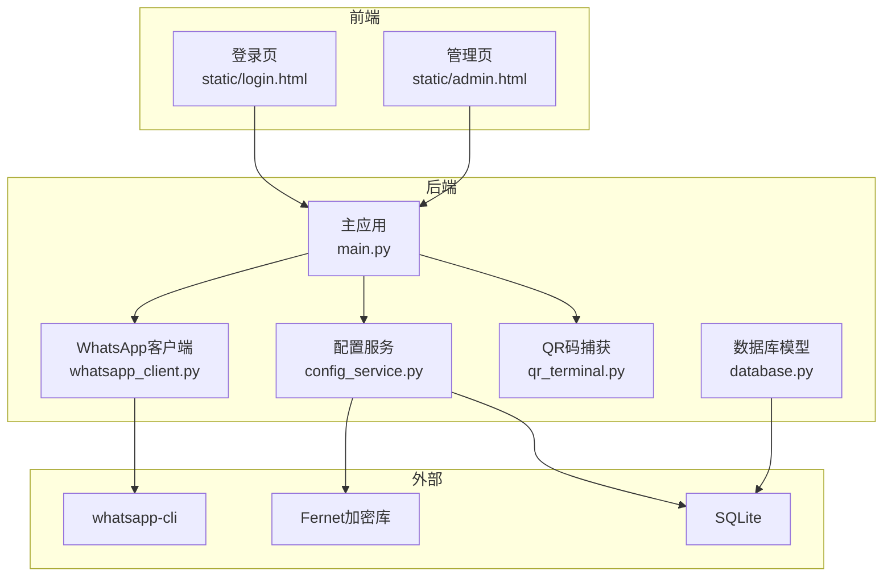
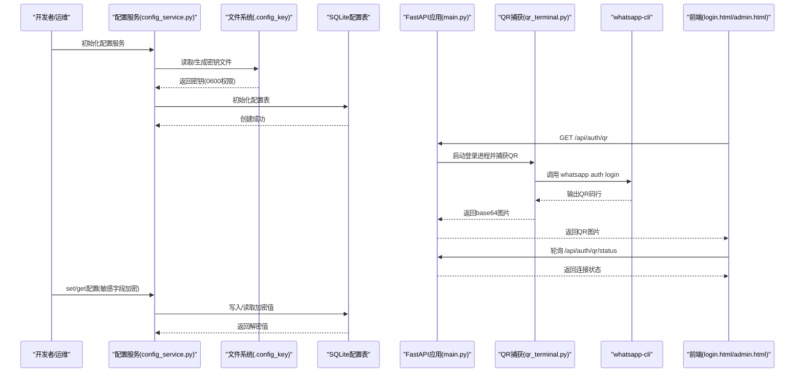
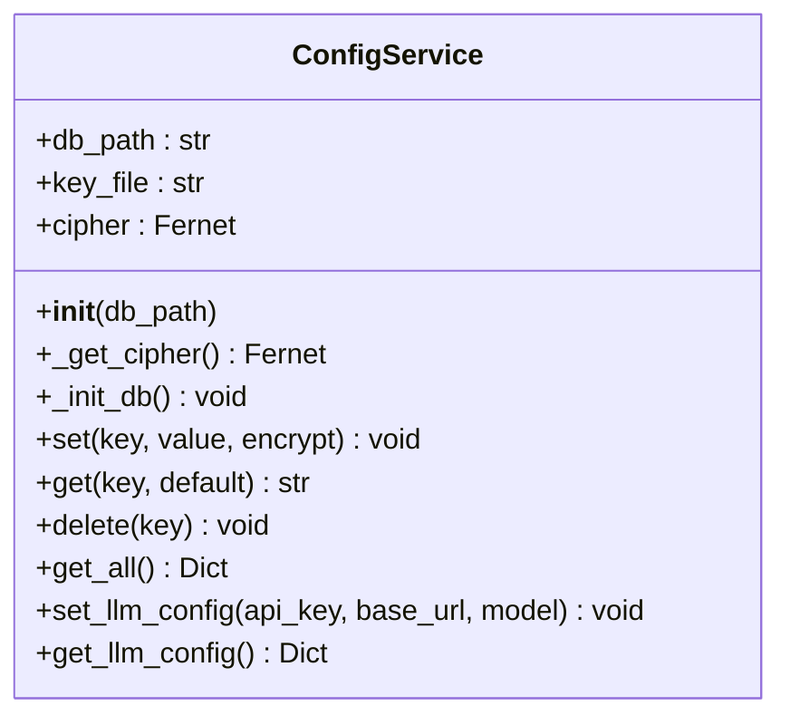
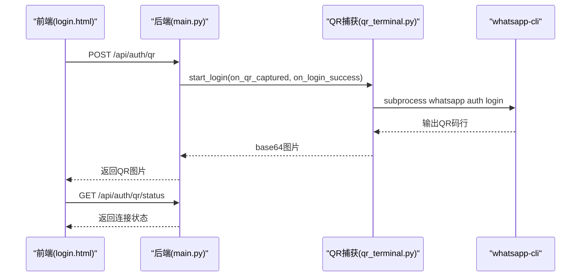
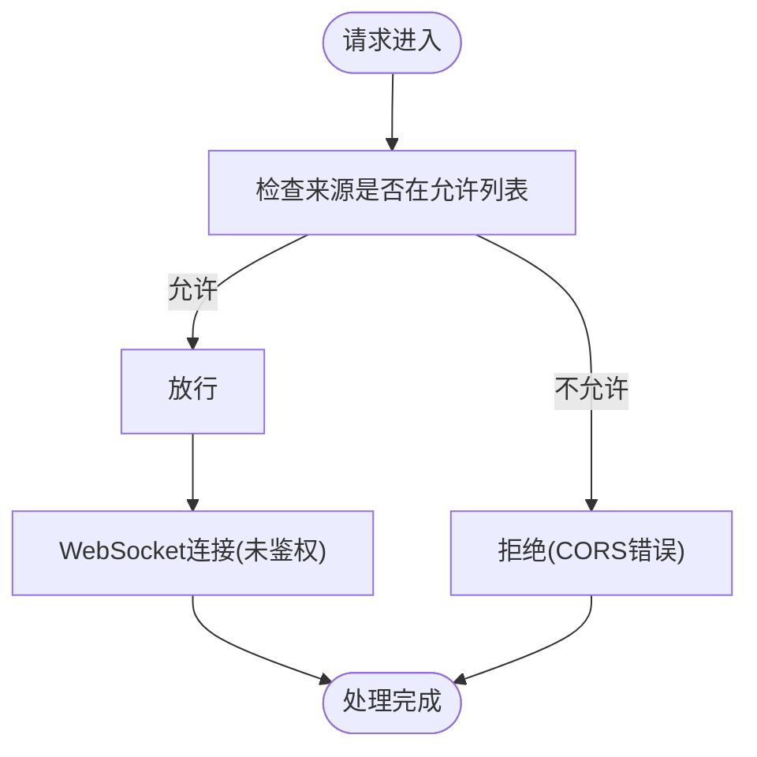
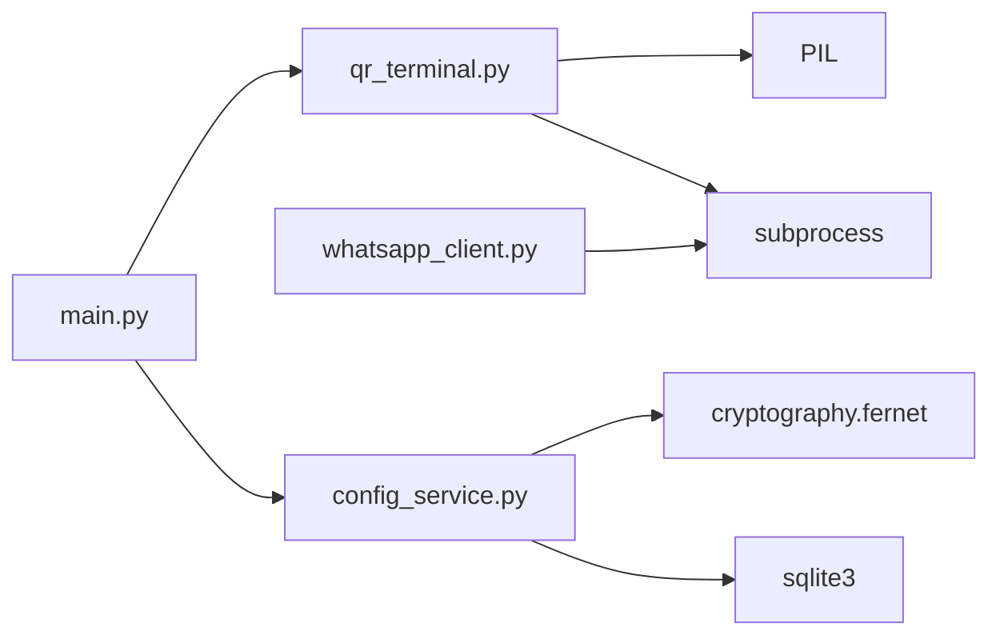

# 安全配置

<cite>
**本文引用的文件**
- [backend/data/.config_key](file://backend/data/.config_key)
- [backend/config_service.py](file://backend/config_service.py)
- [backend/main.py](file://backend/main.py)
- [backend/whatsapp_client.py](file://backend/whatsapp_client.py)
- [backend/qr_terminal.py](file://backend/qr_terminal.py)
- [backend/database.py](file://backend/database.py)
- [login_whatsapp.py](file://login_whatsapp.py)
- [bot.py](file://bot.py)
- [backend/static/admin.html](file://backend/static/admin.html)
- [backend/static/login.html](file://backend/static/login.html)
</cite>

## 目录
1. [简介](#简介)
2. [项目结构与安全相关模块](#项目结构与安全相关模块)
3. [核心安全组件](#核心安全组件)
4. [架构总览](#架构总览)
5. [详细组件分析](#详细组件分析)
6. [依赖关系分析](#依赖关系分析)
7. [性能与安全权衡](#性能与安全权衡)
8. [故障排查指南](#故障排查指南)
9. [结论](#结论)
10. [附录：最佳实践与合规指引](#附录最佳实践与合规指引)

## 简介
本文件聚焦于该WhatsApp机器人系统的“安全配置”，围绕敏感信息的加密存储、密钥管理、配置文件权限控制、传输与访问控制等关键要素展开。文档同时提供验证方法、常见风险与防范、应急响应与恢复策略，以及合规性指导，帮助开发者与运维人员建立可落地的安全基线。

## 项目结构与安全相关模块
- 配置与密钥管理：通过独立的加密密钥文件与SQLite配置表实现敏感信息的加密存储与访问控制。
- 登录与认证：通过CLI工具与终端QR码捕获流程完成登录，前端页面提供状态展示与交互。
- 传输与访问控制：后端API采用CORS中间件，WebSocket用于实时通信；前端页面通过HTTP请求与后端交互。
- 数据库：SQLite用于本地存储，支持敏感字段的加密存储与非敏感字段的明文存储。

图表来源
- [backend/config_service.py:11-153](file://backend/config_service.py#L11-L153)
- [backend/main.py:129-157](file://backend/main.py#L129-L157)
- [backend/whatsapp_client.py:13-173](file://backend/whatsapp_client.py#L13-L173)
- [backend/qr_terminal.py:14-297](file://backend/qr_terminal.py#L14-L297)
- [backend/database.py:10-297](file://backend/database.py#L10-L297)
- [backend/static/login.html:349-542](file://backend/static/login.html#L349-L542)
- [backend/static/admin.html:398-433](file://backend/static/admin.html#L398-L433)

章节来源
- [backend/config_service.py:11-153](file://backend/config_service.py#L11-L153)
- [backend/main.py:129-157](file://backend/main.py#L129-L157)
- [backend/whatsapp_client.py:13-173](file://backend/whatsapp_client.py#L13-L173)
- [backend/qr_terminal.py:14-297](file://backend/qr_terminal.py#L14-L297)
- [backend/database.py:10-297](file://backend/database.py#L10-L297)
- [backend/static/login.html:349-542](file://backend/static/login.html#L349-L542)
- [backend/static/admin.html:398-433](file://backend/static/admin.html#L398-L433)

## 核心安全组件
- 加密密钥与配置存储
  - 加密密钥文件：位于数据目录，首次运行自动生成，随后每次启动读取并设置严格权限（0600）。
  - 配置表：SQLite数据库中存储键值对，敏感字段加密存储，非敏感字段明文存储。
- 登录与认证
  - CLI工具与QR码流程：通过终端捕获QR码并转换为图片，前端展示并轮询状态。
  - 登录状态检查：后端提供状态接口，前端轮询刷新UI状态。
- 传输与访问控制
  - CORS中间件：允许跨域请求，默认允许所有来源（生产环境建议收紧）。
  - WebSocket：用于实时消息推送，未见鉴权与速率限制。
- 数据库与文件权限
  - SQLite数据库文件与数据目录的权限控制依赖部署环境；配置密钥文件权限严格（0600）。

章节来源
- [backend/config_service.py:18-36](file://backend/config_service.py#L18-L36)
- [backend/config_service.py:43-51](file://backend/config_service.py#L43-L51)
- [backend/main.py:150-157](file://backend/main.py#L150-L157)
- [backend/qr_terminal.py:14-297](file://backend/qr_terminal.py#L14-L297)
- [backend/static/login.html:349-542](file://backend/static/login.html#L349-L542)

## 架构总览
下图展示了安全配置相关组件之间的交互关系，重点体现“密钥生成与加载”“配置加密存储”“登录认证流程”“CORS与WebSocket访问控制”。

图表来源
- [backend/config_service.py:18-36](file://backend/config_service.py#L18-L36)
- [backend/config_service.py:43-51](file://backend/config_service.py#L43-L51)
- [backend/main.py:221-352](file://backend/main.py#L221-L352)
- [backend/qr_terminal.py:24-140](file://backend/qr_terminal.py#L24-L140)
- [backend/whatsapp_client.py:82-92](file://backend/whatsapp_client.py#L82-L92)
- [backend/static/login.html:396-525](file://backend/static/login.html#L396-L525)

## 详细组件分析

### 配置服务与密钥管理
- 密钥生成与加载
  - 首次运行自动生成密钥并写入数据目录的密钥文件，随后每次启动读取密钥。
  - 密钥文件权限严格设置为0600，仅允许所有者读写。
- 配置表设计
  - 表包含键、值、是否加密标志、创建与更新时间戳。
  - set/get接口支持加密开关，敏感字段默认加密存储。
- LLM配置便捷接口
  - 提供设置与获取LLM配置的方法，便于集中管理API Key与基础URL。

图表来源
- [backend/config_service.py:11-153](file://backend/config_service.py#L11-L153)

章节来源
- [backend/config_service.py:18-36](file://backend/config_service.py#L18-L36)
- [backend/config_service.py:43-51](file://backend/config_service.py#L43-L51)
- [backend/config_service.py:56-95](file://backend/config_service.py#L56-L95)
- [backend/config_service.py:128-140](file://backend/config_service.py#L128-L140)

### 登录与QR码捕获流程
- CLI集成
  - 通过子进程调用whatsapp-cli执行登录、状态查询、登出等操作。
- QR码捕获
  - 终端输出中识别QR码ASCII图案，转换为base64 PNG图片供前端展示。
  - 支持超时终止与进程监控，避免僵尸进程。
- 前端交互
  - 登录页通过API获取QR码并轮询状态，成功后引导进入系统。

图表来源
- [backend/main.py:221-352](file://backend/main.py#L221-L352)
- [backend/qr_terminal.py:24-140](file://backend/qr_terminal.py#L24-L140)
- [backend/whatsapp_client.py:82-92](file://backend/whatsapp_client.py#L82-L92)
- [backend/static/login.html:396-525](file://backend/static/login.html#L396-L525)

章节来源
- [backend/qr_terminal.py:14-297](file://backend/qr_terminal.py#L14-L297)
- [backend/main.py:221-352](file://backend/main.py#L221-L352)
- [backend/static/login.html:349-542](file://backend/static/login.html#L349-L542)

### CORS与WebSocket访问控制
- CORS中间件
  - 默认允许所有来源、方法与头，生产环境应限制允许域名与方法。
- WebSocket
  - 未见鉴权与速率限制，建议在生产环境增加鉴权与限流策略。

图表来源
- [backend/main.py:150-157](file://backend/main.py#L150-L157)
- [backend/main.py:162-176](file://backend/main.py#L162-L176)

章节来源
- [backend/main.py:150-157](file://backend/main.py#L150-L157)
- [backend/main.py:162-176](file://backend/main.py#L162-L176)

### 数据库与敏感字段
- 数据库模型
  - 使用SQLAlchemy定义模型，包含客户、消息、会话、智能体、提供商等。
- 敏感字段
  - LLM提供商表包含API Key字段，建议在管理界面中以密码输入方式提交，并在存储时加密。
  - 配置服务可作为统一入口，对敏感字段进行加密存储。

章节来源
- [backend/database.py:211-244](file://backend/database.py#L211-L244)
- [backend/config_service.py:56-95](file://backend/config_service.py#L56-L95)

## 依赖关系分析
- 配置服务依赖
  - cryptography.fernet：用于对称加密与解密。
  - sqlite3：用于持久化配置。
- 登录流程依赖
  - subprocess：调用whatsapp-cli。
  - PIL：将ASCII QR码转换为图片。
- 前端依赖
  - 通过HTTP与WebSocket与后端交互，未发现第三方鉴权库。

图表来源
- [backend/config_service.py:8](file://backend/config_service.py#L8)
- [backend/qr_terminal.py:11](file://backend/qr_terminal.py#L11)
- [backend/whatsapp_client.py:5](file://backend/whatsapp_client.py#L5)
- [backend/main.py:129-157](file://backend/main.py#L129-L157)

章节来源
- [backend/config_service.py:8](file://backend/config_service.py#L8)
- [backend/qr_terminal.py:11](file://backend/qr_terminal.py#L11)
- [backend/whatsapp_client.py:5](file://backend/whatsapp_client.py#L5)
- [backend/main.py:129-157](file://backend/main.py#L129-L157)

## 性能与安全权衡
- 加密成本
  - 对敏感配置进行加解密会带来CPU开销，建议在高频读取场景下缓存解密后的值。
- 文件权限
  - 密钥文件权限0600有效降低泄露风险，但需确保部署环境一致。
- CORS宽松策略
  - 默认允许所有来源可能带来跨域风险，建议在生产环境限制来源与方法。
- WebSocket未鉴权
  - 建议增加鉴权与速率限制，避免滥用与DDoS。

[本节为通用建议，无需特定文件引用]

## 故障排查指南
- 密钥文件权限异常
  - 现象：启动时报错无法读取密钥或权限不足。
  - 处理：确认密钥文件权限为0600，属主为运行用户。
- 配置读取失败
  - 现象：get接口返回默认值或None。
  - 处理：检查配置表是否存在、is_encrypted标志是否正确、密钥是否匹配。
- 登录QR码不显示
  - 现象：前端未显示QR图片。
  - 处理：检查后端QR捕获线程是否正常、CLI输出是否包含QR码行、COLUMNS环境变量是否设置足够宽。
- CORS跨域失败
  - 现象：浏览器报跨域错误。
  - 处理：调整CORS允许来源与方法，生产环境禁止使用通配符。
- WebSocket连接失败
  - 现象：前端无法接收实时消息。
  - 处理：检查后端WebSocket路由与网络连通性，必要时增加鉴权与限流。

章节来源
- [backend/config_service.py:26-36](file://backend/config_service.py#L26-L36)
- [backend/config_service.py:72-95](file://backend/config_service.py#L72-L95)
- [backend/qr_terminal.py:81-140](file://backend/qr_terminal.py#L81-L140)
- [backend/main.py:150-157](file://backend/main.py#L150-L157)
- [backend/main.py:162-176](file://backend/main.py#L162-L176)

## 结论
该系统在“敏感信息加密存储”方面具备良好基础：密钥文件权限严格、配置表支持加密存储。但在“传输与访问控制”方面仍需加强，如收紧CORS策略、为WebSocket增加鉴权与限流。建议在生产环境中补充审计日志、最小权限原则与密钥轮换策略，并完善应急响应与恢复流程。

[本节为总结，无需特定文件引用]

## 附录：最佳实践与合规指引

### 最小权限原则
- 文件与目录
  - 密钥文件权限：0600；数据库文件与日志目录仅允许运行用户访问。
- 进程与网络
  - 仅暴露必要端口；限制来源IP与域名；禁用不必要的服务与调试接口。

章节来源
- [backend/config_service.py:33-34](file://backend/config_service.py#L33-L34)

### 密钥轮换与备份
- 轮换策略
  - 定期更换加密密钥与API Key；更换后逐步迁移配置，验证解密可用性。
- 备份与恢复
  - 备份密钥文件与配置表；恢复时先验证密钥与数据库完整性。

章节来源
- [backend/config_service.py:18-36](file://backend/config_service.py#L18-L36)
- [backend/config_service.py:56-95](file://backend/config_service.py#L56-L95)

### 审计日志与监控
- 建议
  - 记录配置变更、登录状态变化、WebSocket连接与异常事件；设置告警阈值。
- 实施
  - 在配置服务set/get前后记录关键字段摘要；在登录流程中记录QR码捕获与登录成功事件。

章节来源
- [backend/config_service.py:56-95](file://backend/config_service.py#L56-L95)
- [backend/qr_terminal.py:145-166](file://backend/qr_terminal.py#L145-L166)

### 传输加密与访问控制
- 传输加密
  - 建议在生产环境启用HTTPS与TLS；WebSocket使用wss。
- 访问控制
  - 为管理页面与敏感API增加鉴权与限流；CORS仅允许受信来源。

章节来源
- [backend/main.py:150-157](file://backend/main.py#L150-L157)
- [backend/main.py:162-176](file://backend/main.py#L162-L176)

### 安全验证清单
- 配置验证
  - 密钥文件权限：0600；配置表存在且可读写；敏感字段可解密。
- 登录验证
  - QR码捕获成功；CLI可执行；状态轮询正常。
- 传输验证
  - CORS策略符合预期；WebSocket连接稳定。

章节来源
- [backend/config_service.py:26-36](file://backend/config_service.py#L26-L36)
- [backend/qr_terminal.py:145-166](file://backend/qr_terminal.py#L145-L166)
- [backend/main.py:150-157](file://backend/main.py#L150-L157)

### 应急响应与恢复策略
- 应急响应
  - 快速隔离受影响的服务；冻结API Key与密钥；回滚可疑配置。
- 恢复策略
  - 从备份恢复密钥与配置表；验证解密与业务功能；持续监控异常。

章节来源
- [backend/config_service.py:18-36](file://backend/config_service.py#L18-L36)
- [backend/config_service.py:56-95](file://backend/config_service.py#L56-L95)

### 合规性指导
- 数据保护法规
  - 若涉及个人数据，应遵循数据最小化、目的限制、透明度与安全存储等原则。
- 实施建议
  - 对个人数据字段进行加密存储；提供数据主体访问与删除能力；记录数据处理活动。

章节来源
- [backend/database.py:211-244](file://backend/database.py#L211-L244)
- [backend/config_service.py:56-95](file://backend/config_service.py#L56-L95)