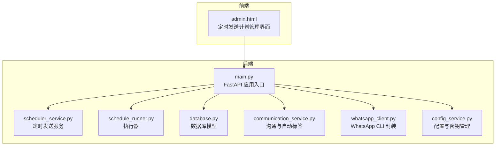
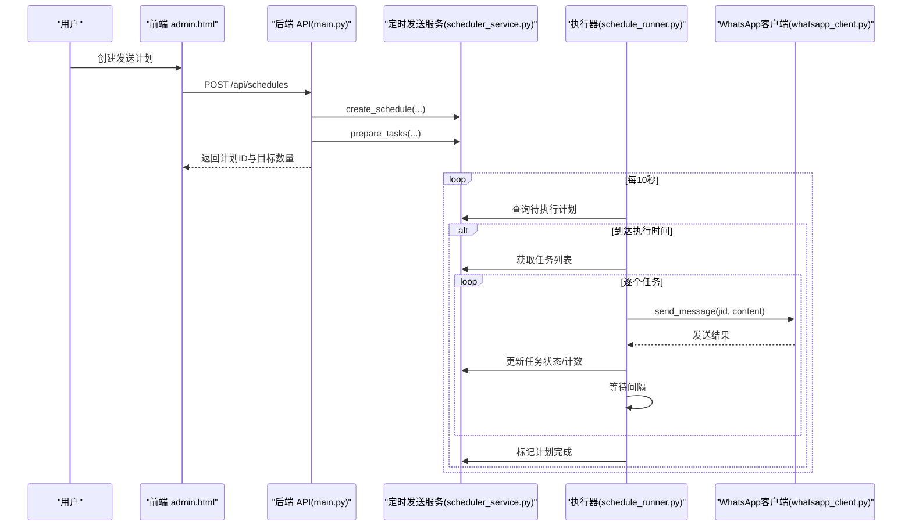
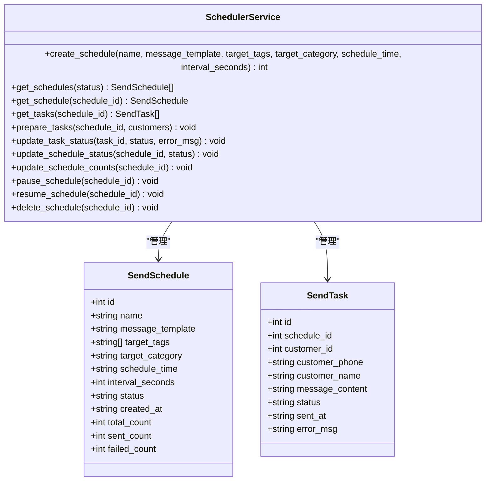
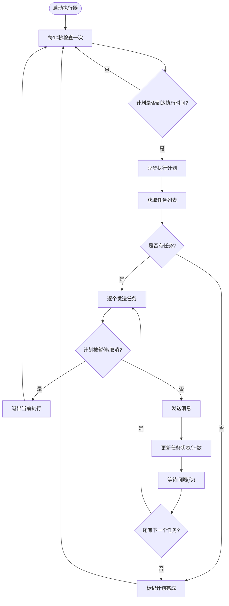
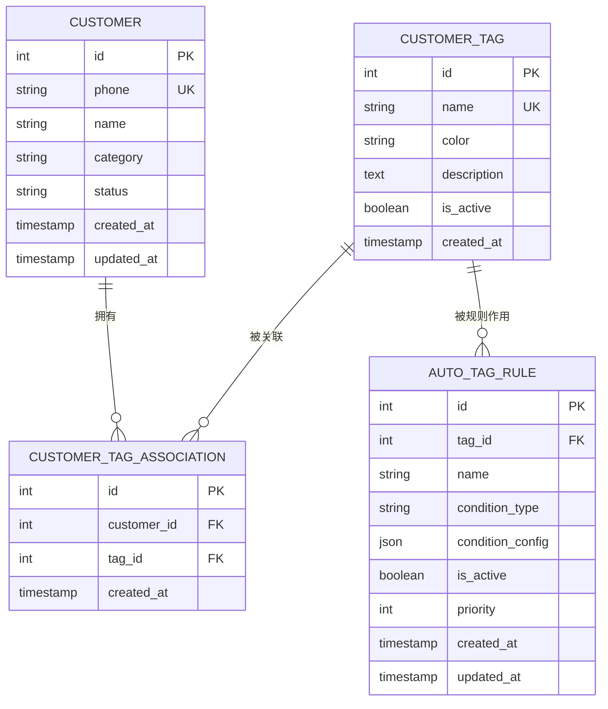
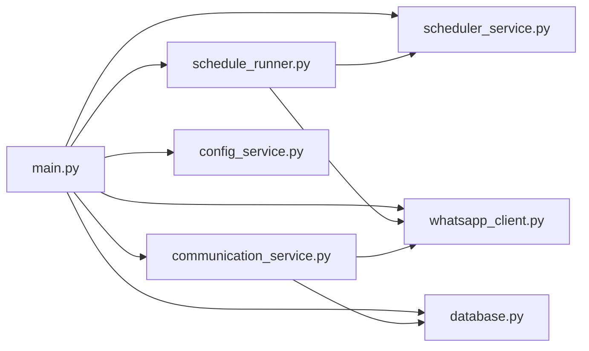

# 定时发送配置

<cite>
**本文档引用的文件**
- [main.py](file://backend/main.py)
- [scheduler_service.py](file://backend/scheduler_service.py)
- [schedule_runner.py](file://backend/schedule_runner.py)
- [database.py](file://backend/database.py)
- [communication_service.py](file://backend/communication_service.py)
- [whatsapp_client.py](file://backend/whatsapp_client.py)
- [config_service.py](file://backend/config_service.py)
- [admin.html](file://backend/static/admin.html)
</cite>

## 目录
1. [简介](#简介)
2. [项目结构](#项目结构)
3. [核心组件](#核心组件)
4. [架构总览](#架构总览)
5. [详细组件分析](#详细组件分析)
6. [依赖关系分析](#依赖关系分析)
7. [性能考量](#性能考量)
8. [故障排除指南](#故障排除指南)
9. [结论](#结论)
10. [附录](#附录)

## 简介
本文件面向“定时发送配置”的全面文档，围绕营销自动化与定时发送功能展开，涵盖发送计划的创建、时间调度规则、目标客户筛选条件、定时任务类型与应用场景、调度算法配置选项、与客户标签系统的集成、监控与统计指标，以及配置示例与最佳实践、故障排除指南。系统基于FastAPI构建，结合SQLite数据库与WhatsApp CLI，提供从计划创建到执行、暂停、恢复、删除的完整生命周期管理，并通过Web界面提供可视化操作入口。

## 项目结构
- 后端采用模块化设计，核心模块包括：定时发送服务、执行器、数据库模型、通信服务、WhatsApp客户端、配置服务、主应用入口。
- 前端静态页面提供定时发送计划的可视化管理界面，便于创建、执行、暂停、恢复与删除计划。

图表来源
- [main.py:128-134](file://backend/main.py#L128-L134)
- [scheduler_service.py:54-63](file://backend/scheduler_service.py#L54-L63)
- [schedule_runner.py:12-20](file://backend/schedule_runner.py#L12-L20)
- [database.py:23-297](file://backend/database.py#L23-L297)
- [communication_service.py:17-46](file://backend/communication_service.py#L17-L46)
- [whatsapp_client.py:13-26](file://backend/whatsapp_client.py#L13-L26)
- [config_service.py:11-23](file://backend/config_service.py#L11-L23)
- [admin.html:1180-1301](file://backend/static/admin.html#L1180-L1301)

章节来源
- [main.py:128-134](file://backend/main.py#L128-L134)
- [admin.html:1180-1301](file://backend/static/admin.html#L1180-L1301)

## 核心组件
- 定时发送服务：负责计划的创建、查询、暂停/恢复、删除、任务准备与状态更新；使用SQLite存储计划与任务。
- 执行器：后台循环检查到期计划并逐个发送消息，支持间隔控制与失败重试策略。
- 数据库模型：定义客户、消息、会话、标签、自动标签规则等模型，支撑目标筛选与统计。
- 通信服务：处理自动回复、转人工、自动打标签等业务逻辑，与定时发送协同工作。
- WhatsApp客户端：封装WhatsApp CLI命令，负责消息发送与JID处理。
- 配置服务：安全存储敏感配置（如API Key），支持加解密。
- 主应用：提供定时发送计划的REST API与WebSocket实时通信。

章节来源
- [scheduler_service.py:54-392](file://backend/scheduler_service.py#L54-L392)
- [schedule_runner.py:12-142](file://backend/schedule_runner.py#L12-L142)
- [database.py:23-297](file://backend/database.py#L23-L297)
- [communication_service.py:17-512](file://backend/communication_service.py#L17-L512)
- [whatsapp_client.py:13-437](file://backend/whatsapp_client.py#L13-L437)
- [config_service.py:11-153](file://backend/config_service.py#L11-L153)
- [main.py:1015-1163](file://backend/main.py#L1015-L1163)

## 架构总览
定时发送功能的端到端流程如下：
- 用户在前端界面创建发送计划，填写计划名称、消息模板、目标分类、执行时间、发送间隔等。
- 后端API接收请求，创建计划并准备任务（按目标分类筛选客户，生成个性化消息模板任务）。
- 执行器周期性检查计划状态与执行时间，逐个发送消息，更新任务与计划状态。
- WhatsApp客户端负责实际消息发送，处理JID格式与异常。
- 通信服务与标签系统协同，实现自动打标签与转人工通知。

图表来源
- [main.py:1050-1089](file://backend/main.py#L1050-L1089)
- [scheduler_service.py:108-288](file://backend/scheduler_service.py#L108-L288)
- [schedule_runner.py:35-124](file://backend/schedule_runner.py#L35-L124)
- [whatsapp_client.py:133-154](file://backend/whatsapp_client.py#L133-L154)

## 详细组件分析

### 定时发送服务（SchedulerService）
- 职责：创建/查询/暂停/恢复/删除发送计划；准备任务；更新任务与计划状态；维护统计计数。
- 数据结构：
  - 发送计划表：包含计划名称、消息模板、目标标签、目标分类、执行时间、发送间隔、状态、计数等字段。
  - 发送任务表：包含任务ID、所属计划ID、客户信息、消息内容、任务状态、发送时间与错误信息。
- 个性化消息：根据模板变量（如客户姓名、电话、分类）生成个性化内容。
- 状态管理：支持待执行、执行中、已完成、已暂停、已取消等状态。

图表来源
- [scheduler_service.py:54-392](file://backend/scheduler_service.py#L54-L392)

章节来源
- [scheduler_service.py:54-392](file://backend/scheduler_service.py#L54-L392)

### 执行器（ScheduleRunner）
- 职责：后台循环检查到期计划，逐个发送任务，支持暂停/恢复与失败重试。
- 调度算法：
  - 每10秒检查一次计划是否到达执行时间。
  - 到期后异步执行计划，逐个发送任务，按计划间隔等待。
  - 支持暂停/取消后及时退出当前执行。
- 失败重试：任务失败时记录错误信息，下次仍会尝试发送（可结合业务策略调整）。

图表来源
- [schedule_runner.py:35-124](file://backend/schedule_runner.py#L35-L124)

章节来源
- [schedule_runner.py:12-142](file://backend/schedule_runner.py#L12-L142)

### 数据库模型与目标筛选
- 客户模型：包含电话、姓名、分类、状态等字段，支持按分类筛选。
- 标签模型：支持自定义标签与自动标签规则，用于更精细的目标筛选。
- 沟通计划模型：支持即时、延时、定时三种触发类型，配合PlanExecution记录执行情况。

图表来源
- [database.py:23-297](file://backend/database.py#L23-L297)

章节来源
- [database.py:23-297](file://backend/database.py#L23-L297)

### 通信服务与自动标签
- 自动回复：根据客户分类（新客户、意向客户、老客户）采用不同策略，支持AI智能回复与默认模板。
- 自动打标签：基于消息接收、报价请求、关键词匹配、AI检测等条件自动为客户提供标签。
- 转人工：检测转人工关键词，更新会话状态并通知人工客服。

章节来源
- [communication_service.py:17-512](file://backend/communication_service.py#L17-L512)

### WhatsApp客户端
- 功能：封装WhatsApp CLI命令，支持认证状态检查、联系人/聊天列表获取、消息发送、JID格式处理、持续同步等。
- 发送策略：若发送失败，自动尝试切换JID后缀（@s.whatsapp.net 与 @lid）以提高成功率。

章节来源
- [whatsapp_client.py:13-437](file://backend/whatsapp_client.py#L13-L437)

### 配置服务
- 功能：安全存储敏感配置（如API Key），支持加解密与批量配置管理。
- 用途：为LLM服务提供密钥与模型配置，保障生产环境安全。

章节来源
- [config_service.py:11-153](file://backend/config_service.py#L11-L153)

### 主应用与API
- 提供定时发送计划的REST API：创建、查询、执行、暂停、恢复、删除。
- WebSocket：提供实时消息推送能力。
- 生命周期：应用启动时初始化数据库、WhatsApp客户端、消息同步器与执行器。

章节来源
- [main.py:1015-1163](file://backend/main.py#L1015-L1163)
- [main.py:88-126](file://backend/main.py#L88-L126)

## 依赖关系分析
- 主应用依赖定时发送服务、执行器、数据库、通信服务、WhatsApp客户端、配置服务。
- 执行器依赖定时发送服务与WhatsApp客户端。
- 通信服务依赖数据库与WhatsApp客户端。
- 前端通过HTTP与WebSocket与后端交互。

图表来源
- [main.py:17-26](file://backend/main.py#L17-L26)
- [schedule_runner.py:15-20](file://backend/schedule_runner.py#L15-L20)
- [scheduler_service.py:57-62](file://backend/scheduler_service.py#L57-L62)
- [communication_service.py:43-46](file://backend/communication_service.py#L43-L46)
- [whatsapp_client.py:16-19](file://backend/whatsapp_client.py#L16-L19)
- [config_service.py:14-22](file://backend/config_service.py#L14-L22)

## 性能考量
- 执行频率：执行器每10秒检查一次到期计划，平衡实时性与资源消耗。
- 发送间隔：计划内任务按间隔秒数等待，避免过于频繁导致平台限制或网络拥塞。
- 数据库：使用SQLite轻量存储，适合中小规模场景；高并发建议评估迁移至关系型数据库。
- 异常处理：发送失败时记录错误，后续仍会尝试；建议结合业务策略增加重试上限与退避策略。
- 前端渲染：计划列表展示进度条与失败计数，便于快速识别问题。

[本节为通用性能讨论，无需特定文件来源]

## 故障排除指南
- 任务执行失败
  - 检查WhatsApp客户端是否已登录且连接正常。
  - 查看任务错误信息字段，定位具体失败原因。
  - 确认JID格式正确，必要时启用备用JID重试。
- 时间偏移
  - 确认系统时间与时区设置正确。
  - 检查计划执行时间是否已到达（执行器每10秒检查一次）。
- 客户屏蔽
  - 若发送失败，检查WhatsApp CLI返回的错误信息，确认是否因屏蔽或限制导致。
  - 建议在模板中加入合规提示与退订指引，减少被屏蔽风险。
- 计划状态异常
  - 如计划被暂停/取消，需先恢复后再执行。
  - 删除计划会同时清理其任务，谨慎操作。
- 标签与目标筛选
  - 确认目标分类与标签筛选条件正确，避免漏发或误发。
  - 自动标签规则生效需要消息内容满足条件，建议定期检查规则优先级与关键词。

章节来源
- [schedule_runner.py:91-106](file://backend/schedule_runner.py#L91-L106)
- [whatsapp_client.py:133-154](file://backend/whatsapp_client.py#L133-L154)
- [scheduler_service.py:369-381](file://backend/scheduler_service.py#L369-L381)

## 结论
该定时发送配置方案提供了从计划创建、目标筛选、时间调度到执行与监控的完整闭环。通过与客户标签系统、自动回复与转人工通知的协同，能够实现精准、合规、可追踪的营销自动化。建议在生产环境中结合业务策略优化发送间隔、失败重试与合规提示，确保用户体验与平台规则的平衡。

[本节为总结性内容，无需特定文件来源]

## 附录

### 定时任务类型与应用场景
- 生日祝福：基于客户分类与标签（如“生日”），在指定日期发送个性化祝福。
- 产品推荐：根据客户购买历史与偏好标签，定向推送相关产品信息。
- 客户回访：针对一段时间未互动的客户，发送关怀与满意度调查。
- 促销活动：在活动开始前/中/后，按目标分类与标签进行营销推送。

[本节为概念性说明，无需特定文件来源]

### 配置示例与最佳实践
- 配置示例
  - 计划名称：节日问候
  - 消息模板：包含变量 {{name}}、{{phone}}、{{category}}
  - 目标分类：全部/新客户/意向客户/老客户
  - 执行时间：选择未来某个时间点
  - 发送间隔：建议不低于60秒，避免触发平台限制
- 最佳实践
  - 避免过度营销：合理设置发送频率与间隔，尊重客户意愿。
  - 个性化内容：利用模板变量提升客户体验。
  - 合规性考虑：在模板中加入退订与隐私声明，遵守平台规则。
  - 监控与统计：关注发送成功率、失败原因与客户反馈，持续优化。

章节来源
- [admin.html:594-621](file://backend/static/admin.html#L594-L621)
- [scheduler_service.py:289-295](file://backend/scheduler_service.py#L289-L295)

### 监控与统计功能
- 计划维度：总任务数、已发送数、失败数、状态（待执行/执行中/已完成/已暂停/已取消）。
- 任务维度：任务状态、发送时间、错误信息。
- 前端展示：计划列表显示进度与失败计数，便于快速定位问题。

章节来源
- [scheduler_service.py:333-354](file://backend/scheduler_service.py#L333-L354)
- [admin.html:1180-1209](file://backend/static/admin.html#L1180-L1209)