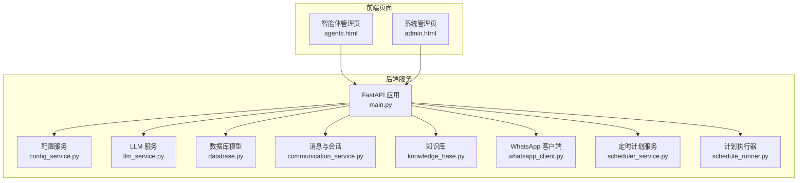
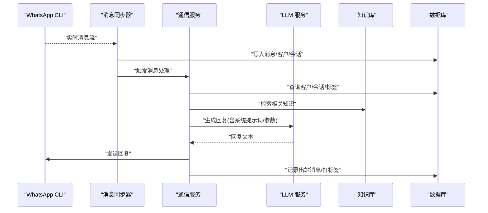
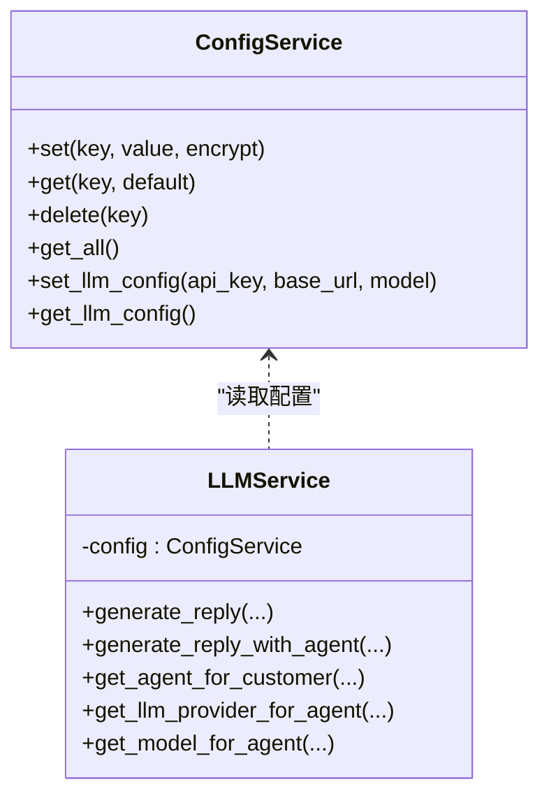
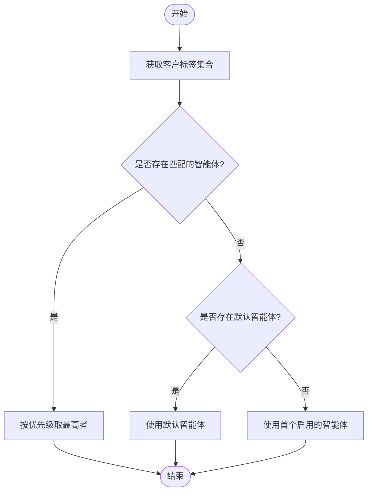
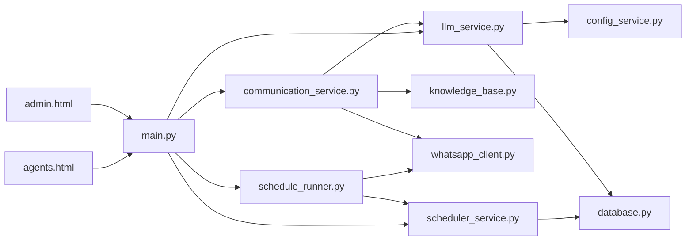

# 智能体配置

<cite>
**本文引用的文件**
- [backend/main.py](file://backend/main.py)
- [backend/llm_service.py](file://backend/llm_service.py)
- [backend/config_service.py](file://backend/config_service.py)
- [backend/database.py](file://backend/database.py)
- [backend/communication_service.py](file://backend/communication_service.py)
- [backend/knowledge_base.py](file://backend/knowledge_base.py)
- [backend/whatsapp_client.py](file://backend/whatsapp_client.py)
- [backend/scheduler_service.py](file://backend/scheduler_service.py)
- [backend/schedule_runner.py](file://backend/schedule_runner.py)
- [backend/static/agents.html](file://backend/static/agents.html)
- [backend/static/admin.html](file://backend/static/admin.html)
- [requirements.txt](file://requirements.txt)
</cite>

## 目录
1. [简介](#简介)
2. [项目结构](#项目结构)
3. [核心组件](#核心组件)
4. [架构总览](#架构总览)
5. [详细组件分析](#详细组件分析)
6. [依赖关系分析](#依赖关系分析)
7. [性能考量](#性能考量)
8. [故障排查指南](#故障排查指南)
9. [结论](#结论)
10. [附录](#附录)

## 简介
本文件面向“智能体配置”的系统性文档，围绕基于 WhatsApp 的智能客户系统，系统阐述智能体（AI Agent）的配置方法、参数调优、优先级管理、动态切换与负载均衡策略，并结合实际代码实现给出最佳实践与排障建议。读者无需深入编程背景，也能通过本指南快速掌握如何为不同业务场景（客户服务、产品推荐、技术支持等）设计与优化智能体。

## 项目结构
该系统采用后端 FastAPI + SQLite 的轻量架构，核心模块包括：
- 配置管理：安全存储与读取 LLM 配置（API Key、Base URL、模型名）
- 智能体管理：多智能体、系统提示词、模型参数、优先级、标签绑定
- 大模型服务：统一调用 OpenAI/Claude/DeepSeek 等提供商接口
- 消息与会话：WhatsApp CLI 封装、消息同步、自动回复、人工交接
- 知识库：文档检索与上下文增强
- 定时计划：按标签/分类批量发送消息
- 前端管理页：可视化配置智能体、标签、提供商、知识库与计划

图表来源
- [backend/main.py:128-157](file://backend/main.py#L128-L157)
- [backend/config_service.py:11-23](file://backend/config_service.py#L11-L23)
- [backend/llm_service.py:11-24](file://backend/llm_service.py#L11-L24)
- [backend/database.py:23-289](file://backend/database.py#L23-L289)
- [backend/communication_service.py:17-46](file://backend/communication_service.py#L17-L46)
- [backend/knowledge_base.py:11-18](file://backend/knowledge_base.py#L11-L18)
- [backend/whatsapp_client.py:13-26](file://backend/whatsapp_client.py#L13-L26)
- [backend/scheduler_service.py:54-63](file://backend/scheduler_service.py#L54-L63)
- [backend/schedule_runner.py:12-20](file://backend/schedule_runner.py#L12-L20)
- [backend/static/agents.html:1-800](file://backend/static/agents.html#L1-L800)
- [backend/static/admin.html:1-800](file://backend/static/admin.html#L1-L800)

章节来源
- [backend/main.py:128-157](file://backend/main.py#L128-L157)
- [backend/static/agents.html:1-800](file://backend/static/agents.html#L1-L800)
- [backend/static/admin.html:1-800](file://backend/static/admin.html#L1-L800)

## 核心组件
- 配置服务：集中管理 LLM 提供商与模型参数，支持加密存储与回退策略
- 智能体模型：支持系统提示词、模型参数覆盖、优先级、标签绑定、默认智能体
- LLM 服务：自动选择智能体、拼接系统提示词与知识库上下文、调用第三方模型
- 消息与会话：自动回复、转人工、意图识别、自动打标签
- 知识库：文档入库、关键词索引、相似度检索
- 定时计划：按标签/分类筛选客户、批量发送、进度统计
- 前端管理页：可视化配置智能体、提供商、标签、知识库与计划

章节来源
- [backend/config_service.py:11-153](file://backend/config_service.py#L11-L153)
- [backend/database.py:155-210](file://backend/database.py#L155-L210)
- [backend/llm_service.py:11-286](file://backend/llm_service.py#L11-L286)
- [backend/communication_service.py:17-512](file://backend/communication_service.py#L17-L512)
- [backend/knowledge_base.py:11-212](file://backend/knowledge_base.py#L11-L212)
- [backend/scheduler_service.py:54-393](file://backend/scheduler_service.py#L54-L393)
- [backend/schedule_runner.py:12-142](file://backend/schedule_runner.py#L12-L142)

## 架构总览
系统通过 FastAPI 提供 REST API，前端页面负责配置与展示；消息通过 WhatsApp CLI 实时同步，进入通信服务处理流程，最终由 LLM 服务生成智能回复并经 WhatsApp 客户端发送。

图表来源
- [backend/whatsapp_client.py:174-210](file://backend/whatsapp_client.py#L174-L210)
- [backend/whatsapp_client.py:212-437](file://backend/whatsapp_client.py#L212-L437)
- [backend/communication_service.py:47-265](file://backend/communication_service.py#L47-L265)
- [backend/knowledge_base.py:130-142](file://backend/knowledge_base.py#L130-L142)
- [backend/llm_service.py:86-198](file://backend/llm_service.py#L86-L198)

## 详细组件分析

### 配置管理与 LLM 提供商
- 配置服务提供加密存储与回退机制，支持设置/读取 LLM 配置（API Key、Base URL、模型），并兼容旧版环境变量回退
- LLM 服务优先从数据库中为智能体选择提供商与模型参数，若未配置则回退到全局配置

图表来源
- [backend/config_service.py:11-153](file://backend/config_service.py#L11-L153)
- [backend/llm_service.py:11-286](file://backend/llm_service.py#L11-L286)

章节来源
- [backend/config_service.py:11-153](file://backend/config_service.py#L11-L153)
- [backend/llm_service.py:18-51](file://backend/llm_service.py#L18-L51)

### 智能体模型与参数
- 智能体模型支持系统提示词、温度、最大 Token、优先级、是否默认、标签绑定、提供商与模型 ID 绑定
- 选择策略：按客户标签匹配优先级最高的智能体；若无匹配则回退默认智能体；若仍无则启用首个启用的智能体

图表来源
- [backend/llm_service.py:52-84](file://backend/llm_service.py#L52-L84)

章节来源
- [backend/database.py:155-181](file://backend/database.py#L155-L181)
- [backend/llm_service.py:52-84](file://backend/llm_service.py#L52-L84)

### 系统提示词（System Prompt）编写与优化
- 系统提示词用于定义角色、语气、回复风格与策略
- 支持为智能体单独设置系统提示词，也可使用默认构建策略
- 前端提供“优化提示词”按钮，便于生成更高质量的提示词

章节来源
- [backend/llm_service.py:200-228](file://backend/llm_service.py#L200-L228)
- [backend/static/admin.html:720-738](file://backend/static/admin.html#L720-L738)

### 智能体参数设置（温度、最大 Token 等）
- 智能体级别参数优先于提供商级别参数，提供商级别参数优先于全局默认
- 参数来源链路：智能体 → 提供商 → 全局配置 → 默认值

章节来源
- [backend/llm_service.py:122-146](file://backend/llm_service.py#L122-L146)
- [backend/database.py:211-228](file://backend/database.py#L211-L228)

### 智能体优先级管理
- 优先级字段为整数，数值越大优先级越高
- 客户标签与优先级共同决定智能体选择，确保高价值客户由更合适的智能体服务

章节来源
- [backend/database.py:172-176](file://backend/database.py#L172-L176)
- [backend/llm_service.py:64-72](file://backend/llm_service.py#L64-L72)

### 不同类型智能体的适用场景与配置策略
- 客户服务智能体：强调友好、礼貌、引导人工；适合新客户与老客户场景
- 产品推荐智能体：强调产品特性、价格对比、个性化推荐；可绑定产品相关标签
- 技术支持智能体：强调技术术语、排障步骤、FAQ 匹配；可绑定技术标签并接入知识库

章节来源
- [backend/communication_service.py:21-41](file://backend/communication_service.py#L21-L41)
- [backend/knowledge_base.py:130-142](file://backend/knowledge_base.py#L130-L142)

### 动态切换机制与负载均衡策略
- 动态切换：基于客户标签与优先级动态选择智能体，实现“按需分配”
- 负载均衡：通过提供商级别的超时与并发控制（由外部调用方管理）保障稳定性；当前实现以顺序调用为主，建议在上游增加限流与重试策略

章节来源
- [backend/llm_service.py:122-146](file://backend/llm_service.py#L122-L146)
- [backend/llm_service.py:149-176](file://backend/llm_service.py#L149-L176)

### 知识库与上下文增强
- 知识库支持文档入库、关键词索引与相似度检索，自动将相关内容注入系统提示词，提升回复准确性

章节来源
- [backend/knowledge_base.py:11-212](file://backend/knowledge_base.py#L11-L212)
- [backend/llm_service.py:113-116](file://backend/llm_service.py#L113-L116)

### 定时发送与批量运营
- 定时计划支持按标签/分类筛选客户，批量生成个性化消息并按间隔发送
- 执行器后台运行，支持暂停/恢复/取消与进度统计

章节来源
- [backend/scheduler_service.py:54-393](file://backend/scheduler_service.py#L54-L393)
- [backend/schedule_runner.py:12-142](file://backend/schedule_runner.py#L12-L142)

## 依赖关系分析
- 后端模块间耦合清晰：LLM 服务依赖配置服务与数据库模型；通信服务依赖 WhatsApp 客户端与知识库；定时服务独立但与数据库交互
- 前端通过 REST API 与后端交互，实现可视化配置与管理

图表来源
- [backend/llm_service.py:11-286](file://backend/llm_service.py#L11-L286)
- [backend/config_service.py:11-153](file://backend/config_service.py#L11-L153)
- [backend/database.py:23-289](file://backend/database.py#L23-L289)
- [backend/communication_service.py:17-512](file://backend/communication_service.py#L17-L512)
- [backend/knowledge_base.py:11-212](file://backend/knowledge_base.py#L11-L212)
- [backend/whatsapp_client.py:13-437](file://backend/whatsapp_client.py#L13-L437)
- [backend/scheduler_service.py:54-393](file://backend/scheduler_service.py#L54-L393)
- [backend/schedule_runner.py:12-142](file://backend/schedule_runner.py#L12-L142)
- [backend/main.py:128-157](file://backend/main.py#L128-L157)
- [backend/static/admin.html:1-800](file://backend/static/admin.html#L1-800)
- [backend/static/agents.html:1-800](file://backend/static/agents.html#L1-800)

## 性能考量
- LLM 调用延迟与稳定性：合理设置超时、重试与熔断；在上游网关层做限流与缓存
- 消息同步频率：当前轮询间隔较短，建议根据并发量与 WhatsApp CLI 性能调优
- 知识库检索：关键词索引与分页查询，避免一次性返回过多内容导致上下文过长
- 前端渲染：智能体与标签列表较多时，建议分页与懒加载

## 故障排查指南
- 智能体响应质量不佳
  - 检查系统提示词是否明确角色与策略
  - 适当调整温度与最大 Token
  - 启用知识库上下文并确保文档质量
  - 参考：[backend/llm_service.py:110-120](file://backend/llm_service.py#L110-L120)，[backend/knowledge_base.py:130-142](file://backend/knowledge_base.py#L130-L142)
- 响应速度慢
  - 检查 LLM 提供商网络与超时设置
  - 降低最大 Token 或减少上下文长度
  - 参考：[backend/llm_service.py:132-146](file://backend/llm_service.py#L132-L146)
- 内存占用过高
  - 控制消息历史窗口（当前使用最近 10 条）
  - 优化知识库检索结果数量
  - 参考：[backend/llm_service.py:102-108](file://backend/llm_service.py#L102-L108)，[backend/knowledge_base.py:132-141](file://backend/knowledge_base.py#L132-L141)
- WhatsApp 发送失败
  - 检查 JID 格式与登录状态
  - 切换备用 JID 后重试
  - 参考：[backend/whatsapp_client.py:133-154](file://backend/whatsapp_client.py#L133-L154)，[backend/whatsapp_client.py:156-172](file://backend/whatsapp_client.py#L156-L172)
- 定时计划未执行
  - 检查计划状态与执行时间
  - 确认任务表与计划表数据一致
  - 参考：[backend/scheduler_service.py:140-181](file://backend/scheduler_service.py#L140-L181)，[backend/schedule_runner.py:60-110](file://backend/schedule_runner.py#L60-L110)

## 结论
本系统通过“智能体 + 提供商 + 参数覆盖 + 标签优先级”的组合，实现了灵活、可扩展的智能回复体系。配合知识库与定时计划，能够满足客户服务、产品推荐、技术支持等多种场景。建议在生产环境中进一步完善限流、缓存与可观测性，持续优化提示词与参数，以获得更佳的用户体验与运营效率。

## 附录
- 配置示例（路径参考）
  - 设置 LLM 配置：[backend/config_service.py:128-140](file://backend/config_service.py#L128-L140)
  - 获取 LLM 配置：[backend/config_service.py:134-140](file://backend/config_service.py#L134-L140)
  - 新建智能体（前端）：[backend/static/admin.html:700-790](file://backend/static/admin.html#L700-L790)
  - 管理智能体（前端）：[backend/static/agents.html:406-474](file://backend/static/agents.html#L406-L474)
- 依赖声明
  - [requirements.txt:1-8](file://requirements.txt#L1-L8)