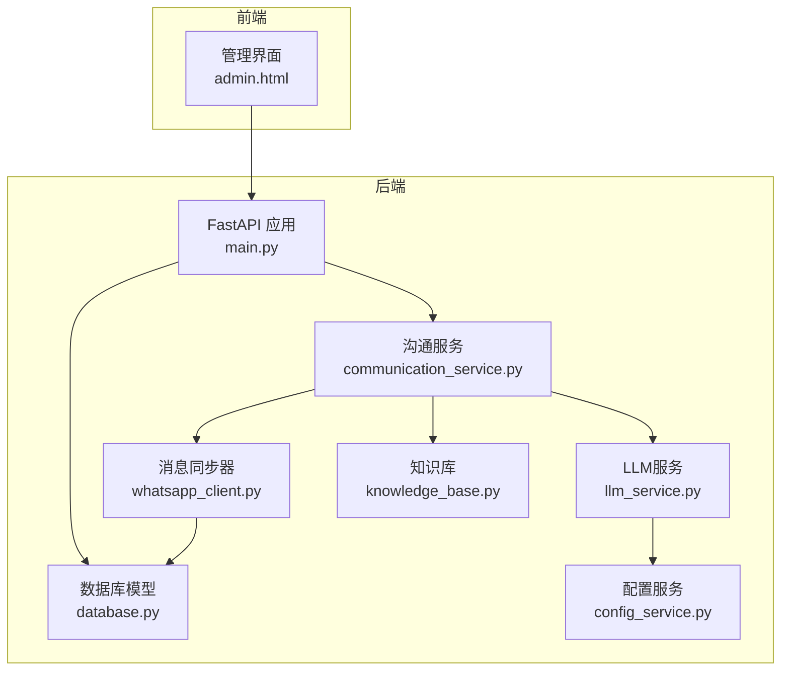
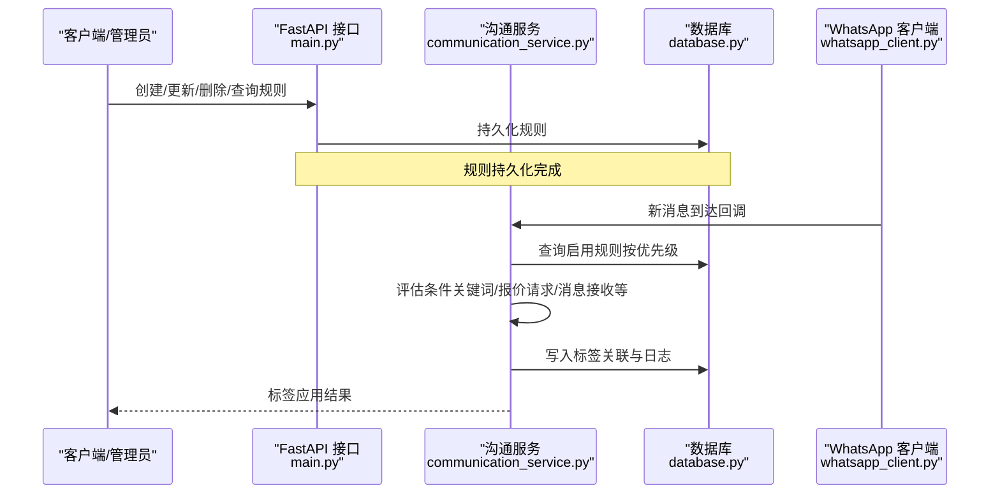
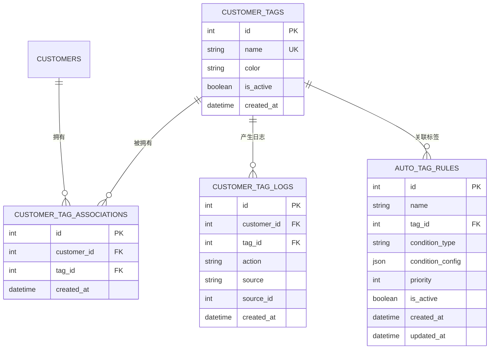
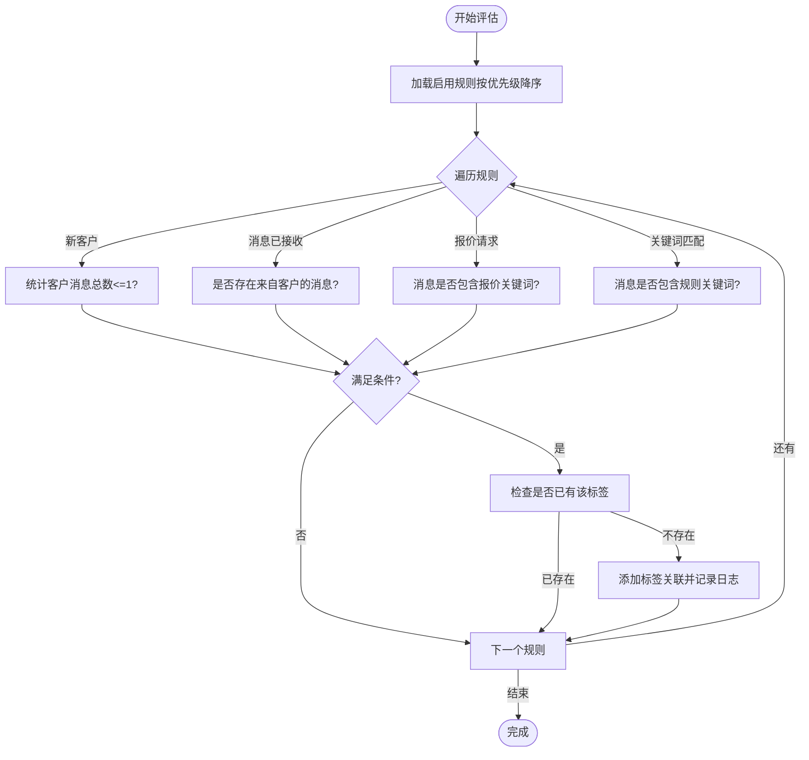
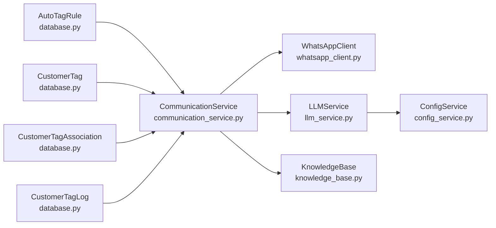

# 自动标签规则配置

<cite>
**本文档引用的文件**
- [main.py](file://backend/main.py)
- [communication_service.py](file://backend/communication_service.py)
- [database.py](file://backend/database.py)
- [whatsapp_client.py](file://backend/whatsapp_client.py)
- [llm_service.py](file://backend/llm_service.py)
- [knowledge_base.py](file://backend/knowledge_base.py)
- [config_service.py](file://backend/config_service.py)
- [admin.html](file://backend/static/admin.html)
</cite>

## 目录
1. [简介](#简介)
2. [项目结构](#项目结构)
3. [核心组件](#核心组件)
4. [架构总览](#架构总览)
5. [详细组件分析](#详细组件分析)
6. [依赖关系分析](#依赖关系分析)
7. [性能考虑](#性能考虑)
8. [故障排除指南](#故障排除指南)
9. [结论](#结论)
10. [附录](#附录)

## 简介
本文件面向“自动标签规则配置”的使用与维护，围绕 WhatsApp 智能客户系统中的自动标签能力，提供从规则设计、触发条件、匹配逻辑、标签分配策略到优先级管理、条件组合、正则表达式使用、测试验证、动态更新与批量修改、最佳实践与常见陷阱的完整说明。系统支持基于消息内容、客户行为、AI意图识别等多种条件的自动打标，并提供可视化管理界面与批量执行能力。

## 项目结构
系统采用后端 FastAPI + SQLite 的轻量架构，核心模块包括：
- API 层：规则 CRUD、批量执行、客户标签应用接口
- 业务层：消息处理、自动回复、通知、标签应用
- 数据层：SQLAlchemy 模型与数据库初始化
- 客户端层：WhatsApp CLI 封装与消息同步
- 辅助层：LLM 服务、知识库、配置管理

图表来源
- [main.py:129-134](file://backend/main.py#L129-L134)
- [communication_service.py:17-46](file://backend/communication_service.py#L17-L46)
- [whatsapp_client.py:13-26](file://backend/whatsapp_client.py#L13-L26)
- [database.py:254-297](file://backend/database.py#L254-L297)
- [llm_service.py:11-24](file://backend/llm_service.py#L11-L24)
- [knowledge_base.py:11-17](file://backend/knowledge_base.py#L11-L17)
- [config_service.py:11-23](file://backend/config_service.py#L11-L23)

章节来源
- [main.py:129-134](file://backend/main.py#L129-L134)
- [database.py:254-297](file://backend/database.py#L254-L297)

## 核心组件
- 自动标签规则模型：定义规则名称、目标标签、触发条件类型、条件配置、优先级、启用状态等
- 规则应用引擎：在消息到达时或手动触发时，按优先级顺序评估规则并应用标签
- 规则管理 API：创建、更新、删除、查询、批量执行规则
- 可视化管理界面：提供规则编辑、关键词配置、批量执行入口
- 客户标签关联与日志：记录标签分配来源与规则 ID，便于审计与追踪

章节来源
- [database.py:259-288](file://backend/database.py#L259-L288)
- [main.py:1721-1735](file://backend/main.py#L1721-L1735)
- [main.py:1736-1808](file://backend/main.py#L1736-L1808)
- [main.py:1810-1882](file://backend/main.py#L1810-L1882)
- [main.py:1884-1973](file://backend/main.py#L1884-L1973)
- [admin.html:1350-1498](file://backend/static/admin.html#L1350-L1498)

## 架构总览
自动标签规则的触发与执行流程如下：

图表来源
- [communication_service.py:292-361](file://backend/communication_service.py#L292-L361)
- [main.py:1736-1808](file://backend/main.py#L1736-L1808)
- [whatsapp_client.py:400-433](file://backend/whatsapp_client.py#L400-L433)

## 详细组件分析

### 自动标签规则模型与数据结构
- 规则实体包含：名称、目标标签、条件类型、条件配置（JSON）、优先级、启用状态、创建/更新时间
- 条件类型支持：新客户、消息已接收、报价请求、关键词匹配
- 条件配置：关键词匹配时提供关键词数组；其他类型可为空
- 标签关联：客户-标签多对多，通过关联表维护
- 日志记录：记录标签来源（自动规则）、规则 ID、动作（新增）

图表来源
- [database.py:26-38](file://backend/database.py#L26-L38)
- [database.py:126-153](file://backend/database.py#L126-L153)
- [database.py:259-288](file://backend/database.py#L259-L288)

章节来源
- [database.py:259-288](file://backend/database.py#L259-L288)
- [database.py:126-153](file://backend/database.py#L126-L153)

### 规则触发条件与匹配逻辑
- 新客户：消息总数 ≤ 1（系统消息或无消息）
- 消息已接收：客户存在“来自客户”的消息
- 报价请求：消息内容包含预设关键词（中文/英文）
- 关键词匹配：消息内容包含规则配置中的任意关键词（大小写不敏感）

图表来源
- [communication_service.py:292-361](file://backend/communication_service.py#L292-L361)
- [main.py:1810-1882](file://backend/main.py#L1810-L1882)

章节来源
- [communication_service.py:292-361](file://backend/communication_service.py#L292-L361)
- [main.py:1810-1882](file://backend/main.py#L1810-L1882)

### 标签分配策略与优先级管理
- 规则按 priority 字段降序执行，优先级高的先评估
- 单个客户同一标签仅允许存在一次，重复应用会被跳过
- 标签分配后写入日志，记录来源为“自动规则”及对应规则 ID，便于审计

章节来源
- [main.py:1739](file://backend/main.py#L1739)
- [main.py:1818](file://backend/main.py#L1818)
- [main.py:1848-1874](file://backend/main.py#L1848-L1874)

### 条件组合与正则表达式使用
- 系统当前支持的条件类型为“AND”关系：即单条规则内的多个条件需同时满足（例如关键词匹配时，消息需包含任一关键词）
- 正则表达式未在现有实现中使用，建议在规则配置中通过关键词集合与上下文结合实现复杂匹配
- 若需扩展为更复杂的布尔逻辑（AND/OR/NOT），可在条件配置中引入布尔表达式或在服务端解析

章节来源
- [main.py:1842-1846](file://backend/main.py#L1842-L1846)
- [main.py:1926-1938](file://backend/main.py#L1926-L1938)

### 常见业务场景的规则配置示例
以下为典型场景的配置思路（不展示具体代码，仅提供配置要点）：
- 客户分类规则
  - 新客户：条件类型为“新客户”，目标标签为“新客户”
  - 意向客户：条件类型为“消息已接收”，目标标签为“意向客户”
- 购买意向识别
  - 条件类型为“关键词匹配”，关键词集合包含“报价/价格/多少钱/费用/cost/price/quote”
  - 目标标签为“有意向”
- 投诉预警
  - 条件类型为“关键词匹配”，关键词集合包含“投诉/差评/不满意/退费/退款”
  - 目标标签为“投诉预警”

章节来源
- [main.py:1831-1846](file://backend/main.py#L1831-L1846)
- [main.py:1905-1924](file://backend/main.py#L1905-L1924)

### 规则的测试与验证方法
- 单条规则测试
  - 使用“为客户应用自动标签”接口，传入目标客户 ID 与消息内容，查看返回的应用标签列表
- 批量规则测试
  - 使用“手动执行自动打标签规则”接口，为所有客户应用某条规则，查看成功/跳过的计数
- 效果评估
  - 通过客户列表查看标签变化，结合标签日志核对来源与规则 ID
- 性能影响分析
  - 关注规则数量与优先级排序成本，建议控制规则数量并合理设置优先级
  - 对关键词匹配建议精简关键词集合，避免过多模糊匹配

章节来源
- [main.py:1810-1882](file://backend/main.py#L1810-L1882)
- [main.py:1884-1973](file://backend/main.py#L1884-L1973)
- [database.py:277-288](file://backend/database.py#L277-L288)

### 动态更新机制与批量修改
- 动态更新
  - 通过规则管理 API 更新规则名称、条件类型、条件配置、优先级、启用状态
- 批量修改
  - 使用“手动执行自动打标签规则”接口，针对某条规则对全量客户进行重新评估与打标
- 变更生效
  - 规则变更立即生效于后续消息处理与手动执行

章节来源
- [main.py:1782-1796](file://backend/main.py#L1782-L1796)
- [main.py:1884-1973](file://backend/main.py#L1884-L1973)

### 可视化管理与配置入口
- 管理界面提供规则列表、编辑、删除、批量执行按钮
- 关键词匹配模式下，界面会显示关键词输入框并支持逗号分隔的关键词列表
- 保存时将关键词转换为数组并提交到后端

章节来源
- [admin.html:1350-1498](file://backend/static/admin.html#L1350-L1498)

## 依赖关系分析
- 规则应用依赖数据库模型与会话
- 沟通服务在 AI 回复完成后调用自动标签应用逻辑
- 消息同步器在新消息到达时触发沟通服务处理
- LLM 服务与知识库用于智能回复与知识检索，间接影响标签应用的上下文

图表来源
- [communication_service.py:292-361](file://backend/communication_service.py#L292-L361)
- [database.py:259-288](file://backend/database.py#L259-L288)
- [whatsapp_client.py:400-433](file://backend/whatsapp_client.py#L400-L433)
- [llm_service.py:11-24](file://backend/llm_service.py#L11-L24)
- [knowledge_base.py:11-17](file://backend/knowledge_base.py#L11-L17)
- [config_service.py:11-23](file://backend/config_service.py#L11-L23)

## 性能考虑
- 规则评估成本
  - 每条规则均需查询消息计数或扫描最近消息，建议控制规则数量与关键词集合规模
- 数据库查询
  - 关键词匹配与报价请求均涉及消息表查询，建议在消息表建立必要索引（如 direction、customer_id）
- 事件循环与并发
  - 消息同步采用轮询+事件循环，避免阻塞；AI 回复采用异步调用，减少等待
- 缓存与去重
  - 标签去重检查避免重复写入，减少冗余日志与关联记录

[本节为通用性能讨论，无需特定文件引用]

## 故障排除指南
- 规则未生效
  - 检查规则是否启用、优先级是否过低、条件是否满足
  - 使用“为客户应用自动标签”接口进行单点测试
- 标签重复
  - 系统已内置去重逻辑，若仍出现重复，检查关联表与日志是否异常
- 关键词匹配不准确
  - 精简关键词集合，避免过于宽泛；必要时增加上下文过滤
- 批量执行失败
  - 检查规则 ID 是否有效、客户数据是否完整、数据库连接是否正常

章节来源
- [main.py:1810-1882](file://backend/main.py#L1810-L1882)
- [main.py:1884-1973](file://backend/main.py#L1884-L1973)

## 结论
自动标签规则为 WhatsApp 智能客户系统提供了强大的自动化能力，能够基于消息内容与客户行为进行精准打标。通过合理的规则设计、优先级管理与批量执行机制，可显著提升客户分类与运营效率。建议在实践中持续优化关键词集合、控制规则数量，并结合日志与审计机制保障规则质量与稳定性。

[本节为总结性内容，无需特定文件引用]

## 附录

### API 定义概览
- 获取规则列表：GET /api/auto-tag-rules
- 创建规则：POST /api/auto-tag-rules
- 更新规则：PUT /api/auto-tag-rules/{rule_id}
- 删除规则：DELETE /api/auto-tag-rules/{rule_id}
- 为客户应用标签：POST /api/customers/{customer_id}/apply-auto-tags
- 手动执行规则（批量）：POST /api/auto-tag-rules/{rule_id}/execute

章节来源
- [main.py:1736-1739](file://backend/main.py#L1736-L1739)
- [main.py:1761-1780](file://backend/main.py#L1761-L1780)
- [main.py:1782-1796](file://backend/main.py#L1782-L1796)
- [main.py:1798-1808](file://backend/main.py#L1798-L1808)
- [main.py:1810-1882](file://backend/main.py#L1810-L1882)
- [main.py:1884-1973](file://backend/main.py#L1884-L1973)

### 最佳实践与常见陷阱
- 最佳实践
  - 优先级明确：高价值标签使用更高优先级，避免被低优先级覆盖
  - 关键词精准：避免过度宽泛的关键词，减少误判
  - 分批上线：新规则先小范围测试，再逐步扩大
  - 审计留痕：利用标签日志追踪来源与规则 ID
- 常见陷阱
  - 规则冲突：不同规则对同一标签的条件过于接近，导致互相覆盖
  - 性能瓶颈：规则过多或关键词过多导致评估耗时上升
  - 误判风险：关键词过于宽泛或上下文缺失导致错误打标

[本节为通用指导，无需特定文件引用]