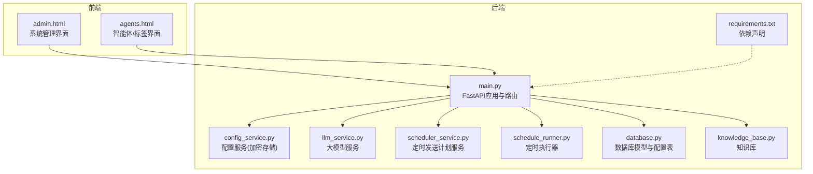
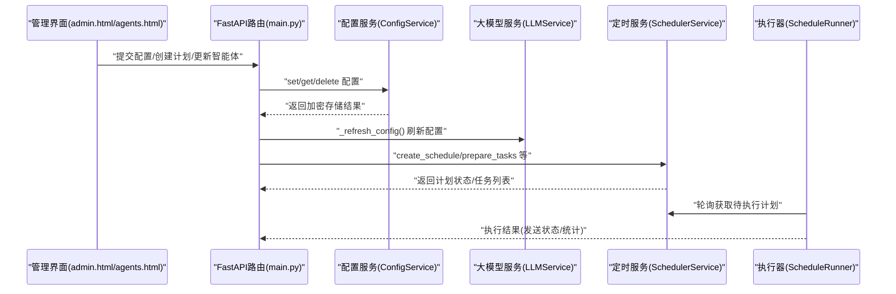
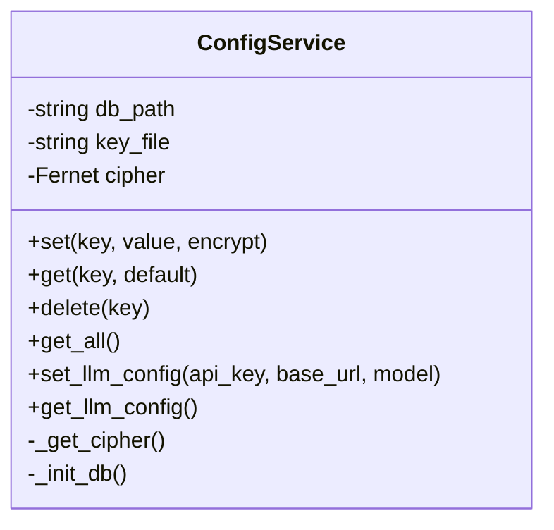
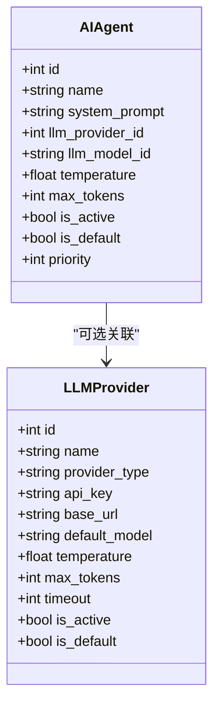
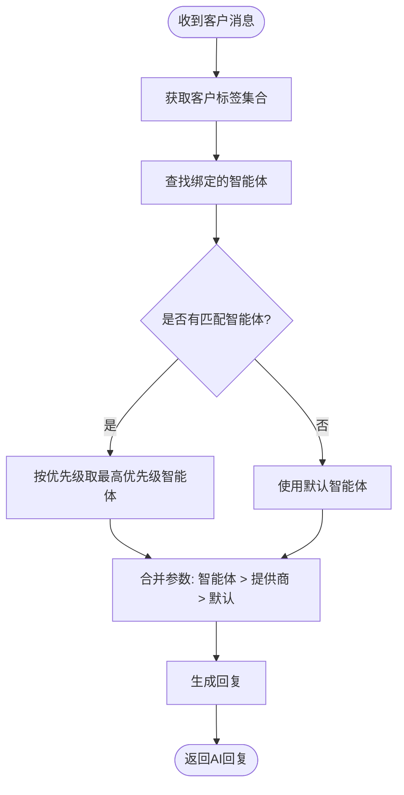
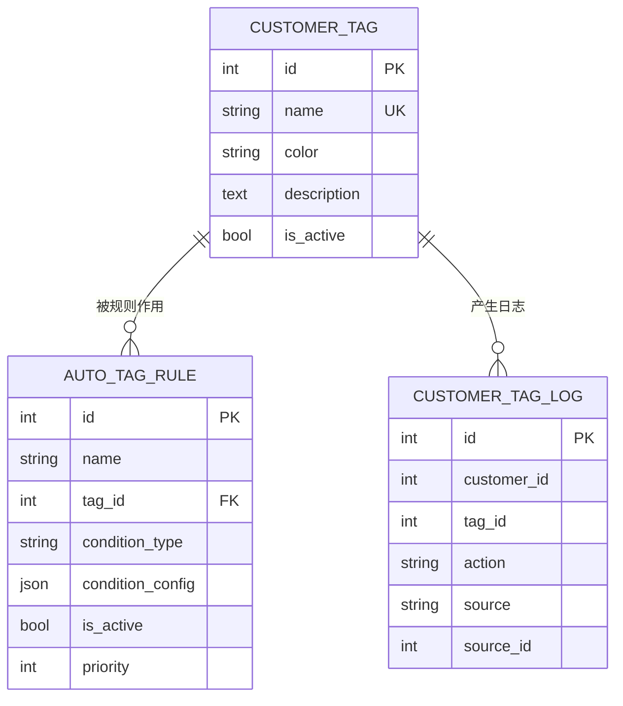
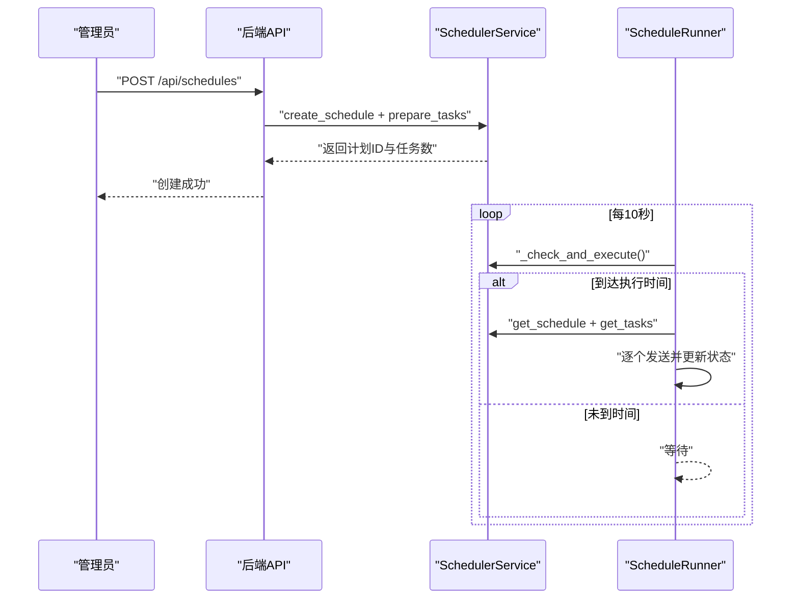
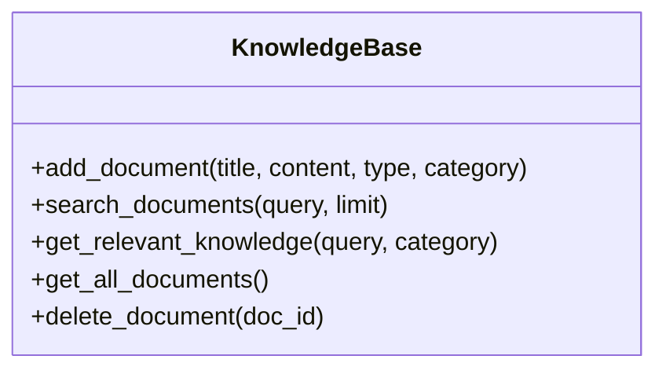
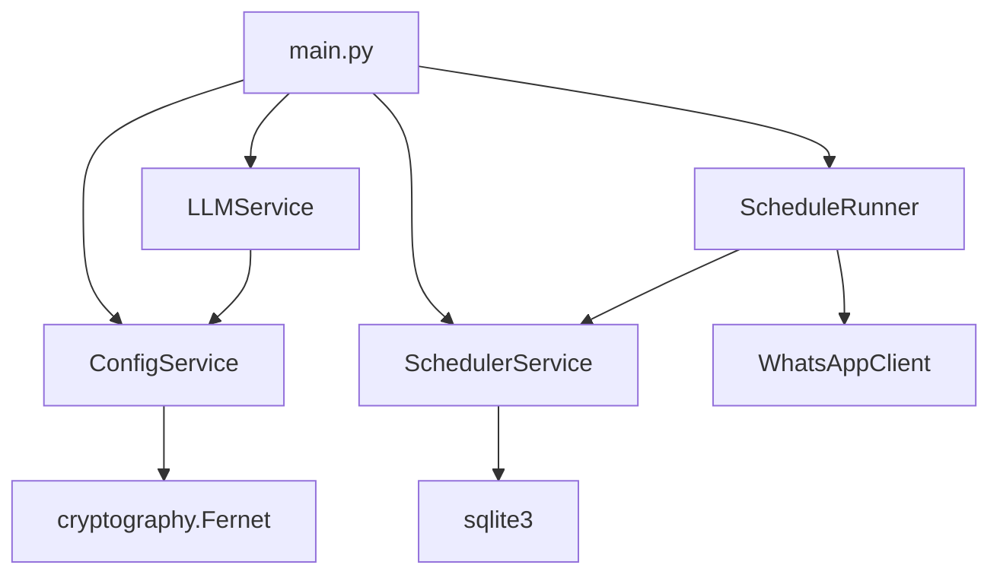

# 配置管理

<cite>
**本文引用的文件**
- [backend/config_service.py](file://backend/config_service.py)
- [backend/main.py](file://backend/main.py)
- [backend/llm_service.py](file://backend/llm_service.py)
- [backend/scheduler_service.py](file://backend/scheduler_service.py)
- [backend/schedule_runner.py](file://backend/schedule_runner.py)
- [backend/database.py](file://backend/database.py)
- [backend/knowledge_base.py](file://backend/knowledge_base.py)
- [backend/static/admin.html](file://backend/static/admin.html)
- [backend/static/agents.html](file://backend/static/agents.html)
- [backend/requirements.txt](file://backend/requirements.txt)
</cite>

## 目录
1. [简介](#简介)
2. [项目结构](#项目结构)
3. [核心组件](#核心组件)
4. [架构总览](#架构总览)
5. [详细组件分析](#详细组件分析)
6. [依赖分析](#依赖分析)
7. [性能考量](#性能考量)
8. [故障排除指南](#故障排除指南)
9. [结论](#结论)
10. [附录](#附录)

## 简介
本文件面向WhatsApp智能客户系统的配置管理，涵盖以下主题：
- 大语言模型提供商配置（OpenAI、Claude、DeepSeek等）
- 智能体配置（系统提示词、参数设置、优先级管理）
- 自动标签规则配置（规则创建、条件配置、优先级设置）
- 定时发送配置（计划创建、标签筛选、执行监控）
- 配置文件格式、参数含义与默认值
- 最佳实践与安全考虑（API密钥安全存储）
- 动态更新机制与热重载
- 故障排除与常见问题

## 项目结构
系统采用前后端分离的FastAPI后端与静态HTML前端，配置管理通过后端API与SQLite数据库持久化实现。

图表来源
- [backend/main.py:129-134](file://backend/main.py#L129-L134)
- [backend/config_service.py:11-22](file://backend/config_service.py#L11-L22)
- [backend/llm_service.py:11-16](file://backend/llm_service.py#L11-L16)
- [backend/scheduler_service.py:54-62](file://backend/scheduler_service.py#L54-L62)
- [backend/schedule_runner.py:12-20](file://backend/schedule_runner.py#L12-L20)
- [backend/database.py:211-244](file://backend/database.py#L211-L244)
- [backend/knowledge_base.py:11-18](file://backend/knowledge_base.py#L11-L18)
- [backend/static/admin.html:382-543](file://backend/static/admin.html#L382-L543)
- [backend/static/agents.html:372-404](file://backend/static/agents.html#L372-L404)
- [backend/requirements.txt:1-20](file://backend/requirements.txt#L1-L20)

章节来源
- [backend/main.py:129-134](file://backend/main.py#L129-L134)
- [backend/static/admin.html:382-543](file://backend/static/admin.html#L382-L543)
- [backend/static/agents.html:372-404](file://backend/static/agents.html#L372-L404)

## 核心组件
- 配置服务（ConfigService）：负责敏感配置的加密存储、读取与删除；支持旧版LLM配置迁移。
- 大模型服务（LLMService）：统一接入不同提供商，按智能体优先级与标签匹配选择模型与参数。
- 定时发送服务（SchedulerService）：计划创建、任务准备、状态管理与统计。
- 定时执行器（ScheduleRunner）：周期性检查并执行到期计划，支持暂停/恢复/立即执行。
- 数据库模型（database.py）：定义智能体、提供商、模型、标签、自动标签规则等配置实体。
- 知识库（knowledge_base.py）：文档管理与检索，辅助智能回复。
- 前端界面（admin.html、agents.html）：可视化配置入口，支持LLM提供商、智能体、标签、知识库、发送计划管理。

章节来源
- [backend/config_service.py:11-153](file://backend/config_service.py#L11-L153)
- [backend/llm_service.py:11-286](file://backend/llm_service.py#L11-L286)
- [backend/scheduler_service.py:54-393](file://backend/scheduler_service.py#L54-L393)
- [backend/schedule_runner.py:12-142](file://backend/schedule_runner.py#L12-L142)
- [backend/database.py:211-289](file://backend/database.py#L211-L289)
- [backend/knowledge_base.py:11-212](file://backend/knowledge_base.py#L11-L212)
- [backend/static/admin.html:398-543](file://backend/static/admin.html#L398-L543)
- [backend/static/agents.html:406-474](file://backend/static/agents.html#L406-L474)

## 架构总览
系统通过FastAPI提供REST接口，前端通过AJAX调用后端API完成配置管理。配置变更后，LLM服务会刷新内部配置以实现热重载；定时发送计划由执行器按周期扫描并执行。

图表来源
- [backend/main.py:974-1012](file://backend/main.py#L974-L1012)
- [backend/main.py:1050-1089](file://backend/main.py#L1050-L1089)
- [backend/config_service.py:56-95](file://backend/config_service.py#L56-L95)
- [backend/llm_service.py:18-24](file://backend/llm_service.py#L18-L24)
- [backend/scheduler_service.py:108-138](file://backend/scheduler_service.py#L108-L138)
- [backend/schedule_runner.py:35-110](file://backend/schedule_runner.py#L35-L110)

## 详细组件分析

### 配置服务（ConfigService）
- 加密存储：使用Fernet对敏感配置（如API Key）进行对称加密；密钥文件权限严格限制。
- 数据结构：SQLite表config，字段包含key、value、is_encrypted、时间戳。
- 旧版LLM配置：提供set_llm_config/get_llm_config，兼容OPENAI_*环境变量。
- 安全特性：敏感值在列表中仅显示占位符，避免泄露。

图表来源
- [backend/config_service.py:11-153](file://backend/config_service.py#L11-L153)

章节来源
- [backend/config_service.py:11-153](file://backend/config_service.py#L11-L153)

### 大语言模型提供商配置
- 支持多提供商：OpenAI、Claude、DeepSeek、Azure OpenAI、自定义。
- 配置项：
  - 显示名称、提供商类型、API Key、Base URL、默认模型
  - 温度(temperature)、最大Token(max_tokens)、超时(timeout)
  - 是否默认提供商、是否启用
- 参数优先级：智能体级别 > 提供商级别 > 系统默认。
- 默认值：模型名称、Base URL、温度、最大Token等均有合理默认。
- 热重载：通过刷新LLM服务配置实现。

图表来源
- [backend/database.py:211-244](file://backend/database.py#L211-L244)
- [backend/database.py:155-182](file://backend/database.py#L155-L182)
- [backend/llm_service.py:25-50](file://backend/llm_service.py#L25-L50)
- [backend/llm_service.py:122-146](file://backend/llm_service.py#L122-L146)

章节来源
- [backend/database.py:211-244](file://backend/database.py#L211-L244)
- [backend/llm_service.py:11-286](file://backend/llm_service.py#L11-L286)
- [backend/static/admin.html:630-698](file://backend/static/admin.html#L630-L698)

### 智能体配置（系统提示词、参数、优先级）
- 系统提示词：定义AI角色、语气与回复风格。
- 参数覆盖：智能体可覆盖提供商默认的温度与最大Token。
- 优先级：按数字大小排序，数字越大优先级越高。
- 标签绑定：一个标签只能绑定一个智能体；匹配客户标签后选择最高优先级智能体。
- 默认智能体：全局默认智能体用于兜底。

图表来源
- [backend/llm_service.py:52-84](file://backend/llm_service.py#L52-L84)
- [backend/llm_service.py:122-146](file://backend/llm_service.py#L122-L146)

章节来源
- [backend/llm_service.py:52-84](file://backend/llm_service.py#L52-L84)
- [backend/llm_service.py:122-146](file://backend/llm_service.py#L122-L146)
- [backend/static/agents.html:406-474](file://backend/static/agents.html#L406-L474)

### 自动标签规则配置
- 规则实体：名称、目标标签、条件类型、条件配置、是否启用、优先级。
- 条件类型：消息接收、报价请求、关键词匹配、AI检测等（前端预留）。
- 优先级：数值越大优先级越高；同标签下按优先级决定最终归属。
- 日志：记录标签变更来源（手动/自动规则）。

图表来源
- [backend/database.py:259-289](file://backend/database.py#L259-L289)

章节来源
- [backend/database.py:259-289](file://backend/database.py#L259-L289)
- [backend/static/admin.html:467-480](file://backend/static/admin.html#L467-L480)

### 定时发送配置（计划创建、标签筛选、执行监控）
- 计划实体：名称、消息模板、目标标签、目标分类、执行时间、发送间隔、状态、统计。
- 任务实体：与计划关联，记录每个客户的发送状态与错误信息。
- 状态机：pending → running → completed/paused/cancelled。
- 执行流程：创建计划 → 筛选客户 → 准备任务 → 执行器周期检查 → 逐个发送 → 更新统计。

图表来源
- [backend/scheduler_service.py:108-138](file://backend/scheduler_service.py#L108-L138)
- [backend/scheduler_service.py:243-288](file://backend/scheduler_service.py#L243-L288)
- [backend/schedule_runner.py:35-110](file://backend/schedule_runner.py#L35-L110)

章节来源
- [backend/scheduler_service.py:54-393](file://backend/scheduler_service.py#L54-L393)
- [backend/schedule_runner.py:12-142](file://backend/schedule_runner.py#L12-L142)
- [backend/main.py:1026-1160](file://backend/main.py#L1026-L1160)
- [backend/static/admin.html:580-628](file://backend/static/admin.html#L580-L628)

### 知识库配置
- 文档管理：标题、内容、类型、分类、文件哈希、关键词索引。
- 检索策略：关键词匹配与时间排序，返回相关文档片段。
- 集成点：智能回复时将相关知识注入系统提示词。

图表来源
- [backend/knowledge_base.py:11-212](file://backend/knowledge_base.py#L11-L212)

章节来源
- [backend/knowledge_base.py:11-212](file://backend/knowledge_base.py#L11-L212)

## 依赖分析
- 外部依赖：FastAPI、SQLAlchemy、httpx、cryptography、apscheduler等。
- 配置依赖：ConfigService依赖cryptography进行加密；LLMService依赖ConfigService读取提供商配置。
- 执行依赖：ScheduleRunner依赖SchedulerService获取计划与任务；依赖WhatsAppClient发送消息。

图表来源
- [backend/requirements.txt:1-20](file://backend/requirements.txt#L1-L20)
- [backend/config_service.py:8](file://backend/config_service.py#L8)
- [backend/llm_service.py:8](file://backend/llm_service.py#L8)
- [backend/scheduler_service.py:5-12](file://backend/scheduler_service.py#L5-L12)
- [backend/schedule_runner.py:8](file://backend/schedule_runner.py#L8)

章节来源
- [backend/requirements.txt:1-20](file://backend/requirements.txt#L1-L20)

## 性能考量
- 数据库访问：配置与计划均使用SQLite，适合中小规模部署；高并发场景建议迁移到PostgreSQL/MySQL。
- 加密成本：Fernet加解密对CPU有一定开销，建议在必要时才进行加密存储。
- 定时执行：执行器每10秒轮询一次，可根据业务量调整间隔。
- LLM调用：异步HTTP客户端减少阻塞；超时与失败回退提升稳定性。

## 故障排除指南
- API Key无效或未设置
  - 症状：LLM调用失败或返回默认回复。
  - 排查：确认配置界面已保存并刷新；检查ConfigService中敏感值是否正确解密。
  - 参考：[backend/config_service.py:72-95](file://backend/config_service.py#L72-L95)
- 定时发送未执行
  - 症状：计划状态长期为pending且任务未发送。
  - 排查：确认执行器已启动；检查计划执行时间是否已到达；查看任务状态与错误信息。
  - 参考：[backend/schedule_runner.py:35-110](file://backend/schedule_runner.py#L35-L110)
- 智能体未生效
  - 症状：客户消息未按预期智能体回复。
  - 排查：确认智能体启用状态与优先级；检查客户标签绑定；验证提供商参数覆盖是否正确。
  - 参考：[backend/llm_service.py:52-84](file://backend/llm_service.py#L52-L84)
- 知识库检索无结果
  - 症状：智能回复缺少知识库上下文。
  - 排查：确认文档已添加；关键词提取是否命中；适当增加关键词或放宽条件。
  - 参考：[backend/knowledge_base.py:87-141](file://backend/knowledge_base.py#L87-L141)

章节来源
- [backend/config_service.py:72-95](file://backend/config_service.py#L72-L95)
- [backend/schedule_runner.py:35-110](file://backend/schedule_runner.py#L35-L110)
- [backend/llm_service.py:52-84](file://backend/llm_service.py#L52-L84)
- [backend/knowledge_base.py:87-141](file://backend/knowledge_base.py#L87-L141)

## 结论
本系统提供了完善的配置管理能力，涵盖LLM提供商、智能体、标签、知识库与定时发送等核心领域。通过加密存储、参数优先级与热重载机制，既保证了安全性，又提升了灵活性。建议在生产环境中结合监控与告警完善运维体系，并根据业务规模评估数据库与执行器的扩展方案。

## 附录

### 配置项与默认值一览
- LLM配置（旧版）
  - api_key：敏感值，加密存储
  - base_url：默认 https://api.openai.com/v1
  - model：默认 gpt-3.5-turbo
  - 参考：[backend/config_service.py:128-140](file://backend/config_service.py#L128-L140)
- LLM提供商
  - provider_type：deepseek/openai/azure/claude/custom
  - temperature：默认 0.7
  - max_tokens：默认 500
  - timeout：默认 30秒
  - 参考：[backend/database.py:211-227](file://backend/database.py#L211-L227)
- 智能体
  - temperature/max_tokens：可覆盖提供商默认
  - priority：默认 0
  - is_default：默认 False
  - 参考：[backend/database.py:155-182](file://backend/database.py#L155-L182)
- 定时发送
  - interval_seconds：默认 60秒
  - 参考：[backend/scheduler_service.py:108-138](file://backend/scheduler_service.py#L108-L138)

### 动态更新与热重载
- LLM配置热重载：保存LLM配置后，调用_refresh_config()刷新内部缓存。
  - 参考：[backend/main.py:988-1002](file://backend/main.py#L988-L1002), [backend/llm_service.py:18-24](file://backend/llm_service.py#L18-L24)
- 执行器热感知：执行器按周期轮询，无需重启即可发现新计划或状态变化。
  - 参考：[backend/schedule_runner.py:35-44](file://backend/schedule_runner.py#L35-L44)

### 安全最佳实践
- API密钥安全
  - 使用ConfigService加密存储，避免明文落盘。
  - 限制.key文件权限，仅允许所有者读写。
  - 参考：[backend/config_service.py:18-36](file://backend/config_service.py#L18-L36)
- 网络与CORS
  - 生产环境限制allow_origins，避免跨域风险。
  - 参考：[backend/main.py:150-157](file://backend/main.py#L150-L157)
- 数据库与文件
  - SQLite文件位于./data目录，注意备份与权限控制。
  - 参考：[backend/config_service.py:14](file://backend/config_service.py#L14), [backend/scheduler_service.py:57](file://backend/scheduler_service.py#L57)