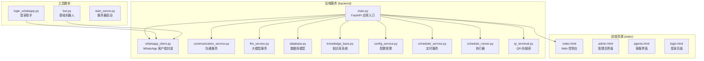
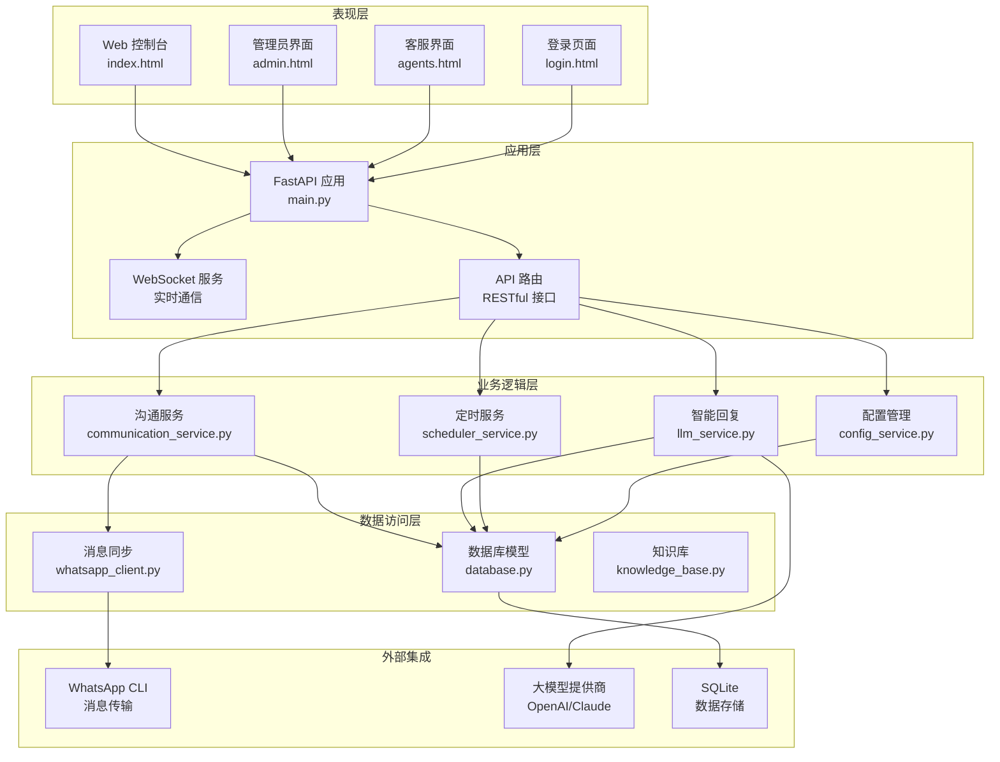
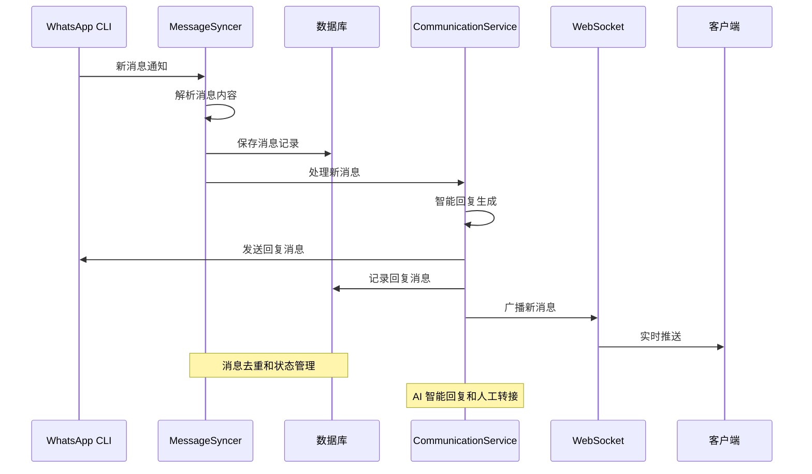
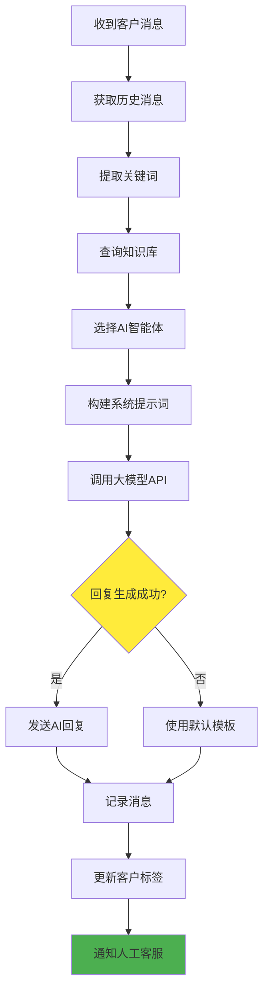
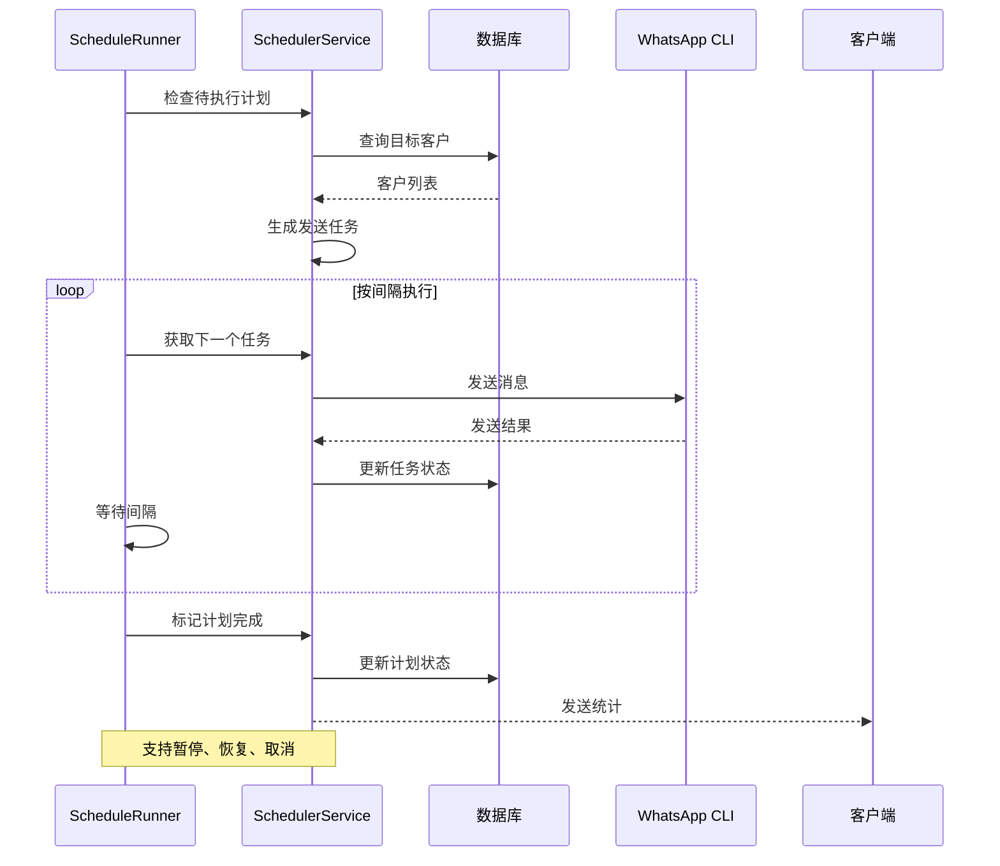
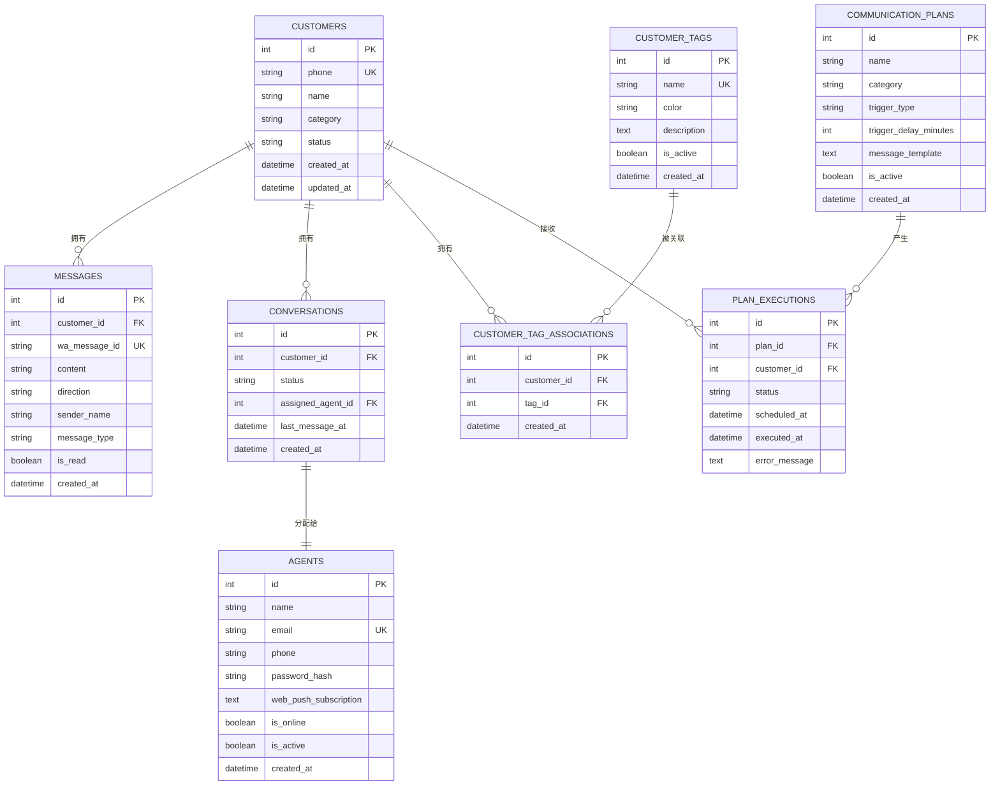
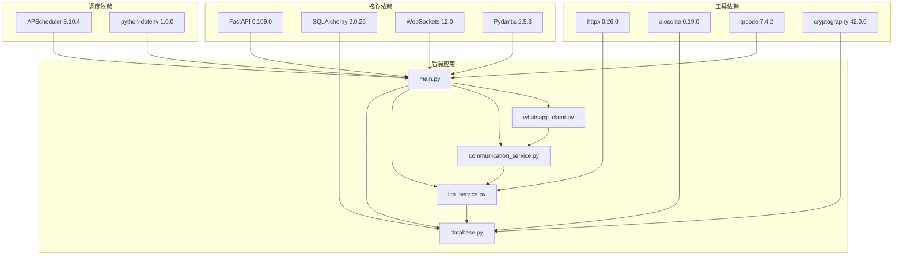

# 项目概述

<cite>
**本文档引用的文件**
- [backend/main.py](file://backend/main.py)
- [backend/whatsapp_client.py](file://backend/whatsapp_client.py)
- [backend/communication_service.py](file://backend/communication_service.py)
- [backend/llm_service.py](file://backend/llm_service.py)
- [backend/database.py](file://backend/database.py)
- [backend/knowledge_base.py](file://backend/knowledge_base.py)
- [backend/config_service.py](file://backend/config_service.py)
- [backend/scheduler_service.py](file://backend/scheduler_service.py)
- [backend/schedule_runner.py](file://backend/schedule_runner.py)
- [backend/qr_terminal.py](file://backend/qr_terminal.py)
- [backend/static/index.html](file://backend/static/index.html)
- [backend/requirements.txt](file://backend/requirements.txt)
- [requirements.txt](file://requirements.txt)
- [login_whatsapp.py](file://login_whatsapp.py)
- [bot.py](file://bot.py)
</cite>

## 目录
1. [项目简介](#项目简介)
2. [项目结构](#项目结构)
3. [核心组件](#核心组件)
4. [架构总览](#架构总览)
5. [详细组件分析](#详细组件分析)
6. [依赖关系分析](#依赖关系分析)
7. [性能考虑](#性能考虑)
8. [故障排除指南](#故障排除指南)
9. [结论](#结论)

## 项目简介

WhatsApp 智能客户系统是一个基于 WhatsApp CLI 的企业级客户关系管理系统。该项目通过 FastAPI 提供 RESTful API 接口，通过 WebSocket 实现实时通信，并集成了大语言模型实现智能回复。系统采用 Python 技术栈，结合 SQLAlchemy 进行数据持久化，实现了从消息接入、智能回复、客户管理到营销自动化的完整闭环。

### 核心价值与目标

- **智能化客户服务**：通过 AI 大模型实现自然语言理解与回复，提升客户体验
- **自动化营销**：支持定时发送、标签筛选、智能分组等营销自动化功能
- **实时协作**：提供 WebSocket 实时通信，支持人工客服与 AI 的协同工作
- **数据驱动决策**：完整的客户画像、行为分析和营销效果追踪
- **易用性**：提供直观的 Web 界面，降低使用门槛

### 技术架构理念

系统采用模块化设计，通过清晰的职责分离实现高内聚低耦合：

- **消息层**：负责与 WhatsApp CLI 的交互，实现消息的接收、发送和同步
- **业务层**：处理客户管理、会话管理、智能回复等核心业务逻辑
- **数据层**：通过 SQLAlchemy ORM 提供统一的数据访问接口
- **展示层**：基于 FastAPI 和前端静态资源提供 Web 界面
- **集成层**：通过 WebSocket 实现前后端实时通信

## 项目结构

项目采用前后端分离的架构设计，主要目录结构如下：

**图表来源**
- [backend/main.py:1-150](file://backend/main.py#L1-L150)
- [backend/whatsapp_client.py:1-50](file://backend/whatsapp_client.py#L1-L50)
- [backend/communication_service.py:1-50](file://backend/communication_service.py#L1-L50)

**章节来源**
- [backend/main.py:128-158](file://backend/main.py#L128-L158)
- [backend/requirements.txt:1-20](file://backend/requirements.txt#L1-L20)
- [requirements.txt:1-8](file://requirements.txt#L1-L8)

## 核心组件

### 1. FastAPI 应用核心

系统以 FastAPI 作为核心 Web 框架，提供了完整的 RESTful API 接口和 WebSocket 实时通信能力。

**主要特性：**
- **异步支持**：充分利用 Python 异步特性，提升并发处理能力
- **自动文档**：内置 OpenAPI 文档生成，便于调试和集成
- **类型安全**：通过 Pydantic 模型确保数据验证和序列化
- **中间件支持**：灵活的 CORS 配置和请求处理

**WebSocket 实时通信：**
- 支持多客户端连接管理
- 实时推送新消息通知
- 心跳检测机制保证连接稳定性

**章节来源**
- [backend/main.py:160-194](file://backend/main.py#L160-L194)
- [backend/main.py:128-158](file://backend/main.py#L128-L158)

### 2. WhatsApp 客户端集成

通过封装 whatsapp-cli 命令行工具，实现与 WhatsApp 的深度集成。

**核心功能：**
- **消息同步**：实时同步聊天记录到本地数据库
- **登录管理**：支持 QR 码登录和会话管理
- **联系人同步**：自动识别和同步客户信息
- **消息发送**：支持文本、图片等多种消息类型

**章节来源**
- [backend/whatsapp_client.py:13-173](file://backend/whatsapp_client.py#L13-L173)
- [backend/qr_terminal.py:14-297](file://backend/qr_terminal.py#L14-L297)

### 3. 智能回复系统

集成了大语言模型，提供智能化的客户回复能力。

**主要特性：**
- **多模型支持**：兼容 OpenAI、Claude 等多家大模型提供商
- **智能体管理**：支持多个 AI 智能体，按客户标签自动匹配
- **知识库集成**：结合企业知识库提供准确回复
- **意图分析**：识别客户意图，提供针对性回复

**章节来源**
- [backend/llm_service.py:11-286](file://backend/llm_service.py#L11-L286)
- [backend/knowledge_base.py:11-212](file://backend/knowledge_base.py#L11-L212)

### 4. 客户关系管理

提供完整的客户生命周期管理功能。

**核心功能：**
- **客户分类**：新客户、意向客户、老客户自动分类
- **标签系统**：灵活的客户标签管理，支持自动打标签
- **会话跟踪**：完整的对话历史记录和状态管理
- **人工协作**：支持人工客服接手和转交

**章节来源**
- [backend/database.py:23-297](file://backend/database.py#L23-L297)
- [backend/communication_service.py:17-512](file://backend/communication_service.py#L17-L512)

### 5. 营销自动化

强大的营销自动化功能，支持精准营销和客户维护。

**功能特性：**
- **定时发送**：支持按标签、分类筛选的定时消息发送
- **沟通计划**：预设的营销活动和客户关怀计划
- **个性化内容**：支持变量替换的个性化消息模板
- **效果追踪**：完整的发送统计和效果分析

**章节来源**
- [backend/scheduler_service.py:54-393](file://backend/scheduler_service.py#L54-L393)
- [backend/schedule_runner.py:12-142](file://backend/schedule_runner.py#L12-L142)

## 架构总览

系统采用分层架构设计，各层职责明确，耦合度低。

**图表来源**
- [backend/main.py:128-194](file://backend/main.py#L128-L194)
- [backend/communication_service.py:17-427](file://backend/communication_service.py#L17-L427)
- [backend/whatsapp_client.py:13-210](file://backend/whatsapp_client.py#L13-L210)

## 详细组件分析

### 消息同步与处理流程

系统通过消息同步器实现 WhatsApp 消息的实时处理。

**图表来源**
- [backend/whatsapp_client.py:399-433](file://backend/whatsapp_client.py#L399-L433)
- [backend/communication_service.py:47-265](file://backend/communication_service.py#L47-L265)
- [backend/main.py:178-194](file://backend/main.py#L178-L194)

### 智能回复生成流程

AI 智能回复的完整处理链路。

**图表来源**
- [backend/communication_service.py:172-265](file://backend/communication_service.py#L172-L265)
- [backend/llm_service.py:86-198](file://backend/llm_service.py#L86-L198)

### 定时营销执行流程

营销自动化的执行机制。

**图表来源**
- [backend/schedule_runner.py:35-124](file://backend/schedule_runner.py#L35-L124)
- [backend/scheduler_service.py:243-355](file://backend/scheduler_service.py#L243-L355)

**章节来源**
- [backend/communication_service.py:292-361](file://backend/communication_service.py#L292-L361)
- [backend/scheduler_service.py:108-181](file://backend/scheduler_service.py#L108-L181)

### 数据模型关系

系统的核心数据模型及其关系。

**图表来源**
- [backend/database.py:23-297](file://backend/database.py#L23-L297)

**章节来源**
- [backend/database.py:254-297](file://backend/database.py#L254-L297)

## 依赖关系分析

系统采用模块化设计，各组件间依赖关系清晰。

**图表来源**
- [backend/requirements.txt:1-20](file://backend/requirements.txt#L1-L20)
- [requirements.txt:1-8](file://requirements.txt#L1-L8)

**章节来源**
- [backend/requirements.txt:1-20](file://backend/requirements.txt#L1-L20)
- [backend/main.py:10-26](file://backend/main.py#L10-L26)

## 性能考虑

### 异步处理优化

系统充分利用 Python 异步特性提升性能：

- **异步 WebSocket**：支持大量并发连接
- **异步消息处理**：非阻塞的消息同步和回复生成
- **事件循环管理**：合理的任务调度和资源管理

### 数据库优化

- **连接池管理**：SQLAlchemy 连接池减少连接开销
- **查询优化**：合理的索引和查询策略
- **批量操作**：消息同步时的批量插入优化

### 缓存策略

- **配置缓存**：敏感配置的内存缓存
- **模型缓存**：常用查询结果的短期缓存
- **会话缓存**：WebSocket 连接状态管理

## 故障排除指南

### 常见问题诊断

**WhatsApp 连接问题：**
1. 检查 whatsapp-cli 是否正确安装
2. 验证网络连接和代理设置
3. 确认 QR 码登录流程是否完成

**API 接口异常：**
1. 检查数据库连接状态
2. 验证 API 密钥配置
3. 查看服务器日志获取详细错误信息

**WebSocket 连接失败：**
1. 确认防火墙设置允许 WebSocket 连接
2. 检查客户端网络环境
3. 验证服务器端 WebSocket 服务状态

**章节来源**
- [backend/whatsapp_client.py:82-92](file://backend/whatsapp_client.py#L82-L92)
- [backend/main.py:198-212](file://backend/main.py#L198-L212)

### 系统监控

建议监控的关键指标：
- **消息处理延迟**：从收到消息到回复发送的时间
- **WebSocket 连接数**：实时在线客服数量
- **数据库连接池使用率**：避免连接池耗尽
- **API 响应时间**：关键接口的性能表现

## 结论

WhatsApp 智能客户系统是一个功能完整、架构清晰的企业级客户关系管理解决方案。通过将 WhatsApp CLI、FastAPI、WebSocket 和大语言模型有机结合，系统实现了从消息接入到智能回复、从客户管理到营销自动化的全流程自动化。

### 主要优势

1. **技术先进性**：采用最新的异步编程和微服务架构
2. **功能完整性**：涵盖 CRM 的所有核心功能模块
3. **扩展性强**：模块化设计便于功能扩展和定制
4. **用户体验**：提供直观的 Web 界面和实时交互体验

### 发展方向

- **多渠道集成**：支持微信、钉钉等其他通讯平台
- **AI 能力增强**：引入更先进的自然语言处理技术
- **数据分析**：提供更深入的客户行为分析和预测
- **自动化程度提升**：支持更复杂的业务流程自动化

该系统为企业数字化转型提供了坚实的技术基础，能够有效提升客户服务质量，降低运营成本，提高营销效率。